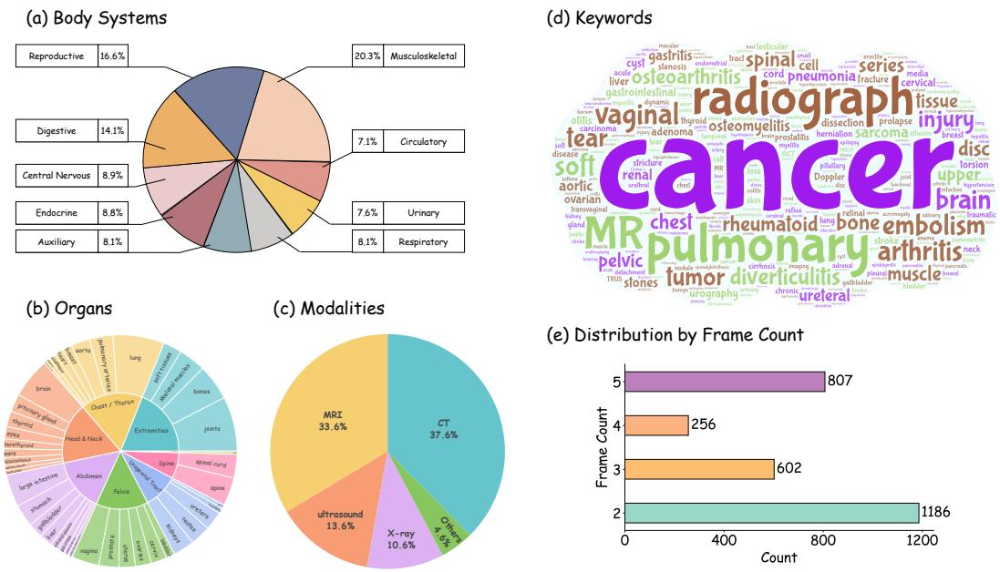
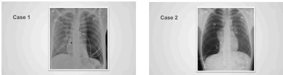
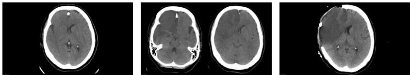
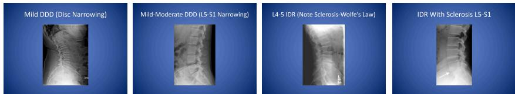
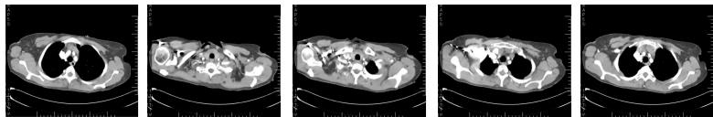

[← 返回 README](../README.md)

# Appendix

## 📌 预览
附录包含：数据分布可视化、API 成本、搜索关键词全表、器官级评测结果、完整 Prompt 模板、VQA 示例。

---

## A. Use of LLMs

We employed large language models (LLMs) in the dataset construction pipeline to refine and filter captions, identify and merge semantically related captions, and generate multi-image VQA items. We further benchmarked state-of-the-art MLLMs on MedFrameQA.

During the preparation of this manuscript, we used OpenAI's GPT-4.1 model for minor language refinement and smoothing of the writing. The AI tool was not used for generating original content, conducting data analysis, or formulating core scientific ideas.

> 💡 论文写作也用了 GPT-4.1 润色，符合现在的学术规范。

---

## B. Data Distribution

*Figure 5: Data distribution of MEDFRAMEQA. (a) body systems; (b) organs; (c) imaging modalities; (d) keyword word cloud; (e) frame counts per question.*

> 💡 **Figure 5 批读**:
> - **(a)** CNS 和 DIG 系统数据最多，REP 和 END 较少 → 数据不平衡
> - **(c)** CT 和 MRI 占主导，超声和 X-ray 次之
> - **(e)** 2 帧最多（~1200），其次是 5 帧（~800），4 帧最少（~256）
>
> 数据不平衡可能影响不同系统/模态上的评测公平性。

---

## C. API Cost

Generation of each data entry costs 5 times calling of GPT-4o API on average, depending on the number of frames involved in the data entry. Construction of 2,851 data entries costs 14,255 API calls in total.

> 💡 **成本**: 约 14,255 次 GPT-4o API 调用。按当前价格估算，约几百美元的构建成本——对 benchmark 来说很低，pipeline 可扩展。

For open-source models, we conducted three independent runs on 4×A100 GPUs and calculated error bars. Due to API quota constraints, proprietary models were evaluated only once.

---

## D. Search Keywords

> 💡 **关键词表批读**: 114 个搜索词覆盖 9 个系统、43 个器官，每个器官 2-4 个 "模态+疾病" 组合。例如：
> - brain: stroke CT, brain tumor MRI, cerebral hemorrhage CT, epilepsy EEG
> - heart: coronary artery disease angiography, heart failure echocardiography, myocardial infarction CT, cardiomyopathy MRI
>
> 覆盖面广但每个组合的数据量可能不均。

---

## E. Comparison of Organs

> 💡 **器官级结果要点**:
> - **表现最好的器官**: lymph nodes（Gemini 61.1%、Claude 77.8%）、large intestine（o4-mini 70.4%）
> - **表现最差的器官**: pancreas（多数模型 < 45%）、vagina（样本极少，o3 仅 14.3%）
> - **样本量差异大**: vagina 仅 7 条，lymph nodes 18 条 → 小样本器官的结果不可靠
>
> 揭示了 benchmark 在长尾器官上的统计不稳定性。

---

## F. Prompts

### F.1 Filter and Rephrase Captions

> 💡 **帧过滤 Prompt 要点**: 要求 GPT-4o 判断帧是否 (1) 清晰真实的医学影像 (2) ≥85% 面积是医学内容 (3) 适合 benchmark (4) 无无关人脸。同时润色字幕为规范医学描述。输出 JSON 格式。

### F.2 Transcripts Relation Check

> 💡 **相关性判断 Prompt 要点**: 给定连续帧的字幕，判断哪些在讨论同一医学主题。要求基于医学意义而非仅语言相似度分组。

### F.3 Multi-Frame VQA Pair Generation

> 💡 **VQA 生成 Prompt 要点**: 四大约束（信息接地、临床推理、跨图交互、干扰选项），要求 4-6 个选项以最大化混淆度。**关键**: 明确禁止生成纯理论知识题，必须依赖视觉特征。

### F.4 Evaluation Prompt Templates

不同模型用不同的 answer format：
- GPT/Claude/Qwen: `Answer: $LETTER`
- Gemini: `The final answer is $\boxed{LETTER}$`
- QVQ: `**Final Answer**\n\\boxed{LETTER}`

---

## G. VQA Examples

### G.1 Two Frames Example (Pneumothorax)

*Two-frame example: Left- vs right-sided pneumothorax with mediastinal shift.*

> 💡 **示例批读**: 两张 X-ray 分别显示左侧和右侧张力性气胸，需要综合两张图判断各自的侧别、严重程度和纵隔移位方向。6 个选项，很多组合需要精确判断。这是典型的"两图对比推理"题。

### G.2 Three Frames Example (Ischemic Stroke)

*Three-frame example: Acute ischemic stroke progression.*

> 💡 **示例批读**: 三张 CT 展示急性缺血性卒中的不同方面——弥漫性低密度、血管区域定位、术后状态。需要综合判断病因、分期和并发症。

### G.3 Four Frames Example (Disc Degeneration)

*Four-frame example: L4-5 disc degeneration features.*

### G.4 Five Frames Example (CT Angiography)

*Five-frame example: CT angiography anatomical landmarks.*

> 💡 **示例总体评价**: 示例质量不错，问题确实需要跨图综合。但选项数量多（5-6 个），选项之间的差异有时很细微（如左 vs 右、有无纵隔移位），对临床知识要求高。

---

## 🔖 Section 总结

### 核心洞察
1. **Prompt 工程是 pipeline 的核心**: 帧过滤、字幕润色、相关性判断、VQA 生成都有精心设计的 prompt
2. **数据不平衡**: 系统/器官/模态分布不均，长尾器官样本极少
3. **VQA 质量**: 从示例看质量不错，确实需要跨图推理，选项设计有区分度
