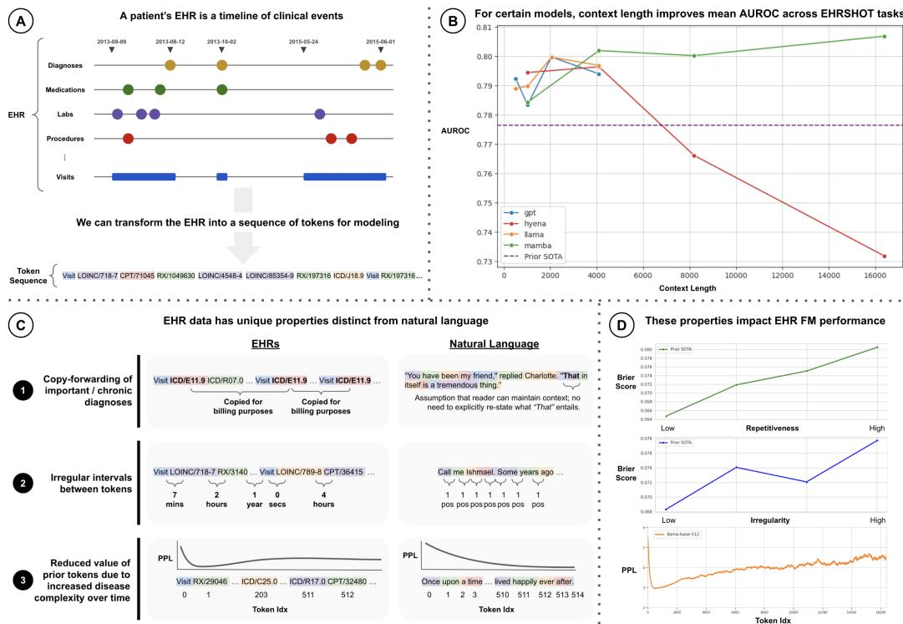

[← 返回 README](../README.md)

# 1. Introduction

## 📌 预览
介绍 EHR 作为序列数据的建模范式，指出 512 token 上下文窗口的瓶颈，提出三个 EHR 独特属性，并概述论文三大贡献。

---

Foundation Models (FMs) (Bommasani et al., 2021) trained on Electronic Health Records (EHRs) have achieved state-of-the-art results on numerous clinical prediction tasks (Odgaard et al., 2024; Yang et al., 2023). Such models can improve patient outcomes via early detection of disease and risk stratification (Steinberg et al., 2023). As an EHR is simply a list of chronologically-ordered clinical events (see Figure 1a), it can be modeled as a sequence of tokens. Instead of subwords or image patches, however, tokens represent clinical events like diagnoses and procedures (McDermott et al., 2023). This approach has enabled the application of transformer architectures originally developed for natural language processing (NLP) such as BERT (Rasmy et al., 2021; Li et al., 2020; Odgaard et al., 2024) and GPT (Steinberg et al., 2021; Pang et al., 2024; Kraljevic et al., 2024) to EHR data.

> 💡 **EHR = 序列**: 将患者的医疗记录视为时间有序的 token 序列，每个 token 代表一个临床事件（诊断、用药、检查等），这让 NLP 的 Transformer 架构可以直接迁移。

---

A critical choice in FM design is context length – i.e. how many tokens of input the model can ingest. Longer context lengths have shown a consistent positive impact on FM performance across various domains by enabling models to reference and reason over more information (Xiong et al., 2023). Given the typical hospital's limited compute resources, however, transformer-based EHR FMs have been limited to processing short context lengths (i.e., 512 tokens) due to the quadratic scaling of attention with input length (Vaswani et al., 2017). As a single patient's EHR can contain 10k's of tokens, this greatly limits the amount of data that EHR FMs can consider. This is especially true for the sickest patients – i.e. the ones of most interest to a hospital for prediction tasks – as they typically have high healthcare utilization and thus have very long timelines, as can be seen in the CDF plots of patient sequence length in Appendix Figure 6.

> 💡 **核心矛盾**: 
> - 患者 EHR 平均 1,364 个事件，最长可达 890k
> - 现有 EHR FM 大多只能处理 512 tokens
> - 最需要预测的重病患者恰恰拥有最长的 EHR
> - 这就像 agent 只能记住最近 5 分钟的对话——远远不够

*Figure 1: The central claims of this paper. (a) EHRs are sequences of clinical events. (b) Long context improves performance: Mamba at 16k achieves highest average AUROC. (c) EHR data has distinct properties: copy-forwarding, irregular time intervals, disease progression. (d) These properties present unique modeling challenges.*

> 💡 **Figure 1 批读**:
> - **(a)** 展示 EHR → token 序列的映射，直观
> - **(b)** 核心结果图：Mamba（绿色）随上下文增长持续提升，Hyena（红色）在 4k 后急剧下降，GPT（蓝色）不稳定，Llama（橙色）温和提升
> - **(c)** 三个 EHR 独特属性的示意图
> - **(d)** 属性对性能的量化影响：重复性↑ → Brier↑，不规则性↑ → Brier↑，token 位置↑ → perplexity↑

---

Recently developed subquadratic architectures such as Mamba (Gu & Dao, 2024) and Hyena (Poli et al., 2023a) that are optimized for long contexts offer a potential solution. As EHR FMs begin driving real-world care decisions, it is essential to better understand the implications of adapting these long context architectures for clinical prediction making.

However, their effectiveness on EHR data remains unclear. In contrast to natural language, EHR data exhibits specific types of token repetition and noise that complicate the expected benefits of longer contexts. We identify and present the first quantitative analysis of three such underexplored properties, as outlined in Figure 1c:

1. **Copy-forwarding** — key diagnoses are repeated across multiple visits due to billing practices, leading to artificial repetition of tokens in the EHR (Thornton et al., 2013).
2. **Irregular time intervals between tokens** — unlike in natural language where consecutive tokens are trivially 1 position apart, consecutive clinical events can be days or years apart, thus creating a wide range of timescales within a single context (McDermott et al., 2023).
3. **Disease progression** — later tokens in a patient's timeline are harder to predict as disease complexity tends to increase with age (Fabbri et al., 2015), even when conditioning on prior tokens; this contrasts with natural language, in which later tokens in a prompt tend to exhibit lower perplexities (Peng et al., 2023b).

> 💡 **三个属性的统一视角**: 这三个属性本质上都在说一件事——EHR 数据不是自然语言，不能简单套用 NLP 的假设。
> - Copy-forwarding = 信号冗余（SNR 降低）
> - Irregular intervals = 时间维度的非均匀采样
> - Disease progression = 信息熵随时间增长（与 NLP 的 perplexity 下降趋势相反）

---

While several papers have introduced transformer-based EHR FMs, they typically only evaluate at a single context length of 512 tokens, as shown in Table 1. Evaluations of subquadratic architectures on EHR data have also been limited to one context length and do not consider "longitudinal" (i.e. full-length) EHRs (Fallahpour et al., 2024). To our knowledge, there has been no systematic evaluation of the impact of context length on state-of-the-art transformer and non-transformer architectures trained on longitudinal EHR data for clinical prediction tasks.

> 💡 **Research Gap**: 之前的工作（见 Table 1）几乎都只用 512 token，唯一用 Mamba 的 EHRMamba 也只到 2048 且仅在 ICU 数据上。本文是首次在 longitudinal EHR 上系统评估 512→16k。

---

To address these gaps in the literature, our paper makes the following three contributions:

• **State-of-the-art (SOTA) Clinical Prediction Making with Subquadratic Architectures**: We train and evaluate two transformer-based – GPT (Brown et al., 2020) and Llama (Team, 2024) – and two subquadratic – Mamba (Gu & Dao, 2024) (state space models) and Hyena (Poli et al., 2023a) (long convolutions) – architectures. We are among the first to train the latter three at the scale of millions of patients' EHRs. We achieve SOTA AUROC scores on 9/14 tasks from the EHRSHOT clinical prediction benchmark using a Mamba-based model. These results highlight the potential for subquadratic models to process EHR data.

• **Increased Performance with Longer Contexts**: We evaluate the impact of context length (ranging from 512 to 16k tokens) on 14 clinical risk prediction tasks. As shown in Figure 1b, model performance tends to increase with longer contexts (with the exception of Hyena, whose performance degrades sharply). While we observe smaller gains than in other fields, these results represent a first step towards improved clinical prediction making by leveraging larger amounts of medical history.

• **Quantifying Difficulties in Modeling EHRs v. Natural Language**: Beyond AUROC, we measure how 3 EHR-specific properties — copy-forwarding, irregular inter-token time intervals, and disease progression — impact models at different context lengths. As shown in Figure 1d, these EHR-specific properties negatively correlate with model performance, e.g., patients with the most irregular timelines achieve a Brier score 14% worse than patients with the least irregular timelines. However, we find that longer context models are more robust to patients exhibiting higher degrees of these properties.

> 💡 **贡献总结**:
> 1. Mamba-16k EHRSHOT SOTA（9/14 任务）
> 2. 首次系统评估上下文长度 512→16k 的影响
> 3. 首次量化分析 3 个 EHR 独特属性对模型的影响
> 
> 值得注意的是，Hyena（长卷积架构）在长上下文时性能反而急剧下降，说明并非所有亚二次架构都适合 EHR 数据。

---

Our work aims to realize the benefits of long context models in healthcare. More broadly, as sequence modeling architectures designed for natural language are increasingly applied to external domains such as molecular sequences (Nguyen et al., 2023a; 2024), climate (Bodnar et al., 2024; Nguyen et al., 2023b), and time series (Cohen et al., 2024), we hope our analysis serves as a general blueprint for taking a data-centric lens on adapting such models for non-NLP domains. We release the full weights of our pretrained models on HuggingFace and our code at the Github repo here: https://github.com/som-shahlab/long_context_clues

> 💡 **更广泛的意义**: 论文不仅关注 EHR，还希望成为"NLP 架构迁移到非 NLP 领域"的蓝图。核心思想：迁移架构时要分析目标领域数据的独特属性，不能假设 NLP 的规律仍然成立。

---

## 🔖 Section 总结

### 核心洞察
1. EHR 是自然的序列数据，但现有模型受限于 512 token 窗口
2. 最需要预测的重病患者恰恰有最长的 EHR，窗口限制影响最大
3. 三个 EHR 独特属性使得长上下文的效果不如在 NLP 中那么直观
4. Mamba（SSM）和 Llama（带 RoPE 的 Transformer）受益于长上下文，但 Hyena（长卷积）在 4k 后崩溃
