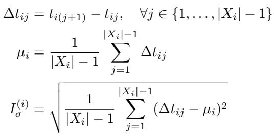

[← 返回 README](../README.md)

# 2. Background

## 📌 预览
EHR FM 的现状（Table 1 汇总）、长上下文架构的发展、以及与本文的定位差异。

---

In this section, we motivate the application of long-context foundation models to electronic health record data and summarize related work.

## 2.1 Foundation Models for EHRs

Foundation Models (FMs) are large-scale deep learning models trained on extensive amounts of unlabeled data via unsupervised learning (Bommasani et al., 2021). An electronic health record (EHR) provides comprehensive documentation of patient interactions with the healthcare system, including diagnoses, medications, procedures, lab results, etc. (Ambinder, 2005). In this work, we only consider structured EHR data – i.e. we ignore notes and images – as structured EHR data is simpler to deidentify and thus share with the community for open science (Negash et al., 2023).

> 💡 **范围限定**: 只用结构化 EHR 数据（诊断码、药物、检查等），不用临床笔记和影像。原因是结构化数据更容易脱敏共享。这也意味着结果可能低估了多模态 EHR 的潜力。

As seen in Table 1, many architectures for sequence modeling have been re-applied to EHR data. Most utilize transformer-based architectures such as BERT (Devlin et al., 2019) or GPT (Brown et al., 2020) with a context length of 512. Pretrained on millions of EHRs using objectives such as causal or masked language modeling, these EHR FMs are state-of-the-art on many clinical prediction tasks (Yang et al., 2023; Odgaard et al., 2024; Wornow et al., 2023).

*Table 1: Comparison to prior work on sequence modeling for EHR data*

> 💡 **Table 1 批读**:
> - 绝大多数 EHR FM 用 BERT 或 GPT，上下文 ≤512
> - 只有 UniHPF/GenHPF 到 8192，但用的是 Custom 架构
> - EHRMamba 是唯一用 Mamba 的，但只到 2048 且限于 ICU
> - **本文**：512-16k，4 种架构（GPT/Llama/Mamba/Hyena），首次系统评估

---

## 2.2 Long Context FMs

Context length is the number of input tokens that a model can ingest. Longer contexts have shown to positively impact FM performance by enabling models to reason over more information (Xiong et al., 2023). Token-level perplexity typically decreases as context length increases, reflecting improved model comprehension of longer sequences (Press et al., 2022; Chen et al., 2023; Peng et al., 2023b).

Theoretically, conditioning on more of a patient's medical history should also enable better clinical decisions. Unfortunately, transformers scale quadratically with context length (Vaswani et al., 2017), which makes processing long sequences computationally expensive. This is an especially important consideration for resource-constrained hospitals hoping to deploy such models. To remedy this, subquadratic architectures optimized for processing longer contexts have been proposed (Tay et al., 2020; Wang et al., 2024). They replace the O(n²) attention mechanism in transformers with linear or log-linear alternatives such as state space models (Gu & Dao, 2024; Goel et al., 2022), long convolutions (Poli et al., 2023a), linear attention (Peng et al., 2023a; Katharopoulos et al., 2020), or recurrent subunits (De et al., 2024). Despite strong results in NLP (Xu, 2024) and biology (Nguyen et al., 2023a), these architectures remain largely untested on EHR data.

> 💡 **亚二次架构分类**:
> - **SSM (State Space Models)**: Mamba — 将序列压缩为固定维度的隐状态，线性复杂度
> - **Long Convolutions**: Hyena — 用隐式长卷积替代 attention，对数线性复杂度
> - **Linear Attention**: RWKV 等 — 线性化注意力机制
> - **Recurrent**: Griffin 等 — 门控线性递归 + 局部 attention
> 
> 这些架构在 NLP 和生物序列上已有成功案例，但在 EHR 上几乎空白。

---

## 2.3 Related Work

The impact of context length on EHR FMs for clinical prediction tasks remains largely unexplored. Many papers have evaluated the trade-offs of BERT (Odgaard et al., 2024; Rasmy et al., 2021; Li et al., 2020) and GPT-based (Kraljevic et al., 2024; Pang et al., 2024) architectures on EHR data. However, they typically only consider one context length up to 512 tokens. In contrast, our work examines the impact of multiple context lengths up to 16,384 tokens.

These works also do not consider state-of-the-art subquadratic architectures. To our knowledge, only one work – EHRMamba (Fallahpour et al., 2024) – has done so. However, the authors only consider a single context length of 2048, and do not train or evaluate on longitudinal (i.e. full-length) EHRs, instead focusing on the more limited ICU setting. In contrast, our work evaluates Mamba (Gu & Dao, 2024) on 8x longer context lengths and longitudinal EHR tasks.

Several studies have combined fixed context window transformers with a preliminary retrieval step that selects the most relevant events across a patient's entire timeline (Kim et al., 2023; Zhu et al., 2024). However, they only consider fixed context windows and benchmark against weaker long context models such as S4 (Gu et al., 2022) and Performer (Choromanski et al., 2022).

> 💡 **与 RAG 方法的对比**: 有些工作用 retrieval 来弥补短窗口的限制（先检索相关事件再喂给模型），但本文选择直接扩展上下文窗口。这两种方案各有优劣：
> - RAG：灵活但需要好的检索器，且可能遗漏全局模式
> - 长上下文：端到端但计算量大，且可能被噪声（如 copy-forwarding）淹没
> 
> 对 agent memory 的启示：检索式记忆 vs 全量上下文记忆的 trade-off。

---

## 🔖 Section 总结

### 核心洞察
1. EHR FM 领域几乎所有工作都限于 512 token，本文首次突破到 16k
2. 亚二次架构在 EHR 上几乎空白，只有 EHRMamba（2048，ICU only）
3. RAG 式检索方法是替代方案，但本文选择直接扩展上下文
