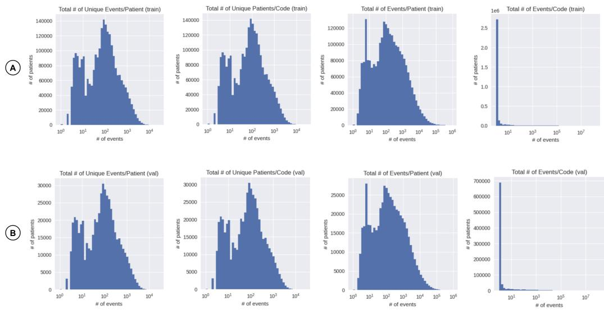
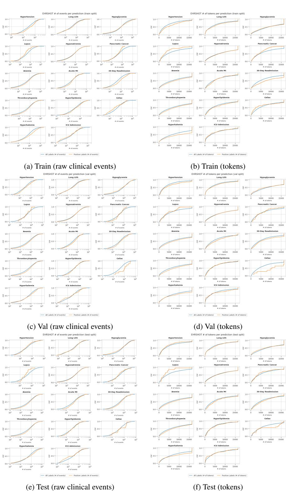
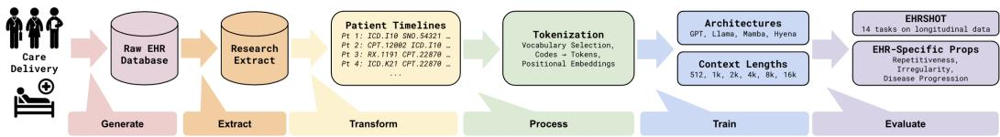
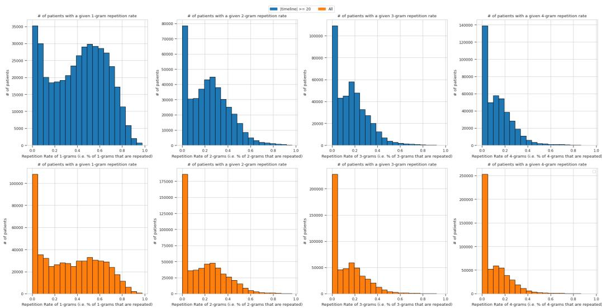
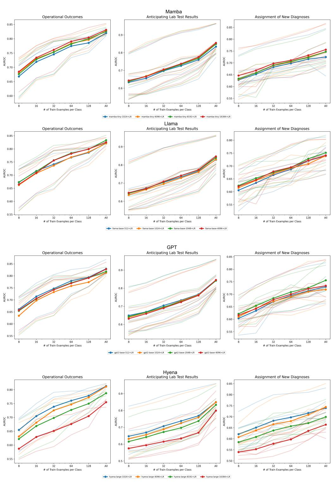
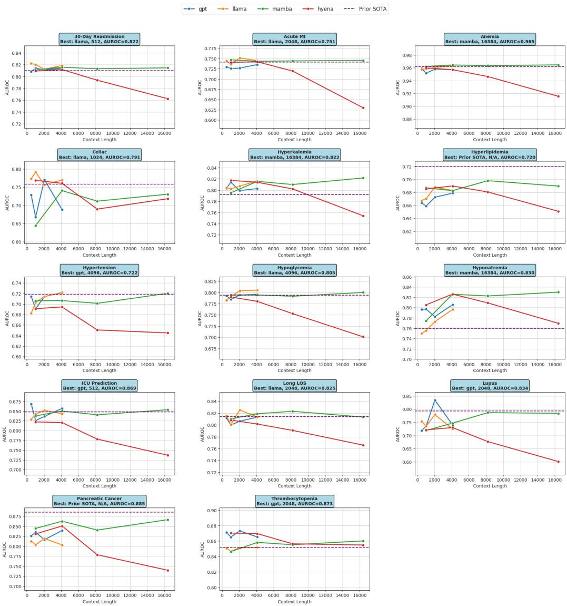
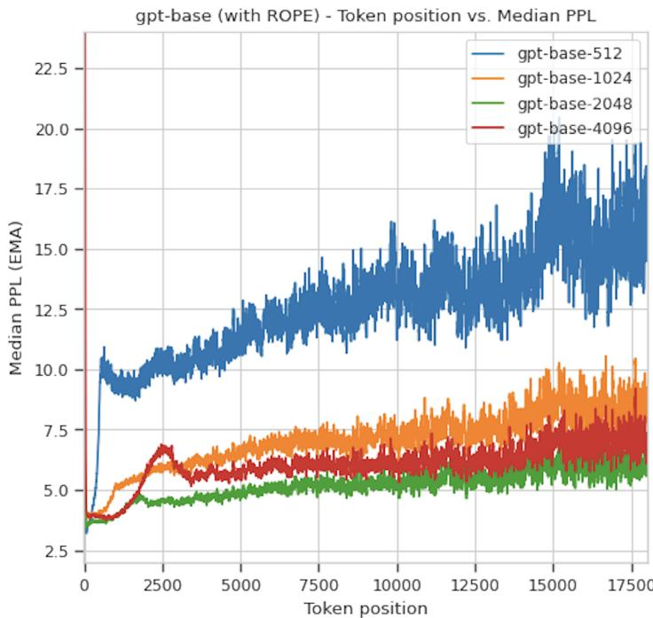
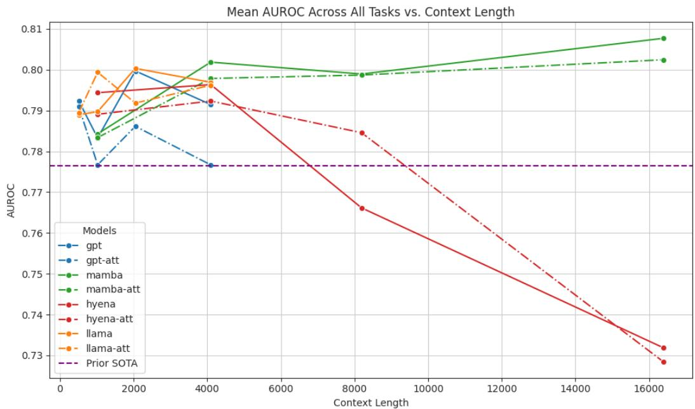

[← 返回 README](../README.md)

# Appendix

## 📌 预览
包含数据集详情、评估细节、4 种架构的数学公式、训练配置、EHR 属性指标定义、Few-shot/Zero-shot 结果。

---

## A. Dataset (EHR-OMOP)

- 来源：Stanford 学术医学中心，去标识化纵向 EHR
- 格式：OMOP Common Data Model
- 训练集：2.5M 患者，3.5B 事件
- 验证集：0.5M 患者，749M 事件
- 平均每患者：1,364 事件（中位数 121），237 个不重复事件

*Figure 5: Distributions of patient data from the EHR-OMOP dataset across training and validation splits.*

> 💡 **数据分布特点**: 高度长尾——中位数只有 121 个事件，但最大可达 890k。这意味着大多数患者的 EHR 其实很短（远小于 512 token），长上下文主要帮助的是那些有丰富医疗记录的患者。

---

## B. Evaluation

### B.1 Tasks

14 个二分类任务分三大类：

- **Operational Outcomes** (3): Long LOS, 30-day Readmission, ICU Transfer
- **Lab Test Results** (5): Thrombocytopenia, Hyperkalemia, Hypoglycemia, Hyponatremia, Anemia
- **New Diagnoses** (6): Hypertension, Hyperlipidemia, Pancreatic Cancer, Celiac, Lupus, Acute MI

### B.2 Evaluation Procedure

患者表征：$R_i = \text{last\_token\_embedding}(m(\{T_{i,|T_i|-L}, ..., T_{i|T_i|}\}))$

最终预测：$P_i = H(R_i)$，其中 $H$ 是 logistic regression head。

> 💡 **简单但有效**: 只取最后一个 token 的 embedding，不做 mean pooling 或其他聚合。这说明 autoregressive 模型的最后一个 token 确实能捕获整个序列的信息。

### B.3 Patient Statistics

*Figure 6: CDF of clinical events and tokens preceding each prediction time for EHRSHOT tasks.*

> 💡 **Figure 6 批读**: 正例患者（橙色）普遍有更多 token——说明高风险患者确实有更长的 EHR，支持长上下文的必要性。

---

## C. Model Architectures

四种架构的数学公式（详见 full.md），关键区别：

| 架构 | 核心操作 | 复杂度 | 位置编码 |
|------|---------|--------|---------|
| GPT | Scaled dot-product attention | O(n²) | Absolute |
| Llama | Attention + RoPE | O(n²) | RoPE |
| Mamba | State space model: $x_{t+1} = Ax_t + Bu_t$ | O(n) | 无 |
| Hyena | Implicit long convolution + gating | O(n log n) | Hyena PE |

> 💡 **Mamba 的 SSM 公式**: $x_{t+1} = Ax_t + Bu_t$, $y_t = Cx_t + Du_t$。本质上是一个线性递归系统，隐状态 $x_t$ 是对整个历史的固定维度压缩——这就是 **latent memory**！与 MemGen 中的隐式记忆有异曲同工之妙。

---

## D. Tokenization

- 数值型：按十分位分桶
- 分类型：每个值一个 token
- 词表：top 39,811 by information content + 7 special tokens = 39,818
- 位置编码：各架构默认策略

ATT (Artificial Time Tokens)：在就诊间插入 D1-D6, W1-W4, M1-M12, LT 等时间标记，但实验表明无效（Appendix Figure 12）。

---

## E. Training

| 配置 | 值 |
|------|-----|
| 优化器 | AdamW (β1=0.9, β2=0.95, λ=0.1) |
| 学习率 | 2e-4 |
| Warmup | 40,000 steps |
| LR 衰减 | → 1e-5 |
| 总训练量 | 2B tokens |
| Gradient accumulation | 65,536 tokens/step |
| 硬件 | V100 为主, 有限 H100/A100 |

*Figure 7: High-level overview of the experimental pipeline.*

---

## F. EHR-Specific Property Metrics

### F.1 Repetitiveness

n-gram 重复率：$RR_n(x) = \frac{\sum_{u \in \mathcal{U}(x)} \mathbb{I}[C(u,x) > 1]}{|\mathcal{U}(x)|}$

*Figure 8: n-gram repetition rates with patients filtered to ≥20 events (top, blue) vs all patients (bottom, orange).*

> 💡 **Figure 8 批读**: 过滤掉短记录患者后，EHR 的高重复性更加明显。有"meaningful"长度记录的患者 1-gram RR 大多在 60-100%。

### F.2 Irregularity

标准差：$I_\sigma^{(i)} = \sqrt{\frac{1}{|X_i|-1} \sum_{j=1}^{|X_i|-1} (\Delta t_{ij} - \mu_i)^2}$

### F.3 Disease Progression

Perplexity by position：$\text{Perplexity}(x) = \exp(-\frac{1}{N} \sum_{i=1}^N \log P(x_i | x_{<i}))$

使用 20,000 患者样本，sliding window 32 tokens，median perplexity + EMA 250 positions 平滑。

---

## G. Few-Shot Results

*Figure 10: Few-shot AUROC scores by model and context length across all task groups.*

> 💡 **Few-shot 发现**: Mamba-16k 在所有 k-shot 设置下都表现最佳。长上下文在低资源场景（k=8,16）同样有帮助。

---

## H. Zero-Shot Results

Zero-shot 方法：为每个患者生成 20 个合成 timeline，计算正事件出现的百分比作为概率。

> 💡 **Zero-shot 失败**: 所有模型都不如 CLMBR-t-base。说明 autoregressive 预训练的表征需要至少少量标注数据才能有效迁移到下游任务。

---

## Key Appendix Figures

*Figure 9: AUROC by context length and architecture across all 14 EHRSHOT tasks.*

> 💡 **Figure 9 批读**: 逐任务看，Mamba-16k 在大多数任务上最佳，但 Celiac 和 Lupus 任务波动较大（可能因为样本量太小：Celiac 仅 21 个正例）。

*Figure 11: GPT with RoPE (replacing absolute PE) — perplexity spikes disappear.*

*Figure 12: ATT tokens (dotted lines) vs no ATT (solid lines). ATT slightly hurts performance.*

---

## 🔖 Appendix 总结

### 核心洞察
1. 数据高度长尾：中位数 121 事件，长上下文主要帮助"重度用户"
2. Mamba 的 SSM 本质上是 latent memory——固定维度的隐状态压缩整个历史
3. Few-shot 场景下长上下文同样有效
4. Zero-shot 表现差，需要至少少量标注
5. GPT → Llama（RoPE）可以消除 perplexity 尖刺
