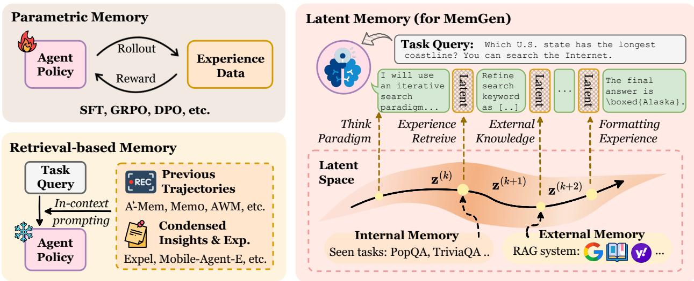

[← 返回 README](../README.md)

# 1 Introduction

The ascent of Large Language Model (LLM)-powered agents marks a paradigm shift across diverse domains (Luo et al., 2025b; Yang et al., 2024b; Qian et al., 2025; Singh et al., 2025; Pantiukhin et al., 2025; Ren et al., 2025). Pivotal to this success is the concept of agent memory (Zhang et al., 2024b; Wu et al., 2025b), which enables LLM agents to learn progressively from environmental interactions (Zhang et al., 2025a; Qiu et al., 2025b). Crucially, this conception of agent memory extends beyond that of conversational agents (i.e., personalized memory (Wu et al., 2025b)), whose primary role is to sustain coherence across long-horizon, multi-turn dialogues (Chhikara et al., 2025; Xu et al., 2025a; Packer et al., 2024; Zhong et al., 2023). Rather, the scope of this paper is primarily on enabling agents to internalize experience, simulate human-like cognitive iteration, and progressively enhance problem-solving competence (Gao et al., 2025).

> 💡 **Agent Memory vs. Conversational Memory**：作者特别区分了"Agent 记忆"（用于提升问题解决能力）和"对话记忆"（用于多轮对话连贯性），这个区分很重要——Mem0、MemGPT 等主要解决后者，而本文关注的是前者。

The memory serving as this self-evolving engine typically manifests in two dominant paradigms. The first is (I) parametric memory, which internalizes experiences by directly updating agents' parameters (Yao et al., 2024; Zeng et al., 2023; Chen et al., 2024b, 2025). While this approach can yield substantial performance gains, its reliance on parameter modification inevitably entails catastrophic forgetting, i.e., the erosion of general knowledge (Dou et al., 2024). Conversely, the second paradigm is (II) retrieval-based memory, which externalizes past experiences into a structured database, such as (i) raw trajectories (Luo et al., 2025a; Zhang et al., 2025a; Zhao et al., 2024), (ii) high-level experiences (Zhao et al., 2024; Fang et al., 2025; Wang et al., 2024c), and (iii) condensed skills like reusable APIs (Zheng et al., 2025) or MCP boxes (Qiu et al., 2025b,a). Although this non-invasive approach circumvents catastrophic forgetting, its efficacy is fundamentally tethered to context engineering. It adheres to a rigid execution pipeline, providing retrieved context to the agent without achieving the fluid, seamless integration characteristic of truly internalized memory (Su et al., 2025b).

> 💡 **两大范式的困境总结得很清晰**：
> - **参数记忆** = 改权重 → 灾难性遗忘
> - **检索记忆** = 查数据库 → 刚性流水线，无法与推理"融为一体"
>
> 这两个问题都是实际中反复碰到的，MemGen 的切入点很准。

> **Figure 1** The comparison among parametric memory, retrieval-based memory and MemGen. We drew inspiration from the layout presented in Figure 1 of Li et al. (2025a).

Given these deficiencies, latent memory offers a compelling alternative, leveraging latent states as a machine-native, high-density medium for memory. Existing approaches either use the (i) key-value (KV) cache to maintain dynamic memory set (Gim et al., 2024; Jin et al., 2024; Hongkang Yang et al., 2024), yet which is primarily confined to addressing long-context issues, or (ii) latent token embeddings to store agent experiences (Wang et al., 2024b, 2025a), which still rely on invasive LLM parameter updates. LatentSeek (Li et al., 2025a) and SoftCoT (Xu et al., 2025b,c) similarly belong to this category, utilizing latent embeddings to steer agent generation. Nevertheless, all these methods diverge from human cognition in two critical dimensions: they lack the seamless interleaving of reasoning and memory, a process where thought and memory dynamically reshape one another, and remain largely retrieval-based, fetching memories by embedding similarity (Wang et al., 2024b) rather than generatively reconstructing them into novel, coherent insights.

> 💡 **Latent Memory 的前人工作盘点**：KV cache 方式（Prompt Cache, RAGCache）解决的是长上下文问题；MemoryLLM/M+ 用 latent tokens 但仍需改 LLM 参数；LatentSeek/SoftCoT 用 latent embeddings 引导生成但缺乏"生成式重构"。MemGen 与它们的核心区别是两点：(1) 推理与记忆交织（interleaving），(2) 生成式而非检索式。

This leads to our pivotal research question:

**How can we architect agent memory as a dynamic cognitive faculty, capable of fluid, reconstructive processes that interweave seamlessly with reasoning?**

To address this challenge, we introduce MemGen, a dynamic and generative memory framework designed to endow any LLM agent with a more human-esque cognitive faculty. At its core, MemGen continuously monitors an agent's cognitive state, enabling it to dynamically invoke a generative process that synthesizes a bespoke latent memory at any critical juncture during its reasoning process. Practically, MemGen comprises two synergistic components: a reinforcement learning (RL)-trained ♣ **memory trigger**, which acts as a metacognitive monitor to discern the opportune moments for explicit memory invocation; and a ♠ **memory weaver**, which takes the agent's current state as a stimulus to draw upon relevant implicit parametric memory (potentially augmented with externally retrieved information) and then reconstructs this synthesis into a succinct, machine-native latent memory. With the reasoning core fixed, MemGen inherently mitigates catastrophic forgetting when exposed to new data, and, moving beyond the static and extractive paradigm of prior memory systems, equips agents with a fluid, generative faculty deeply integrated with reasoning cores.

> 💡 **MemGen 的设计哲学**：core LLM (reasoner) 完全冻结，所有经验知识只进 memory weaver 的 LoRA 参数——这是避免灾难性遗忘的关键。Memory trigger 则用 RL 学习"何时需要回忆"，类似人类的元认知监控。这种分离设计让框架对 backbone 无关（agnostic），理论上可以给任何 LLM 加装。

**Experimental Observation.** Extensive experiments across nine benchmarks and four baseline categories demonstrate that MemGen delivers:
- ❶ **substantial performance gains**, with improvements of up to 31.7% on ALFWorld (Shridhar et al., 2021) and 27.1% on KodCode (Xu et al., 2025d) with Qwen3-8B, surpassing parametric memory (REINFORCE++, +5.8%) and the GRPO method (+5.32%);
- ❷ **strong cross-domain generalization**, where training in the math domain not only avoids degradation elsewhere but also boosts performance in science reasoning (+6.06%) and code generation (+5.1%);
- ❸ **continual learning ability**, maintaining stable performance in previously trained domains even after fine-tuning on three additional ones.

> 💡 **跨域泛化是最 impressive 的发现之一**：在 GSM8K 上训练后，GPQA (+6.06%) 和 KodCode (+5.1%) 都有提升——说明 memory weaver 学到的不是 domain-specific 的技巧，而是更通用的"如何利用记忆辅助推理"的能力。

**Analysis & Interpretation.** Beyond quantitative evaluation, we sought to interpret the learned behavior of MemGen. Through post-hoc interventions examining the impact of removing specific latent memory on different agent failure modes, we found that MemGen implicitly evolves a human-like memory hierarchy without any external guidance, including:
- ❶ **planning memory**, where certain latent tokens specifically support high-level task planning,
- ❷ **procedural memory**, where some latent memory tokens facilitate the agent's recall of task-specific procedural skills, such as tool usage and answer formatting,
- ❸ **working memory**, where certain tokens help the agent maintain coherence and understanding over long contexts within a single task session.

> 💡 **自发涌现的记忆层级**：这是本文最令人兴奋的发现。没有任何显式监督信号告诉 MemGen "你应该有 planning memory"，但通过 post-hoc 消融实验，不同 cluster 的 latent tokens 确实对应了不同的认知功能。这让人联想到 Anthropic 在 interpretability 方面的发现——足够大的模型在训练中会自发形成功能分化。
