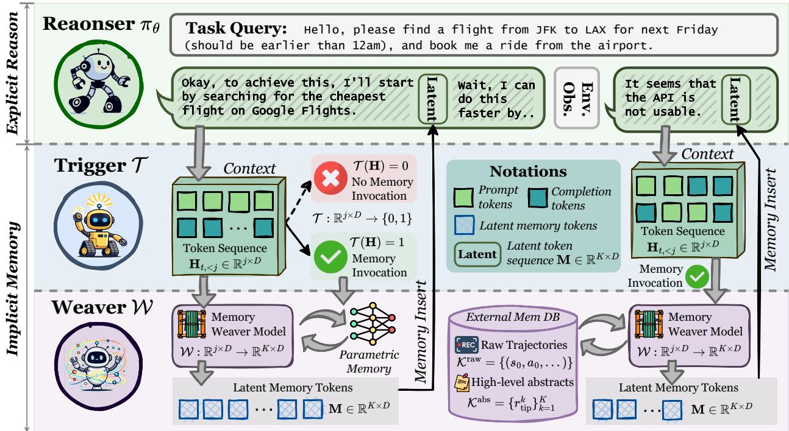

[← 返回 README](../README.md)

# 3 Preliminary

> 💡 **形式化清晰度很高**：这一节把 Agent 交互建模为 trajectory τ = (s₀, a₀, s₁, a₁, ..., sₜ)，每个 action 是 token 序列——这个粒度为后面 token-level 的 memory insertion 做好了铺垫。

**Notation.** We formalize the agent's interaction within an environment ε. An agent, powered by an LLM parameterized by θ, is denoted as πθ. For a given task **x**, the agent's interaction unfolds as a high-level trajectory, denoted as follows τ = (s₀, a₀, s₁, a₁, ..., sₜ), where sₜ represents the state of the environment and aₜ is the high-level action taken by the agent. More internally, each action aₜ is essentially a sequence of tokens, aₜ = (z_{t,1}, z_{t,2}, ..., z_{t,Lₜ}), generated autoregressively by the LLM. The generation of the j-th token is conditioned on the current state sₜ and all previously generated tokens within that action:

$$
\mathbf{z}_{t,j} \sim \pi_{\theta}\big(\cdot \mid s_t, \mathbf{z}_{t,<j}\big).
$$

> **Figure 2** The overview of our proposed MemGen.

After an entire action sequence aₜ is generated, it is executed in the environment, which transitions the state from sₜ to s_{t+1}. The success of the trajectory τ is evaluated by a reward function R(τ).

> 💡 **Figure 2 是理解全文的关键图**：左边是 frozen reasoner 的自回归生成流，memory trigger 在每个句子边界监控 hidden states，一旦决定 INVOKE，memory weaver 就生成 K 个 latent tokens 注入到 hidden states 中。整个过程完全在 latent space 完成，不产生额外的文本 tokens。

**Problem Formalization.** Given a history of past experiences H = {(xᵢ, τᵢ)}ᵢ₌₁ᴺ, the objective is to leverage this history to maximize the agent's performance on new tasks. The policy πθ and a memory system M are thus jointly optimized to maximize the expected reward over a task distribution D:

$$
\max_{\theta, \mathcal{M}} \mathbb{E}_{x \sim \mathcal{D}, \tau \sim \pi_{\theta, \mathcal{M}}} \left[ R(\tau) \right],
$$

during which M is to produce a memory representation, m, which conditions the agent's policy. The action at any timestep t is thus sampled as aₜ ~ πθ(· | sₜ, mₜ), where mₜ is the inserted memory at that step. Crucially, the nature and timing of memory generation, which we denote as the function f_M, vary across different paradigms. We express the generation of the memory mₜ as:

$$
m_t = f_{\mathcal{M}}(s_t, \mathcal{H}, m_{<t}),
$$

which accommodates diverse memory invocation granularities.

> 💡 **统一框架的精妙之处**：通过 f_M 的调用粒度来统一不同记忆方案：
> - **Task-level**（ExpeL, G-Memory）：只在 t=0 调一次
> - **Step-level**（AgentKB）：每步都调
> - **Token-level**（MemGen）：在推理过程中的任意 token 处动态决定是否调用
>
> MemGen 是最细粒度的，也最接近人类"随时想起"的认知模式。

For task-level memory (e.g., Expel (Zhao et al., 2024) and G-Memory (Zhang et al., 2025a)), f_M is invoked only at t = 0, and mₜ = m₀ for all subsequent steps. For step-level memory (e.g., AgentKB (Tang et al., 2025)), f_M is invoked at every step t to update the memory. In parametric memory, the influence of H is compiled into θ, rendering memory generation implicit in the model parameters. Our work, which introduces dynamic latent memory, focuses on designing a more fine-grained f_M that decides for itself the optimal moments to regenerate mₜ at the token level during the agent's reasoning process.
