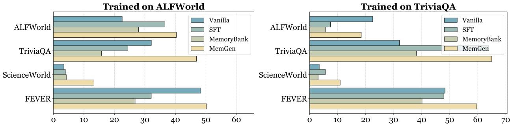
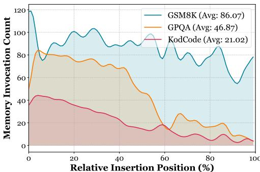
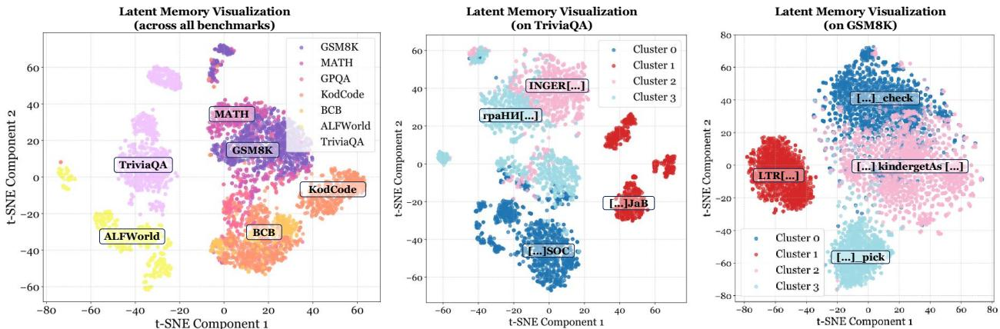
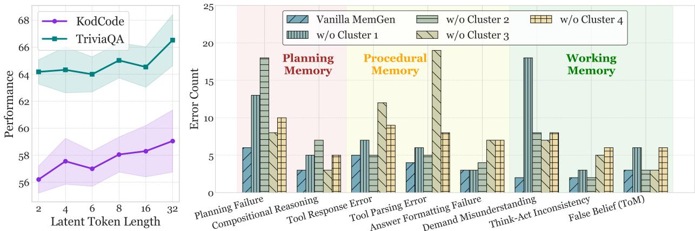

[← 返回 README](../README.md)

# 5 Experiments

In this section, we conduct extensive experiments to answer the following research questions:

- **(RQ1)** Can MemGen surpass both parametric and retrieval-based memory?
- **(RQ2)** Is the memory learnt by MemGen generalizable across task domains? And why?
- **(RQ3)** Can MemGen facilitate continual learning and mitigate catastrophic forgetting?
- **(RQ4)** Does MemGen implicitly evolve human-like memory hierarchy?

> 💡 **四个 RQ 层层递进**：RQ1 验证性能，RQ2 验证泛化性，RQ3 验证持续学习，RQ4 深入 interpretability。从"好不好用"到"为什么好用"再到"学到了什么"，逻辑链条完整。

## 5.1 Experimental Setup

**Evaluation and Benchmarks.** Our evaluation covers nine datasets from five domains, including:
- ❶ **web search**: TriviaQA (Joshi et al., 2017) and PopQA (Mallen et al., 2023);
- ❷ **embodied action**: ALFWorld (Shridhar et al., 2021);
- ❸ **math reasoning**: AQuA (Ling et al., 2017), GSM8K (Cobbe et al., 2021), and MATH (Hendrycks et al., 2021);
- ❹ **scientific reasoning**: GPQA (Rein et al., 2023);
- ❺ **coding**: KodCode (Xu et al., 2025d) and BigCodeBench (Jain et al., 2024).

**Baselines.** We compare MemGen against twelve baselines, categorized into four groups:
- **(I) Prompt-based**: Vanilla model, CoT (Wei et al., 2023);
- **(II) Parametric memory**: SFT, GRPO (DeepSeek-AI et al., 2025), REINFORCE (Williams, 1992), REINFORCE++ (Hu et al., 2025a), Agent-FLAN (Chen et al., 2024b);
- **(III) Retrieval-based memory**: MemoryBank (Zhong et al., 2023), ExpeL (Zhao et al., 2024), Agent Workflow Memory (AWM) (Wang et al., 2024c);
- **(IV) Latent computation**: SoftCoT (Xu et al., 2025c) and Co-processor (Liu et al., 2024).

> 💡 **Baseline 覆盖面很全**：四大类12个方法，包括最新的 GRPO、REINFORCE++。特别值得注意的是 SoftCoT 和 Co-processor 作为 latent computation baseline——它们是 MemGen 在技术路线上最近的竞争者。

**Implementation Details.** We select LLM backbones of varying sizes, including Qwen-2.5-1.5B (Yang et al., 2024a), HuggingFace's SmolLM3-3B (HuggingFace, 2025), and Qwen3-8B (Yang et al., 2025). The length of each latent memory sequence K is set among {2, 4, 8}. MemGen does not rely on a specific optimization algorithm, so we implement two variants: **MemGen SFT** and **MemGen GRPO**, in which the weaver is updated using SFT and GRPO signals.

---

## 5.2 Main Results

### [For RQ1] MemGen provides high-performing memory across domains.

As shown in Tables 1 and 3, existing baselines exhibit clear limitations in cross-domain adaptivity. Retrieval-based memories (e.g., ExpeL, MemoryBank, AWM) occasionally surpass parametric tuning in embodied action; for instance, AWM reaches 36.18% on ALFWorld with SmolLM3-3B, exceeding SFT by 3.15%. Yet their effectiveness deteriorates on reasoning-intensive tasks: ExpeL achieves only 8.12% on GPQA+Qwen2.5-1.5B, and even underperforms the vanilla model by 6.9% on TriviaQA, underscoring its heavy reliance on backbone capacity.

Parametric finetuning methods display the opposite tendency: they excel in structured domains such as code generation, where REINFORCE++ reaches 63.33% on KodCode with Qwen2.5-1.5B, but remain weak in knowledge-intensive reasoning, with GPQA below 14%.

> 💡 **检索记忆 vs. 参数记忆的互补弱点**：
> - 检索记忆：在 embodied action 还行，但 reasoning-intensive 任务（GPQA）崩盘
> - 参数记忆：code generation 强，但 knowledge-intensive reasoning 弱
>
> MemGen 在**所有域**都是最好或次好——这才是真正的 "universal memory"。

In contrast, MemGen consistently advances performance across all domains. For example, on ALFWorld+SmolLM3-3B, MemGen SFT and MemGen GRPO attain 50.60% and 63.60%, improving over vanilla by 31.64% and 44.64%, respectively. Similar gains appear with the larger Qwen3-8B, where MemGen GRPO achieves +27.06% on KodCode and +28.17% on PopQA, surpassing GRPO by up to 3.4%.

**Table 1** Results on SmolLM3-3B and Qwen3-8B. All values represent the performance metric for each task (e.g., accuracy %). Best and second best results highlighted.

| Backbone | Method | ALFWorld | TriviaQA | PopQA | KodCode | BigCodeBench | GPQA | GSM8K | MATH |
|----------|--------|----------|----------|-------|---------|-------------|------|-------|------|
| SmolLM3-3B | Vanilla | 18.96 | 10.47 | 8.23 | 37.05 | 35.96 | 9.35 | 47.63 | 16.22 |
| | CoT | 17.60 | 12.88 | 9.95 | 38.45 | 39.42 | 20.70 | 58.91 | 56.33 |
| | SFT | 32.36 | 55.25 | 37.22 | 59.25 | 40.79 | 19.70 | 63.48 | 45.65 |
| | GRPO | 55.35 | 65.88 | 45.16 | 68.48 | 72.44 | 22.73 | 80.03 | 61.23 |
| | REINFORCE | 53.13 | 63.20 | 46.81 | 65.53 | 67.14 | 23.44 | 82.03 | 58.75 |
| | REINFORCE++ | 53.95 | 63.20 | 44.10 | 65.90 | 68.80 | 22.73 | 81.50 | 59.89 |
| | Agent-FLAN | 34.00 | 56.70 | 39.50 | 56.80 | 37.20 | 17.80 | 59.60 | 36.84 |
| | ExpeL | 36.18 | 46.20 | 28.16 | 51.14 | 40.22 | 15.15 | 56.23 | 38.11 |
| | MemoryBank | 32.80 | 43.30 | 25.81 | 44.50 | 31.80 | 10.20 | 58.30 | 43.53 |
| | AWM | 40.50 | 49.80 | 29.60 | - | - | - | - | - |
| | SoftCoT | 35.03 | 50.38 | 34.90 | 59.20 | 39.10 | 17.22 | 56.34 | 44.62 |
| | Co-processor | 38.36 | 53.28 | 38.96 | 56.25 | 45.40 | 20.10 | 57.60 | 38.81 |
| | **MemGen SFT** | **50.60** | **68.13** | **42.34** | **62.65** | **42.99** | **26.75** | **70.42** | **57.44** |
| | **MemGen GRPO** | **63.60** | **79.30** | **58.60** | **72.85** | **74.24** | **25.20** | **83.47** | **63.65** |
| Qwen3-8B | Vanilla | 58.93 | 52.18 | 34.13 | 49.10 | 33.33 | 38.18 | 89.48 | 79.82 |
| | CoT | 57.10 | 53.80 | 33.20 | 51.25 | 35.59 | 35.15 | 87.67 | 78.24 |
| | SFT | 83.59 | 74.55 | 51.12 | 64.75 | 41.33 | 40.33 | 90.76 | 81.35 |
| | GRPO | 85.60 | 76.15 | 58.90 | 73.35 | 70.24 | 39.54 | 92.30 | 83.54 |
| | REINFORCE | 82.10 | 75.22 | 57.96 | 72.11 | 70.20 | 37.12 | 91.25 | 83.27 |
| | REINFORCE++ | 84.80 | 75.90 | 58.30 | 72.90 | 71.88 | 37.68 | 91.90 | 85.24 |
| | Agent-FLAN | 80.32 | 70.32 | 50.08 | 62.99 | 43.40 | 39.50 | 87.60 | 80.05 |
| | ExpeL | 78.97 | 65.54 | 40.33 | 57.20 | 34.23 | 35.15 | 86.20 | 77.40 |
| | MemoryBank | 70.41 | 60.56 | 41.60 | 56.39 | 40.61 | 35.66 | 90.35 | 80.35 |
| | AWM | 80.33 | 69.30 | 43.69 | - | - | - | - | - |
| | SoftCoT | 75.60 | 59.42 | 39.42 | 63.28 | 38.27 | 39.60 | 86.30 | 76.23 |
| | Co-processor | 73.28 | 61.42 | 45.55 | 64.90 | 42.19 | 39.15 | 76.23 | 79.20 |
| | **MemGen SFT** | **85.82** | **77.22** | **54.65** | **66.15** | **40.35** | **43.23** | **91.25** | **83.30** |
| | **MemGen GRPO** | **90.60** | **80.65** | **62.30** | **76.16** | **75.56** | **40.24** | **93.20** | **88.24** |

> 💡 **MemGen GRPO 几乎全线最优**：在 Qwen3-8B 上，8 个 benchmark 中 MemGen GRPO 拿了至少 6 个第一。与 GRPO 的差距在 ALFWorld (+5.0%)、KodCode (+2.81%)、MATH (+4.7%) 上尤为显著。MemGen SFT 在 GPQA 上甚至超过 GRPO (43.23% vs 39.54%)，说明 latent memory 在知识密集任务上特别有价值。

---

### [For RQ2] MemGen Exhibits Strong Cross-Domain Generalization.

To evaluate whether the memory learned by MemGen can transfer across tasks, we train MemGen on one dataset and test it on several others. We include two out-of-domain datasets, ScienceWorld (Wang et al., 2022) and FEVER (Thorne et al., 2018), to further probe this.

> **Figure 3** The generalization study of MemGen. We train MemGen SFT on one dataset (ALFWorld or TriviaQA) and evaluate it on four datasets (TriviaQA, ALFWorld, ScienceWorld, and FEVER).

As shown in Figures 3, 9 and 10, baselines such as SFT and MemoryBank achieve gains within their training domains (e.g., on ALFWorld, SFT +14.1% and MemoryBank +5.4% compared with vanilla), yet fail to generalize, with performance dropping sharply on FEVER by 16.2%. In contrast, MemGen not only attains substantial in-domain improvements (24.55% → 58.16% on KodCode, Figure 10), but also exhibits effective transfer: when trained on KodCode, performance on MATH rises from 36.6% → 54.2%.

> 💡 **泛化的核心洞察**：SFT 和 MemoryBank 在训练域外严重退化（FEVER -16.2%），但 MemGen 训练在 KodCode 上后 MATH 反而提升 17.6%——这强烈暗示 memory weaver 学到的是 domain-agnostic 的"记忆使用策略"，而非 domain-specific 知识。

### [For RQ2] The Memory Trigger Intelligently Determines When to Activate Memory Insertion.

After training MemGen on GSM8K, we evaluate 150 samples each from GSM8K, KodCode, and GPQA, visualizing the frequency with which the memory trigger invoked the memory weaver at each relative position in the model output.

> **Figure 4** Memory invocation frequency across benchmarks at inference (trained on MemGen SFT+Qwen3-8B+GSM8K).

We observe that the invocation frequency varies across domains and correlates directly with performance: GSM8K exhibits the largest improvement (+19.64%) and maximal invocations, GPQA achieves moderate gains (+6.06%) with medium invocations, and KodCode shows the smallest improvement (+3.1%) with the fewest invocations. This indicates that MemGen autonomously assesses, based on task-specific context, when memory insertion will be beneficial, invoking the weaver less frequently in unfamiliar domains.

> 💡 **Trigger 的"自知之明"**：在训练域（GSM8K）上频繁调用记忆，在远域（KodCode）上少调用——这说明 trigger 学会了评估"我的记忆对这个问题有没有用"。这是避免跨域负迁移的关键机制。

---

### [For RQ3] MemGen Effectively Mitigates Catastrophic Forgetting.

In Table 4, we sequentially train on four datasets and evaluate on all benchmarks after each stage, where MemGen exhibits stronger knowledge retention ability compared to baseline methods. For example, unlike SFT which primarily improves performance on the most recent task (54.10% on KodCode but only 2.53% on GPQA), MemGen demonstrates more balanced cross-task generalization, attaining 38.43% on AQuA and 21.72% on GPQA after GSM8K training. Finally, it mitigates forgetting on earlier tasks, preserving 40.34% on AQuA following KodCode training compared to 27.14% for ExpeL and 28.61% for SFT, indicating a more stable continual learning ability.

> 💡 **持续学习结果惊人**：顺序训练 AQuA→GPQA→GSM8K→KodCode 后：
> - SFT 在 KodCode 上 54.10% 但 GPQA 崩到 2.53%（典型灾难性遗忘）
> - MemGen 在 KodCode 上 52.95% 且 GPQA 保持 20.09%
>
> 差距的原因：MemGen 的经验只存在 weaver 的 LoRA 里，reasoner 完全不变。

---

## 5.3 Framework Analysis

Having established the expressive capabilities of MemGen, we further investigate its underlying mechanisms: what do the learned latent memories look like? Do they have specialized functions?

### [For RQ4] The Latent Memory Is Machine-Native and Human-Unreadable.

We first visualized the latent memory sequences learned by MemGen across different datasets using t-SNE.

> **Figure 5** (Left) t-SNE visualization of latent memories generated by MemGen+Qwen3-8B across datasets; (Middle and Right) Latent memory visualization within the TriviaQA and GSM8K datasets, clustered using K-means.

As shown in Figure 5 (Left), sequences from distinct domains form separate distributions, with related domains clustering closely (e.g., KodCode and BigCodeBench, GSM8K and MATH). Examining latent memories within the same dataset, we observed pronounced clustering patterns. To explore potential commonalities within these clusters, we forcibly decoded the latent tokens. Although the decoded sequences are not human-readable, they exhibit intriguing regularities: many tokens within a cluster share structural conventions. For example, Cluster 0 in TriviaQA frequently follows the pattern "[...]SOC", whereas Cluster 3 in GSM8K often adopts the format "[...]_pick".

> 💡 **"机器原生语言"**：强制解码后看到的是 "UPPORT...eniable certif"、"essengeryyyyMMddELCOME certif" 这样的乱码，但同一 cluster 内有一致的结构——说明 latent tokens 编码了某种对 LLM 有意义但人类无法直读的信息。这类似于 Anthropic 在 feature visualization 中发现的"超词汇"现象。

### [For RQ4] MemGen Implicitly Learns a Human-like Memory Hierarchy.

To uncover the functional roles of different latent memory clusters, we conducted a post-hoc intervention study. Following the taxonomy from (Song et al., 2025), we study eight distinct types of agent failure, including planning errors, tool response/parsing failures, answer formatting mistakes, etc.

> **Figure 6** (Left) Parameter sensitivity analysis on the latent memory length K; (Right) Effects of selectively removing latent memory clusters on different agent failure modes on the TriviaQA dataset.

During evaluation, we selectively removed latent tokens close to a specific cluster while keeping others intact, measuring the resulting changes in these failure modes. As shown in Figure 6 (Right), distinct memory clusters exhibit varying influence on failure modes and can be mapped to different memory functions:

- **Planning Memory** supports high-level task planning and strategic reasoning. Removal of Cluster 2 substantially increases planning and compositional reasoning failures, indicating that this cluster is crucial for guiding the LLM agent's decision-making and sequencing of reasoning steps.
- **Procedural Memory** captures task-specific operational knowledge, such as tool usage and formatting ability. Cluster 3 corresponds to this role, as its removal leads to a marked increase in tool response errors, parsing failures, and answer formatting mistakes.
- **Working Memory** manages the retention and effective use of prior context to maintain reasoning consistency. Clusters 1 and 4 contribute to this function: removing Cluster 1's memory tokens results in more frequent task misunderstandings and think-act inconsistency.

> 💡 **三层记忆层级的涌现**：
> | 记忆类型 | 对应 Cluster | 消融后增加的失败模式 |
> |---------|-------------|-------------------|
> | Planning Memory | Cluster 2 | 规划错误、组合推理失败 |
> | Procedural Memory | Cluster 3 | 工具调用错误、格式错误 |
> | Working Memory | Clusters 1 & 4 | 任务误解、思考-行动不一致 |
>
> 这与认知心理学中的记忆分类高度吻合：long-term declarative → planning, procedural → procedural, short-term → working。

Nevertheless, these memory clusters are not entirely independent: for example, removing Cluster 1 also negatively affects planning ability, indicating that these memory faculties interact and jointly enable the LLM to leverage past experience effectively. This analysis reveals that MemGen spontaneously organizes latent memory into a structured, human-like hierarchy.

**Ablation Study & Sensitivity Analysis.** We conduct a sensitivity analysis on the length of the latent memory sequence K, as shown in Figure 6 (Left). It can be observed that as the latent token length increases from 2→32, MemGen's performance correspondingly improves, likely reflecting the expanded memory capacity. We then perform an ablation study on the memory trigger module in Table 5, demonstrating the necessity of a dedicatedly trained trigger for effective memory invocation. Furthermore, we analyze different training paradigms of the memory weaver in Table 6.

> 💡 **K 的选择**：K=8 是默认值，但 K=32 时性能更好——说明更多 latent tokens = 更大的记忆容量。不过计算开销也会增加。实际使用中 K=4~8 是性价比最优的区间。

**Efficiency Analysis.** To confirm that the memory insertion process of MemGen does not introduce significant inference overhead, we show in Section D.3.3 that, while achieving up to 57.66% performance improvement over vanilla LLMs, the per-query inference delay remains consistently below the baseline, ranging from 24% to 94% of the vanilla LLM latency. This clearly demonstrates that MemGen delivers substantial performance gains without compromising efficiency.

> 💡 **推理效率反而提升**：看起来反直觉，但原因是 MemGen 让模型更快找到正确答案，减少了冗余的推理 token 生成。例如 KodCode+Qwen2.5-1.5B：vanilla 需要 11.96s，MemGen SFT 只需 2.94s（减少 75%），同时准确率从 24.55% 提升到 58.16%。
