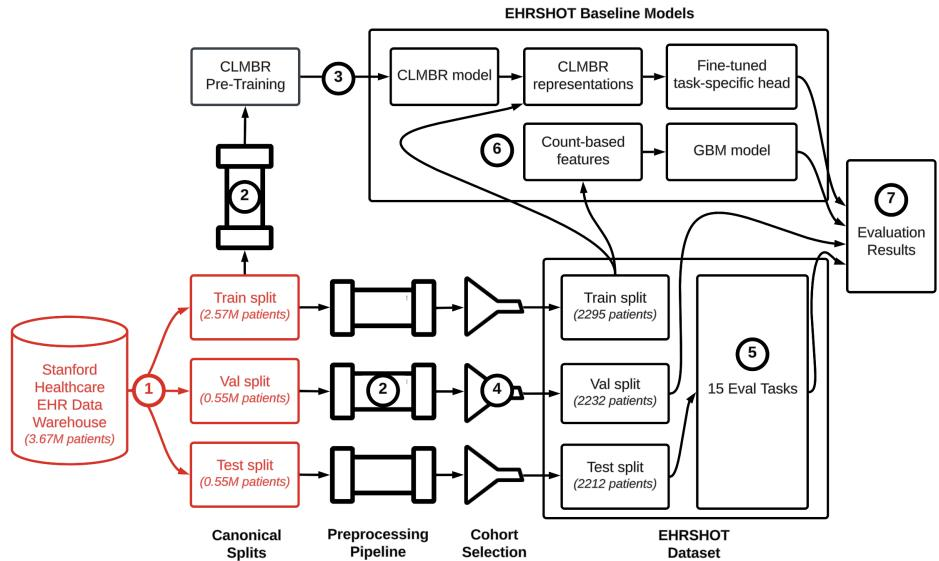

[← 返回 README](../README.md)

# 1 Introduction

## 📌 预览
展开三大痛点：(1) 缺乏公共 EHR 数据集和 FM，(2) 现有数据集局限于 ICU，(3) 现有 benchmark 不适合评估 FM 的 few-shot 能力。然后提出 EHRSHOT 的三大贡献。

---

Open datasets, code, and models have been essential in advancing machine learning (ML) over the past decade [34, 46, 19]. Though the benefits of open code and data are well known [40, 27], there is currently a dearth of publicly available datasets and pretrained models for electronic health records (EHRs), which makes conducting reproducible research challenging [38, 23].

> 💡 **痛点 1**: EHR 领域的「ImageNet moment」还没来——缺数据、缺模型、不可复现。

This is especially problematic in the era of foundation models (FMs), which hold tremendous promise for clinical applications [24]. The ability of a shared FM to generalize across health systems would be highly valuable, as most hospitals lack the computational resources to train such models [36]. Yet many of the purported benefits of clinical FMs, such as sample efficiency and task adaptability, remain difficult to evaluate due to reproducibility and data access issues [38].

> 💡 **FM 时代的新问题**: FM 的核心价值主张是「一次训练，多处迁移」，但如果没有公开权重，其他医院根本无法验证这些好处。这也是为什么 EHRSHOT 要同时发布数据和模型。

Unfortunately, most existing EHR datasets (e.g., MIMIC-III/IV [17, 16], eICU [28], AmsterdamUMCdb [45], and HiRID [6]) narrowly focus on the intensive care unit (ICU), which provides a limited snapshot of a patient's overall health trajectory and limits what tasks can be evaluated [47]. Access to a patient's complete medical timeline, referred to as "longitudinal" data, offers a more realistic representation of the breadth of information available to a health system. Longitudinal EHR data, however, remains scarce. The few public datasets that exist, such as the CPRD [11] and UK BioBank [2], lack consensus on shared evaluation tasks / data processing pipelines and require navigating a research protocol review process, which creates challenges when curating shared ML workflows [44].

> 💡 **痛点 2 - ICU 局限性**: 
> - MIMIC 系列 = ICU 快照，不反映患者完整健康轨迹
> - **Longitudinal**（纵向数据）= 患者从入院到出院到随访的完整时间线
> - CPRD/UK BioBank 虽然有纵向数据，但缺少标准化的 ML 任务定义

While the limitations of prior benchmarks were less apparent when developing small-scale, task-specific models, their utility is limited for evaluating FMs on task adaptation, few-shot learning, and other properties of large-scale, self-supervised models [1, 31]. Clinical FMs surface new questions, and a dataset for evaluating such FMs should contain a diverse range of tasks in low-label settings with longitudinal data [22]. Most importantly, such a benchmark should also release the weights of its pretrained models so the community can reproduce and build upon its results. Unfortunately, few FMs trained on EHR data have had their model weights published [49].

> 💡 **痛点 3 - Benchmark 不适配 FM**: 旧 benchmark 为 task-specific 模型设计（enough labels, single task），FM 需要的是 diverse tasks + low-label + longitudinal data。关键引用 [49] 是作者自己的 survey，指出绝大多数 EHR FM 从未公开权重。

Our work helps address both shortcomings – a lack of public EHR datasets and pretrained clinical FMs – as one of the first combined releases of a research dataset and FM trained on EHR data. We outline our three primary contributions towards more reproducible ML for healthcare below:

1. We release EHRSHOT, a longitudinal EHR benchmark for the few-shot evaluation of clinical FMs. EHRSHOT contains the full coded medical timelines of 6,739 patients from Stanford Medicine. Records include demographics, diagnoses, procedures, laboratory results, medications, and other structured data, for a total of 41.6 million clinical events across 921,499 encounters. EHRSHOT contains an average of **2.3x** more clinical events and **95.2x** more encounters per patient than MIMIC-IV [16] and, unlike the majority of existing benchmarks, includes patients not seen in the ICU or emergency department (ED).

> 💡 **贡献 1 数据量对比**: 虽然 EHRSHOT 只有 6,739 patients（MIMIC-IV 有 257k），但每个患者的数据深度碾压——2.3x events, 95.2x encounters。这反映了纵向数据的特点：少患者但每人数据极丰富。

2. We publish the weights of a 141M parameter transformer-based foundation model (CLMBR-T-base) pretrained on the deidentified structured data of 2.57M patients' EHRs. CLMBR-T-base was trained in a self-supervised manner to autoregressively predict the next code in a patient's timeline given their previous codes [42]. We are among the first to publish the full weights of such a clinical FM [49] for the community to evaluate and build upon. Researchers who leverage our model can benefit from both improved downstream task accuracy and cost savings by shortcutting the model development process.

> 💡 **贡献 2 - 预训练目标**: Next code prediction（自回归），类似 GPT 的 next token prediction，但 token = 医疗编码（诊断码、药物码、lab 码等）。在 2.57M patients 上训练（占源库 70%），模型学到了跨患者的临床模式。

3. We define a new few-shot benchmark of 15 patient classification tasks. Several tasks have naturally low prevalence, creating a realistic setting for few-shot experimentation. While our pretrained model offers significant AUROC/AUPRC gains in few-shot settings over a traditional supervised baseline, we demonstrate that there remains significant room for improvement on many of our tasks.

> 💡 **贡献 3 - 自然低标签率**: 不是人为制造的 few-shot 场景，而是某些疾病（如 Celiac、Lupus）本身就罕见。这比从大数据集 subsample 更真实。

Our overall workflow is shown in Figure 1. We publish the full code to replicate our results here: https://github.com/som-shahlab/ehrshot-benchmark. We also publish the full weights of our pretrained clinical foundation model, as well as the EHRSHOT dataset and task labels, under a non-commercial data usage agreement here: https://ehrshot.stanford.edu.

*Figure 1: Overview of EHRSHOT. Black boxes represent open source code, data, and model weights. Red boxes are private data. (1) Starting with a source EHR database of 3.67M patients, we define a global train/val/test split across all patients. (2) We use an open source EHR preprocessing package called FEMR to transform our data. We keep all structured data (diagnoses, medications, labs, etc.) and discard images and clinical text. (3) We use the 2.57M patients in our global train split to pre-train a foundation model, CLMBR-T-base. (4) We filter the source database down to a cohort of 6,739 patients, which we use for EHRSHOT. (5) We define 15 few-shot classification tasks and label each patient accordingly. (6) We test two baseline models for each task: our pretrained CLMBR-T-base and a count-based GBM model. (7) We measure the AUROC and AUPRC of each model on each task, and share the results in Section 5.*

> 💡 **Figure 1 批读**:
> - 整体是一个 **两阶段流水线**: 先在大库(3.67M)上预训练 FM → 再在小子集(6,739)上做 few-shot 评估
> - 黑色 = 公开（代码+数据+权重），红色 = 私有（源 EHR 库）
> - 关键设计：EHRSHOT 的 6,739 patients 是从预训练库中**筛选出来的**，不是独立数据源
> - FEMR（Framework for Electronic Medical Records）是他们自己开发的数据预处理库，支持 OMOP-CDM

---

## 🔖 Section 总结

### 核心洞察
1. EHRSHOT 填补了 EHR 领域 "数据+模型+任务" 三位一体的空白
2. Longitudinal vs ICU-only 是关键差异——完整时间线支持更多样的任务
3. 自然低标签率 + 公开权重 = 真正可评估 FM few-shot 价值的 benchmark
