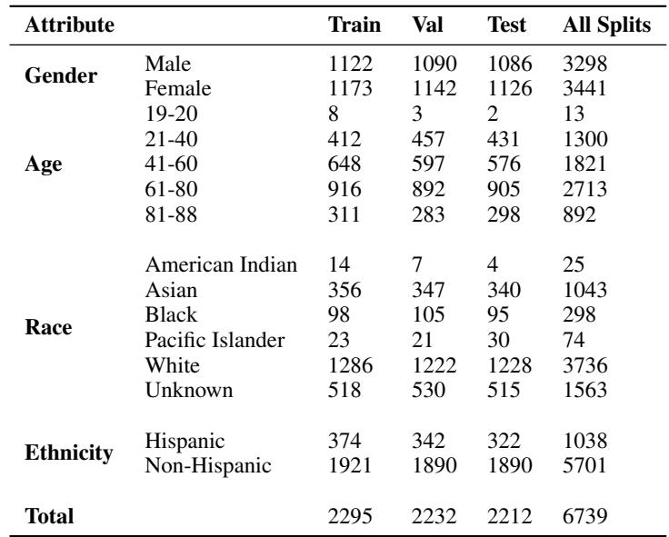

[← 返回 README](../README.md)

# 2 Related Work

## 📌 预览
系统对比现有 EHR 数据集和 benchmark 的局限性：ICU-only、bespoke schema、缺少 few-shot 评估、FM 权重不公开。Table 1 是核心对比表。

---

One of the most popular EHR datasets made accessible to researchers is MIMIC-III, which contains roughly 40,000 patients seen in the intensive care unit (ICU) of Beth Israel Deaconess Medical Center in Boston, Massachusetts, between 2001 and 2012 [17]. Other public datasets include eICU [28], HiRID [6], AmsterdamUMCdb [45], CPRD [11], MIMIC-IV [16], and the UK BioBank [2].

> 💡 **现有数据集版图**: MIMIC 是绝对主流（40k ICU patients），其他数据集也大多来自 ICU。这些数据集支撑了过去十年绝大部分 EHR ML 研究。

Most of the aforementioned datasets are narrowly scoped to a single department: the ICU [17, 28, 6, 45]. This makes it impossible to capture a patient's full health trajectory to the extent that an academic medical center or health system would know of the patients it treats. Other datasets such as MIMIC-IV include data from multiple departments, but are still heavily anchored to the ICU, as only patients admitted for an ICU/ED visit are included [16]. In contrast, our work releases the full longitudinal EHR of patients across all departments of a major academic medical center, thus providing a more realistic setting for general prediction making.

> 💡 **ICU 局限**: 即使 MIMIC-IV 扩展了科室范围，入选标准仍然是「有 ICU/ED 入院记录」。EHRSHOT 包含全科室患者（门诊、住院、检查等），更接近医院实际数据分布。

Prior work has also typically relied on the creation of bespoke schemas to store their data. These custom schemas greatly increase the difficulty of transferring models across datasets and sites [44]. In contrast, the data preprocessing pipeline that we use is capable of ingesting both EHRSHOT as well as any dataset that follows the Observational Medical Outcomes Partnership Common Data Model (OMOP-CDM), an open community data standard for sharing EHRs used by over 100 health systems [35]. More details on our data preprocessing pipeline can be found in the Appendix in Section C.5.

> 💡 **OMOP-CDM 标准**: 这是 EHRSHOT 的重要设计决策。OMOP-CDM 是 OHDSI 社区的标准数据模型，100+ 医院采用。这意味着在 EHRSHOT 上开发的方法理论上可以直接迁移到其他 OMOP-CDM 站点。

Previously published EHR datasets typically only provide raw data. Thus, significant additional effort has been devoted to building standardized preprocessing pipelines, patient splits, and task definitions on top of these datasets [10, 30, 23]. These add-on benchmarks, however, are still limited by the narrow scope of their underlying data, and many recycle the same core set of tasks (e.g. in-patient mortality, long length-of-stay, ICU transfer, and ICD code prediction) [30, 10, 9]. Additionally, these benchmarks are typically not created with the purpose of measuring a pretrained model's few-shot performance [22]. This limits their utility in assessing the key value propositions of foundation models, such as improved sample efficiency and adaptation to diverse tasks.

> 💡 **任务同质化问题**: 几乎所有 ICU benchmark 都用同一套任务——mortality、LOS、ICU transfer。这对评估 task-specific 模型够了，但无法衡量 FM 的多任务泛化和 few-shot 能力。

On the modeling side, substantial literature exists on training FMs for EHR data [29, 20, 33, 42, 25]. However, the vast majority of these FMs have never had their weights published [49]. This greatly hinders reproducibility and makes cross-model evaluations difficult. Worse, this lack of sharing undermines a primary advantage of FMs: transfer learning, i.e. the ability to use the pretrained weights of an existing FM to shortcut model development for other tasks [1].

> 💡 **FM 不公开权重的悖论**: FM 的核心价值是 transfer learning，但如果权重不公开，其他机构就无法受益。作者的 survey [49] 发现几乎没有 structured EHR FM 公开权重。

EHRSHOT aims to fill several of these gaps by providing a longitudinal EHR benchmark specifically geared towards few-shot evaluation of pretrained FMs. EHRSHOT is built on top of a cross-site interoperable standard (OMOP-CDM), and leverages an open source data preprocessing pipeline to allow other researchers to reproduce our results end-to-end. Additionally, we release the weights of the clinical foundation model that we pretrain and evaluate, one of the first to do so. We provide additional points of comparison in Table 1.

*Table 1: Comparison of our work to existing EHR benchmarks. Checkmark indicates full support, asterisk represents properties that are semi-supported.*

> 💡 **Table 1 批读**:
> - EHRSHOT 是唯一同时满足以下条件的 benchmark：
>   - ✅ ICU + 非 ICU visits
>   - ✅ Few-shot 评估
>   - ✅ 公开数据集 + 预处理代码 + **模型权重**
> - MIMIC 系列有代码但无模型权重；CPRD 有大规模纵向数据但无标准化任务
> - 患者规模方面 EHRSHOT (7k) 不占优势，但胜在数据深度和任务多样性

---

## 🔖 Section 总结

### 核心洞察
1. 现有 EHR benchmark 三大短板：ICU-only、自定义 schema、无 few-shot 设计
2. OMOP-CDM 标准化是实现跨站点迁移的关键
3. EHRSHOT 是首个 "数据+模型+任务+代码" 四位一体的 EHR FM benchmark
