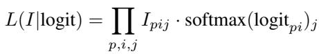
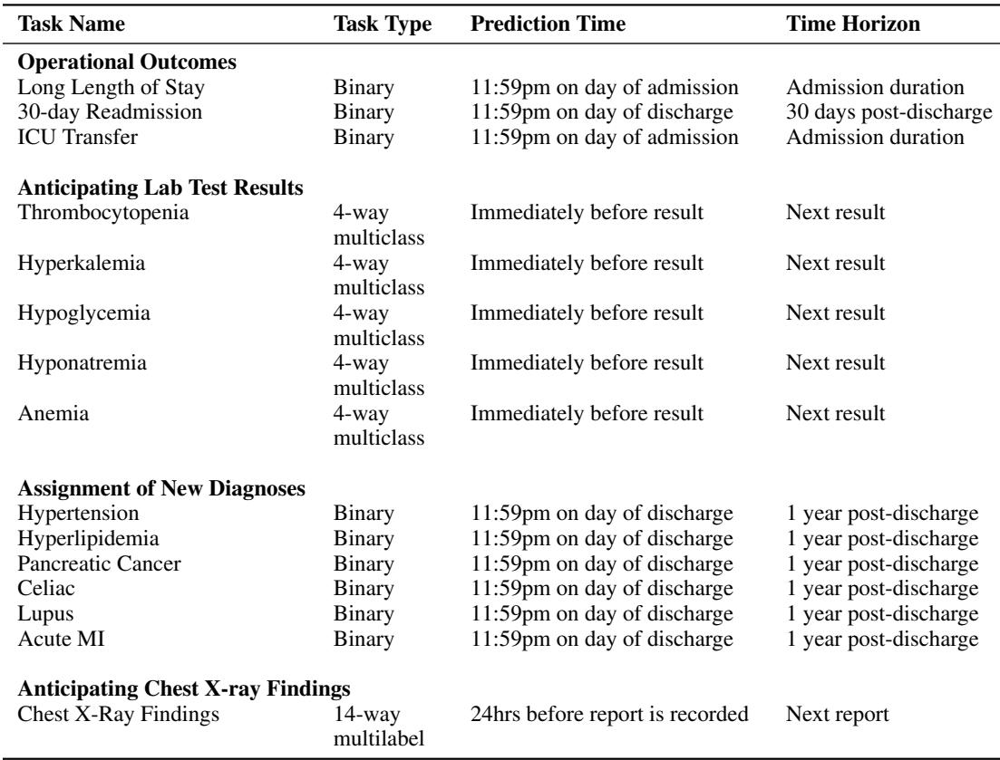

[← 返回 README](../README.md)

# 3 Dataset

## 📌 预览
**核心 Section**。EHRSHOT 数据集的详细构造：数据源（STARR/OMOP-CDM）、cohort 选择、15 个任务定义（4 大类）。重点关注任务设计的 prediction time 和 time horizon。

---

We are releasing EHRSHOT (pronounced "earshot"), an EHR benchmark for few-shot evaluation of foundation models. EHRSHOT is a collection of 6,739 unique patients with canonical train/validation/test splits and corresponding labels for 15 classification tasks. We also provide canonical $k$-shot samples for each few-shot evaluation task. Unlike prior EHR benchmarks focused on task-specific supervised models [22] for specific episodes of care, e.g. admission to the ICU [10, 28], our benchmark is designed for evaluating pretrained FMs on a broad range of tasks using the depth of information that a health system would typically possess for its patients. EHRSHOT is provided as a set of CSV files. It is essentially a lightweight serialization of the OMOP-CDM format. Please see Section C.4 in the Appendix for additional details on the dataset format.

> 💡 **设计哲学**: EHRSHOT 不是为训练 task-specific 模型设计的（那些模型用 MIMIC 就够了），而是为评估 FM 的 **泛化能力** 和 **sample efficiency** 设计的。提供 canonical k-shot samples 保证了不同模型之间的公平比较。

EHRSHOT contains a total of 41.6 million coded observations (e.g. diagnoses, procedures, medications, lab results, etc.) and 921,499 unique visits across 6,739 patients. We exclude all patients less than 19 years of age or greater than 88 years of age. We also exclude patients with less than 10 total clinical events in their record. We include statistics of EHRSHOT's cohort demographics in Table 2 and Appendix Table 4, and histograms of patient characteristics in Appendix Figure 4.

> 💡 **Cohort 过滤条件**: 年龄 19-88（排除儿童和高龄隐私风险患者）+ 至少 10 个 clinical events（过滤掉太稀疏的记录）。41.6M events / 6,739 patients ≈ **6,174 events/patient 平均**，数据非常密集。

*Table 2: Summary statistics on the number of events, visits, and length of patient timelines in EHRSHOT.*

> 💡 **Table 2 批读**:
> - 平均 6,174 events/patient, 136 visits/patient, 59 年时间跨度
> - Max 199,913 events — 有极端 heavy user
> - 时间跨度 mean=59 年说明很多患者从年轻就在 Stanford 就诊
> - Train/Val/Test split 比较均匀

---

## 3.1 Data Source

> 💡 **3.1 要点预览**: 数据来自 Stanford STARR 库，OMOP-CDM 格式，3.67M patients (1990-2023)。FEMR 库做预处理。

We sourced the data for our benchmark from the Stanford Medicine Research Data Repository (STARR) [5], which contains EHR data from both Stanford Health Care (primarily adult care) and Lucile Packard Children's Hospital (primarily pediatric care). The source dataset is structured according to the Observational Medical Outcomes Partnership Common Data Model (OMOP-CDM) [12] and comprises a total of 3.67M unique patients from 1990 to February 8th, 2023 [5]. Of these patients, 2.57M (70%) are used for training and 0.55M (15%) for validation of the foundation model that we release, CLMBR-T-base, the details of which we discuss in Section 4. All data that we work with is deidentified, and hence, our study did not require Institutional Review Board approval [5].

> 💡 **数据规模**: 
> - 源库: 3.67M patients, 33 年跨度 (1990-2023)
> - 预训练 split: 70% train (2.57M) / 15% val (0.55M) / 15% test (0.55M)
> - EHRSHOT 的 6,739 patients 是从这个源库中精心挑选的（<0.2%）
> - 去标识化数据，不需要 IRB 审批

This source database contains demographics (e.g. age, sex, race), diagnoses, procedures, laboratory results, medication prescriptions, and other coded clinical observations, which we preserve. While the source database also contains clinical notes, we remove these in our released benchmark. We describe how we selected our patient cohort from this source dataset in the Appendix in Section C.6. We apply a few additional transformations on top of those described in [5] to prevent data leakage and fix timestamp issues, which are detailed in Section C.5 in the Appendix.

> 💡 **数据类型**: 保留 structured data（诊断、手术、lab、药物等），移除 clinical notes（隐私考虑）。这意味着 EHRSHOT 评估的是 **structured EHR FM**，不包括临床 NLP 能力。

For our data preprocessing pipeline, we use the Framework for Electronic Medical Records (FEMR) library, which we developed in parallel to this work. FEMR is a Python library that supports the ingestion of multiple EHR data formats (e.g. OMOP, MIMIC, etc.) and provides a unified interface for building machine learning models on top of such data at scale. The full codebase is available on Github here: https://github.com/som-shahlab/femr/.

Additionally, all of the code used to generate the dataset for EHRSHOT can be found here: https://github.com/som-shahlab/ehrshot-benchmark.

> 💡 **FEMR 工具链**: 作者团队同步开发的 EHR ML 框架。支持多种数据格式输入（OMOP、MIMIC），为 EHRSHOT 和后续 Context Clues 等工作提供统一接口。

---

## 3.2 Tasks

> 💡 **3.2 要点预览**: 15 个任务分 4 大类——(1) 运营结果 3 个 binary, (2) Lab 预测 5 个 multiclass, (3) 新诊断 6 个 binary, (4) 胸片发现 1 个 multilabel。每类任务有不同的 prediction time 和 time horizon。

We define 15 tasks as part of our benchmark, as listed in Table 3. We selected these tasks based on clinician input as well as alignment with prior benchmarks [10, 8]. The tasks that we consider can be broadly grouped into the following 4 categories: (1) Operational Outcomes, (2) Anticipating Lab Test Values, (3) Assignment of New Diagnoses, (4) Anticipating Chest X-ray Findings.

All tasks are classification tasks. We include a total of nine binary classification tasks (Operational Outcomes and Assignment of New Diagnoses), five 5-way multiclass tasks (Anticipating Lab Test Values), and one 14-way multilabel task (Anticipating Chest X-ray Findings). The size of each task's subcohort, as well as the prevalence of positive labels, is detailed in Table 3. For example, there are 552 positive labels within the test cohort for the Long Length of Stay task, while there are 2,195 total labels, meaning there are 1,643 negative labels. As there are only 1,238 unique patients in this task's test cohort, some patients have multiple labels assigned to them.

> 💡 **任务多样性设计**:
> - 9 binary + 5 multiclass + 1 multilabel = 覆盖不同分类范式
> - 一个患者可以有多个 labels（多次就诊 → 多次预测）
> - 任务选择兼顾了：临床意义（clinician input）+ 与现有 benchmark 对齐 + 标签率多样性

*Figure 2: Summary of Benchmark Tasks. Each subfigure contains one of the 4 types of predictive classification tasks: (1) Operational Outcomes (binary), (2) Assignment of New Diagnoses (binary), (3) Anticipating Chest X-ray Findings (multilabel), (4) Anticipating Lab Test Results (multiclass). Each black line represents a patient timeline. The black boxes represent how each timeline would be labeled.*

> 💡 **Figure 2 批读** — 4 类任务的 prediction time 和 time horizon:
> 1. **Operational Outcomes**: prediction time = 入院当天 11:59pm，time horizon = 住院期间/30天
>    - 预测住院期间会发生什么（LOS、ICU 转入）或出院后 30 天内会发生什么（再入院）
> 2. **New Diagnoses**: prediction time = 出院当天 11:59pm，time horizon = 1 年
>    - 预测患者出院后 1 年内是否首次确诊某疾病
> 3. **Chest X-ray**: prediction time = 报告前 24 小时
>    - 预测胸片报告会包含哪些发现
> 4. **Lab Tests**: prediction time = 结果出来前一刻
>    - 预测即将到来的 lab 结果是正常还是异常（分级）
>
> 这些 prediction time 的设计很关键——确保模型只能看到预测时刻之前的信息，防止数据泄露。

*Table 3: Task Demographics. The number of unique patients and total labels for each task.*

> 💡 **Table 3 批读** — 标签率分析:
> - **高标签量任务**: Lab tests（数万 labels/task），因为同一患者有大量重复检查
> - **低标签量任务**: Celiac (test: 21 positive), Lupus (test: 20 positive) — 真正的 rare disease few-shot
> - **Operational Outcomes**: 中等规模（~2k labels），positive rate ~25%
> - **New Diagnoses**: 低 positive rate，尤其 Celiac/Lupus/Pancreatic Cancer
>
> 这种标签率的多样性是 EHRSHOT 的设计优势——不同任务天然对应不同的 few-shot 难度。

In the Appendix, we define the precise prediction windows for each task in Table 7 and the definition of each task in Section C.3. We also provide a visualization of our 4 task categories in Figure 2.

---

## 🔖 Section 总结

### 关键数字速查
| 指标 | 数值 |
|------|------|
| 总患者 | 6,739 |
| 总事件 | 41.6M |
| 总就诊 | 921,499 |
| 数据源 | Stanford STARR (3.67M patients, 1990-2023) |
| 数据格式 | OMOP-CDM |
| 任务数 | 15 (9 binary + 5 multiclass + 1 multilabel) |
| 最稀疏任务 | Celiac (test: 13 positive patients) |
| 最密集任务 | Hypoglycemia (test: 100k+ labels) |

### 核心洞察
1. **数据深度 > 数据广度**：6,739 patients 但每人平均 6,174 events，远超 MIMIC
2. **4 类 15 任务**：覆盖运营、lab、诊断、影像，prediction time 各异
3. **自然 few-shot**：Celiac/Lupus 等罕见病天然提供 few-shot 场景
4. **OMOP-CDM + FEMR**：标准化数据格式 + 开源工具链，支持跨站点迁移
