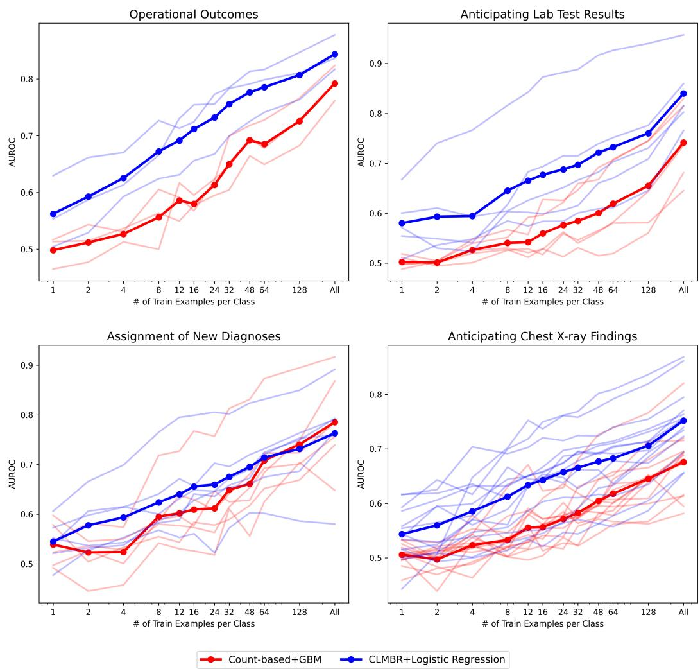

[← 返回 README](../README.md)

# 5 Results

## 📌 预览
Few-shot 评估结果：CLMBR-T-base 在 k≤64 时全面优于 GBM，但在 New Diagnoses 任务的高 k 场景下被 GBM 反超。Figure 3 是核心结果图。

---

We evaluate each baseline model in a few-shot setting. For each of the 15 benchmark tasks, we steadily increase the number of examples $k$ that each model sees from $k = 1$ to the full training dataset, and record the model's AUROC and AUPRC at each $k$.

More precisely, we define "$k$-shot evaluation" of a model $M$ on a specific task $T$ as follows. We train $M$ on $k$ positive examples and $k$ negative examples sampled from $T$'s training split. We then select an additional $k$ positive examples and $k$ negative examples from $T$'s validation split, and use these validation examples to select the best hyperparameters for $M$ for task $T$. Finally, we evaluate the AUROC and AUPRC of the best performing version of $M$ on $T$'s entire held-out test split. For tasks where the total number of unique positive examples is less than $k$, we include all positive examples in our training set, and randomly resample positive examples until the total number of training examples seen by the model is $k$. We consider values of $k \in \{1, 2, 4, 8, 12, 16, 24, 32, 48, 64, 128\}$ for all tasks (with the exception of Celiac, for which we limit $k \leq 64$ as there are only 62 positive training labels).

> 💡 **Few-shot 评估协议**:
> - **k-shot** = k positive + k negative（balanced sampling）
> - **验证集也是 k-shot**：k positive + k negative from val split，用于选超参
> - **测试在完整 test split 上**：不是 few-shot test，保证评估稳定性
> - **k 的范围**: {1, 2, 4, 8, 12, 16, 24, 32, 48, 64, 128}
> - **正样本不足时重采样**: 如 Celiac 只有 62 个正样本
>
> ⚠️ 这个协议很重要——Context Clues 等后续工作都遵循这个 few-shot 定义。

For the count-based GBM, these few-shot examples are the only training examples seen by the model. For the pretrained CLMBR-T-base model, we use these few-shot examples to fine-tune a logistic regression head appended to the top of the model, while keeping the weights of the pretrained CLMBR-T-base model frozen. Pretraining the CLMBR-T-base model took roughly 4 days on a single Nvidia V100 hosted in an on-premise compute cluster.

> 💡 **两种模型的 few-shot 方式**:
> - **GBM**: 从零训练，only 2k examples
> - **CLMBR-T-base**: Frozen backbone + train LR head on 2k examples
> - 预训练成本: 4 days / 1x V100 — 相当低，说明结构化 EHR FM 不需要巨大算力

The AUROC of each model across all 4 task categories is presented in Figure 3. In the Appendix, we show this grouping for AUPRC in Figure 5. We also break down each individual task's AUROC in Figure 6 and AUPRC in Figure 7 of the Appendix. We also include results for additional baselines in the Appendix in Figures 10 and 11. The bolded lines are the Macro-AUC for each model within a task category, averaged across all subtasks at each $k$. We include the performance of each model trained on the entire EHRSHOT training split on the far right of every plot as $All$.

*Figure 3: Aggregated AUROC across all subtasks within each of the 4 task categories. CLMBR-T-base (blue) consistently outperforms the count-based GBM (red) at k≤64, but lags in higher label settings for the Assignment of New Diagnoses tasks.*

> 💡 **Figure 3 批读** — 核心结论:
> 1. **Operational Outcomes**: CLMBR-T-base 全面碾压，尤其 k=8~128 区间优势显著
> 2. **Lab Test Results**: CLMBR-T-base 在所有 k 都优于 GBM
> 3. **Chest X-ray**: CLMBR-T-base 优势明显，但方差大（单任务）
> 4. **New Diagnoses**: ⚠️ **k>64 后 GBM 反超！** 这是最有意思的发现
>
> 总体趋势：预训练在 **data-poor 区间**（k=8~128）优势最大，k=1 两者都学不到东西，k 很大时差距缩小甚至反转。

As shown in Figure 3, the pretrained foundation model CLMBR-T-base (blue) outperforms the count-based GBM (red) across all aggregated task categories for $k \leq 64$. This demonstrates the benefits of pretraining in few-shot settings, as the model can leverage patterns learned across millions of patients to derive more accurate representations out-of-the-box than a model trained from scratch. CLMBR-T-base outperforms the count-based GBM across all $k$ on the Operational Outcomes and the majority of Anticipating Lab Test Results and Anticipating Chest X-ray Findings tasks. For these three task groups, the advantage of CLMBR-T-base seems most pronounced at intermediate levels of $k$ between 8 and 128. At extremely low $k$ (i.e. $k = 1$), both models struggle to learn anything, while as $k$ increases the advantage of the pretrained model tends to shrink, a trend noted elsewhere [22]. This is most visible in the far-right of the plot at the $All$ marker, which represents the performance of each model when trained on the full EHRSHOT training dataset.

In fact, the count-based GBM exceeds the performance of CLMBR-T-base on the Assignment of New Diagnoses tasks at $k > 64$. This suggests that the advantage of pretraining comes primarily from improved initialization of patient representations, and that the largest gains are achieved in the most data poor regimes.

> 💡 **为什么 GBM 在 New Diagnoses 高 k 时反超？** 作者给了两个解释：

There are several possible reasons for CLMBR-T-base's underperformance at higher values of $k$ for the Assignment of New Diagnoses tasks. First, the CLMBR-T-base model's training objective is next code prediction, which makes it ill-suited for predictive tasks with long time horizons (which for these tasks is 1 year). Second, if a simple tree-based model exists for a task (i.e. a few medical concepts tightly correlate with a diagnosis), then it may be more difficult for a pretrained model to coerce patient representations learned over millions of patients to that specific task than training a model from scratch with enough data to learn those distinctive signals. We believe that this reversal in model rankings demonstrates a key strength of EHRSHOT – namely, the diversity of its predictive tasks can help identify opportunities for improving pretraining and few-shot strategies.

> 💡 **GBM 反超的两个原因**:
> 1. **时间尺度不匹配**: CLMBR-T-base 的 next code prediction 关注短期依赖，但 New Diagnoses 的 time horizon 是 1 年——模型学到的短期模式对长期预测帮助有限
> 2. **简单规则 > 复杂表征**: 如果"有 X 诊断 → 未来得 Y 病"是一条简单规则，那 GBM 在有足够数据时能直接学到，而 FM 的通用表征反而不如 task-specific 特征
>
> 🔑 这也指向了 Context Clues 等后续工作的改进方向：如何让 FM 更好地适配长时间尺度任务。

We release all of our model weights, evaluation tasks, and data processing code to fully reproduce our results. To the best of our knowledge, the release of our pretrained CLMBR-T-base model is one of the first examples of such a clinical FM having its pretrained weights made publicly available [49].

---

## 🔖 Section 总结

### 核心结论
| 场景 | 赢家 | 原因 |
|------|------|------|
| k ≤ 64 (所有任务) | CLMBR-T-base | 预训练提供了好的 patient representation 初始化 |
| k > 64, Operational/Lab/CXR | CLMBR-T-base | 时序信息对这些短期任务有持续价值 |
| k > 64, New Diagnoses | GBM | 长时间尺度 + 简单规则 → tree model 更有效 |
| k = All (full training) | 任务相关 | FM 优势缩小，GBM 在部分任务追平甚至反超 |

### 核心洞察
1. **FM 的价值主要在 data-poor regime**（k=8~128），这正是医疗场景最需要的
2. **Next code prediction 有局限**：短期预训练目标 vs 长期预测任务存在 gap
3. **Benchmark 多样性的价值**：正是因为 EHRSHOT 有多种任务，才能发现 FM 的优劣势
