[← 返回 README](../README.md)

# Appendix

## 📌 预览
包含详细的任务定义、数据格式说明、Cohort 选择过程、CLMBR-T-base 模型细节、完整实验结果图。

---

## A Author Responsibility Statement

The authors confirm that they bear all responsibility in case of violation of rights or licenses.

## B Public Accessibility & Licenses

### B.1 Dataset

We release EHRSHOT under a research data use agreement. The dataset is available here: https://ehrshot.stanford.edu/. Access is gated by a researcher data use agreement due to the sensitive nature of the dataset.

> 💡 **访问方式**: DUA（Data Use Agreement），非开放下载。需要注册身份并获得批准。非商业研究用途。

### B.2 Pretrained Foundation Model (CLMBR-T-base)

We release CLMBR-T-base, a foundation model pre-trained on the structured EHR data of roughly 2.5 million patients at Stanford Medicine. The model's weights can be found at our website here: https://ehrshot.stanford.edu/.

> 💡 **模型隐私保护措施**: (1) 仅在去标识化数据上训练, (2) 手动审查了模型词典中的所有文本字符串确保无 PHI, (3) DUA 访问控制。

---

## C Dataset Details

### C.1 EHRSHOT Cohort

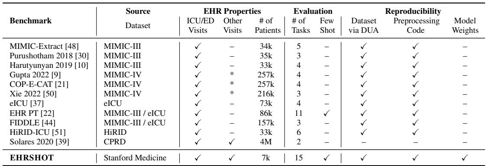
*Table 4: EHRSHOT: Patient demographics in the train, validation, and test splits.*

> 💡 **Table 4 批读 — 人口统计**:
> - 性别：Male 3,298 / Female 3,441，接近均衡
> - 年龄：61-80 岁最多 (2,713)，偏老年
> - 种族：White 55%, Asian 15%, Unknown 23%, Black 4% — Stanford 地区特点
> - 总计 6,739 patients, 三个 split 各约 2,200+

### C.2 Pretraining Dataset

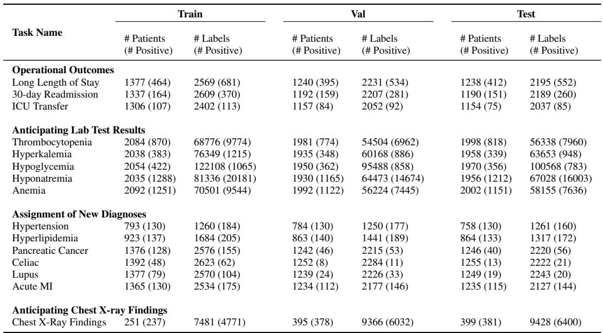
*Table 5: Pretraining Dataset: Patient demographics in the train, validation, and test splits.*

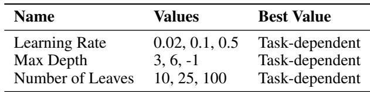
*Table 6: Pretraining Dataset: Summary statistics on events, visits, and timeline length.*

> 💡 **预训练数据 vs EHRSHOT 数据对比**:
> - 预训练: 3.67M patients, mean 706 events/patient, mean 28 visits/patient
> - EHRSHOT: 6,739 patients, mean 6,174 events/patient, mean 136 visits/patient
> - EHRSHOT 患者密度是预训练库平均的 **~8.7x** — 因为 cohort selection 偏向数据丰富的患者

---

### C.3 Task Definitions

#### Operational Outcomes (Binary)

- **Long Length of Stay**: Predict whether a patient's total length of stay during a visit to the hospital will be at least 7 days. Prediction time: 11:59pm on day of admission. Visits < 1 day are ignored.
- **30-day Readmission**: Predict whether a patient will be re-admitted within 30 days after discharge. Prediction time: 11:59pm on day of discharge. Same-day readmissions are ignored.
- **ICU Transfer**: Predict whether a patient will be transferred to the ICU during a visit. Prediction time: 11:59pm on day of admission. Same-day ICU transfers are ignored.

> 💡 **Operational Outcomes 设计细节**:
> - 三个任务的 prediction time 不同：LOS 和 ICU Transfer 在入院日，Readmission 在出院日
> - 排除 same-day events 是为了确保模型有信息可用（不是入院后立刻预测）
> - 这些任务在临床实践中有直接应用价值（资源规划、出院管理）

#### Anticipating Lab Test Results (4-way Multiclass)

- **Thrombocytopenia** (血小板减少): Normal (≥150), Mild (100-150), Moderate (50-100), Severe (<50) × 10⁹/L
- **Hyperkalemia** (高钾血症): Normal (≤5.5), Mild (>5.5-6), Moderate (>6-7), Severe (>7) mmol/L
- **Hypoglycemia** (低血糖): Normal (≥3.9), Mild (3.5-3.9), Moderate (3.0-3.5), Severe (<3.0) mmol/L
- **Hyponatremia** (低钠血症): Normal (≥135), Mild (130-135), Moderate (125-130), Severe (<125) mmol/L
- **Anemia** (贫血): Normal (≥120), Mild (110-120), Moderate (70-110), Severe (<70) g/L

> 💡 **Lab 任务设计**:
> - Prediction time = 结果出来前一刻 → 模型看到"医生开了检查单"但还没看到结果
> - 4 级严重程度分类（normal/mild/moderate/severe）
> - 在 Results 中被重构为 binary（normal vs abnormal）
> - 这些任务的 labels 非常多（单个任务几万到十几万），因为同一患者有大量重复检查

#### Assignment of New Diagnoses (Binary)

- **Hypertension** (高血压): SNOMED/59621000
- **Hyperlipidemia** (高脂血症): SNOMED/55822004
- **Pancreatic Cancer** (胰腺癌): SNOMED/372003004
- **Celiac** (乳糜泻): SNOMED/396331005
- **Lupus** (狼疮): SNOMED/55464009
- **Acute MI** (急性心梗): SNOMED/57054005

Prediction time: 11:59pm on day of discharge. Time horizon: 1 year. Only first diagnosis counts (exclude patients with existing diagnosis).

> 💡 **New Diagnoses 任务设计**:
> - **首次诊断**：排除已有该诊断的患者，预测"新发"
> - 1 年时间窗口 — 这就是为什么 CLMBR-T-base 在这类任务上表现不好（next code prediction 更擅长短期）
> - 包含了常见病（高血压）和罕见病（乳糜泻、狼疮）→ 标签率差异巨大
> - 使用 SNOMED 编码 + children codes（ontology expansion）

#### Anticipating Chest X-ray Findings (14-way Multilabel)

14 possible findings: No Finding, Enlarged Cardiomediastinum, Cardiomegaly, Lung Lesion, Lung Opacity, Edema, Consolidation, Pneumonia, Atelectasis, Pneumothorax, Pleural Effusion, Pleural Other, Fracture, Support Devices.

Prediction time: 24 hours before radiology report. Labels from CheXpert NLP labeler [14].

> 💡 **CXR 任务特殊性**: Labels 不是来自 structured codes，而是用 CheXpert NLP labeler 从放射科报告文本中提取的。但模型输入只有 structured data（不包括报告文本）。这测试的是：能否仅从患者的结构化病史预测胸片会发现什么。

---

### C.4 Dataset Format

**(A) Events** — CSV files containing every clinical event:
- Patient ID, Start, End, Code, Value, Unit, Visit ID, OMOP-CDM Table

**(B) Labels** — CSV files for all 15 tasks:
- Patient ID, Prediction Time, Value, Label Type

> 💡 **数据格式**: 非常简洁的 CSV 格式。Events 是时间线数据（每行一个临床事件），Labels 是评估标签（每行一个 task-patient-time 三元组）。

---

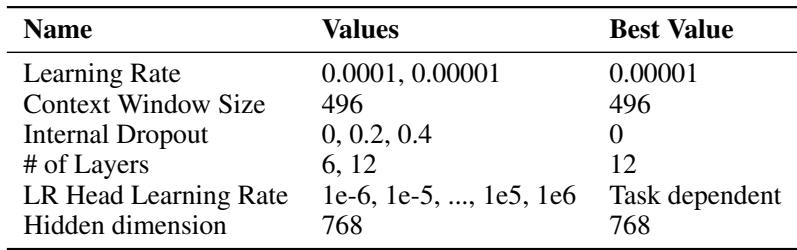
*Table 7: Task Prediction Windows.*

> 💡 **Table 7 批读**: 一目了然的任务 prediction time / time horizon 总结。注意 Lab tasks 的 prediction time 是 "immediately before result"——这是最短的预测窗口。

---

### C.5 Data Preprocessing

Key transformations applied:
1. **Date jittering**: All dates shifted to random year 2100-2200 (same offset per patient)
2. **Age filtering**: Remove patients ≤18 or ≥89
3. **Remove free text**: Only keep top-100 categorical text strings (manually verified)
4. **Minimum events**: Remove patients with <10 events
5. **Timestamp adjustments**: Pre-birth events → post-birth; visit starts = first event time; billing codes → end of visit; midnight events → 11:59pm; remove duplicate same-day codes

> 💡 **隐私 + 数据质量处理**: 
> - Date jittering 是标准去标识化技术（MIMIC-III 也用）
> - Top-100 categorical strings 手动审查 — 保留了 65% 的分类值
> - Timestamp adjustments 解决了 EHR 系统中常见的时间戳质量问题

### C.6 Cohort Selection Process

Target: At least k=128 positive and negative examples per split per task. For each task, label all patients in source database → subsample negatives (if prevalence < 1:5) → select 128 unique patients per split with positive labels → add negatives. Prioritize reusing already-selected patients across tasks.

> 💡 **Cohort 选择策略**:
> - 不是随机采样！是 **task-driven** 采样，确保每个任务有足够的 few-shot 正样本
> - 跨任务复用患者减少总 cohort 大小（6,739 vs 可能的 ~15×256×3 = 11,520）
> - 这意味着 EHRSHOT 的患者分布与源库分布不同——偏向有多种疾病/事件的"高信息"患者

---

## D Results Details

### D.1 Problem Formulation

Dataset $\mathcal{D} = \{(\mathbf{X}_p, \mathbf{Y}_p)\}_{p=1}^{|\mathcal{P}|}$. Patient $p$: sequence of clinical events $\mathbf{X}_p = \{x_{p1}, ..., x_{pn}\}$. Labels $\mathbf{Y}_p = \{y_{pb_1}^{(t_1)}, ...\}$ for benchmark tasks $b \in B$ at prediction times $t$.

Goal: Given $\mathbf{X}_p^{(t)}$ (timeline up to time $t$), predict $y_{pb}^{(t)}$.

### D.2 Count-Based GBM

Count vector $\mathbf{p}^{(t)} \in \mathbb{N}^{|\mathcal{C}|}$, where each element = count of code $i$ before time $t$. Ontology expansion: count each code for itself + all ancestor codes in OMOP ontology.

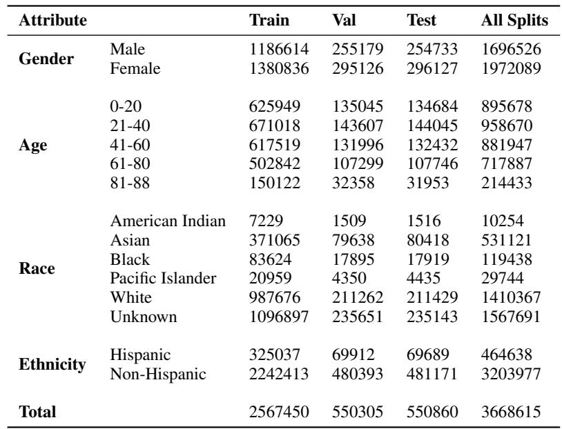
*Table 9: GBM Hyperparameters.*

### D.3 CLMBR-T-base

- Vocabulary: 65,536 codes (top by entropy contribution)
- Lab value discretization: decile-based binning → tokens like "Weight/180-190"
- Local attention: 496 tokens/layer × 12 layers = 5,952 effective context
- Loss: cross-entropy for next code prediction

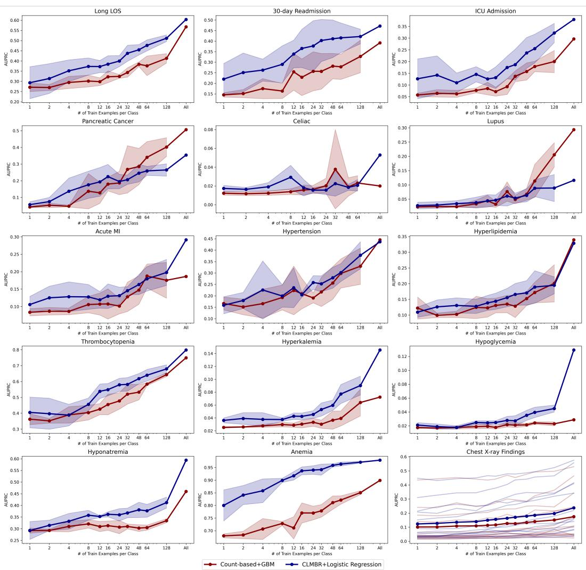
*Table 8: CLMBR-T-base Hyperparameters.*

> 💡 **CLMBR-T-base 技术细节**:
> - **Lab 值离散化**: 连续值 → 按十分位分桶 → 变成 categorical token。如 "Weight/180-190"
> - **词表 = 65,536**: 只保留 entropy 贡献最高的编码，其余丢弃
> - **Local attention**: 不是 full attention，每层只看 496 个 token → 12 层叠加后可看 ~6k events
> - Learning rate 很低 (1e-5)，No dropout — 说明数据量大到不需要正则化

---

## Additional Result Figures

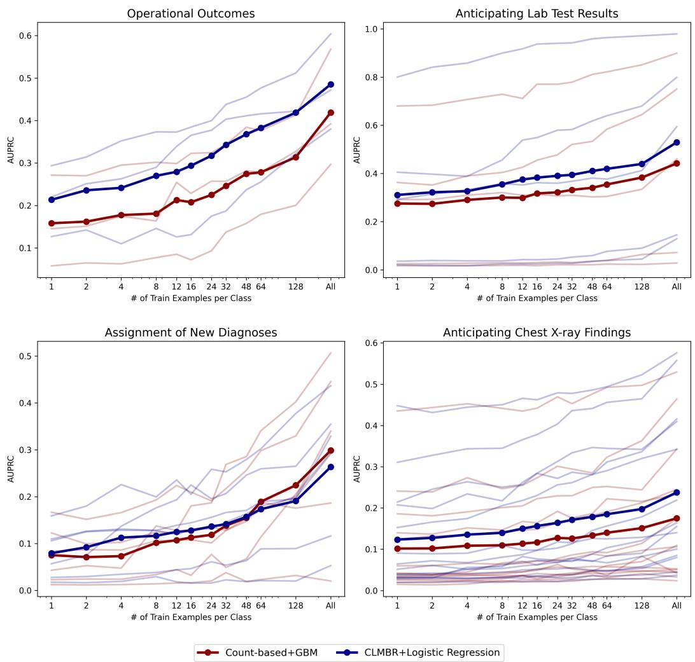
*Figure 5: Aggregated AUPRC across all 4 task categories.*

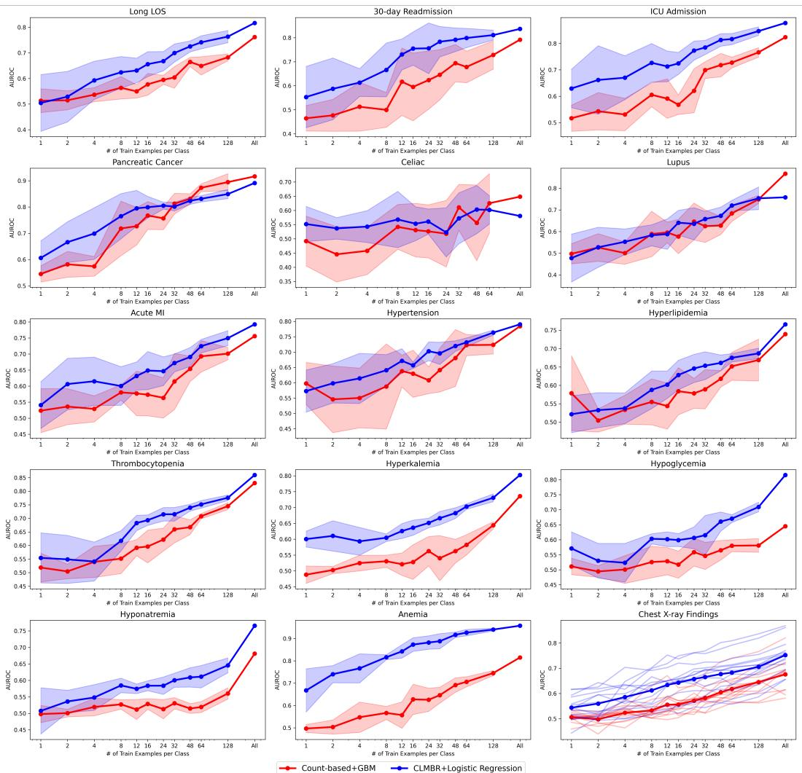
*Figure 6: AUROC scores for each model across all individual tasks.*

*Figure 7: AUPRC scores for each model across all individual tasks.*

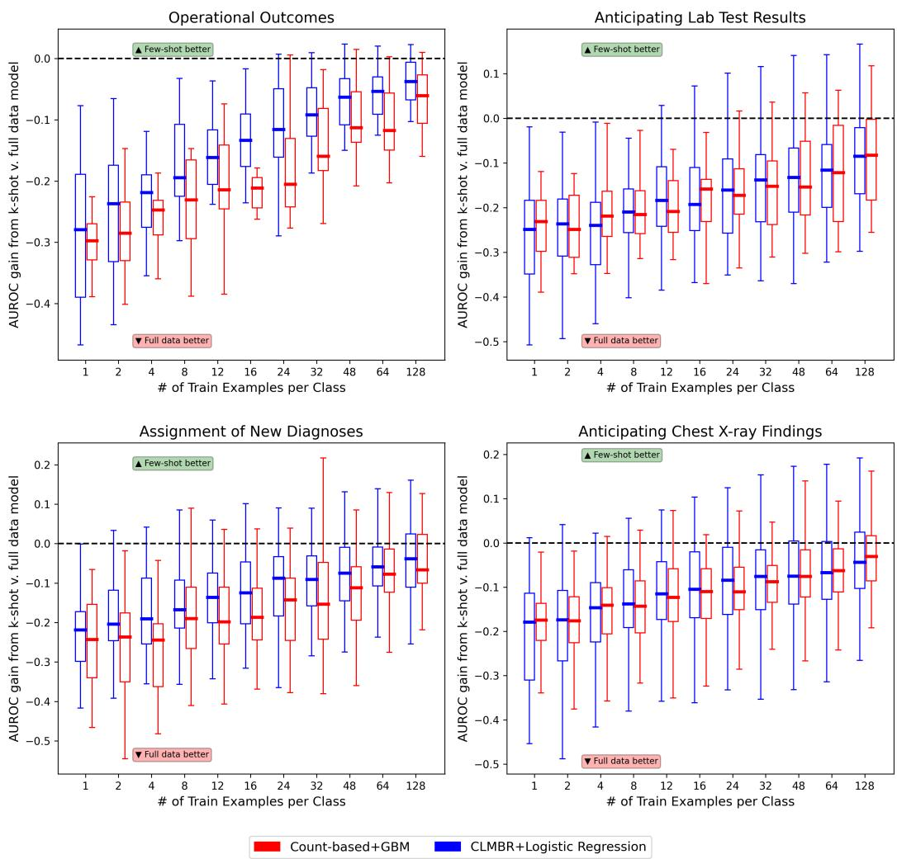
*Figure 8: Difference in AUROC between each k-shot model and full dataset model.*

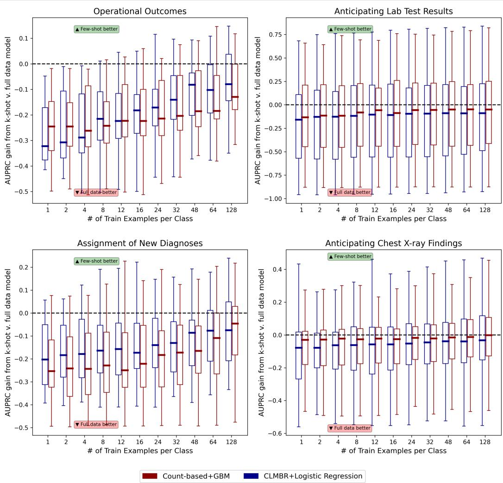
*Figure 9: Difference in AUPRC between each k-shot model and full dataset model.*

> 💡 **Figure 8-9 批读**: 展示 few-shot 模型与 full-data 模型的差距。CLMBR-T-base (blue) 更快地接近 full-data 性能——说明预训练让模型在少量标注下就能达到接近上限的表现。

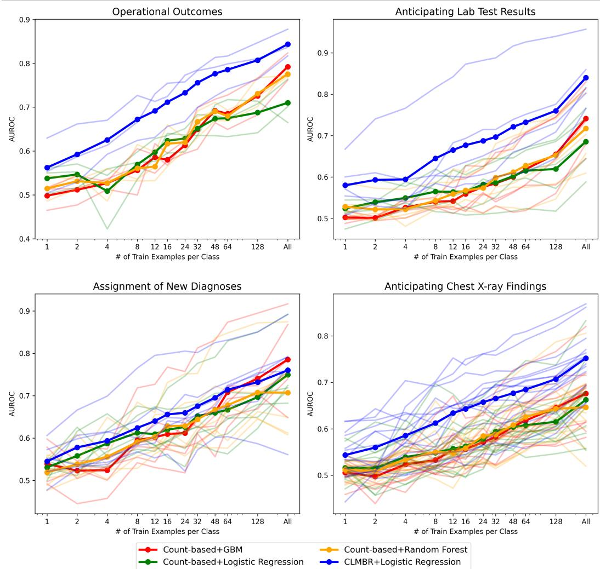
*Figure 10: Aggregated AUROC with additional baselines (LR, RF).*

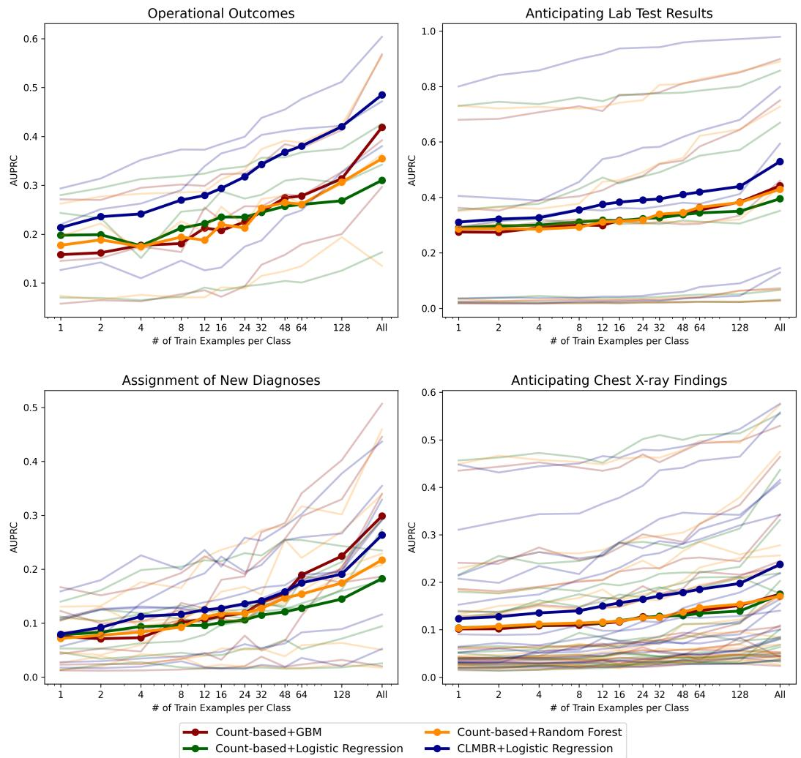
*Figure 11: Aggregated AUPRC with additional baselines (LR, RF).*

> 💡 **Figure 10-11 批读**: LR (green) 和 RF (yellow) 与 GBM (red) 表现相当，说明 count-based features 下模型选择不太重要——关键在于特征表示。

---

## 🔖 Section 总结

### 核心洞察
1. **Cohort selection 是 task-driven** 的，不是随机采样——这对理解 EHRSHOT 的数据分布很重要
2. **Lab 值离散化 + ontology expansion** 是两个关键的数据工程技巧
3. **CLMBR-T-base 的 local attention** 限制了长距离依赖建模能力（max ~6k events）
4. **Date jittering** 到 2100-2200 年 — 别被数据里的年份吓到
