# G-Memory: Tracing Hierarchical Memory for Multi-Agent Systems

Guibin Zhang∗1, Muxin $\mathbf { F u ^ { * 2 } }$ , Guancheng $\mathbf { W a n } ^ { 3 }$ , Miao $\mathbf { V } \mathbf { u } ^ { 4 }$ , $\mathbf { K u n \mathbf { W a n g } ^ { 5 \dagger } }$ , Shuicheng $\mathbf { Y a n } ^ { \mathrm { 1 \dagger } }$ 1NUS, 2Tongji University, 3UCLA, 4A\*STAR, 5NTU ∗ Equal Contribution, † Corresponding author # wang.kun@ntu.edu.sg, yansc@comp.nus.edu.sg

# Abstract

Large language model (LLM)-powered multi-agent systems (MAS) have demonstrated cognitive and execution capabilities that far exceed those of single LLM agents, yet their capacity for self-evolution remains hampered by underdeveloped memory architectures. Upon close inspection, we are alarmed to discover that prevailing MAS memory mechanisms (1) are overly simplistic, completely disregarding the nuanced inter-agent collaboration trajectories, and (2) lack crosstrial and agent-specific customization, in stark contrast to the expressive memory developed for single agents. To bridge this gap, we introduce G-Memory, a hierarchical, agentic memory system for MAS inspired by organizational memory theory [1], which manages the lengthy MAS interaction via a three-tier graph hierarchy: insight, query, and interaction graphs. Upon receiving a new user query, G-Memory performs bi-directional memory traversal to retrieve both high-level, generalizable insights that enable the system to leverage cross-trial knowledge, and fine-grained, condensed interaction trajectories that compactly encode prior collaboration experiences. Upon task execution, the entire hierarchy evolves by assimilating new collaborative trajectories, nurturing the progressive evolution of agent teams. Extensive experiments across five benchmarks, three LLM backbones, and three popular MAS frameworks demonstrate that G-Memory improves success rates in embodied action and accuracy in knowledge QA by up to $2 0 . 8 9 \%$ and $1 0 . 1 2 \%$ , respectively, without any modifications to the original frameworks. Our codes are available at https://github.com/bingreeky/GMemory.

# 1 Introduction

As Large Language Models (LLMs) continue to redefine the frontier of artificial intelligence, LLMdriven agents have exhibited unprecedented prowess in perception [2, 3, 4, 5], planning [6, 7, 8], reasoning [9, 10], and action [11, 12], which have catalyzed remarkable progress across diverse downstream domains, including code generation [13, 14], data analysis [15], embodied tasks [16] and autonomous driving [3, 17, 18]. Building upon the impressive competencies of single agents, LLMbased Multi-Agent Systems (MAS) have been demonstrated to push the boundaries of single model capacity [19, 20, 21]. Similar to collective intelligence arising from human social collaboration [22, 23, 24], MAS orchestrates multiple agents [25, 26, 27], whether through cooperation [28, 29, 30, 31] or competition [32, 33, 34], to transcend the cognitive and specialized limitations of solitary agents.

Self-Evolving Agents. What especially characterizes LLM agents is their self-evolving capacity, i.e., the ability to continuously adapt and improve through interactions with the environment, as seen in prior works where such adaptability has led to two- to three-fold quantitative improvements [35]. The central driving force behind such self-evolving nature is memory mechanism of agents [36, 37, 38], which parallels human abilities to accumulate knowledge, process past experiences, and retrieve relevant information. Previous successful memory mechanism designs, including both inside-trial memory (i.e., context retained within solving one single query) and cross-trial memory (i.e., experience accumulated across multiple tasks) [39], have empowered agents to excel in diverse applications such as personalized chat [36, 40, 41], recommendation [42], embodied action [43, 16], and social simulation [19, 44, 45], enabling them to evolve into experiential learners that effectively leverage past experiences and world knowledge.

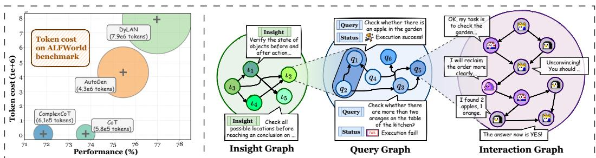  
Figure 1: (Left) We report the token cost of several single-agent and MAS baselines on ALFWorld benchmark; (Right) The overview of G-Memory’s three-tier hierarchical memory architecture, encompassing the insight graph, query graph and interaction (utterance) graph.

Self-Evolving MAS. However, such self-evolving capacity remains largely absent in multi-agent systems. Most existing MAS are still constrained by manually defined workflows, such as the Standard Operating Procedures (SOP) in MetaGPT [21] and ChatDev [46], or rely on pre-defined communication topologies in MacNet [47] and AgentPrune [30]. More recent automated MASs, such as GPTSwarm [48], ADAS [49], AFlow [50], and MaAS [51] have made it to automatically optimize inter-agent topologies or prompts, which, nevertheless, ultimately yield giant and cumbersome MAS architectures, lacking the agility to self-adjust with accumulated collaboration experience.

Memory for MAS. The absence of the aforementioned self-evolving capacity is, in fact, rooted in the lack of memory mechanisms specifically tailored for MAS. One may challenge this claim from two perspectives: ❶ Do existing MASs lack memory mechanisms altogether? Not entirely. Classical MAS frameworks such as MetaGPT, ChatDev, and Exchange-of-Thought [52] incorporate memory-related designs. However, these are often limited to inside-trial memory [52], while cross-trial memory, if present, remains rudimentary—typically involving the transmission of overly condensed artifacts (e.g., final solutions or execution results) [21, 46, 47], and failing to enable meaningful learning from collaborative experience. $\otimes$ Why not directly transfer existing single-agent memory mechanisms to MAS? Unfortunately, such a transfer is far from straightforward. The inherent nature of MAS, i.e., multi-turn orchestration across multiple agents [26, 27], leads to substantially longer task-solving trajectories compared to single-agent settings (up to $1 0 \times$ more tokens, as demonstrated by Figure 1 (Left)). This poses a significant challenge to traditional retrieval-based memory designs [36, 37, 16], as naive feeding of the entire long-context trajectory without proper abstraction from a collaborative perspective offers little benefit. Given the aforementioned challenges, a natural question arises:

How can we design a memory mechanism capable of storing, retrieving, and managing the lengthy interaction history of multi-agent systems, such that agent teams can benefit from concise and instructive experience and insights?

The Present Work: G-Memory. In response to the above question, we introduce a Graph-based Agentic Memory Mechanism for LLM-based Multi-Agent Systems, dubbed G-Memory, which manages the complex and lengthy interaction history of MAS through a three-tier hierarchical graph structure:

$^ *$ Insight Graph, which abstracts generalizable insights from historical experience;   
$^ *$ Query Graph, which encodes meta-information of task queries and their connectivity;   
$^ *$ Interaction Graph, which stores fine-grained textual communication logs among agents.

Figure 1 (Right) visualizes these structures, and their formal definitions are placed in Section 3. When a new query arrives, G-Memory efficiently retrieves relevant query records by leveraging the topology of the query graph, and then traverses upward (i.e., query insight graph) to extract associated highlevel insights and downward (i.e., query interaction graph) to identify core interaction subgraphs that are most pertinent to the task at hand, thereby mitigating information overload. Based on the retrieved memory, G-Memory offers actionable guidance to the MAS, e.g., division of labor, task decomposition, and lessons from past failures. Upon the completion of a task, all three levels of the memory hierarchy are updated in an agentic manner, with newly distilled insights, enriched query records, detailed MAS trajectories, and their level of detailed associations. Through this refinement, G-Memory functions as a plug-and-play module that can be seamlessly embedded into mainstream MAS frameworks, empowering evolving inter-agent collaboration and collective intelligence.

Our contributions are summarized as follows:

$\bullet$ Bottleneck Identification. We conduct a thorough review of existing multi-agent systems and identify a fundamental bottleneck in their self-evolving capabilities, which is largely attributed to the oversimplified memory architectures.   
❷ Practical Solution. We propose G-Memory, a hierarchical agentic memory architecture for MAS, which models complex and prolonged inter-agent collaboration through a three-tier structure comprising insight, query, and interaction graphs.   
$\pmb { \otimes }$ Experimental Evaluation. Extensive experiments across five benchmarks show that G-Memory is (I) high-performing, improving state-of-the-art MAS by up to $2 0 . 8 9 \%$ and $1 0 . 1 2 \%$ on embodied action and knowledge QA tasks, respectively; and $\mathbf { \Pi } ^ { ( \mathbf { I I } ) }$ resource-friendly, maintaining comparable or even lower token usage than mainstream memory designs.

# 2 Related Works

Single-Agent Memory. Memory serves as a primary driving force for agents to accumulate experiences and explore the world through interactions with the environment [53, 54, 55, 56]. It plays a critical role in both task-solving and social simulation LLM agents, and this work primarily focuses on the former. Early research on agent memory was confined to simple inside-trial memory, mainly addressing limitations posed by the LLM context window in chatbot applications, including MemoryBank [36], ChatDB [40], MemoChat [41], and MemGPT [37], which typically adopt retrievalaugmented generation (RAG)-style, similarity-based chunk retrieval. Subsequent developments have progressed toward more cognitively inspired memory architectures, including (1) memory scope extended to cross-trial memory like ExpeL [43] and Synapse [57]; (2) application domains broadened to include computer control [57], embodied action [58], scientific discovery [59], coding and reasoning [60]; and (3) management techniques evolved from coarse-grained textual similarity toward more sophisticated abstraction and summarization of acquired knowledge and experiences [19], as seen in A-Mem [61], Mem0 [62] and MemInsight [63]. More discussions are in Appendix D.

Memory in Multi-agent System. However, the memory mechanisms tailored for MAS remain markedly underexplored. Some representative frameworks, such as LLM-Debate [20, 33] and Mixture-of-Agent [64], omit memory components altogether. Others merely adopt simplistic insidetrial memory schemes [47, 52]. Even in frameworks that attempt cross-trial memory [46], the memory is merely compressed as the final outcome artifacts, overlooking the nuanced agent interactions. Collectively, there is a pressing need for a principled memory architecture that can capture, organize, and retrieve the inherently intricate task-solving processes unique to MAS [39].

LLM-based Multi-Agent Systems. Our work focuses on task-solving MAS, which, unlike their single-agent counterparts, often lack the capacity for continual evolution through interaction with the environment [65, 66]. Early frameworks such as AutoGen [13], CAMEL [24], and AgentVerse [67] rely entirely on pre-defined workflows. More recent efforts [68, 69, 50, 49, 70, 31] introduce a degree of adaptivity by generating dynamic MAS in response to environmental feedback. However, such evolution is often one-shot: for example, AFlow [50] employs Monte Carlo Tree Search to construct a complex MAS tailored to a specific task domain, which yet lacks the capacity to evolve with increasing task exposure or transfer across domains [51, 71]. From this perspective, constructing MAS with genuine self-evolving capabilities remains an open and challenging research frontier.

# 3 Preliminary

In this section, we establish the notation and formalize key concepts of multi-agent systems and ${ \sf G } \cdot$ -Memory’s hierarchical memory architecture.

Multi-agent System Formalization. Consider a multi-agent framework represented by a directed graph $\bar { \mathcal { G } } \overset { = } { = } ( \nu , \bar { \mathcal { E } } )$ , where $| \nu | = N$ is the number of agents and $\mathcal { E } \subseteq \mathcal { V } \times \mathcal { V }$ defines their communication

channels. Each node $C _ { i } \in \mathcal V$ corresponds to an individual agent described by the quadruple:

$$
\begin{array} { r } { C _ { i } = ( \mathsf { B a s e } _ { i } , \mathsf { R o l e } _ { i } , \mathsf { M e m } _ { i } , \mathsf { P l u g i n } _ { i } ) , } \end{array}
$$

where $\mathsf { B a s e } _ { i }$ denotes the underlying large language model instance, $\mathsf { R o l e } _ { i }$ specifies the agent’s designated role or persona, ${ \mathsf { M e m } } _ { i }$ encapsulates its memory state, including past interactions or external knowledge stores, and $\mathsf { P l u g i n } _ { i }$ is the set of auxiliary tools (e.g., web-search engine).

Upon receiving a user query $Q$ , the system evolves through $T$ synchronous communication epochs. At each epoch $t$ , we derive a topological ordering $\pi = [ \pi _ { 1 } , \ldots , \pi _ { N } ]$ of the nodes such that if there is an edge from $\pi _ { j }$ to $\pi _ { k }$ , then $j < k$ , which guarantees that every agent processes its inputs only after all its predecessors have acted. For each agent $C _ { i }$ in $\pi$ , its output at iteration $t$ is computed as:

$$
\begin{array} { r } { r _ { i } ^ { ( t ) } = C _ { i } \Big ( P _ { \mathrm { s y s } } ^ { ( t ) } , Q , \{ r _ { j } ^ { ( t ) } : C _ { j } \in \mathcal { N } ^ { - } ( C _ { i } ) \} \Big ) , } \end{array}
$$

where: $r _ { i } ^ { ( t ) }$ denotes the response generated by $C _ { i }$ (which may include reasoning steps, intermediate analyses, or final proposals), $P _ { \mathrm { s y s } } ^ { ( t ) }$ comprises global instructions (including each agent’s $\mathcal { R } _ { i }$ ), $\mathcal { N } ^ { - } ( C _ { i } )$ is the set of in-neighbors of $C _ { i }$ , whose outputs serve as contextual inputs. After all agents have acted, a global aggregation operator $\mathcal { A }$ fuses the collection of responses into an interim solution $a ^ { ( t ) }$ :

$$
a ^ { ( t ) } = \mathcal { A } ( r _ { 1 } ^ { ( t ) } , \ldots , r _ { N } ^ { ( t ) } ) .
$$

Common implementations for $\mathcal { A }$ include majority voting schemes [48], hierarchical summarization via dedicated aggregator agents [13, 30], or simply adopting the final agent’s output as the answer [47]. These epochs iterate for $t = \{ 1 , \ldots , T \}$ until either a preset limit is reached or an early-stopping criterion is met [72], producing the final response $\boldsymbol { a } ^ { ( T ) }$ to the query $Q$ .

Memory Architecture. Our proposed G-Memory orchestrates and manages the memory of multiagent systems via the following three hierarchical graph structures:

$[ \pmb { * } ]$ Interaction Graph (Utterance Graph). For query $Q$ , let $\mathcal { G } _ { \mathrm { i n t e r } } ^ { ( Q ) } = ( \mathcal { U } ^ { ( Q ) } , \mathcal { E } _ { \mathrm { u } } ^ { ( Q ) } )$ denote its interaction trajectory, where (i) nodes represent atomic utterances, with each $( A _ { i } , m _ { i } )$ containing $A _ { i } \in \nu$ (speaking agent), and $m _ { i }$ (textual content), (ii) Edges $\mathcal { E } _ { \mathsf { u } } ^ { ( Q ) } \subseteq \mathcal { U } ^ { ( Q ) } \times$ $\mathcal { U } ^ { ( Q ) }$ follow temporal relationships: $( u _ { j } , u _ { k } ) \in \mathcal { E } _ { \mathsf { u } } ^ { ( Q ) } \iff u _ { j }$ is transmitted to and inspires $u _ { k }$ .

$[ \pmb { * } ]$ Query Graph. The query graph, storing previously tackled queries and metadata, is as follows:

$$
\mathcal { G } _ { \mathtt { q u e r y } } = ( \mathcal { Q } , \mathcal { E } _ { \mathtt { q } } ) = \left( \left\{ Q _ { i } , \Psi _ { i } , \mathcal { G } _ { \mathrm { i n t e r } } ^ { ( Q _ { i } ) } \right\} _ { i = 1 } ^ { | \mathcal { Q } | } , \mathcal { E } _ { \mathtt { q } } \right) ,
$$

where status encod $\Psi _ { i } \in \{ \mathsf { F a i l e d } , \mathsf { R e s o l v e d } \}$ $\mathcal { Q } = \{ q _ { i } \}$ is the node set, node inter , and its associated interaction graph  between queries. The query graph e $q _ { i } \triangleq ( Q _ { i } , \Psi _ { i } , \mathcal { G } _ { \mathrm { i n t e r } } ^ { ( Q _ { i } ) } )$ is composed of the original query . The edges s retrieval b $\mathcal { E } _ { \mathfrak { q } } \subseteq \mathcal { Q } \times \mathcal { Q }$ $Q _ { i }$ , task metrics such as embedding similarity, with its meticulous topology.

$[ \pmb { * } ]$ Insight Graph. The highest-level insight graph is featured as follows:

$$
\mathcal { G } _ { \mathrm { i n s i g h t } } = ( \mathbb { Z } , \mathcal { E } _ { \mathrm { i } } ) = \Big ( \underbrace { \langle \kappa _ { k } , \Omega _ { k } \rangle } _ { \iota _ { k } } \sp { | \mathbb { Z } | } { } _ { k = 1 } , \mathcal { E } _ { \mathrm { i } } \Big ) ,
$$

where the node set $\mathcal { T } = \left\{ \iota _ { k } \right\}$ represents distilled insights, each node $\iota _ { k }$ is composed of the insight content $\kappa _ { k }$ and the set of supporting queries $\Omega _ { k } \ \subseteq \ \mathcal { Q }$ . The edges $\mathcal { E } _ { \mathrm { i } } \subseteq \mathcal { T } \times \mathcal { T } \times \mathcal { Q }$ forming hyper-connections where $( \iota _ { m } , \iota _ { n } , q _ { j } )$ indicates insight $\iota _ { m }$ contextualizes $\iota _ { n }$ through query $q _ { j }$ .

# 4 G-Memory

This section outlines the management workflow of ${ \sf G }$ -Memory, as illustrated in Figure 2. Specifically, upon the arrival of a new query $Q$ , G-Memory first conducts coarse-grained retrieval to identify pertinent trajectory records $D$ Section 4.1). It then performs bi-directional hierarchical memory traversal: upward to retrieve collective cognitive insights, and downward to distill concrete procedural trajectories (▷ Section 4.2). After the memory-augmented MAS completes the query execution, the hierarchical memory architecture is jointly updated based on environmental feedback, thereby achieving the institutionalization of group knowledge $D$ Section 4.3).

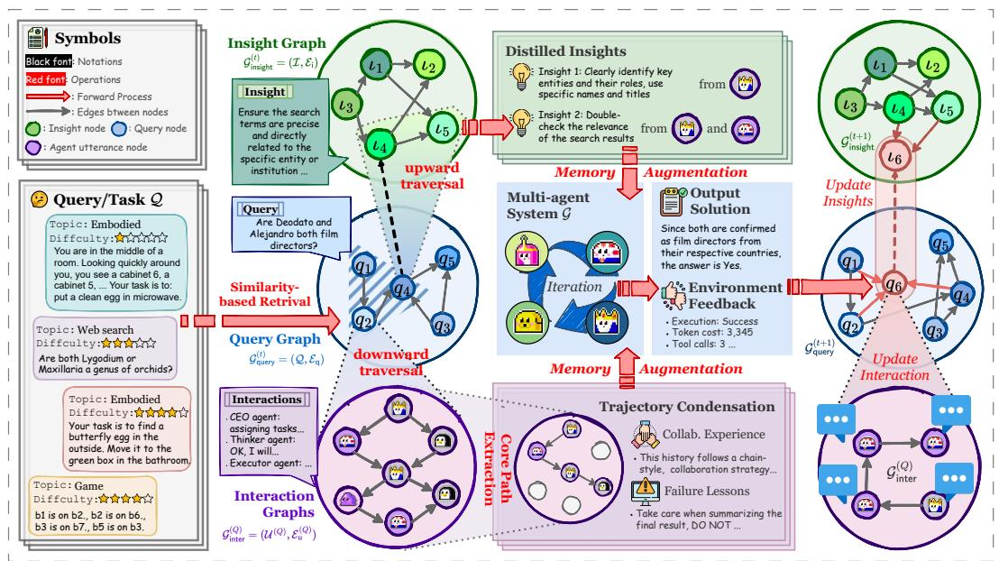  
Figure 2: The overview of our proposed G-Memory.

# 4.1 Coarse-grained Memory Retrieval

As a plug-in designed for seamless integration into mainstream MAS, ${ \sf G }$ -Memory is triggered when the MAS $\mathcal { G }$ encounters a new user query $Q$ . As emphasized in organizational memory theory [1], efficient knowledge retrieval typically begins with broadly relevant schemas prior to more fine-grained access. Following this principle, G-Memory first performs a coarse-grained similarity-based retrieval over the query graph $\mathcal { G } _ { \sf q u e r y }$ to efficiently obtain a sketched set of queries $\mathcal { Q } ^ { s }$ :

$$
\mathcal { Q } ^ { S } = \mathop { \arg \tan \ b { \operatorname { \mathbf { p } } } } _ { q _ { i } \in \mathcal { Q } \mathrm { ~ s . t . ~ } | \mathcal { Q } ^ { S } | = k } \left( \frac { \mathbf { v } ( Q ) \cdot \mathbf { v } ( q _ { i } ) } { | \mathbf { v } ( Q ) | | \mathbf { v } ( q _ { i } ) | } \right) ,
$$

where $\mathbf { v } ( \cdot )$ maps queries into fixed-length embeddings using models such as MiniLM [73]. While Equation (4) retrieves semantically similar historical queries, the similarity may be only superficial or noisy. Therefore, $\mathfrak { G }$ -Memory further enlarges the relevant set via hop expansion on the query graph:

$$
\tilde { \mathcal { Q } } ^ { \mathcal { S } } = \mathcal { Q } ^ { \mathcal { S } } \cup \big \{ Q _ { k } \in \mathcal { Q } \mid \exists Q _ { j } \in \mathcal { Q } ^ { \mathcal { S } } , Q _ { k } \in \mathcal { N } ^ { + } ( Q _ { j } ) \cup \mathcal { N } ^ { - } ( Q _ { j } ) \big \} ,
$$

where $\tilde { \mathcal { Q } } ^ { s }$ is augmented with the 1-hop neighbors of $\mathcal { Q } ^ { s }$ on the query graph $\mathcal { G } _ { \sf q u e r y }$ . However, it is suboptimal to directly feed these relevant records as input akin to certain single-agent memory systems [41, 37]. On one hand, the excessive context length may overwhelm the LLM; on the other hand, agents in MAS play distinct roles and should be assigned specialized memory tailored to their functions. To address this, the next section introduces a bi-directional processing scheme in G-Memory that operates over both abstract and fine-grained memory levels.

# 4.2 Bi-directional Memory Traversal

Subsequent to identifying the expanded set of relevant query nodes $\tilde { \mathcal { Q } } ^ { s }$ within $\mathcal { G } _ { \sf q u e r y }$ , ${ \sf G }$ -Memory executes a bi-directional memory traversal to furnish multi-granularity memory support. Specifically, ${ \sf G } \cdot$ -Memory first performs an upward traversal $( \mathcal { G } _ { \sf q u e r y }  \mathcal { G } _ { \sf i n s i g h t } )$ , retrieving insight nodes that may provide high-level guidance for the current task:

$$
\begin{array} { r } { \mathcal { Z } ^ { \mathcal { S } } = \Pi _ { \mathcal { Q } \to \mathbb { Z } } ( \tilde { \mathcal { Q } } ^ { \mathcal { S } } ) , \Pi _ { \mathcal { Q } \to \mathbb { Z } } ( \mathcal { S } _ { q } ) \triangleq \left\{ \iota _ { k } \in \mathbb { Z } \vert \Omega _ { k } \cap \mathcal { S } _ { q } \neq \emptyset \right\} , } \end{array}
$$

where $\Pi _ { \mathcal { Q } \to \mathcal { T } }$ is a query-to-insight projector that identifies all the insight nodes whose supporting query sets intersect with the input query set, and the retrieved insights $\mathcal { T } ^ { s }$ encapsulate distilled, generalized knowledge potentially relevant for orienting the MAS $\mathcal { G }$ ’s strategic approach to $Q$ .

Beyond generalized insights, the fine-grained textual interaction history of the MAS is equally valuable, as it reveals the underlying reasoning patterns that led to successful or failed collaborations [68, 74, 75]. To utilize these concisely, in the downward traversal $( \mathcal { G } _ { \sf q u e r y }  \mathcal { G } _ { \sf i n t e r a c t i o n } )$ ,

G-Memory employs an LLM-facilitated graph sparsifier $\boldsymbol { S _ { \mathrm { L L M } } } ( \cdot , \cdot )$ to extract the core subgraph that encapsulates essential inter-agent collaboration:

$$
\{ \hat { \mathcal { G } } _ { \mathrm { i n t e r } } ^ { Q _ { i } } \} _ { i = 1 } ^ { | M | } = \biggl \{ \mathcal { S } _ { \mathrm { L L M } } \big ( \mathcal { G } _ { \mathrm { i n t e r } } ^ { ( Q _ { j } ) } , Q \big ) \mid q _ { j } \in \begin{array} { c } { \mathrm { a r g t o p \mathrm { - } M } \ \mathcal { R } _ { \mathrm { L L M } } ( Q , q _ { k } ^ { \prime } ) \biggr \} , } \\ { \{ q _ { k } ^ { \prime } \in \tilde { \mathcal { Q } } ^ { s } \} \mathrm { s . t . } | \cdot | = M } \end{array} 
$$

where $\mathcal { R } _ { \mathrm { L L M } } ( Q , q _ { j } )$ rates the relevancy of historical queries w.r.t. $Q$ , and the sparsifier $\mathcal { S } _ { \mathrm { L L M } } ( \mathcal { G } _ { \mathrm { i n t e r } } ^ { ( Q _ { j } ) } , Q )$ constructs a sparsified graph $\hat { \mathcal { G } } _ { \mathrm { i n t e r } } ^ { ( Q _ { j } ) } = ( \hat { \mathcal { U } } ^ { ( Q _ { j } ) } , \hat { \mathcal { E } } _ { \mathrm { u } } ^ { ( Q _ { j } ) } )$ from the original $\mathcal { G } _ { \mathrm { i n t e r } } ^ { ( Q _ { j } ) }$ by identifying and retaining dialogue elements. Please refer to Appendix C for their implementations.

Upon completing the bi-directional traversal, we obtain both generalizable insights $( \mathcal { T } ^ { S } )$ and detailed collaborative trajectories $( \{ \hat { \mathcal { G } } _ { \sf i n t e r } ^ { Q _ { i } } \} _ { i = 1 } ^ { | M | } )$ . G-Memory then proceeds to provide specialized memory support for each agent ${ \mathcal { C } } \in { \mathcal { V } }$ within the MAS $\mathcal { G }$ .

$$
\mathsf { M e m } _ { i } \gets \Phi \left( \mathbb { Z } ^ { S } , \{ \hat { Q } _ { \mathsf { i n t e r } } ^ { Q _ { i } } \} _ { i = 1 } ^ { | M | } ; \mathsf { R o l e } _ { i } , Q \right) , \forall C _ { i } = ( \mathsf { B a s e } _ { i } , \mathsf { R o l e } _ { i } , \mathsf { M e m } _ { i } , \mathsf { P l u g i n } _ { i } ) \in \mathcal { V } ,
$$

where the operator $\Phi ( \cdot ; \cdot )$ evaluates the utility and relevance of each insight $\iota _ { k } \in \mathcal { T } ^ { S }$ and sparsified interaction graph $\hat { \mathcal { G } } _ { \mathrm { i n t e r } } ^ { ( Q _ { j } ) }$ c ncerning the agent’s specific role $\mathsf { R o l e } _ { i }$ and the task $Q$ (see Appendix C). Based on this evaluation, $\Phi$ intializes each agent’s internal memory state   
interaction snippets, summaries thereof, equipping it with pertinent historical context before it participates in the subsequent reasoning epochs of the MAS. It is worth noting that G-Memory is invoked at the onset of solving query $Q$ in our implementation. However, practitioners may flexibly configure more fine-grained invocation strategies, such as at the beginning of each MAS dialogue round or selectively for specific agents, based on their needs.

# 4.3 Hierarchy Memory Update

After completing memory augmentation for each agent, the system $\mathcal { G }$ is executed as outlined in Section 3, yielding a final solution $a ^ { ( T ) }$ and receiving environmental feedback, including execution status $\Psi _ { i } \in \mathsf { \bar { \{ F a i l e d , R e s o l v e d \} } }$ , token usage, and other performance metrics. Subsequently, G-Memory updates its hierarchical memory architecture to incorporate this new query. At the interaction level, $\mathfrak { G }$ -Memory traces each agent’s utterances to construct the interaction graph $\dot { \mathcal { G } } _ { \mathrm { i n t e r } } ^ { ( Q ) }$ , which is then stored. At the query level, a new query node is instantiated and added to the query graph :

$$
\begin{array} { r l } & { \quad q _ { \mathrm { n e w } }  ( Q , \Psi , \mathcal { G } _ { \mathrm { i n t e r } } ^ { ( Q ) } ) , \ : \mathcal { N } _ { \mathrm { c o n n } }  Q ^ { \mathcal { R } } \cup \Big ( \bigcup _ { \iota _ { k } \in \mathbb Z ^ { S } } \Omega _ { k } \Big ) , } \\ & { \quad \mathcal { E } _ { \mathrm { n e w } }  \{ ( q _ { n } , q _ { \mathrm { n e w } } ) \ : | \ : q _ { n } \in \mathcal { N } _ { \mathrm { c o n n } } \} , \ : \mathcal { G } _ { \mathrm { q u e r y } } ^ { \mathrm { n e x t } }  ( \mathcal { Q } \cup \{ q _ { \mathrm { n e w } } \} , \mathcal { E } _ { \mathrm { q } } \cup \mathcal { E } _ { \mathrm { n e w } } ) , } \end{array}
$$

where edges are established between $q _ { \mathrm { n e w } }$ and (ii) the set ${ \mathcal { Q } } ^ { \mathcal { R } }$ containing the top- $M$ relevant historical queries identified in Equation (7), and (ii) the set of queries $\textstyle \bigcup _ { \iota _ { k } \in { \mathcal { T } } _ { \mathrm { r e t } } } \Omega _ { k }$ that support the insights $\mathcal { T } ^ { S }$ utilized for solving $Q . \mathcal { G } _ { \sf q u e r y } ^ { \mathrm { n e x t } }$ denotes the updated query graph.

Finally, at the insight level, G-Memory integrates the learning from the completed query $Q$ into the insight graph $\mathcal { G } _ { \mathrm { i n s i g h t } } = ( \mathcal { T } , \mathcal { E } _ { \mathrm { i } } )$ . First, possible new insights summarizing the experience are generated and structurally linked via a summarization function $\mathcal { I } ( \cdot , \cdot )$ (see prompt in Appendix C) as follows:

$$
\begin{array} { r l } & { \iota _ { \mathsf { n e w } } = ( \mathcal { I } ( \mathcal { G } _ { \mathsf { i n t e r } } ^ { ( Q ) } , \Psi ) , \{ q _ { \mathsf { n e w } } \} ) , \ \mathcal { E } _ { \mathsf { i , n e w } } \gets \{ \big ( \iota _ { k } , \iota _ { \mathsf { n e w } } , q _ { \mathsf { n e w } } \big ) \mid \iota _ { k } \in \mathcal { I } ^ { S } \} } \\ & { \qquad \mathcal { G } _ { \mathsf { i n s i g h t } } ^ { \prime }  ( \mathcal { I } \cup \{ \iota _ { \mathsf { n e w } } \} , \mathcal { E } _ { \mathsf { i } } \cup \mathcal { E } _ { \mathsf { i , n e w } } ) } \end{array}
$$

where edges are added to connect the previously utilized insights which inspires the completion of $Q$ in Equation (6). Afterward, the supporting query sets $( \Omega _ { k } )$ for the utilized insights $( \mathcal { T } ^ { s } )$ are updated to include $q _ { \mathrm { n e w } }$ , reflecting their relevance to this successful (or failed) application:

$$
\begin{array} { r } { \mathcal { T } ^ { \mathrm { n e x t } }  ( \mathcal { T } \setminus \mathcal { T } _ { \mathrm { r e t } } ) \cup \{ ( \kappa _ { k } , \Omega _ { k } \cup \{ q _ { \mathrm { n e w } } \} ) \mid \iota _ { k } = ( \kappa _ { k } , \Omega _ { k } ) \in \mathcal { T } _ { \mathrm { r e t } } \} \cup \{ \iota _ { \mathrm { n e w } } \} } \\ { \mathcal { G } _ { \mathrm { i n s i g h t } } ^ { \mathrm { n e x t } }  ( \mathcal { T } ^ { \mathrm { n e x t } } , \mathcal { E } _ { \mathrm { i } } \cup \mathcal { E } _ { \mathrm { i , n e w } } ) , } \end{array}
$$

where the final node set $\mathcal { T } ^ { \mathrm { n e x t } }$ incorporates the new insight and the updated versions of the utilized insights, and the resulting graph $\mathcal { G } _ { \mathrm { i n s i g h t } } ^ { \mathrm { n e x t } }$ thus encapsulates the integrated knowledge. This continuous update cycle across all hierarchical levels enables $\mathfrak { G }$ -Memory to learn and adaptively refine its collective memory based on ongoing experience.

Table 1: Performance comparison with single/multi-agent memory architectures on five benchmarks. The underlying LLM backbone is GPT-4o-mini. We highlight the best and second best results.   

<table><tr><td rowspan=1 colspan=1>MAS</td><td rowspan=1 colspan=1>Memory</td><td rowspan=1 colspan=16>ALFWorld   SciWorld     PDDL    HotpotQA   FEVER      Avg.</td></tr><tr><td rowspan=8 colspan=1>AutoGenCOLM 2024</td><td rowspan=8 colspan=1>No-memoryVoyagerMemoryBankGenerativeMetaGPTChatDevMacNetG-Memory (Ours)</td><td rowspan=1 colspan=8>77.61↑0.00   54.49↑0.00    23.53↑0.00</td><td rowspan=1 colspan=8>28.57↑0.00   57.13↑0.00   48.27↑0.00</td></tr><tr><td rowspan=1 colspan=2>85.07↑7.46</td><td rowspan=1 colspan=6>62.36↑7.87   24.56↑1.03</td><td rowspan=1 colspan=5>32.32↑3.75  63.27↑6.14</td><td rowspan=1 colspan=1></td><td rowspan=1 colspan=2>53.52↑5.25</td></tr><tr><td rowspan=1 colspan=2>74.9612.65</td><td rowspan=1 colspan=6>53.111.38   20.4113.12</td><td rowspan=1 colspan=2>33.67↑5.10</td><td rowspan=1 colspan=3>61.22↑4.09</td><td rowspan=1 colspan=1></td><td rowspan=1 colspan=2>48.67↑0.40</td></tr><tr><td rowspan=1 colspan=2>86.36+8.75</td><td rowspan=1 colspan=2>61.19↑6.70</td><td rowspan=1 colspan=1></td><td rowspan=1 colspan=3>25.53↑2.00</td><td rowspan=1 colspan=2>31.63↑3.06</td><td rowspan=1 colspan=1></td><td rowspan=1 colspan=2>60.20↑3.07</td><td rowspan=1 colspan=1></td><td rowspan=1 colspan=2>52.98↑4.71</td></tr><tr><td rowspan=1 colspan=2>81.34↑3.73</td><td rowspan=1 colspan=2>61.91↑7.42</td><td rowspan=1 colspan=1></td><td rowspan=1 colspan=3>21.631.90</td><td rowspan=1 colspan=2>32.67↑4.10</td><td rowspan=1 colspan=1></td><td rowspan=1 colspan=2>62.67↑5.54</td><td rowspan=1 colspan=1></td><td rowspan=1 colspan=1>52.04↑3.77</td><td></td></tr><tr><td rowspan=1 colspan=1>79.85↑2.24</td><td rowspan=1 colspan=1></td><td rowspan=1 colspan=2>50.9613.53</td><td rowspan=1 colspan=1></td><td rowspan=1 colspan=3>16.6516.88</td><td rowspan=1 colspan=2>24.4914.08</td><td rowspan=1 colspan=1></td><td rowspan=1 colspan=2>59.18↑2.05</td><td rowspan=1 colspan=1></td><td rowspan=1 colspan=1>46.2312.04</td><td></td></tr><tr><td rowspan=1 colspan=1>76.5511.06</td><td rowspan=1 colspan=1></td><td rowspan=1 colspan=2>55.440.95</td><td rowspan=1 colspan=1></td><td rowspan=1 colspan=3>22.9410.59</td><td rowspan=1 colspan=2>28.3610.21</td><td rowspan=1 colspan=1></td><td rowspan=1 colspan=2>60.87↑3.74</td><td rowspan=1 colspan=1></td><td rowspan=1 colspan=1>48.83↑0.56</td><td></td></tr><tr><td rowspan=1 colspan=2>88.8111.20</td><td rowspan=1 colspan=2>67.40↑12.91</td><td rowspan=1 colspan=1></td><td rowspan=1 colspan=2>27.77↑4.24</td><td rowspan=1 colspan=1></td><td rowspan=1 colspan=2>35.67↑7.10</td><td rowspan=1 colspan=1></td><td rowspan=1 colspan=2>66.249.11</td><td rowspan=1 colspan=1></td><td rowspan=1 colspan=1>57.188.91</td><td></td></tr><tr><td rowspan=8 colspan=1></td><td rowspan=8 colspan=1>DyLANCOLM 2024</td><td rowspan=5 colspan=2>No-memoryVoyagerMemoryBankGenerativeMetaGPT-M</td><td rowspan=1 colspan=3>56.72↑0.00</td><td rowspan=1 colspan=2>55.38↑0.00</td><td rowspan=1 colspan=4>11.62↑0.00</td><td rowspan=1 colspan=2>31.69↑0.00</td><td rowspan=1 colspan=1></td><td rowspan=1 colspan=1>60.20↑0.00</td><td rowspan=1 colspan=1></td></tr><tr><td rowspan=1 colspan=1>66.42↑9.70</td><td rowspan=1 colspan=1></td><td rowspan=1 colspan=2>62.83↑7.45</td><td rowspan=1 colspan=1></td><td rowspan=1 colspan=2>15.10↑3.48</td><td rowspan=1 colspan=1></td><td rowspan=1 colspan=2>32.64↑0.95</td><td rowspan=1 colspan=1></td><td rowspan=1 colspan=2>62.24↑2.04</td><td rowspan=1 colspan=1></td><td rowspan=1 colspan=1>47.85↑4.73</td><td></td></tr><tr><td rowspan=1 colspan=1>55.221.50</td><td rowspan=1 colspan=1></td><td rowspan=1 colspan=2>54.7410.64</td><td rowspan=1 colspan=1></td><td rowspan=1 colspan=2>8.0813.54</td><td rowspan=1 colspan=1></td><td rowspan=1 colspan=2>29.5912.10</td><td rowspan=1 colspan=1></td><td rowspan=1 colspan=2>59.1311.07</td><td rowspan=1 colspan=1></td><td rowspan=1 colspan=1>41.351.77</td><td></td></tr><tr><td rowspan=1 colspan=1>67.91↑11.19</td><td rowspan=1 colspan=1></td><td rowspan=1 colspan=2>64.16†8.78</td><td rowspan=1 colspan=1></td><td rowspan=1 colspan=2>13.87↑2.25</td><td rowspan=1 colspan=1></td><td rowspan=1 colspan=1>29.29</td><td rowspan=1 colspan=1></td><td rowspan=1 colspan=1></td><td rowspan=1 colspan=2>62.30↑2.10</td><td rowspan=1 colspan=1></td><td rowspan=1 colspan=1>47.51↑4.39</td><td rowspan=1 colspan=1></td></tr><tr><td rowspan=1 colspan=1>69.40↑12.68</td><td rowspan=1 colspan=1></td><td rowspan=1 colspan=2>62.37↑6.99</td><td rowspan=1 colspan=1></td><td rowspan=1 colspan=2>14.45↑2.83</td><td rowspan=1 colspan=1></td><td rowspan=1 colspan=1>32.34</td><td rowspan=1 colspan=1></td><td rowspan=1 colspan=1></td><td rowspan=1 colspan=2>60.20↑0.00</td><td rowspan=1 colspan=1></td><td rowspan=1 colspan=1>47.75↑4.63</td><td rowspan=1 colspan=1></td></tr><tr><td rowspan=3 colspan=1>ChatDev-MMacNet-MG-Memory (Ours)</td><td rowspan=1 colspan=1>46.27↓10.45</td><td rowspan=1 colspan=1></td><td rowspan=1 colspan=2>53.3512.03</td><td rowspan=1 colspan=1></td><td rowspan=1 colspan=2>10.7510.87</td><td rowspan=1 colspan=1></td><td rowspan=1 colspan=1>22.45</td><td rowspan=1 colspan=1></td><td rowspan=1 colspan=1></td><td rowspan=1 colspan=2>58.3311.87</td><td rowspan=1 colspan=1></td><td rowspan=1 colspan=1>38.2314.89</td><td rowspan=1 colspan=1></td></tr><tr><td rowspan=1 colspan=1>53.4413.28</td><td rowspan=1 colspan=1></td><td rowspan=1 colspan=2>54.3211.06</td><td rowspan=1 colspan=1></td><td rowspan=1 colspan=2>12.11↑0.49</td><td rowspan=1 colspan=1></td><td rowspan=1 colspan=1>30.12</td><td rowspan=1 colspan=1></td><td rowspan=1 colspan=1></td><td rowspan=1 colspan=2>61.10↑0.90</td><td rowspan=1 colspan=1></td><td rowspan=1 colspan=1>42.220.90</td><td rowspan=1 colspan=1></td></tr><tr><td rowspan=1 colspan=1>70.90↑14.18</td><td rowspan=1 colspan=1></td><td rowspan=1 colspan=2>65.64↑10.26</td><td rowspan=1 colspan=1></td><td rowspan=1 colspan=2>18.95↑7.33</td><td rowspan=1 colspan=1></td><td rowspan=1 colspan=1>34.69</td><td rowspan=1 colspan=1></td><td rowspan=1 colspan=1></td><td rowspan=1 colspan=2>64.22↑4.02</td><td rowspan=1 colspan=1></td><td rowspan=1 colspan=1>50.887.76</td><td rowspan=1 colspan=1></td></tr><tr><td rowspan=8 colspan=1>MacNetICLR 2025</td><td rowspan=4 colspan=1>MacNetICLR 2025</td><td rowspan=4 colspan=2>No-memoryVoyagerMemoryBankGenerative</td><td rowspan=1 colspan=2>51.49↑0.00</td><td rowspan=1 colspan=1></td><td rowspan=1 colspan=2>57.53↑0.00</td><td rowspan=1 colspan=1></td><td rowspan=1 colspan=2>12.18↑0.00</td><td rowspan=1 colspan=1></td><td rowspan=1 colspan=1>28.57</td><td rowspan=1 colspan=1></td><td rowspan=1 colspan=1></td><td rowspan=1 colspan=1>60.29↑0.00</td><td rowspan=1 colspan=1></td></tr><tr><td rowspan=1 colspan=1>61.94↑10.45</td><td rowspan=1 colspan=1></td><td rowspan=1 colspan=2>64.53↑7.00</td><td rowspan=1 colspan=1></td><td rowspan=1 colspan=1>14.06</td><td rowspan=1 colspan=1></td><td rowspan=1 colspan=1></td><td rowspan=1 colspan=1>32.65</td><td rowspan=1 colspan=1></td><td rowspan=1 colspan=1></td><td rowspan=1 colspan=2>62.54↑2.25</td><td rowspan=1 colspan=1></td><td rowspan=1 colspan=1>47.14↑5.13</td><td rowspan=1 colspan=1></td></tr><tr><td rowspan=1 colspan=1>50.0011.49</td><td rowspan=1 colspan=1></td><td rowspan=1 colspan=2>60.15↑2.62</td><td rowspan=1 colspan=1></td><td rowspan=1 colspan=1>8.6413.54</td><td rowspan=1 colspan=1></td><td rowspan=1 colspan=1></td><td rowspan=1 colspan=1>33.67</td><td rowspan=1 colspan=1></td><td rowspan=1 colspan=1></td><td rowspan=1 colspan=2>61.22↑0.93</td><td rowspan=1 colspan=1></td><td rowspan=1 colspan=1>42.74↑0.73</td><td rowspan=1 colspan=1></td></tr><tr><td rowspan=1 colspan=1>62.69↑11.20</td><td rowspan=1 colspan=1></td><td rowspan=1 colspan=2>65.49†7.96</td><td rowspan=1 colspan=1></td><td rowspan=1 colspan=1>7.92</td><td rowspan=1 colspan=1></td><td rowspan=1 colspan=1></td><td rowspan=1 colspan=1>29.59</td><td rowspan=1 colspan=1></td><td rowspan=1 colspan=1></td><td rowspan=1 colspan=2>63.27↑2.98</td><td rowspan=1 colspan=1></td><td rowspan=1 colspan=1>45.79↑3.78</td><td rowspan=1 colspan=1></td></tr><tr><td rowspan=1 colspan=1>MetaGPT-M</td><td rowspan=1 colspan=1>63.70↑12.21</td><td rowspan=1 colspan=1></td><td rowspan=1 colspan=2>65.277.74</td><td rowspan=1 colspan=1></td><td rowspan=1 colspan=1>16.03</td><td rowspan=1 colspan=1></td><td rowspan=1 colspan=1></td><td rowspan=1 colspan=1>31.00</td><td rowspan=1 colspan=1></td><td rowspan=1 colspan=1></td><td rowspan=1 colspan=2>59.3310.96</td><td rowspan=1 colspan=1></td><td rowspan=1 colspan=1>47.07↑5.06</td><td rowspan=1 colspan=1></td></tr><tr><td rowspan=1 colspan=1>ChatDev-M</td><td rowspan=1 colspan=1>49.2512.24</td><td rowspan=1 colspan=1></td><td rowspan=1 colspan=1>56.58</td><td rowspan=1 colspan=1></td><td rowspan=1 colspan=1></td><td rowspan=1 colspan=1>13.51</td><td rowspan=1 colspan=1></td><td rowspan=1 colspan=1></td><td rowspan=1 colspan=1>29.00</td><td rowspan=1 colspan=1></td><td rowspan=1 colspan=1></td><td rowspan=1 colspan=1>59.18</td><td rowspan=1 colspan=1></td><td rowspan=1 colspan=1></td><td rowspan=1 colspan=1>41.50±0.51</td><td rowspan=1 colspan=1></td></tr><tr><td rowspan=2 colspan=1>MacNet-MG-Memory (Ours)</td><td rowspan=1 colspan=1>53.44↑1.95</td><td rowspan=1 colspan=1></td><td rowspan=1 colspan=1>56.14</td><td rowspan=1 colspan=1></td><td rowspan=1 colspan=1></td><td rowspan=1 colspan=1>13.59</td><td rowspan=1 colspan=1></td><td rowspan=1 colspan=1></td><td rowspan=1 colspan=1>27.89</td><td rowspan=1 colspan=1></td><td rowspan=1 colspan=1></td><td rowspan=1 colspan=1>59.20</td><td rowspan=1 colspan=1></td><td rowspan=1 colspan=1></td><td rowspan=1 colspan=1>42.05↑0.04</td><td rowspan=1 colspan=1></td></tr><tr><td rowspan=1 colspan=1>67.16+15.67</td><td rowspan=1 colspan=1></td><td rowspan=1 colspan=1>68.11</td><td rowspan=1 colspan=1></td><td rowspan=1 colspan=1></td><td rowspan=1 colspan=1>24.33</td><td rowspan=1 colspan=1></td><td rowspan=1 colspan=1></td><td rowspan=1 colspan=1>35.69</td><td rowspan=1 colspan=1></td><td rowspan=1 colspan=1></td><td rowspan=1 colspan=2>64.44↑4.15</td><td rowspan=1 colspan=1></td><td rowspan=1 colspan=1>51.95↑9.94</td><td rowspan=1 colspan=1></td></tr></table>

# 5 Experiment

In this section, we conduct extensive experiments to answer: (RQ1) How does G-Memory perform compared to existing single/multi-agent memory architectures? (RQ2) Does G-Memory incur excessive resource overhead? (RQ3) How sensitive is G-Memory to its key components and parameters?

# 5.1 Experiment Setup

Datasets and Benchmarks. To thoroughly evaluate the effectiveness of G-Memory, we adopt five widely-adopted benchmarks across three domains: (1) Knowledge reasoning, including HotpotQA [76] and FEVER [77]; (2) Embodied action, including ALFWorld [78] and SciWorld [79]; (3) Game, namely PDDL [80]. Details on these benchmarks are in Appendix A.1.

Baselines. We select four representative single-agent memory baselines, including non-memory, Voyager [16], MemoryBank [36], and Generative Agents [19], as well as three multi-agent memory implementations from MetaGPT [21], ChatDev [46], and MacNet [47], denoted as MetaGPT-M, ChatDev-M, and MacNet-M, respectively. Details are in Appendix A.2.

MAS and LLM Backbones. We select three representative multi-agent frameworks to integrate with G-Memory and the baselines, including AutoGen [13], DyLAN [72], and MacNet [47]. More details on the MAS setups are placed in Appendix A.3. For instantiating these MAS frameworks, we adopt two open-source LLMs, $\mathtt { Q w e n - } 2 . 5 \mathrm { - } 7 \mathrm { b }$ and $\mathtt { Q w e n } { - } 2 \ . 5 { - } 1 \ 4 \mathrm { b }$ , as well as one proprietary LLM, gpt-4o-mini. The deployment of Qwen series is via local instantiation using Ollama1, and GPT models are accessed via OpenAI APIs.

Parameter Configurations. We implement the embedding function $\mathbf { v } ( \cdot )$ in Equation (4) with ALL-MINILM-L6-V2 [81]. The number of the most relevant interaction graphs $M$ in Equation (7) is set among $\{ 2 , 3 , 4 , 5 \}$ , and the number of relevant queries $k$ in Equation (4) is set among $\{ 1 , 2 \}$ . The detailed ablation study on hyper-parameters is placed in Section 5.4.

# 5.2 Main Results (RQ1)

Tables 1, 2 and 3 comprehensively report the performance of different memory architectures across three LLM backbones and three MAS frameworks. We summarize the key observations as follows:

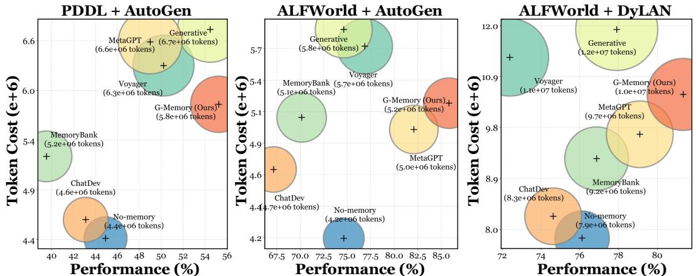  
Figure 3: Cost analysis of G-Memory. We showcase the performance versus the overall system token cost when combined with different memory architectures.

Takeaway ➊: G-Memory consistently improves performance across all task domains and MAS frameworks. As shown in Table 2, when integrated with AutoGen and MacNet (powered by $\mathsf { Q w e n } { - 2 } \cdot 5 { - } 7 \mathrm { b } )$ , G-Memory surpasses the best-performing single-/multi-agent memory baselines by an average of $6 . 8 \%$ and $5 . 5 \%$ , respectively. With the more capable $\mathtt { Q w e n } { - } 2 . 5 { - } 1 4 \mathrm { b }$ , the improvement is even more pronounced: in Table 3, $\mathfrak { G }$ -Memory boosts MacNet’s performance on ALFWorld from $5 8 . 2 1 \%$ to ${ \bar { 7 } } 9 . 1 0 \%$ , achieving a substantial $2 0 . { \dot { 8 } } 9 \%$ gain.

Takeaway $\pmb { \varrho }$ : Multi-agent systems demand specialized memory designs. A thorough examination of existing baselines reveals a surprising insight: most memory mechanisms fail to consistently benefit MAS settings. In Table 2, baselines such as Voyager and MemoryBank degrade AutoGen’s performance on PDDL by as much as $4 . 1 7 \%$ and $1 . 3 4 \%$ , respectively. We attribute this to the inability of these methods to provide agent role-specific memory support, which is essential in the PDDL strategic game tasks, where effective division of labor is critical to success. Even MAS-oriented designs, such as ChatDev-M, result in a $2 . 3 2 \%$ performance drop when applied to MacNet+SciWorld. We attribute this to ChatDev-M’s narrow memory scope—storing only the execution results of past queries, which provides limited utility in embodied action environments. These findings highlight the necessity of G-Memory’s core characteristics: role-specific memory cues, abstracted high-level insights, and trajectory condensation—all of which are critical for effective memory in MAS.

# 5.3 Cost Analysis (RQ2)

To evaluate the efficiency of G-Memory in terms of token consumption, we visualize the performance versus token cost trade-off across various settings, as shown in Figures 3 and 7. Our findings are:

Takeaway $\pmb { \Theta }$ : G-Memory achieves high-performing collective memory without excessive token consumption. As depicted in Figure 3, G-Memory consistently delivers the highest performance improvement $( 1 0 . 3 2 \%$ $\uparrow$ over no-memory setting on PDDL $^ +$ AutoGen) while maintaining a modest increase in token consumption (only $1 . { \dot { 4 } } \times 1 0 ^ { 6 }$ ). In contrast, MetaGPT-M incurred an additional $2 . 2 \times 1 0 ^ { 6 }$ tokens for a mere $4 . 0 7 \%$ gain. This clearly demonstrates the token-efficiency of G-Memory.

# 5.4 Framework Analysis (RQ3)

Sensitivity Analysis. Regarding the hop expansion, as shown in Figure 4a, 1-hop expansion consistently yields the best or near-best performance across tasks, with peak accuracies of ${ \mathrm { 8 5 . 8 2 \% } }$ (ALFWorld), $5 5 . 2 4 \%$ (PDDL) in AutoGen. In contrast, 2-hop and 3-hop settings often degrade performance, e.g., PDDL drops to $4 9 . 7 9 \%$ (2-hop). This suggests that excessive hop expansion may introduce irrelevant insights during memory upward traversal, impairing task-specific reasoning. Similarly, Figure 4b shows that the optimal $k$ is among $\{ 1 , 2 \}$ . Larger $k$ values (e.g., $k { = } 5$ ) can significantly degrade the system performance, e.g., $7 . 7 1 \% \downarrow$ on ALFWorld $+$ AutoGen and $2 . 5 \% \downarrow$ on FEVER $+$ DyLAN, indicating that retrieving more queries may introduce task-irrelevant noise. Collectively, we employ 1-hop expansion and $k \in \{ 1 , 2 \}$ throughout the experiments.

Ablation Study. Figure $\cdot$ presents an ablation of G-Memory by isolating the impact of the highlevel insight module As shown, removing $\boldsymbol { \mathcal { T } ^ { s } }$ in Equation (6)) and fine-grained interactions (her part leads to a consistent performance dro $\{ \hat { \mathcal { G } } _ { \mathrm { i n t e r } } ^ { \bar { Q } _ { i } } \} _ { i = 1 } ^ { | M | }$ in Equation (7)).nly fine-grained interactions are enabled, the average scores drop by $4 . 4 7 \% \downarrow$ for AutoGen and $3 . 8 2 \% \downarrow$ for DyLAN

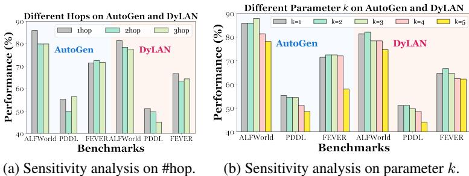

<table><tr><td>MAS</td><td>Inter. Insi.</td><td>PDDL FEVER</td><td></td></tr><tr><td rowspan="2">AutoGen</td><td>√</td><td>O</td><td>54.46</td><td>63.27</td></tr><tr><td>O</td><td>v v</td><td>50.00 55.24</td><td>68.77 71.43</td></tr><tr><td rowspan="4">DyLAN</td><td>v v</td><td></td><td>48.75</td><td>61.39</td></tr><tr><td>O</td><td>O v</td><td>46.69</td><td>64.31</td></tr><tr><td>v</td><td></td><td></td><td></td></tr><tr><td></td><td>v</td><td>51.12</td><td>66.66</td></tr></table>

(c) Ablation study on two variants of G-Memory.

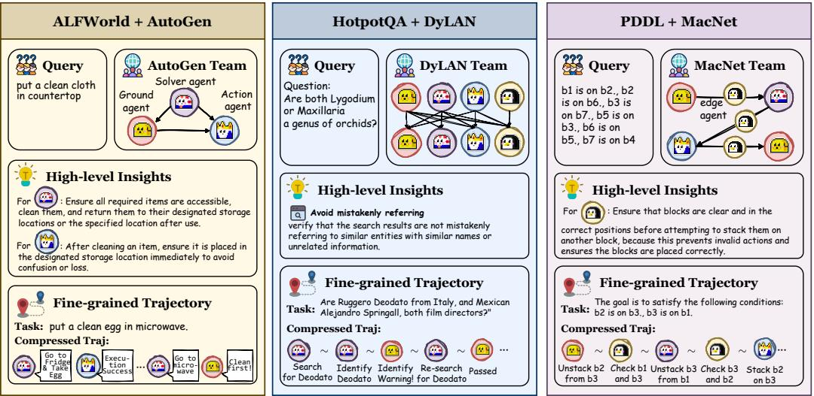  
Figure 4: (a) Sensitivity analysis of the hop expansion in Equation (5); (b) Sensitivity analysis of the number of selected queries $k$ in Equation (4); (c) We study two variants of G-Memory: merely providing high-level insights (i.e., the insights $\mathcal { T } ^ { s }$ in Equation (6)) or fine-grained interactions (i.e., the core trajectories in Equation (7)). All the experiments here are done with $\mathtt { Q w e n } { - } 2 . 5 { - } 1 4 \mathrm { b }$ .   
Figure 5: Case study of G-Memory.

compared to the full method. Conversely, enabling only insights leads to smaller drops of $3 . 9 5 \%$ and ${ \bar { 3 } } . 3 9 \%$ . This indicates that while both components are contributive, interactions offer a slightly greater impact, likely due to their preserving more fine-grained, dialogue-level contextual grounding.

# 5.5 Case Study

Figure 5 illustrates concrete memory cues provided by G-Memory across diverse tasks. For example, in the ALFWorld+AutoGen setting, given the task query “put a clean cloth in countertop”, G-Memory successfully retrieves a highly analogous historical query, “put a clean egg in microwave”—both requiring the object to be in a clean state. Alongside this, G-Memory surfaces a critical trajectory segment where the solver agent attempts to place the egg in the microwave before cleaning, prompting the ground agent to intervene. This collaborative trajectory offers actionable guidance for the current task. Moreover, the high-level insights retrieved by G-Memory prove equally valuable for task execution. In the context of HotpotQA’s web search task, ${ \sf G }$ -Memory retrieves an insight warning against “mistakenly referring”, which helps prevent agents from incorrectly answering based on similarly named individuals. Overall, G-Memory provides effective multi-level memory support across varied domains, including embodied action, knowledge reasoning, and game environments.

# 6 Conclusion & Limitation

In this paper, we conduct a thorough examination of existing memory architectures designed for multi-agent systems (MAS) and identify that their overly simplified designs fundamentally hinder the systems’ capacity for self-evolution. To bridge this gap, we propose G-Memory, a hierarchical memory framework that organizes the complex and extended interaction trajectories of MAS into a three-tier graph hierarchy: the insight, query, and interaction graphs. G-Memory provides each agent with customized and hierarchical memory cues, ranging from abstract, generalizable insights to fine-grained, task-critical collaborative segments, and dynamically evolves its knowledge base across episodes. Extensive experiments demonstrate that ${ \sf G }$ -Memory can be seamlessly integrated into state-of-the-art MAS frameworks, significantly enhancing their self-evolution capability, e.g., up to $2 0 . 8 9 \% \uparrow$ improvement on embodied action tasks. Limitations: Although G-Memory has been evaluated across three domains and five benchmarks, further validation on more diverse tasks (e.g., medical QA) would strengthen its soundness, which we leave for future work.

# References

[1] James P Walsh and Gerardo Rivera Ungson. Organizational memory. Academy of management review, 16(1):57–91, 1991.   
[2] Danny Driess, Fei Xia, Mehdi SM Sajjadi, Corey Lynch, Aakanksha Chowdhery, Ayzaan Wahid, Jonathan Tompson, Quan Vuong, Tianhe Yu, Wenlong Huang, et al. Palm-e: An embodied multimodal language model. 2023.   
[3] Shihao Wang, Zhiding Yu, Xiaohui Jiang, Shiyi Lan, Min Shi, Nadine Chang, Jan Kautz, Ying Li, and Jose M Alvarez. Omnidrive: A holistic llm-agent framework for autonomous driving with 3d perception, reasoning and planning. arXiv preprint arXiv:2405.01533, 2024.   
[4] Sipeng Zheng, Jiazheng Liu, Yicheng Feng, and Zongqing Lu. Steve-eye: Equipping llm-based embodied agents with visual perception in open worlds. arXiv preprint arXiv:2310.13255, 2023.   
[5] Yuxi Wei, Zi Wang, Yifan Lu, Chenxin Xu, Changxing Liu, Hao Zhao, Siheng Chen, and Yanfeng Wang. Editable scene simulation for autonomous driving via collaborative llm-agents. In Proceedings of the IEEE/CVF Conference on Computer Vision and Pattern Recognition, pages 15077–15087, 2024.   
[6] Yuqi Zhu, Shuofei Qiao, Yixin Ou, Shumin Deng, Shiwei Lyu, Yue Shen, Lei Liang, Jinjie Gu, Huajun Chen, and Ningyu Zhang. Knowagent: Knowledge-augmented planning for llm-based agents. arXiv preprint arXiv:2403.03101, 2024.   
[7] Lutfi Eren Erdogan, Nicholas Lee, Sehoon Kim, Suhong Moon, Hiroki Furuta, Gopala Anumanchipalli, Kurt Keutzer, and Amir Gholami. Plan-and-act: Improving planning of agents for long-horizon tasks. arXiv preprint arXiv:2503.09572, 2025.   
[8] Xu Huang, Weiwen Liu, Xiaolong Chen, Xingmei Wang, Hao Wang, Defu Lian, Yasheng Wang, Ruiming Tang, and Enhong Chen. Understanding the planning of llm agents: A survey. arXiv preprint arXiv:2402.02716, 2024.   
[9] Pranav Putta, Edmund Mills, Naman Garg, Sumeet Motwani, Chelsea Finn, Divyansh Garg, and Rafael Rafailov. Agent q: Advanced reasoning and learning for autonomous ai agents. arXiv preprint arXiv:2408.07199, 2024.   
[10] Tula Masterman, Sandi Besen, Mason Sawtell, and Alex Chao. The landscape of emerging ai agent architectures for reasoning, planning, and tool calling: A survey. arXiv preprint arXiv:2404.11584, 2024.   
[11] Manling Li, Shiyu Zhao, Qineng Wang, Kangrui Wang, Yu Zhou, Sanjana Srivastava, Cem Gokmen, Tony Lee, Erran Li Li, Ruohan Zhang, et al. Embodied agent interface: Benchmarking llms for embodied decision making. Advances in Neural Information Processing Systems, 37:100428–100534, 2024.   
[12] Yijun Yang, Tianyi Zhou, Kanxue Li, Dapeng Tao, Lusong Li, Li Shen, Xiaodong He, Jing Jiang, and Yuhui Shi. Embodied multi-modal agent trained by an llm from a parallel textworld. In Proceedings of the IEEE/CVF conference on computer vision and pattern recognition, pages 26275–26285, 2024.   
[13] Qingyun Wu, Gagan Bansal, Jieyu Zhang, Yiran Wu, Shaokun Zhang, Erkang Zhu, Beibin Li, Li Jiang, Xiaoyun Zhang, and Chi Wang. Autogen: Enabling next-gen llm applications via multi-agent conversation framework, August 01, 2023 2023.

[14] Daya Guo, Qihao Zhu, Dejian Yang, Zhenda Xie, Kai Dong, Wentao Zhang, Guanting Chen, Xiao Bi, Y. Wu, Y. K. Li, Fuli Luo, Yingfei Xiong, and Wenfeng Liang. Deepseek-coder: When the large language model meets programming – the rise of code intelligence, 2024.

[15] Sirui Hong, Yizhang Lin, Bang Liu, Bangbang Liu, Binhao Wu, Ceyao Zhang, Chenxing Wei, Danyang Li, Jiaqi Chen, Jiayi Zhang, et al. Data interpreter: An llm agent for data science. arXiv preprint arXiv:2402.18679, 2024.

[16] Guanzhi Wang, Yuqi Xie, Yunfan Jiang, Ajay Mandlekar, Chaowei Xiao, Yuke Zhu, Linxi Fan, and Anima Anandkumar. Voyager: An Open-Ended Embodied Agent with Large Language Models. arXiv e-prints, page arXiv:2305.16291, May 2023.

[17] Long Chen, Oleg Sinavski, Jan Hünermann, Alice Karnsund, Andrew James Willmott, Danny Birch, Daniel Maund, and Jamie Shotton. Driving with llms: Fusing object-level vector modality for explainable autonomous driving. In 2024 IEEE International Conference on Robotics and Automation (ICRA), pages 14093–14100. IEEE, 2024.

[18] Yuan Sun, Navid Salami Pargoo, Peter Jin, and Jorge Ortiz. Optimizing autonomous driving for safety: A human-centric approach with llm-enhanced rlhf. In Companion of the 2024 on ACM International Joint Conference on Pervasive and Ubiquitous Computing, pages 76–80, 2024.

[19] Joon Sung Park, Joseph C. O’Brien, Carrie J. Cai, Meredith Ringel Morris, Percy Liang, and Michael S. Bernstein. Generative agents: Interactive simulacra of human behavior, April 01, 2023 2023.

[20] Yilun Du, Shuang Li, Antonio Torralba, Joshua B. Tenenbaum, and Igor Mordatch. Improving factuality and reasoning in language models through multiagent debate. CoRR, abs/2305.14325, 2023.

[21] Sirui Hong, Xiawu Zheng, Jonathan Chen, Yuheng Cheng, Jinlin Wang, Ceyao Zhang, Zili Wang, Steven Ka Shing Yau, Zijuan Lin, Liyang Zhou, Chenyu Ran, Lingfeng Xiao, and Chenglin Wu. Metagpt: Meta programming for multi-agent collaborative framework, August 01, 2023 2023.

[22] Marvin Minsky. Society of mind. Simon and Schuster, 1988.

[23] Push Singh. Examining the society of mind. Comput. Artif. Intell., 22(6):521–543, 2003.

[24] Guohao Li, Hasan Hammoud, Hani Itani, Dmitrii Khizbullin, and Bernard Ghanem. CAMEL: communicative agents for "mind" exploration of large language model society. In NeurIPS, 2023.

[25] Zhenhailong Wang, Shaoguang Mao, Wenshan Wu, Tao Ge, Furu Wei, and Heng Ji. Unleashing cognitive synergy in large language models: A task-solving agent through multi-persona selfcollaboration, July 01, 2023 2023. work in progress.

[26] Taicheng Guo, Xiuying Chen, Yaqi Wang, Ruidi Chang, Shichao Pei, Nitesh V. Chawla, Olaf Wiest, and Xiangliang Zhang. Large language model based multi-agents: A survey of progress and challenges. CoRR, abs/2402.01680, 2024.

[27] Pouya Pezeshkpour, Eser Kandogan, Nikita Bhutani, Sajjadur Rahman, Tom Mitchell, and Estevam Hruschka. Reasoning capacity in multi-agent systems: Limitations, challenges and human-centered solutions. CoRR, abs/2402.01108, 2024.

[28] Giorgio Piatti, Zhijing Jin, Max Kleiman-Weiner, Bernhard Schölkopf, Mrinmaya Sachan, and Rada Mihalcea. Cooperate or collapse: Emergence of sustainability behaviors in a society of llm agents. arXiv preprint arXiv:2404.16698, 2024.

[29] Rafael Pina, Varuna De Silva, and Corentin Artaud. Discovering causality for efficient cooperation in multi-agent environments. CoRR, abs/2306.11846, 2023.

[30] Guibin Zhang, Yanwei Yue, Zhixun Li, Sukwon Yun, Guancheng Wan, Kun Wang, Dawei Cheng, Jeffrey Xu Yu, and Tianlong Chen. Cut the crap: An economical communication pipeline for llm-based multi-agent systems. arXiv preprint arXiv:2410.02506, 2024.

[31] Yanwei Yue, Guibin Zhang, Boyang Liu, Guancheng Wan, Kun Wang, Dawei Cheng, and Yiyan Qi. Masrouter: Learning to route llms for multi-agent systems. arXiv preprint arXiv:2502.11133, 2025.   
[32] Qinlin Zhao, Jindong Wang, Yixuan Zhang, Yiqiao Jin, Kaijie Zhu, Hao Chen, and Xing Xie. Competeai: Understanding the competition behaviors in large language model-based agents. arXiv preprint arXiv:2310.17512, 2023.   
[33] Tian Liang, Zhiwei He, Wenxiang Jiao, Xing Wang, Yan Wang, Rui Wang, Yujiu Yang, Zhaopeng Tu, and Shuming Shi. Encouraging divergent thinking in large language models through multi-agent debate. CoRR, abs/2305.19118, 2023.   
[34] Wei Wang, Dan Zhang, Tao Feng, Boyan Wang, and Jie Tang. Battleagentbench: A benchmark for evaluating cooperation and competition capabilities of language models in multi-agent systems. arXiv preprint arXiv:2408.15971, 2024.   
[35] Chuanyang Zheng, Zhengying Liu, Enze Xie, Zhenguo Li, and Yu Li. Progressive-hint prompting improves reasoning in large language models, April 01, 2023 2023. Tech Report.   
[36] Wanjun Zhong, Lianghong Guo, Qiqi Gao, He Ye, and Yanlin Wang. Memorybank: Enhancing large language models with long-term memory. In Proceedings of the AAAI Conference on Artificial Intelligence, volume 38, pages 19724–19731, 2024.   
[37] Charles Packer, Vivian Fang, Shishir_G Patil, Kevin Lin, Sarah Wooders, and Joseph_E Gonzalez. Memgpt: Towards llms as operating systems. 2023.   
[38] Ali Modarressi, Abdullatif Köksal, Ayyoob Imani, Mohsen Fayyaz, and Hinrich Schütze. Memllm: Finetuning llms to use an explicit read-write memory. arXiv preprint arXiv:2404.11672, 2024.   
[39] Zeyu Zhang, Xiaohe Bo, Chen Ma, Rui Li, Xu Chen, Quanyu Dai, Jieming Zhu, Zhenhua Dong, and Ji-Rong Wen. A survey on the memory mechanism of large language model based agents. arXiv preprint arXiv:2404.13501, 2024.   
[40] Chenxu Hu, Jie Fu, Chenzhuang Du, Simian Luo, Junbo Zhao, and Hang Zhao. Chatdb: Augmenting llms with databases as their symbolic memory. arXiv preprint arXiv:2306.03901, 2023.   
[41] Junru Lu, Siyu An, Mingbao Lin, Gabriele Pergola, Yulan He, Di Yin, Xing Sun, and Yunsheng Wu. Memochat: Tuning llms to use memos for consistent long-range open-domain conversation. arXiv preprint arXiv:2308.08239, 2023.   
[42] Yancheng Wang, Ziyan Jiang, Zheng Chen, Fan Yang, Yingxue Zhou, Eunah Cho, Xing Fan, Xiaojiang Huang, Yanbin Lu, and Yingzhen Yang. Recmind: Large language model powered agent for recommendation. arXiv preprint arXiv:2308.14296, 2023.   
[43] Andrew Zhao, Daniel Huang, Quentin Xu, Matthieu Lin, Yong-Jin Liu, and Gao Huang. Expel: Llm agents are experiential learners. In Proceedings of the AAAI Conference on Artificial Intelligence, volume 38, pages 19632–19642, 2024.   
[44] Yuan Li, Yixuan Zhang, and Lichao Sun. Metaagents: Simulating interactions of human behaviors for llm-based task-oriented coordination via collaborative generative agents. arXiv preprint arXiv:2310.06500, 2023.   
[45] Chen Gao, Xiaochong Lan, Zhihong Lu, Jinzhu Mao, Jinghua Piao, Huandong Wang, Depeng Jin, and Yong Li. S3: Social-network simulation system with large language model-empowered agents. arXiv preprint arXiv:2307.14984, 2023.   
[46] Chen Qian, Xin Cong, Cheng Yang, Weize Chen, Yusheng Su, Juyuan Xu, Zhiyuan Liu, and Maosong Sun. Communicative agents for software development, July 01, 2023 2023. 25 pages, 9 figures, 2 tables.   
[47] Chen Qian, Zihao Xie, Yifei Wang, Wei Liu, Yufan Dang, Zhuoyun Du, Weize Chen, Cheng Yang, Zhiyuan Liu, and Maosong Sun. Scaling large-language-model-based multi-agent collaboration. arXiv preprint arXiv:2406.07155, 2024.   
[48] Mingchen Zhuge, Wenyi Wang, Louis Kirsch, Francesco Faccio, Dmitrii Khizbullin, and Jürgen Schmidhuber. Gptswarm: Language agents as optimizable graphs. In Forty-first International Conference on Machine Learning, 2024.   
[49] Shengran Hu, Cong Lu, and Jeff Clune. Automated design of agentic systems. arXiv preprint arXiv:2408.08435, 2024.   
[50] Jiayi Zhang, Jinyu Xiang, Zhaoyang Yu, Fengwei Teng, Xionghui Chen, Jiaqi Chen, Mingchen Zhuge, Xin Cheng, Sirui Hong, Jinlin Wang, Bingnan Zheng, Bang Liu, Yuyu Luo, and Chenglin Wu. AFlow: Automating Agentic Workflow Generation, October 2024. arXiv:2410.10762.   
[51] Guibin Zhang, Luyang Niu, Junfeng Fang, Kun Wang, Lei Bai, and Xiang Wang. Multi-agent architecture search via agentic supernet. arXiv preprint arXiv:2502.04180, 2025.   
[52] Zhangyue Yin, Qiushi Sun, Cheng Chang, Qipeng Guo, Junqi Dai, Xuan-Jing Huang, and Xipeng Qiu. Exchange-of-thought: Enhancing large language model capabilities through cross-model communication. In Proceedings of the 2023 Conference on Empirical Methods in Natural Language Processing, pages 15135–15153, 2023.   
[53] Lei Wang, Chen Ma, Xueyang Feng, Zeyu Zhang, Hao Yang, Jingsen Zhang, Zhiyuan Chen, Jiakai Tang, Xu Chen, Yankai Lin, Wayne Xin Zhao, Zhewei Wei, and Ji-Rong Wen. A survey on large language model based autonomous agents. Front. Comput. Sci., 18, 2024.   
[54] Zhiheng Xi, Wenxiang Chen, Xin Guo, Wei He, Yiwen Ding, Boyang Hong, Ming Zhang, Junzhe Wang, Senjie Jin, Enyu Zhou, Rui Zheng, Xiaoran Fan, Xiao Wang, Limao Xiong, Yuhao Zhou, Weiran Wang, Changhao Jiang, Yicheng Zou, Xiangyang Liu, Zhangyue Yin, Shihan Dou, Rongxiang Weng, Wensen Cheng, Qi Zhang, Wenjuan Qin, Yongyan Zheng, Xipeng Qiu, Xuanjing Huan, and Tao Gui. The rise and potential of large language model based agents: A survey. arxiv preprint, abs/2309.07864, 2023.   
[55] Chen Gao, Xiaochong Lan, Nian Li, Yuan Yuan, Jingtao Ding, Zhilun Zhou, Fengli Xu, and Yong Li. Large language models empowered agent-based modeling and simulation: A survey and perspectives. CoRR, abs/2312.11970, 2023.   
[56] Xinyi Li, Sai Wang, Siqi Zeng, Yu Wu, and Yi Yang. A survey on llm-based multi-agent systems: workflow, infrastructure, and challenges. Vicinagearth, 1(1):9, 2024.   
[57] Longtao Zheng, Rundong Wang, Xinrun Wang, and Bo An. Synapse: Trajectory-as-exemplar prompting with memory for computer control. arXiv preprint arXiv:2306.07863, 2023.   
[58] Xizhou Zhu, Yuntao Chen, Hao Tian, Chenxin Tao, Weijie Su, Chenyu Yang, Gao Huang, Bin Li, Lewei Lu, Xiaogang Wang, et al. Ghost in the minecraft: Generally capable agents for open-world environments via large language models with text-based knowledge and memory. arXiv preprint arXiv:2305.17144, 2023.   
[59] Xiangru Tang, Tianyu Hu, Muyang Ye, Yanjun Shao, Xunjian Yin, Siru Ouyang, Wangchunshu Zhou, Pan Lu, Zhuosheng Zhang, Yilun Zhao, et al. Chemagent: Self-updating library in large language models improves chemical reasoning. arXiv preprint arXiv:2501.06590, 2025.   
[60] Noah Shinn, Beck Labash, and Ashwin Gopinath. Reflexion: an autonomous agent with dynamic memory and self-reflection. arXiv preprint, abs/2303.11366, 2023.   
[61] Wujiang Xu, Kai Mei, Hang Gao, Juntao Tan, Zujie Liang, and Yongfeng Zhang. A-mem: Agentic memory for llm agents. arXiv preprint arXiv:2502.12110, 2025.   
[62] Prateek Chhikara, Dev Khant, Saket Aryan, Taranjeet Singh, and Deshraj Yadav. Mem0: Building production-ready ai agents with scalable long-term memory. arXiv preprint arXiv:2504.19413, 2025.   
[63] Rana Salama, Jason Cai, Michelle Yuan, Anna Currey, Monica Sunkara, Yi Zhang, and Yassine Benajiba. Meminsight: Autonomous memory augmentation for llm agents. arXiv preprint arXiv:2503.21760, 2025.   
[64] Junlin Wang, Jue Wang, Ben Athiwaratkun, Ce Zhang, and James Zou. Mixture-of-agents enhances large language model capabilities. arXiv preprint arXiv:2406.04692, 2024.   
[65] Wangchunshu Zhou, Yixin Ou, Shengwei Ding, Long Li, Jialong Wu, Tiannan Wang, Jiamin Chen, Shuai Wang, Xiaohua Xu, Ningyu Zhang, et al. Symbolic learning enables self-evolving agents. arXiv preprint arXiv:2406.18532, 2024.   
[66] Xuechen Liang, Meiling Tao, Yinghui Xia, Tianyu Shi, Jun Wang, and JingSong Yang. Self-evolving agents with reflective and memory-augmented abilities. arXiv preprint arXiv:2409.00872, 2024.   
[67] Weize Chen, Yusheng Su, Jingwei Zuo, Cheng Yang, Chenfei Yuan, Chen Qian, Chi-Min Chan, Yujia Qin, Yaxi Lu, Ruobing Xie, Zhiyuan Liu, Maosong Sun, and Jie Zhou. Agentverse: Facilitating multi-agent collaboration and exploring emergent behaviors in agents, 2023.   
[68] Yue Hu, Yuzhu Cai, Yaxin Du, Xinyu Zhu, Xiangrui Liu, Zijie Yu, Yuchen Hou, Shuo Tang, and Siheng Chen. Self-evolving multi-agent collaboration networks for software development. arXiv preprint arXiv:2410.16946, 2024.   
[69] Guibin Zhang, Yanwei Yue, Xiangguo Sun, Guancheng Wan, Miao Yu, Junfeng Fang, Kun Wang, Tianlong Chen, and Dawei Cheng. G-designer: Architecting multi-agent communication topologies via graph neural networks. arXiv preprint arXiv:2410.11782, 2024.   
[70] Siyu Yuan, Kaitao Song, Jiangjie Chen, Xu Tan, Dongsheng Li, and Deqing Yang. Evoagent: Towards automatic multi-agent generation via evolutionary algorithms. arXiv preprint arXiv:2406.14228, 2024.   
[71] Guibin Zhang, Kaijie Chen, Guancheng Wan, Heng Chang, Hong Cheng, Kun Wang, Shuyue Hu, and Lei Bai. Evoflow: Evolving diverse agentic workflows on the fly. arXiv preprint arXiv:2502.07373, 2025.   
[72] Zijun Liu, Yanzhe Zhang, Peng Li, Yang Liu, and Diyi Yang. Dynamic llm-agent network: An llm-agent collaboration framework with agent team optimization. CoRR, abs/2310.02170, 2023.   
[73] Kuansan Wang, Zhihong Shen, Chiyuan Huang, Chieh-Han Wu, Yuxiao Dong, and Anshul Kanakia. Microsoft academic graph: When experts are not enough. Quantitative Science Studies, 1(1):396–413, 2020.   
[74] Wanjia Zhao, Mert Yuksekgonul, Shirley Wu, and James Zou. Sirius: Self-improving multiagent systems via bootstrapped reasoning. arXiv preprint arXiv:2502.04780, 2025.   
[75] Heng Zhou, Hejia Geng, Xiangyuan Xue, Zhenfei Yin, and Lei Bai. Reso: A reward-driven selforganizing llm-based multi-agent system for reasoning tasks. arXiv preprint arXiv:2503.02390, 2025.   
[76] Zhilin Yang, Peng Qi, Saizheng Zhang, Yoshua Bengio, William W Cohen, Ruslan Salakhutdinov, and Christopher D Manning. Hotpotqa: A dataset for diverse, explainable multi-hop question answering. arXiv preprint arXiv:1809.09600, 2018.   
[77] James Thorne, Andreas Vlachos, Christos Christodoulopoulos, and Arpit Mittal. Fever: a large-scale dataset for fact extraction and verification. arXiv preprint arXiv:1803.05355, 2018.   
[78] Mohit Shridhar, Xingdi Yuan, Marc-Alexandre Côté, Yonatan Bisk, Adam Trischler, and Matthew Hausknecht. Alfworld: Aligning text and embodied environments for interactive learning. arXiv preprint arXiv:2010.03768, 2020.   
[79] Ruoyao Wang, Peter Jansen, Marc-Alexandre Côté, and Prithviraj Ammanabrolu. Scienceworld: Is your agent smarter than a 5th grader? arXiv preprint arXiv:2203.07540, 2022.   
[80] Chang Ma, Junlei Zhang, Zhihao Zhu, Cheng Yang, Yujiu Yang, Yaohui Jin, Zhenzhong Lan, Lingpeng Kong, and Junxian He. Agentboard: An analytical evaluation board of multi-turn llm agents. arXiv preprint arXiv:2401.13178, 2024.

[81] Wenhui Wang, Furu Wei, Li Dong, Hangbo Bao, Nan Yang, and Ming Zhou. Minilm: Deep self-attention distillation for task-agnostic compression of pre-trained transformers. Advances in Neural Information Processing Systems, 33:5776–5788, 2020.

# Impact Statement

G-Memory introduces a structured, hierarchical memory architecture for multi-agent systems (MAS), enabling large language model (LLM)-based agents to store, recall, and reason over past experiences with enhanced task generalization and cooperation efficiency. The broader impacts of this work include advancing the development of scalable and adaptive collective intelligence, with potential applications in long-term robotic planning, real-world decision-making systems, and collaborative AI assistants. However, if the underlying language model is compromised or adversarially manipulated, the memory mechanisms could amplify incorrect reasoning. We urge responsible deployment of this architecture with appropriate safeguards, including continual validation, adversarial robustness checks, and alignment with human values.

# A Experimental Details

# A.1 Dataset Descriptions

In this section, we describe the datasets used in our experiments:

• ALFWorld [78] (available at https://alfworld.github.io/, MIT license) is a textbased embodied environment featuring household tasks, where agents navigate and interact with objects via natural language commands.

• ScienceWorld [79] (available at https://github.com/allenai/ScienceWorld, Apache-2.0 license) is another text-based embodied environment designed for interactive science tasks. Agents must navigate rooms and conduct experiments, testing their ability to perform procedural reasoning and scientific exploration.

• PDDL is a game dataset from AgentBoard [80] (available at https://github.com/ hkust-nlp/AgentBoard, Custom properties), comprising a variety of strategic games where agents use PDDL expressions to complete complex tasks.

• HotpotQA [76] (available at https://hotpotqa.github.io/, CC BY-SA 4.0 License) is a multi-hop question answering dataset with strong supervision on supporting facts. It evaluates the agent’s ability to retrieve and synthesize information, especially through web search tools, for explainable reasoning.

• FEVER [77] (available at https://fever.ai/dataset/fever.html, Creative Commons Attribution-ShareAlike License) is a knowledge-intensive dataset focused on fact verification. Agents must validate claims using web search APIs, making it a benchmark for evidence-based reasoning.

Evaluation Metrics. We use exact match accuracy for FEVER and HotpotQA. For ScienceWorld and PDDL, we report the progress rate, and for ALFWorld, we use the success rate as the evaluation metric.

# A.2 Baseline Setup

In this section, we provide detailed descriptions of each baseline used in our comparison:

• Voyager: The Voyager memory is derived from the Voyager agent [16], where an embodied agent continuously interacts with the Minecraft environment and creates new artifacts. Memory serves as the core driver of the agent’s evolution. As Voyager’s memory design is tailored for a single-agent setting, we adapt it to the multi-agent scenario by implementing agent-specific history retrieval based on each agent’s visible dialogue context. Other singleagent memory designs are adapted in a similar manner.

• MemoryBank: MemoryBank [36] mimics anthropomorphic memory behaviors by selectively preserving and forgetting information. It incorporates a memory updating mechanism inspired by the Ebbinghaus Forgetting Curve, allowing the agent to reinforce or discard memory based on temporal decay and the relative importance of stored information.

• Generative: This memory baseline is based on [19], which includes both raw observational memory and high-level reflective memory. The latter captures abstract thoughts generated by the agent through reflection, providing a more structured and conceptualized representation of experience.

• MetaGPT-M: The memory design originates from MetaGPT [21], focusing solely on inside-trial memory—information stored internally during the resolution of a single task by multiple agents.

• ChatDev-M: This memory design is adapted from ChatDev [46], which incorporates both inside-trial and cross-trial memory. The inside-trial memory is passed from the central or initiating agent at the beginning of each round to provide guidance based on prior interactions. The cross-trial memory is relatively simple, storing past solutions to previous queries for future retrieval. However, in our task, it does not effectively manage the information-rich inter-agent collaboration.

• MacNet-M: This memory design is adopted from MacNet [47], where the inside-trial memory consists solely of the final answers generated in the previous round. All non-artifact dialogue contexts, i.e., the interaction trajectories among agents, are entirely discarded.

# A.3 Multi-agent System Setup

In this section, we detail the setups of our three adopted MAS frameworks, AutoGen, DyLAN and MacNet:

# A.3.1 AutoGen

AutoGen [13] is a popular multi-agent orchestration framework, to coordinate interactions among specialized agents for problem-solving tasks. Specifically, we utilize their A3 : Decision Making structure, which is composed of: (1) a Solver Agent, responsible for generating solutions, initialized with the system prompt “You are a smart agent designed to solve problems.”; (2) a Ground Truth Agent, which critically evaluates the solver’s output and identifies potential errors based on a reference standard; and (3) an Executor Agent, tasked with translating validated solutions into executable commands. This modular design enables transparent, verifiable, and actionable multiagent collaboration.

# A.3.2 DyLAN

DyLAN [72] is a debate-style framework similar to LLM-Debate, but incorporates a more efficient agent-wise early stopping mechanism during multi-turn interactions. DyLAN utilizes an agent selection algorithm based on an unsupervised metric, namely the Agent Importance Score, which identifies the most contributive agents through a preliminary trial tailored to the specific task. In our implementation of DyLAN, three agents engage in the debate, while an additional ranker agent evaluates their relative importance.

# A.4 MacNet

MacNet [47] is a representative work that explores decentralized and scalable multi-agent systems. Its key feature lies in the absence of a central agent; instead, it introduces edge agents, which are invoked between agent interactions to provide actionable instructions to the next agent based on the previous agent’s outputs. In our implementation, we adopt the random graph topology from MacNet, shown to be robust across diverse scenarios, and employ five agents in addition to the edge agents.

# B Additional Experiment Results

# B.1 RQ1 Results

Tables 2 and 3 present additional experimental results using $\mathtt { Q w e n - } 2 \cdot 5 \mathrm { - } 7 \mathrm { b }$ and $\mathtt { Q w e n } { - } 2 \ . 5 { - } 1 \ 4 \mathrm { b }$ as the LLM backbones. Appendix B.1 illustrates the success rate curves on ALFWorld as the number of trials increases, comparing different MAS frameworks combined with various memory architectures. As shown in Figures 6b and 6c, G-Memory consistently enables MAS frameworks to achieve success with fewer trials and leads to higher final performance ceilings.

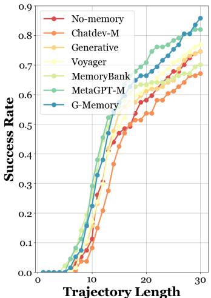  
(a) The performance trajectory of AutoGen on ALFWorld.

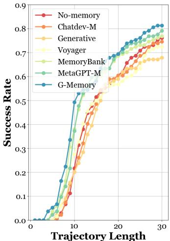  
(b) The performance trajectory of DyLAN on ALFWorld.

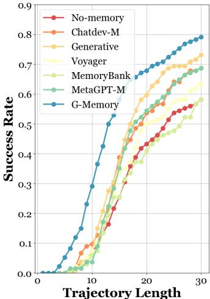  
(c) The performance trajectory of MacNet on ALFWorld.

# B.2 RQ2 Results

Figure 7 provides additional comparisons of token cost across various benchmarks and MAS frameworks when combined with different memory architectures. Overall, G-Memory incurs only a marginal or no increase in token cost compared to classical baselines such as Generative and MetaGPT-M, while consistently delivering the most significant performance improvements.

# B.3 Case Study

# B.3.1 Case Study on Insight Graphs

Figure 8 visualizes the high-level insights summarized by G-Memory on the ALFWorld benchmark across different MAS frameworks and LLM backbones. Given that ALFWorld naturally consists of diverse task categories, we further examine how insight nodes corresponding to different task types are interconnected. Overall, we observe dense intra-category connections among insights derived from similar tasks, while also noting the emergence of meaningful inter-category links, reflecting transferable patterns across task domains.

# B.3.2 Case Study on Query Graphs

Figures 9 to 11 visualize the query graphs constructed by G-Memory on the ALFWorld, PDDL, and SciWorld benchmarks. Recall that a directed edge between two query nodes indicates that the historical trajectory of one query offers useful guidance for the execution of another. We observe emergent clustering patterns, where groups of semantically similar queries form densely connected subgraphs, while sparser inter-cluster edges capture cross-task inspirations. These patterns demonstrate G-Memory’s ability to effectively organize and relate collaborative experiences through structured memory reasoning.

Table 2: Performance comparison with single/multi-agent memory architectures on five benchmarks. The underlying LLM backbone is $\mathtt { Q w e n - } 2 \cdot 5 \mathrm { - } 7 \mathrm { b }$ . We highlight the best and second best results.   

<table><tr><td rowspan=1 colspan=1>MAS</td><td rowspan=1 colspan=1>Memory</td><td rowspan=1 colspan=13>ALFWorld   SciWorld    PDDL    HotpotQA   FEVER      Avg.</td></tr><tr><td rowspan=4 colspan=1>VanillaLLM</td><td rowspan=4 colspan=1>No-memoryVoyagerMemoryBankGenerative</td><td rowspan=1 colspan=2>37.31↑0.00</td><td rowspan=1 colspan=5>23.49↑0.00   10.86↑0.00</td><td rowspan=1 colspan=1>20.260.00</td><td rowspan=1 colspan=5>48.17↑0.00  28.02↑0.00</td></tr><tr><td rowspan=1 colspan=2>38.19↑0.88</td><td rowspan=1 colspan=2>24.11↑0.62</td><td rowspan=1 colspan=2>12.14↑1.28</td><td rowspan=1 colspan=1></td><td rowspan=1 colspan=1>19.121.14</td><td rowspan=1 colspan=1></td><td rowspan=1 colspan=2>49.68↑1.51</td><td rowspan=1 colspan=1></td><td rowspan=1 colspan=1>28.65↑0.63</td></tr><tr><td rowspan=1 colspan=2>40.30↑2.99</td><td rowspan=1 colspan=2>21.64↓1.85</td><td rowspan=1 colspan=2>14.36↑3.50</td><td rowspan=1 colspan=1></td><td rowspan=1 colspan=1>18.7941.47</td><td rowspan=1 colspan=1></td><td rowspan=1 colspan=2>47.66↓0.51</td><td rowspan=1 colspan=1></td><td rowspan=1 colspan=1>28.55↑0.53</td></tr><tr><td rowspan=1 colspan=2>39.16↑1.85</td><td rowspan=1 colspan=2>26.10↑2.61</td><td rowspan=1 colspan=2>11.37↑0.51</td><td rowspan=1 colspan=1></td><td rowspan=1 colspan=1>23.48↑3.22</td><td rowspan=1 colspan=1></td><td rowspan=1 colspan=2>52.50↑4.33</td><td rowspan=1 colspan=1></td><td rowspan=1 colspan=1>30.52↑2.50</td></tr><tr><td rowspan=8 colspan=1>AutoGenCOLM 2024</td><td rowspan=8 colspan=1>No-memoryVoyagerMemoryBankGenerativeMetaGPT-MChatDev-MMacNet-MG-Memory (Ours)</td><td rowspan=1 colspan=2>52.99↑0.00</td><td rowspan=1 colspan=2>30.27↑0.00</td><td rowspan=1 colspan=2>16.17↑0.00</td><td rowspan=1 colspan=1></td><td rowspan=1 colspan=1>33.33↑0.00</td><td rowspan=1 colspan=1></td><td rowspan=1 colspan=2>58.74↑0.00</td><td rowspan=1 colspan=1></td><td rowspan=1 colspan=1>38.30↑0.00</td></tr><tr><td rowspan=1 colspan=1>55.22↑2.23</td><td rowspan=1 colspan=1></td><td rowspan=1 colspan=1>26.7013.57</td><td rowspan=1 colspan=1></td><td rowspan=1 colspan=2>12.004.17</td><td rowspan=1 colspan=1></td><td rowspan=1 colspan=1>34.29↑0.96</td><td rowspan=1 colspan=1></td><td rowspan=1 colspan=2>52.446.30</td><td rowspan=1 colspan=1></td><td rowspan=1 colspan=1>36.1312.17</td></tr><tr><td rowspan=1 colspan=1>53.37↑0.38</td><td rowspan=1 colspan=1></td><td rowspan=1 colspan=1>27.3312.94</td><td rowspan=1 colspan=1></td><td rowspan=1 colspan=2>14.8311.34</td><td rowspan=1 colspan=1></td><td rowspan=1 colspan=1>32.6710.66</td><td rowspan=1 colspan=1></td><td rowspan=1 colspan=2>59.45↑0.71</td><td rowspan=1 colspan=1></td><td rowspan=1 colspan=1>37.5310.77</td></tr><tr><td rowspan=1 colspan=1>62.69↑9.70</td><td rowspan=1 colspan=1></td><td rowspan=1 colspan=1>31.45↑1.18</td><td rowspan=1 colspan=1></td><td rowspan=1 colspan=2>17.88↑1.71</td><td rowspan=1 colspan=1></td><td rowspan=1 colspan=1>34.17↑0.84</td><td rowspan=1 colspan=1></td><td rowspan=1 colspan=2>61.25↑2.51</td><td rowspan=1 colspan=1></td><td rowspan=1 colspan=1>41.49↑3.19</td></tr><tr><td rowspan=1 colspan=1>55.52↑2.53</td><td rowspan=1 colspan=1></td><td rowspan=1 colspan=1>32.44↑2.17</td><td rowspan=1 colspan=1></td><td rowspan=1 colspan=2>17.04↑0.87</td><td rowspan=1 colspan=1></td><td rowspan=1 colspan=1>35.36↑2.03</td><td rowspan=1 colspan=1></td><td rowspan=1 colspan=2>63.33↑4.59</td><td rowspan=1 colspan=1></td><td rowspan=1 colspan=1>40.74↑2.44</td></tr><tr><td rowspan=1 colspan=1>46.27↓6.72</td><td rowspan=1 colspan=1></td><td rowspan=1 colspan=1>28.67↓1.60</td><td rowspan=1 colspan=1></td><td rowspan=1 colspan=2>13.4212.75</td><td rowspan=1 colspan=1></td><td rowspan=1 colspan=1>31.11↓2.22</td><td rowspan=1 colspan=1></td><td rowspan=1 colspan=2>61.32↑2.58</td><td rowspan=1 colspan=1></td><td rowspan=1 colspan=1>36.1612.14</td></tr><tr><td rowspan=1 colspan=1>53.18↑0.19</td><td rowspan=1 colspan=1></td><td rowspan=1 colspan=1>31.10↑0.83</td><td rowspan=1 colspan=1></td><td rowspan=1 colspan=2>16.89↑0.72</td><td rowspan=1 colspan=1></td><td rowspan=1 colspan=1>34.29↑0.96</td><td rowspan=1 colspan=1></td><td rowspan=1 colspan=2>58.43↓0.31</td><td rowspan=1 colspan=1></td><td rowspan=1 colspan=1>38.78↑0.48</td></tr><tr><td rowspan=1 colspan=1>67.91↑14.92</td><td rowspan=1 colspan=1></td><td rowspan=1 colspan=1>34.89↑4.62</td><td rowspan=1 colspan=1></td><td rowspan=1 colspan=2>21.01↑4.84</td><td rowspan=1 colspan=1></td><td rowspan=1 colspan=1>37.34↑4.01</td><td rowspan=1 colspan=1></td><td rowspan=1 colspan=2>64.34↑5.60</td><td rowspan=1 colspan=1></td><td rowspan=1 colspan=1>45.10↑6.80</td></tr><tr><td rowspan=8 colspan=1>DyLANCOLM 2024</td><td rowspan=2 colspan=1>No-memoryVoyager</td><td rowspan=1 colspan=2>41.340.00</td><td rowspan=1 colspan=2>29.84↑0.00</td><td rowspan=1 colspan=2>13.560.00</td><td rowspan=1 colspan=1></td><td rowspan=1 colspan=1>24.29↑0.00</td><td rowspan=1 colspan=1></td><td rowspan=1 colspan=2>56.23↑0.00</td><td rowspan=1 colspan=1></td><td rowspan=1 colspan=1>33.05↑0.00</td></tr><tr><td rowspan=1 colspan=1>51.49↑10.15</td><td rowspan=1 colspan=1></td><td rowspan=1 colspan=1>26.6613.18</td><td rowspan=1 colspan=1></td><td rowspan=1 colspan=2>10.6212.94</td><td rowspan=1 colspan=1></td><td rowspan=1 colspan=1>26.23↑1.94</td><td rowspan=1 colspan=1></td><td rowspan=1 colspan=2>55.3910.84</td><td rowspan=1 colspan=1></td><td rowspan=1 colspan=1>34.08↑1.03</td></tr><tr><td rowspan=2 colspan=1>MemoryBankGenerative</td><td rowspan=1 colspan=1>46.46↑5.12</td><td rowspan=1 colspan=1></td><td rowspan=1 colspan=1>26.9912.85</td><td rowspan=1 colspan=1></td><td rowspan=1 colspan=2>14.10↑0.54</td><td rowspan=1 colspan=1></td><td rowspan=1 colspan=1>22.44↓1.85</td><td rowspan=1 colspan=1></td><td rowspan=1 colspan=2>59.21↑2.98</td><td rowspan=1 colspan=1></td><td rowspan=1 colspan=1>33.84↑0.79</td></tr><tr><td rowspan=1 colspan=1>48.52↑7.18</td><td rowspan=1 colspan=1></td><td rowspan=1 colspan=1>31.55↑1.71</td><td rowspan=1 colspan=1></td><td rowspan=1 colspan=2>16.31↑2.75</td><td rowspan=1 colspan=1></td><td rowspan=1 colspan=1>26.54↑2.25</td><td rowspan=1 colspan=1></td><td rowspan=1 colspan=2>50.1916.04</td><td rowspan=1 colspan=1></td><td rowspan=1 colspan=1>34.62↑1.57</td></tr><tr><td rowspan=1 colspan=1>MetaGPT-M</td><td rowspan=1 colspan=1>42.54↑1.20</td><td rowspan=1 colspan=1></td><td rowspan=1 colspan=1>30.93↑1.09</td><td rowspan=1 colspan=1></td><td rowspan=1 colspan=2>14.47↑0.91</td><td rowspan=1 colspan=1></td><td rowspan=1 colspan=1>19.3314.96</td><td rowspan=1 colspan=1></td><td rowspan=1 colspan=2>57.22↑0.99</td><td rowspan=1 colspan=1></td><td rowspan=1 colspan=1>32.90±0.15</td></tr><tr><td rowspan=3 colspan=1>ChatDev-MMacNet-MG-Memory (Ours)</td><td rowspan=1 colspan=1>39.8511.49</td><td rowspan=1 colspan=1></td><td rowspan=1 colspan=1>28.2511.59</td><td rowspan=1 colspan=1></td><td rowspan=1 colspan=2>7.1416.42</td><td rowspan=1 colspan=1></td><td rowspan=1 colspan=1>17.3216.97</td><td rowspan=1 colspan=1></td><td rowspan=1 colspan=2>50.67↓5.56</td><td rowspan=1 colspan=1></td><td rowspan=1 colspan=1>28.6514.41</td></tr><tr><td rowspan=1 colspan=1>42.48↑1.14</td><td rowspan=1 colspan=1></td><td rowspan=1 colspan=1>28.22↓1.62</td><td rowspan=1 colspan=1></td><td rowspan=1 colspan=2>14.23↑0.67</td><td rowspan=1 colspan=1></td><td rowspan=1 colspan=1>25.12↑0.83</td><td rowspan=1 colspan=1></td><td rowspan=1 colspan=2>55.3410.89</td><td rowspan=1 colspan=1></td><td rowspan=1 colspan=1>33.08↑0.03</td></tr><tr><td rowspan=1 colspan=1>52.99↑11.65</td><td rowspan=1 colspan=1></td><td rowspan=1 colspan=2>33.813.97</td><td rowspan=1 colspan=2>20.71↑7.15</td><td rowspan=1 colspan=1></td><td rowspan=1 colspan=1>29.33↑5.04</td><td rowspan=1 colspan=1></td><td rowspan=1 colspan=2>63.67↑7.44</td><td rowspan=1 colspan=1></td><td rowspan=1 colspan=1>40.10↑7.05</td></tr><tr><td rowspan=8 colspan=1>MacNetICLR 2025</td><td rowspan=2 colspan=1>No-memoryVoyager</td><td rowspan=1 colspan=2>44.03↑0.00</td><td rowspan=1 colspan=2>28.76↑0.00</td><td rowspan=1 colspan=2>13.36↑0.00</td><td rowspan=1 colspan=1>−</td><td rowspan=1 colspan=1>22.240.00</td><td rowspan=1 colspan=1>−</td><td rowspan=1 colspan=2>55.12↑0.00</td><td rowspan=1 colspan=1>−</td><td rowspan=1 colspan=1>32.70↑0.00</td></tr><tr><td rowspan=1 colspan=1>47.01↑2.98</td><td rowspan=1 colspan=1></td><td rowspan=1 colspan=1>28.88↑0.12</td><td rowspan=1 colspan=1></td><td rowspan=1 colspan=2>11.3612.00</td><td rowspan=1 colspan=1></td><td rowspan=1 colspan=1>25.67↑3.43</td><td rowspan=1 colspan=1></td><td rowspan=1 colspan=1>58.78</td><td rowspan=1 colspan=1></td><td rowspan=1 colspan=1></td><td rowspan=1 colspan=1>34.34↑1.64</td></tr><tr><td rowspan=3 colspan=1>MemoryBankGenerativeMetaGPT-M</td><td rowspan=1 colspan=1>52.24↑8.21</td><td rowspan=1 colspan=1></td><td rowspan=1 colspan=1>27.8610.90</td><td rowspan=1 colspan=1></td><td rowspan=1 colspan=2>13.33±0.03</td><td rowspan=1 colspan=1></td><td rowspan=1 colspan=1>23.97↑1.73</td><td rowspan=1 colspan=1></td><td rowspan=1 colspan=1>54.18</td><td rowspan=1 colspan=2></td><td rowspan=1 colspan=1>34.32↑1.61</td></tr><tr><td rowspan=1 colspan=2>48.51↑4.48</td><td rowspan=1 colspan=2>31.05↑2.29</td><td rowspan=1 colspan=2>14.04↑0.68</td><td rowspan=1 colspan=1></td><td rowspan=1 colspan=1>24.49↑2.25</td><td rowspan=1 colspan=1></td><td rowspan=1 colspan=1>56.08</td><td rowspan=1 colspan=2></td><td rowspan=1 colspan=1>34.83↑2.13</td></tr><tr><td rowspan=1 colspan=1>52.99+8.96</td><td rowspan=1 colspan=1></td><td rowspan=1 colspan=2>29.87↑1.11</td><td rowspan=1 colspan=2>16.58+3.22</td><td rowspan=1 colspan=1></td><td rowspan=1 colspan=1>25.51↑3.27</td><td rowspan=1 colspan=1></td><td rowspan=1 colspan=1>53.88</td><td rowspan=1 colspan=2></td><td rowspan=1 colspan=1>35.773.06</td></tr><tr><td rowspan=2 colspan=1>ChatDev-MMacNet-M</td><td rowspan=1 colspan=1>44.78↑0.75</td><td rowspan=1 colspan=1></td><td rowspan=1 colspan=2>26.4412.32</td><td rowspan=1 colspan=2>10.1913.17</td><td rowspan=1 colspan=1></td><td rowspan=1 colspan=1>16.3215.92</td><td rowspan=1 colspan=1></td><td rowspan=1 colspan=1>56.02</td><td rowspan=1 colspan=2></td><td rowspan=1 colspan=1>30.7511.95</td></tr><tr><td rowspan=1 colspan=1>43.5510.48</td><td rowspan=1 colspan=1></td><td rowspan=1 colspan=1>30.11↑1.35</td><td rowspan=1 colspan=1></td><td rowspan=1 colspan=2>12.9110.45</td><td rowspan=1 colspan=1></td><td rowspan=1 colspan=1>21.7710.47</td><td rowspan=1 colspan=1></td><td rowspan=1 colspan=1>50.71</td><td rowspan=1 colspan=2></td><td rowspan=1 colspan=1>31.8110.89</td></tr><tr><td rowspan=1 colspan=1>G-Memory (Ours)</td><td rowspan=1 colspan=1>54.4810.45</td><td rowspan=1 colspan=1></td><td rowspan=1 colspan=1>32.233.47</td><td rowspan=1 colspan=1></td><td rowspan=1 colspan=1>17.48</td><td rowspan=1 colspan=1></td><td rowspan=1 colspan=1></td><td rowspan=1 colspan=1>27.53↑5.29</td><td rowspan=1 colspan=1></td><td rowspan=1 colspan=1>59.14</td><td rowspan=1 colspan=1></td><td rowspan=1 colspan=1></td><td rowspan=1 colspan=1>38.17↑5.47</td></tr></table>

# C Prompt Set

# Query Relevance Filtration

task_relevency_system_prompt $=$ """ You are an agent designed to score the relevance between two pieces of text ."""

ask_relevency_user_prompt $=$ """ You will be given a successful case where you successfully complete the task . Then you will be given an ongoing task . Do not summarize these two cases , but rather evaluate how relevant and helpful the successful case is for the ongoing task , on a scale of 1 -10.

Success Case : { trajectory } Ongoing task : { query_scenario } Score : "I I"

# Graph Sparsifier

extract_true_traj_system_prompt $=$ """ You are an agent skilled at extracting key points .

Given a task and a successful execution trajectory , your job is to identify the critical steps needed to complete the task while filtering out less important steps ."""

extract_true_traj_user_prompt $=$ " " " Note :

- Strictly follow the original trajectory ; absolutely no steps that are not in the trajectory should be added .

Table 3: Performance comparison with single/multi-agent memory architectures on five benchmarks. The underlying LLM backbone is $\mathtt { Q w e n } { - } 2 . 5 { - } 1 4 \mathrm { b }$ . We highlight the best and second best results.   

<table><tr><td rowspan=1 colspan=1>MAS</td><td rowspan=1 colspan=1>Memory</td><td rowspan=1 colspan=14>ALFWorld   SciWorld     PDDL    HotpotQA   FEVER      Avg.</td></tr><tr><td rowspan=8 colspan=1>AutoGenCOLM 2024</td><td rowspan=8 colspan=1>No-memoryVoyagerMemoryBankGenerativeMetaGPT-MChatDev-MMacNet-MG-Memory (Ours)</td><td rowspan=1 colspan=14>74.63↑0.00   46.84↑0.00   44.92↑0.00   24.49↑0.00   63.277↑0.00   50.83↑0.00</td></tr><tr><td rowspan=1 colspan=2>76.87↑2.24</td><td rowspan=1 colspan=1>59.00↑12.16</td><td rowspan=1 colspan=8>50.21↑5.29   31.33↑6.84   61.2212.05</td><td rowspan=1 colspan=3>55.73↑4.90</td></tr><tr><td rowspan=1 colspan=2>70.1514.48</td><td rowspan=1 colspan=1>54.18↑7.34</td><td rowspan=1 colspan=8>39.545.38   32.65↑8.16   64.29↑1.02</td><td rowspan=1 colspan=3>52.16↑1.33</td></tr><tr><td rowspan=1 colspan=2>74.63↑0.00</td><td rowspan=1 colspan=1>57.37↑10.53</td><td rowspan=1 colspan=3>54.46↑9.54</td><td rowspan=1 colspan=5>33.21↑8.72   63.27↑0.00</td><td rowspan=1 colspan=3>56.59↑5.76</td></tr><tr><td rowspan=1 colspan=1>82.09↑7.46</td><td rowspan=1 colspan=1></td><td rowspan=1 colspan=1>58.86↑12.02</td><td rowspan=1 colspan=3>48.99↑4.07</td><td rowspan=1 colspan=5>31.63↑7.14   62.271.00</td><td rowspan=1 colspan=3>56.77↑5.94</td></tr><tr><td rowspan=1 colspan=1>67.1617.47</td><td rowspan=1 colspan=1></td><td rowspan=1 colspan=1>40.6916.15</td><td rowspan=1 colspan=3>43.11↓1.81</td><td rowspan=1 colspan=2>31.77↑7.28</td><td rowspan=1 colspan=1></td><td rowspan=1 colspan=2>61.281.99</td><td rowspan=1 colspan=3>48.8012.03</td></tr><tr><td rowspan=1 colspan=2>73.65↓0.98</td><td rowspan=1 colspan=1>42.141.4.70</td><td rowspan=1 colspan=3>45.94↑1.02</td><td rowspan=1 colspan=2>26.72↑2.23</td><td rowspan=1 colspan=1></td><td rowspan=1 colspan=2>64.69↑1.42</td><td rowspan=1 colspan=3>50.6310.20</td></tr><tr><td rowspan=1 colspan=2>85.82↑11.19</td><td rowspan=1 colspan=1>60.62↑13.78</td><td rowspan=1 colspan=3>55.2410.32</td><td rowspan=1 colspan=2>34.61↑10.12</td><td rowspan=1 colspan=1></td><td rowspan=1 colspan=2>71.43↑8.16</td><td rowspan=1 colspan=3>61.54↑10.71</td></tr><tr><td rowspan=8 colspan=1>DyLANCOLM 2024</td><td rowspan=8 colspan=1>No-memoryVoyagerMemoryBankGenerativeMetaGPT-MChatDev-MMacNet-MG-Memory (Ours)</td><td rowspan=1 colspan=2>76.12↑0.00</td><td rowspan=1 colspan=1>53.24↑0.00</td><td rowspan=1 colspan=3>41.83↑0.00</td><td rowspan=1 colspan=2>30.61↑0.00</td><td rowspan=1 colspan=1></td><td rowspan=1 colspan=2>63.34↑0.00</td><td rowspan=1 colspan=3>53.03↑0.00</td></tr><tr><td rowspan=1 colspan=1>72.3913.73</td><td rowspan=1 colspan=1></td><td rowspan=1 colspan=1>58.93↑5.69</td><td rowspan=1 colspan=3>48.54↑6.71</td><td rowspan=1 colspan=2>30.71↑0.10</td><td rowspan=1 colspan=1></td><td rowspan=1 colspan=2>65.31↑1.97</td><td rowspan=1 colspan=3>55.18↑2.15</td></tr><tr><td rowspan=1 colspan=1>76.87↑0.75</td><td rowspan=1 colspan=1></td><td rowspan=1 colspan=1>57.92↑4.68</td><td rowspan=1 colspan=3>39.6512.18</td><td rowspan=1 colspan=2>29.5911.02</td><td rowspan=1 colspan=1></td><td rowspan=1 colspan=2>63.2510.09</td><td rowspan=1 colspan=3>53.46↑0.43</td></tr><tr><td rowspan=1 colspan=1>77.91↑1.79</td><td rowspan=1 colspan=1></td><td rowspan=1 colspan=1>61.52↑8.28</td><td rowspan=1 colspan=3>46.69↑4.86</td><td rowspan=1 colspan=2>31.33↑0.72</td><td rowspan=1 colspan=1></td><td rowspan=1 colspan=2>61.3911.95</td><td rowspan=1 colspan=3>55.77↑2.74</td></tr><tr><td rowspan=1 colspan=1>79.10↑2.98</td><td rowspan=1 colspan=1></td><td rowspan=1 colspan=1>61.29↑8.05</td><td rowspan=1 colspan=1></td><td rowspan=1 colspan=1>49.75↑7.92</td><td rowspan=1 colspan=1></td><td rowspan=1 colspan=2>28.6112.00</td><td rowspan=1 colspan=1></td><td rowspan=1 colspan=2>64.11↑0.77</td><td rowspan=1 colspan=2>56.57↑3.54</td><td rowspan=1 colspan=1></td></tr><tr><td rowspan=1 colspan=1>74.6311.49</td><td rowspan=1 colspan=1></td><td rowspan=1 colspan=1>54.03↑0.79</td><td rowspan=1 colspan=1></td><td rowspan=1 colspan=1>44.44↑2.61</td><td rowspan=1 colspan=1></td><td rowspan=1 colspan=2>30.67↑0.06</td><td rowspan=1 colspan=1></td><td rowspan=1 colspan=2>62.2511.09</td><td rowspan=1 colspan=2>53.20↑0.18</td><td rowspan=1 colspan=1></td></tr><tr><td rowspan=1 colspan=1>72.773.35</td><td rowspan=1 colspan=1></td><td rowspan=1 colspan=1>52.221.02</td><td rowspan=1 colspan=1></td><td rowspan=1 colspan=1>42.98↑1.15</td><td rowspan=1 colspan=1></td><td rowspan=1 colspan=2>29.221.39</td><td rowspan=1 colspan=1></td><td rowspan=1 colspan=2>62.6910.65</td><td rowspan=1 colspan=2>51.9811.05</td><td rowspan=1 colspan=1></td></tr><tr><td rowspan=1 colspan=1>81.34↑5.22</td><td rowspan=1 colspan=1></td><td rowspan=1 colspan=1>64.68↑11.44</td><td rowspan=1 colspan=1></td><td rowspan=1 colspan=1>51.12↑9.29</td><td rowspan=1 colspan=1></td><td rowspan=1 colspan=2>34.63↑4.02</td><td rowspan=1 colspan=1></td><td rowspan=1 colspan=2>66.66+3.32</td><td rowspan=1 colspan=2>59.69†6.66</td><td rowspan=1 colspan=1></td></tr><tr><td rowspan=8 colspan=1>MacNetICLR 2025</td><td rowspan=3 colspan=1>No-memoryVoyagerMemoryBank</td><td rowspan=1 colspan=1>58.21↑0.00</td><td rowspan=1 colspan=1></td><td rowspan=1 colspan=1>52.21↑0.00</td><td rowspan=1 colspan=1></td><td rowspan=1 colspan=1>41.74↑0.00</td><td rowspan=1 colspan=1></td><td rowspan=1 colspan=2>28.60↑0.00</td><td rowspan=1 colspan=1></td><td rowspan=1 colspan=2>64.65↑0.00</td><td rowspan=1 colspan=2>49.08↑0.00</td><td rowspan=1 colspan=1></td></tr><tr><td rowspan=1 colspan=1>63.43↑5.22</td><td rowspan=1 colspan=1></td><td rowspan=1 colspan=1>60.24↑8.03</td><td rowspan=1 colspan=1></td><td rowspan=1 colspan=1>43.95↑2.21</td><td rowspan=1 colspan=1></td><td rowspan=1 colspan=2>29.67↑1.07</td><td rowspan=1 colspan=1></td><td rowspan=1 colspan=2>62.24↓2.41</td><td rowspan=1 colspan=1>51.91</td><td rowspan=1 colspan=1></td><td rowspan=1 colspan=1></td></tr><tr><td rowspan=1 colspan=1>62.21↑4.00</td><td rowspan=1 colspan=1></td><td rowspan=1 colspan=1>55.52↑3.31</td><td rowspan=1 colspan=1></td><td rowspan=1 colspan=1>38.263.48</td><td rowspan=1 colspan=1></td><td rowspan=1 colspan=2>26.532.07</td><td rowspan=1 colspan=1></td><td rowspan=1 colspan=2>65.22↑0.57</td><td rowspan=1 colspan=1>49.55</td><td rowspan=1 colspan=1></td><td rowspan=1 colspan=1></td></tr><tr><td rowspan=2 colspan=1>GenerativeMetaGPT-M</td><td rowspan=1 colspan=1>73.13↑14.92</td><td rowspan=1 colspan=1></td><td rowspan=1 colspan=1>60.83↑8.62</td><td rowspan=1 colspan=1></td><td rowspan=1 colspan=1>44.00↑2.26</td><td rowspan=1 colspan=1></td><td rowspan=1 colspan=1>30.53</td><td rowspan=1 colspan=1></td><td rowspan=1 colspan=1></td><td rowspan=1 colspan=2>65.31↑0.66</td><td rowspan=1 colspan=2>54.76↑5.68</td><td rowspan=1 colspan=1></td></tr><tr><td rowspan=1 colspan=1>70.43↑12.22</td><td rowspan=1 colspan=1></td><td rowspan=1 colspan=1>59.70↑7.49</td><td rowspan=1 colspan=2>42.34↑0.60</td><td rowspan=1 colspan=1></td><td rowspan=1 colspan=2>26.2612.34</td><td rowspan=1 colspan=1></td><td rowspan=1 colspan=2>66.33↑1.68</td><td rowspan=1 colspan=1>53.01</td><td rowspan=1 colspan=1></td><td rowspan=1 colspan=1></td></tr><tr><td rowspan=3 colspan=1>ChatDev-MMacNet-MG-Memory (Ours)</td><td rowspan=1 colspan=1>68.66↑10.45</td><td rowspan=1 colspan=1></td><td rowspan=1 colspan=1>45.9816.23</td><td rowspan=1 colspan=2>42.19↑0.45</td><td rowspan=1 colspan=1></td><td rowspan=1 colspan=2>29.49↑0.89</td><td rowspan=1 colspan=1></td><td rowspan=1 colspan=2>59.1815.47</td><td rowspan=1 colspan=1>49.10</td><td rowspan=1 colspan=1></td><td rowspan=1 colspan=1></td></tr><tr><td rowspan=1 colspan=1>60.45↑2.24</td><td rowspan=1 colspan=1></td><td rowspan=1 colspan=1>51.1411.07</td><td rowspan=1 colspan=1></td><td rowspan=1 colspan=1>39.2212.52</td><td rowspan=1 colspan=1></td><td rowspan=1 colspan=2>28.77↑0.17</td><td rowspan=1 colspan=1></td><td rowspan=1 colspan=1>62.4212.23</td><td rowspan=1 colspan=1></td><td rowspan=1 colspan=1>48.40</td><td rowspan=1 colspan=1></td><td rowspan=1 colspan=1></td></tr><tr><td rowspan=1 colspan=1>79.10↑20.89</td><td rowspan=1 colspan=1></td><td rowspan=1 colspan=1>61.74†9.53</td><td rowspan=1 colspan=1></td><td rowspan=1 colspan=1>45.76↑4.02</td><td rowspan=1 colspan=1></td><td rowspan=1 colspan=2>32.33↑3.73</td><td rowspan=1 colspan=1></td><td rowspan=1 colspan=1>70.33↑5.68</td><td rowspan=1 colspan=1></td><td rowspan=1 colspan=1>57.85</td><td rowspan=1 colspan=1></td><td rowspan=1 colspan=1></td></tr></table>

Even in a successful trajectory , there may be some incorrect steps . Pay attention to actions that correspond to " Nothing happens " observations , as these actions are likely incorrect . Filter out these actions for me .   
You need to ensure that each step is at the finest granularity .   
- You should strictly follow the output format in the example .   
## Here is the task :   
### Task   
{ task }

### Trajectory { trajectory } ### Output """

The prompt below is partially adapted from [43]. We would like to express our sincere gratitude for their valuable implementation.

# Inisght Summarization Function

learn_lessons_system_prompt_compare $=$ " " "   
You are an analysis - driven agent focused on learning from experience . You will be provided with :   
- A failed trajectory and its outcome ,   
- A successful trajectory completing a similar task .

Your task is to analyze both trajectories and generate clear , actionable insights . Your insights should highlight what the failed trajectory missed and how the successful one addressed or avoided these pitfalls .

## Requirements :

- All insights must be derived directly from contrasting the two trajectories . - Do not speculate or introduce steps not supported by the successful example . - Focus on \*\* concrete behavioral or strategic differences \*\* between the two cases (a) Insight graph on gpt-4o-mini +MacNet+ALFWorld.

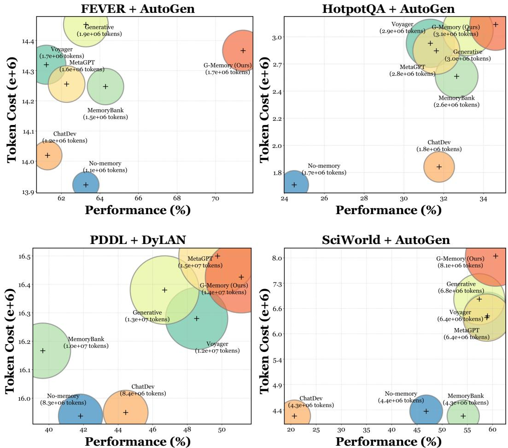  
Figure 7: Cost analysis of G-Memory. We showcase the performance versus the overall system token cost when combined with different memory architectures.

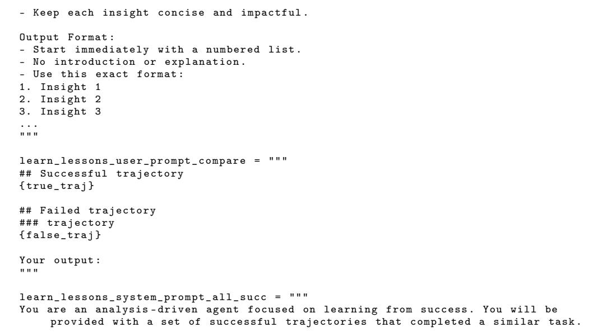

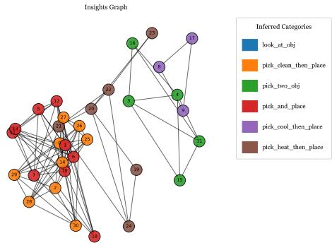

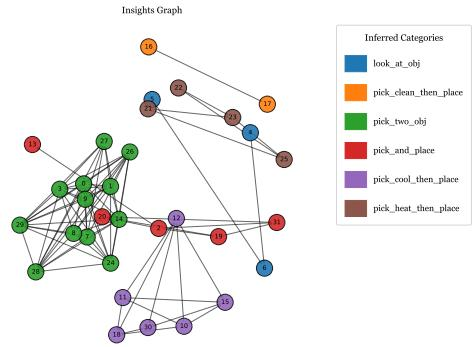

(b) Insight graph on gpt-4o-mini +DyLAN $^ +$ ALFWorld.

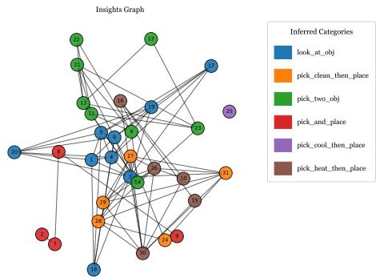

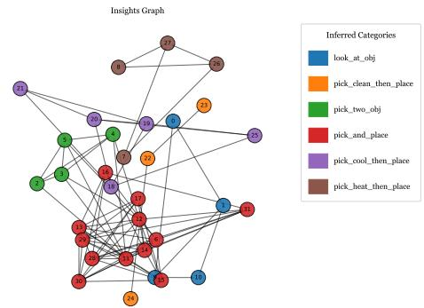

(c) Insight graph on Qwen-7b +MacNet+ALFWorld.

(d) Insight graph on Qwen-7b +DyLAN $^ +$ ALFWorld.

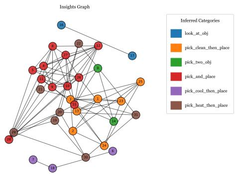  
Figure 8: Visualizations of insight graphs across different LLM backbones, MAS, and benchmarks.

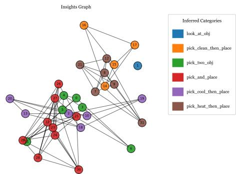  
(f) Insight graph on Qwen-14b +DyLAN $^ +$ ALFWorld.

(e) Insight graph on Qwen-14b +AutoGen $^ +$ ALFWorld.

Your goal is to analyze these successful examples and extract clear , actionable insights that capture what contributed to their success . These insights will serve as guidance for future agents working on similar tasks .

## Requirements :

All insights must be grounded in patterns or strategies observed across the successful trajectories . - Do not speculate or introduce steps not reflected in the provided examples . - Focus on common behaviors , strategies , or decisions that consistently led to positive outcomes . - Keep each insight concise , specific , and impactful .

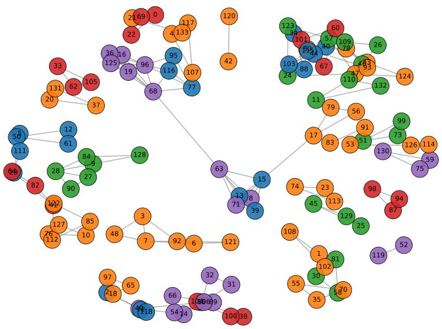  
Figure 9: Query graph optimized from ALFWorld dataset. Tasks Graph

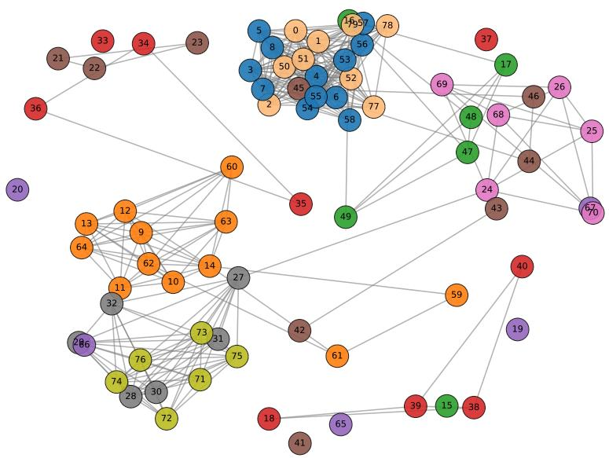  
Figure 10: Query graph optimized from SciWorld dataset.

# Output Format :

- Start immediately with a numbered list . - No introduction or explanation .   
- Use this exact format :   
1. Insight 1   
2. Insight 2   
3. Insight 3

II I "

learn_lessons_user_prompt_all_succ $=$ " " "   
## Successful trajectorys   
{ true_trajs }

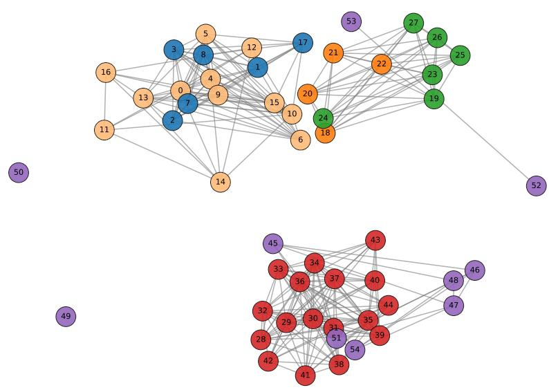  
Tasks Graph   
Figure 11: Query graph optimized from PDDL dataset.

"""

# merge rules prompt

merge_rules_system_prompt $=$ """ You are an agent skilled at summarizing and distilling insights . You are given a list of insights that were previously extracted from similar tasks . These insights may contain redundancy or overlap .

Your job is to \*\* merge and consolidate similar insights \*\* , and output a refined version that is \*\* clear , actionable , and concise \*\*.

NOTE :

- All merged insights \*\* must be based strictly on the given inputs $^ { * * }$ . You are \*\* not allowed to make up \*\* or infer any new information .   
- The output should be easy to read and follow .

Output Format :

- Start your response directly with the numbered list , no preamble or explanations - Each insight should be a short sentence .   
Use the following format exactly :

1. Insight 1   
2. Insight 2   
3. Insight 3

II I "

merge_rules_user_prompt $=$ " " "   
## Here are the current insights that need to be merged :   
{ current_rules }

## Please consolidate and rewrite them into \*\* no more than { limited_number } refined insights \*\*.

As the summarizing agent , remove redundancies , combine similar ideas , and ensure clarity .

Your output : """

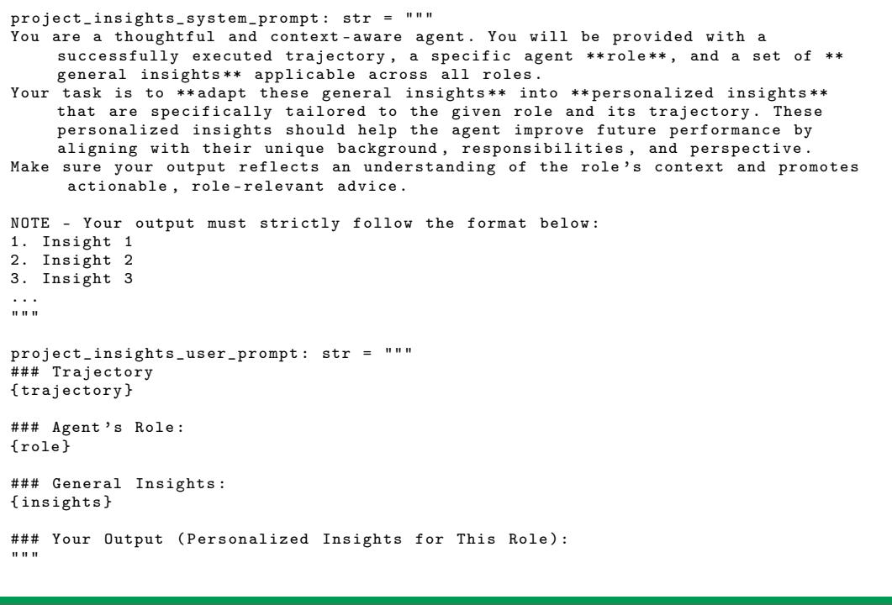

# D Discussion with Related Works

In this section, we further discuss the relationship between G-Memory and several recent agent memory frameworks. For A-Mem [61], while both A-Mem and G-Memory aim to enhance the memory capabilities of LLM agents, they differ in two key aspects. First, A-Mem is tailored for single-agent scenarios, whereas G-Memory is designed for processing MAS’s lengthy and nuanced interaction trajectory. Second, A-Mem emphasizes atomic memory construction for chatbot-style interactions, while ${ \sf G }$ -Memory focuses on distilling reusable strategies from collaborative task execution, where fine-grained atomicity is neither required nor beneficial. For Mem0 [62], although it also employs a graph-based structure, it remains within the chatbot paradigm. Its graph is closer to a knowledge graph, where nodes represent factual entities and edges represent relations, fundamentally differing from $\mathfrak { G }$ -Memory’s agent-centric memory graphs that encode trajectories, decisions, and coordination patterns across agents.