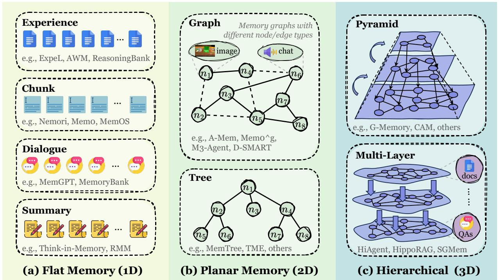
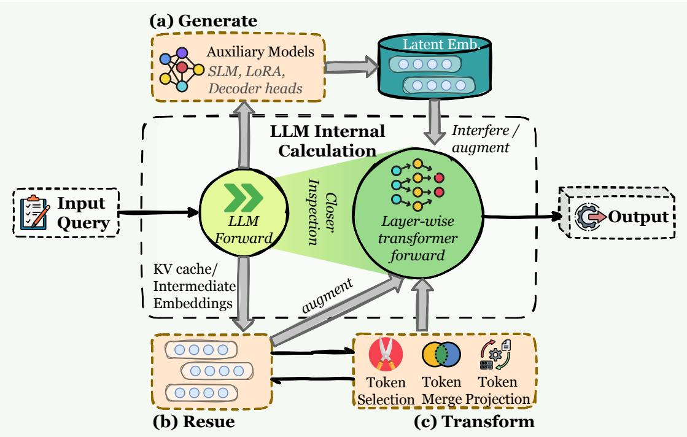
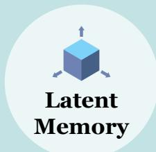

[← 返回 README](../README.md)

# 3. Form: What Carries Memory?

## 📌 预览
记忆的三种载体形式及其 trade-off：Token-level（透明可编辑，按拓扑分 1D/2D/3D）、Parametric（零延迟但难更新，分 Internal/External）、Latent（高密度但不可解释，分 Generate/Reuse/Transform）。

---

Based on where memory resides and in what form it is represented, we organize these memories into three categories:

1. **Token-level Memory** (§3.1): Memory organized as explicit and discrete units that can be individually accessed, modified, and reconstructed.
2. **Parametric Memory** (§3.2): Memory stored within the model parameters, encoded through statistical patterns and accessed implicitly during forward computation.
3. **Latent Memory** (§3.3): Memory represented in the model's internal hidden states, continuous representations, or evolving latent structures.

> 💡 **三种形式的核心 trade-off**:
> | 形式 | 优势 | 劣势 | 适合场景 |
> |------|------|------|---------|
> | Token-level | 透明、可编辑、即插即用 | 检索效率随规模下降 | 对话、个性化、推荐 |
> | Parametric | 零延迟推理、强泛化 | 更新需重训练、灾难性遗忘 | 角色扮演、数学推理 |
> | Latent | 高信息密度、多模态融合 | 不可解释、不可审计 | 多模态、边缘部署、隐私 |

---

## 3.1 Token-level Memory

Token-level memory 是目前**工作量最大**的形式，按拓扑复杂度分三类：

*Figure 3: Taxonomy of token-level memory: (a) Flat 1D, (b) Planar 2D, (c) Hierarchical 3D.*

> 💡 **Figure 3 批读**:
> - **(a) Flat 1D**: 线性序列或独立集合，无显式拓扑。最简单，检索靠向量相似度。代表：chunk sets, dialogue logs, experience pools。
> - **(b) Planar 2D**: 单层图/树结构，节点间有显式关联。从"存储"到"组织"的跃迁。代表：knowledge graph, conversation tree。
> - **(c) Hierarchical 3D**: 多层结构+跨层链接，支持不同抽象度。最强大但构建成本最高。代表：multi-level community graph, pyramid index。

### 3.1.1 Flat Memory (1D)

按功能场景分类的代表方法（Table 1 精选）：

| 场景 | 代表方法 | 记忆内容 |
|------|---------|---------|
| **Dialogue** | MemGPT (OS 式分层管理), Mem0 (标准化 CRUD), COMEDY (单模型压缩) | 对话历史/摘要/画像 |
| **Preference** | RecMind, InteRecAgent, Memocrs | 用户偏好/物品元数据 |
| **Profile** | MemoryBank (时间戳组织), ChatHaruhi (小说对话库), RoleLLM (角色 QA 对) | 身份/性格/长期属性 |
| **Experience** | Reflexion (短期=轨迹, 长期=反思), Voyager (代码技能库), ExpeL (成功轨迹+洞察) | 轨迹/策略/代码 |
| **Multimodal** | MovieChat (帧特征), KARMA (3D 场景图), Mem2Ego (地图+地标+访问历史) | 视觉/空间/传感器 |

> 💡 **Flat Memory 局限**: 简单可扩展，但缺乏关系组织。记忆增长后冗余和噪声积累，检索到的记忆单元之间缺乏关联理解，限制组合推理和长程规划。

### 3.1.2 Planar Memory (2D)

- **Tree**: HAT (分层聚合树), MemTree (动态对话树，从孤立日志推断层次 schema)
- **Graph**: A-MEM (卡片式知识网络), KGT (实时用户偏好图), PREMem (跨会话推理模式聚类)
- **Hybrid**: Optimus-1 (知识图 + 经验池分离), D-SMART (事实图 + 推理树)

> 💡 **2D 突破**: 从 "存储" 到 "组织" 的跃迁，支持结构化 key-value 查找和关系遍历。但所有记忆挤在单层平面中，复杂场景下冗余且扩展性差。

### 3.1.3 Hierarchical Memory (3D)

- **Pyramid**: GraphRAG (社区检测 → 递归聚合), HiAgent (子目标层次化工作记忆), Zep (时间 KG + 社区分区)
- **Multi-Layer**: HippoRAG (关联索引层 + 文档存储层), AriGraph (语义图 + 事件图), SGMem (句子图 + 对话块)

> 💡 **3D 挑战**: 最强大的检索能力（跨层+跨关系），但 (1) 如何保证所有记忆节点语义有意义, (2) 如何设计最优三维布局 仍是开放问题。

---

## 3.2 Parametric Memory

### 3.2.1 Internal Parametric Memory

| 阶段 | 代表方法 | 策略 |
|------|---------|------|
| Pre-Train | LMLM, HierMemLM | 知识检索能力植入预训练 |
| Mid-Train | Agent-Founder, Early Experience | Agent 经验融入继续预训练 |
| Post-Train | Character-LM (角色 SFT), ROME/MEND (模型编辑), SELF-PARAM (KL 蒸馏) | 下游任务适配 |

> 💡 **优劣**: 不增加推理开销，但更新需重训练。适合大规模领域知识/任务先验，不适合频繁变化的个性化记忆。

### 3.2.2 External Parametric Memory

- **Adapter**: K-Adapter (任务特定适配器), WISE (双参数记忆 + 路由), ELDER (多 LoRA + 学习路由)
- **Auxiliary LM**: MAC (文档压缩为调制信号), Retroformer (RL 学习经验记忆)

> 💡 **折中方案**: 不修改原始参数，但通过外部模块注入记忆。支持模块化更新和可控回滚。

---

## 3.3 Latent Memory

*Figure 4: Overview of Latent Memory: (a) Generate, (b) Reuse, (c) Transform.*

> 💡 **Figure 4 批读**: 三种 latent memory 来源：
> - **Generate**: 辅助模型生成新的 latent 表征（Gist tokens, Titans 的 online-updated MLP, MemGen 的 LoRA fragments）
> - **Reuse**: 直接重用先前 KV cache（Memorizing Transformers 的 KNN 检索, LONGMEM 的 SideNet）
> - **Transform**: 压缩/修剪现有状态（Scissorhands 注意力剪枝, SnapKV 头投票聚合, H2O 驱逐策略）

---

## 3.4 Adaptation（形式选择指南）

*Figure 5: Overview of three complementary memory paradigms and their suitable applications.*

> 💡 **Figure 5 批读 — 实用选择指南**:
> - **Token-level**: 聊天机器人、长期 agent、个性化画像、推荐系统、法律合规（需要可验证来源）
> - **Parametric**: 角色扮演、数学推理、代码生成、人类对齐、领域专家回答
> - **Latent**: 多模态 agent、边缘部署、隐私敏感场景（天然不可读 = 天然隐私保护）

---

## 🔖 Section 总结

### 核心洞察
1. Token-level 是目前最主流的形式（文献量最大），因为透明、灵活、即插即用
2. 1D → 2D → 3D 的拓扑演进 = "存储" → "组织" → "认知" 的能力升级
3. 三种形式是互补的，理想系统应混合使用
4. Latent Memory 是最年轻但最有潜力的方向——天然支持多模态融合和隐私保护
5. 选择记忆形式 = 隐式表达对 agent 行为方式的期望
