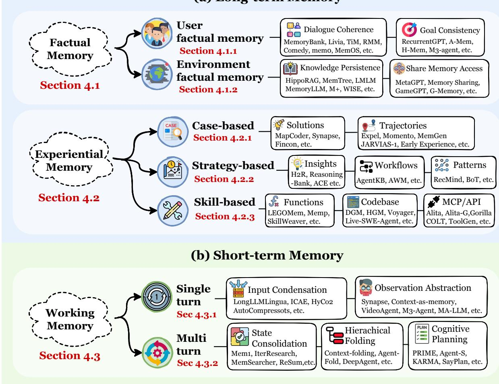
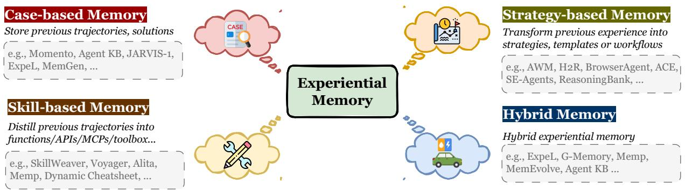

[← 返回 README](../README.md)

# 4. Functions: Why Agents Need Memory?

## 📌 预览
记忆的三大功能支柱：Factual Memory（"Agent 知道什么"→ 一致性/连贯性/适应性）、Experiential Memory（"Agent 如何进步"→ 从 case 到 strategy 到 skill 的抽象阶梯）、Working Memory（"Agent 当前在想什么"→ 被动缓冲变主动工作空间）。

---

*Figure 6: The functional taxonomy of agent memory: Factual + Experiential (long-term) + Working (short-term).*

> 💡 **Figure 6 批读**:
> - **Long-term**: Factual Memory（事实知识库，保证交互一致性）+ Experiential Memory（程序知识库，驱动持续进化）
> - **Short-term**: Working Memory（任务工作台，管理瞬态上下文）
> - 三者形成认知循环：Working Memory 做推理 → 结果编码到 Factual/Experiential → 下次推理时检索回 Working Memory

---

## 4.1 Factual Memory

**定义**: Agent 存储和检索关于过去事件、用户信息、环境状态的显式陈述性事实。

**认知科学基础**: Declarative memory = Episodic（情景：what/where/when）+ Semantic（语义：概念/事实）。在 agent 中这是一个连续体：原始交互日志 → 摘要/反思/实体提取 → 可复用事实库。

**三大功能属性**: 
- **Consistency**: 跨时间稳定行为，不自相矛盾
- **Coherence**: 回忆历史，保持话题连续
- **Adaptability**: 基于画像和反馈个性化行为

### 4.1.1 User Factual Memory

**Dialogue Coherence 策略**:
- 启发式选择：按 relevance/recency/importance 排序（Park et al. 2023, Xi & Wang 2025）
- 语义抽象：TiM（对话→思想表征）, RMM（对话→主题反思）, COMEDY（单模型压缩+画像更新）

**Goal Consistency**:
- RecurrentGPT, Memolet, MemGuide: 动态跟踪任务状态，分离已确认/未解决信息
- Embodied: M3-Agent, MEMENTO 持久化家庭成员/物体位置/日常习惯

### 4.1.2 Environment Factual Memory

**Knowledge Persistence**: HippoRAG（KG 促进证据传播）, LMLM（事实外部化到数据库）, WISE（双参数分离编辑知识）

**Shared Access（多智能体）**: MetaGPT（共享消息池）, Generative Agents/OASIS（全局环境作为共享记忆基质）, G-Memory（层次图协调）

> 💡 **Factual vs Experiential 核心区别**: Factual Memory 的导向是"正确性"（准确、一致、可追溯），Experiential Memory 的导向是"有用性"（提升任务表现）。

---

## 4.2 Experiential Memory

**定义**: Agent 将历史轨迹、蒸馏策略、交互结果编码为持久化表征，实现跨 episode 的知识迁移和**持续学习与自我进化**。

*Figure 7: Taxonomy of experiential memory by abstraction level: Case → Strategy → Skill → Hybrid.*

> 💡 **Figure 7 批读**: 经验记忆的抽象阶梯：
> 1. **Case-based**: 最低抽象——原始轨迹/解决方案的直接存储（ExpeL, Memento, JARVIS-1）
> 2. **Strategy-based**: 中间抽象——提炼出可迁移的洞察/工作流/思维模板（Reflexion, AWM, Buffer of Thoughts）
> 3. **Skill-based**: 最高抽象——编译为可执行代码/API/MCP（Voyager, Gorilla, Alita）
> 4. **Hybrid**: 混合多种层次（ChemAgent, LARP, G-Memory）

### 4.2.1 Case-based Memory
- **Trajectories**: Memento（Q-learning 选择高价值轨迹），JARVIS-1（Minecraft 生存经验）
- **Solutions**: ExpeL（试错→存储成功轨迹+文本洞察），MapCoder（代码示例作为 playbook）

### 4.2.2 Strategy-based Memory
- **Insights**: H²R（双层反思：规划级+执行级），R2D2（失败+成功→纠正洞察），BrowserAgent（关键结论作为显式记忆）
- **Workflows**: AWM（成功轨迹→可复用工作流），Agent KB（工作流作为可迁移程序知识）
- **Patterns**: Buffer of Thoughts（思维模板元缓冲），ReasoningBank（可复用推理单元）

> 💡 **Strategy vs Skill**: Strategy 是"认知脚手架"——约束搜索空间、引导规划，但不直接执行。Skill 是"执行基质"——可调用、可验证、可组合的可执行程序。两者互补：strategy 提供规划逻辑，skill 处理落地执行。

### 4.2.3 Skill-based Memory
- **Code Snippets**: Voyager（不断增长的技能库），Darwin Gödel Machine（自我重写代码）
- **Functions/Scripts**: CREATOR, SkillWeaver, Memp, LearnAct
- **APIs**: Gorilla, ToolLLM, ToolRerank, DRAFT
- **MCPs**: Alita, Alita-G（统一工具发现和使用的开放标准）

> 💡 **Skill Memory 独特价值**: 代码/API 调用的结果可以直接验证对错（可验证性），形成闭环学习。这是 case 和 strategy 做不到的。

---

## 4.3 Working Memory

**定义**: 容量受限、动态控制的机制，在单个任务/会话内选择、维持、转换任务相关信息。目标：将 LLM 上下文窗口从**被动只读缓冲**变为**可控、可更新、抗干扰的工作空间**。

### 4.3.1 Single-turn Working Memory
- **Input Condensation**: LLMLingua（perplexity 剪枝），Gist（压缩为 gist tokens），AutoCompressor（摘要向量）
- **Observation Abstraction**: Synapse（HTML DOM→状态摘要），VideoAgent（视频→事件描述），MA-LMM（视觉特征银行）

### 4.3.2 Multi-turn Working Memory
- **State Consolidation**: MemAgent/MemSearcher（循环更新固定预算记忆），Mem1（PPO 优化摘要），MemGen（注入 latent memory tokens）
- **Hierarchical Folding**: HiAgent（子目标记忆单元），Context-Folding（可学习折叠策略），DeepAgent（工具交互压缩）
- **Cognitive Planning**: SayPlan（3D 场景图 = 可查询环境记忆），KARMA（层次计划锚定推理），Agent-S（层次计划稳定长程表现）

> 💡 **Multi-turn Working Memory 的核心**: 将推理性能与交互长度解耦。通过 state consolidation + hierarchical folding + cognitive planning，agent 在无限时间范围内保持时间连贯性和目标一致性。**RL 正在成为主导训练方法**（Mem1/Context-Folding/MemSearcher/IterResearch 都用 RL）。

---

## 🔖 Section 总结

### 核心洞察
1. **Factual** = "知道什么"，导向正确性（一致/连贯/适应）
2. **Experiential** = "如何进步"，Case→Strategy→Skill 抽象阶梯驱动持续进化
3. **Working** = "在想什么"，被动缓冲→主动工作空间的范式转换
4. 三者构成认知循环：Working 做推理 → 编码到 Factual/Experiential → 检索回 Working
5. **RL 正在深度改变 Working Memory**——从启发式到学习型策略
