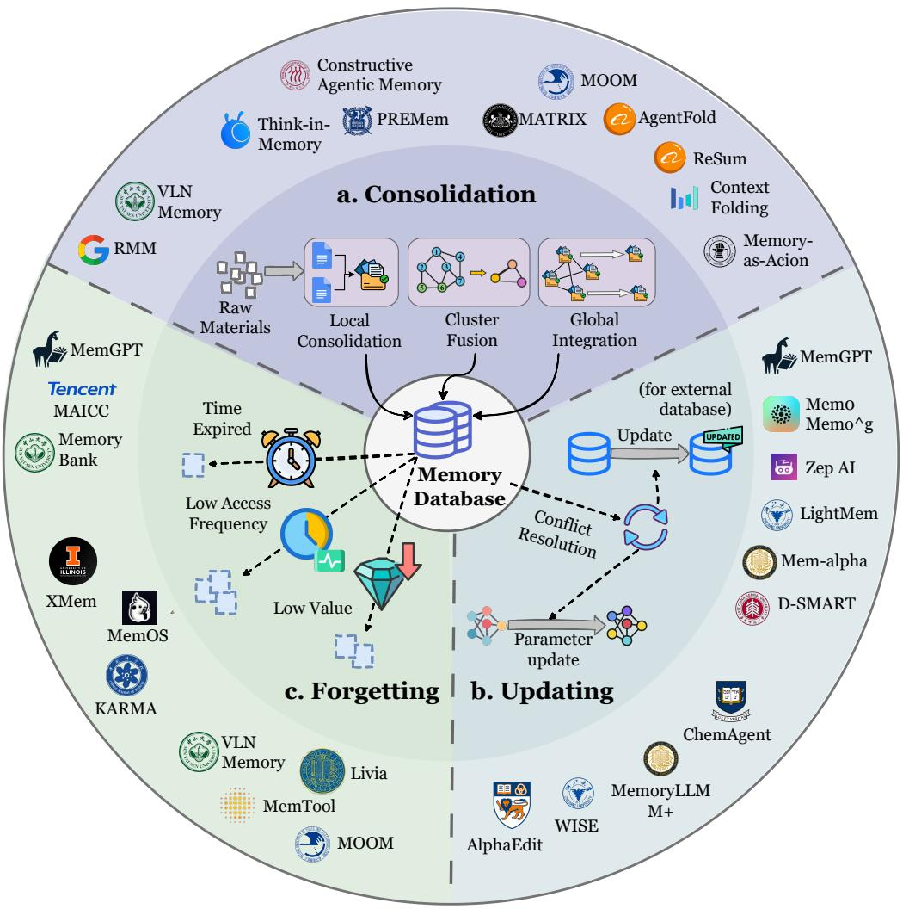

[← 返回 README](../README.md)

# 5. Dynamics: How Memory Operates and Evolves?

## 📌 预览
记忆的完整动态生命周期：Formation（5 种提取操作）→ Evolution（合并/更新/遗忘）→ Retrieval（时机/查询/策略/后处理），三者形成互联循环而非线性流水线。

---

*Figure 8: The operational dynamics of agent memory: Formation → Evolution → Retrieval, with feedback loops.*

> 💡 **Figure 8 批读**: 三阶段不是线性的——推理结果和环境反馈回流到 Formation（提取新洞察）和 Evolution（更新记忆库），形成闭环。字母标注表示操作顺序。

---

## 5.1 Memory Formation（"如何提取记忆？"）

**五种 Formation 操作**：

| 类型 | 输出形态 | 粒度 | 代表方法 |
|------|---------|------|---------|
| **Semantic Summarization** | 文本摘要 | 宏观全局 | MemGPT, Mem0, MemAgent |
| **Knowledge Distillation** | 事实/策略洞察 | 中观知识 | ExpeL, AWM, R2D2, Mem-α |
| **Structured Construction** | 图/树/层次 | 关系拓扑 | GraphRAG, Zep, A-MEM |
| **Latent Representation** | 向量/KV 状态 | 机器原生 | MemoryLLM, MemGen, CoMEM |
| **Parametric Internalization** | 模型参数 | 能力内化 | ROME, MEMIT, ToolFormer |

### Semantic Summarization
- **Incremental（增量式）**: MemGPT/Mem0 逐块合并 → Mem1/MemAgent 用 RL (PPO/GRPO) 优化摘要能力
- **Partitioned（分区式）**: MemoryBank 按天/会话分段 → ReadAgent/LightMem 先语义聚类再摘要

> 💡 **批注**: 摘要的核心矛盾 = 效率 vs. 信息损失。增量式有累积误差，分区式有跨分区断裂。RL 优化是当前最前沿的解法。

### Knowledge Distillation
- **Factual**: TiM（对话→思想），MemGuide（提取用户意图），M3-Agent（视觉观察→文本事实）
- **Experiential**: ExpeL（对比成功/失败），H²R（双层反思），Memory-R1（RL 训练提取模块），**Mem-α（显式训练 LLM 学习提取什么洞察及如何保存）**

> 💡 **范式转换**: 从固定 prompt 提取 → **可训练蒸馏**。Mem-α 是最前沿——显式训练 LLM "what to extract and how to preserve"。

### Structured Construction
- **Entity-Level**: KGT, Mem0g（LLM→三元组），D-SMART（神经符号→OWL 图），GraphRAG（社区检测→层次 KG），Zep（三层时间图：Episodic/Semantic/Community）
- **Chunk-Level**: RAPTOR（递归聚类→树），MemTree（自底向上插入），CAM（语义边+迭代摘要→层次图），G-Memory（三级图：交互/查询/洞察）

### Latent Representation & Parametric Internalization
- Latent: MemoryLLM（自更新嵌入），MemGen（latent trigger + weaver），CoMEM（Q-Former 压缩 VL 输入）
- Parametric: ROME（因果追踪+秩一更新），MEMIT（批量编辑），CoLoR（LoRA 适配器），ToolFormer（SFT 工具调用）

---

## 5.2 Memory Evolution（"如何精炼记忆？"）

*Figure 9: Memory Evolution: Consolidation + Updating + Forgetting.*

> 💡 **Figure 9 批读**: 外环显示各机制关联的代表框架。核心挑战 = stability-plasticity dilemma。

### 5.2.1 Consolidation（合并）
- **Local**: RMM（top-K 相似→LLM 决定是否合并）
- **Cluster-level**: PREMem（跨实例融合→高阶推理单元），TiM（同桶去重），CAM（集群→代表摘要）
- **Global**: Matrix（迭代优化全局记忆），AgentFold/Context-Folding（每步自动摘要压缩）

### 5.2.2 Updating（更新）
**External Memory Update 演进线**：
1. MemGPT/Mem0g: LLM 检测冲突 → replace/delete（**破坏性替换**）
2. Zep: 时间标注，标记无效而非删除（**软时间感知**）
3. MOOM/LightMem: 实时软更新 + 离线反思合并（**最终一致性**）
4. Mem-α: RL 学习何时/如何/是否更新（**自适应策略**）

**Model Editing**: ROME（定向权重更新），MemoryLLM（周期替换 memory tokens），ChemAgent（外部更新+内部编辑混合）

> 💡 **批注**: Updating 的核心困境 = stability vs. plasticity。错误更新会覆写关键信息导致知识退化。

### 5.2.3 Forgetting（遗忘）
- **Time-based**: MemGPT（驱逐最早消息），MAICC（权重时间衰减）
- **Frequency-based**: XMem (LFU), MemOS (LRU), KARMA（Bloom filter 追踪访问频率）
- **Importance-driven**: TiM/MemTool（LLM 评估重要性），Livia（融入情感显著性），VLN（相似度聚类池化）

> 💡 **批注**: 很多系统选择不直接删除记忆——LRU 等启发式可能淘汰罕见但关键的长尾知识。最新方向: MemEvolve 提出 meta-evolutionary 框架，同时演化记忆内容和记忆架构本身。

---

## 5.3 Memory Retrieval（"如何利用记忆？"）

*Figure 10: Taxonomy of memory retrieval: Timing → Query → Strategy → Post-processing.*

> 💡 **Figure 10 批读**: 检索流水线四步：Timing & Intent（何时查/查哪个库）→ Query Construction（查询分解/重写）→ Retrieval Strategies（词法/语义/图/生成/混合）→ Post-Retrieval（重排序/过滤/聚合）

### 5.3.1 Retrieval Timing and Intent
- **Timing**: MemGPT（LLM 自主调用函数）→ ComoRAG（快慢思考触发）→ MemGen（latent 状态触发，端到端可微）
- **Intent**: MemOS（MemScheduler 在 parametric/activation/plaintext 间路由），H-MEM（粗到细分层路由）

### 5.3.2 Query Construction
- **Decomposition**: Visconde/ChemAgent（分解→逐子问题检索→聚合），PRIME（全局规划→分解）
- **Rewriting**: HyDE（生成假设文档→用其嵌入检索），MemoRAG（全局记忆+草稿→重写），MemGuide（LLM 生成意图描述）

### 5.3.3 Retrieval Strategies
| 策略 | 代表 | 优势 | 劣势 |
|------|------|------|------|
| **Lexical** | BM25, TF-IDF | 精确、快速 | 不理解语义变体 |
| **Semantic** | Sentence-BERT, CLIP | 最主流，语义泛化 | top-K 可能引入噪声 |
| **Graph** | HippoRAG (PPR), CAM (LLM 引导), Zep (时间约束) | 多跳推理 | 构建成本高 |
| **Generative** | 直接生成文档 ID | 深度查询-文档交互 | 扩展性差 |
| **Hybrid** | Agent KB (词法+语义), Generative Agents (recency+importance+relevance) | 互补覆盖 | 权重调优复杂 |

### 5.3.4 Post-Retrieval Processing
- **Re-ranking/Filtering**: Memento（Q-learning 预测贡献概率），MemGuide（微调 LLaMA-8B 重排序），Zep（时间窗口过滤）
- **Aggregation/Compression**: ComoRAG（Integration Agent 合并历史信号），G-Memory（角色个性化压缩）

---

## 🔖 Section 总结

### 核心洞察
1. **Formation**: 从固定 prompt → RL 可训练蒸馏是关键范式转换（Mem-α 最前沿）
2. **Evolution**: stability-plasticity dilemma 是核心挑战，从破坏性替换→软更新→RL 自适应策略
3. **Retrieval**: 正从静态搜索→动态认知过程（学习何时/查什么/怎么查/怎么用）
4. **RL 渗透到每个阶段**: Formation (Memory-R1, Mem-α) → Evolution (Mem-α) → Retrieval (Memento, MemSearcher)
5. **三阶段是互联循环**——推理结果回流到 Formation 和 Evolution
