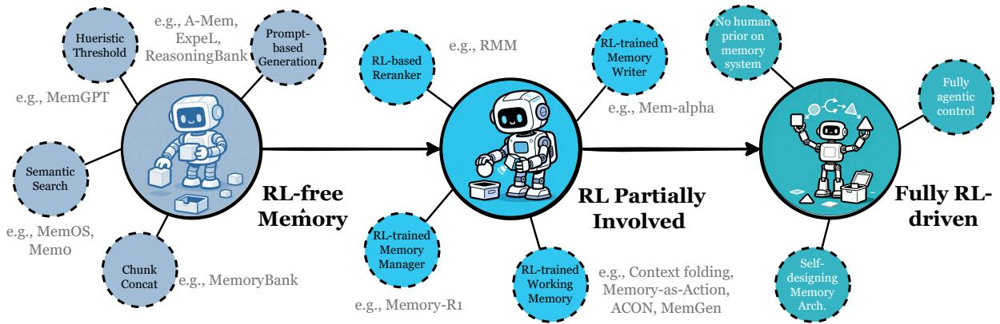

[← 返回 README](../README.md)

# 7. Positions and Frontiers

## 📌 预览
8 大前沿方向：(1) 记忆生成 vs 检索, (2) 自动化管理, (3) RL 融合, (4) 多模态, (5) 多智能体共享, (6) 世界模型, (7) 可信记忆, (8) 人类认知连接。

---

## 7.1 Memory Retrieval vs. Memory Generation

**范式转换**: 从 "存了什么就检索什么"（retrieval）→ "根据需要合成最优表征"（generation）。

两个方向：
- **Retrieve-then-Generate**: 先检索原始记忆 → 重组为更精炼的表征（ComoRAG, G-Memory, CoMEM）
- **Direct Generation**: 跳过检索，直接从上下文/latent states 生成记忆（MemGen, VisMem）

**Future**: 生成式记忆应该是 (1) context-adaptive（针对预期未来需求优化），(2) 跨异构信号融合，(3) learned and self-optimizing（通过 RL 学习何时/如何生成）

> 💡 **批注**: 类似人类记忆的 constructive nature——我们不是精确回放过去，而是根据当前需求重构记忆。Latent memory（§3.3）是实现这一目标的有力技术路径。

---

## 7.2 Automated Memory Management

**从手工规则 → agent 自主管理记忆**。

**Future**:
1. **Tool-based memory**: agent 通过工具调用（add/update/delete/retrieve）显式推理记忆操作，让记忆管理透明化
2. **Self-organizing structures**: 层次化+自演化结构，记忆存储自动重组

> 💡 **批注**: 核心思想——memory management 本身应该是 agentic capability，而不是外部固定流水线。

---

## 7.3 Reinforcement Learning Meets Agent Memory

*Figure 11: Evolution of RL-enabled agent memory: RL-free → RL-assisted → Fully RL-driven.*

> 💡 **Figure 11 批读 — 三阶段演进**:
> | 阶段 | 特征 | 代表 |
> |------|------|------|
> | **RL-free** | 启发式/prompt 驱动 | MemOS, Mem0, Dynamic Cheatsheet, ExpeL |
> | **RL-assisted** | RL 管理部分操作 | RMM(排序), Mem-α(写入), Context-Folding(压缩), MemSearcher(检索) |
> | **Fully RL-driven** | 端到端 RL 全记忆生命周期 | **未来方向** |

**Future 两大方向**:
1. **最小化人类工程先验**: 让 agent 通过 RL 自己发明记忆组织方式，而非沿用 episodic/semantic/procedural 人类分类
2. **全生命周期控制**: agent 自主处理多粒度 formation + evolution + retrieval

> 💡 **批注**: 最激进也最有潜力的方向。当前 RL-assisted 系统各管一段（Mem-α 管 writing, MemSearcher 管 short-term）。端到端 RL 训练全记忆系统在技术上极具挑战——需要在长时间跨度上优化，奖励信号稀疏且延迟。

---

## 7.4 Multimodal Memory

**现状**: 视觉/视频记忆最成熟（VideoAgent, XMem, MemoryVLA），音频等模态仍欠探索。

**Future**: 需要 truly omnimodal 记忆系统——统一存储、集成和检索异构模态信号，保持语义对齐和时间连贯。

---

## 7.5 Shared Memory in Multi-Agent Systems

**演进**: 孤立记忆+消息传递 → 集中共享记忆（MetaGPT, G-Memory）

**Future**: (1) agent-aware 共享记忆（基于角色/专长/信任度的读写控制），(2) RL-driven 共享管理，(3) 跨模态共享

---

## 7.6 Memory for World Model

**核心**: 世界模型的记忆 = 维护空间/语义信息确保长期一致性。

三条技术路径：SSMs（压缩历史为递归状态）、Explicit Memory Banks（UniWM, WorldMem）、Sparse Memory（稀疏采样+检索）

**Future**: 从 Data Caching → State Simulation：
- **Dual-System**: System 1（SSM/快/即时物理）+ System 2（VLM/慢/复杂推理）
- **Active Memory**: 认知工作空间主动策管、摘要、丢弃

---

## 7.7 Trustworthy Memory

**三大支柱**：
1. **Privacy**: 细粒度权限、用户控制保留策略、差分隐私、自适应遗忘
2. **Explainability**: 可追踪访问路径、自解释检索、反事实推理（"没有这条记忆会怎样？"）
3. **Hallucination Robustness**: 冲突检测、不确定性感知生成、多 agent 交叉验证

> 💡 **批注**: Wang et al. (2025b) 已证明记忆模块可通过间接 prompt 攻击泄露私人数据。在实际部署中，可信记忆是刚需。愿景：OS-like 记忆系统——分段、版本控制、可审计、agent 和 user 联合管理。

---

## 7.8 Human-Cognitive Connections

**现状**: Agent memory 架构与 Atkinson-Shiffrin 多存储模型（working + long-term）、Tulving 分类（episodic/semantic/procedural）高度对齐。但关键分歧：人类记忆是 **constructive**（重构），agent 记忆是 **verbatim**（精确回放）。

**Future**: 引入 offline consolidation（类似生物"睡眠"），agent 脱离交互进行记忆重组+生成式重放。从 explicit text retrieval → generative reconstruction。

> 💡 **批注**: "Sleep-like consolidation" 非常有想象力——让 agent 定期"睡觉"，把碎片化 episodic 记忆蒸馏为结构化 schema，实现从"归档数据"到"内化经验"的跃迁。

---

## 🔖 Section 总结

### 8 大方向优先级（Eason 参考）
| 优先级 | 方向 | 理由 |
|--------|------|------|
| 🔥🔥🔥 | **RL 融合** | 最明确的技术路径，已有大量初步成果 |
| 🔥🔥🔥 | **Memory Generation** | 范式级转换，从检索到生成 |
| 🔥🔥 | **自动化管理** | Memory management as agentic capability |
| 🔥🔥 | **可信记忆** | 实际部署刚需（隐私+可解释+抗幻觉） |
| 🔥 | **多智能体共享** | 随 multi-agent 系统成熟而增长 |
| 🔥 | **多模态记忆** | 依赖多模态模型成熟度 |
| 🔥 | **世界模型记忆** | 交叉方向，潜力大但难度高 |
| 💡 | **人类认知连接** | 启发性强但工程落地较远 |
