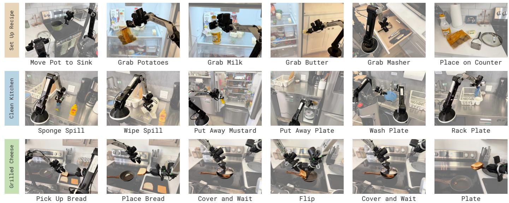
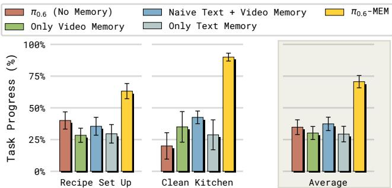
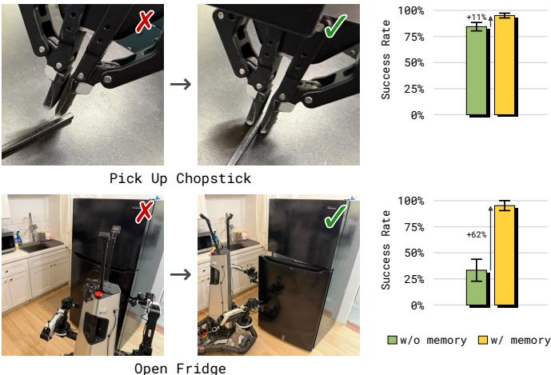
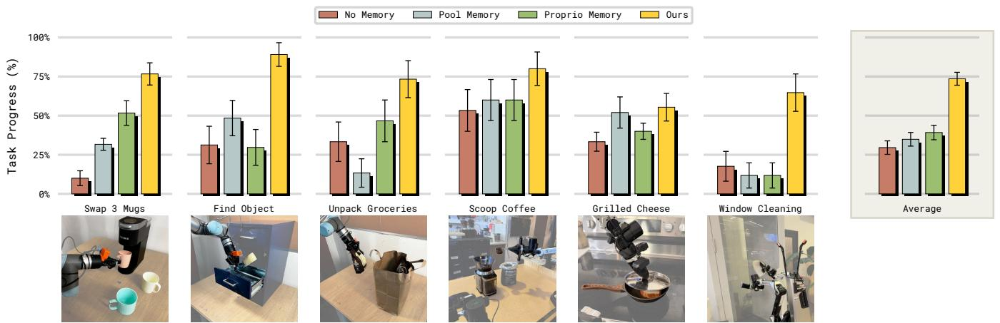
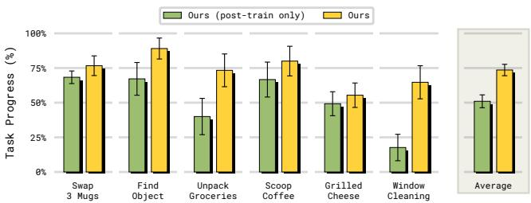
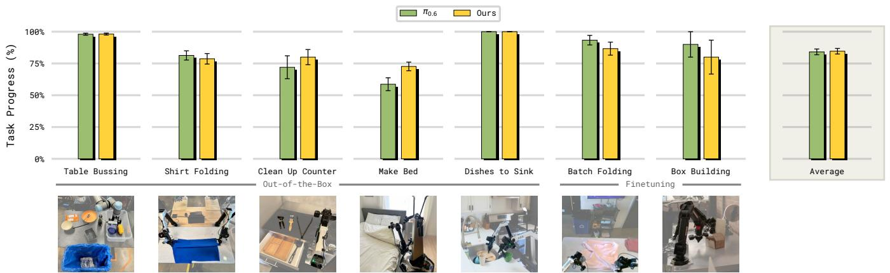

# IV. EXPERIMENTAL EVALUATION

Our experimental evaluation aims to answer the following questions: (1) Does MEM enable VLAs to perform tasks that require long-term memory spanning up to 15 minutes? (2) Does MEM unlock new capabilities in VLA models, like in-context adaptation of manipulation strategies, based on short-term memory of recent failures? (3) How does the performance of MEM compare to prior approaches for adding memory to VLA models?

> 💡 **三个核心问题**：长时记忆有效吗？短时记忆带来 in-context adaptation 吗？和其他方案比怎么样？实验设计很聚焦。

## A. MEM Solves Tasks Requiring Long-Horizon Memory

We evaluate our method's potential for enabling long-horizon tasks using two challenging scenarios that require retaining memory for up to fifteen minutes (see Figure 5, rows 1 & 2): (1) **Recipe setup**: The robot is given a detailed prompt specifying the ingredients and cookware required to cook a recipe and their location, and is asked to fetch all of them from various cabinets, drawers, or, e.g., the fridge, and place them at a specific location, e.g., on the stove or a specific countertop. Memory is required to keep track of all items that have already been assembled and remember to close drawers, cabinets, or the fridge once the task is complete. We train on 42 recipes across diverse kitchen scenes, and evaluate on five of the recipes in unseen kitchens and with unseen objects. (2) **Clean up kitchen**: The robot needs to clean up a messy kitchen environment, including stowing objects in the fridge, wiping countertops, washing dishes with soap and running water, and placing dishes in the drying rack.

> 💡 **两大 benchmark 任务**：
> 1. **Recipe setup** (42 个食谱)：从各处取齐做菜所需的食材和厨具。需要记住"哪些已经取了"、"取完记得关柜门"
> 2. **Clean kitchen**：清理乱厨房——擦台面、洗碗、收拾冰箱。需要记住"哪些表面已经擦过"、"碗先加洗洁精再洗"
>
> 这些任务的复杂度远超之前 VLA 的评估标准。

*Fig. 5: We test MEM policies across multiple challenging, long-horizon dexterous manipulation tasks that require retaining memory for up to fifteen minutes, including setting up a recipe, cleaning up a kitchen (Section IV-A), and making a grilled cheese sandwich (Section IV-C).*

*Fig. 6: Performance of policies on challenging, long-horizon manipulation tasks. Without memory, even state-of-the-art generalist policies like π₀.₆ struggle to perform such tasks. We ablate the memory components and show these tasks are solvable by combining short-horizon, observation-based memory, with long-horizon, language-based memory. Naive memory of past language instructions, without compression, struggles with training-inference distribution shifts.*

Figure 6 shows the results: without memory, even state-of-the-art models like π₀.₆ struggle to perform these challenging long-horizon tasks. While prior works have shown policies that perform manipulation over extended periods of time [35], solving real-world tasks with flexible subtask sequences and frequent partial observability fundamentally requires memory. The results show that MEM is effective at providing the required context to the policy across both short and long-horizon time intervals, and increases policy success rate significantly.

> 💡 **关键结果**：
> - 无记忆的 π₀.₆ 在这些长 horizon 任务上表现很差
> - 两种记忆都很重要——去掉任何一个都会显著下降
> - **Naive language memory**（简单拼接所有子任务指令）比压缩版差很多

To better understand what contributes to π₀.₆-MEM's strong performance, we perform a detailed ablation study of the different components of our approach. We report the results in Figure 6. We compare to versions of our policy that remove short-horizon video memory or long-horizon language memory, and show that both are essential to solving the challenge tasks. Without video memory, the robot may struggle to understand how long it has been washing a plate or wiping a surface, and get "stuck" indefinitely. Video memory also helps robustify manipulation tasks via in-context adaptation (see Section IV-B). Long-horizon language memory, on the other hand, is essential for remembering semantic events in the more distant past. It allows the policy to keep track of steps in the recipe, or remember to close doors that it has opened.

> 💡 **Ablation 分析**：
> | 组件 | 去掉后的影响 |
> |------|-------------|
> | Video memory | 机器人会"卡住"——不知道洗了多久的碗、擦了多久的桌子 |
> | Language memory | 忘记任务进度——不知道取过哪些食材、哪些门需要关 |
> | Memory compression | Train-inference distribution shift → 性能下降 |

We also evaluate a version of our policy that removes the compression applied to the language-based memory (see Section III-B): instead of training the model to compress and discard information that is no longer needed, we simply concatenate all previous subtask instructions up to a maximum length in the input of the high-level policy. We find that this type of "naive" language memory works significantly worse than our model-predicted summaries. The core challenge with "naive" language memory is a large train-inference distribution shift: during training, most episodes utter any given subtask instruction only once (e.g., "pick up bowl" "place bowl in cabinet") since they are typically near-optimal human demonstrations. Yet, during inference time policies may repeatedly fail on a given subtask, causing the high-level policy to repeatedly produce the same subtask before finally succeeding and moving on ("pick up bowl" "pick up bowl" "pick up bowl" "place bowl in cabinet"), leading to a distribution shift that can degrade overall policy performance. In contrast, MEM's language memory mechanism would simply not update the memory representation until the bowl was successfully picked up. This compression of context (e.g., discarding failed attempts) thus reduces distribution shift and improves overall performance.

> 💡 **为什么 naive memory 不行？** 这个分析很精彩：
> - 训练数据大多是人类最优演示 → 每个子任务只出现一次
> - 推理时机器人会失败重试 → 同一子任务重复出现
> - 这种不一致导致 distribution shift
> - MEM 的压缩记忆自然解决了这个问题——失败不更新记忆，只有成功时才写入
>
> 💡 **这也暗示了一个更深层的道理**：机器人记忆系统需要能处理"非最优"的执行过程，而不仅仅是回放最优轨迹。

## B. In-Context Adaptation of Manipulation Strategies

In the previous section, we showed that MEM can enable VLAs to solve very long-horizon tasks. In this section, we investigate whether equipping VLAs with memory can unlock improved performance, even on shorter-horizon tasks that at first glance may not require memory. Intuitively, while memory across tens of minutes is useful for keeping track of overall task progress, short-horizon memory can enable policies to adapt their behavior in-context and intelligently react to mistakes: instead of failing in the same way over and over, policies can use context of previous failed attempts to, for example, modify the way in which they are trying to pick up an object, or how they open a door.

*Fig. 7: VLAs with memory can perform in-context adaptation of manipulation strategies, like adjusting grasp height or door opening direction. Without memory, policies get stuck with a suboptimal strategy.*

To test whether MEM unlocks such in-context adaptation, we set up two tasks on which current state-of-the-art VLAs like π₀.₆ struggle (Figure 7): picking up flat objects like chopsticks with an out-of-distribution table height, which leads to frequent mis-grasps, and opening fridges where the direction the door opens is unclear, resulting in repeated failed opening attempts.

To teach policies the in-context adaptation strategy, we follow [35] and collect targeted human feedback: after the policy fails, a human intervenes and provides a demonstration of the corrected manipulation strategy, like adjusting grasp height for picking up the chopstick. For the fridge-opening task, we collect exploration rollouts in which the demonstrator initially does not know the opening mechanism, so the data naturally contains both the failed attempt and the subsequent corrective demonstration. We then simply finetune the π₀.₆ MEM policy with this correction data, keeping the failed attempt that preceded the correction in the short-term memory of the model during training. As a result, the model learns to adapt its manipulation strategy when it sees a mistake in its short-term memory.

> 💡 **In-context Adaptation 的训练方法**：
> 1. 收集 human intervention 数据：policy 失败 → 人类示范纠正
> 2. 训练时把失败尝试保留在短时记忆中
> 3. 模型学会：看到记忆里有失败 → 换策略
>
> 这有点像是 VLA 版的 "few-shot learning from mistakes"。

The results in Figure 7 show that the MEM-VLA with memory is much more effective at leveraging the corrections, and learns to adapt its manipulation strategy on the fly. The policy without memory has no way to remember which strategy was attempted before, and therefore cannot intelligently change the strategy after a mistake. In contrast, policies with memory can use the context to understand which strategy has already been tried and failed, and adjust accordingly.

> 💡 **核心发现**：记忆不只是为了"长任务"——即使是短任务，记忆也能带来"失败后切换策略"的能力。这对于 robust manipulation 非常重要。无记忆的 policy 会反复以相同的错误方式尝试，记忆赋予了 policy "不在同一个地方摔倒两次"的能力。

## C. Analysis Experiments

Tasks. To compare our method to existing approaches that equip VLAs with memory across a wide range of capabilities, we develop a suite of challenging manipulation tasks that measure the ability of policies to use memory efficiently, and perform dexterous manipulations (see Figures 8 and 10 for task visualizations). The tasks span a diverse set of scenarios involving single-arm, dual-arm, and mobile robots. They test for core memory capabilities, like handling partial observability (e.g., remembering which drawer an object was placed in by a human; unpacking a grocery bag and remembering whether objects are left to unpack; placing and removing multiple mugs under a coffee machine), counting (e.g., counting scoops of coffee to add to a coffee grinder), timing (e.g., remembering how long a grilled cheese sandwich has been cooking), and spatial memory (e.g., remembering which parts of a window have already been wiped). They also require policies to perform precise manipulations (e.g., folding a stack of laundry or assembling a cardboard box).

> 💡 **测试的记忆能力维度**：
> - **Partial observability**: 记住被遮挡的物体位置
> - **Counting**: 数咖啡勺数
> - **Timing**: 记住三明治煎了多久
> - **Spatial memory**: 记住窗户哪些部分已经擦过
> - **+ 精细操作**: 折叠衣物、组装纸箱

**Comparisons.** A number of prior works leverage observation-based (shorter-horizon) memory, and address its computational challenges through aggressive compression of observations from past timesteps. We compare our approach to two representative prior works to understand the tradeoffs of different memory representations: (1) **Pool Memory** akin to Jang et al. [20], we compress all past observations into a single "memory token" using average pooling. (2) **Proprio Memory** conditions on a history of low-dimensional robot states only, akin to [52], to avoid the computational cost of high-dimensional image memory.

> 💡 **对比方法**：
> - **Pool Memory**: 把所有历史帧的 ViT embedding 做 average pooling → 1 个 token（信息损失大）
> - **Proprio Memory**: 只用过去的本体感受（关节角度等）→ 没有视觉记忆
> - **π₀.₆ (no memory)**: 当前 SOTA VLA baseline
> - **MEM-Posttrain-Only**: 只在 post-training 引入记忆（不做 memory pre-training）

*Fig. 8: Comparison of approaches for equipping VLAs with memory across core memory capabilities (handling partial observability, counting, visual memory). VLAs without memory struggle to perform these tasks. Only MEM's memory approach performs well across all core capabilities.*

We report results in Figure 8. We first compare the different memory approaches on tasks that test core memory capabilities (Figure 8). As expected, the π₀.₆ VLA without memory struggles on these tasks and often has to resort to random chance, e.g., when picking which of four drawers to open to find the object hidden inside (25% success) or whether or not to add another scoop of coffee (50% success). In contrast, existing memory solutions improve performance, particularly on simpler memory tasks that only require a few bits of memory, e.g., remembering how many scoops of coffee have already been added to the hopper. We find that Pool-Memory's aggressive observation compression via average-pooling can lead it to struggle particularly on tasks that require longer-term memory, like remembering the past positions of multiple coffee mugs or recalling how many objects are left to unpack in a grocery bag. Proprio-Memory on the other hand is only effective in tasks where the robot needs to remember its own state, but struggles in scenarios where remembering the environment state is necessary.

> 💡 **结果分析**：
> - 无记忆 = 瞎猜（开哪个抽屉 → 25%，加不加咖啡 → 50%）
> - Pool Memory: 简单任务可以，复杂空间记忆不行（平均池化丢信息太多）
> - Proprio Memory: 只能记住自己的状态，不能记住环境状态
> - **MEM 是唯一在所有记忆维度都表现好的方案**

*Fig. 9: Pre-training MEM on a diverse dataset of robot and non-robot video data makes it more effective at using its memory to solve diverse manipulation tasks. Introducing memory during post-training only results in substantially lower performance.*

In comparison, the MEM VLA is the only model that achieves strong performance across all tested memory capabilities. It can reliably handle partial observability challenges like remembering the location of objects, and also leverage these capabilities in dexterous tasks like unpacking a bag of groceries. Notably, pre-training the observation-based memory on a diverse data mix of robot and non-robot data significantly improves the ability of the model to leverage its memory – even when the memory horizon is significantly expanded during post-training (e.g., from 5 seconds in pre-training to up to 1 minute in post-training). The version of our model that only introduces memory during post-training is noticeably worse at leveraging the information from past timesteps (see Figure 9).

> 💡 **Pre-training 的重要性**（Fig. 9）：
> - 在 pre-training 阶段就引入记忆 >>> 只在 post-training 引入记忆
> - 即使 pre-training 只用 5 秒记忆，post-training 扩展到 60 秒也能 work
> - 这说明记忆能力需要在大规模多样化数据上**预训练**才能充分发挥
>
> 💡 **即使没有 pre-training，MEM 的 video encoder 设计也优于 Pool Memory**——说明 interleaved space-time attention 本身就是比简单 average pooling 更好的视频压缩方案。

*Fig. 10: In addition to effectively using its memory, MEM also matches the performance of state-of-the-art non-memory VLAs across challenging manipulation tasks that do not require memory.*

In addition to testing core memory capabilities, we also test the performance of MEM across a range of challenging dexterous manipulation tasks (Figure 10). We find that the MEM VLA not only makes effective use of memory in tasks that require it, but it can also match the state-of-the-art performance of the π₀.₆ VLA across challenging dexterous manipulation tasks. This is notable, since numerous previous works have reported degradations in performance from adding memory to policies, e.g., due to causal confusion [11, 54]. We attribute MEM's strong performance in large parts to our diverse pre-training data mixture, which contains episodes of varying optimality, speed, and control frequency, in addition to diverse internet videos.

> 💡 **无 degradation**（Fig. 10）：给 VLA 加记忆通常会导致不需要记忆的任务性能下降（causal confusion）。但 MEM 没有这个问题——在折衣服、擦桌子、组装纸箱等精细操作上与无记忆的 π₀.₆ 持平或更好。这归功于多样化的预训练数据（不同最优性、速度、控制频率的 episode + 互联网视频）。
>
> 💡 **这是一个非常重要的结果**：加记忆不仅不掉性能，还带来了额外能力。这说明 MEM 的多模态设计成功避免了 causal confusion 的陷阱。
