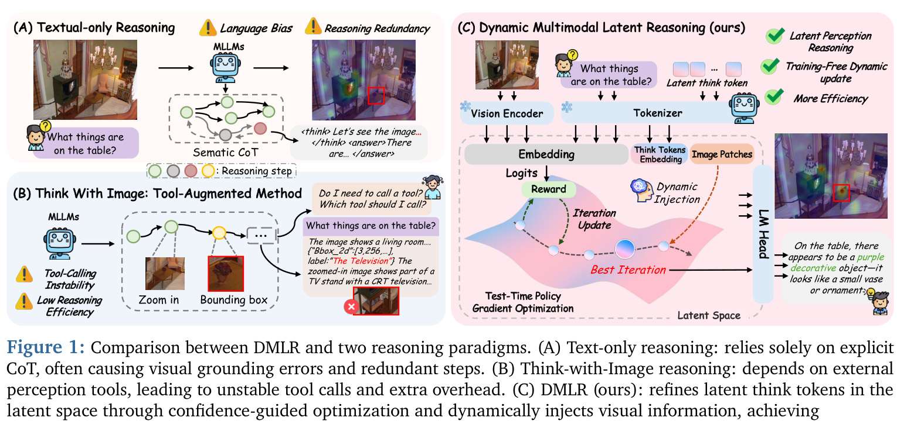

[← 返回 README](../README.md)

# 1. Introduction

## 📌 预览
Introduction 把现有多模态推理分成 **三大流派**：Textual-only CoT、Think-with-Images、Latent-space Reasoning，逐一指出毛病，然后引出 DMLR 想做的事——动态、按需、训练免费。Figure 1 这张「三分天下 + 我们的位置」对比图就是全文的灵魂图，看懂它就理解了 DMLR 的定位。

---

Multimodal Large Language Models (MLLMs) [1, 2, 3, 4] have achieved remarkable breakthroughs in integrating visual and linguistic information. This progress has facilitated the incorporation of Chain-of-Thought (CoT) reasoning into multimodal tasks, enabling models to construct structured reasoning paths across visual and textual modalities. Current multimodal reasoning approaches can be broadly categorized into three types: (1) Textual-only Reasoning [5, 6, 7], which generates intermediate reasoning steps in the sematic space. Such methods explicitly express reasoning logic through language generation but often suffer from language bias and insufficient visual grounding, as shown in Figure. 1(a). (2) Think with Images attempts to directly manipulate or augment images during reasoning, such as local zooming [8, 9], region highlighting [10, 11], or generating intermediate reasoning steps via diffusion models [12, 13] to enhance visual alignment. Despite their effectiveness in improving reasoning to a certain extent, they still face challenges such as unstable tool invocation and high inference overhead, as reflected in Figure 1(b). Recently, latent-space reasoning has emerged as a promising paradigm for enhancing reasoning capabilities in large language models, as exemplified by approaches such as CoCoNut [14] and LatentSeek [15]. Its core idea is to perform implicit reasoning in the latent space, replacing explicit textual steps with latent vectors to reduce redundant generation and capture more compact information. However, recent studies [16, 17, 18, 19] still rely on extra training to enforce latent reasoning triggered at fixed positions (via special tokens). This rigidity prevents the model from adaptively allocating reasoning effort.

> 💡 **三派对比（Figure 1 的内核）**:
>
> | 派系 | 代表 | 痛点 |
> |---|---|---|
> | **(a) Textual-only CoT** | KAM-CoT[5]、Vision-R1[7] | 全文本推理，无视觉接地→「语言幻觉」 |
> | **(b) Think-with-Image** | Pixel Reasoner[8]、ReFocus[10]、GRIT[11]、MVoT[12] | 依赖外部工具/生图，调用不稳、开销大 |
> | **(c) Latent Reasoning** | CoCoNut[14]、LatentSeek[15]、Latent Visual Reasoning[16] | 大多还需要训练；用 special token 触发，位置固定不灵活 |
>
> DMLR 的卖点：**完全 test-time**（不动模型权重）+ **动态触发**（不在固定位置）+ **隐式视觉注入**（不调工具、不生图）。

*Figure 1: Comparison between DMLR and two reasoning paradigms. (A) Text-only reasoning: relies solely on explicit CoT, often causing visual grounding errors and redundant steps. (B) Think-with-Image reasoning: depends on external perception tools, leading to unstable tool calls and extra overhead. (C) DMLR (ours): refines latent think tokens in the latent space through confidence-guided optimization and dynamically injects visual information, achieving self-improving reasoning without additional training while maintaining high efficiency.*

> 💡 **Figure 1 批读**:
> - **(A) Textual-only**: 模型只看一次图就开始纯文字推理，容易把红框那种细节漏掉。
> - **(B) Think-with-Image**: 推理过程中要决定 "需不需要 zoom in / 画 bounding box"，调用工具的成本高、调用次数难控制。
> - **(C) DMLR**: 把 think tokens 放进 latent space → 用 reward 做策略梯度更新 → 每次迭代选最佳 patch 注入。整张图最关键的是 "Best Iteration" 那个高地——本质上把推理 reframe 成了一个**在 latent landscape 上找置信度峰值**的问题。
> - 直观比喻：(A) 是闭着眼推理，(B) 是每说一句话就把图拿出来再看一眼并圈出来，(C) 是在脑中默念时无声地"瞄一眼图"，瞄过几次后自然得到答案。

---

Inspired by human cognition, we argue that reasoning is not fixed. Instead, humans dynamically revisit visual information, specifically when they encounter uncertainty. Drawing on this intuition, we empirically analyze the interplay between the model's visual reliance and its internal confidence. Our analysis reveals two key phenomena: (i) Visual information is used only at a few specific stages of the reasoning process rather than at fixed positions, and (ii) Internal confidence serves as a natural indicator for the need of visual grounding as it strongly correlates with reasoning correctness. These findings suggest that effective multimodal reasoning relies on dynamic visual usage guided by internal confidence.

> 💡 **认知动机**: 这一段把 Section 3 的两条观察一口气剧透了：
> 1. **视觉依赖是稀疏的、位置不固定**（→ 解释 RQ1，引出 Dynamic Visual Injection）
> 2. **置信度是要不要再看图的天然信号**（→ 解释 RQ2，引出 confidence-guided 优化）
>
> 这两条共同回答了：为什么"动态触发"比"固定 special token 触发"更对。

---

In light of these observations, we propose DMLR, a Test-time Dynamic Multimodal Latent Reasoning Framework, as shown in Figure 1(c). Specifically, it introduces optimizable latent think tokens to serve as a mental draft, which are iteratively refined through confidence-guided policy gradient updates. Crucially, we design a confidence-driven dynamic visual injection strategy. At each step, the model autonomously determines whether to revisit visual information and which contents to select (ranging from none to a few specific patches). This mechanism allows the model to naturally skip visual injection when internal confidence is sufficient, or actively integrate targeted visual clues when necessary, all driven by the objective of maximizing reasoning confidence, effectively mimicking the human cognitive process of checking visual clues to build confidence. After several iterations, the optimized latent tokens are decoded with the input without extra inference cost. Extensive experiments demonstrate that DMLR consistently outperforms existing methods across diverse architectures and tasks while maintaining high efficiency. The main contributions can be summarized as follows:

> 💡 **关键句**: "the model autonomously determines whether to revisit visual information and which contents to select (ranging from none to a few specific patches)". 这正是 Algorithm 1 里 `if r > r_best` 条件分支的语义——置信度变高就接受新 patch，否则保留 best。**自治性 (autonomous)** 不是靠监督信号，而是靠 reward signal 内生地决定。

❶ We reveal two key phenomena: Visual information contributes only at specific reasoning steps; and confidence reflects both reasoning quality and visual grounding.

❷ We propose DMLR, a test-time framework for multimodal latent reasoning that integrates confidenceguided latent optimization with dynamic visual injection.

❸ Extensive evaluations show that DMLR consistently outperforms other methods across diverse architectures and multimodal tasks, while maintaining high efficiency.

> 💡 **三个贡献的逻辑闭环**: ❶ 是观察（动机层），❷ 是方法（设计层），❸ 是结果（验证层）。论文严格按这条因果链组织——这也是个人写论文 intro 的好模板：观察 → 方法 → 结果，每条贡献都对应后文的一个章节。

---

## 🔖 Section 总结

### 核心洞察
1. **现有三类多模态推理范式都有结构性短板**: textual-only 没视觉接地、think-with-image 工具开销大、latent reasoning 还要训练且触发位置固定。
2. **人类认知给的启示**: 思考不是线性的，而是「按需调取视觉」+「置信度自驱」。
3. **DMLR 的设计原则**: test-time、training-free、动态触发、隐式视觉注入。

### 关键术语
| 术语 | 中文 | 在 DMLR 中的作用 |
|---|---|---|
| Latent think token | 隐式思考 token | 可优化的 embedding，扮演 "mental draft" |
| Policy gradient (REINFORCE) | 策略梯度 | 优化 latent 朝最大化 reward 方向 |
| Confidence reward | 置信度奖励 | reward = 1 − 平均 top-k truncated entropy |
| Dynamic Visual Injection (DVI) | 动态视觉注入 | 每步用 attention 重采样 m 个 patch，比 reward 决定接受 |
