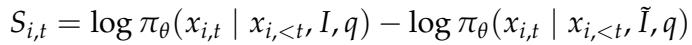
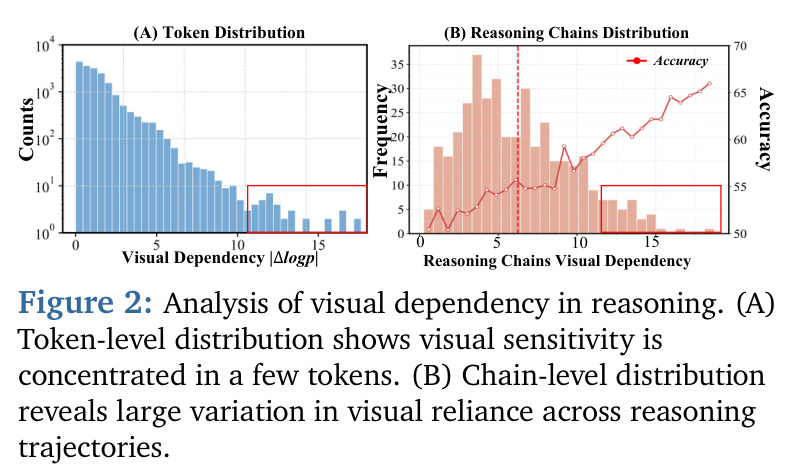
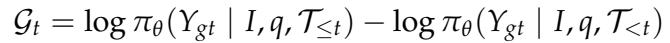
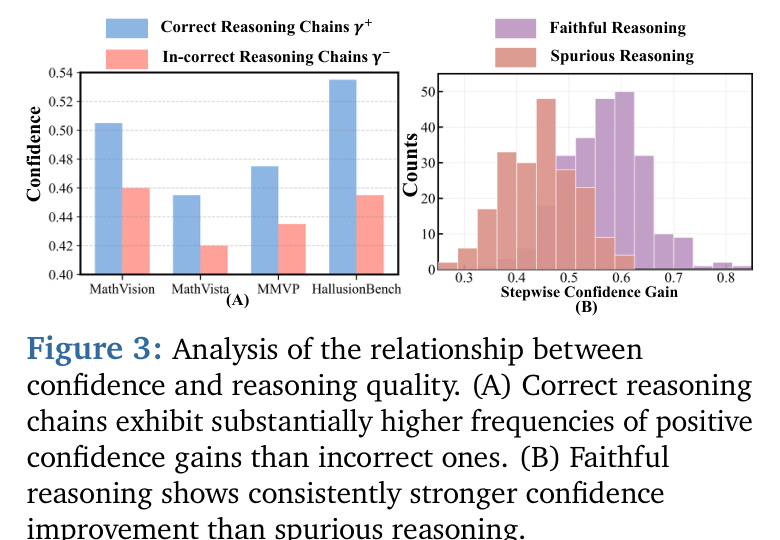
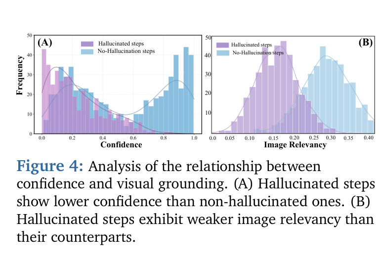

[← 返回 README](../README.md)

# 3. Preliminary and Motivation

## 📌 预览
这一节做了两个**实证分析**来支撑 DMLR 的设计假设：
1. **RQ1**: 多模态推理是不是每一步都需要看图？→ 用 *Visual Dependency Score* 测，结论是 **不需要**——视觉敏感性极度稀疏。
2. **RQ2**: 内部表示能不能告诉模型"什么时候该看图"？→ 用 *Confidence Gain* 测，结论是 **可以**——置信度同时反映推理正确性、推理质量和视觉接地。

这两个 RQ 直接映射到方法部分：RQ1 → DVI（动态选择 patch），RQ2 → confidence reward（用置信度做监督）。

---

As shown in Figure 12, existing reasoning paradigms commonly suffer from insufficient visual grounding, unstable tool invocation, and high computational overhead. These limitations motivate a fundamental question: why can't MLLMs reason like humans do, dynamically deciding how to reason and which visual information to pay attention on during the thinking process? To this end, we organize the section around two research questions: (RQ1) Whether multimodal models require visual perception at every step of reasoning? (RQ2) If not, can their internal representations indicate when visual perception and reasoning is required?

> 💡 **小坑**: 原文这里写 "Figure 12"，但 Figure 12 实际是 Appendix 里 case study 的卡车图。看上下文应该是引用 Figure 1（三种推理范式对比），这是 MinerU 没纠出来的笔误或作者笔误。读到这一句时，对应的是 Figure 1。

> 💡 **两个 RQ 的关系**: RQ2 是给"YES"——内部表示**能**指示什么时候要视觉。这就把 DMLR 从"启发式"提升到了"原理上可行"。这是非常聪明的实验铺垫顺序——先 RQ1 给 *necessity*，再 RQ2 给 *feasibility*。

---

## 3.1 Dynamic Perception-Reasoning is Necessary

> 💡 **3.1 要点预览**: 用一个直观量化指标——**Visual Dependency Score**——证明视觉依赖在 token 层面是稀疏的，在 chain 层面差异巨大。

**Definition 3.1 (Visual Dependency Score).** Let the visual input be denoted as I, and its perturbed version as ˜I. Given a query $q$, the model's dependence on visual information can be quantified by measuring the output discrepancy between the original and perturbed visual inputs. Specifically, for the i-th generated sequence $\mathcal{X}_i = \{x_{i,1}, x_{i,2}, \ldots, x_{i,t}\}$, the visual dependency score at position t is defined as:



where $\pi_\theta(\cdot)$ denotes the token-level conditional probability distribution of the model. A larger $S_{i,t}$ indicates a stronger dependency of the generated token on visual information.

> 💡 **公式 (1) 的直觉**: $S_{i,t}$ = log-prob(原图) − log-prob(扰动图)。如果模型生成第 t 个 token 时**真的依赖**图像信息，扰动图后 log-prob 会显著降低 → $S_{i,t}$ 大；反之，纯逻辑/语言推理的 token 对图像扰动不敏感 → $S_{i,t} ≈ 0$。
>
> 这其实是 **counterfactual perturbation analysis** 的标准做法（类似 saliency map），只不过把单点 saliency 推广到了每个生成位置。

Building upon the above metric, we analyze visual dependency on the Math-Vision benchmark using the Qwen2.5-VL-7B [42] at two levels. First, for individual reasoning chains, we compute token-level visual dependency scores, capturing how much each generated token relies on visual information, as illustrated in Figure 2(a). Second, as shown in Figure 2(b), we aggregate these scores across full reasoning trajectories to obtain chain-level visual dependency, which reveals how different reasoning paths vary in their reliance on visual perception. These results reveal that:


*Figure 2: Analysis of visual dependency in reasoning. (A) Token-level distribution shows visual sensitivity is concentrated in a few tokens. (B) Chain-level distribution reveals large variation in visual reliance across reasoning trajectories.*

> 💡 **Figure 2 批读**:
> - **(A) Token Distribution**: 横轴是 $|S_{i,t}|$（视觉依赖强度），纵轴 counts。绝大多数 token 都堆在 0 附近 ≤ 5；红框里那些大于 10 的"视觉依赖 token"只占极少数。→ 视觉依赖在 token 层是 **重尾稀疏**。
> - **(B) Reasoning Chains Distribution**: 同样的指标但聚合到整条 chain。红色折线是 accuracy。chain-level 依赖越高，accuracy 越高（约从 50% 上升到 65%+）。→ 推理链对视觉依赖的差异很大，且依赖更强 = 更准。
> - **联系两图**: token 稀疏 + chain 差异大 → **固定位置注入视觉是浪费**，应该让模型自己挑要不要看图。

> ✦ **Takeaway 1.** The dependency on visual input across the reasoning process is highly uneven: only a small subset of tokens show strong sensitivity to visual features, while the majority operate independently of the image.

> ✦ **Takeaway 2.** Across reasoning chains sampled from the same model, visual dependency varies substantially. Chains exhibiting stronger visual reliance consistently yield higher accuracy.

> 💡 **两个 Takeaway 一起读**:
> - Takeaway 1 = 视觉依赖在**位置维度**稀疏 → "fixed-position 触发"不合理。
> - Takeaway 2 = 视觉依赖在**chain 维度**差异大 → 不同样本需要不同的视觉调用频率。
> - 合起来 → 必须做**动态触发**（DMLR 的 DVI 设计原则）。

---

## 3.2 Internal Confidence Affects Multimodal Reasoning

> 💡 **3.2 要点预览**: 既然要动态决定"何时看图"，那决策信号从哪来？作者发现：**模型自己的内部置信度** 就是天然信号。证据有三条 Observation：置信度 ⇔ 正确性、置信度 ⇔ 推理质量、置信度 ⇔ 视觉接地。

**Definition 3.2 (Confidence Gain).** Let I denote the visual input, q the query, and $\mathcal{T}_t$ denotes the reasoning at step t. The Confidence Gain at step t is defined as the change in the probability of the ground-truth answer $Y_{gt}$ after adding step xt. A positive $\mathcal{G}_t$ suggests that step $x_t$ strengthens the confidence, whereas a negative value indicates the opposite.



> 💡 **公式 (2) 的直觉**: $\mathcal{G}_t$ = log P(GT | 加上 step t) − log P(GT | 不加 step t)。如果当前推理步 $x_t$ 让模型对真答案的信心提高了，就是 positive gain；否则 negative。
> **注意**: 这是用 **ground truth** 标签算的 oracle 信号，仅用于 motivation 分析；后文方法里 DMLR 把它替换为 **truncated entropy**（不需要 GT，纯内部信号）。

> ❖ **Observation 1: Higher Confidence Tends to Indicate Higher Reasoning Accuracy.** We analyze reasoning chains generated by various reasoning models across four benchmarks, where all chains are partitioned into a correct set $\mathcal{T}^+$ and an incorrect set $\mathcal{T}^-$ based on their answer correctness. We then compute the proportion of reasoning steps for each chain that obtain a positive confidence reward. As shown in Figure 3(a), reasoning chains in $\mathcal{T}^+$ exhibit a substantially higher proportion of positive confidence increments compared to those in $\mathcal{T}^-$, indicating that the reasoning leading to correct answers tends to exhibit more stable and higher confidence.

> 💡 **Observation 1 解读**: 用「答对/答错」二分推理链，**答对的链有更高比例的 positive confidence gain**。也就是说，置信度的提升路径本身就是答题质量的代理。

> ❖ **Observation 2: Confidence Reflects Reasoning Chains Quality.** We investigate whether confidence dynamics reflect reasoning quality by evaluating reasoning chains within the correct set $\mathcal{T}^+$ using the evaluator GPT-4o [43]. Each chain is assessed for logical validity and factual consistency, and categorized into Faithful and Spurious groups. As shown in Figure 3(b), faithful reasoning chains exhibit a higher proportion of positive confidence increments, suggesting that confidence improvement not only correlates with answer accuracy but also reveals the intrinsic quality of the reasoning process.

> 💡 **Observation 2 的精妙处**: 即便都答对了，**逻辑过程也有好坏之分**（faithful = 推理过程真的对；spurious = 凑对答案但推理瞎扯）。作者用 GPT-4o 当评委分出这两类，结果发现 faithful 比 spurious 的置信度增益更高。→ 置信度信号不止是 "shortcut" 到答案，而是**真的反映推理质量**。这一点很重要，因为它意味着用 confidence 当 reward 优化 latent，不会被"刷分但推理崩坏"的 hack 所欺骗。


*Figure 3: Analysis of the relationship between confidence and reasoning quality. (A) Correct reasoning chains exhibit substantially higher frequencies of positive confidence gains than incorrect ones. (B) Faithful reasoning shows consistently stronger confidence improvement than spurious reasoning.*

> 💡 **Figure 3 批读**:
> - **(A)**: 蓝（correct chains $\mathcal{T}^+$）在多个 benchmark (MathVision、MathVista、MMVP、HallusionBench) 上 confidence 全面高于红（incorrect）。
> - **(B)**: 紫（Faithful）的 stepwise confidence gain 分布偏右（更大正值），橙（Spurious）偏左。
> - 两图合起来：confidence 不仅能区分对错，还能区分"对得有道理"和"瞎蒙对的"。

---

> ❖ **Observation 3: High Confidence Aligns with Stronger Visual Grounding.** We further evaluate various reasoning models on the perception benchmark to analyze the relationship between confidence and visual grounding. Each step in the reasoning chain is categorized as hallucinated or non-hallucination based on whether it refers to an object actually present in the image. As shown in Figure 4, hallucinated steps exhibit lower confidence and weaker visual grounding, while non-hallucinatory steps maintain higher and more stable confidence with stronger visual alignment. The results indicate that confidence acts as an intrinsic signal of visual faithfulness, with higher confidence consistently associated with more reliable reasoning.


*Figure 4: Analysis of the relationship between confidence and visual grounding. (A) Hallucinated steps show lower confidence than non-hallucinated ones. (B) Hallucinated steps exhibit weaker image relevancy than their counterparts.*

> 💡 **Figure 4 批读**:
> - **(A) Confidence**: 紫色（hallucinated）的分布偏低 confidence 区域，蓝色（non-hallucinated）偏高。
> - **(B) Image Relevancy**: 紫色 hallucinated 步骤的 image relevancy 也偏低；蓝色 non-hallucinated 偏高。
> - 关键：**幻觉步骤同时表现为"低置信 + 低视觉接地"**。这意味着置信度低就是"模型不确定 + 没真正看图"的双重信号，正好可以当成"该注入视觉了"的触发器。

> 💡 **三个 Observation 串起来的因果链**:
>
> ```
> 置信度高 ─→ 推理可能正确 (Obs 1)
>           ─→ 推理过程更 faithful (Obs 2)
>           ─→ 视觉接地更强、幻觉少 (Obs 3)
> ```
>
> 所以 DMLR 把 **maximize confidence** 当 objective 是合理的——它不是在 hack 一个 proxy，而是优化一个跟"正确 + 真推理 + 真看图"三位一体的信号。

---

## 🔖 Section 总结

### 关键定义速查
| 概念 | 公式 | 含义 |
|---|---|---|
| Visual Dependency Score $S_{i,t}$ | Eq.1 | 单 token 对图像扰动的敏感度 |
| Confidence Gain $\mathcal{G}_t$ | Eq.2 | 单步对 GT log-prob 的提升量（仅用于分析） |

### Takeaways & Observations 串读
1. **Takeaway 1+2 (RQ1)**: 视觉依赖在 token 维稀疏、在 chain 维差异大 → 必须**动态触发**。
2. **Obs 1**: confidence ⇔ 答案正确性
3. **Obs 2**: confidence ⇔ 推理过程 faithful
4. **Obs 3**: confidence ⇔ 视觉接地强、幻觉少
   → confidence 是**多重一致的内部信号**，做 reward 可靠。

### 设计映射到方法
| 观察 | 方法对应 |
|---|---|
| 视觉依赖稀疏（Takeaway 1） | Dynamic Visual Injection: 只在需要时挑 m=2 个 patch |
| 视觉依赖差异大（Takeaway 2） | DVI 的 reward 比较：好用就保留，没用就退回 |
| confidence 是好 reward (Obs 1-3) | reward = 1 − truncated entropy → policy gradient |
