[← 返回 README](../README.md)

# 4. Methodology

## 📌 预览
这是全文最关键的方法节。DMLR 把 latent reasoning 拆成两件事：
1. **Confidence-guided 策略梯度** 更新 latent think tokens（4.2 前半 + 公式 5-9）
2. **Dynamic Visual Injection** 在 latent 流里按需替换图像 patch（4.2 后半 + Eq.10 + Alg.1）

最后 4.3 用两个 theorem 给方法落了一个**信息论 + 优化论**的理论保险。

---

## 4.1 Problem Formulation

> 💡 **4.1 要点预览**: 把"在 latent 空间推理"形式化成"对 L 个可优化 embedding 做 test-time 优化"。

Given a text input sequence $\mathcal{Q} = (q_1, \ldots, q_k)$ and a set of visual embeddings $\mathcal{Z} = (z_1, \ldots, z_I)$ extracted by a visual encoder, the MLLM $\pi_\theta$ encodes the text sequence into embeddings and incorporates visual features to generate the reasoning sequence $\mathcal{X} = (x_1, x_2, \ldots, x_N)$

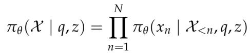

where $x_{<n}$ denotes the sequence of tokens preceding position n. Different from approaches that use the last hidden state of the previous reasoning step as latent think tokens [44, 18], we introduce L learnable latent think tokens into the input sequence, whose embeddings after projection are denoted as $\mathcal{T} = [\tau_1, \tau_2, \ldots, \tau_L]$. These tokens are concatenated with the original inputs and fed into the model. During test-time inference, our core idea is to keep model parameters fixed and improve reasoning solely by optimizing the embeddings of the latent think tokens.

> 💡 **关键设计选择**: 和 [44] Reasoning-in-the-Dark、[18] Multimodal CoCoNut 不同——他们用上一步 hidden state 当 latent think token（**链式**，position-by-position）。DMLR 直接在 input 里塞 **L 个独立的可学习 embedding**（**并行式**），整体作为 mental draft 一起优化。这两种范式的本质差异是：
> - 链式：autoregressive，每步依赖上一步，optimization 信号短
> - 并行式 (DMLR)：L 个 latent 同时优化，可以多次 rollout 计 reward，更适合 REINFORCE。

Motivated by the observations in Section 3, we define a reward function R to quantify the confidence of the current latent reasoning state. This leads to the following test-time optimization objective:

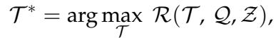

In practice, the model iteratively update the latent think tokens for T steps, allowing them to progressively evolve toward directions that maximize the reward.

> 💡 **核心 framing**: 把 inference 重新定义为一个 **优化问题**——固定 $\theta$，找最优 latent embedding $\mathcal{T}^*$。这跟传统 inference（forward 一遍生成）的根本区别是：**inference 时也在做 gradient ascent**。计算开销主要花在 T 步 latent 更新，而不是文本 decode。

---

## 4.2 Dynamic Multimodal Latent Reasoning

In light of the observations in Section 3, DMLR comprises two key processes: dynamic visual injection strategy for RQ1, and confidence-guided optimization of latent think tokens for RQ2, as shown in Figure 5 and Algorithm 1.

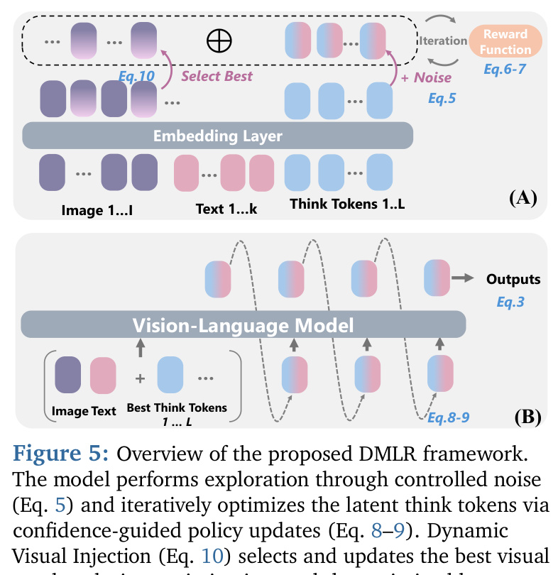
*Figure 5: Overview of the proposed DMLR framework. The model performs exploration through controlled noise (Eq. 5) and iteratively optimizes the latent think tokens via confidence-guided policy updates (Eq. 8–9). Dynamic Visual Injection (Eq. 10) selects and updates the best visual patches during optimization, and the optimized latent tokens are decoded (Eq. 3) to produce the output.*

> 💡 **Figure 5 批读**:
> - **(A) Optimization 阶段**: Image tokens + Text tokens + L 个 think tokens 一起进 Embedding Layer。Reward Function (Eq.6-7) 评估当前 latent 状态。Think tokens 加 Noise (Eq.5) 探索，根据 reward 做 policy gradient 更新。Eq.10 决定 select best patches 注入。注意右下角 "Iteration" 循环 T 次。
> - **(B) Decode 阶段**: 优化结束后，最佳 think tokens 跟 image+text 一起喂进 VLM (Eq.3)，生成最终输出。**Decode 时没有 think tokens 的额外文字 token**——所以 inference 序列长度跟 vanilla 一样。
> - **关键洞察**: 跟 ICoT 这类 latent 视觉注入方法相比，DMLR 把 "推理" 和 "解码" **解耦**：推理是 latent 空间的优化循环，解码是固定的一次 forward。这就是为啥它 efficiency 高。

---

### Latent Think Tokens Initialization
We initialize the latent think tokens before each iteration to facilitate exploration in the latent space. To this end, we adopt a stochastic perturbation strategy that adds controlled randomness while preserving representation stability. Specifically, multiplicative noise sampled from a Gaussian distribution is applied as a local perturbation to the current latent state:

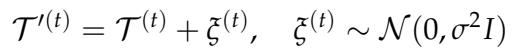

where $\sigma^2$ is a variance hyperparameter that controls the magnitude of exploration and $\xi^{(t)}$ is the multiplicative Gaussian noise sampled at iteration t. More analyses and results are shown in Section 5.3.

> 💡 **Eq.5 直觉**: 每一步迭代前先对 latent 加高斯扰动 → 让 REINFORCE 有"探索方向"。文里写 "multiplicative noise"，但公式实际是 **additive Gaussian**。论文里 σ 默认 0.1（10%），有 decay 0.95（参考 Appendix A.3）。
>
> 这一步是 REINFORCE 必备的——没有扰动就没法估梯度（log-prob 不变 → ∇log π = 0）。

---

### Reward Formulation
We propose a confidence-guided reward that dynamically optimizes latent think tokens during reasoning. In contrast to prior approaches [45, 30] that use confidence ony for post-hoc evaluation, we treats it as an intrinsic feedback signal that continuously guides latent reasoning optimization. Given the latent think state $\mathcal{T}^{(t)}$, the query $q$, and visual features z, the model $\pi_\theta$ generates token-level probability distributions $\mathcal{P}_i^{(t)}$ over the vocabulary w. We further quantify the model's confidence for each latent think token by computing the truncated entropy over its top-k most probable tokens, defined as:

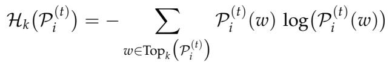

where $\text{Top}_k(\cdot)$ denotes the set of the k tokens with the highest probabilities. A lower value of the entropy $\mathcal{H}_k(\cdot)$ corresponds to higher confidence in the model's prediction at that position. The reward for the entire latent reasoning sequence is defined as the complement of the mean truncated entropy computed over all L latent think tokens:

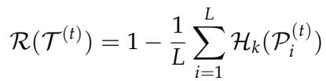

> 💡 **为什么是 truncated (top-k) entropy 而不是完整 entropy？**
> - **完整 entropy** 在大词表 (50k+) 下噪声大，长尾分布会被低概率 token 主导。
> - **Top-k truncated** 只算前 k 个最可能 token 的 entropy，聚焦在"模型真在考虑的选项"上。
> - 一个清晰的"两选一"（top-1 vs top-2 概率差很大）= 低 entropy = 高 confidence；如果前 k 都差不多 = 高 entropy = 低 confidence。
>
> Reward = $1 - \frac{1}{L}\sum_i \mathcal{H}_k(\mathcal{P}_i^{(t)})$，即"平均 confidence"。最大化 reward = 让所有 L 个 latent 位置都更确信。

---

### Test-Time Latent Optimization
Recent works [15, 46, 38] have explored test-time gradient optimization to enable adaptation in language tasks, whereas we focus on optimization processes for multimodal latent reasoning. Specifically, during the test-time inference, guided by the objective defined in Equation 7, we adopt a REINFORCE-based [47] direct policy gradient method to adaptively optimize the latent think tokens $\mathcal{T}^{(t)}$. Assuming that each latent think token is independent, the update rule is formulated as:

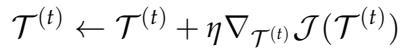

where $\eta$ denotes the learning rate. According to the Policy Gradient Theorem and Equation 5, the gradient can be formulated and further expressed as:

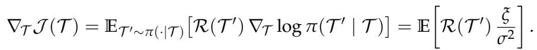

> 💡 **Eq.9 关键步骤推导**:
> - 经典 REINFORCE: $\nabla_\theta J = \mathbb{E}[R \cdot \nabla_\theta \log \pi(a|s)]$
> - 这里 policy 是 $\pi(\mathcal{T}' | \mathcal{T}) = \mathcal{N}(\mathcal{T}, \sigma^2 I)$，所以 $\log \pi(\mathcal{T}' | \mathcal{T}) = -\frac{\|\xi\|^2}{2\sigma^2}$（去掉常数）。
> - $\nabla_\mathcal{T} \log \pi = \frac{\xi}{\sigma^2}$，所以最终的梯度估计是 $R(\mathcal{T}') \cdot \frac{\xi}{\sigma^2}$。
> - 这就是 **score-function estimator** / **REINFORCE-Gaussian** 的标准形式，跟 NES (Natural Evolution Strategy) 同源。

> 💡 **算法上的洁癖**: 因为 reward (entropy) 是**可导**的（来自 softmax），其实可以直接对 latent 做反向传播；但作者选 REINFORCE 是因为：
> - (i) 跟 Eq.5 的 explicit perturbation 协调（已经在做随机扰动）
> - (ii) 不依赖具体可导路径，更通用——视觉注入 (Eq.10) 是离散选择 (argmax patch)，REINFORCE 天然兼容这种离散决策

---

### Visual Injection Strategy
Different from methods that directly inject high-attention regions [41], our strategy updates the most informative visual patches based on the reward at each iteration and injects them as latent visual tokens. As illustrated in Algorithm 1, we first use the initial attention of the latent think token to collect m highly relevant image patches (see Section 5.1), which serve as the initial best patch $\mathcal{V}_{best}$. At each iteration, the model resamples m candidate patches $\mathcal{Z}_{cand} = \{\mathcal{Z}_1, \ldots, \mathcal{Z}_m\}$ based on the updated attention and injects them together with the previous best patch into the latent sequence for reward, as formulated in Equation 10. If the reward $r > r_{best}$, indicating that the candidate patches provide enhanced visual evidence, the best patch $\mathcal{V}_{best}$ is updated; otherwise, the previous best is retained.

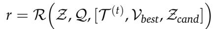

As the iterations progress, the best visual patch converges to the regions most relevant to the latent think state, guiding the latent reasoning toward more effective optimization.

> 💡 **DVI 与 ICoT 的关键区别**:
> - **ICoT [41]**: 直接把所有高注意力区域全注入，**一锤子买卖**。
> - **DVI (DMLR)**: 每步 resample → 用 reward gate 决定 accept/reject → 类似 **hill climbing + beam-1**。
>   - 接受：reward 真的涨了，证明新 patch 有用
>   - 拒绝：保留之前的 best，避免被随机扰动带偏
>
> 这种 "accept if better, else keep" 的设计很像 simulated annealing 的退火过程，确保**单调改进**。

> 💡 **"Best patch 累积" 的细节**: 看 Algorithm 1 第 19 行 `V_best ← V_best ∪ Z_cand`——其实是 **并集**，不是替换。所以 best patch 集合可以增长，但增长是 reward-gated 的。这跟"始终保留 m 个"不一样，更像"质量最好的几个 patch 越攒越多"。Appendix A.3 提到"at most 16 patches inserted per iteration"，给了一个上限防止失控。

### Algorithm 1: Dynamic Multimodal Latent Reasoning

```
Require: Image embeddings Z, text embeddings Q, latent tokens τ_l, learning rate η, iterations T,
         best visual patch V_best, top-k probability Top_k(P_i), number of candidate patches m

Top_k(P_i) = π_θ([Q, Z, T]);  r ← R(P_i)   ▷ initial reward

# Latent Policy Gradient Optimization
for t = 1 ... T do
    ε ~ N(0, σ² I)                          ▷ latent perturbation
    T^(t)' ← T^(t) + ε
    T^(t)  ← T^(t) + η ∇_{T^(t)} J(T^(t))   ▷ latent update

    # Dynamic Visual Injection
    V_best ← Initialize(T^(0), m)            ▷ initialize best patch
    for l = 1 ... L do
        Z_cand ← AttentionSelect(T_l^(t), m) ▷ select m candidate visual patches
        T̃_l^(t) ← [T_l^(t), Z_cand, V_best]
        r ← R(Q, Z, T̃_l^(t))
        if r > r_best then
            V_best ← V_best ∪ Z_cand;
            T_l^(t) ← T̃_l^(t)                ▷ update best
        else
            T_l^(t) ← [T_l^(t), V_best]       ▷ revert to previous best

X ← Decode(T^(t), Z, Q)
return X
```

> 💡 **Algorithm 1 关键梳理**:
> 1. **外循环 (t = 1..T)**: 每步对 latent T 做 Gaussian 扰动 + 策略梯度更新。
> 2. **内循环 (l = 1..L)**: 对每一个 latent token 位置，独立地用 attention 选 m 个候选 patch、计算 reward、决定更新。
> 3. **总计算开销 ≈ T × L × (1 forward for reward) + T × (1 grad step)**。默认 T=15, L=4, m=2，所以每个样本大约 15×4=60 次额外 forward。
> 4. **Decode 阶段**: 用最终优化好的 T 一次 forward 出答案，**不再有额外 latent step**。

---

## 4.3 Theoretical Analysis

To further understand why DMLR achieves high efficiency and robust performance, we provide theoretical explanations through the following two theorems.

**Theorem 4.1 (Confidence Reflects Reasoning Quality).** Let h denote the latent reasoning state in DMLR, where C(h) represents the model's confidence level and $Q(h)$ denotes the corresponding reasoning quality. If and only if the gradients of $C(h)$ and $Q(h)$ are positively aligned, the DMLR update along the confidence ascent direction will consequently improve the reasoning quality:

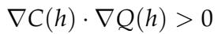

> 💡 **Theorem 4.1 解读**:
> - 表述其实是"if and only if"——意思是**只有当置信度和质量梯度同向**时，沿 confidence 上升才一定让 quality 也上升。
> - 那何时同向？Section 3.2 的 Observation 1+2 实证证明了**经验上**这两者在多模态 MLLM 上正相关 → DMLR 的优化方向合理。
> - 不过这个 theorem 偏 motivational：它把"置信度⇔质量"的实证关系**形式化**成了优化等价性，但**没有**给出充要条件成立的理论保证（仍依赖经验 alignment）。

**Theorem 4.2. (Visual Injection Enhances Confidence).** Let T be the latent reasoning states, $\hat{\mathcal{T}}$ denote the updated states after visual injection, and $z_v$ be the visual features. Visual injection in DMLR increases the mutual information between latent states and visual features, thereby enhancing the expected confidence $J_{conf}(\mathcal{T})$ satisfying:

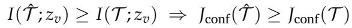

> 💡 **Theorem 4.2 解读**:
> - 用**信息论**框架描述 DVI 的效果：注入 patch 增加了 latent state 跟视觉特征的**互信息 $I(\hat{\mathcal{T}}; z_v)$**。
> - 互信息提高 → 视觉接地更强 → 置信度期望提升。
> - 注意条件 $I(\hat{\mathcal{T}}; z_v) \geq I(\mathcal{T}; z_v)$ 不是天然成立——这正是 DVI 的 reward gate "$r > r_{best}$" 在保证的。所以**算法设计 ⇔ 定理前提**是闭环的。

> 💡 **两个定理串起来的论证**:
> - Theorem 4.2 → 视觉注入提升 confidence；
> - Theorem 4.1 → confidence 提升 (在 alignment 条件下) 等价于 quality 提升；
> - 合起来：**视觉注入 → 更高 confidence → 更好推理质量**。
>
> 这正是论文中 DVI + confidence reward 同时存在的逻辑根据。

---

## 🔖 Section 总结

### 三个核心组件
| 组件 | 公式 | 角色 |
|---|---|---|
| Latent perturbation | Eq.5 | 提供 REINFORCE 的探索方向 |
| Confidence reward | Eq.6-7 | reward = 1 − mean top-k entropy |
| Policy gradient update | Eq.8-9 | REINFORCE-Gaussian latent 更新 |
| Dynamic Visual Injection | Eq.10 + Alg.1 | reward-gated best patch 累积 |

### 关键设计选择
1. **L 个独立 latent，不是链式 hidden state** → 更适合 REINFORCE 并行优化
2. **truncated top-k entropy** → 噪声小，聚焦实际竞争 token
3. **REINFORCE 而非直接反向传播** → 兼容离散 patch 选择
4. **Accept-if-better 的 DVI** → 单调改进保证

### 理论保证
- **Theorem 4.1**: 置信度梯度 ↔ 质量梯度，正向对齐时 DMLR 改善质量
- **Theorem 4.2**: DVI 提升 latent 与视觉的互信息，从而提升期望置信度
