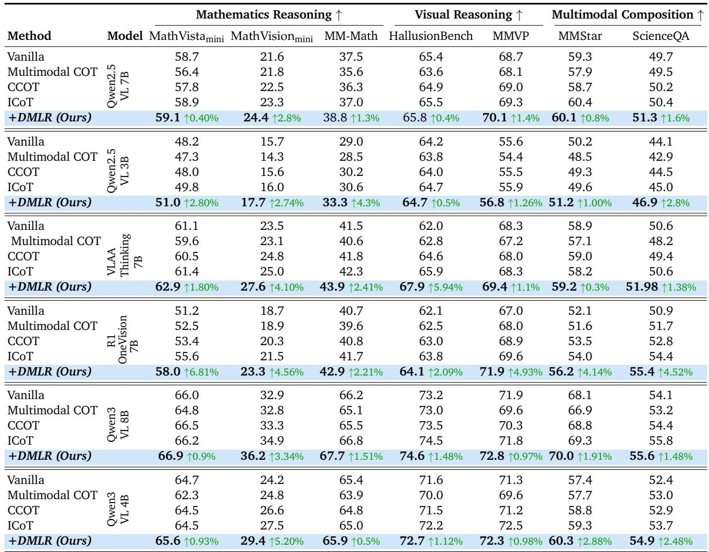
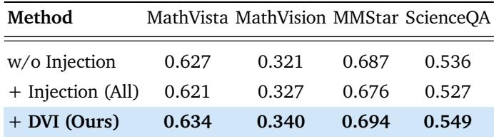
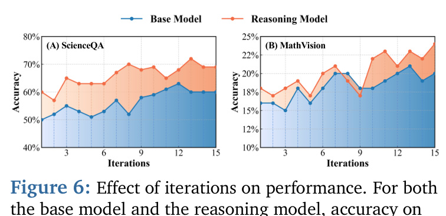
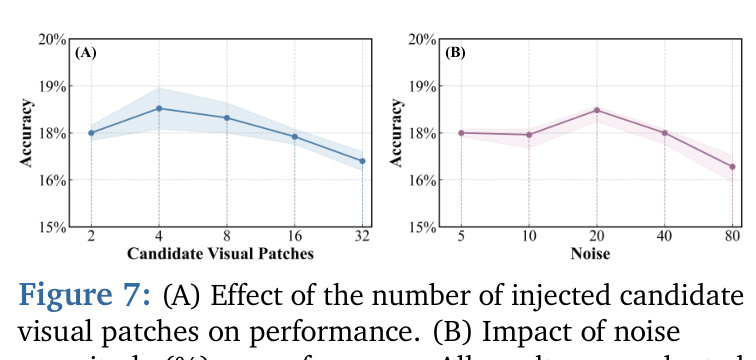
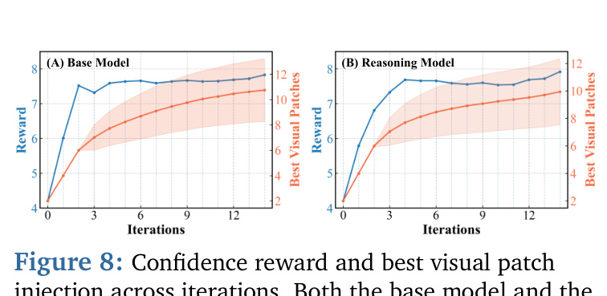
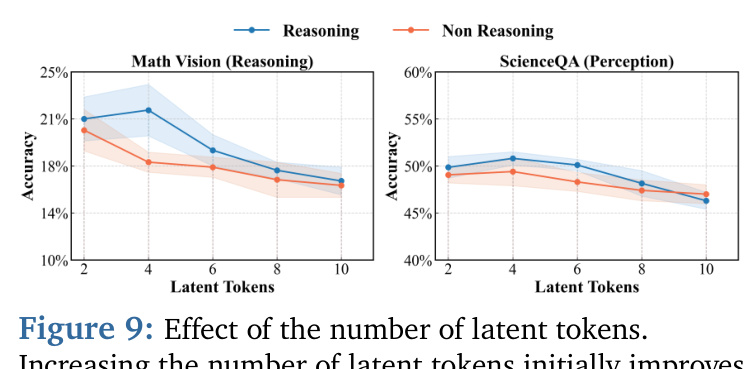
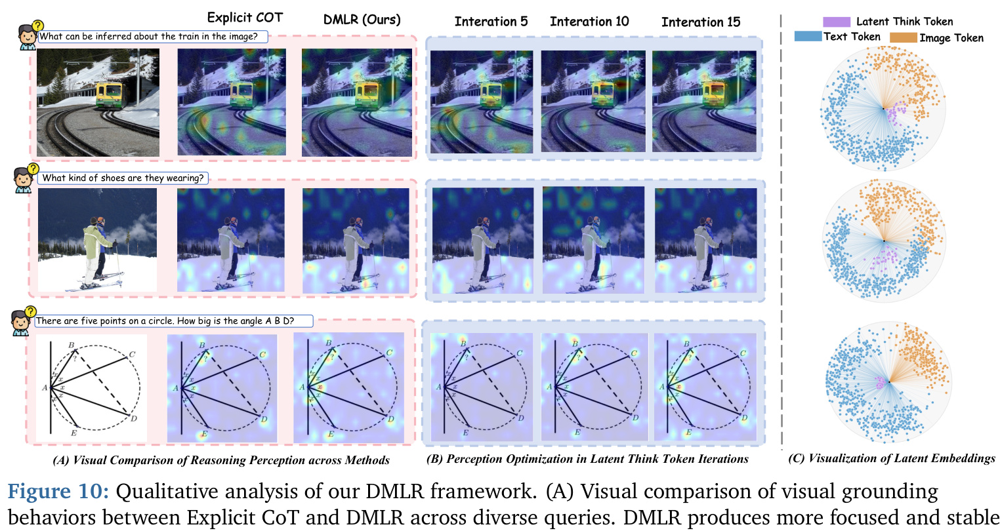
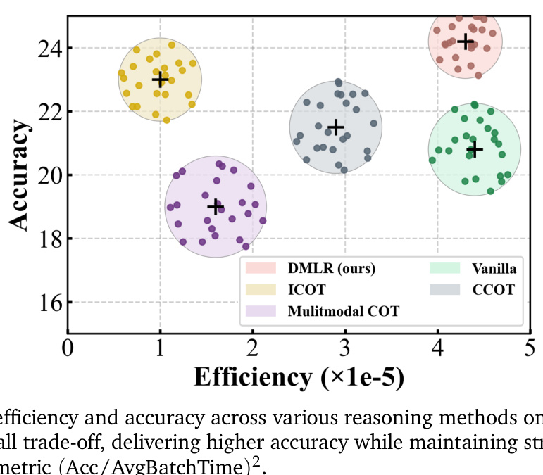

[← 返回 README](../README.md)

# 5. Experiments

## 📌 预览
这一节是 DMLR 的"门面"。结构是：
- **5.1 Setup**: 6 个 backbone × 7 个 benchmark × 4 个对照 method。
- **5.2 Main Results**: 一张大表（Table 1）一眼看出 95% 任务最优。
- **5.3 Ablation**: 视觉注入策略消融（Table 2）+ 迭代数 / noise / patch 数 / latent token 数四组超参分析（Figures 6-9）。
- **5.4 Quantitative Analysis**: 可视化注意力、t-SNE、效率对比（Figures 10-11）。

---

## 5.1 Experiment Setup

> 💡 **5.1 要点预览**: 看清三个集合——baseline、benchmark、超参——后面读结果就不会被表绕晕。

**Baselines.** We evaluate the proposed DMLR using two types of baselines: model-based and method-based. For the model baselines, we consider six representative MLLMs, including two reasoning models, R1-OneVision [48] and VLAA-Thinking [49], as well as four non-reasoning models, Qwen2.5-VL-3B/7B [42] and Qwen3-VL-4B/8B [50]. For method baselines, we consider two reasoning paradigms: Text-only Reasoning (CCoT [51]) and Vision-Text Involved Reasoning (ICoT [41], Multimodal-CoT [52]). We further include a Vanilla baseline where non-reasoning models answer directly and reasoning models use their default prompts.

> 💡 **Baseline 矩阵**:
>
> | 类别 | 名称 | 角色 |
> |---|---|---|
> | Model baseline (reasoning) | R1-OneVision, VLAA-Thinking | 已经做过 reasoning 增强的 MLLM |
> | Model baseline (non-reasoning) | Qwen2.5-VL-3B/7B, Qwen3-VL-4B/8B | 通用 MLLM，4 个 size |
> | Method baseline (text-only) | CCoT (Compositional CoT) | 纯文字 CoT |
> | Method baseline (vision+text) | ICoT, Multimodal-CoT | 交错模态推理 |
> | + Vanilla | 直接回答 | 不加 reasoning 提示的下限 |
>
> **关键**: ICoT [41] 是 DMLR 最直接的对手（同属 vision-latent injection），表里就看 DMLR 能不能稳超 ICoT。

**Evaluation Benchmarks.** We evaluate our method on three tasks across six benchmarks: (1) Mathematics Reasoning (MathVista_mini [53], MathVision_mini [54], MM-Math [55]); (2) Visual Reasoning (Hallusion-Bench [56], MMVP [24]); (3) Multimodal Composition (MMStar [57], ScienceQA [58]). Details are provided in Appendix A.1.

> 💡 **7 个 benchmark 分三类**:
> - **数学推理 (3)**: MathVista_mini, MathVision_mini, MM-Math —— 看 latent 优化对结构化推理的提升
> - **视觉推理 (2)**: HallusionBench, MMVP —— 看 DVI 对视觉接地的帮助
> - **多模态组合 (2)**: MMStar, ScienceQA —— 看综合能力
>
> 这种分法很重要：作者想证明 DMLR **不是只在某一类上有效**，而是 reasoning 和 perception 同涨。

**Implementation Details.** All frameworks adopt the eager attention mode to enable access to internal attention maps. A total of 4 latent think tokens T are used, with m = 2 visual candidate patches injected at each iteration. The default number of optimization iterations is set to 15, with a learning rate of $10^{-3}$. To ensure stable exploration in the latent space, the perturbation magnitude σ is set to 10%. All experiments are conducted on four NVIDIA H100 GPUs, with further detailed parameter analyses in Appendix A.3.

> 💡 **超参速记**: L=4 think tokens, m=2 候选 patch, T=15 迭代, lr=1e-3, σ=10%。**eager attention** 是为了能在每步读到 attention map 来做 DVI 的候选 patch 选择。

---

## 5.2 Main Results

**Overall Results.** As shown in Table 1, models integrated with DMLR achieve the best performance on over 95% of tasks. On mathematical and visual reasoning benchmarks, Qwen2.5-VL-7B achieves average improvements of +1.5% in mathematics and +0.9% in visual reasoning, while the reasoning counterpart R1-OneVision attains average gains of +4.5% and +3.45% on the two domains, respectively. These results indicate that DMLR generalizes robustly across diverse model paradigms and scales. Unlike other baseline methods that often involve trade-offs between reasoning and perception, DMLR consistently improves performance in both domains. For instance, while ICoT yields noticeable gains on mathematical tasks but provides only limited improvements on visual reasoning (e.g., MMVP), DMLR delivers more stable cross domain enhancements, with DMLR-integrated VLAA-Thinking averaging +2.43% higher across all benchmarks.

> 💡 **三句话总结 Table 1**:
> 1. **覆盖率**: 6 个 backbone × 7 个 benchmark = 42 个格子，DMLR 拿下 95%+ 的最优。
> 2. **scale 鲁棒**: 3B / 4B / 7B / 8B 全涨；reasoning 模型涨幅更大（说明 DMLR 给 reasoning 类模型加 buff 更明显）。
> 3. **跨域稳定**: ICoT 在 MMVP 这种视觉任务上没什么进步，但 DMLR 在数学和视觉**两边都涨**——这是它的差异化卖点。

*Table 1: Comparison of different reasoning methods and DMLR across various benchmarks. All metrics are reported in Accuracy (%). Results are evaluated over a diverse suite of mathematics reasoning, visual reasoning, and multimodal composition tasks under multiple backbone models.*

> 💡 **Table 1 关键数字提取**:
>
> | Backbone | DMLR 最大提升项 | 提升幅度 |
> |---|---|---|
> | Qwen2.5-VL-3B (推测) | MathVision | +2.74% |
> | Qwen2.5-VL-7B (推测) | MathVision | +2.8% |
> | R1-OneVision | HallusionBench | +5.94% |
> | VLAA-Thinking | MathVista (从 51.2→58.0) | +6.81%（最大提升） |
> | Qwen3-VL-4B (推测) | MathVision | +3.34% |
> | Qwen3-VL-8B (推测) | MathVision | +5.20% |
>
> 注意 **VLAA-Thinking 在 MathVista 上 +6.81%** 是全表最大提升——这是个被低估的 reasoning 模型在 DMLR 加持下的爆发。同时 R1-OneVision 在 HallusionBench 上 +5.94%（视觉幻觉 benchmark）也很亮眼，证明 DVI 真的在压住幻觉。

---

## 5.3 Ablation Study

### Impact of Visual Injection Strategies
We evaluate various visual injection strategies to assess their effects on reasoning performance. As shown in Table 2, removing visual injection maintains stable reasoning results but leads to a clear drop in perceptual accuracy, underscoring the necessity of visual cues during latent optimization. Injecting all visual patches enhances perception but introduces instability due to redundant visual information. In contrast, DMLR exhibits consistently more stable performance, indicating that its continuously selects more relevant and stable visual information throughout the iterative optimization.

*Table 2: Ablation on Latent Visual Injection. We compare different injection strategies across multiple benchmarks. All injects all visual patches at every iteration, while Ours injects the best visual patches.*

> 💡 **Table 2 核心结论 (3 策略对比)**:
>
> | Strategy | MathVista | MathVision | MMStar | ScienceQA |
> |---|---|---|---|---|
> | w/o Injection (纯 latent 优化) | 0.627 | 0.321 | 0.687 | 0.536 |
> | + Injection (All patches) | 0.621 | 0.327 | 0.676 | 0.527 |
> | + DVI (Ours) | **0.634** | **0.340** | **0.694** | **0.549** |
>
> - **不注入视觉** = reasoning 稳但 perception 跌
> - **全注入视觉** = 比不注入还差（噪声 + 冗余）
> - **DVI** = 选对的、不选多的，全面胜出
>
> 这张表是对 "DVI 设计有效" 的最直接证据。

---

### Impact of Iteration Number
As shown in Figure 6, increasing the number of iterations leads to a steady improvement on both reasoning and perception tasks, indicating that iterative optimization effectively enhances latent reasoning. Morever, the reasoning model maintains consistently higher accuracy throughout the process and continues to yield gains even after multiple iterations, demonstrating a stronger ability to benefit from iterative refinement.

*Figure 6: Effect of iterations on performance. For both the base model and the reasoning model, accuracy on both datasets increases as the number of iterations grows.*

> 💡 **Figure 6 批读**:
> - **(A) ScienceQA & (B) MathVision** 上 reasoning model（橙）始终高于 base model（蓝），且都随 iterations 单调上升。
> - **Reasoning 模型涨势更猛**：在 MathVision 上 base 从 ~16% 涨到 ~20%，reasoning 从 ~17% 涨到 ~24%——**有 reasoning 基础的模型从 latent 优化里榨出更多**。这跟 Section 5.2 的结论一致（R1-OneVision、VLAA-Thinking 涨幅最大）。
> - **饱和迹象不明显**：15 步还没有 plateau，理论上跑更多步还有空间，但 5.3 的 Figure 7 又警告 noise 过大会 hurt。

### Impact of Noise Scale
We further analyze the influence of the perturbation magnitude σ on latent optimization. As shown in Figure 7(b), increasing the initial noise scale promotes effective exploration, allowing the model to cover a wider range of latent trajectories and identify higher-confidence reasoning paths. However, when σ becomes excessively large, the injected perturbation makes the updates unstable, leading to a subsequent drop in performance. This indicates that latent reasoning benefits from only a modest level of perturbation.

### Impact of Visual Patch Number
As shown in Figure 7(a), performance improves when a moderate number of candidate visual patches are injected, whereas injecting an excessive number of patches leads to a clear decline. This trend indicates that a limited number of candidates is sufficient for effective updates, while excessive patches introduce redundant visual information that negatively affect optimization. Furthermore, Figure 8 shows that as the iterations progress, the reward steadily increases and the selected best patch becomes increasingly stable, exhibiting a clear convergence trend. This trend indicates that the dynamic injection strategy does not continually introduce additional visual patches into the latent space, but instead converges toward a small set of highly relevant patches during optimization.

*Figure 7: (A) Effect of the number of injected candidate visual patches on performance. (B) Impact of noise magnitude (%) on performance. All results are evaluated on the MathVision dataset.*

*Figure 8: Confidence reward and best visual patch injection across iterations. Both the base model and the reasoning model exhibit a clear positive correlation.*

> 💡 **Figure 7 & 8 联读**:
> - **Figure 7(A)**: patch 数 m 是典型的"凸"曲线——太少视觉不够，太多噪声主导。最优 m≈2（论文默认值）。
> - **Figure 7(B)**: noise σ 也是凸曲线——太小没探索，太大破坏 latent 结构。最优 σ≈10%。
> - **Figure 8**: 关键看 reward (左轴) 跟 patch (右轴) **同步上升后趋稳**，说明 DVI 的"逐步精化、最终收敛到稳定集合"的设计在实证上真的成立。

### Number of Latent Think Tokens
We further evaluate the impact of the number of latent think tokens on overall performance. As shown in Figure 9, setting the number of latent tokens to a small range (2–4) yields stable improvements on both reasoning and perception tasks. However, as the number of tokens continues to increase, performance on both tasks begins to decline, with the reasoning model exhibiting more pronounced fluctuations. This overall trend indicates that increasing the number of latent tokens beyond a moderate level does not provide additional benefits and instead makes the optimization process less stable.

*Figure 9: Effect of the number of latent tokens. Increasing the number of latent tokens initially improves performance, but excessive tokens lead to noticeable degradation.*

> 💡 **Figure 9 批读 + 思考**:
> - **L=2~4 是甜区**；L 太大反而 hurt。
> - **为什么？** 直觉是：L 越大，REINFORCE 估计的方差越大（每个 latent 位置都在采样扰动），优化信号被稀释；同时也增加每步 forward 的计算量。
> - **暗示**：DMLR 不是"塞越多 latent 越好"的方法，它的优雅在于 **少而精**——4 个 latent token 就够了，这远少于 CoCoNut [14] 训练阶段的 latent 长度。

---

## 5.4 Quantitative Analysis

### Visual Grounding Analysis
We visualize the attention heatmaps of VLAA-Thinking during the reasoning process. As shown in Figure 10(a), the explicit CoT baseline often shifts its attention toward task-irrelevant regions, whereas DMLR maintains a stable focus on task-relevant areas. This demonstrates that latent multimodal reasoning produces more consistent and reliable visual grounding throughout the reasoning process. Figure 10(b) further shows the evolution of attention across iterations. The attention distribution gradually converges toward task-relevant regions in models integrated with DMLR, reflecting a more stable and consistent focus throughout the optimization.

*Figure 10: Qualitative analysis of our DMLR framework. (A) Visual comparison of visual grounding behaviors between Explicit CoT and DMLR across diverse queries. DMLR produces more focused and stable visual grounding than explicit CoT. (B) Perception optimization across latent think token iterations, where visual attention becomes progressively sharper and better aligned with relevant regions. (C) Visualization of latent embeddings showing the geometric separation of latent think tokens, text tokens, and image tokens, illustrating the structured organization of the latent reasoning space.*

> 💡 **Figure 10 三个 panel 怎么看**:
> - **(A) 单次 grounding 对比**: 三个问题（关于火车、鞋子、五角星角度），左边 Explicit CoT 的 attention 散乱，右边 DMLR 的 attention 集中在正确区域（火车细节、鞋子、几何点）。
> - **(B) 跨迭代 grounding 演化**: 从 Iter 5→10→15，DMLR 的注意力**越来越聚焦**到任务相关位置——直观地展示 Eq.10 的 reward-gated patch 选择在做 attention 精化。
> - **(C) t-SNE**: 三种 token（latent think、text、image）形成**三簇分离**且 latent 簇紧密。说明优化让 latent 落到了 text 和 image 中间的稳定 manifold，**形成 modality-independent 的语义表征**。

### Latent Behavior Analysis
We visualize the final distributions of latent think tokens, text tokens, and image tokens using t-SNE [59] to analyze the effect of the iterative optimization on the latent reasoning. As shown in Figure 10(c), the latent think tokens form a tight cluster that is well separated from both text and visual embeddings, and are located in a stable intermediate region between the two modalities. This distribution suggests that the optimized latent tokens become modality-independent, forming a unified cross-modal semantic representation. The compactness of the cluster further indicates that the optimization process yields more stable and consistent latent reasoning states.

> 💡 **t-SNE 的故事**: latent think tokens 经过优化后聚成紧密簇 + 位于 text/image 簇之间。这意味着 latent token 学到了**跨模态的桥梁**——既不是纯文字也不是纯图像，是某种"概念中介"。这是个相对意外的发现，因为初始化时 latent token 完全是随机扰动，没人监督它落在哪里；最终自发形成 modality-bridging representation。

### Inference Efficiency Analysis
As shown in Figure 11, different reasoning paradigms exhibit distinct tradeoffs between accuracy and efficiency. The explicit methods such as Multimodal CoT rely on long-chain text generation, incurring substantial computational overhead. Although ICoT enhances reasoning to some extent, it injects a large volume of visual information during decoding, which significantly slows inference. In contrast, DMLR performs optimization entirely within the latent space, introducing no additional sequence generation cost. Moreover, its dynamic visual injection strategy selects only the relevant visual patches to the current latent state at each iteration, eliminating redundant visual computation. By preserving accuracy gains while reducing inference overhead, DMLR achieves a more favorable balance between efficiency and performance.

*Figure 11: Comparison of efficiency and accuracy across various reasoning methods on the MathVision Benchmark. DMLR achieves the best overall trade-off, delivering higher accuracy while maintaining strong inference efficiency. The x-axis reports the efficiency metric (Acc/AvgBatchTime)².*

> 💡 **Figure 11 批读**:
> - 横轴是 efficiency (Acc / AvgBatchTime)²（值越大越快越好），纵轴 Accuracy（越高越好）。
> - **DMLR (红)** 在右上角——**又快又准**。
> - **ICoT (黄)** 准但慢——因为要在 decode 阶段塞视觉 token，序列变长。
> - **Vanilla (绿)** 快但准度低。
> - **Multimodal CoT (紫)** 又慢又不准——文字 CoT 长链且没有视觉增强。
> - DMLR 的高 efficiency 来自 **decode 长度不变**：latent 优化是 inference 之前的"预热"，不会让最终生成更长。

---

## 🔖 Section 总结

### 关键数字速查
| 指标 | 数值 |
|---|---|
| 总评测格子 | 6 backbones × 7 benchmarks = 42 |
| DMLR 拿下最优比例 | >95% |
| VLAA-Thinking 在 MathVista 提升 | +6.81%（最大单项） |
| R1-OneVision 平均数学提升 | +4.5% |
| R1-OneVision 平均视觉提升 | +3.45% |
| 最优 patch 数 m | 2 |
| 最优 noise σ | 10% |
| 最优 latent token 数 L | 4 |
| 最优迭代数 T | 15 |

### 核心洞察
1. **Reasoning 与 Perception 不再 trade-off**: 这是 DMLR 区别于 ICoT 等方法的最大卖点。
2. **Reasoning 类 backbone 受益最大**: 暗示 DMLR 跟显式 CoT 训练有协同效应。
3. **DVI 的 reward-gated accept 确实优于"全注入"**: Table 2 直接证据。
4. **超参都呈凸性**: L、m、σ 都有"甜区"，过犹不及。
5. **效率优势来自 decode 长度不变**: 这是把 reasoning 推到 latent 空间的根本好处。
