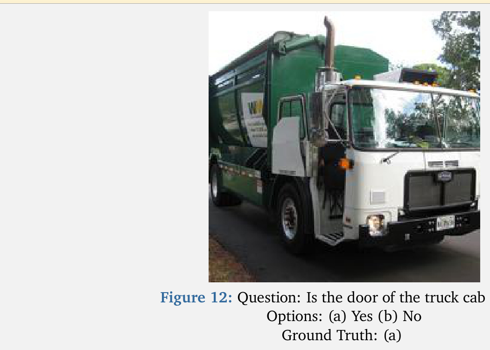
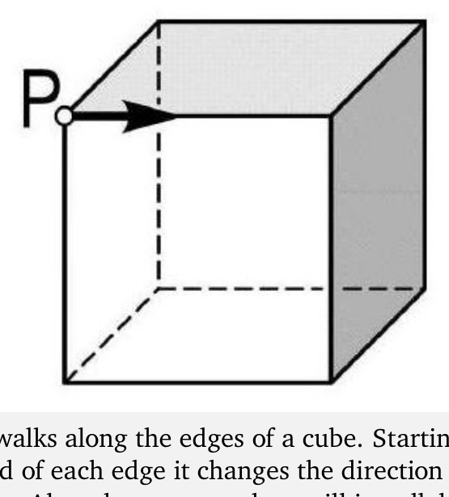

[← 返回 README](../README.md)

# Appendix

## 📌 预览
Appendix 三个内容：
- **A.1**: 7 个评测数据集的简介
- **A.2**: prompting 协议（system prompt + task prompt）
- **A.3**: 完整超参数
- **B**: 两个 Case Study（卡车门是否开 + 甲虫沿立方体行走）

---

## A. More Detailed about Evaluation

### A.1 Datasets

**MathVista_mini** is a benchmark for mathematical reasoning in visual contexts, aggregating diverse multimodal math tasks that require fine-grained visual understanding and compositional numerical reasoning.

**MathVision_mini** is a curated benchmark of competition-level visual math problems spanning multiple disciplines and difficulty levels to assess multimodal models' mathematical reasoning under challenging and diverse settings.

▶ **MM-Math** is a benchmark of open-ended math problems with visual contexts that supports both outcome and process evaluation, enabling detailed analysis of multimodal reasoning behaviors and typical error patterns.

▶ **HallusionBench** is a benchmark for image-context reasoning that uses carefully structured question pairs to diagnose hallucination, visual illusion, and logical inconsistency in large vision-language models.

**MMVP** is a benchmark built from multimodal visual patterns designed to expose "CLIP-blind" image–text pairs, revealing systematic visual perception failures and hallucinated explanations in multimodal LLMs.

> **MMStar** is a vision-indispensable multimodal benchmark composed of carefully human-filtered samples that ensure true visual dependency while evaluating core multimodal capabilities along multiple finegrained axes.

**ScienceQA** is a multimodal multiple-choice science benchmark with rich textual and visual contexts, lectures, and explanations that spans diverse subjects and skills, supporting evaluation of both answer accuracy and explanation quality.

For all datasets, we limit the maximum sample size to 1000 instances.

> 💡 **数据集分类**:
> | 类别 | Benchmark | 测什么 |
> |---|---|---|
> | 数学推理 | MathVista_mini, MathVision_mini, MM-Math | 复杂数学 + 视觉理解 |
> | 视觉接地 | HallusionBench, MMVP | 幻觉、CLIP-blind 视觉失败模式 |
> | 综合 | MMStar, ScienceQA | 真正需要视觉 + 多学科 |
>
> **MMVP 特别值得关注**: 它专门挖那些 CLIP 编码相似但视觉细节关键不同的样本——是 DVI 应该最受益的场景。

---

### A.2 Evaluation Setting
We adopt a unified prompting setup for all models. Unless otherwise stated, we use greedy decoding (do_sample=False) for all generation tasks.

**System Prompt.**
> A conversation between User and Assistant. The user asks a question, and the Assistant solves it. The assistant first thinks about the reasoning process in the mind and then provides the user with the answer. The reasoning process and answer are enclosed within `<think> </think>` and `<answer> </answer>` tags, respectively, i.e., `<think> reasoning process here </think> <answer> answer here </answer>`.

**Task Prompt.**
> Please analyze the image carefully and solve this problem step by step. Show your reasoning process clearly, then put your final answer within \boxed{}.
>
> Question: [Problem Text]

For all benchmarks considered in our experiments, the ground-truth answers are verifiable; we use regular expressions to extract the content within \boxed{} from the model outputs and then match it against the correct answers.

> 💡 **Prompt 协议要点**:
> - 用 `<think>...</think><answer>...</answer>` 结构化标签（R1 风格）
> - `\boxed{}` 包裹最终答案——便于正则提取
> - greedy decoding（do_sample=False）——所有方法都用相同的解码策略保证可比性
> - 注意 DMLR 不改 prompt，**所有的"动态"都发生在 latent 内部**，所以跟 baseline 的 prompt 设置完全对等

---

### A.3 Parameters Setup

▶ **Latent Think Tokens T**: We set the number of latent think tokens to 4. During generation, after each latent token the model dynamically injects a visual patch into the latent stream to refresh its internal perception state.

**Image Patches m**: We dynamically insert visual patches into the latent stream. At initialization, we inject 2 patches; at each subsequent iteration, we select m = 2 patches with the highest attention scores and append them after each latent think token, with at most 16 patches inserted per iteration. Additionally, we set the image processor's max pixel size to 256 for all inputs.

▶ **Optimization Parameters**: We perform 15 latent optimization steps with a learning rate of $1 \times 10^{-3}$. To ensure stable exploration in the latent space, the perturbation magnitude is set to σ = 0.1 (10%) with a decay factor of 0.95, and we fix the random seed to 42 for all experiments.

**Environment Setup**: All experiments are conducted on NVIDIA H100 GPUs. For a fair comparison, we run all baselines and our method in float32 precision and use the eager attention backend for inference.

> 💡 **超参一张表**:
> | 参数 | 值 | 备注 |
> |---|---|---|
> | L (latent think tokens) | 4 | Figure 9 验证的甜区 |
> | m (候选 patch 数) | 2 | 每迭代选 2 个最高 attention patch |
> | max patches / iter | 16 | 累积上限，防止失控 |
> | image processor max pixel | 256 | 输入图像压到 256 |
> | T (迭代数) | 15 | Figure 6 显示还没饱和 |
> | η (学习率) | 1e-3 | — |
> | σ (扰动) | 0.1 (10%) | decay 0.95 / iter |
> | random seed | 42 | — |
> | precision | float32 | fp32 全程，保证 fair |
> | attention | eager | 为了能读 attention map 做 patch selection |

---

## B. Case Study

In this section, we provide qualitative examples to illustrate the behavior of the DMLR-enhanced model across different task settings. As shown in the following example, the model demonstrates more reliable and fine-grained visual perception, supported by stable and semantically coherent internal representations. In reasoning scenarios, the model produces accurate and well-structured logical steps. Importantly, the dynamic latent reasoning mechanism suppresses unnecessary expansions, resulting in concise and taskfocused reasoning chains rather than overly long or speculative explanations. Taken together, these examples highlight that DMLR simultaneously strengthens perceptual quality and reasoning reliability, while ensuring that the generated reasoning remains efficient and free from redundant elaboration.

### Perception Example

*Figure 12: Question: Is the door of the truck cab open? Options: (a) Yes (b) No  Ground Truth: (a)*

**Qwen2.5-VL-7B-Instruct + DMLR**:
> The image shows a garbage truck with its door on the side of the cab open. This is evident from the visible interior and the fact that the door is not aligned with the rest of the vehicle's structure, indicating it has been opened. The answer is **a**.

**Qwen2.5-VL-7B-Instruct (baseline)**:
> To determine if the door of the truck cab is open, let's analyze the image step by step:
>
> 1. Observe the side of the truck where the door would be located.
> 2. Look for any visible gap or opening that would indicate the door is not closed.
> 3. Check the overall appearance of the door; if it is open, there should be a noticeable gap or difference in the alignment compared to when it is closed.
>
> Upon examining the image:
> - The door appears to be aligned with the rest of the truck's body.
> - ▶ There is no visible gap or difference in the alignment that would suggest the door is open.
>
> Based on this analysis, the door of the truck cab does not appear to be open.
>
> `<think> The door of the truck cab is not open.</think> <answer> No</answer>`

> 💡 **Case 1 批读 (感知任务)**:
> - **GT = (a) Yes**（卡车驾驶室门**是**开的）。
> - **Baseline**: 走了一个看似合理的"3-step checklist"，但 step 2、3 都给出了**错误的视觉判断**——结论 No，**答错**。这是典型的 "explicit CoT 的 attention 漂移" 现象——一旦开始文字推理，模型其实没真正看图，而是在"假装看图"。
> - **DMLR**: 直接、简短地说"door is open, the answer is a"——**答对**。原因是 latent 优化阶段已经把 attention 引到了车门区域，decode 时 confidence 高，不需要冗长的 self-doubt。
> - 这正是 Section 5.4 Figure 10(A) attention heatmap 故事的具体案例。

---

### Reasoning Example

*Figure 13: Question: A beetle walks along the edges of a cube. Starting from point P it first moves in the direction shown. At the end of each edge it changes the direction in which it turns, turning first right then left, then right etc. Along how many edges will it walk before it returns to point P? Ground Truth: 6*

**Qwen2.5-VL-7B-Instruct + DMLR**:
> The beetle starts at point P and moves along the edges of a cube, changing direction according to the pattern: right, left, right. To determine how many edges it will walk before returning to point P, we need to trace its path.
>
> 1. The beetle starts at P.
> 2. It moves right to an adjacent vertex.
> 3. It turns left to another adjacent vertex.
> 4. It turns right again to reach a third adjacent vertex.
> 5. It continues this pattern until it returns to P.
>
> By examining the cube's structure, we can see that after 6 edges, the beetle will return to point P because each face of the cube has 4 edges, and the beetle covers all edges of one face before repeating the pattern on the next face.
>
> Thus, the beetle will walk along **6** edges before returning to point P.

**Qwen2.5-VL-7B-Instruct (baseline)**:
> To solve this problem, we need to track the beetle's path as it moves along the edges of the cube, changing its direction according to the specified pattern (right, left, right, etc.).
>
> 1. Initial Position and Direction: The beetle starts at point P and moves in the direction indicated by the arrow, which is along one edge of the cube.
> 2. First Edge: The beetle moves along the first edge and changes direction to the right.
> 3. Second Edge: Moving right, the beetle now faces a new direction and continues along the next edge.
> 4. Third Edge: After moving along the second edge, the beetle changes direction again to the left.
> 5. Fourth Edge: Moving left, the beetle now faces another new direction and continues along the next edge.
> 6. Fifth Edge: After moving along the third edge, the beetle changes direction to the right again.
> 7. Sixth Edge: Moving right, the beetle now faces yet another new direction and continues along the next edge.
> 8. Seventh Edge: After moving along the fourth edge, the beetle changes direction to the left once more.
> 9. Eighth Edge: Moving left, the beetle now faces a new direction and continues along the next edge.
>
> At this point, the beetle has completed a full cycle around the cube, returning to point P.
> The beetle will have walked along 8 edges before it returns to point P. The answer is **8**.

> 💡 **Case 2 批读 (推理任务)**:
> - **GT = 6**。
> - **Baseline**: 列了 9 步流水账，每一步都在重复"右-左-右"模式但**没有真正用立方体的几何结构**做约束 → 答 8（错）。这是典型的 "explicit CoT 越长越离题"。
> - **DMLR**: 5 步简洁推理 + 用 "each face of the cube has 4 edges" 这种几何约束做 sanity check → 答 6（对）。
> - **关键洞察**: 论文宣称 DMLR "suppresses unnecessary expansions, resulting in concise and task-focused reasoning chains"——这个 case 就是直接例证：**DMLR 让推理更短更准**，而不是更长更对。这跟 [22] "More Thinking, Less Seeing" 那篇引用呼应：长推理链反而可能让模型偏离视觉证据。

---

## 🔖 Appendix 总结

### 总结一张表
| Appendix 部分 | 你应该带走的关键信息 |
|---|---|
| A.1 数据集 | 7 个 benchmark 覆盖数学/视觉/综合三类，max 1000 sample/dataset |
| A.2 Prompt | 统一 `<think>/<answer>` + `\boxed{}`，greedy decoding，所有 method 共用 |
| A.3 超参 | L=4, m=2, T=15, η=1e-3, σ=10% decay 0.95, fp32, eager attention |
| B Case Study | DMLR 让回答**变短变准**，baseline 在感知和推理上都因为"过度文字 CoT"翻车 |

### 重要的复现细节
- random seed = 42（论文有给）
- fp32 + eager attention 是必需的，因为 DVI 需要读 attention map
- max patches per iter = 16 是个安全阀，避免迭代后期 best patch 集合爆炸
- σ 有 0.95 decay schedule，论文正文里没强调但 Appendix 给了
