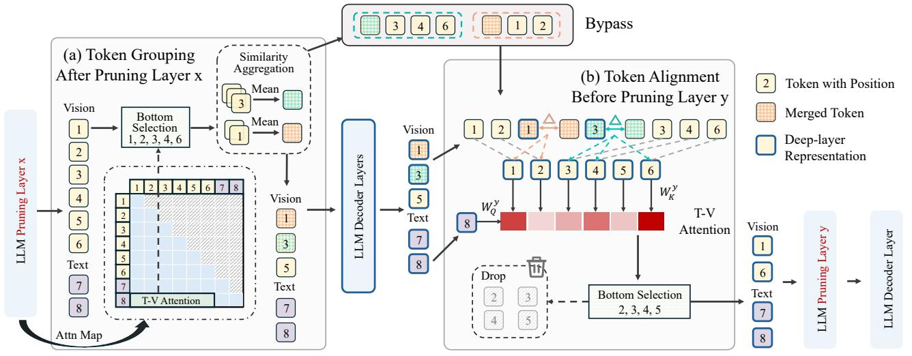

# 3. Method

> 来源: SwiftVLM (Arxiv 2403.12178)

---

## 📄 原文

> 💡 **Section 概览**: 剪枝层选择 (DP) → Bypass 架构 → 表示对齐分析

---

### 3.2 Pruning Layer Selection (动态规划)

目标：从 L 层中选 m 个剪枝层，使得整体性能最大化。

1. 先在 vanilla 模型上逐层测试 selection 能力 → 得到性能序列 {x_i}
2. 要求选出的层的 selection 能力单调递增
3. 用 DP 求解最优层组合，目标函数：

$$P(s) = \frac{\sum_{k=0}^{K} x_{i_k}(i_{k+1} - i_k)}{L-2}$$

> 💡 **批注**: 
> ```
> LLaVA-1.5-7B 的结果: 选出 Layer 3, 11, 15
>   Layer 3:  第一次初步筛选
>   Layer 11: 中间层，selection 能力最强
>   Layer 15: 最终精选
>
> 实验用 6 个 dataset 各 1000 samples 做 layer selection
> → 跨 dataset 归一化后平均 → 固定用于测试
> ```

---

### 3.3 Architecture: Bypass 机制


*Figure 5: SwiftVLM 架构。(a) Layer x 后未选中 token 分组 bypass (b) Layer y 前通过 token alignment 恢复并重新评估*

> 💡 **Figure 5 批读**:
> ```
> Layer x (第一个剪枝层, e.g., Layer 3):
>   ├── Top tokens → 直接前进到 Layer 4
>   └── Bottom tokens:
>       ├── 按 cosine similarity 分组
>       ├── 每组合并成一个 merged token → 参与后续计算
>       └── 原始 token 保留 → bypass 到 Layer y
>
> Layer y (第二个剪枝层, e.g., Layer 15):
>   ├── 计算 merged token 从 Layer x 到 y 的偏移量 Δh
>   ├── 用 Δh 校正 bypassed tokens → token alignment
>   └── 重新用 T-V attention 评估所有 token → 最终选择
> ```

#### Token Alignment (核心创新)

bypass 的 token 在 Layer x 时的表示已经"过时"了（其他 token 都经过了多层变换）。需要对齐：

$$\hat{h}_i^{y-1} = h_i^x + \Delta h_{gm}$$

其中 $\Delta h_{gm} = \tilde{h}_{gm}^{y-1} - \tilde{h}_{gm}^x$ 是 merged token 的变化量。

> 💡 **批注**:
> ```
> 直觉: 
>   merged token 走了 x→y 这段路，积累了 Δh
>   bypassed token 没走这段路，但它和 merged token 语义相近
>   → 用 merged token 的 Δh 来近似更新 bypassed token
>
> 为什么合理?
>   1. Transformer 是残差连接 → h^ℓ = h^(ℓ-1) + F(h^(ℓ-1))
>   2. 同组 token 语义相近 → 变换方向也相近
>   3. 实验验证: t-SNE 显示 Δh_gm ≈ Δh_g (vanilla group mean)
> ```

---

### 3.5 FLOPs Computation

额外开销很小：

$$F_o = 2RZd + Rd + 2n_vd + 2d^2 + 2(1-r)n_vd^2$$

> 💡 **批注**: 主要开销是重新计算 K 投影和 attention（用于第二次 token selection）。但因为只用 last text token 做 query，开销很低。

---

## 💡 Section 总结

### 方法对比（完整版）
| 特性 | FastV | PDrop | SparseVLM | SwiftVLM |
|------|-------|-------|-----------|----------|
| 剪枝位置 | Layer 2 | 分 stage | 每层自适应 | DP 选层 |
| 被剪 token | 丢弃 | 丢弃 | 回收压缩 | **bypass + 重新评估** |
| 剪枝决策 | 一次性 | 渐进式 | 每层独立 | **跨层独立** |
| 细粒度任务 | 差 | 差 | 差 | **好** |
| FlashAttn 兼容 | ✅ | ✅ | ⚠️ | ✅ |
| 训练加速 | ❌ | ✅ | ❌ | ❌ |

### 核心洞察
1. **Bypass 是新范式** — 不是 merge 也不是 drop，而是"暂存 + 重新评估"
2. **Token alignment 是关键** — 用 merged token 的变化量近似更新 bypassed token
3. **DP 选层** — 比固定分 stage 或每层剪枝更精准
