[← 返回 README](../README.md)

# 3. Method

## 📌 预览
Method 分为 5 个子节：(3.1) VLM 中的注意力机制基础，(3.2) 用 DP 选择最优剪枝层，(3.3) SwiftVLM 的 bypass 架构，(3.4) 表示对齐的理论分析，(3.5) FLOPs 计算。

---

## 3.1. Preliminary: Attention in VLMs

> 💡 **3.1 要点预览**: 定义符号和 VLM 中的注意力机制，特别是如何用最后一个 text token 的 attention 来评估 visual token 重要性。

Let $L$ denote the total number of tokens participating in computation. Let $h \in \mathbb{R}^{L \times d}$ denote the hidden states of all tokens. The query and key matrices are obtained via linear projections,

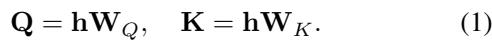

A single-head attention matrix $A \in \mathbb{R}^{L \times L}$ in a VLM is then defined as

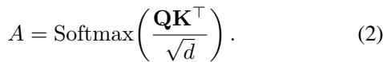

VLMs adopt causal attention, under which each token is restricted to attending only to preceding tokens. As a result, the last text token attends to all input tokens. In practice, we extract its attention scores as the cross-modal component to evaluate the importance of visual tokens. Note that positional information is preserved during the pruning process.

> 💡 **3.1 批注**:
> - VLM 使用 causal attention → 最后一个 text token 能看到所有前面的 token（包括所有 visual token）
> - 因此，最后一个 text token 对 visual token 的 attention 分数 = T-V attention = visual token 重要性的度量
> - 这是 FastV、PDrop 等方法的共同基础，SwiftVLM 也沿用

---

## 3.2. Pruning Layer Selection

> 💡 **3.2 要点预览**: 如何确定在哪些层执行剪枝？通过实验评估每层的 token 选择能力，然后用动态规划选择最优层组合。

In this section, we focus on how to accurately select pruning layers with high discriminative capability. Note that we exclude the first two layers from our analysis, as these layers exhibit distinct characteristics compared to other layers (Lad et al., 2024; Kang et al., 2025).

> 💡 **排除前两层**: 前两层的行为与其他层不同（已有文献支持），因此从第 3 层开始考虑。

---

For a model with $L$ layers, we first record the top $V\%$ visual tokens selected by T–V attention at each layer using the vanilla model. Keeping the text and image inputs unchanged, we then re-evaluate the model by retaining all tokens in the first two layers and only the layer-specific top $V\%$ visual tokens from the third layer onward, producing a layer-wise performance profile. This performance sequence reflects the ability of each layer to identify task-relevant visual tokens. We formulate this as:

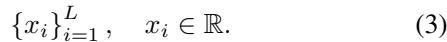

> 💡 **评估协议**:
> 1. 用原始模型记录每层 top V% 的 visual token 索引
> 2. 重新跑模型：前两层保留所有 token，第 3 层起只保留该层的 top V%
> 3. 得到每层的性能分数序列 {x_i}
> 4. x_i 越高 → 该层越能选出真正重要的 token

---

Intuitively, the progressively selected pruning layers should exhibit monotonically increasing performance in this sequence. Let the maximum performance before layer $i$ be denoted as:

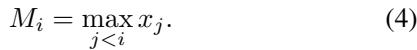

Based on the condition $x_i > M_i$, we can identify multiple candidate sets $S$ of pruning layers.

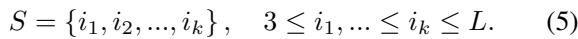

Ideally, model performance can be expressed as a function of the selected pruning layers.

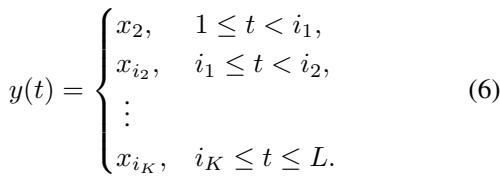

> 💡 **直觉**: 剪枝层序列应该"越选越好"——即选择能力单调递增。公式 6 描述了分段常数的性能模型：在不同剪枝层之间，性能由该段起始剪枝层决定。

---

As the impact of visual token selection propagates through subsequent layers, we reformulate layer selection as an optimization problem that maximizes the overall layer contribution under a fixed budget of $m$ pruning layers.

Let $i_{K+1} = L, i_0 = 2$. Then the model performance is formulated as:

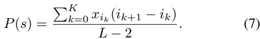

Let $U(s)$ denote the integral in the numerator. If the previous update occurs at layer $i_{k-1}$ and the next at layer $j$, then the marginal area contribution of current update $i$ is:

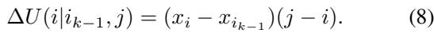

> 💡 **优化目标**: 最大化性能函数 P(s) = 加权平均性能。每层的"贡献"取决于它的性能 x_i 和它"管辖"的层数（到下一个剪枝层的距离）。这本质上是一个**面积最大化**问题。

---

This constitutes a dynamic programming problem. Consider the last update: it can occur either at the current layer $i$ or at a later layer $j$. The necessary and sufficient condition for $j$ to be preferable to $i$ is:

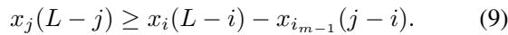

This establishes the state transition equation. The optimal solution, and therefore the optimal pruning layers, follows directly.

> 💡 **DP 状态转移**: 比较在 layer i 和 layer j 剪枝的收益。公式 9 给出 j 优于 i 的充要条件。标准的 DP 可以高效求解。

---

As shown in Fig.4, we conduct layer selection experiments using LLaVA-1.5-7B on three localization datasets (RefCOCO, RefCOCO+, RefCOCOg) and three non-localization datasets (TextVQA, GQA, V2-VQA). From the training split of each dataset, 1,000 instances are randomly sampled for evaluation.

Despite dataset-specific variations, consistent patterns can still be observed across datasets. In particular, early layers exhibit noticeable fluctuations, and performance consistently peaks around layer 15, suggesting shared characteristics in layer-wise token discriminability.

Performance metrics are first normalized across all datasets and then averaged to obtain $\{x_i\}_{i=1}^{L}$. Following the above layer selection protocol, layers 3, 11, and 15 are selected as pruning layers.

> 💡 **实验结果**: 对 LLaVA-1.5-7B，DP 选出的最优剪枝层是 **3, 11, 15**。这些层跨数据集一致地具有较强的 token 判别能力。

> 💡 **3.2 小结**:
> - 输入：每层的 token 选择性能分数
> - 方法：DP 求解面积最大化
> - 输出：最优剪枝层集合（如 {3, 11, 15}）
> - 关键约束：选择能力单调递增

---

## 3.3. Architecture

> 💡 **3.3 要点预览**: SwiftVLM 的具体架构——在剪枝层 x 和 y 分别执行操作，核心是 bypass + token alignment。

For each model, we first select a set of pruning layers, denoted as layers $x$ and $y$ in Fig.5.

The first pruning operation is performed after layer $x$. Based on the attention map produced by layer $x$, we extract the T–V attention scores between the last text token and all visual tokens. The top-ranked visual tokens are retained and directly propagated to layer $x + 1$ for further inference. The remaining low-ranked visual tokens are grouped according to the similarity between their hidden states, measured by

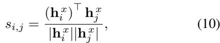

where $h_i$ and $h_j$ denote the hidden states of visual tokens i and $j$, respectively. Visual tokens within the same group are then merged by averaging their hidden states across feature dimensions, yielding a single merged token

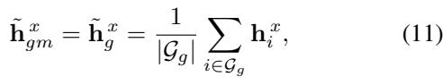

which participates in the computation of layer $x + 1$.

> 💡 **第一阶段（Layer x 之后）**:
> 1. 提取 T-V attention → 排序 visual token
> 2. **Top-ranked**: 直接保留，参与后续推理
> 3. **Low-ranked**: 按 cosine similarity 分组 → 组内平均合并为 1 个 merged token
> 4. Merged token 作为"代理"参与 layer x+1 到 y-1 的计算
> 5. 原始低排名 token 被保留在 bypass pathway 中（不参与计算但不丢弃）

---

Here, we propose a new pruning strategy termed bypass. Instead of permanently discarding unselected visual tokens, bypass preserves these tokens and forwards them through a side pathway to the next pruning layer, where they re-participate in the pruning selection process.

---

*Figure 5. SwiftVLM architecture overview. (a) After layer x, unselected visual tokens are grouped for bypassing, with the resulting merged tokens participating in subsequent computation. (b) Before layer y, token alignment is applied to restore grouped tokens, enabling re-evaluation of visual tokens at layers with stronger token selection capability.*

> 💡 **Figure 5 批读**:
> - **(a) Layer x 之后**: 低排名 token 分组并合并；合并 token 参与后续计算；原始 token bypass 保存
> - **(b) Layer y 之前**: 用 merged token 的 offset 校正 bypass token → 重新排序 → 第二次选择
> - 整体流程：**两次筛选，每次独立决策**

---

Before the pruning layer $y$, we re-evaluate the importance of all visual tokens. For each group formed by merged tokens, we estimate the average offset of the group as

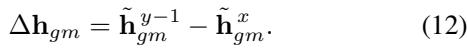

To align the visual tokens transmitted through the bypass pathway with the deeper representations of other tokens, we correct each visual token in group $g$ as follows:

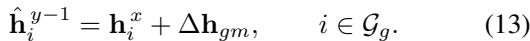

> 💡 **Token Alignment 核心公式**:
> - Eq.12: 计算 merged token 从 layer x 到 layer y-1 的 hidden state 变化量 Δh_gm
> - Eq.13: 用这个变化量来校正每个 bypass token：校正后 = 原始 + 变化量
> - **假设**: 同组内的 token 经历相似的表示变化 → 用平均变化量近似个体变化量
> - 这个假设在 3.4 节有理论分析和实验验证

---

Using the aligned visual tokens and the key projection matrix $W_K^y$ of pruning layer $y$, we construct the key representations. The query is obtained by projecting the last text token from layer $y - 1$ with $W_Q^y$. We then compute the T–V attention and perform visual token selection once again. At this stage, only the selected important visual tokens are retained to participate in the subsequent prefill computation.

> 💡 **第二阶段（Layer y）**:
> 1. 校正后的 bypass token + 保留的 top token → 全部 visual token 重新评估
> 2. 用 layer y 的 Q/K 投影计算 T-V attention
> 3. 只保留最终选中的 token 参与后续计算
> 4. 此时剪枝是最终的——不再有 bypass

---

## 3.4. Representation Alignment Analysis

> 💡 **3.4 要点预览**: 理论分析为什么 merged token 的 offset 能近似原始 token 的变化。

Transformer (Vaswani et al., 2017) layers adopt a residual formulation, where the hidden states are updated as

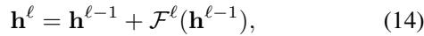

with $\mathcal{F}^\ell(\cdot)$ denoting the combined attention and feedforward transformation at layer $\ell$.

For a visual token $i$ belonging to group $\mathcal{G}_g$, its hidden state in the vanilla model evolves from layer $x + 1$ to layer $y - 1$ as

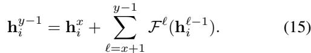

Taking the average over all tokens in group $\mathcal{G}_g$, we obtain

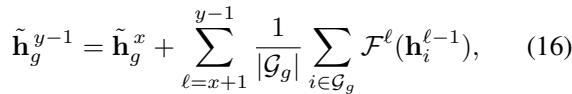

We denote by $\Delta h_g$ the accumulated group-level residual update.

> 💡 **理论推导**:
> - Eq.14: Transformer 的残差结构 h^ℓ = h^{ℓ-1} + F^ℓ(h^{ℓ-1})
> - Eq.15: 原始 token i 从 layer x 到 y-1 的变化 = 各层残差之和
> - Eq.16: 组内平均变化 = 组内 token 残差的平均
> - 核心论点：如果组内 token 语义相似 → F^ℓ 对它们的变换方向也相似 → 平均变化量能近似个体变化量

---

In Sec.4.4, we obtain $\Delta h_g$ from the vanilla model and compare it with $\Delta h_{gm}$. Under fine-grained grouping, their low-dimensional projections show near-complete overlap, providing empirical support for the proposed offset-based approximation.

> 💡 **3.4 小结**: 理论上，bypass token 的校正依赖于"同组 token 变化方向相似"的假设。实验（Sec.4.4 的 t-SNE 可视化）验证了这一点：merged token offset 与 vanilla 模型中的真实 group-mean offset 高度重合。

---

## 3.5. FLOPs Computation

> 💡 **3.5 要点预览**: 计算 SwiftVLM 的 FLOPs，包括基础剪枝带来的节省和 bypass 引入的额外开销。

We consider a setting where visual tokens are pruned after the $K$-th VLM layer, removing a fraction $D\%$ of visual tokens. Let $n_v$ and $n_t$ denote the numbers of visual tokens and non-visual tokens, respectively, with $T$ layers, hidden dimension $d$, and FFN intermediate dimension $m$. The total number of tokens is $n = n_v + n_t$, and the token count after pruning becomes $\hat{n} = (1 - D\%) * n_v + n_t$. The resulting FLOPs $F$ are given by:

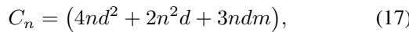

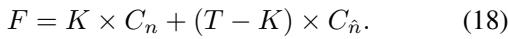

Furthermore, we analyze the additional computational overhead introduced by the proposed operation. Let $R$ denote the number of low-ranked visual tokens and $Z$ the number of merged tokens.

The merge step incurs an overhead of $2RZd$. Representation alignment adds an extra cost of $Rd$. Projecting the last text token to form the query costs $2d^2$, while projecting the visual tokens and computing the subsequent dot products introduce costs of $2n_vd^2$ and $2n_vd$, respectively. Let $r$ denote the ratio of visual tokens retained at layer $y$. The overall computational overhead $F_o$ is thus given by

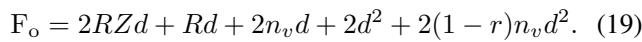

> 💡 **FLOPs 分析**:
> - **基础节省**: 前 K 层全 token 计算，后 T-K 层用剪枝后的 token 数
> - **Bypass 额外开销**: merge (2RZd) + alignment (Rd) + re-ranking (2n_v d^2 + 2n_v d + 2d^2)
> - 额外开销的主项是 2n_v d^2（visual token 的 key 投影），但只做一次，相比整体 FLOPs 很小
> - 总体来看 SwiftVLM 的 FLOPs 与 FastV/PDrop 相当（见 Table 1 的 FLOPs 列）

---

## 🔖 Section 总结

### 关键数字速查
| 指标 | 数值 |
|------|------|
| LLaVA-1.5-7B 最优剪枝层 | 3, 11, 15 |
| 评估用的 V% | 20% |
| 每数据集采样数 | 1,000 |

### 核心洞察
1. **剪枝层选择 (3.2)**: DP 求解，约束单调递增，面积最大化
2. **Bypass 架构 (3.3)**: 低排名 token 分组合并（代理参与计算）+ 原始 token bypass + offset 校正 + 重新评估
3. **对齐理论 (3.4)**: 基于"相似 token 有相似变化方向"假设，用 merged token offset 近似
4. **计算开销 (3.5)**: bypass 额外开销很小，整体效率与竞争方法相当
