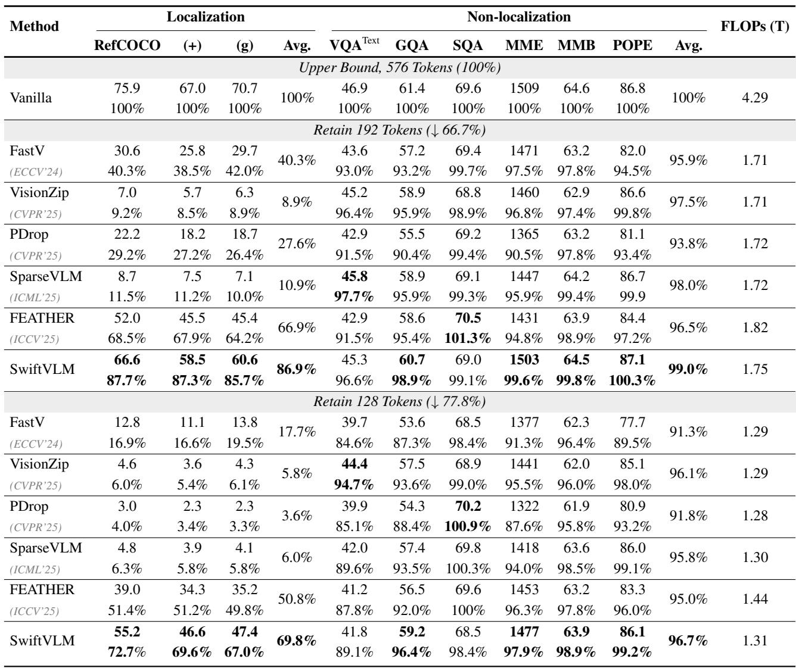
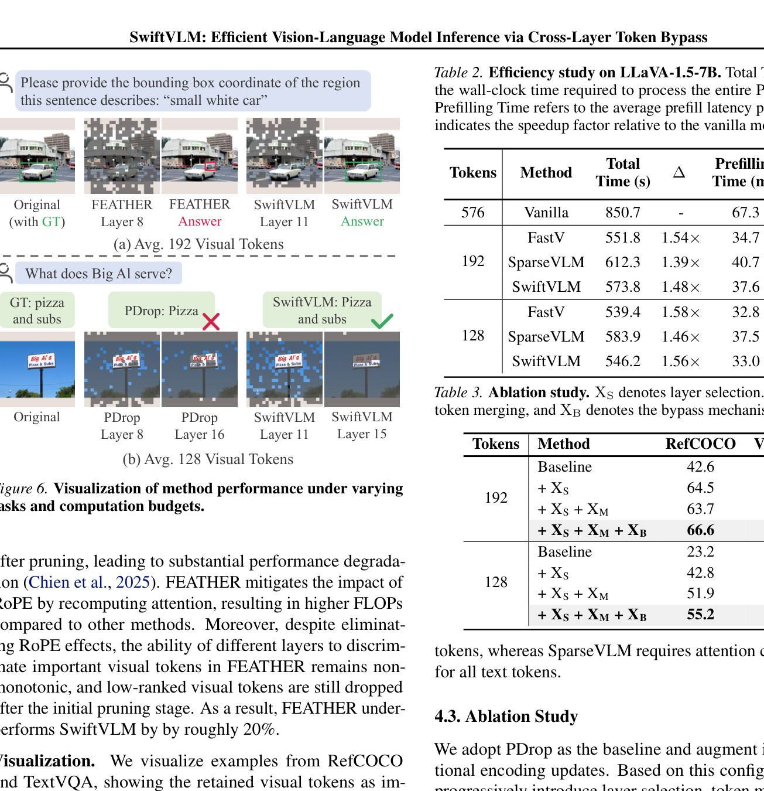
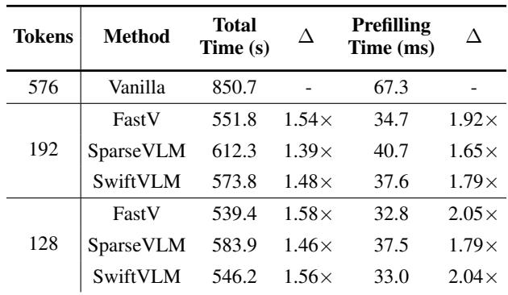
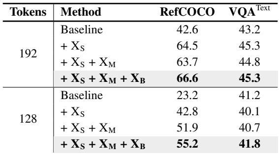
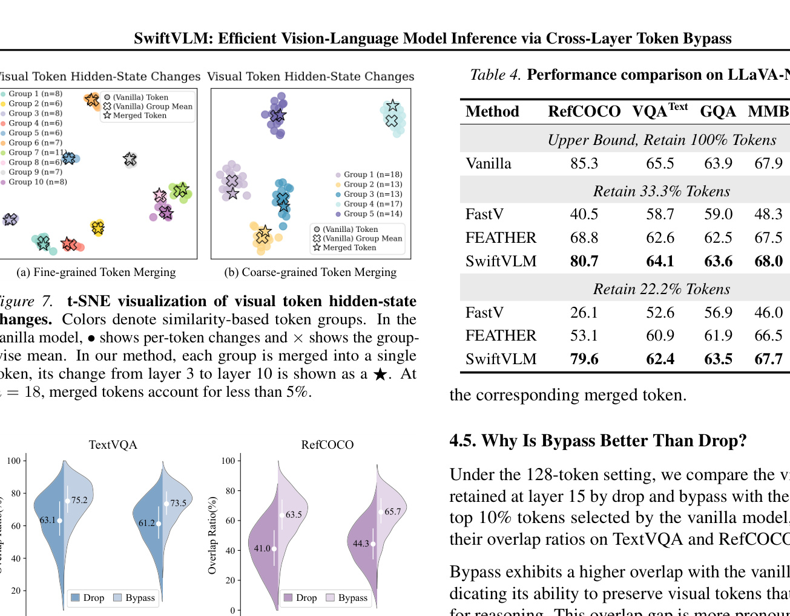
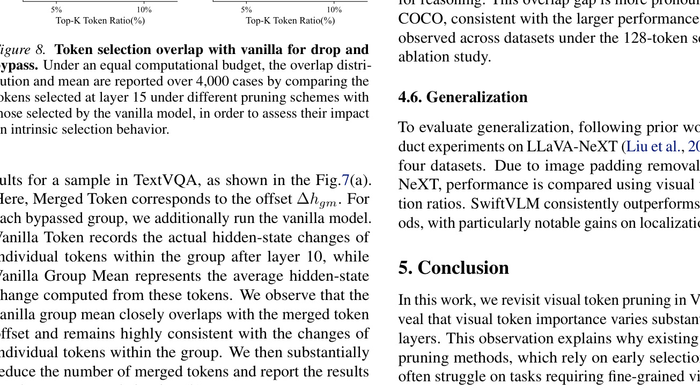
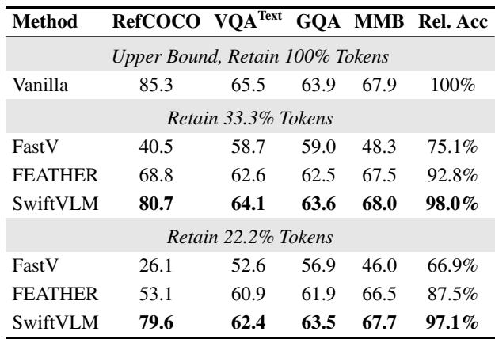

[← 返回 README](../README.md)

# 4. Experiments

## 📌 预览
实验部分包含：(4.1) 9 个 benchmark 上的主实验，(4.2) 效率分析，(4.3) 消融实验，(4.4) bypass 为什么有效的可视化分析，(4.5) bypass 优于 drop 的原因，(4.6) 泛化性实验。

---

## 4.1. Overall Performance

### Datasets

We categorize inference tasks into localization and non-localization types, where the former emphasizes fine-grained visual details and the latter focuses on holistic information integration. We evaluate our method on nine widely used benchmarks, including RefCOCO, RefCOCO+, RefCOCOg (Kazemzadeh et al., 2014; Yu et al., 2016), TextVQA, GQA (Hudson & Manning, 2019), SQA (Lu et al., 2022), MME (Bolya et al., 2022), MMB (Liu et al., 2024c), POPE (Li et al., 2024a). For TextVQA, we follow prior work (Endo et al., 2025) and exclude OCR prompt to better evaluate how pruning affects visual understanding.

> 💡 **数据集分类**:
> - **Localization（细粒度）**: RefCOCO, RefCOCO+, RefCOCOg — 需要精确定位
> - **Non-localization（粗粒度）**: TextVQA, GQA, SQA, MME, MMB, POPE — 整体理解
> - TextVQA 排除 OCR prompt，更能体现剪枝对视觉理解的影响

---

### Main Results

Since the average RefCOCO bounding box covers about 102 visual tokens, Tab. 1 reports the performance of different methods on LLaVA-1.5-7B under two visual token budgets (192 and 128). Across non-localization tasks, all methods achieve competitive performance, including VisionZip, which employs text-agnostic feature compression.

In contrast, performance differences become pronounced on localization tasks. Notably, PDrop and SparseVLM do not preserve the positional information of visual tokens after pruning, leading to substantial performance degradation (Chien et al., 2025). FEATHER mitigates the impact of RoPE by recomputing attention, resulting in higher FLOPs compared to other methods. Moreover, despite eliminating RoPE effects, the ability of different layers to discriminate important visual tokens in FEATHER remains non-monotonic, and low-ranked visual tokens are still dropped after the initial pruning stage. As a result, FEATHER underperforms SwiftVLM by roughly 20%.

*Table 1. Performance comparison under different visual token budgets. (+) and (g) denote RefCOCO+ and RefCOCOg, respectively.*

> 💡 **Table 1 批读**:
> - **192 tokens (↓66.7%)**:
>   - Non-localization: 所有方法都能保持 ~95%+ 的性能，差异不大
>   - Localization: SwiftVLM **86.9%** vs FEATHER 66.9% vs FastV 40.3% → **巨大差距**
>   - SwiftVLM 在 localization 上遥遥领先，non-localization 也最高 (99.0%)
> - **128 tokens (↓77.8%)**:
>   - Localization 差距更大：SwiftVLM **69.8%** vs FEATHER 50.8% vs PDrop 3.6%
>   - PDrop/SparseVLM 不保留位置信息 → localization 几乎崩溃
>   - SwiftVLM 在极端压缩下仍保持较好性能
> - **FLOPs**: SwiftVLM (1.75T/1.31T) 与其他方法相当，FEATHER 偏高 (1.82T/1.44T)

---

### Visualization

We visualize examples from RefCOCO and TextVQA, showing the retained visual tokens as image patches along with the final answers.

*Figure 6. Visualization of method performance under varying tasks and computation budgets. (a) Avg. 192 Visual Tokens. (b) Avg. 128 Visual Tokens.*

> 💡 **Figure 6 批读**:
> - 可视化展示了各方法保留的 visual token 对应的图像区域
> - FEATHER 和 PDrop 的 drop 策略丢弃了任务相关的 token（如定位任务中的 car、VQA 中的 signboard）
> - SwiftVLM 通过 bypass 保留了关键区域

---

## 4.2. Efficiency Study

Following SparseVLM, we implement SwiftVLM in a FlashAttention-compatible (Dao et al., 2022) manner and report the corresponding latency results in Tab.2. Compared to the vanilla model, all pruning-based methods achieve noticeable speedups. FastV attains the largest acceleration since it performs pruning only once.

Unlike FLOPs computation, FlashAttention does not provide direct access to attention maps, requiring attention scores to be recomputed in practice. Consequently, SwiftVLM incurs lower latency than SparseVLM, as it only computes attention between the final text token and visual tokens, whereas SparseVLM requires attention computation for all text tokens.

*Table 2. Efficiency study on LLaVA-1.5-7B. Total Time denotes the wall-clock time required to process the entire POPE dataset. Prefilling Time refers to the average prefill latency per sample. Δ indicates the speedup factor relative to the vanilla model.*

> 💡 **Table 2 批读**:
> - **192 tokens**: SwiftVLM 1.48× 总加速 / 1.79× prefill 加速，接近 FastV (1.54×/1.92×)
> - **128 tokens**: SwiftVLM 1.56× / 2.04×，几乎追平 FastV (1.58×/2.05×)
> - SwiftVLM 快于 SparseVLM：因为只需计算最后一个 text token 的 attention
> - **核心结论**: bypass 的额外计算开销对实际延迟影响很小

---

## 4.3. Ablation Study

We adopt PDrop as the baseline and augment it with positional encoding updates. Based on this configuration, we progressively introduce layer selection, token merging, and bypass, with results reported in Tab. 3.

Under the 192-token setting, pruning at layers with monotonically increasing selection capability yields the largest gains, while token merging degrades performance due to unnecessary information compression under sufficient computation budget. In contrast, under the more constrained 128-token setting, token merging becomes beneficial, as aggressive dropping would otherwise remove critical visual information. Overall, pruning with bypass consistently provides stable performance improvements across different budget settings.

*Table 3. Ablation study. X_S denotes layer selection. X_M denotes token merging, and X_B denotes the bypass mechanism.*

> 💡 **Table 3 批读**:
> - **Layer Selection (X_S)** 是最大贡献：RefCOCO 从 42.6→64.5 (192 tokens), 23.2→42.8 (128 tokens)
> - **Token Merging (X_M)**: 192 tokens 下反而降低 (64.5→63.7)；128 tokens 下有益 (42.8→51.9)
>   - 解释：预算充足时合并是不必要的压缩；预算紧张时合并比直接丢弃好
> - **Bypass (X_B)**: 始终有正贡献，特别在 128 tokens: 51.9→55.2
> - **结论**: 三个组件互补，层选择贡献最大，bypass 在低预算下尤其重要

---

## 4.4. Why Bypass Works?

To investigate why visual tokens forwarded through bypass can still participate effectively in subsequent computation after representation alignment, we analyze the low-dimensional projections of token offsets as described in Sec.3.4. Under the 128-token setting, we visualize the results for a sample in TextVQA, as shown in the Fig.7. Here, Merged Token corresponds to the offset Δh_gm. For each bypassed group, we additionally run the vanilla model. Vanilla Token records the actual hidden-state changes of individual tokens within the group after layer 10, while Vanilla Group Mean represents the average hidden-state change computed from these tokens. We observe that the vanilla group mean closely overlaps with the merged token offset and remains highly consistent with the changes of individual tokens within the group. We then substantially reduce the number of merged tokens and report the results for the same example in Fig.7(b).

*Figure 7. t-SNE visualization of visual token hidden-state changes. Colors denote similarity-based token groups. In the vanilla model, • shows per-token changes and × shows the group-wise mean. In our method, each group is merged into a single token, its change from layer 3 to layer 10 is shown as a ★. At n=18, merged tokens account for less than 5%.*

> 💡 **Figure 7 批读**:
> - **(a) Fine-grained merging**: 每组内 •(个体变化)、×(组均值)、★(merged token 变化) 三者高度重合
> - **(b) Coarse-grained merging**: 分组更粗时，★ 与 ×/• 仍然方向一致但距离略有偏差
> - **结论**: 相似 token 确实经历相似的表示变换 → merged token offset 是好的近似
> - 这验证了 Sec.3.4 的理论假设

---

Given that VLMs employ causal attention, the hidden-state evolution of a visual token can actually only be influenced by preceding visual tokens. Moreover, since attention fundamentally operates through similarity-based interactions, we hypothesize that visual tokens with similar semantics exhibit similar transformation directions in the representation space, and can thus be well approximated by the changes of the corresponding merged token.

> 💡 **理论解释**: causal attention 下 visual token 只受前面 token 影响 + attention 基于相似度 → 语义相似的 token 变换方向相似 → 平均变化量可以作为个体变化量的近似。

---

## 4.5. Why Is Bypass Better Than Drop?

Under the 128-token setting, we compare the visual tokens retained at layer 15 by drop and bypass with the top 5% and top 10% tokens selected by the vanilla model, and report their overlap ratios on TextVQA and RefCOCO in Fig.8.

Bypass exhibits a higher overlap with the vanilla model, indicating its ability to preserve visual tokens that are critical for reasoning. This overlap gap is more pronounced on RefCOCO, consistent with the larger performance differences observed across datasets under the 128-token setting in the ablation study.

*Figure 8. Token selection overlap with vanilla for drop and bypass. Under an equal computational budget, the overlap distribution and mean are reported over 4,000 cases by comparing the tokens selected at layer 15 under different pruning schemes with those selected by the vanilla model, in order to assess their impact on intrinsic selection behavior.*

> 💡 **Figure 8 批读**:
> - Bypass 在 layer 15 选出的 token 与 vanilla model 的 top token 重合度更高
> - **RefCOCO 上差距更明显**: bypass 的选择更"忠实"于原始模型
> - 说明 drop 会破坏后续层的 attention 分布（因为丢弃了本该参与计算的 token），而 bypass 通过保留信息维持了更正常的选择行为
> - 这解释了 bypass 在 localization 任务上的优势

---

## 4.6. Generalization

To evaluate generalization, following prior work, we conduct experiments on LLaVA-NeXT (Liu et al., 2024b) across four datasets. Due to image padding removal in LLaVA-NeXT, performance is compared using visual token retention ratios. SwiftVLM consistently outperforms other methods, with particularly notable gains on localization datasets.

*Table 4. Performance comparison on LLaVA-NeXT-7B.*

> 💡 **Table 4 批读**:
> - **33.3% tokens**: SwiftVLM 98.0% 相对准确率 vs FEATHER 92.8% vs FastV 75.1%
> - **22.2% tokens**: SwiftVLM 97.1% vs FEATHER 87.5% vs FastV 66.9%
> - RefCOCO 上：SwiftVLM 几乎不掉点 (80.7/79.6 vs vanilla 85.3)，FastV 崩溃 (40.5/26.1)
> - **泛化性结论**: SwiftVLM 在不同 VLM（LLaVA-1.5 和 LLaVA-NeXT）上都表现最优

---

## 🔖 Section 总结

### 关键数字速查
| 指标 | 数值 |
|------|------|
| 评估 benchmark 数量 | 9 个 |
| LLaVA-1.5-7B, 192 tokens, Localization 相对准确率 | 86.9% |
| LLaVA-1.5-7B, 128 tokens, Localization 相对准确率 | 69.8% |
| 192 tokens Prefill 加速 | 1.79× |
| 128 tokens Prefill 加速 | 2.04× |
| LLaVA-NeXT, 33.3% tokens, 相对准确率 | 98.0% |

### 核心洞察
1. SwiftVLM 在 **localization 任务**上优势巨大（领先 FEATHER ~20%），non-localization 上也最优
2. 效率与 FastV 接近，但准确率高得多
3. 消融显示：层选择 > bypass > merging 的贡献排序
4. Bypass 保持了与 vanilla 模型更高的 token 选择一致性
5. 在 LLaVA-NeXT 上同样有效，泛化性好
