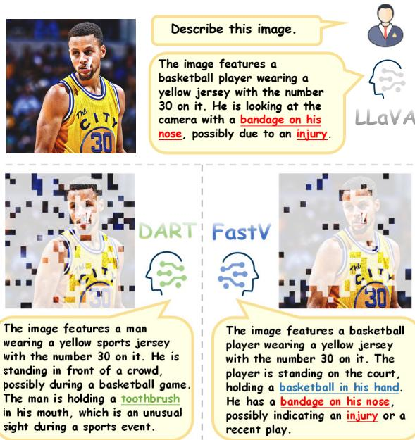
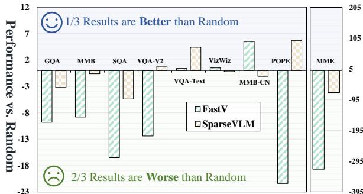
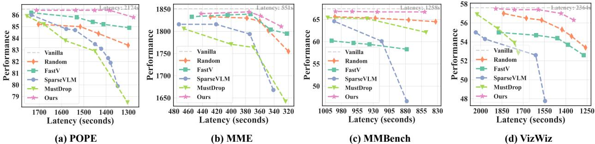

# Stop Looking for “Important Tokens” in Multimodal Language Models: Duplication Matters More

# Zichen Wen1,2

Yifeng Gao1 Shaobo Wang1 Junyuan Zhang2 Qintong Zhang2, Weijia $\mathbf { L i ^ { 3 , 2 } }$ Conghui $\mathbf { H e } ^ { 2 \dagger }$ Linfeng Zhang1 †

1Shanghai Jiao Tong University 2Shanghai AI Laboratory 3Sun Yat-sen University 4Peking University zichen.wen@outlook.com, heconghui@pjlab.org.cn, zhanglinfeng@sjtu.edu.cn

# Abstract

Vision tokens in multimodal large language models often dominate huge computational overhead due to their excessive length compared to linguistic modality. Abundant recent methods aim to solve this problem with token pruning, which first defines an importance criterion for tokens and then prunes the unimportant vision tokens during inference. However, in this paper, we show that the importance is not an ideal indicator to decide whether a token should be pruned. Surprisingly, it usually results in inferior performance than random token pruning and leading to incompatibility to efficient attention computation operators. Instead, we propose DART (Duplication-Aware Reduction of Tokens), which prunes tokens based on its duplication with other tokens, leading to significant and training-free acceleration. Concretely, DART selects a small subset of pivot tokens and then retains the tokens with low duplication to the pivots, ensuring minimal information loss during token pruning. Experiments demonstrate that DART can prune $8 8 . 9 \%$ vision tokens while maintaining comparable performance, leading to a $\mathbf { 1 . 9 9 } \times$ and $2 . 9 9 \times$ speed-up in total time and prefilling stage, respectively, with good compatibility to efficient attention operators 1.

# 1 Introduction

Multimodal large language models (MLLMs) exhibit remarkable capabilities across a diverse range of multimodal tasks, including image captioning, visual question answering (VQA), video understanding (Wang et al., 2024b), and multimodal reasoning (Wang et al., 2024c; Kang et al., 2025). However, such impressive performance is always accompanied by huge computation costs, which are mainly caused by massive vision tokens in the input data, especially for high-resolution images (Li et al., 2024d) and multi-frame video (Tang et al., 2023), leading to challenges in their applications.

  
Figure 1: Comparison between DART and FastV. Red text indicates hallucination from vanilla LLaVA-1.5-7B, green text represents hallucination from DART, and blue text represents hallucination from FastV.

To solve this problem, abundant recent methods introduce token pruning to remove the vision tokens in a training-free manner, which usually first defines the importance score of each token, and then prunes the most unimportant tokens during the inference phrase (Chen et al., 2024; Zhang et al., 2024c; Liu et al., 2024e). The key to a token pruning method is the definition of the importance of vision tokens, where most existing methods are based on the attention scores between vision-only tokens and vision-language tokens. However, this paper argues that these importance-based methods have several serious problems.

(I) Ignoring interactions between tokens during pruning: Although the interaction between different tokens is considered in attention scores, however, importance-based methods directly remove the most unimportant tokens, ignoring the truth that the importance of each token should be adjusted when other tokens are pruned or preserved. For instance, for two similar tokens, if one of both is determined to be pruned, then the importance of the other token should be improved and vice versa. Unfortunately, previous importance-based token pruning methods fail to model such interaction.

  
Figure 2: Performance of FastV and SparseVLM compared with random token pruning on the LLaVA1.5-7B, with a $8 8 . 9 \%$ token reduction ratio.

$\mathbf { \Pi } ^ { ( \mathbf { I I } ) }$ Incompatibility to efficient attention: Efficient attention operators such as FlashAttention (Dao et al., 2022) have become the default configure in neural networks, which accelerates attention computation by around $2 \times$ and reduce the memory costs from $O ( N ^ { 2 } )$ to $O ( N )$ . However, these efficient attention operators make attention scores not accessible during computation, indicating conflicts with most previous importancebased token pruning methods. Disabling FlashAttention for accessing attention scores significantly improves the overall latency and memory footprint. (III) Bias in token positions: As claimed by abundant recent works (Endo et al., 2024; Zhang et al., 2024b) and shown in Figure 1, attention scores have position bias, where the tokens are positionally close to the last token tend to have a higher attention score, making attention score does not truly reveal the value of this token.

(IV) Significant accuracy drop: Although the aforementioned three problems have reminded us of the ineffectiveness of importance-based token pruning, however, it is still extremely surprising to find that some influential importance-based token pruning methods show inferior accuracy than random token pruning, (i.e., randomly selecting the tokens for pruning), as shown in Figure 2.

The above observations demonstrates the disadvantages of importance-based token pruning methods, while also introducing the expectation for the ideal alternative: The expected method should consider both the individual value of a token and its interaction to other tokens. It should be cheap in computation and friendly to hardware, and shows no bias in the positions of tokens.

These insights inspire us to incorporate token duplication into the token reduction. Intuitively, when multiple tokens exhibit identical or highly similar representations, it is natural to retain only one of them for the following computation, thereby maintaining efficiency without harming accuracy. Building upon this idea, we introduce a simple but effective token pruning pipeline referred to as DART (Duplication-Aware Reduction of Tokens) with the following two steps.

Firstly, we begin by selecting a small subset of tokens as pivot tokens, which comprise no more than $2 \%$ of the total tokens. Such pivot tokens can be selected based on the norm of tokens or even randomly selected, which does not introduce notable computations. Secondly, we then calculate the cosine similarity between pivot tokens and the remaining image tokens. Since the pivot tokens are fewer than $2 \%$ , such computation is efficient in both computing and memory. With a desired token reduction ratio, we retain only those vision tokens with the lowest cosine similarity to pivot tokens and remove the similar ones. The entire process is simple and highly efficient, completing in no more than 0.08 seconds, friendly to efficient attention operators, and leading to significantly higher accuracy than previous methods.

In summary, our contributions are three-fold:

• Rethink Token Importance. Through empirical analysis, we demonstrate the suboptimality of relying on attention scores to measure token importance to guide the token reduction paradigm.

• Token Duplication as a Key Factor. Building on token duplication, we introduce a trainingfree, plug-and-play token reduction method that seamlessly integrates with Flash Attention.

• Superior Performance with Extreme Compression. Extensive experiments across four diverse MLLMs and over 10 benchmarks demonstrate the clear superiority of DART. For instance, our method outperforms the second-best method by $2 . 2 \%$ $9 3 . 7 \%$ vs. $9 1 . 5 \%$ ) on LLaVA1.5-7B with an $8 8 . 9 \%$ reduction ratio.

# 2 Related Work

Multimodal Large Language Models Multimodal large language models (MLLMs) (Liu et al., 2024b; Li et al., 2023a; Zhu et al., 2023; Liu et al., 2024d) excel at image, video, and multimodal reasoning by integrating vision and text (Zhang et al.,

  
Figure 3: The overview of DART. The process includes (a) selecting pivot tokens, (b) calculating $\epsilon$ -Duplicate scores between pivot tokens and other tokens, and (c) reducing tokens to retain those with the least duplication.

2024a). However, visual data processing is costly due to redundancy, low information density (Liang et al., 2022; Liu et al., 2025b), and the quadratic cost of attention (Vaswani et al., 2017). For instance, models like LLaVA (Liu et al., 2023) and mini-Gemini-HD (Li et al., 2024d) encode highresolution images into thousands of tokens, while video models like VideoLLaVA (Lin et al., 2023) and VideoPoet (Kondratyuk et al., 2023) handle even more tokens across frames. These challenges highlight the need for efficient token representations and longer context. Recent work like Gemini (Team et al., 2023) and LWM (Liu et al., 2024a) addresses this by improving token efficiency and extending context, enabling more scalable MLLMs.

Visual Token Compression Visual tokens often outnumber text tokens by tens to hundreds of times, as visual signals are more spatially redundant than information-dense text (Marr, 2010). LLaMA-VID (Li et al., 2024c) employs a Q-Former with context tokens, and DeCo (Yao et al., 2024a) uses adaptive pooling. DTMFormer (Wang et al., 2024d) improves ViTs’ efficiency in medical image segmentation by merging redundant tokens during training. MADTP (Cao et al., 2024) reduces computation by aligning cross-modal features and pruning tokens. However, these require modifying components and additional training. ToMe (Bolya et al., 2023) merges tokens without training but disrupts crossmodal interactions (Xing et al., 2024). FastV (Chen et al., 2024) selects via attention scores, while SparseVLM (Zhang et al., 2024c) uses text guidance. Yet, these forgo Flash-Attention (Dao et al., 2022; Dao, 2024), neglecting token duplication. We preserve hardware acceleration (i.e., Flash-Attention) and target duplication for efficient token reduction.

# 3 Methodology

# 3.1 Preliminary

Architecture of MLLM. The architecture of Multimodal Large Language Models (MLLMs) typically comprises three core components: a visual encoder, a modality projector, and a language model (LLM). Given an image $I$ , the visual encoder and a subsequent learnable MLP are used to encode $I$ into a set of visual tokens $e _ { v }$ . These visual tokens $e _ { v }$ are then concatenated with text tokens $e _ { t }$ encoded from the text prompt $p _ { t }$ , forming the input for the LLM. The LLM decodes the output tokens $y$ sequentially, which can be formulated as: $y _ { i } = f ( I , p _ { t } , y _ { 0 } , y _ { 1 } , \cdot \cdot \cdot , y _ { i - 1 } )$ .

# 3.2 Beyond Token Importance: Questioning the Status Quo

Given the computational burden associated with the length of visual tokens in MLLMs, numerous studies have embraced a paradigm that utilizes attention scores to evaluate the significance of visual tokens, thereby facilitating token reduction. Specifically, in transformer-based MLLMs, each layer performs attention computation as illustrated below:

$$
{ \mathrm { A t t e n t i o n } } ( \mathbf { Q } , \mathbf { K } , \mathbf { V } ) = { \mathrm { s o f t m a x } } \left( { \frac { \mathbf { Q } \cdot \mathbf { K } ^ { \top } } { \sqrt { d _ { k } } } } \right) \cdot \mathbf { V } ,
$$

where $d _ { k }$ is the dimension of $\mathbf { K }$ . The result of Softmax $\left( \mathbf { Q } \cdot \mathbf { K } ^ { \top } / \sqrt { d _ { k } } \right)$ is a square matrix known as the attention map. Existing methods extract the corresponding attention maps from one or multiple layers and compute the average attention score for each visual token based on these attention maps:

$$
\phi _ { \mathrm { a t t n } } ( x _ { i } ) = \frac { 1 } { N } \sum _ { j = 1 } ^ { N } \mathrm { A t t e n t i o n } ( x _ { i } , x _ { j } ) ,
$$

where Attention $( x _ { i } , x _ { j } )$ denotes the attention score between token $x _ { i }$ and token $x _ { j }$ , $\phi _ { \mathrm { a t t n } } ( x _ { i } )$ is regarded as the importance score of the token $x _ { i }$ , $N$ represents the number of visual tokens. Finally, based on the importance score of each token and the predefined reduction ratio, the most important visual tokens are selectively retained:

$$
{ \mathcal { R } } = \{ x _ { i } \mid ( \phi _ { \mathrm { a t t n } } ( x _ { i } ) \geq \tau ) \} ,
$$

where $\mathcal { R }$ represents the set of retained visual tokens, and $\tau$ is a threshold determined by the predefined reduction ratio.

Problems: Although this paradigm has demonstrated initial success in enhancing the efficiency of MLLMs, it is accompanied by several inherent limitations that are challenging to overcome.

One key limitation is disregarding the dynamic nature of token importance during pruning. For a token sequence $\{ x _ { 1 } , \ldots , x _ { n } \}$ , importance-based methods compute static token importance via a scoring function $s _ { i } = \mathcal { F } ( x _ { i } | \boldsymbol { X } )$ , where $X$ is the full token set. The strategy retains Top- $k$ tokens:

$$
X _ { \mathrm { p r u n e d } } = \arg \operatorname* { m a x } _ { X ^ { \prime } \subseteq X , | X ^ { \prime } | = k } \sum _ { x _ { j } \in X ^ { \prime } } s _ { j }
$$

This implies an independence assumption: the score $s _ { j }$ remains unchanged for any subset $X ^ { \prime } \subset$ $X$ , ignoring dynamic token interactions. For example, if two similar tokens $x _ { p } , x _ { q }$ have $s _ { p } \approx s _ { q }$ , removing $x _ { q }$ should recalibrate $s _ { p }$ as:

$$
s _ { p } ^ { \prime } = \mathcal { F } ( x _ { p } | X ^ { \prime } \setminus \{ x _ { q } \} ) > s _ { p } ,
$$

which leads to a bias in importance estimation $\Delta =$ $s _ { p } ^ { \prime } - s _ { p }$ . This contradiction between static scoring and dynamic interaction can be quantified as:

$$
\mathbb { E } _ { X ^ { \prime } \subset X } \left[ \sum _ { x _ { i } \in X ^ { \prime } } \left( \mathcal { F } ( x _ { i } | X ^ { \prime } ) - \mathcal { F } ( x _ { i } | X ) \right) \right]
$$

Additionally, Figure 1 visualizes the results of token reduction, revealing that selecting visual tokens based on attention scores introduces a noticeable bias toward tokens in the lower-right region of the image, those appearing later in the visual token sequence. However, this region is not always the most significant in every image. Further, we present the outputs of various methods. Notably, FastV generates more hallucinations than the vanilla model, while DART effectively reduces them. We attribute this to the inherent bias of attention-based methods, which tend to retain tokens concentrated in specific regions, often neglecting the broader context of the image. In contrast, DART removes highly duplication tokens and preserves a more balanced distribution across the image, enabling more accurate and consistent outputs.

Furthermore, methods relying on attention scores for token importance are incompatible with Flash Attention, compromising speed, and sometimes even underperforming random token reduction in effectiveness (See Fig. 2).

# 3.3 Token Duplication: Rethinking Reduction

Given the numerous drawbacks associated with the paradigm of using attention scores to evaluate token importance for token reduction, what additional factors should we consider beyond token importance in the process of token reduction? Inspired by the intuitive ideas mentioned in $\ S 1$ and the phenomenon of tokens in transformers tending toward uniformity (i.e., over-smoothing) (Nguyen et al., 2023; Gong et al., 2021), we propose that token duplication should be a critical focus.

Due to the prohibitively high computational cost of directly measuring duplication among all tokens, we adopt a paradigm that involves selecting a minimal number of pivot tokens.

Definition 1 (Pivot Tokens). Let $\begin{array} { r l } { \mathcal { P } } & { { } = } \end{array}$ $\left\{ p _ { 1 } , p _ { 2 } , \dotsc , p _ { k } \right\} \subseteq \mathcal { X }$ denote the pivot tokens, where $k \ \ll \ n$ and $n$ is the total length of the tokens ${ \mathcal { X } } = \{ x _ { 1 } , x _ { 2 } , \ldots , x _ { n } \}$ . The pivot tokens $\mathcal { P }$ are a subset of $\mathcal { X }$ , selected for their representativeness of the entire set.

Given the pivot tokens, we can define the duplication score based on it.

Definition 2 ( $\epsilon$ -duplicate Score). The token duplication score between a pivot token $p _ { i }$ and a visual token $x _ { j }$ is defined as:

$$
d u p ( p _ { i } , x _ { j } ) = \frac { p _ { i } ^ { \top } x _ { j } } { \| p _ { i } \| \| x _ { j } \| } ,
$$

where $\| \cdot \|$ denotes the Euclidean norm. Two tokens $p _ { i } , x _ { j }$ are $\epsilon$ -duplicates if

$$
d u p ( p _ { i } , x _ { j } ) > \epsilon .
$$

With the $\epsilon$ -duplicate score, for each pivot $p _ { i }$ , the associated retained token set is defined as:

$$
\mathcal { R } _ { i } = \{ x _ { j } \mid d u p ( p _ { i } , x _ { j } ) \leq \epsilon \}
$$

The final retained set is:

$$
{ \mathcal { R } } = { \mathcal { P } } \cup \left( \bigcup _ { p _ { i } \in { \mathcal { P } } } { \mathcal { R } } _ { i } \right)
$$

where $\epsilon$ is the threshold dynamically determined for each pivot $p _ { i }$ based on reduction ratio. This ensures that only tokens that are sufficiently different from the pivot tokens are kept.

Our method is orthogonal to the paradigm of using attention scores to measure token importance, meaning it is compatible with existing approaches.

  
Figure 4: Performance-Latency trade-off comparisons across different datasets on LLaVA-Next-7B. DART consistently achieves better performance under varying latency constraints compared to other approaches.

Specifically, we can leverage attention scores to select pivot tokens, and subsequently incorporate token duplication into the process.

However, this still does not fully achieve compatibility with Flash Attention. Therefore, we explored alternative strategies for selecting pivot tokens, such as using K-norm, $\scriptstyle \mathrm { V - n o r m } ^ { 2 }$ , or even random selection. Surprisingly, all these strategies achieve competitive performance across multiple benchmarks. This indicates that our token reduction paradigm based on token duplication is not highly sensitive to the choice of pivot tokens. Moreover, it suggests that removing duplicate tokens may be more critical than identifying “important tokens”, highlighting token duplication as a more significant factor in token reduction. Detailed discussion on pivot token selection is provided in $\ S 5 . 2$

# 3.4 Theoretical Analysis

To further justify trustworthiness of our proposed method, we provide a theoretical analysis of it.

Assumption 1 (Transformer Property). For transformer property, we assume the following:

(A1). (Lipschitz continuity under Hausdorff distance). The model $f$ is Lipschitz continuous with respect to the Hausdorff distance between token sets. Formally, there exists $K > 0$ such that for any two token sets $\chi _ { 1 } , \chi _ { 2 } \subseteq \mathbb { R } ^ { d }$ :

$$
\| f ( \mathcal { X } _ { 1 } ) - f ( \mathcal { X } _ { 2 } ) \| \le K \cdot d _ { H } ( \mathcal { X } _ { 1 } , \mathcal { X } _ { 2 } ) ,
$$

where $d _ { H } ( \mathcal { X } _ { 1 } , \mathcal { X } _ { 2 } ) \triangleq \operatorname* { m a x }$

$$
\Bigg \{ \underset { x _ { 1 } \in \mathcal { X } _ { 1 } } { \operatorname* { s u p } } \ \underset { x _ { 2 } \in \mathcal { X } _ { 2 } } { \operatorname* { i n f } } \ \Vert x _ { 1 } - x _ { 2 } \Vert , \ \underset { x _ { 2 } \in \mathcal { X } _ { 2 } } { \operatorname* { s u p } } \ \underset { x _ { 1 } \in \mathcal { X } _ { 1 } } { \operatorname* { i n f } } \ \Vert x _ { 1 } - x _ { 2 } \Vert \Bigg \} .
$$

(A2). (Bounded embedding). All tokens have bounded Euclidean norms:

$$
\| x \| \leq B , \quad \forall x \in \mathcal { X } ,
$$

where $B > 0$ is a constant.

Lemma 1 (Bounded Distance). $\mathrm { m i n } _ { p _ { i } \in \mathcal { P } } | p _ { i } ~ -$ $x _ { j } | \leq ( 2 ( 1 - \epsilon ) ) ^ { 1 / 2 } B , \quad \forall x _ { j } \in \mathcal { X } \backslash \mathcal { R } .$

Proof. Using A2 and Definition 2, we obtain:

$$
\begin{array} { r l } & { \underset { p _ { i } \in \mathcal P } { \operatorname* { m i n } } | p _ { i } - x _ { j } | ^ { 2 } = \underset { p _ { i } \in \mathcal P } { \operatorname* { m i n } } ( | p _ { i } | ^ { 2 } + | x _ { j } | ^ { 2 } - 2 p _ { i } ^ { \top } x _ { j } ) } \\ & { \leq \underset { p _ { i } \in \mathcal P } { \operatorname* { m i n } } ( B ^ { 2 } + B ^ { 2 } - 2 \epsilon \cdot B \cdot B ) \leq 2 ( 1 - \epsilon ) B ^ { 2 } } \end{array}
$$

Therefore, the duplication distance bound is given by: $\begin{array} { r } { \operatorname* { m i n } _ { p _ { i } \in \mathcal { P } } | p _ { i } - x _ { j } | ^ { 2 } \leq ( 2 ( 1 - \epsilon ) ) ^ { 1 / 2 } B } \end{array}$

Lemma 2 (Bounded Approximation Error). Under Assumption $I$ , the Hausdorff distance between original and retained tokens satisfies:

$$
d _ { H } ( \mathcal { X } , \mathcal { R } ) \leq \sqrt { 2 ( 1 - \epsilon ) } B .
$$

Proof. For any $x \in \mathcal { X }$ :

• If $x \in \mathcal { R }$ , then $\begin{array} { r } { \operatorname* { i n f } _ { r \in { \mathcal { R } } } \| x - r \| = 0 } \end{array}$ • If $x \notin \mathcal { R }$ , by definition and Lemma 1 there exists $p _ { i } \in \mathcal { P } \subseteq \mathcal { R }$ with $\| x - p _ { i } \| \leq \sqrt { 2 ( 1 - \epsilon ) } B$

Thus:

$$
\operatorname* { s u p } _ { x \in \mathcal { X } } \operatorname* { i n f } _ { r \in \mathcal { R } } \| x - r \| \leq \sqrt { 2 ( 1 - \epsilon ) } B .
$$

Since $\mathcal { R } \subseteq \mathcal { X }$ , Hausdorff distance simplifies to: $\begin{array} { r } { d _ { H } ( \mathcal { X } , \mathcal { R } ) ~ = ~ \operatorname* { s u p } _ { x \in \mathcal { X } } \operatorname* { i n f } _ { r \in \mathcal { R } } \| x - r \| ~ \le ~ } \end{array}$ $\sqrt { 2 ( 1 - \epsilon ) } B$ .

Theorem 1 (Performance Guarantee). Under Assumptions $I$ , the output difference between original and pruned token sets is bounded by:

$$
\| f ( \mathcal { X } ) - f ( \mathcal { R } ) \| \leq K \sqrt { 2 ( 1 - \epsilon ) } B .
$$

Proof. Direct application of Lipschitz continuity (A1) with Lemma 2: $\| f ( \mathcal { X } ) - f ( \mathcal { R } ) \| \ \leq \ K \ .$ $d _ { H } ( \mathcal { X } , \mathcal { R } ) \leq K \sqrt { 2 ( 1 - \epsilon ) } B$ .

This provides a theoretical guarantee that DART preserves model output within a controllable bound, thereby supporting the trustworthiness and robustness of our method.

Table 1: Comparative experiments on image understanding. In all experiments for DART, tokens are pruned after the second layer with 8 pivot tokens. The pivot tokens are selected based on the maximum K-norm. DART † indicates that DART is applied during the training stage of LLaVA-1.5-7B.   

<table><tr><td>Method</td><td>GQA</td><td></td><td>MMB MMB-CN MME POPE SQA VQAV2</td><td></td><td></td><td></td><td>VQAText</td><td></td><td>VizWiz OCRBench</td><td>Avg.</td></tr><tr><td>LLaVA-1.5-7B</td><td colspan="8">Upper Bound, 576 Tokens (100%)</td><td></td><td></td></tr><tr><td>VVanilla</td><td>61.9 64.7</td><td></td><td>58.1</td><td>1862 85.9</td><td>69.5</td><td>78.5</td><td>58.2</td><td>50.0</td><td>297</td><td>100.0%</td></tr><tr><td>LLaVA-1.5-7B</td><td colspan="8">Retain 192 Tokens</td><td></td><td></td></tr><tr><td>ToMe (ICLR23)</td><td>54.3</td><td>60.5</td><td>-</td><td>1563</td><td>72.4 65.2</td><td>68.0</td><td>(↓ 66.7%) 52.1</td><td>-</td><td>-</td><td>-</td></tr><tr><td>FastV (ECCV24)</td><td>52.7</td><td>61.2</td><td>57.0</td><td>1612</td><td>64.8 67.3</td><td>67.1</td><td>52.5</td><td>50.8</td><td>291</td><td>91.2%</td></tr><tr><td>HiRED(AI25)</td><td>58.7</td><td>62.8</td><td>54.7</td><td>1737</td><td>82.8 68.4</td><td>74.9</td><td>47.4</td><td>50.1</td><td>190</td><td>91.5%</td></tr><tr><td>FitPrune (AAAI25)</td><td>60.4</td><td>663.3</td><td>56.4</td><td>1831</td><td>83.4</td><td>67.8 -</td><td>57.4</td><td>50.9</td><td>-</td><td>-</td></tr><tr><td>LLaVA-PruMerge (2024.05)</td><td>554.3</td><td>59.6</td><td>52.9</td><td>1632</td><td>71.3</td><td>67.9 70.6</td><td>54.3</td><td>50.1</td><td>253</td><td>90.8%</td></tr><tr><td>SparseVLM (ICML25)</td><td>57.6</td><td>62.5</td><td>53.7</td><td>1721</td><td>83.6</td><td>69.1 75.6</td><td>56.1</td><td>50.5</td><td>292</td><td>96.3%</td></tr><tr><td>PDrop (CVPR25)</td><td>57.1</td><td>63.2</td><td>56.8</td><td>11766</td><td>82.3</td><td>68.8 75.1</td><td>56.1</td><td>51.1</td><td>290</td><td>96.7%</td></tr><tr><td>FiCoCo-V (2024.11)</td><td>58.5</td><td>62.3</td><td>55.3</td><td>1732</td><td>82.5</td><td>67.8 74.4</td><td>55.7</td><td>51.0</td><td>-</td><td>96.%</td></tr><tr><td>MustDrop (2024.11)</td><td>58.2</td><td>62.3</td><td>555.8</td><td>11787</td><td>82.6</td><td>69.2 76.0</td><td>56.5</td><td>51.4</td><td>289</td><td>97.2%</td></tr><tr><td>DART (Ours)</td><td>60.0</td><td>636</td><td>57.0</td><td>1856</td><td>82.8</td><td>69</td><td>76.7 57.4</td><td>51.2</td><td> 296</td><td>988.8%</td></tr><tr><td>DART  (Ou)</td><td>60.9</td><td>66.3</td><td>59.5</td><td>1829</td><td>85.3</td><td>70.1</td><td>78.2 56.8</td><td>51.3</td><td>304</td><td>100.4%</td></tr><tr><td>LLaVA-1.5-7B</td><td colspan="16" rowspan="19">Retain 128 Tokens (F 77.8%)</td></tr><tr><td>ToMe (ICLR23)</td><td>52.4 53.3 56.1</td><td>-</td><td>1343 62.8</td><td>59.6 63.0</td><td>49.1</td><td>- 285</td></tr><tr><td>FastV (ECCV24) HiRED(AAAI25)</td><td>49.6 57.2</td><td>56.4</td><td>1490 1710 79.8</td><td>559.6 60.2 68.1</td><td>61.8 73.4</td><td>50.6 51.3</td></tr><tr><td>FitPrune (AAAI25)</td><td>585</td><td>61.5 53.6</td><td></td><td>77.9</td><td></td><td>46.1</td><td>51.3</td><td>191 90.2%</td></tr><tr><td>LLaVA-PruMerge (2024.05)</td><td>53.3</td><td>62.7 58.1</td><td>56.2 51.7</td><td>1776 1554 67.2</td><td>68.0 67.1</td><td>- 68.8</td><td>55.7 51.7 50.3</td><td>-</td></tr><tr><td>SparseVLM ICML25)</td><td>56.00</td><td>60.0</td><td>51.1</td><td>1696 80.55</td><td>67.1</td><td>73.8</td><td>54.3 54.9</td><td>248 280</td></tr><tr><td>PDrop (CVPR25)</td><td>56.00</td><td>61.1</td><td>56.6</td><td>1644 82.3</td><td>668.3</td><td>72.9 55.1</td><td>51.4 51.0</td><td>287</td></tr><tr><td>FiCoCo-V (2024.11)</td><td>5</td><td>61.1</td><td>54.3</td><td>1711 82.2</td><td>68.3</td><td>73.1</td><td>55.6 49.4</td><td>-</td></tr><tr><td>MustDrop (2024.11)</td><td>56.9</td><td>61.1</td><td>55.2</td><td>1745 78.7</td><td>68.5</td><td>74.6 56.3</td><td>52.1</td><td>281</td></tr><tr><td>DART (Ours)</td><td>58.7</td><td>63.2</td><td>57.55</td><td>1840 80.1</td><td>69.1</td><td>75.9 56.4</td><td>51.7</td><td>95.6% 296 98.0%</td></tr><tr><td>DART  (Ours)</td><td>59.8</td><td>65.6</td><td>58.3</td><td>1849 84.4</td><td>70.7</td><td>77.5</td><td>52.6</td><td>299</td></tr><tr><td>LLaVA-1.5-7B</td><td></td><td></td><td></td><td></td><td>Retain 64 Tokens</td><td>56.4 (↓88.9%)</td><td></td><td></td></tr><tr><td>ToMe (ICLR23) FastV (ECCV24)</td><td colspan="10">48.6 43.7 -</td></tr><tr><td></td><td></td><td>46.1</td><td>48.0 52.7</td><td>1138 1256</td><td>52.5 48.0</td><td>50.0 551.1</td><td>57.1 45.3 47.8</td><td>- 50.8</td><td>- 245</td><td>- 77.3%</td></tr><tr><td>HiRED(AAAI25)</td><td>54.6</td><td>60.2</td><td>51.4</td><td>11599</td><td>73.6</td><td>55.0 68.2 69.7</td><td>44.2</td><td></td><td></td><td>87.0%</td></tr><tr><td>FitPrune (AAAI25)</td><td>52.3</td><td>58.5</td><td>49.7</td><td></td><td>60.9</td><td></td><td></td><td>50.2</td><td>191</td><td></td></tr><tr><td></td><td>51.9</td><td></td><td></td><td> 1556</td><td></td><td>68.0 -</td><td>51.2</td><td>551.1</td><td>-</td><td>-</td></tr><tr><td>LLaVA-PruMerge (2024.05)</td><td>52.7</td><td>55.3</td><td>49.1</td><td>1549</td><td>665.3</td><td>68.1 67.4</td><td>54.0</td><td>50.1</td><td>250</td><td>87.4%</td></tr><tr><td>SparseVLM (ICML25)</td><td>41.9</td><td>556.2</td><td>46.1</td><td>11505</td><td>75.1</td><td>662.2</td><td>68.2 51.8</td><td>50.1</td><td>180</td><td>84.6%</td></tr><tr><td>PDrop (CVPR25)</td><td>52.4</td><td>33.3</td><td>50.5</td><td>109</td><td>55.9</td><td>68.6</td><td>69.2 45.9</td><td>50.7</td><td>250</td><td>78.1%</td></tr><tr><td>FiCoCo-V (2024.11)</td><td>53.1</td><td>60.3 60.00</td><td>53.0</td><td>1591</td><td>76.0</td><td>68.1</td><td>71.3 5.6</td><td>49.8</td><td>-</td><td>91.5%</td></tr><tr><td>MustDrop (2024.11) DART (Ours)</td><td>5.9</td><td>60.6</td><td>53.1</td><td>1612</td><td>68.00</td><td>63.4</td><td>6.3 54.2</td><td>51.2</td><td>267</td><td>90.1%</td></tr><tr><td>DART + (Ours)</td><td>57.1</td><td></td><td>53.2</td><td>1765</td><td>73.9</td><td>69.8</td><td>72.4 54.4</td><td>51.6</td><td>270</td><td>93.7%</td></tr><tr><td></td><td></td><td>64.7</td><td>56.7</td><td>1823</td><td>79.3</td><td>71.1</td><td>74.6 54.7</td><td>52.1</td><td>286</td><td>97.2%</td></tr></table>

<table><tr><td rowspan="2">Methods</td><td rowspan="2">Tokens</td><td rowspan="2">(Min:Sec)</td><td rowspan="2">Total Time ↓Prefilling Time↓ (Min:Sec)</td><td rowspan="2">FLOPs ↓</td><td rowspan="2">KV Cache ↓ (MB)</td><td rowspan="2">POPE ↑ (F1-Score)</td><td colspan="2">Speedup ↑ (Total) (Prefilling)</td></tr><tr><td></td><td></td></tr><tr><td>Vanilla LLaVA-Next-7B</td><td>2880</td><td>36:16</td><td>22:51</td><td>100%</td><td>1512.1</td><td>86.5</td><td>1.00×</td><td>1.00×</td></tr><tr><td>+ FastV</td><td>320</td><td>18:17</td><td>7:41</td><td>12.8%</td><td>168.0</td><td>78.3</td><td>1.98×</td><td>2.97×</td></tr><tr><td>+ SparseVLM</td><td>320</td><td>23:11</td><td>-</td><td>15.6%</td><td>168.0</td><td>82.3</td><td>1.56×</td><td>-</td></tr><tr><td>+DART</td><td>320</td><td>18:13</td><td>7:38</td><td>12.8%</td><td>168.0</td><td>84.1</td><td>1.99×</td><td>2.99×</td></tr></table>

Table 2: Inference costs of the number of tokens, Total-Time, Prefilling-Time, FLOPs, and KV Cache Memory.

# 4 Experiments

Experiment Setting. We conduct experiments on over four MLLMs across ten image-based and four video-based benchmarks. For details on implementation, please refer to Appendix C.

# 4.1 Main Results

Image understanding task. The results presented in Tables 1 and 3 highlight DART’s exceptional performance across diverse image understanding tasks under varying token configurations. We observe that (i) with only 192 tokens, DART achieves an impressive $9 8 . 8 \%$ average performance, substantially outperforming second-best MustDrop by $\mathbf { 1 . 6 \% }$ . (ii) This trend strengthens under aggressive reduction ratios, with DART leading by $\mathbf { 2 . 2 \% }$ using just 64 tokens. (iii) Moreover, DART scales seamlessly to advanced and larger models like LLaVA-Next-7B and Qwen2-VL-72B (See Tab. 7), achieving $\mathbf { 9 3 . 9 \% }$ with only $1 1 . 1 \%$ tokens, outperforming all competitors significantly. (iv) Inspired by (Wen et al., 2025), we apply DART during training. DART † in Table 1 shows better performanceefficiency trade-offs, maintaining full performance with just 192 visual tokens, highlighting the strong adaptability of our method. These results demonstrate DART’s efficiency in leveraging limited tokens while preserving critical information, showcasing robust performance across tasks, model architectures, and model size. For more comparisons, please refer to Tables 4, 5, and Appendix A.3.

Video Understanding Task. To assess DART’s capabilities in video understanding, we integrate it with Video-LLaVA (Lin et al., 2023) and benchmark it against state-of-the-art methods, including

<table><tr><td rowspan="2">Method</td><td rowspan="2"></td><td rowspan="2"></td><td rowspan="2"></td><td rowspan="2"></td><td rowspan="2"></td><td rowspan="2">|GQA MMB MMB-CN MME POPE SQA VQAV2 VQATeXt</td><td rowspan="2"></td><td rowspan="2"></td><td rowspan="2">VizWiz OCRBench</td><td rowspan="2"></td><td rowspan="2">Avg.</td></tr><tr><td>Upper Bound, 2880 Tokens (100%)</td></tr><tr><td>LLaVA-Next-7B Vnilla</td><td>64.2</td><td>67.4</td><td>60.6</td><td>1851</td><td>86.5</td><td>70.1</td><td>81.8</td><td>64.9</td><td>57.6</td><td>517</td><td>100.0%</td></tr><tr><td>LLaVA-Next-7B</td><td></td><td></td><td></td><td></td><td></td><td>Retain 320 Tokens</td><td>(4</td><td>88.9%)</td><td></td><td></td><td></td></tr><tr><td>FastV (ECCV24)</td><td>55.9</td><td>61.6</td><td>51.9</td><td>1661</td><td>71.7</td><td>62.8</td><td>71.9</td><td>555.7</td><td>53.1</td><td>374</td><td>86.4%</td></tr><tr><td>HiRED(AAAI25)</td><td>559.3</td><td>64.2</td><td>55.9</td><td>1690</td><td>83.3</td><td>66.7</td><td>75.7</td><td>58.8</td><td>54.2</td><td>404</td><td>91.8%</td></tr><tr><td>LLaVA-PruMerge (2024.05)</td><td>53.6</td><td>61.3</td><td>55.3</td><td>1534</td><td>60.8</td><td>66.4</td><td>69.7</td><td>50.6</td><td>54.0</td><td>146</td><td>79.9%</td></tr><tr><td>SparseVLM (ICML25)</td><td>56.1</td><td>60.6</td><td>54.5</td><td>11533</td><td>82.4</td><td>66.1</td><td>71.5</td><td>58.4</td><td>52.0</td><td>270</td><td>855.9%</td></tr><tr><td>PDrop (CVPR25)</td><td>56.4</td><td>63.4</td><td>56.2</td><td>1663</td><td>77.6</td><td>67.5</td><td>73.5</td><td>54.4</td><td>54.1</td><td>259</td><td>86.8%</td></tr><tr><td>MustDrop (2024.11)</td><td>57.3</td><td>62.8</td><td>55.1</td><td>1641</td><td>82.1</td><td>68.0</td><td>73.7</td><td>59.9</td><td>54.0</td><td>382</td><td>90.4%</td></tr><tr><td>FasterVLM (2024.12)</td><td>56.9</td><td>61.6</td><td>53.5</td><td>11701</td><td>83.6</td><td>66.5</td><td>74.0</td><td>56.5</td><td>52.6</td><td>401</td><td>89.8%</td></tr><tr><td>GlobalCom2 (2025.01)</td><td>57.1</td><td>61.8</td><td>53.4</td><td>1698</td><td>83.8</td><td>67.4</td><td>76.7</td><td>57.2</td><td>54.6</td><td>375</td><td>90.3%</td></tr><tr><td>DART (Ours)</td><td>61.7</td><td>665.3</td><td>58.2</td><td>17100</td><td>84.1</td><td>68.4</td><td>79.1</td><td>58.7</td><td>56.1</td><td>4406</td><td>93.9%</td></tr></table>

Table 3: Comparative experiments are performed on LLaVA-Next-7B using the same settings as LLaVA-1.5-7B.

FastV (Chen et al., 2024). Following established protocols, Video-LLaVA processes videos by sampling 8 frames and extracting 2048 vision tokens, with $5 0 \%$ retained for evaluation. As demonstrated in Table 6, DART surpasses FastV across all benchmarks, achieving a notable 4.0 score on MSVD, $4 6 . 3 \%$ accuracy on TGIF, and $5 6 . 7 \%$ accuracy on MSRVT. With an average accuracy of $5 8 . 0 \%$ and an evaluation score of 3.7, DART demonstrates superior reasoning over complex multimodal data.

# 5 Analysis and Discussion

# 5.1 Efficiency Analysis

As shown in Table 2, we compare the total inference time, prefill time, FLOPs, and KV cache memory of multiple methods. (i) DART achieves a $2 . 9 9 \times$ speedup in prefill and $\mathbf { 1 . 9 9 } \times$ speedup in inference, while its performance on POPE degrades by less than $3 \%$ versus the vanilla model. (ii) Analysis reveals although FLOPs reduction is similar across methods, their speeds vary significantly. For instance, SparseVLM increases FLOPs by $2 . 8 \%$ versus DART, but its speedup drops $2 1 . 6 \%$ , showing FLOPs alone poorly measure acceleration. (iii) We evaluate performance-latency trade-offs using actual latency. Figure 4 shows some methods underperform random token retention. SparseVLM and MustDrop suffer speed degradation from sequential token processing. FastV’s biased attention scores yield worse performance. In contrast, DART integrates Flash Attention with under 0.08s overhead, achieving better performance-speed balance.

5.2 Influence from Selection of Pivot Tokens In this section, we investigate whether pivot token selection in DART significantly affects its performance. Table 8 in Appendix A.1 evaluates pivot tokens based on criteria such as maximum $\mathbf { \Psi } ( \spadesuit )$ , minimum $( \heartsuit )$ attention scores, K-norm, V-norm, and random selection. Results show that various strategies achieve over $9 4 . 9 \%$ of the vanilla model’s performance across benchmarks. Even DART with randomly selected pivot tokens incurs only a $\overline { { 1 . 2 \% } }$ performance drop compared to the best strategy and outperforms the previous importance-based methods by $\overline { { 2 . 1 \% } }$ . This observation shows the robustness in the selection of pivot tokens in DART, and highlights the crucial role of duplication in token reduction, as selecting “important” pivot tokens based on attention scores is only $0 . 2 \%$ better than selecting “unimportant” ones as pivot tokens.

Furthermore, on the MME benchmark, we analyze the visual tokens retained by selecting pivot tokens based on $\scriptstyle \mathrm { K - n o r m } ^ { \bullet }$ and $\mathbf { K } \mathrm { - n o r m } ^ { \odot }$ . Interestingly, statistical analysis shows that the overlap between tokens preserved by these two strategies is, on average, less than $50 \%$ . Despite this low overlap, both strategies achieve highly effective results, indicating the existence of multiple distinct groups of tokens which should not be pruned. This finding challenges the conventional notion of a single critical token set defined by importance scores, demonstrating that diverse token subsets with minimal overlap can yield comparable performance.

# 5.3 Influence from Choice of the Pruned Layer and the Number of Pivot Tokens

We explore the impact of layer on model performance. As expected, pruning deeper layers yields performance closer to the vanilla model but increases latency, as shown in Figure 6. However,

  
Figure 5: Impact of the number of pivot tokens.

we observe two intriguing findings: (i) Pruning at layers 10, 15, and 20 surprisingly outperforms the vanilla model (Fig. 6(a)), consistent with Fig. 1, suggesting that removing duplicate tokens may reduce hallucinations in MLLMs on the POPE. (ii) At deeper layers (e.g., 15, 20), the latency-minimizing points correspond to pruning all vision tokens, yet performance drops only by ${ \bf 0 . 1 \% } \mathrm { \sim } { \bf 1 . 6 \% }$ . This highlights a modality imbalance in MLLMs, indicating underutilization of the visual modality. Furthermore, we delved into the impact of the number of pivot tokens on performance. As depicted in Figure 5, choosing either an insufficient or an excessive number of pivot tokens leads to suboptimal outcomes. When a limited number of pivot tokens (e.g., one or two), the lack of diversity among these tokens may impede their ability to comprehensively represent the entire feature space. In contrast, when an overly large number of pivot tokens, for example, 20 or more, are chosen, the majority of retained visual tokens tend to be pivot tokens. In extreme cases, our approach starts to resemble the importance-based method, where pivot tokens essentially transform into important tokens, overlooking the impact of duplication factors.

Table 4: Comparative Experiments on Qwen2-VL-7B.   

<table><tr><td>Method</td><td colspan="7">GQA MMB MMB-CN MME POPE SQA VQAText |</td></tr><tr><td>Qwen2-VL-7B</td><td colspan="7">Upper Bound, All Tokens (100%)</td></tr><tr><td>Vanilla</td><td>62.2 80.5</td><td>81.2</td><td>2317</td><td>86.1</td><td>84.7</td><td>82.1</td><td>100%</td></tr><tr><td>Qwen2-VL-7B</td><td colspan="7">Token Reduction (↓66.7%)</td></tr><tr><td>+ FastV (EcCV24)</td><td>58.0 76.1</td><td></td><td>75.5</td><td>2130 82.1</td><td>80.0</td><td>77.3</td><td>94.0%</td></tr><tr><td>+ DART (Ours)</td><td>60.2</td><td>78.9 78.0</td><td>2245</td><td>83.9</td><td>81.4</td><td>80.5</td><td>97.0%</td></tr><tr><td>Qwen2-VL-7B</td><td colspan="7">Token Reduction (↓77.8%)</td></tr><tr><td>+FastV (EcCV24)</td><td>56.7 74.1</td><td>73.9</td><td>2031</td><td>79.2</td><td>78.3</td><td>72.0</td><td>91.0%</td></tr><tr><td>+ DART (Ours)</td><td>58.5</td><td>77.3</td><td>77.1</td><td>2175</td><td>82.1 79.6</td><td>75.3</td><td>94.3%</td></tr><tr><td>Qwen2-VL-7B</td><td colspan="7">Token Reduction (↓88.9%)</td></tr><tr><td>+ FastV (EcCV24)</td><td>51.9</td><td>70.1</td><td>65.2</td><td>1962</td><td>76.1 75.8</td><td>60.3</td><td>84.0%</td></tr><tr><td>+ DART (Ours)</td><td>55.5</td><td>72.0</td><td>71.7</td><td>2052</td><td>77.9 77.6</td><td>61.8</td><td>87.5%</td></tr></table>

Table 6: Comparing MLLMs on Video Understanding tasks with $50 \%$ visual tokens retained.   

<table><tr><td>Methods</td><td>TGIF Accuracy Score</td><td>MSVD Accuracy Score</td><td>Accuracy Score</td><td>MSRVT</td><td></td><td>Avg. e Accuracy Score</td></tr><tr><td>FrozenBiLM-1B</td><td>41.9 -</td><td>32.2</td><td>- 16.8</td><td>-</td><td>30.3</td><td>-</td></tr><tr><td>VideoChat-7B</td><td>34.4 2.3</td><td>56.3</td><td>2.8</td><td>45.0 2.5</td><td>45.1</td><td>2.5</td></tr><tr><td>LLaMA-Adapter-7B</td><td>- -</td><td>54.9</td><td>3.1 43.8</td><td>2.7</td><td>-</td><td></td></tr><tr><td>Video-LLaMA-7B</td><td>- -</td><td>51.6</td><td>2.5</td><td>29.6 1.8</td><td>-</td><td>- -</td></tr><tr><td>Video-ChatGPT-7B</td><td>51.4 3.0</td><td>64.9</td><td>3.3</td><td>49.3 2.8</td><td>55.2</td><td>3.0</td></tr><tr><td>Video-LLaVA-7B</td><td>47.0 3.4</td><td>70.2</td><td>3.9</td><td>57.3</td><td>3.5 58.2</td><td>3.6</td></tr><tr><td>+ FastV-7B</td><td>45.2 3.1</td><td>71.0</td><td>3.9</td><td>55</td><td>3.5 57.1</td><td>3.5</td></tr><tr><td>+ DART-7B (Ours)</td><td>46.3 3.4</td><td>71.0</td><td>4.0</td><td>56.7</td><td>3.6 58.0</td><td>3.7</td></tr></table>

  
Figure 6: Influence from the layer for token pruning.

# 5.4 Influence from Modalities of Pivot Tokens

We further analyze the impact of the source of pivot tokens on the overall performance of DART, with a particular focus on understanding whether guidance from the language modality is essential for effective token reduction. We evaluate the performance implications of selecting pivot tokens exclusively from either the visual or text modality, aiming to quantify the influence of each modality. As illustrated in Figure 7, the absence of pivot tokens from either modality leads to a noticeable decline in performance. This demonstrates that information from both modalities contributes to the token reduction process to varying degrees. Moreover, it highlights that we provide an effective method for incorporating textual guidance without the need to explicitly compute cross-modal attention scores while remaining compatible with Flash Attention.

Table 5: Comparative Experiments on MiniCPM-V2.6.   

<table><tr><td>Method</td><td colspan="6">GQA MMB MMB-CN MME POPE SQA VQAText |</td><td>Avg.</td></tr><tr><td>MiniCPM-V2.6</td><td colspan="6">Upper Bound, All Tokens (100%)</td><td></td></tr><tr><td>Vanilla</td><td>51.5 79.7</td><td>77.9</td><td>2267</td><td>83.2</td><td>95.6</td><td>78.5</td><td>100%</td></tr><tr><td>MiniCPM-V2.6</td><td colspan="6">Token Reduction (↓66.7%)</td><td></td></tr><tr><td>+ FastV (EcCV24)</td><td>43.2</td><td>74.9</td><td>73.1</td><td>1895</td><td>75.4 89.8</td><td>67.1</td><td>89.0%</td></tr><tr><td>+ DART (Ours)</td><td>47.8</td><td>76.5</td><td>74.8</td><td>1951 77.4</td><td>91.8</td><td>70.9</td><td>92.9%</td></tr><tr><td>MiniCPM-V2.6</td><td colspan="6">Token Reduction (↓ 77.8%)</td><td></td></tr><tr><td>+ FastV (EcCv24)</td><td>41.3</td><td>72.9</td><td>70.4</td><td>1807</td><td>70.2 86.5</td><td>54.9</td><td>83.4%</td></tr><tr><td>+ DART (Ours)</td><td>47.8</td><td>73.8</td><td>71.4</td><td>1821</td><td>71.6 88.9</td><td>65.7</td><td>88.6%</td></tr><tr><td>MiniCPM-V2.6</td><td colspan="6">Token Reduction (↓88.9%)</td><td></td></tr><tr><td>+ FastV (EcCV24)</td><td>35.5</td><td>61.4</td><td>60.8</td><td>1376</td><td>56.9 80.4</td><td>33.4</td><td>68.4%</td></tr><tr><td>+ DART (Ours)</td><td>42.5</td><td>66.2</td><td>64.0</td><td>1405</td><td>58.0 83.5</td><td>51.9</td><td>76.1%</td></tr></table>

  
Figure 7: Analysis of pivot token sources: “ALL Tokens” selects from both visual and textual modalities, while “Visual Tokens” and “Text Tokens” select exclusively from visual or textual modalities, respectively.

# 6 Conclusion

The pursuit of efficient token reduction in MLLMs has traditionally focused on token “importance”, often measured by attention scores, but sometimes performs worse than random pruning. This study introduces DART, which targets token duplication, removing tokens similar to others and achieving better balance between performance and latency across multiple benchmarks and MLLMs (Tab. 1, 2, 3, 4, 5, 7, 9 and Fig. 4). Our exploration yields surprising insights: distinct retained token sets, with under $50 \%$ overlap, deliver similarly strong performance (§5.2). Moreover, token pruning may reduce hallucinations (§5.3). These findings expose limits of importance-based methods and offer insights into vision tokens in MLLMs.

# 7 Limitations

Similar to many other methods aimed at improving efficiency, such as network pruning, quantization, distillation, model merging, and speculative decoding, one of the limitations of our work is that it cannot be applied to black-box models like the GPT (e.g. GPT 3.5 and more advanced versions) and Claude series, as we are unable to access their encoded tokens during the inference process. Moreover, due to space limitations in the main text, we had to move some experimental results that we believe are particularly insightful and interesting to the appendix. These include, for example, our investigation of strategies for pivot token selection, a more detailed analysis of the impact of the number of pivot tokens, and validations of our method on larger-scale models, which may slightly affect the overall reading experience.

# References

Abdelrahman Abouelenin, Atabak Ashfaq, Adam Atkinson, Hany Awadalla, Nguyen Bach, Jianmin Bao, Alon Benhaim, Martin Cai, Vishrav Chaudhary, Congcong Chen, et al. 2025. Phi-4-mini technical report: Compact yet powerful multimodal language models via mixture-of-loras. arXiv preprint arXiv:2503.01743.

Ruichuan An, Sihan Yang, Ming Lu, Kai Zeng, Yulin Luo, Ying Chen, Jiajun Cao, Hao Liang, Qi She, Shanghang Zhang, et al. 2024. Mc-llava: Multiconcept personalized vision-language model. arXiv preprint arXiv:2411.11706.

Kazi Hasan Ibn Arif, JinYi Yoon, Dimitrios S Nikolopoulos, Hans Vandierendonck, Deepu John, and Bo Ji. 2024. Hired: Attention-guided token dropping for efficient inference of high-resolution vision-language models in resource-constrained environments. arXiv preprint arXiv:2408.10945.

Anas Awadalla, Irena Gao, Josh Gardner, Jack Hessel, Yusuf Hanafy, Wanrong Zhu, Kalyani Marathe, Yonatan Bitton, Samir Gadre, Shiori Sagawa, Jenia Jitsev, Simon Kornblith, Pang Wei Koh, Gabriel Ilharco, Mitchell Wortsman, and Ludwig Schmidt. 2023. Openflamingo: An open-source framework for training large autoregressive vision-language models. arXiv preprint arXiv:2308.01390.

Jeffrey P Bigham, Chandrika Jayant, Hanjie Ji, Greg Little, Andrew Miller, Robert C Miller, Robin Miller, Aubrey Tatarowicz, Brandyn White, Samual White, et al. 2010. Vizwiz: nearly real-time answers to visual questions. In Proceedings of the 23nd annual ACM symposium on User interface software and technology, pages 333–342.

Kevin Black, Noah Brown, Danny Driess, Adnan Esmail, Michael Equi, Chelsea Finn, Niccolo Fusai, Lachy Groom, Karol Hausman, Brian Ichter, et al. 2024. $\pi _ { 0 }$ : A vision-language-action flow model for general robot control. arXiv preprint arXiv:2410.24164.

Daniel Bolya, Cheng-Yang Fu, Xiaoliang Dai, Peizhao Zhang, Christoph Feichtenhofer, and Judy Hoffman. 2023. Token merging: Your ViT but faster. In International Conference on Learning Representations.

Anthony Brohan, Noah Brown, Justice Carbajal, Yevgen Chebotar, Xi Chen, Krzysztof Choromanski, Tianli Ding, Danny Driess, Avinava Dubey, Chelsea Finn, Pete Florence, Chuyuan Fu, Montse Gonzalez Arenas, Keerthana Gopalakrishnan, Kehang Han, Karol Hausman, Alexander Herzog, Jasmine Hsu, Brian Ichter, Alex Irpan, Nikhil Joshi, Ryan Julian, Dmitry Kalashnikov, Yuheng Kuang, Isabel Leal, Lisa Lee, Tsang-Wei Edward Lee, Sergey Levine, Yao Lu, Henryk Michalewski, Igor Mordatch, Karl Pertsch, Kanishka Rao, Krista Reymann, Michael Ryoo, Grecia Salazar, Pannag Sanketi, Pierre Sermanet, Jaspiar Singh, Anikait Singh, Radu Soricut, Huong Tran, Vincent Vanhoucke, Quan Vuong, Ayzaan Wahid, Stefan Welker, Paul Wohlhart, Jialin Wu, Fei Xia, Ted Xiao, Peng Xu, Sichun Xu, Tianhe Yu, and Brianna Zitkovich. 2023. Rt-2: Vision-language-action models transfer web knowledge to robotic control. Preprint, arXiv:2307.15818.

Jianjian Cao, Peng Ye, Shengze Li, Chong Yu, Yansong Tang, Jiwen Lu, and Tao Chen. 2024. Madtp: Multimodal alignment-guided dynamic token pruning for accelerating vision-language transformer. In Proceedings of the IEEE/CVF conference on computer vision and pattern recognition, pages 15710–15719.

Liang Chen, Haozhe Zhao, Tianyu Liu, Shuai Bai, Junyang Lin, Chang Zhou, and Baobao Chang. 2024. An image is worth $1 / 2$ tokens after layer 2: Plug-andplay inference acceleration for large vision-language models.

Yunfei Chu, Jin Xu, Qian Yang, Haojie Wei, Xipin Wei, Zhifang Guo, Yichong Leng, Yuanjun Lv, Jinzheng He, Junyang Lin, Chang Zhou, and Jingren Zhou. 2024. Qwen2-audio technical report. arXiv preprint arXiv:2407.10759.

Alexis Conneau, Min Ma, Simran Khanuja, Yu Zhang, Vera Axelrod, Siddharth Dalmia, Jason Riesa, Clara Rivera, and Ankur Bapna. 2023. Fleurs: Few-shot learning evaluation of universal representations of speech. In 2022 IEEE Spoken Language Technology Workshop (SLT), pages 798–805. IEEE.

Tri Dao. 2024. FlashAttention-2: Faster attention with better parallelism and work partitioning. In International Conference on Learning Representations (ICLR).

Tri Dao, Daniel Y. Fu, Stefano Ermon, Atri Rudra, and Christopher Ré. 2022. FlashAttention: Fast and memory-efficient exact attention with IO-awareness. In Advances in Neural Information Processing Systems (NeurIPS).

Mark Endo, Xiaohan Wang, and Serena Yeung-Levy. 2024. Feather the throttle: Revisiting visual token pruning for vision-language model acceleration. arXiv preprint arXiv:2412.13180.

Hao-Shu Fang, Hongjie Fang, Zhenyu Tang, Jirong Liu, Chenxi Wang, Junbo Wang, Haoyi Zhu, and Cewu Lu. 2024. Rh20t: A comprehensive robotic dataset for learning diverse skills in one-shot. In 2024 IEEE International Conference on Robotics and Automation (ICRA), pages 653–660. IEEE.

Chaoyou Fu, Peixian Chen, Yunhang Shen, Yulei Qin, Mengdan Zhang, Xu Lin, Jinrui Yang, Xiawu Zheng, Ke Li, Xing Sun, et al. 2023. MME: A comprehensive evaluation benchmark for multimodal large language models. arXiv:2306.13394.

Chengyue Gong, Dilin Wang, Meng Li, Vikas Chandra, and Qiang Liu. 2021. Vision transformers with patch diversification. arXiv preprint arXiv:2104.12753.

Yash Goyal, Tejas Khot, Douglas Summers-Stay, Dhruv Batra, and Devi Parikh. 2017. Making the v in vqa matter: Elevating the role of image understanding in visual question answering. In Proceedings of the IEEE conference on computer vision and pattern recognition, pages 6904–6913.

Yuhang Han, Xuyang Liu, Pengxiang Ding, Donglin Wang, Honggang Chen, Qingsen Yan, and Siteng Huang. 2024. Rethinking token reduction in mllms: Towards a unified paradigm for training-free acceleration. arXiv preprint arXiv:2411.17686.

Drew A Hudson and Christopher D Manning. 2019. GQA: A new dataset for real-world visual reasoning and compositional question answering. Conference on Computer Vision and Pattern Recognition (CVPR).

Yunseok Jang, Yale Song, Youngjae Yu, Youngjin Kim, and Gunhee Kim. 2017. Tgif-qa: Toward spatiotemporal reasoning in visual question answering. In Proceedings of the IEEE conference on computer vision and pattern recognition, pages 2758–2766.

Hengrui Kang, Siwei Wen, Zichen Wen, Junyan Ye, Weijia Li, Peilin Feng, Baichuan Zhou, Bin Wang, Dahua Lin, Linfeng Zhang, et al. 2025. Legion: Learning to ground and explain for synthetic image detection. arXiv preprint arXiv:2503.15264.

Moo Jin Kim, Karl Pertsch, Siddharth Karamcheti, Ted Xiao, Ashwin Balakrishna, Suraj Nair, Rafael Rafailov, Ethan Foster, Grace Lam, Pannag Sanketi, Quan Vuong, Thomas Kollar, Benjamin Burchfiel, Russ Tedrake, Dorsa Sadigh, Sergey Levine, Percy Liang, and Chelsea Finn. 2024. Openvla: An opensource vision-language-action model. arXiv preprint arXiv:2406.09246.

Dan Kondratyuk, Lijun Yu, Xiuye Gu, José Lezama, Jonathan Huang, Rachel Hornung, Hartwig Adam, Hassan Akbari, Yair Alon, Vighnesh Birodkar, et al. 2023. Videopoet: A large language model for zeroshot video generation. arXiv:2312.14125.

Junnan Li, Dongxu Li, Silvio Savarese, and Steven Hoi. 2023a. Blip-2: Bootstrapping language-image pretraining with frozen image encoders and large language models. In International conference on machine learning, pages 19730–19742. PMLR.

Junnan Li, Dongxu Li, Caiming Xiong, and Steven Hoi. 2022. Blip: Bootstrapping language-image pretraining for unified vision-language understanding and generation. In International conference on machine learning, pages 12888–12900. PMLR.

Qixiu Li, Yaobo Liang, Zeyu Wang, Lin Luo, Xi Chen, Mozheng Liao, Fangyun Wei, Yu Deng, Sicheng Xu, Yizhong Zhang, Xiaofan Wang, Bei Liu, Jianlong Fu, Jianmin Bao, Dong Chen, Yuanchun Shi, Jiaolong Yang, and Baining Guo. 2024a. Cogact: A foundational vision-language-action model for synergizing cognition and action in robotic manipulation. Preprint, arXiv:2411.19650.

Xuanlin Li, Kyle Hsu, Jiayuan Gu, Karl Pertsch, Oier Mees, Homer Rich Walke, Chuyuan Fu, Ishikaa Lunawat, Isabel Sieh, Sean Kirmani, et al. 2024b. Evaluating real-world robot manipulation policies in simulation. arXiv preprint arXiv:2405.05941.

Yanwei Li, Chengyao Wang, and Jiaya Jia. $2 0 2 4 \mathrm { c }$ LLaMA-VID: An image is worth 2 tokens in large language models. In Proceedings of the IEEE/CVF Conference on Computer Vision and Pattern Recognition.

Yanwei Li, Yuechen Zhang, Chengyao Wang, Zhisheng Zhong, Yixin Chen, Ruihang Chu, Shaoteng Liu, and Jiaya Jia. 2024d. Mini-gemini: Mining the potential of multi-modality vision language models. arXiv:2403.18814.

Yifan Li, Yifan Du, Kun Zhou, Jinpeng Wang, Wayne Xin Zhao, and Ji-Rong Wen. 2023b. Evaluating object hallucination in large vision-language models. arXiv:2305.10355.

Y Liang, C Ge, Z Tong, Y Song, P Xie, et al. 2022. Not all patches are what you need: Expediting vision transformers via token reorganizations. In ICLR.

Bin Lin, Bin Zhu, Yang Ye, Munan Ning, Peng Jin, and Li Yuan. 2023. Video-llava: Learning united visual representation by alignment before projection. arXiv:2311.10122.

Hao Liu, Wilson Yan, Matei Zaharia, and Pieter Abbeel. 2024a. World model on million-length video and language with ringattention. Preprint, arXiv:2402.08268.

Haotian Liu, Chunyuan Li, Yuheng Li, and Yong Jae Lee. 2023. Improved baselines with visual instruction tuning. arXiv:2310.03744.

Haotian Liu, Chunyuan Li, Yuheng Li, and Yong Jae Lee. 2024b. Improved baselines with visual instruction tuning. In Proceedings of the IEEE/CVF Conference on Computer Vision and Pattern Recognition, pages 26296–26306.

Haotian Liu, Chunyuan Li, Yuheng Li, Bo Li, Yuanhan Zhang, Sheng Shen, and Yong Jae Lee. 2024c. Llavanext: Improved reasoning, ocr, and world knowledge.

Haotian Liu, Chunyuan Li, Qingyang Wu, and Yong Jae Lee. 2024d. Visual instruction tuning. Advances in neural information processing systems.

Ting Liu, Liangtao Shi, Richang Hong, Yue Hu, Quanjun Yin, and Linfeng Zhang. 2024e. Multistage vision token dropping: Towards efficient multimodal large language model. arXiv preprint arXiv:2411.10803.

Xuyang Liu, Ziming Wang, Yuhang Han, Yingyao Wang, Jiale Yuan, Jun Song, Bo Zheng, Linfeng Zhang, Siteng Huang, and Honggang Chen. 2025a. Compression with global guidance: Towards trainingfree high-resolution mllms acceleration. arXiv preprint arXiv:2501.05179.

Xuyang Liu, Zichen Wen, Shaobo Wang, Junjie Chen, Zhishan Tao, Yubo Wang, Xiangqi Jin, Chang Zou, Yiyu Wang, Chenfei Liao, et al. 2025b. Shifting ai efficiency from model-centric to data-centric compression. arXiv preprint arXiv:2505.19147.

Yuan Liu, Haodong Duan, Yuanhan Zhang, Bo Li, Songyang Zhang, Wangbo Zhao, Yike Yuan, Jiaqi Wang, Conghui He, Ziwei Liu, et al. 2025c. Mmbench: Is your multi-modal model an all-around player? In European Conference on Computer Vision, pages 216–233. Springer.

Yuliang Liu, Zhang Li, Mingxin Huang, Biao Yang, Wenwen Yu, Chunyuan Li, Xu-Cheng Yin, ChengLin Liu, Lianwen Jin, and Xiang Bai. 2024f. Ocrbench: on the hidden mystery of ocr in large multimodal models. Science China Information Sciences, 67(12):220102.

Pan Lu, Swaroop Mishra, Tanglin Xia, Liang Qiu, KaiWei Chang, Song-Chun Zhu, Oyvind Tafjord, Peter Clark, and Ashwin Kalyan. 2022. Learn to explain: Multimodal reasoning via thought chains for science question answering. Advances in Neural Information Processing Systems, 35:2507–2521.

Yulin Luo, Ruichuan An, Bocheng Zou, Yiming Tang, Jiaming Liu, and Shanghang Zhang. 2024. Llm as dataset analyst: Subpopulation structure discovery with large language model. In European Conference on Computer Vision, pages 235–252. Springer.

David Marr. 2010. Vision: A computational investigation into the human representation and processing of visual information. MIT press.

Tam Nguyen, Tan Nguyen, and Richard Baraniuk. 2023. Mitigating over-smoothing in transformers via regularized nonlocal functionals. Advances in Neural Information Processing Systems, 36:80233–80256.

Abby O’Neill, Abdul Rehman, Abhiram Maddukuri, Abhishek Gupta, Abhishek Padalkar, Abraham Lee, Acorn Pooley, Agrim Gupta, Ajay Mandlekar, Ajinkya Jain, et al. 2024. Open x-embodiment: Robotic learning datasets and rt-x models: Open x-embodiment collaboration 0. In 2024 IEEE International Conference on Robotics and Automation (ICRA), pages 6892–6903. IEEE.

Se Jin Park, Julian Salazar, Aren Jansen, Keisuke Kinoshita, Yong Man Ro, and RJ Skerry-Ryan. 2024. Long-form speech generation with spoken language models. arXiv preprint arXiv:2412.18603.

Alec Radford, Jong Wook Kim, Chris Hallacy, Aditya Ramesh, Gabriel Goh, Sandhini Agarwal, Girish Sastry, Amanda Askell, Pamela Mishkin, Jack Clark, et al. 2021. Learning transferable visual models from natural language supervision. In International conference on machine learning, pages 8748–8763. PMLR.

Yuzhang Shang, Mu Cai, Bingxin Xu, Yong Jae Lee, and Yan Yan. 2024. Llava-prumerge: Adaptive token reduction for efficient large multimodal models. arXiv preprint arXiv:2403.15388.

Amanpreet Singh, Vivek Natarjan, Meet Shah, Yu Jiang, Xinlei Chen, Devi Parikh, and Marcus Rohrbach. 2019. Towards VQA models that can read. In Proceedings of the IEEE Conference on Computer Vision and Pattern Recognition, pages 8317–8326.

Yunlong Tang, Jing Bi, Siting Xu, Luchuan Song, Susan Liang, Teng Wang, Daoan Zhang, Jie An, Jingyang Lin, Rongyi Zhu, et al. 2023. Video understanding with large language models: A survey. arXiv preprint arXiv:2312.17432.

Gemini Team, Rohan Anil, Sebastian Borgeaud, Yonghui Wu, Jean-Baptiste Alayrac, Jiahui Yu, Radu Soricut, Johan Schalkwyk, Andrew M Dai, Anja Hauth, et al. 2023. Gemini: a family of highly capable multimodal models. arXiv preprint arXiv:2312.11805.

Kimi Team. 2024. Kimi-audio technical report. Preprint, arXiv:arXiv:placeholder.

Ashish Vaswani, Noam Shazeer, Niki Parmar, Jakob Uszkoreit, Llion Jones, Aidan N Gomez, Lukasz Kaiser, and Illia Polosukhin. 2017. Attention is all you need. arXiv:1706.03762.

Peng Wang, Shuai Bai, Sinan Tan, Shijie Wang, Zhihao Fan, Jinze Bai, Keqin Chen, Xuejing Liu, Jialin Wang, Wenbin Ge, et al. 2024a. Qwen2-vl: Enhancing vision-language model’s perception of the world at any resolution. arXiv preprint arXiv:2409.12191.

Yi Wang, Kunchang Li, Xinhao Li, Jiashuo Yu, Yinan He, Guo Chen, Baoqi Pei, Rongkun Zheng, Jilan Xu, Zun Wang, et al. 2024b. Internvideo2: Scaling video foundation models for multimodal video understanding. Arxiv e-prints, pages arXiv–2403.

Yiqi Wang, Wentao Chen, Xiaotian Han, Xudong Lin, Haiteng Zhao, Yongfei Liu, Bohan Zhai, Jianbo Yuan, Quanzeng You, and Hongxia Yang. 2024c. Exploring the reasoning abilities of multimodal large language models (mllms): A comprehensive survey on emerging trends in multimodal reasoning. arXiv preprint arXiv:2401.06805.

Zhehao Wang, Xian Lin, Nannan Wu, Li Yu, KwangTing Cheng, and Zengqiang Yan. 2024d. Dtmformer: Dynamic token merging for boosting transformerbased medical image segmentation. In Proceedings of the AAAI Conference on Artificial Intelligence, pages 5814–5822.

Zichen Wen, Yifeng Gao, Weijia Li, Conghui He, and Linfeng Zhang. 2025. Token pruning in multimodal large language models: Are we solving the right problem? arXiv preprint arXiv:2502.11501.

Long Xing, Qidong Huang, Xiaoyi Dong, Jiajie Lu, Pan Zhang, Yuhang Zang, Yuhang Cao, Conghui He, Jiaqi Wang, Feng Wu, and Dahua Lin. 2024. Pyramiddrop: Accelerating your large vision-language models via pyramid visual redundancy reduction. arXiv preprint arXiv:2410.17247.

Dejing Xu, Zhou Zhao, Jun Xiao, Fei Wu, Hanwang Zhang, Xiangnan He, and Yueting Zhuang. 2017. Video question answering via gradually refined attention over appearance and motion. In Proceedings of the ACM international conference on Multimedia, pages 1645–1653.

Siyu Xu, Yunke Wang, Chenghao Xia, Dihao Zhu, Tao Huang, and Chang Xu. 2025. Vla-cache: Towards efficient vision-language-action model via adaptive token caching in robotic manipulation. arXiv preprint arXiv:2502.02175.

Linli Yao, Lei Li, Shuhuai Ren, Lean Wang, Yuanxin Liu, Xu Sun, and Lu Hou. 2024a. DeCo: Decoupling token compression from semantic abstraction in multimodal large language models. arXiv:2405.20985.

Yuan Yao, Tianyu Yu, Ao Zhang, Chongyi Wang, Junbo Cui, Hongji Zhu, Tianchi Cai, Haoyu Li, Weilin Zhao, Zhihui He, et al. 2024b. Minicpm-v: A gpt-4v level mllm on your phone. arXiv preprint arXiv:2408.01800.

Weihao Ye, Qiong Wu, Wenhao Lin, and Yiyi Zhou. 2025. Fit and prune: Fast and training-free visual token pruning for multi-modal large language models. In Proceedings of the AAAI Conference on Artificial Intelligence, pages 22128–22136.

Junyuan Zhang, Qintong Zhang, Bin Wang, Linke Ouyang, Zichen Wen, Ying Li, Ka-Ho Chow, Conghui He, and Wentao Zhang. 2024a. Ocr hinders rag: Evaluating the cascading impact of ocr on retrieval-augmented generation. arXiv preprint arXiv:2412.02592.

Qizhe Zhang, Aosong Cheng, Ming Lu, Zhiyong Zhuo, Minqi Wang, Jiajun Cao, Shaobo Guo, Qi She, and Shanghang Zhang. 2024b. [cls] attention is all you need for training-free visual token pruning: Make vlm inference faster. arXiv preprint arXiv:2412.01818.

Yuan Zhang, Chun-Kai Fan, Junpeng Ma, Wenzhao Zheng, Tao Huang, Kuan Cheng, Denis Gudovskiy, Tomoyuki Okuno, Yohei Nakata, Kurt Keutzer, et al. 2024c. Sparsevlm: Visual token sparsification for efficient vision-language model inference. arXiv preprint arXiv:2410.04417.

Deyao Zhu, Jun Chen, Xiaoqian Shen, Xiang Li, and Mohamed Elhoseiny. 2023. Minigpt-4: Enhancing vision-language understanding with advanced large language models. arXiv preprint arXiv:2304.10592.

# Appendix

# A Additional Experiments

A.1 Supplementary Results on Pivot Token Selection . . . .   
A.2 Influence from the Number of Pivot Tokens . . . . . . .   
A.3 More Experimental Results on Larger MLLMs

# B Extensions to Other Scenarios

B.1 Exploring the Effectiveness of DART in Audio Modalities . . . .   
B.2 Enhancing VLA Efficiency with DART . . .

# C Detailed Experiment Settings

# C.1 Datasets . . .

C.1.1 Image Understanding . . . 16   
C.1.2 Video Understanding . . . 17   
C.1.3 Automatic Speech Recognition. 17   
C.1.4 Vision-Language-Action Models Simulation Platform 17

C.2 Models 17   
C.3 Baselines 18   
C.4 Implementation Details . . . . . . 18

# D Computational Complexity. 18

E Future Works 18

# F Sparsification Visualization on Different Pivot Token Selection Strategy 19

# A Additional Experiments

# A.1 Supplementary Results on Pivot Token Selection

This section presents comprehensive experimental results conducted on the LLaVA-1.5-7B model, supporting the analysis of pivot token selection strategies within DART. Table 8 details performance metrics across multiple benchmarks, including GQA, MMB, MME, POPE, SQA, and VQA, with all experiments retaining 128 vision tokens. These findings further validate the robustness of DART under various pivot token selection criteria, ranging from random selection to methods based on attention scores and norm-based approaches. The table also includes comparisons with baseline methods (e.g., SparseVLM and FastV), highlighting the consistent superiority of DART across different configurations. For additional insights, refer to the main discussion in $\ S 5 . 2$ .

# A.2 Influence from the Number of Pivot Tokens

Beyond the investigation of pivot token numbers on MME and TextVQA in $\ S 5 . 3$ , we conduct additional experiments on several representative visual benchmarks to further support our insight. Figure 8 illustrates that our observations on benchmarks such as POPE and SQA align with those in $\ S 5 . 3$ —namely, that both insufficient and excessive pivot tokens can lead to suboptimal performance. While an insufficient or excessive number of pivot tokens may result in suboptimal outcomes, our statistical analysis reveals that even the worst-performing settings still match or surpass the performance of existing token pruning approaches. This further demonstrates the superiority of DART.

A.3 More Experimental Results on Larger MLLMs   
Table 7: Comparative experiments on Qwen2-VL-72B.   

<table><tr><td>Method</td><td colspan="4">MME POPE GQA TextVQA SQA|</td><td>Avg.</td></tr><tr><td>Qwen2-VL-72B</td><td colspan="4">Upper Bound, Full Tokens (100%)</td><td></td></tr><tr><td>Vanilla</td><td>2521 87.4</td><td>65.3</td><td>82.8</td><td>91.6</td><td>100%</td></tr><tr><td>Qwen2-VL-72B</td><td colspan="5">Token Reduction (↓ 66.7%)</td></tr><tr><td>FastV (ECCV24)</td><td>2376 2511</td><td>83.8 62.5</td><td>81.5</td><td>87.6</td><td>96.0%</td></tr><tr><td>DART (Ours)</td><td>85.7</td><td>64.2</td><td>82.1</td><td>90.9</td><td>98.9%</td></tr><tr><td>Qwen2-VL-72B FastV (ECCV24)</td><td colspan="5">Token Reduction (↓ 77.8%)</td></tr><tr><td></td><td>2219</td><td>81.1 59.2</td><td>79.6</td><td>85.1</td><td>92.1%</td></tr><tr><td>DART (Ours)</td><td>2496</td><td>83.8 62.5</td><td>80.4</td><td>88.1</td><td>96.8%</td></tr><tr><td>Qwen2-VL-72B</td><td colspan="5">Token Reduction (↓ 88.9%)</td></tr><tr><td>FastV (ECCV24)</td><td>2089</td><td>78.7</td><td>55.7</td><td>75.4</td><td>83.3</td><td>88.0%</td></tr><tr><td>DART (Ours)</td><td>2350</td><td>79.3</td><td>59.2</td><td>76.6</td><td>86.0</td><td>92.2%</td></tr></table>

While prior experiments primarily focused on models with 7B parameters, we further validate the effectiveness and robustness of DART on substantially larger models, including LLaVA-v1.5-13B3 and Qwen2-VL- ${ } . 7 2 \mathrm { B } ^ { 4 }$ . Our results demonstrate that DART consistently outperforms prior token pruning methods such as FastV (Chen et al., 2024) and SparseVLM (Zhang et al., 2024c) across various pruning ratios and downstream tasks, while maintaining near-Vanilla performance.

<table><tr><td rowspan="2">Benchmark</td><td rowspan="2">Vanilla</td><td colspan="7">Pivot Token Selection</td><td colspan="2">Other Methods</td></tr><tr><td>Random A-Score* A-Score</td><td></td><td></td><td>K-norm</td><td>K-norm</td><td></td><td>V-norm* V-norm</td><td>SparseVLM FastV</td><td></td></tr><tr><td>GQA</td><td>61.9</td><td>59.0±0.3</td><td>59.2</td><td>58.4</td><td>58.7</td><td>59.1</td><td>57.3</td><td>59.4</td><td>56.0</td><td>49.6</td></tr><tr><td>MMB</td><td>64.7</td><td>63.2±0.7</td><td>63.1</td><td>62.9</td><td>63.2</td><td>64.0</td><td>62.5</td><td>64.3</td><td>60.0</td><td>56.1</td></tr><tr><td>MME</td><td>1862</td><td>1772±17.9</td><td>1826</td><td>1830</td><td>1840</td><td>1820</td><td>1760</td><td>1825</td><td>1745</td><td>1490</td></tr><tr><td>POPE</td><td>85.9</td><td>80.6±0.49</td><td>81.1</td><td>81.0</td><td>80.1</td><td>80.2</td><td>76.8</td><td>81.6</td><td>80.5</td><td>59.6</td></tr><tr><td>SQA</td><td>69.5</td><td>69.0±0.3</td><td>69.9</td><td>68.9</td><td>69.1</td><td>68.7</td><td>69.2</td><td>68.9</td><td>68.5</td><td>60.2</td></tr><tr><td>VQA Vv2</td><td>78.5</td><td>75.2±0.2</td><td>75.9</td><td>76.0</td><td>75.9</td><td>75.6</td><td>75.4</td><td>76.1</td><td>73.8</td><td>61.8</td></tr><tr><td>VQAText</td><td>58.2</td><td>56.0±0.3</td><td>55.7</td><td>56.5</td><td>56.4</td><td>55.4</td><td>55.5</td><td>56.0</td><td>54.9</td><td>50.6</td></tr><tr><td>Avg.</td><td>100%</td><td>96.0%</td><td>96.9%</td><td>96.7%</td><td>96.8%</td><td>96.8%</td><td>94.9%</td><td>97.2%</td><td>93.9%</td><td>81.5%</td></tr></table>

Table 8: Analysis on how to select the pivot token. This study evaluates pivot tokens, comprising a fixed set of 4 visual and 4 text tokens, using various criteria with 128 retained tokens. A-Score denotes the Attention Score. $\spadesuit$ represents selecting token with the highest value as the pivot token. $\heartsuit$ represents selecting the token with the smallest value as the pivot token. For instance, A-Score♠ means selecting the token with the highest value of Attention Score as the pivot token. For the Random pivot token selection strategy, we conducted experiments five times using five different random seeds, and report the corresponding standard deviation to reflect variability.

  
Figure 8: Impact of the number of pivot tokens on performance across additional visual benchmarks. All experiments are conducted with a token reduction ratio of $7 7 . 8 \%$ . It is noteworthy that even under relatively extreme numbers of pivot tokens, our worst-case performance still matches or surpasses that of existing token pruning methods.

As shown in Table 9, on LLaVA-1.5-13B with an $8 8 . 9 \%$ pruning ratio, DART achieves $9 4 . 7 \%$ average performance, significantly outperforming SparseVLM $( 7 9 . 7 \% )$ and FastV $( 8 1 . 0 \% )$ . Similarly, on Qwen2-VL-72B, DART reaches $9 2 . 2 \%$ under the same pruning ratio, surpassing FastV $( 8 8 . 0 \% )$ (Table 7). At a moderate $6 6 . 7 \%$ pruning ratio, DART retains $9 9 . 5 \%$ and $9 8 . 9 \%$ accuracy on LLaVA-1.5-13B and Qwen2-VL-72B, respectively, with minimal degradation.

DART also excels on specific tasks, achieving $6 0 . 9 \ : \mathrm { G Q A }$ on LLaVA-1.5-13B at $7 7 . 8 \%$ pruning and 90.9 ScienceQA on Qwen2-VL-72B at $6 6 . 7 \%$ , both outperforming FastV. These results demonstrate DART ’s scalability and its ability to balance compression and performance in large MLLMs.

# B Extensions to Other Scenarios

# B.1 Exploring the Effectiveness of DART in Audio Modalities

In recent years, the integration of audio as a core modality (Abouelenin et al., 2025; Team, 2024;

Chu et al., 2024) within Multimodal Large Language Models (MLLMs) has garnered increasing attention. As these models evolve to handle complex, real-world tasks that span language, vision, and sound, the ability to effectively process spoken language becomes crucial. Audio understanding, particularly in the form of automatic speech recognition (ASR), plays a foundational role in applications such as virtual assistants, transcription services, voice-controlled systems, and multimodal reasoning agents. Therefore, beyond the widely explored domains of image and video understanding in the visual modality, we further extend our investigation to evaluate the effectiveness of our proposed method on tasks within the audio modality. To conduct our study, we select Phi-4- Multimodal-Instruct5, an MLLM with strong audio modality capabilities, and evaluate it on two representative speech benchmarks: FLEURs-en (Conneau et al., 2023) and LibriSpeech-long (Park et al., 2024). As demonstrated in Table 10, our proposed method DART consistently outperforms baseline approaches under varying token reduction ratios on both FLEURs-en and LibriSpeech-long benchmarks. While random pruning and FastV result in substantial degradation in recognition performance, particularly under higher reduction rates, DART maintains significantly lower Word Error Rates (WER), showcasing its robustness and effectiveness in preserving critical audio information even with limited token usage.

<table><tr><td>Method GQA</td><td colspan="6">MMB MMB-CN MME POPE SQA VQATeXt VizWiz Avg.</td></tr><tr><td>LLaVA-1.5-13B</td><td colspan="6">Upper Bound, 576 Tokens (100%)</td></tr><tr><td>Vanilla</td><td>63.3 68.9 62.3 1818</td><td></td><td>85.9 72.8</td><td>61.3</td><td>56.6</td><td>100%</td></tr><tr><td>LLaVA-1.5-13B</td><td colspan="6">Retain 192 Tokens</td></tr><tr><td>FastV (ECCV24)</td><td>59.1 54.0</td><td>51.2 1641</td><td>82.3</td><td>(↓ 66.7%) 56.4</td><td>51.6</td><td>87.8%</td></tr><tr><td>SparseVLM (ICML25)</td><td>58.7 67.4</td><td>61.0 1768</td><td>82.2</td><td>73.1 45.4</td><td>56.9 56.5 57.3</td><td>94.5%</td></tr><tr><td>DART (Ours)</td><td colspan="6">62.1 68.2 61.4 1855 84.0 73.6 60.2</td></tr><tr><td>LLaVA-1.5-13B</td><td colspan="6">Retain 128 Tokens (↓ 77.8%)</td></tr><tr><td>FastV (ECCV24)</td><td>57.9 48.8</td><td>1673</td><td>79.3</td><td>57.0</td><td>56.0 55.3</td><td>88.2%</td></tr><tr><td>SparseVLM (ICML25)</td><td>57.7 57.9 65.8</td><td>55.8 1774</td><td>81.1</td><td>69.9 49.9</td><td>56.3</td><td>93.2%</td></tr><tr><td>DART (Ours)</td><td>60.9 67.4 60.7</td><td>1839</td><td>81.8 74.3</td><td>59.0</td><td>57.3</td><td>98.5%</td></tr><tr><td>LLaVA-1.5-13B</td><td colspan="6">Retain 64 Tokens</td></tr><tr><td>FastV (ECCV24)</td><td>53.7 50.9</td><td>42.1 1567</td><td>69.3</td><td>(↓88.9%) 56.8</td><td>47.1</td><td>56.7 81.0%</td></tr><tr><td>SparseVLM (ICML25)</td><td>50.6 61.3</td><td>54.8</td><td>1402 65.0</td><td>69.0</td><td>22.7 54.5</td><td>79.7%</td></tr><tr><td>DART (Ours)</td><td>57.1 65.4</td><td>59.3</td><td>1722 75.4</td><td>74.1</td><td>55.9 57.4</td><td>94.7%</td></tr></table>

Table 9: Comparative experiments on LLaVA-1.5-13B. In all experiments for DART, tokens are pruned after the second layer with 8 pivot tokens. The pivot tokens are selected based on the maximum K-norm.

Table 10: Comparative experiments on Automatic Speech Recognition tasks. In all experiments for DART, tokens are pruned after the 2nd layer with 8 pivot tokens. The pivot tokens are selected based on the maximum Knorm. The evaluation metric is Word Error Rate (WER).   

<table><tr><td>Method</td><td>FLEURs ↓ LibriSpeech ↓</td><td></td><td>Avg. ↓</td></tr><tr><td>Phi-4-Multimodal-Instruct</td><td>Upper Bound, Full Audio Tokens (100%)</td><td></td><td></td></tr><tr><td>Vanilla</td><td>3.49</td><td>6.40</td><td>4.95</td></tr><tr><td>Phi-4-Multimodal-Instruct</td><td>Token Reduction (↓ 20%)</td><td></td><td></td></tr><tr><td>+ Random</td><td>8.15</td><td>25.23</td><td>16.69</td></tr><tr><td>+ FastV (ECCV24)</td><td>19.82</td><td>27.90</td><td>23.86</td></tr><tr><td>+ DART (Ours)</td><td>5.05</td><td>6.95</td><td>6.00</td></tr><tr><td>Phi-4-Multimodal-Instruct</td><td>Token Reduction</td><td></td><td>(↓ 30%)</td></tr><tr><td>+ Random</td><td>13.18</td><td>39.42</td><td>26.3</td></tr><tr><td>+ FastV (ECCV24)</td><td>34.10</td><td>51.60</td><td>42.85</td></tr><tr><td>+ DART (Ours)</td><td>5.84</td><td>11.64</td><td>8.74</td></tr><tr><td>Phi-4-Multimodal-Instruct</td><td>Token Reduction</td><td></td><td>(↓ 50%)</td></tr><tr><td>+ Random</td><td>37.57</td><td>76.85</td><td>57.21</td></tr><tr><td>+ FastV (ECCV24)</td><td>180.0</td><td>88.38</td><td>134.19</td></tr><tr><td>+ DART (Ours)</td><td>18.93</td><td>49.13</td><td>34.03</td></tr></table>

# B.2 Enhancing VLA Efficiency with DART

Building on recent progress in multimodal understanding from vision-language models (Awadalla et al., 2023; Li et al., 2022; Radford et al., 2021; An et al., 2024; Luo et al., 2024), Vision-LanguageAction (VLA) models represent a significant step toward embodied intelligence. Systems such as OpenVLA (Kim et al., 2024), CogACT (Li et al., 2024a), $p i _ { 0 }$ (Black et al., 2024), and RT-2(Brohan et al., 2023) seamlessly translate multimodal inputs into executable actions. Leveraging large-scale datasets (Fang et al., 2024; O’Neill et al., 2024), these models have demonstrated impressive capabilities in complex robotic manipulation and reasoning tasks. As a potential pathway toward Artificial General Intelligence (AGI), we place great emphasis on improving the efficiency of VLA models through our approach.

To this end, we employ the SIMPLER environment (Li et al., 2024b), a simulation-based benchmark specifically designed for table-top manipulation to evaluate our method. SIMPLER aims to closely mirror real-world dynamics observed in robots such as the Google Robot and WidowX, exhibiting strong consistency between simulated and real-world performance. In this setup, the VisionLanguage-Action (VLA) model receives $2 2 4 \times 2 2 4$ RGB image observations along with natural language task instructions (e.g., “Pick coke can”) and generates a sequence of actions in 7-DoF Cartesian space. SIMPLER supports two evaluation configurations: Visual Matching, which emphasizes visual fidelity to real-world scenes, and Variant Aggregations, which introduces variability through changes in lighting, background, and surface textures. For the Google Robot, both configurations include the same set of four tasks: Pick coke can; Move near; Open/close drawer and Open top drawer and place apple. Performance is assessed using success rate as the evaluation metric.

As shown in Table 11, DART demonstrates superior performance compared to other baseline methods in the SIMPLER environment. With only 56 retained visual tokens, DART achieves the highest average success rates of $7 5 . 2 \%$ and $6 4 . 4 \%$ in Visual Matching and Variant Aggregation, respectively, outperforming Random Dropping (Wen et al., 2025), FastV (Chen et al., 2024), VLA-Cache (Xu et al., 2025), and even vanilla

<table><tr><td>SIMPLER</td><td>Method</td><td>Retained Tokens </td><td>s PickCan MoveNear Drawer DrawerApple Average </td><td></td><td></td><td></td><td></td><td>|FLOPs ↓ Speedup ↑</td><td></td></tr><tr><td rowspan="5">Visual Matching</td><td>CogACT</td><td>256</td><td>91.3%</td><td>85.0%</td><td>71.8%</td><td>50.9%</td><td>74.8%</td><td>100.0%</td><td>1.00×</td></tr><tr><td>Random Dropping</td><td>112</td><td>9.7%</td><td>20.4%</td><td>53.5%</td><td>0.0%</td><td>20.9%</td><td>58.5%</td><td>1.20×</td></tr><tr><td>FastV</td><td>56</td><td>92.6%</td><td>81.4%</td><td>69.8%</td><td>52.4%</td><td>74.1%</td><td>42.0%</td><td>1.21×</td></tr><tr><td>VLA-Cache</td><td>-</td><td>92.0%</td><td>83.3%</td><td>70.5%</td><td>51.6%</td><td>74.4%</td><td>80.1%</td><td>1.38×</td></tr><tr><td>DART</td><td>56</td><td>95.6%</td><td>85.8%</td><td>69.9%</td><td>49.5%</td><td>75.2%</td><td>44.7%</td><td>1.25×</td></tr><tr><td rowspan="5">Variant Aggregation</td><td>CogACT</td><td>256</td><td>89.6%</td><td>80.8%</td><td>28.3%</td><td>46.6%</td><td>61.3%</td><td>100.0%</td><td>1.00×</td></tr><tr><td>Random Dropping</td><td>112</td><td>4.0%</td><td>16.1%</td><td>15.6%</td><td>0.0%</td><td>8.9%</td><td>58.5%</td><td>1.20×</td></tr><tr><td>FastV</td><td>56</td><td>91.4%</td><td>78.6%</td><td>27.6%</td><td>50.6%</td><td>62.1%</td><td>42.0%</td><td>1.19×</td></tr><tr><td>VLA-Cache</td><td>-</td><td>91.7%</td><td>79.3%</td><td>32.5%</td><td>45.8%</td><td>62.3%</td><td>82.6%</td><td>1.37×</td></tr><tr><td>DART</td><td>56</td><td>92.4%</td><td>77.0%</td><td>35.9%</td><td>52.4%</td><td>64.4%</td><td>44.7%</td><td>1.25×</td></tr></table>

Table 11: Performance of DART on the CogACT versus the other baselines in the SIMPLER environment. Random Dropping denotes a method involving the random retention of visual tokens.

CogACT (Li et al., 2024a). Moreover, DART significantly reduces computational cost, achieving the lower FLOPs $( 4 4 . 7 \% )$ , which corresponds to a speedup of $1 . 2 5 \times$ compared to the CogACT. These results highlight DART ’s efficiency in maintaining high task performance while substantially reducing computational demands.

# C Detailed Experiment Settings

# C.1 Datasets

Our experiments are conducted on a suite of widely recognized benchmarks, each designed to evaluate distinct aspects of multimodal intelligence. For image understanding task, we performed experiments on ten widely used benchmarks, including GQA (Hudson and Manning, 2019), MMBench (MMB) and MMB-CN (Liu et al., 2025c), MME (Fu et al., 2023), POPE (Li et al., 2023b), VizWiz (Bigham et al., 2010), SQA (Lu et al., 2022), VQAV2 (VQA V2) (Goyal et al., 2017), VQAText (TextVQA) (Singh et al., 2019), and OCRBench (Liu et al., 2024f). For video understanding task, we evaluated our method on three video-based benchmarks: TGIF-QA (Jang et al., 2017), MSVD-QA (Xu et al., 2017), and MSRVTT-QA (Xu et al., 2017). Furthermore, to validate the effectiveness and applicability of our approach, we extended the evaluation scenarios of DART. Specifically, we tested our token reduction method in both the speech modality—on automatic speech recognition (audio token reduction) (Conneau et al., 2023; Park et al., 2024), and on a vision-language-action model within a simulated environment (Li et al., 2024b).

detailed spatial features and object-level attributes. The questions are crafted to assess a model’s ability to comprehend visual scenes and perform reasoning tasks based on the image content.

MMBench. MMBench offers a hierarchical evaluation framework, categorizing model capabilities into three levels. The first level (L-1) focuses on perception and reasoning. The second level (L-2) expands this to six sub-abilities, while the third level (L-3) further refines these into 20 specific dimensions. This structured approach allows for a nuanced and comprehensive assessment of a model’s multifaceted abilities. MMBench-CN is the Chinese version of the dataset.

MME. The MME benchmark is designed to rigorously evaluate a model’s perceptual and cognitive abilities through 14 subtasks. It employs carefully constructed instruction-answer pairs and concise instructions to minimize data leakage and ensure fair evaluation. This setup provides a robust measure of a model’s performance across various tasks. POPE. POPE is tailored to assess object hallucination. It presents a series of binary questions about the presence of objects in images, using accuracy, recall, precision, and F1 score as metrics. This approach offers a precise evaluation of hallucination levels under different sampling strategies.

ScienceQA. ScienceQA spans a wide array of domains, including natural, language, and social sciences. Questions are hierarchically categorized into 26 topics, 127 categories, and 379 skills, providing a diverse and comprehensive testbed for evaluating multimodal understanding, multi-step reasoning, and interoperability.

# C.1.1 Image Understanding

GQA. GQA is structured around three core components: scene graphs, questions, and images. It includes not only the images themselves but also

VQA V2. VQA V2 challenges models with openended questions based on 265,016 images depicting a variety of real-world scenes. Each question is accompanied by 10 human-annotated answers, enabling a thorough assessment of a model’s ability to accurately interpret and respond to visual queries.

TextVQA. TextVQA emphasizes the integration of textual information within images. It evaluates a model’s proficiency in reading and reasoning about text embedded in visual content, requiring both visual and textual comprehension to answer questions accurately.

VizWiz. VizWiz is a visual benchmark designed to assist visually impaired individuals. It contains real-world images captured by blind users, paired with questions they ask about the images. The dataset includes 20,523 training, 4,319 validation, and 8,000 test image-question pairs, with each question accompanied by 10 human-annotated answers. VizWiz challenges models to answer questions accurately or determine if a question is answerable, focusing on practical visual understanding and accessibility.

OCRBench. OCRBench is a comprehensive benchmark for evaluating the OCR capabilities of multi-modal language models across five key tasks: text recognition, scene text-centric and documentoriented VQA, key information extraction, and handwritten mathematical expression recognition.

# C.1.2 Video Understanding

TGIF-QA. TGIF-QA extends the image questionanswering task to videos, featuring 165,000 question-answer pairs. It introduces tasks that require spatio-temporal reasoning, such as repetition count and state transition, as well as frame-based questions, promoting advancements in video question answering.

MSVD-QA. Based on the MSVD dataset, MSVDQA includes 1970 video clips and approximately 50.5K QA pairs. The questions cover a broad spectrum of topics and are open-ended, categorized into what, who, how, when, and where types, making it a versatile tool for video understanding tasks.

MSRVTT-QA. MSRVTT-QA comprises 10K video clips and 243K QA pairs. It addresses the challenge of integrating visual and temporal information in videos, requiring models to effectively process both to answer questions accurately. Similar to MSVD-QA, it includes five types of questions, further enriching the evaluation landscape.

# C.1.3 Automatic Speech Recognition.

FLEURS. FLEURS is a benchmark for evaluating universal speech representations across 102 languages, built on top of the FLoRes-101 dataset. It contains 12 hours of speech data per language, with parallel speech and text for tasks like ASR, Speech LangID, and cross-modal retrieval.

LibriSpeech-Long. LibriSpeech-Long is a benchmark dataset for long-form speech generation, derived from the original LibriSpeech dataset. It provides 4-minute long continuous speech and corresponding transcripts, enabling the evaluation of long-form speech continuation. This benchmark supports reference-based evaluation for long-form speech tasks and facilitates research in generating coherent and contextually relevant speech over extended durations.

# C.1.4 Vision-Language-Action Models Simulation Platform

SIMPLER. SIMPLER is a simulation platform for evaluating real-world robot manipulation policies. It features realistic simulated environments that match common real robot setups (e.g., Google Robot and WidowX) and tasks (e.g., picking and moving objects). By addressing control and visual disparities between simulation and reality, SIMPLER achieves strong correlation with real-world performance, providing a scalable and reproducible evaluation tool.

# C.2 Models

We evaluate DART using various open-source MLLMs. For image understanding tasks, experiments are conducted on the LLaVA family, including LLaVA-1.5- $\cdot 7 \mathrm { B } ^ { 6 }$ (Liu et al., 2024d) and LLaVANext- $\mathbf { 7 B } ^ { 7 }$ (Liu et al., 2024c), with the latter used to validate performance on high-resolution images. Furthermore, we validate our method on more advanced models, including Qwen2-VL- $\cdot 7 \mathrm { B } ^ { 8 }$ (Wang et al., 2024a) and MiniCPM-V- $2 . 6 ^ { 9 }$ (Yao et al., 2024b). Moreover, to enhance the effectiveness of our proposed method, we also validate DART on larger MLLMs, such as Qwen2-VL-72B and LLaVA-1.5-13B. For video understanding tasks, we use Video-LLaVA (Lin et al., 2023) as the baseline model. following the settings reported in their paper to ensure a fair comparison.

# C.3 Baselines

We analyze multiple representative methods for accelerating multi-modal language models (MLLMs) through token reduction. These methods share the goal of improving efficiency by reducing redundant tokens, yet differ in their strategies, such as token merging, pruning, or adaptive allocation.

ToMe (Bolya et al., 2023) merges similar tokens in visual transformer layers through lightweight matching techniques, achieving acceleration without requiring additional training.

FastV (Chen et al., 2024) focuses on early-stage token pruning by leveraging attention maps, effectively reducing computational overhead in the initial layers.

SparseVLM (Zhang et al., 2024c) ranks token importance using cross-modal attention and introduces adaptive sparsity ratios, complemented by a novel token recycling mechanism.

HiRED (Arif et al., 2024) allocates token budgets across image partitions based on CLS token attention, followed by the selection of the most informative tokens within each partition, ensuring spatially aware token reduction.

LLaVA-PruMerge (Shang et al., 2024) combines pruning and merging strategies by dynamically removing less important tokens using sparse CLSvisual attention and clustering retained tokens based on key similarity.

PDrop (Xing et al., 2024) adopts a progressive token-dropping strategy across model stages, forming a pyramid-like token structure that balances efficiency and performance.

MustDrop (Liu et al., 2024e) integrates multiple strategies, including spatial merging, text-guided pruning, and output-aware cache policies, to reduce tokens across various stages.

FasterVLM (Zhang et al., 2024b) evaluates token importance via CLS attention in the encoder and performs pruning before interaction with the language model, streamlining the overall process.

GlobalCom2 (Liu et al., 2025a) introduces a hierarchical approach by coordinating thumbnail tokens to allocate retention ratios for high-resolution crops while preserving local details.

FiCoCo (Han et al., 2024) introduces a unified “filter-correlate-compress” paradigm to streamline training-free token reduction in Multimodal Large Language Models (MLLMs).

FitPrune (Ye et al., 2025) proposes a method that generates an efficient token pruning strategy for multi-modal large language models by removing redundant visual tokens. FitPrune is easy to deploy and is designed to meet a predefined computational budget while maintaining model performance.

These methods collectively highlight diverse approaches to token reduction, ranging from attentionbased pruning to adaptive merging, offering complementary solutions for accelerating MLLMs.

# C.4 Implementation Details

All of our experiments are conducted on Nvidia A100-80G GPU. The implementation was carried out in Python 3.10, utilizing PyTorch 2.1.2, and CUDA 11.8. All baseline settings follow the original paper.

# D Computational Complexity.

To evaluate the computational complexity of MLLMs, it is essential to analyze their core components, including the self-attention mechanism and the feed-forward network (FFN). The total floating-point operations (FLOPs) required can be expressed as:

$$
\mathrm { T o t a l F L O P s } = T \times ( 4 n d ^ { 2 } + 2 n ^ { 2 } d + 2 n d m ) ,
$$

where $T$ denotes the number of transformer layers, $n$ is the sequence length, $d$ represents the hidden dimension size, and $m$ is the intermediate size of the FFN. This equation highlights the significant impact of sequence length $n$ on computational complexity. Notable, we follow FastV (Chen et al., 2024) to roughly estimate various token reduction baseline FLOPs. The FLOPs after token pruning can be represented as:

Post-Pruning FLOPs

$$
\begin{array} { c } { { = L \times ( 4 n d ^ { 2 } + 2 n ^ { 2 } d + 2 n d m ) + } } \\ { { = \nonumber L \times ( 4 \hat { n } d ^ { 2 } + 2 \hat { n } ^ { 2 } d + 2 \hat { n } d m ) , } } \end{array}
$$

where $L$ denotes the pruned layer, $\hat { n }$ represents token sequence length after pruning. The theoretical FLOPs reduction ratio related to visual tokens is computed as:

$$
1 - { \frac { \mathrm { P o s t - P r u n i n g } \mathrm { F L O P s } } { \mathrm { T o t a l } \mathrm { F L O P s } } } .
$$

# E Future Works

As can be observed from Figure 1 and Figure 6(a), in certain cases, token pruning contributes to the reduction of hallucinations. Our method achieved better results than the vanilla model on the POPE benchmark, which is specifically designed for evaluating the hallucination issues of multimodal large language models. Therefore, we believe that it is worth exploring in the future why token pruning is beneficial for reducing hallucinations and how we can better utilize efficient techniques (e.g., token pruning, and token merge) to reduce hallucinations while achieving acceleration benefits.

# F Sparsification Visualization on Different Pivot Token Selection Strategy

Figure 9 showcases a diverse array of sparsification visualization examples on different pivot token selection strategy, including K-norm♠, K-norm♡, V-norm♠, V-norm♡, Attention Score♠, Attention Score♡, and Random. Here, we can observe two interesting points: (i) The commonality is that DART employs different pivot token selection strategies for token reduction, and the retained tokens are distributed in a relatively scattered manner without obvious bias, i.e., spatial uniformity, which contributes to a more accurate understanding of the entire image and consistent responses. (ii) The difference lies in the fact that although each strategy achieves comparable performance, it is noticeable that the final set of retained tokens varies significantly across strategies, indicating the existence of multiple token sets that can deliver satisfactory results. This further corroborates the limitation of selecting a unique set of tokens based solely on importance scores.

  
Figure 9: Sparsification Visualization examples of DART on different Pivot Token Selection Strategy.