[← 返回 README](../README.md)

# 3 Methodology

## 📌 预览
Methodology 包含四部分：(1) MLLM 架构 Preliminary；(2) 从数学角度论证 importance-based pruning 的静态评分缺陷；(3) DART 核心方法——Pivot Token 选取与 ε-duplicate score 定义；(4) 理论分析——证明 DART 的输出误差上界。

---

# 3.1 Preliminary

---

Architecture of MLLM. The architecture of Multimodal Large Language Models (MLLMs) typically comprises three core components: a visual encoder, a modality projector, and a language model (LLM). Given an image $I$ , the visual encoder and a subsequent learnable MLP are used to encode $I$ into a set of visual tokens $e _ { v }$ . These visual tokens $e _ { v }$ are then concatenated with text tokens $e _ { t }$ encoded from the text prompt $p _ { t }$ , forming the input for the LLM. The LLM decodes the output tokens $y$ sequentially, which can be formulated as: $y _ { i } = f ( I , p _ { t } , y _ { 0 } , y _ { 1 } , \cdot \cdot \cdot , y _ { i - 1 } )$ .

> 💡 **批注**: 标准 MLLM 三件套：Vision Encoder → Projector → LLM。Token pruning 作用于 visual tokens $e_v$ 进入 LLM 后的某一层，减少后续计算。

---

# 3.2 Beyond Token Importance: Questioning the Status Quo

---

Given the computational burden associated with the length of visual tokens in MLLMs, numerous studies have embraced a paradigm that utilizes attention scores to evaluate the significance of visual tokens, thereby facilitating token reduction. Specifically, in transformer-based MLLMs, each layer performs attention computation as illustrated below:

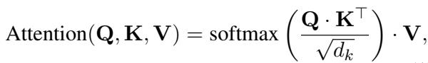

where $d _ { k }$ is the dimension of $\mathbf { K }$ . The result of Softmax $\left( \mathbf { Q } \cdot \mathbf { K } ^ { \top } / \sqrt { d _ { k } } \right)$ is a square matrix known as the attention map. Existing methods extract the corresponding attention maps from one or multiple layers and compute the average attention score for each visual token based on these attention maps:

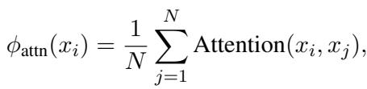

where Attention $( x _ { i } , x _ { j } )$ denotes the attention score between token $x _ { i }$ and token $x _ { j }$ , $\phi _ { \mathrm { a t t n } } ( x _ { i } )$ is regarded as the importance score of the token $x _ { i }$ , $N$ represents the number of visual tokens. Finally, based on the importance score of each token and the predefined reduction ratio, the most important visual tokens are selectively retained:

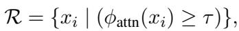

where $\mathcal { R }$ represents the set of retained visual tokens, and $\tau$ is a threshold determined by the predefined reduction ratio.

> 💡 **批注**: 这是 FastV/SparseVLM 等方法的标准范式：从 attention map 提取每个 token 的平均 attention score → 作为 importance → Top-k 保留。公式 (1)-(3) 完整描述了这个 pipeline。

---

Problems: Although this paradigm has demonstrated initial success in enhancing the efficiency of MLLMs, it is accompanied by several inherent limitations that are challenging to overcome.

One key limitation is disregarding the dynamic nature of token importance during pruning. For a token sequence $\{ x _ { 1 } , \ldots , x _ { n } \}$ , importance-based methods compute static token importance via a scoring function $s _ { i } = \mathcal { F } ( x _ { i } | \boldsymbol { X } )$ , where $X$ is the full token set. The strategy retains Top- $k$ tokens:

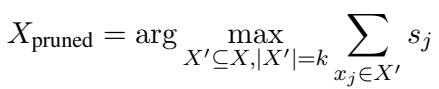

This implies an independence assumption: the score $s _ { j }$ remains unchanged for any subset $X ^ { \prime } \subset$ $X$ , ignoring dynamic token interactions. For example, if two similar tokens $x _ { p } , x _ { q }$ have $s _ { p } \approx s _ { q }$ , removing $x _ { q }$ should recalibrate $s _ { p }$ as:

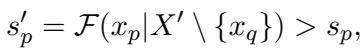

which leads to a bias in importance estimation $\Delta =$ $s _ { p } ^ { \prime } - s _ { p }$ . This contradiction between static scoring and dynamic interaction can be quantified as:

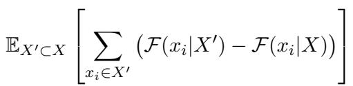

> 💡 **批注**: 这段数学论证非常精彩。核心论点：importance score 是在**完整 token 集合 X** 上计算的，但 pruning 后实际使用的是**子集 X'**。两者之间存在 gap $\Delta = s_p' - s_p$。公式 (6) 量化了这个 gap 的期望值，揭示了 static scoring 的根本缺陷。这也解释了为什么 importance-based 方法在高压缩率下崩溃——压缩越激进，X' 与 X 差距越大，$\Delta$ 越大。

---

Additionally, Figure 1 visualizes the results of token reduction, revealing that selecting visual tokens based on attention scores introduces a noticeable bias toward tokens in the lower-right region of the image, those appearing later in the visual token sequence. However, this region is not always the most significant in every image. Further, we present the outputs of various methods. Notably, FastV generates more hallucinations than the vanilla model, while DART effectively reduces them. We attribute this to the inherent bias of attention-based methods, which tend to retain tokens concentrated in specific regions, often neglecting the broader context of the image. In contrast, DART removes highly duplication tokens and preserves a more balanced distribution across the image, enabling more accurate and consistent outputs.

> 💡 **批注**: 位置偏差的可视化证据：attention score 偏好序列末尾的 token，对应图像右下角。DART 的 token 分布更均匀，这也解释了为什么 DART 能减少幻觉——更全面的视觉上下文 → 更少的信息缺失 → 更少的幻觉。

---

Furthermore, methods relying on attention scores for token importance are incompatible with Flash Attention, compromising speed, and sometimes even underperforming random token reduction in effectiveness (See Fig. 2).

> 💡 **批注**: 总结性一击：importance-based = 不兼容 FlashAttention + 不如 random。

---

# 3.3 Token Duplication: Rethinking Reduction

---

Given the numerous drawbacks associated with the paradigm of using attention scores to evaluate token importance for token reduction, what additional factors should we consider beyond token importance in the process of token reduction? Inspired by the intuitive ideas mentioned in $\ S 1$ and the phenomenon of tokens in transformers tending toward uniformity (i.e., over-smoothing) (Nguyen et al., 2023; Gong et al., 2021), we propose that token duplication should be a critical focus.

> 💡 **批注**: 引入 over-smoothing 现象作为 duplication 的理论基础——transformer 深层 token 趋向一致性，这意味着大量 token 高度重复，删除它们的信息损失极小。

---

Due to the prohibitively high computational cost of directly measuring duplication among all tokens, we adopt a paradigm that involves selecting a minimal number of pivot tokens.

Definition 1 (Pivot Tokens). Let $\begin{array} { r l } { \mathcal { P } } & { { } = } \end{array}$ $\left\{ p _ { 1 } , p _ { 2 } , \dotsc , p _ { k } \right\} \subseteq \mathcal { X }$ denote the pivot tokens, where $k \ \ll \ n$ and $n$ is the total length of the tokens ${ \mathcal { X } } = \{ x _ { 1 } , x _ { 2 } , \ldots , x _ { n } \}$ . The pivot tokens $\mathcal { P }$ are a subset of $\mathcal { X }$ , selected for their representativeness of the entire set.

> 💡 **批注**: Pivot token 是 DART 的核心概念。选 k 个（k ≪ n，实际用 8 个），将 O(n²) 的 token-to-token 相似度计算降为 O(kn)。

---

Given the pivot tokens, we can define the duplication score based on it.

Definition 2 ( $\epsilon$ -duplicate Score). The token duplication score between a pivot token $p _ { i }$ and a visual token $x _ { j }$ is defined as:

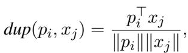

where $\| \cdot \|$ denotes the Euclidean norm. Two tokens $p _ { i } , x _ { j }$ are $\epsilon$ -duplicates if

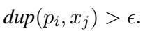

> 💡 **批注**: ε-duplicate score 就是余弦相似度。阈值 ε 由目标压缩率动态决定。

---

With the $\epsilon$ -duplicate score, for each pivot $p _ { i }$ , the associated retained token set is defined as:

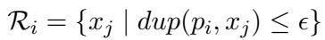

The final retained set is:

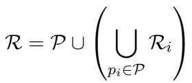

where $\epsilon$ is the threshold dynamically determined for each pivot $p _ { i }$ based on reduction ratio. This ensures that only tokens that are sufficiently different from the pivot tokens are kept.

> 💡 **批注**: 最终保留集 R = pivot tokens ∪ 所有与 pivot 不重复的 token。关键逻辑：与 pivot 高度相似的 token 被视为"重复品"并删除，因为 pivot 已经代表了这些信息。注意 pivot 本身始终保留。

---

Our method is orthogonal to the paradigm of using attention scores to measure token importance, meaning it is compatible with existing approaches.

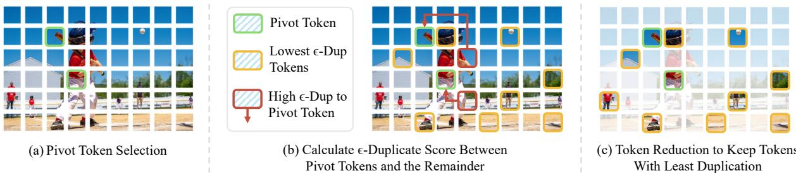
*Figure 3: The overview of DART. The process includes (a) selecting pivot tokens, (b) calculating ε-Duplicate scores between pivot tokens and other tokens, and (c) reducing tokens to retain those with the least duplication.*

> 💡 **Figure 3 批注**: DART 流程图：(a) 从 vision+text token 中选 pivot（K-norm 最大的），(b) 计算每个 token 与 pivot 的余弦相似度，(c) 保留相似度最低的 token。整个过程不需要 attention map，三步完成。

---

Specifically, we can leverage attention scores to select pivot tokens, and subsequently incorporate token duplication into the process.

However, this still does not fully achieve compatibility with Flash Attention. Therefore, we explored alternative strategies for selecting pivot tokens, such as using K-norm, $\scriptstyle \mathrm { V - n o r m } ^ { 2 }$ , or even random selection. Surprisingly, all these strategies achieve competitive performance across multiple benchmarks. This indicates that our token reduction paradigm based on token duplication is not highly sensitive to the choice of pivot tokens. Moreover, it suggests that removing duplicate tokens may be more critical than identifying "important tokens", highlighting token duplication as a more significant factor in token reduction. Detailed discussion on pivot token selection is provided in $\ S 5 . 2$

> 💡 **批注**: 这是 DART 最令人惊讶的发现之一：**pivot token 的选取方式几乎不影响性能**。随机选 pivot 也能工作得很好。这说明 duplication removal 本身才是关键，而非"找到正确的 pivot"。这也意味着 DART 完全不需要 attention score → 天然兼容 FlashAttention。

---

# 3.4 Theoretical Analysis

---

To further justify trustworthiness of our proposed method, we provide a theoretical analysis of it.

Assumption 1 (Transformer Property). For transformer property, we assume the following:

(A1). (Lipschitz continuity under Hausdorff distance). The model $f$ is Lipschitz continuous with respect to the Hausdorff distance between token sets. Formally, there exists $K > 0$ such that for any two token sets $\chi _ { 1 } , \chi _ { 2 } \subseteq \mathbb { R } ^ { d }$ :

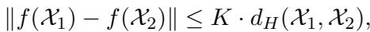

where $d _ { H } ( \mathcal { X } _ { 1 } , \mathcal { X } _ { 2 } ) \triangleq \operatorname* { m a x }$

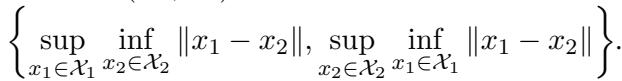

(A2). (Bounded embedding). All tokens have bounded Euclidean norms:

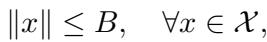

where $B > 0$ is a constant.

> 💡 **批注**: 两个假设：(A1) 模型关于 token 集合的 Hausdorff 距离满足 Lipschitz 连续——即输入 token 集的微小变化不会导致输出剧变；(A2) token 嵌入有界。两个假设都是合理的：(A1) 对于 softmax attention 的 transformer 在有界输入下成立；(A2) 实践中总是满足的（norm 有限）。

---

Lemma 1 (Bounded Distance). $\mathrm { m i n } _ { p _ { i } \in \mathcal { P } } | p _ { i } ~ -$ $x _ { j } | \leq ( 2 ( 1 - \epsilon ) ) ^ { 1 / 2 } B , \quad \forall x _ { j } \in \mathcal { X } \backslash \mathcal { R } .$

Proof. Using A2 and Definition 2, we obtain:

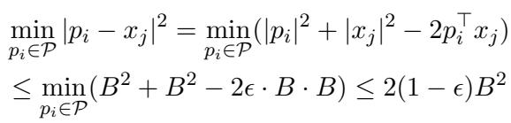

Therefore, the duplication distance bound is given by: $\begin{array} { r } { \operatorname* { m i n } _ { p _ { i } \in \mathcal { P } } | p _ { i } - x _ { j } | ^ { 2 } \leq ( 2 ( 1 - \epsilon ) ) ^ { 1 / 2 } B } \end{array}$

> 💡 **批注**: Lemma 1 将余弦相似度阈值 ε 转化为欧氏距离上界 √(2(1-ε))·B。直觉：ε 越高（要求越严格的重复判定），被删除 token 与最近 pivot 的距离越小 → 信息损失越小。

---

Lemma 2 (Bounded Approximation Error). Under Assumption $I$ , the Hausdorff distance between original and retained tokens satisfies:

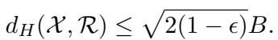

Proof. For any $x \in \mathcal { X }$ :

• If $x \in \mathcal { R }$ , then $\begin{array} { r } { \operatorname* { i n f } _ { r \in { \mathcal { R } } } \| x - r \| = 0 } \end{array}$ • If $x \notin \mathcal { R }$ , by definition and Lemma 1 there exists $p _ { i } \in \mathcal { P } \subseteq \mathcal { R }$ with $\| x - p _ { i } \| \leq \sqrt { 2 ( 1 - \epsilon ) } B$

Thus:

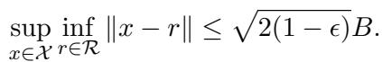

Since $\mathcal { R } \subseteq \mathcal { X }$ , Hausdorff distance simplifies to: $\begin{array} { r } { d _ { H } ( \mathcal { X } , \mathcal { R } ) ~ = ~ \operatorname* { s u p } _ { x \in \mathcal { X } } \operatorname* { i n f } _ { r \in \mathcal { R } } \| x - r \| ~ \le ~ } \end{array}$ $\sqrt { 2 ( 1 - \epsilon ) } B$ .

> 💡 **批注**: Lemma 2 将 Lemma 1 推广到整个 token 集合：原始集 X 和保留集 R 之间的 Hausdorff 距离有上界。因为 R ⊆ X，所以 Hausdorff 距离退化为单向 sup-inf 距离。

---

Theorem 1 (Performance Guarantee). Under Assumptions $I$ , the output difference between original and pruned token sets is bounded by:

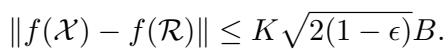

Proof. Direct application of Lipschitz continuity (A1) with Lemma 2: $\| f ( \mathcal { X } ) - f ( \mathcal { R } ) \| \ \leq \ K \ .$ $d _ { H } ( \mathcal { X } , \mathcal { R } ) \leq K \sqrt { 2 ( 1 - \epsilon ) } B$ .

This provides a theoretical guarantee that DART preserves model output within a controllable bound, thereby supporting the trustworthiness and robustness of our method.

> 💡 **批注**: Theorem 1 是 DART 的理论保障：输出误差 ≤ K√(2(1-ε))B。三个可控因子：
> - K：模型的 Lipschitz 常数（模型固有属性）
> - ε：duplication 阈值（由压缩率决定，压缩越少 ε 越高，误差越小）
> - B：嵌入范数上界（固定）
> 
> 注意这个上界对 **任何** pruning 后的 token 集合都成立，不依赖于 pivot 选取策略——这与实验中"pivot 选取不敏感"的观察一致。不过需要注意，Lipschitz 假设在实际 transformer 中可能较松，因此这是一个定性保证而非精确定量。

---

## 🔖 Section 总结

### 核心公式速查
| 概念 | 公式 |
|------|------|
| ε-duplicate score | cos(p_i, x_j) > ε |
| 保留集 | R = P ∪ {x_j \| dup(p_i, x_j) ≤ ε} |
| 误差上界 | ‖f(X) - f(R)‖ ≤ K√(2(1-ε))B |

### 核心洞察
1. Importance-based pruning 的静态评分与动态 pruning 矛盾（公式 4-6）
2. DART 用 O(kn) 的 pivot-based 余弦相似度替代 O(n²) 的 attention score
3. Pivot 选取不敏感 → duplication 本身才是关键
4. 理论误差上界随 ε 增大而减小，提供了压缩率-精度 tradeoff 的数学保障
