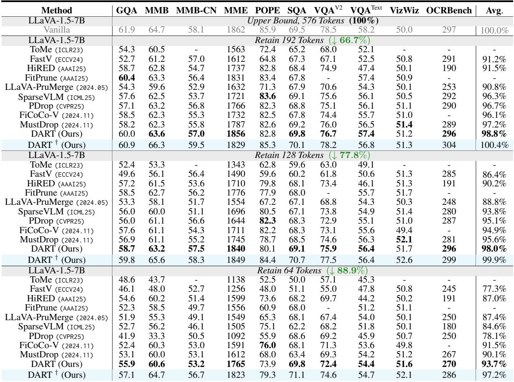
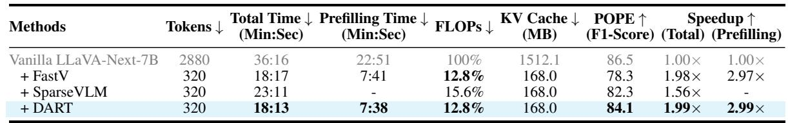
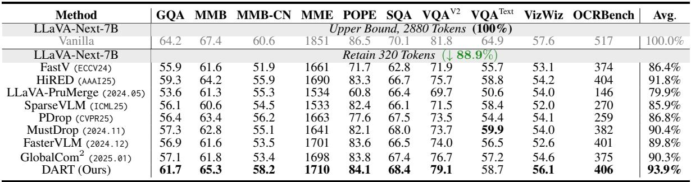
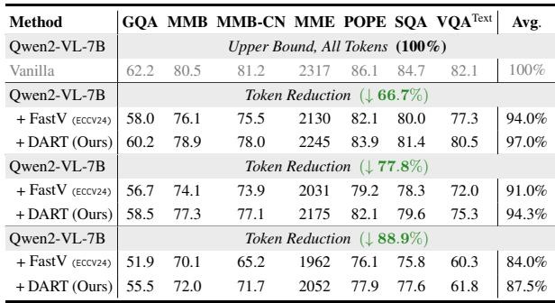
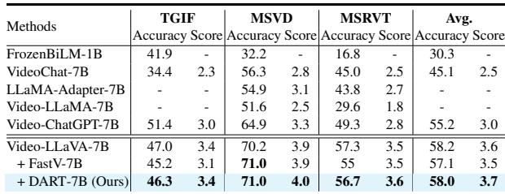
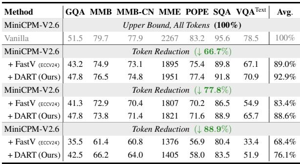

[← 返回 README](../README.md)

# 4 Experiments

## 📌 预览
实验部分展示 DART 在 4 个 MLLM（LLaVA-1.5-7B, LLaVA-Next-7B, Qwen2-VL-7B, MiniCPM-V2.6）上的图像理解任务表现，以及 Video-LLaVA 上的视频理解结果。关键结论：DART 在各压缩率下均显著优于 SOTA，88.9% 压缩时领先第二名 2.2%。

---

Experiment Setting. We conduct experiments on over four MLLMs across ten image-based and four video-based benchmarks. For details on implementation, please refer to Appendix C.

> 💡 **批注**: 实验覆盖面：4 个 MLLM × 10+ benchmark，是 token pruning 领域最全面的评测之一。

---

# 4.1 Main Results

---

Image understanding task. The results presented in Tables 1 and 3 highlight DART's exceptional performance across diverse image understanding tasks under varying token configurations. We observe that (i) with only 192 tokens, DART achieves an impressive $9 8 . 8 \%$ average performance, substantially outperforming second-best MustDrop by $\mathbf { 1 . 6 \% }$ . (ii) This trend strengthens under aggressive reduction ratios, with DART leading by $\mathbf { 2 . 2 \% }$ using just 64 tokens. (iii) Moreover, DART scales seamlessly to advanced and larger models like LLaVA-Next-7B and Qwen2-VL-72B (See Tab. 7), achieving $\mathbf { 9 3 . 9 \% }$ with only $1 1 . 1 \%$ tokens, outperforming all competitors significantly. (iv) Inspired by (Wen et al., 2025), we apply DART during training. DART † in Table 1 shows better performanceefficiency trade-offs, maintaining full performance with just 192 visual tokens, highlighting the strong adaptability of our method. These results demonstrate DART's efficiency in leveraging limited tokens while preserving critical information, showcasing robust performance across tasks, model architectures, and model size. For more comparisons, please refer to Tables 4, 5, and Appendix A.3.

> 💡 **批注**: 四个关键发现：
> 1. **192 tokens (66.7% 压缩)**：98.8% 性能，超 MustDrop 1.6%
> 2. **64 tokens (88.9% 压缩)**：93.7%，超第二名 2.2%——压缩越激进，DART 优势越大
> 3. **跨模型泛化**：LLaVA-Next-7B 上 93.9%，Qwen2-VL-72B 上也表现优异
> 4. **DART†（训练时应用）**：192 token 下达到 100.4% 原始性能（超过原模型！），说明训练时去重可以当作正则化

---

*Table 1: Comparative experiments on image understanding. In all experiments for DART, tokens are pruned after the second layer with 8 pivot tokens. The pivot tokens are selected based on the maximum K-norm. DART † indicates that DART is applied during the training stage of LLaVA-1.5-7B.*

> 💡 **Table 1 批注**: 这是最核心的实验表。关注几个亮点：
> - **64 tokens 设定**（最激进）：DART 93.7% vs FiCoCo-V 91.5% vs MustDrop 90.1%，领先幅度随压缩率增大而增大
> - **DART†** 在 192 tokens 下 Avg = 100.4%（超过原模型），64 tokens 下 97.2%
> - FastV 在 64 tokens 下仅 77.3%，SparseVLM 84.6%——远不如 DART
> - 设定：layer 2 pruning，8 pivot tokens，K-norm 选取

---

*Table 2: Inference costs of the number of tokens, Total-Time, Prefilling-Time, FLOPs, and KV Cache Memory.*

> 💡 **Table 2 批注**: 效率对比表。DART vs FastV 在同等 token 数（320）下：
> - 总时间：18:13 vs 18:17（几乎相同）
> - Prefill 时间：7:38 vs 7:41（几乎相同）
> - POPE F1：84.1 vs 78.3（DART 高 5.8 分！）
> - SparseVLM 虽然也 320 tokens，但因为不兼容 FlashAttention，总时间 23:11，比 DART 慢 27%
> - 关键洞察：FLOPs 相近但速度差异大 → FLOPs 不是好的效率指标

---

*Table 3: Comparative experiments are performed on LLaVA-Next-7B using the same settings as LLaVA-1.5-7B.*

> 💡 **Table 3 批注**: LLaVA-Next-7B（2880 tokens → 320 tokens，88.9% 压缩）：
> - DART 93.9% vs 第二名 HiRED 91.8%，领先 2.1%
> - FastV 仅 86.4%，比 DART 低 7.5%
> - 高分辨率场景下（2880 tokens），token 冗余更严重 → DART 优势更明显

---

Video Understanding Task. To assess DART's capabilities in video understanding, we integrate it with Video-LLaVA (Lin et al., 2023) and benchmark it against state-of-the-art methods, including FastV (Chen et al., 2024). Following established protocols, Video-LLaVA processes videos by sampling 8 frames and extracting 2048 vision tokens, with $5 0 \%$ retained for evaluation. As demonstrated in Table 6, DART surpasses FastV across all benchmarks, achieving a notable 4.0 score on MSVD, $4 6 . 3 \%$ accuracy on TGIF, and $5 6 . 7 \%$ accuracy on MSRVT. With an average accuracy of $5 8 . 0 \%$ and an evaluation score of 3.7, DART demonstrates superior reasoning over complex multimodal data.

> 💡 **批注**: 视频理解实验中 DART 在 50% token 保留下全面超过 FastV，平均准确率 58.0% vs 57.1%，评分 3.7 vs 3.5。虽然提升幅度不如图像理解大，但视频场景下 50% 压缩率相对温和。

---

*Table 4: Comparative Experiments on Qwen2-VL-7B.*

> 💡 **Table 4 批注**: Qwen2-VL-7B 上 DART vs FastV：
> - 66.7% 压缩：97.0% vs 94.0%
> - 88.9% 压缩：87.5% vs 84.0%
> - DART 在各压缩率下均领先 ~3%

---

*Table 5: Comparative Experiments on MiniCPM-V2.6.*

> 💡 **Table 5 批注**: MiniCPM-V2.6 上差距更大：
> - 77.8% 压缩：DART 88.6% vs FastV 83.4%（领先 5.2%）
> - 88.9% 压缩：DART 76.1% vs FastV 68.4%（领先 7.7%）
> - MiniCPM 对 token pruning 更敏感，但 DART 的衰退更为平缓

---

*Table 6: Comparing MLLMs on Video Understanding tasks with 50% visual tokens retained.*

---

*Figure 4: Performance-Latency trade-off comparisons across different datasets on LLaVA-Next-7B. DART consistently achieves better performance under varying latency constraints compared to other approaches.*

> 💡 **Figure 4 批注**: Performance-Latency Pareto 曲线，DART 在所有四个 benchmark 上都位于 Pareto 前沿（右上角）。特别注意：某些方法（如 SparseVLM、MustDrop）在实际延迟上表现很差，即使 FLOPs 看起来不高——因为它们需要关闭 FlashAttention 或有顺序依赖。
