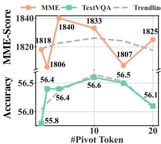
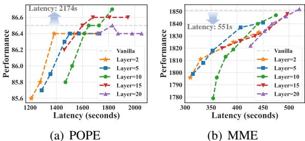
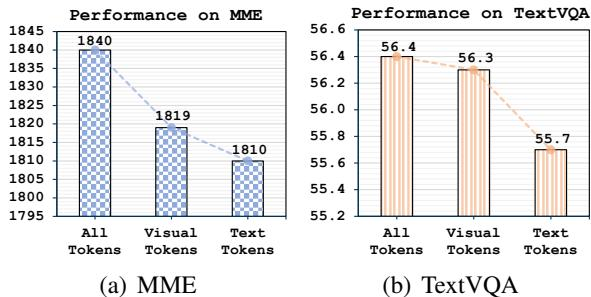

[← 返回 README](../README.md)

# 5 Analysis and Discussion

## 📌 预览
分析部分包含四个子话题：(1) 效率分析——DART 实际加速 1.99×/2.99×；(2) Pivot token 选取的鲁棒性——随机选也行；(3) 剪枝层和 pivot 数量的影响；(4) Pivot token 的模态来源——视觉和文本都重要。

---

# 5.1 Efficiency Analysis

---

As shown in Table 2, we compare the total inference time, prefill time, FLOPs, and KV cache memory of multiple methods. (i) DART achieves a $2 . 9 9 \times$ speedup in prefill and $\mathbf { 1 . 9 9 } \times$ speedup in inference, while its performance on POPE degrades by less than $3 \%$ versus the vanilla model. (ii) Analysis reveals although FLOPs reduction is similar across methods, their speeds vary significantly. For instance, SparseVLM increases FLOPs by $2 . 8 \%$ versus DART, but its speedup drops $2 1 . 6 \%$ , showing FLOPs alone poorly measure acceleration. (iii) We evaluate performance-latency trade-offs using actual latency. Figure 4 shows some methods underperform random token retention. SparseVLM and MustDrop suffer speed degradation from sequential token processing. FastV's biased attention scores yield worse performance. In contrast, DART integrates Flash Attention with under 0.08s overhead, achieving better performance-speed balance.

> 💡 **批注**: 三个重要结论：
> 1. **实际加速**：prefill 2.99×，总推理 1.99×，POPE 仅降 3%——非常实用
> 2. **FLOPs ≠ 速度**：SparseVLM 比 DART 多 2.8% FLOPs，但慢 21.6%。原因：关闭 FlashAttention + 顺序处理
> 3. **DART 额外开销仅 0.08s**：pivot 选取 + 相似度计算几乎免费

---

# 5.2 Influence from Selection of Pivot Tokens

---

In this section, we investigate whether pivot token selection in DART significantly affects its performance. Table 8 in Appendix A.1 evaluates pivot tokens based on criteria such as maximum $\mathbf { \Psi } ( \spadesuit )$ , minimum $( \heartsuit )$ attention scores, K-norm, V-norm, and random selection. Results show that various strategies achieve over $9 4 . 9 \%$ of the vanilla model's performance across benchmarks. Even DART with randomly selected pivot tokens incurs only a $\overline { { 1 . 2 \% } }$ performance drop compared to the best strategy and outperforms the previous importance-based methods by $\overline { { 2 . 1 \% } }$ . This observation shows the robustness in the selection of pivot tokens in DART, and highlights the crucial role of duplication in token reduction, as selecting "important" pivot tokens based on attention scores is only $0 . 2 \%$ better than selecting "unimportant" ones as pivot tokens.

> 💡 **批注**: 这是全文最具洞察力的实验之一：
> - Random pivot：96.0%（标准差仅 ±0.3~0.7%）
> - 最优策略（V-norm♠）：97.2%
> - "重要" pivot（A-Score♠）vs "不重要" pivot（A-Score♡）：仅差 0.2%！
> - 所有 DART 变体都超过 SparseVLM (93.9%) 和 FastV (81.5%)
> 
> 结论：**pivot 怎么选不重要，删重复才是关键**。这从侧面证明了 importance 本身不是好的 pruning 指标。

---

Furthermore, on the MME benchmark, we analyze the visual tokens retained by selecting pivot tokens based on $\scriptstyle \mathrm { K - n o r m } ^ { \bullet }$ and $\mathbf { K } \mathrm { - n o r m } ^ { \odot }$ . Interestingly, statistical analysis shows that the overlap between tokens preserved by these two strategies is, on average, less than $50 \%$ . Despite this low overlap, both strategies achieve highly effective results, indicating the existence of multiple distinct groups of tokens which should not be pruned. This finding challenges the conventional notion of a single critical token set defined by importance scores, demonstrating that diverse token subsets with minimal overlap can yield comparable performance.

> 💡 **批注**: K-norm♠ 和 K-norm♡ 保留的 token 重叠不到 50%，但性能相当！这是对 importance-based paradigm 的致命打击：不存在唯一的"最优 token 集合"，而是存在多个等价的好集合。这个发现暗示 MLLM 对视觉信息的利用存在高度冗余。

---

# 5.3 Influence from Choice of the Pruned Layer and the Number of Pivot Tokens

---

We explore the impact of layer on model performance. As expected, pruning deeper layers yields performance closer to the vanilla model but increases latency, as shown in Figure 6. However, we observe two intriguing findings: (i) Pruning at layers 10, 15, and 20 surprisingly outperforms the vanilla model (Fig. 6(a)), consistent with Fig. 1, suggesting that removing duplicate tokens may reduce hallucinations in MLLMs on the POPE. (ii) At deeper layers (e.g., 15, 20), the latency-minimizing points correspond to pruning all vision tokens, yet performance drops only by ${ \bf 0 . 1 \% } \mathrm { \sim } { \bf 1 . 6 \% }$ . This highlights a modality imbalance in MLLMs, indicating underutilization of the visual modality. Furthermore, we delved into the impact of the number of pivot tokens on performance. As depicted in Figure 5, choosing either an insufficient or an excessive number of pivot tokens leads to suboptimal outcomes. When a limited number of pivot tokens (e.g., one or two), the lack of diversity among these tokens may impede their ability to comprehensively represent the entire feature space. In contrast, when an overly large number of pivot tokens, for example, 20 or more, are chosen, the majority of retained visual tokens tend to be pivot tokens. In extreme cases, our approach starts to resemble the importance-based method, where pivot tokens essentially transform into important tokens, overlooking the impact of duplication factors.

> 💡 **批注**: 两个惊人发现：
> 1. **Token pruning 减少幻觉**：Layer 10/15/20 pruning 后 POPE 超过原模型！删除重复 token 可能减少了模型对冗余视觉信息的过度拟合。
> 2. **深层删除所有 vision token 性能仅降 0.1~1.6%**：说明视觉信息在前几层就已经被编码到文本 token 中了（与 FastV 的"anchor token"假说一致）。这暴露了 MLLM 中严重的模态不平衡——视觉模态被严重低利用。
> 3. **Pivot 数量**：太少（1-2）不够多样，太多（20+）退化为 importance-based。Sweet spot 在 4-8 个。

---

*Figure 5: Impact of the number of pivot tokens.*

> 💡 **Figure 5 批注**: 4-8 个 pivot token 是最佳区间。1-2 个时性能明显下降，20+ 时开始退化。注意即使在极端设定下，DART 仍优于 FastV/SparseVLM。

---

*Figure 6: Influence from the layer for token pruning.*

> 💡 **Figure 6 批注**: 
> - 6(a) POPE：Layer 10-20 pruning 超过 vanilla（虚线），印证 token pruning 减少幻觉
> - 6(b) TextVQA：越深 pruning 性能越好，但加速越少——经典 accuracy-latency tradeoff
> - Layer 2 是论文默认设定，在加速和性能间取得平衡

---

# 5.4 Influence from Modalities of Pivot Tokens

---

We further analyze the impact of the source of pivot tokens on the overall performance of DART, with a particular focus on understanding whether guidance from the language modality is essential for effective token reduction. We evaluate the performance implications of selecting pivot tokens exclusively from either the visual or text modality, aiming to quantify the influence of each modality. As illustrated in Figure 7, the absence of pivot tokens from either modality leads to a noticeable decline in performance. This demonstrates that information from both modalities contributes to the token reduction process to varying degrees. Moreover, it highlights that we provide an effective method for incorporating textual guidance without the need to explicitly compute cross-modal attention scores while remaining compatible with Flash Attention.

> 💡 **批注**: Pivot 来源实验显示双模态（visual + text）pivot 优于单模态。这说明文本 token 提供了任务相关的语义指导——与 pivot 相似的 vision token 更可能是与 query 相关的冗余信息。DART 无需显式计算跨模态 attention 就能利用文本信息，巧妙地绕过了 FlashAttention 不兼容问题。

---

*Figure 7: Analysis of pivot token sources: "ALL Tokens" selects from both visual and textual modalities, while "Visual Tokens" and "Text Tokens" select exclusively from visual or textual modalities, respectively.*

> 💡 **Figure 7 批注**: "ALL Tokens" 在所有 benchmark 上表现最佳或持平。有趣的是，某些 benchmark 上 "Text Tokens" 作 pivot 比 "Visual Tokens" 更好（如 MME），说明文本模态对 pruning 指导的贡献在特定任务上更大。
