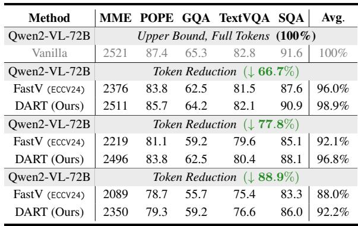
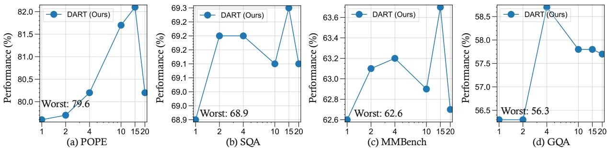
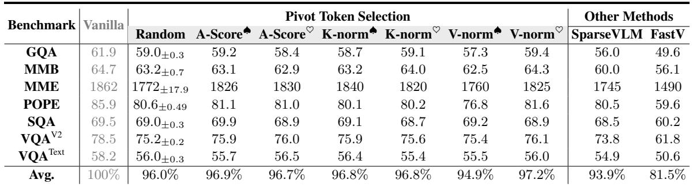
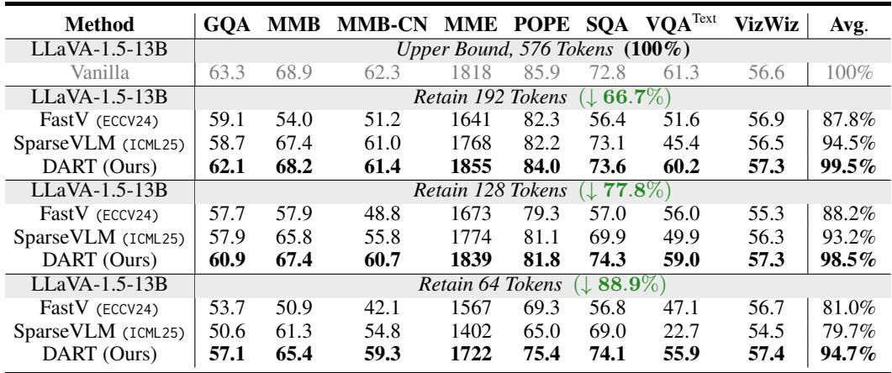
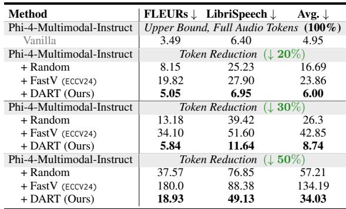
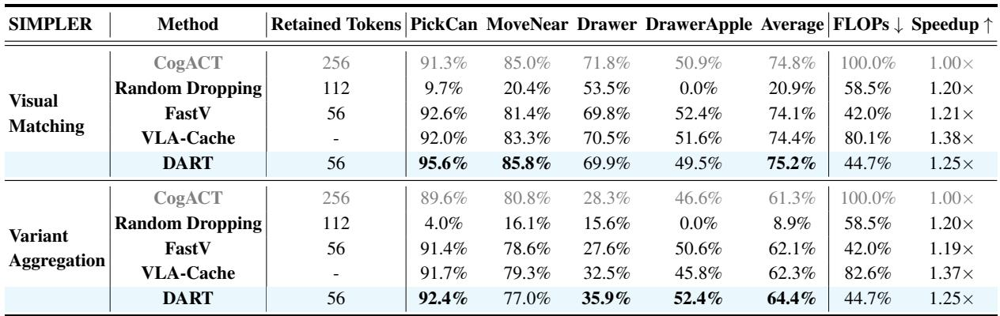
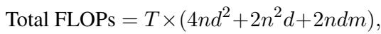
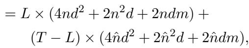
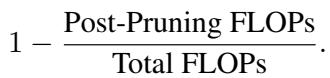
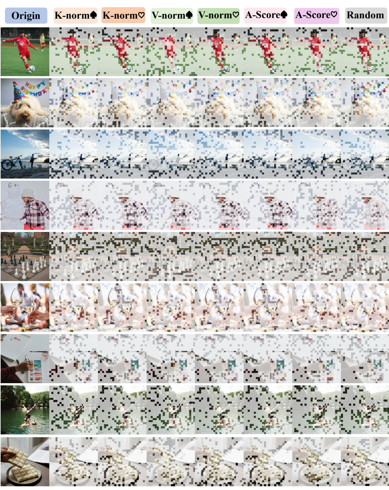

[← 返回 README](../README.md)

# Appendix

## 📌 预览
附录包含：(A) 额外实验——pivot 选取策略、pivot 数量影响、更大模型验证；(B) 扩展场景——语音模态（ASR）和 VLA 机器人操作；(C) 实验设置详情；(D) 计算复杂度分析；(E) 未来工作；(F) 可视化。

---

# A Additional Experiments

# A.1 Supplementary Results on Pivot Token Selection

---

This section presents comprehensive experimental results conducted on the LLaVA-1.5-7B model, supporting the analysis of pivot token selection strategies within DART. Table 8 details performance metrics across multiple benchmarks, including GQA, MMB, MME, POPE, SQA, and VQA, with all experiments retaining 128 vision tokens. These findings further validate the robustness of DART under various pivot token selection criteria, ranging from random selection to methods based on attention scores and norm-based approaches. The table also includes comparisons with baseline methods (e.g., SparseVLM and FastV), highlighting the consistent superiority of DART across different configurations. For additional insights, refer to the main discussion in $\ S 5 . 2$ .

> 💡 **批注**: Table 8 是 §5.2 的数据支撑，详细展示了 7 种 pivot 选取策略的性能。最关键的数字：所有策略都 ≥94.9%，而 SparseVLM 93.9%，FastV 仅 81.5%。

---

*Table 8: Analysis on how to select the pivot token. This study evaluates pivot tokens, comprising a fixed set of 4 visual and 4 text tokens, using various criteria with 128 retained tokens.*

> 💡 **Table 8 批注**: 逐行解读：
> - V-norm♠ 最优（97.2%），K-norm♠ 次之（96.8%）
> - Random 96.0%（std 很低）→ 极其鲁棒
> - A-Score♠ vs A-Score♡ 仅差 0.2% → "重要" vs "不重要" pivot 几乎无差
> - V-norm♡ 最差（94.9%），但仍远超 FastV（81.5%）
> - 结论：pivot 选取的 ceiling 和 floor 仅差 2.3%，但所有变体都碾压 baseline

---

# A.2 Influence from the Number of Pivot Tokens

---

Beyond the investigation of pivot token numbers on MME and TextVQA in $\ S 5 . 3$ , we conduct additional experiments on several representative visual benchmarks to further support our insight. Figure 8 illustrates that our observations on benchmarks such as POPE and SQA align with those in $\ S 5 . 3$ —namely, that both insufficient and excessive pivot tokens can lead to suboptimal performance. While an insufficient or excessive number of pivot tokens may result in suboptimal outcomes, our statistical analysis reveals that even the worst-performing settings still match or surpass the performance of existing token pruning approaches. This further demonstrates the superiority of DART.

> 💡 **批注**: 即使在最差的 pivot 数量设定下，DART 仍不输现有方法——方法的鲁棒性非常强。

---

*Figure 8: Impact of the number of pivot tokens on performance across additional visual benchmarks. All experiments are conducted with a token reduction ratio of 77.8%.*

> 💡 **Figure 8 批注**: POPE 和 SQA 上的趋势与 MME/TextVQA 一致：4-8 pivot 最优，极端值衰退但仍优于 baseline（灰色虚线）。

---

# A.3 More Experimental Results on Larger MLLMs

---

While prior experiments primarily focused on models with 7B parameters, we further validate the effectiveness and robustness of DART on substantially larger models, including LLaVA-v1.5-13B3 and Qwen2-VL- ${ } . 7 2 \mathrm { B } ^ { 4 }$ . Our results demonstrate that DART consistently outperforms prior token pruning methods such as FastV (Chen et al., 2024) and SparseVLM (Zhang et al., 2024c) across various pruning ratios and downstream tasks, while maintaining near-Vanilla performance.

> 💡 **批注**: 大模型验证：LLaVA-1.5-13B 和 Qwen2-VL-72B。DART 的优势在大模型上依然显著甚至更大。

---

*Table 7: Comparative experiments on Qwen2-VL-72B.*

> 💡 **Table 7 批注**: Qwen2-VL-72B：
> - 66.7% 压缩：DART 98.9% vs FastV 96.0%
> - 88.9% 压缩：DART 92.2% vs FastV 88.0%（领先 4.2%）
> - 72B 模型上 DART 的优势持续扩大

---

As shown in Table 9, on LLaVA-1.5-13B with an $8 8 . 9 \%$ pruning ratio, DART achieves $9 4 . 7 \%$ average performance, significantly outperforming SparseVLM $( 7 9 . 7 \% )$ and FastV $( 8 1 . 0 \% )$ . Similarly, on Qwen2-VL-72B, DART reaches $9 2 . 2 \%$ under the same pruning ratio, surpassing FastV $( 8 8 . 0 \% )$ (Table 7). At a moderate $6 6 . 7 \%$ pruning ratio, DART retains $9 9 . 5 \%$ and $9 8 . 9 \%$ accuracy on LLaVA-1.5-13B and Qwen2-VL-72B, respectively, with minimal degradation.

DART also excels on specific tasks, achieving $6 0 . 9 \ : \mathrm { G Q A }$ on LLaVA-1.5-13B at $7 7 . 8 \%$ pruning and 90.9 ScienceQA on Qwen2-VL-72B at $6 6 . 7 \%$ , both outperforming FastV. These results demonstrate DART 's scalability and its ability to balance compression and performance in large MLLMs.

> 💡 **批注**: 13B 上 88.9% 压缩：DART 94.7% vs SparseVLM 79.7%（领先 15%！）。SparseVLM 在大模型高压缩场景下严重崩溃，而 DART 表现稳健。

---

*Table 9: Comparative experiments on LLaVA-1.5-13B.*

---

# B Extensions to Other Scenarios

# B.1 Exploring the Effectiveness of DART in Audio Modalities

---

In recent years, the integration of audio as a core modality (Abouelenin et al., 2025; Team, 2024; Chu et al., 2024) within Multimodal Large Language Models (MLLMs) has garnered increasing attention. As these models evolve to handle complex, real-world tasks that span language, vision, and sound, the ability to effectively process spoken language becomes crucial. Audio understanding, particularly in the form of automatic speech recognition (ASR), plays a foundational role in applications such as virtual assistants, transcription services, voice-controlled systems, and multimodal reasoning agents. Therefore, beyond the widely explored domains of image and video understanding in the visual modality, we further extend our investigation to evaluate the effectiveness of our proposed method on tasks within the audio modality. To conduct our study, we select Phi-4- Multimodal-Instruct5, an MLLM with strong audio modality capabilities, and evaluate it on two representative speech benchmarks: FLEURs-en (Conneau et al., 2023) and LibriSpeech-long (Park et al., 2024). As demonstrated in Table 10, our proposed method DART consistently outperforms baseline approaches under varying token reduction ratios on both FLEURs-en and LibriSpeech-long benchmarks. While random pruning and FastV result in substantial degradation in recognition performance, particularly under higher reduction rates, DART maintains significantly lower Word Error Rates (WER), showcasing its robustness and effectiveness in preserving critical audio information even with limited token usage.

> 💡 **批注**: DART 跨模态迁移到语音！在 Phi-4-Multimodal 上测试 ASR：
> - 20% 压缩：DART WER 6.00 vs Random 16.69 vs FastV 23.86
> - 50% 压缩：DART 34.03 vs FastV 134.19（FastV 完全崩溃）
> - 这说明 duplication-based pruning 的原理是**模态无关**的——不管是视觉还是音频 token，冗余都可以通过相似度检测。

---

*Table 10: Comparative experiments on Automatic Speech Recognition tasks.*

---

# B.2 Enhancing VLA Efficiency with DART

---

Building on recent progress in multimodal understanding from vision-language models (Awadalla et al., 2023; Li et al., 2022; Radford et al., 2021; An et al., 2024; Luo et al., 2024), Vision-LanguageAction (VLA) models represent a significant step toward embodied intelligence. Systems such as OpenVLA (Kim et al., 2024), CogACT (Li et al., 2024a), $p i _ { 0 }$ (Black et al., 2024), and RT-2(Brohan et al., 2023) seamlessly translate multimodal inputs into executable actions. Leveraging large-scale datasets (Fang et al., 2024; O'Neill et al., 2024), these models have demonstrated impressive capabilities in complex robotic manipulation and reasoning tasks. As a potential pathway toward Artificial General Intelligence (AGI), we place great emphasis on improving the efficiency of VLA models through our approach.

To this end, we employ the SIMPLER environment (Li et al., 2024b), a simulation-based benchmark specifically designed for table-top manipulation to evaluate our method. SIMPLER aims to closely mirror real-world dynamics observed in robots such as the Google Robot and WidowX, exhibiting strong consistency between simulated and real-world performance. In this setup, the VisionLanguage-Action (VLA) model receives $2 2 4 \times 2 2 4$ RGB image observations along with natural language task instructions (e.g., "Pick coke can") and generates a sequence of actions in 7-DoF Cartesian space. SIMPLER supports two evaluation configurations: Visual Matching, which emphasizes visual fidelity to real-world scenes, and Variant Aggregations, which introduces variability through changes in lighting, background, and surface textures. For the Google Robot, both configurations include the same set of four tasks: Pick coke can; Move near; Open/close drawer and Open top drawer and place apple. Performance is assessed using success rate as the evaluation metric.

> 💡 **批注**: VLA（Vision-Language-Action）是 DART 的另一个应用场景。机器人操作中实时性至关重要，token pruning 可以直接降低推理延迟。

---

As shown in Table 11, DART demonstrates superior performance compared to other baseline methods in the SIMPLER environment. With only 56 retained visual tokens, DART achieves the highest average success rates of $7 5 . 2 \%$ and $6 4 . 4 \%$ in Visual Matching and Variant Aggregation, respectively, outperforming Random Dropping (Wen et al., 2025), FastV (Chen et al., 2024), VLA-Cache (Xu et al., 2025), and even vanilla CogACT (Li et al., 2024a). Moreover, DART significantly reduces computational cost, achieving the lower FLOPs $( 4 4 . 7 \% )$ , which corresponds to a speedup of $1 . 2 5 \times$ compared to the CogACT. These results highlight DART 's efficiency in maintaining high task performance while substantially reducing computational demands.

> 💡 **批注**: DART 在 VLA 上甚至**超过原始模型**（75.2% vs 74.8%），同时 FLOPs 降至 44.7%！这与图像理解中的发现一致——删除冗余 token 可以减少噪声，反而提升性能。1.25× 加速对实时机器人控制很有价值。

---

*Table 11: Performance of DART on the CogACT versus the other baselines in the SIMPLER environment.*

---

# D Computational Complexity

---

To evaluate the computational complexity of MLLMs, it is essential to analyze their core components, including the self-attention mechanism and the feed-forward network (FFN). The total floating-point operations (FLOPs) required can be expressed as:

where $T$ denotes the number of transformer layers, $n$ is the sequence length, $d$ represents the hidden dimension size, and $m$ is the intermediate size of the FFN. This equation highlights the significant impact of sequence length $n$ on computational complexity. Notable, we follow FastV (Chen et al., 2024) to roughly estimate various token reduction baseline FLOPs. The FLOPs after token pruning can be represented as:

where $L$ denotes the pruned layer, $\hat { n }$ represents token sequence length after pruning. The theoretical FLOPs reduction ratio related to visual tokens is computed as:

> 💡 **批注**: FLOPs 分析：pruning 后 FLOPs 由两部分组成——L 层前用完整序列，L 层后用缩短序列。序列长度 n 影响 attention（O(n²d)）和 FFN（O(ndm)），所以 token pruning 同时加速两个模块。

---

# E Future Works

---

As can be observed from Figure 1 and Figure 6(a), in certain cases, token pruning contributes to the reduction of hallucinations. Our method achieved better results than the vanilla model on the POPE benchmark, which is specifically designed for evaluating the hallucination issues of multimodal large language models. Therefore, we believe that it is worth exploring in the future why token pruning is beneficial for reducing hallucinations and how we can better utilize efficient techniques (e.g., token pruning, and token merge) to reduce hallucinations while achieving acceleration benefits.

> 💡 **批注**: Token pruning 减少幻觉的机理值得深入研究。可能的解释：(1) 冗余 token 在 attention 中创造了"信息茧房"，导致模型过度依赖局部视觉特征；(2) 去重后注意力更均匀分布 → 更全面的场景理解。

---

# F Sparsification Visualization on Different Pivot Token Selection Strategy

---

Figure 9 showcases a diverse array of sparsification visualization examples on different pivot token selection strategy, including K-norm♠, K-norm♡, V-norm♠, V-norm♡, Attention Score♠, Attention Score♡, and Random. Here, we can observe two interesting points: (i) The commonality is that DART employs different pivot token selection strategies for token reduction, and the retained tokens are distributed in a relatively scattered manner without obvious bias, i.e., spatial uniformity, which contributes to a more accurate understanding of the entire image and consistent responses. (ii) The difference lies in the fact that although each strategy achieves comparable performance, it is noticeable that the final set of retained tokens varies significantly across strategies, indicating the existence of multiple token sets that can deliver satisfactory results. This further corroborates the limitation of selecting a unique set of tokens based solely on importance scores.

> 💡 **批注**: 可视化完美总结了 DART 的两大特性：
> 1. **空间均匀性**：所有策略保留的 token 都分布均匀，无位置偏差（对比 FastV 的右下角集中）
> 2. **多样等价性**：不同策略保留的 token 集不同，但性能相当 → 不存在唯一最优集

---

*Figure 9: Sparsification Visualization examples of DART on different Pivot Token Selection Strategy.*

> 💡 **Figure 9 批注**: 七种策略的可视化。红色方块标注保留的 token 位置。所有策略都呈现散点分布（非聚集），验证了 DART 无位置偏差的核心优势。
