## **ToDRE: Effective Visual Token Pruning via Token Diversity and Task Relevance**

Duo Li [1][*] Zuhao Yang [1][*] Xiaoqin Zhang [2] Ling Shao [3] Shijian Lu [1][†]

1CCDS, NTU, Singapore 2CCST, ZJUT, China 3Terminus AI Lab, UCAS, China

Email Contact: {duo001, yang0756}@e.ntu.edu.sg

**Abstract**

_Visual token pruning aims to compress and prune redundant_
_visual tokens which play a critical role in efficient inference_
_with large vision-language models (LVLMs)._ _However, most_
_existing_ _work_ _estimates_ _visual_ _redundancy_ _using_ _a_ _single_
_metric, such as cross-modal attention or visual token simi-_
_larity._ _We show that visual token diversity and task-specific_
_token relevance are two crucial yet orthogonal factors that_
_complement each other in conveying useful information and_
_should therefore be treated separately for more effective vi-_
_sual token pruning._ _Building upon this insight, we design_
**TODRE** _, a two-stage and training-free framework that in-_
_corporates_ _**To**_ _ken_ _**D**_ _iversity and task_ _**RE**_ _levance for effective_
_token compression and efficient LVLM inference._ _Instead of_
_pruning redundant tokens, we introduce a greedy max-sum_
_diversification_ _algorithm_ _that_ _selects_ _and_ _retains_ _a_ _subset_
_of diverse and representative visual tokens after the vision_
_encoder._ _On top of that, ToDRE leverages an “information_
_migration” mechanism to eliminate task-irrelevant visual to-_
_kens within certain decoder layers of large language model_
_(LLM)_ _to_ _further_ _improve_ _token_ _pruning_ _and_ _LVLM_ _infer-_
_ence._ _Extensive experiments show that ToDRE prunes 90%_
_of visual tokens after the vision encoder as well as all visual_
_tokens_ _in_ _certain_ _LLM_ _decoder_ _layers,_ _leading_ _to_ _a_ _2.6×_
_speed-up_ _in_ _total_ _inference_ _time_ _while_ _maintaining_ _95.0%_
_model performance plus excellent model compatibility._

**1. Introduction**

Leveraging the superior reasoning capability of large language models (LLMs) [1, 3, 49, 52, 53], large visionlanguage models (LVLMs) [5, 21, 51, 57, 66] have achieved
impressive performance in various multimodal understanding tasks such as visual question answering [16, 18, 20, 41,
48] and video understanding [15, 27, 42, 56, 65]. LVLMs
convert visual inputs into visual tokens and align the con

*Equal Contribution
†Corresponding Author

verted visual tokens with text tokens for various multimodal
understanding tasks. However, the inference of LVLMs often
incurs prohibitive computational and memory costs due to
the massive number of visual tokens involved, significantly
restricting LVLM applicability in various downstream tasks.
Two representative approaches have recently been explored for improving the LVLM inference efficiency. The
first approach is _model-centric_ . It speeds up the inference
via knowledge distillation [8], parameter quantization [58],
or transformer replacement [44]. However, this approach
requires model retraining which incurs significant computational resources. The second approach is _data-centric_ . It
works by token pruning [10, 35, 38, 46, 62] or block skipping [47], and has attracted increasing attention due to its
training-free and architecture-agnostic nature. Besides, the
_data-centric_ approach strikes a great balance between the
inference efficiency and the model performance, offering a
complementary solution to the _model-centric_ approach.
Most existing token pruning techniques compress visual
tokens by estimating “redundancy” from a single metric,
such as cross-modal attention between visual and othermodality tokens [10, 46, 62, 63], visual token similarity

[6, 23, 64], or the divergence of LLM’s outputs before and after token pruning [35, 60]. However, attention scores exhibit
clear positional bias [55] that tends to discard informative tokens erroneously (Figure 1 (b)). Similarity-based approach
merges similar visual tokens whose performance is often
clearly lower than direct token pruning [19]. Using output
divergence requires a held-out calibration set and modelspecific distribution matching, hindering quick adaptation
towards new LVLM backbones [35]. Beyond the above issues, we observe an “ _information migration_ ” phenomenon
(Figure 2): cross-modal attention (both visual-to-text and
text-to-visual) is strong in early layers but fades in deeper
layers, suggesting that visual information is progressively
absorbed into text representations within the first half of the
LLM decoder. Given that output tokens exhibit near-zero
attention to visual tokens during decoding (see Appendix),
most existing work [10, 46, 62, 63] passes all remaining
visual tokens from the prefilling stage into decoding, thereby

1

**Question:**
“Where is the coffee cup?”

**Original Image**

**Attention-based Pruning** **ToDRE Pruning**

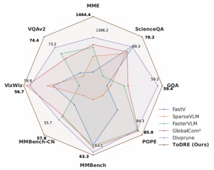

**(a)** **(b)** **(c)** **(d)**

Figure 1. **(a–c)** : Different from the prevalent visual token pruning approach [10, 62] that overly relies on attention scores, the proposed
ToDRE incorporates token diversity and task relevance, two largely neglected yet critical factors that help preserve indispensable and
informative visual cues and improve pruning robustness and answer accuracy as illustrated in the coffee cup localization task. **(d)** :
Quantitative experiments over eight image-language comprehension benchmarks demonstrate the superior and consistent effectiveness of
our proposed ToDRE.

0.6

0.5

0.4

0.3

0.2

0.1

0.0

|Col1|Col2|Col3|Col4|Col5|Col6|Col7|Col8|Col9|
|---|---|---|---|---|---|---|---|---|
||||||||~~Text~~ ~~ Vi~~ Visual  T|~~ ual~~  ext|
||||||||||
||||||||||
||||||||||
||||||||||
||||||||||
||||||||||

0 5 10 15 20 25 30
Layer Index

Figure 2. **Text-to-visual attention (blue) and visual-to-text at-**
**tention (orange) in each LLM decoder layer.** We observe a clear
pattern of _“information migration”_ : cross-modal attention (both
visual-to-text and text-to-visual) is high in early layers, reflecting
active information exchange, but gradually diminishes in deeper
layers as the model shifts toward unimodal text reasoning.

incurring unnecessary computations.
We design **TODRE**, a simple yet effective token pruning
technique that incorporates both _visual token diversity_ and
_task-specific token relevance_ for effective token pruning and
efficient LVLM inference. ToDRE performs token pruning
in the embedding space prior to LLM input and during the
LLM prefilling stage. First, we introduce a greedy max-sum
diversification algorithm that iteratively identifies and preserves visual tokens that have minimal cumulative similarity
to the selected tokens. Such token selection in LLM embedding space circumvents the positional bias introduced by
attention-based metrics, thereby preserving a broad spectrum
of visual information and enhancing the token representativeness at high pruning ratios. In addition, ToDRE leverages the
“ _information migration_ ” mechanism by adaptively selecting
one layer in the latter half of the LLM decoder (where crossmodal attention has significantly diminished) and drops all

visual tokens within that layer. This layer-level pruning removes visual tokens irrelevant to the given question and thus
further eliminates redundant computation during inference.
As a result, this relevance–guided pruning enables continuous inference-time efficiency gains as the decoding length
increases. As shown in Figure 1 (c–d), ToDRE’s two-stage
design enables effective visual token compression while preserving unique visual information and maintaining strong
accuracy.
In summary, our major contributions of this work are
threefold:

- **Revisit redundancy indicators.** First, we re-examine the
principles of existing indicators on token redundancy and
identify their constraints via systematic and comprehensive analysis. On top of that, we prove that inter-token
diversity and token-task relevance are two orthogonal factors, and treating them separately enables more effective
token pruning.

- **Propose a training-free and plug-and-play framework.**
Second, we design a two-stage plug-and-play token pruning technique that is fully compatible with efficient attention operators [13] without requiring any additional
training.

- **Conduct extensive empirical validation.** Third, extensive experiments over four widely adopted LVLMs and
twelve multimodal benchmarks show that ToDRE achieves
superior token pruning consistently.

**2. Related Work**

**2.1. Large Vision-Language Models**

Large vision-language models (LVLMs) [5, 51, 66] have
demonstrated remarkable advancements by extending the
reasoning capabilities of pretrained LLMs [3, 52, 53] to

2

image and video comprehension tasks. Typically, LVLMs
employ a vision encoder to extract visual features, which are
subsequently projected into the LLM’s embedding space via
a visual projector (e.g., Q-Former [26] or MLP [31, 37]). To
process real-world high-resolution images, previous LVLMs

[4, 36] resize input images to a fixed resolution, which introduces geometric distortion and degrades fine-grained local
details. To tackle this, subsequent studies adopt dynamic
tiling [11, 25, 37], which partitions images into regions and
encodes each region independently using a shared vision
encoder. However, dynamic tiling can yield thousands of
visual tokens, significantly increasing computational overhead. This issue becomes even more pressing in video-based
LVLMs [5, 33], since processing multiple video frames demands significantly more visual tokens. These challenges
highlight the urgent need for accelerating LVLM inference
in resource-constrained real-world environments.

**2.2. Token Compression for LVLMs**

Given that _spatially_ _redundant_ visual tokens outnumber
_information-dense_ text tokens by tens to hundreds of times

[43], one natural solution to optimize LVLM inference
is visual token compression. Several earliest attempts

[7, 28, 30, 59] modify model components and introduce
additional training costs. More recently, training-free token
compression methods have been widely adopted due to their
efficiency and effectiveness. These methods can be categorized into two main groups: (1) Token compression in the
vision encoder [6, 32, 46], the LLM decoder [10, 35, 63],
or both [19]: For example, ToMe [6] reduces tokens in the
vision encoding phase by merging redundant tokens via a
binary soft-matching algorithm. Other approaches prune
tokens during the LLM decoding stage by evaluating token
redundancy through criteria such as attention scores with
text tokens [10, 63] or observed divergence with LLM outputs [35, 60]. Subsequent studies [19, 38, 67] perform token
compression during both stages to further enhance inference efficiency. (2) Token compression in LLM embedding
space [2, 62]: A representative example is FasterVLM [62],
which measures the token redundancy more accurately by
the cross-attentions between the [CLS] token and visual
tokens. Unlike previous methods, our proposed ToDRE simultaneously reduces tokens in both the LLM embedding
space and the LLM decoder. Our two-stage approach effectively captures both visual token diversity and token-task
relevance—two orthogonal yet critical aspects previously
overlooked—achieving superior inference efficiency while
maintaining competitive performance.

**3. Preliminary Analysis**

Recently, numerous visual token compression techniques
have emerged. Most approaches [2, 10, 35, 55, 62] reduce
computational redundancy only within _partial stages_ of the

LVLM inference process, lacking a systematic analysis and
_overall_ _consideration_ . To bridge this gap, we provide a
deeper analysis organized as follows. In Section 3.1, we
review the fundamental architecture and processing flow of
existing LVLMs, identifying where redundant computation
arises. In the following Section 3.2, we further provide empirical observations and examine the limitations of existing
redundancy-reduction strategies, which motivate us to propose a two-stage token pruning method. In the Appendix,
a theoretical proof is presented to validate the underlying
rationale and structural integrity of the proposed two-stage
paradigm.

**3.1. Computational Overhead in LVLM Processing**
**Pipeline**

**Architecture** **and** **Processing** **Flow.** Typically, existing
LVLMs consist of three main components: a vision encoder,
a vision-language projector, and a LLM decoder. Both the
encoder and decoder are built upon the Transformer blocks

[54]. Given a visual input _V_, the vision encoder extracts
visual features, which are then mapped into a sequence of visual token embeddings _Ev_ by the vision-language projector,
aligned with the LLM textual embedding space. Then, _Ev_ is
concatenated with text embeddings _Et_ and system prompt
embeddings _Es_ to form the input sequence for LLM. During the LLM’s prefilling stage, all input tokens interact via
self-attention to generate a contextualized representation, denoted as _X_ = _{_ _**z**_ _s_ 1 _, . . .,_ _**z**_ _sL,_ _**z**_ _v_ 1 _, . . .,_ _**z**_ _vM,_ _**z**_ _t_ 1 _, . . .,_ _**z**_ _tN }_,
where _L_, _M_ and _N_ denote the sequence lengths of system
prompt token _**Z**_ _s_, visual token _**Z**_ _v_, and text token _**Z**_ _t_, respectively. At each Transformer layer, _X_ is projected into
keys and values, which are then stored as KV cache. In the
subsequent decoding stage, keys and values are computed
and added only for newly generated tokens, while previously computed key-value pairs are retrieved from the cache
directly.

**Computational Cost Analysis.** Prior studies [19, 38] have
shown that the dominant contributors to inference cost in
LVLMs are the vision-encoding stage, the LLM prefilling
stage, and the LLM decoding stage, each of which incurs
substantial self-attention and feed-forward network (FFN)
computations. Following previous studies [10, 55], we formulate the calculation of floating-point operations (FLOPs)
as follows:

FLOPsencoding = FLOPsprefilling = _T_ _×_ �4 _nd_ [2] + 2 _n_ [2] _d_ + 2 _ndm_ - _,_
(1)

= _T_ �4 _Ld_ [2] + 2 _Ldm_ + _dL_ (2 _n_ + _L −_ 1)� _,_
(2)

FLOPsdecoding = _T_

_L_

_t_ =1

�4 _d_ [2] + 2 _d_ ( _n_ + _t −_ 1) + 2 _dm_ 

3

where _T_ is the number of transformer layers; _n_ and _L_
respectively denote the lengths of the input and output sequences; _d_ is size of the hidden state; and _m_ is the intermediate dimension of the FFN. We take LLaVA-NeXT-7B

[37], which employs CLIP-ViT-Large-Patch14 [45] vision
encoder and Vicuna-7B-v1.5 [12] LLM decoder, as an example. The relative ratio of FLOPs (with _n_ =3000 and _L_ =20)
is approximately encoding:prefilling:decoding _≈_ 1: **63.6** :0.4.
When scaled to LLaVA-NeXT-13B, the relative ratio shifts
to 1: **121.1** :0.8, indicating that the LLM’s prefilling and decoding stages roughly double their share of the total computational cost. This underscores the importance of pruning
visual tokens as early as possible—ideally _prior to_ or _during_
the LLM prefilling stage—to mitigate the exploding computational burden.

**3.2. Intra- and Inter-Modal Redundancy**

The core objective of visual token pruning is to drop redundant tokens while preserving the holistic representational
capacity of visual features. Given the critical role of early
token pruning in reducing computational cost, we next examine how to effectively identify _which_ visual tokens to
prune.
A common practice is to identify the most “important”
tokens based on predefined criteria, and then apply tokenlevel pruning or merging strategies. Attention-based methods—such as averaging attention scores [10] or leveraging
attention from the [CLS] token to visual tokens [62]—are
widely adopted. However, such methods suffer from _atten-_
_tion_ _shift_, where causal decoding biases attention toward
later-positioned visual tokens [55]. Moreover, attention distributions are often imbalanced: [CLS]-based attention is
overly concentrated, while text-to-visual attention tends to
be dispersed and noisy [62]. These limitations motivate a
natural rethinking: _what is the essence of visual token redun-_
_dancy?_ While earlier studies have not delved deeply into
this issue, we argue that token redundancy manifests in two
orthogonal components: _intra-modal redundancy_ within the
visual signal, and _cross-modal redundancy_ between visual
and textual modalities.
_Intra-modal redundancy_ occurs when visual tokens exhibit significant similarity, since highly similar tokens contribute little unique information and are thus redundant. Such
redundancy can be identified using visual-only signals, typically by measuring cosine similarity. Then, the problem
reduces to selecting a minimally redundant subset of tokens.
Here, instead of relying on complex designs for redundancy
detection, we find that retaining a maximally diverse set of
tokens more effectively preserves the visual representation.
This observation motivates us to introduce the _Diversity-_
_driven_ _Visual_ _Token_ _Selection_, acting as the first stage of
ToDRE prior to LLM prefilling.
On the other hand, LVLM’s multimodal comprehension

heavily depends on textual cues [61], giving rise to _cross-_
_modal redundancy_ where visual tokens that are less relevant
to the textual information can be safely pruned. In this view,
the attention scores between visual and text modalities during the LLM prefilling stage offer a simple yet reliable signal
for token reduction. By treating cross-modal attention as
a unified whole, we avoid the previously mentioned limitations of attention-based selection strategies. Building on the
concept of decoding-stage _information migration_ proposed
in VTW [35], we further analyze its behavior during the
LLM prefilling stage. As shown in Figure 2, cross-modal
attention is prominent in early layers and gradually diminishes in deeper layers, revealing the _information migration_
phenomenon during prefilling: early layers prioritize crossmodal interaction, while deeper layers focus primarily on
uni-modality processing. This finding drives us to propose
the _Relevance-driven Visual Token Reduction_, serving as the
second stage of ToDRE during LLM prefilling.

**4. Visual Token Pruning with Token Diversity**
**and Task Relevance**

Building on the preliminary analysis, we introduce ToDRE,
a two-stage, training-free, and plug-and-play visual token
compression framework (see Figure 3). ToDRE utilizes
a similarity-guided greedy search in the LLM embedding
space to select a maximally diverse subset of visual tokens,
followed by an adaptive task-relevance-based pruning mechanism within the LLM decoder. Next, we elaborate on each
stage in detail.

**4.1. Diversity-Driven Token Selection**

To obtain a maximally diverse subset of visual tokens, we
adopt a greedy max-sum diversification algorithm [22] consisting of two steps: (1) initializing a retention set by selecting the initial pivot token, and (2) iteratively adding the token
that minimizes its cumulative similarity to the current set.
Full pseudocode of our proposed token retention algorithm
is provided in Appendix.

**Pivot Token Selection.** To determine the initial pivot, we
leverage the [CLS] attention from the last layer of the vision
encoder [45] as an importance indicator. The attention from
the [CLS] token _**z**_ [CLS] _∈_ R _[d]_ to other visual tokens _**Z**_ _v_ _∈_
R _[n][×][d]_ is calculated as:

_**q**_ [CLS] = _**z**_ [CLS] _**W**_ _Q,_ _**K**_ _v_ = _**Z**_ _v_ _**W**_ _K,_

_**q**_ [CLS] ~~_√_~~ _**K**_ _[⊤]_ _v_

(3)
_,_

_**a**_ [CLS] = Softmax

_d_

where _n_ is the length of the visual token sequence; _d_ is
the hidden state size of vision encoder; _**W**_ _Q_ _∈_ R _[d][×][d]_ and

4

**Response:**

“Black”

|Col1|age 1: D|
|---|---|
||…|
|𝑬𝒗𝑮|𝑬𝒗𝑮|

|Col1|Col2|Col3|𝑬𝑪 𝒗|
|---|---|---|---|
|…|…|…|…|

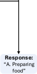

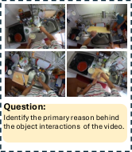

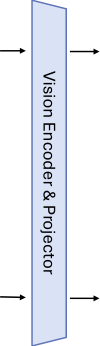

|Stage 1: Diversity-driven Token Selection|Col2|Stage2:|
|---|---|---|
|**_Image Pivot_** **_Token Selection_** 𝑬𝒗𝑪 **Stage 1: Diversity-driven Token Selection** 𝑬𝒗𝑮 **_Greedy Max-Sum_** **_Diversification_** _Retained k Tokens_ 𝑬𝒗𝑭 v **_Video_** **_Pivot_** **_ Token_** **_Selection_** **_Greedy Max-Sum_** **_Diversification_** v _Pivot Token_ _Local Crops_ _Global Thumbnail_ … … … … … … … _Pivot Token_ … _Video Frames_ … … … … _Retained k Tokens_|_Text Tokens_ _System Prompt Tokens_ v _Retained_ _Visual Tokens_ … …|**Stage2:** **Relevance-driven** **Token Reduction**|
|**_Image Pivot_** **_Token Selection_** 𝑬𝒗𝑪 **Stage 1: Diversity-driven Token Selection** 𝑬𝒗𝑮 **_Greedy Max-Sum_** **_Diversification_** _Retained k Tokens_ 𝑬𝒗𝑭 v **_Video_** **_Pivot_** **_ Token_** **_Selection_** **_Greedy Max-Sum_** **_Diversification_** v _Pivot Token_ _Local Crops_ _Global Thumbnail_ … … … … … … … _Pivot Token_ … _Video Frames_ … … … … _Retained k Tokens_|_Text Tokens_ _System Prompt Tokens_ v _Retained_ _Visual Tokens_ … …|**_Layer Selection_** Large Language Model **_l_**|

_Pivot Token Selection_

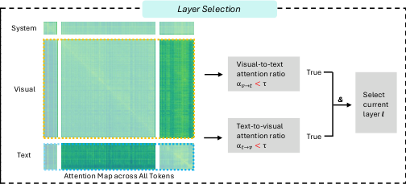

[CLS]-based Attention
for Image Thumbnails

[CLS] Token Attention
across Video Frames

Token Count of Video Frames

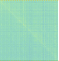

|CLS|Col2|Col3|Col4|Col5|
|---|---|---|---|---|
|CLS|…||…|Select token with highest𝒂[𝐶𝐿𝑆]|
|…|…|…|…|…|
|CLS|…|…|…|…|

Figure 3. **Overall framework of ToDRE.** Given the visual and textual inputs, the proposed _Diversity-driven Token Selection_ first selects
a pivot token from global thumbnail or video frames with [CLS]-based attention and then performs max-sum diversification to retain a
diverse set of _k_ visual tokens. The proposed _Relevance-driven Token Reduction_ then dynamically identifies a pivot decoder layer and prunes
all its visual tokens—the layer is identified if its visual-to-text and text-to-visual attention ratios both fall below a predefined threshold _τ_ .
_**Ev**_ _**[G]**_ [,] _**[ E]**_ _**v**_ _**[C]**_ [, and] _**[ E]**_ _**v**_ _**[F]**_ [denote the embeddings of thumbnail, local crops, and video frames, respectively.]

_**W**_ _K_ _∈_ R _[d][×][d]_ represent the weight matrices for queries and
keys, respectively.
As shown in Figure 3-(a), pivot token selection proceeds
as follows: (1) _Image Inputs with AnyRes [36] Support_ : In
this case, LVLM yields one global thumbnail _G_ along with
several local crops _C_ . We compute the [CLS] attention
score for each token in the global thumbnail and choose the
token with the highest score as the pivot, since it captures the
most comprehensive global information. (2) _Image Inputs_
_without AnyRes Support_ : The pivot token is selected from all
visual tokens of the original image, using the same [CLS]based criterion. (3) _Video Inputs_ : We first identify, for each
frame, the visual token with the highest [CLS] attention.
The final pivot token is then selected as the one with the
highest score among these frame-wise candidates.
For MLLMs without a [CLS] token in their encoders, a
random selection strategy is also acceptable, as it yields per

where **x** _v_ and **x** _c_ denote visual token features with indices
_v_ and _c_, and _C_ [(] _[t][−]_ [1)] is the selected set from the previous
iteration. The similarity between two tokens is measured
with cosine similarity

**x** _[⊤]_ _v_ **[x]** _[c]_
_s_ ( **x** _v,_ **x** _c_ ) = _∥_ **x** _v∥∥_ **x** _c∥_ _[.]_ (5)

formance that is nearly comparable to the original approach.
We provide a detailed comparison of different pivot token
selection strategies in Appendix.

**Greedy Max-Sum Diversification.** The expansion starts
from the designated pivot. At iteration _t_, we pick a new
token index _c_ [(] _[t]_ [)] by minimizing its _cumulative_ similarity to
the already selected set:

_c_ [(] _[t]_ [)] = arg min
_v∈V \C_ [(] _[t][−]_ [1)]

 

_s_ ( **x** _v,_ **x** _c_ )

_c∈C_ [(] _[t][−]_ [1)]

_,_ (4)

5

Equivalently, (4) maximizes the _sum of distances_ if _d_ ( _·, ·_ ) =
1 _−_ _s_ ( _·, ·_ ). After selecting _c_ [(] _[t]_ [)], we update the cumulative
similarities by adding its contribution:

_∀v_ _∈_ _V_ _\ C_ [(] _[t]_ [)] : _Sv_ [(] _[t]_ [)] = _Sv_ [(] _[t][−]_ [1)] + _s_ ( **x** _v,_ **x** _c_ ( _t_ )) _,_ (6)

and mask the chosen index. This greedy procedure repeats
until _k_ diverse tokens (e.g., _k_ =288, about 10% of visual
tokens) are retained, yielding

_C_ = _{c_ [(1)] _, c_ [(2)] _, . . ., c_ [(] _[k]_ [)] _}._ (7)

Finally, all remaining visual tokens are discarded; the retained visual tokens together with all text tokens are fed to
the LLM decoder for inference.

**4.2. Relevance-Driven Token Compression**

While strategies involving partial or multi-stage pruning
could be further applied, we argue that such strategies are
unnecessary, since the majority of visual tokens have already
been removed at Stage 1. In contrast to VTW [35], which
relies on post hoc KL-divergence comparisons to determine
the optimal pruning layer—a method that is indirect and
non-intuitive—we propose a forward-pass metric based on
cross-modal attention that directly identifies the most appropriate layer in LLM for token removal based on actual token
interaction. As shown in Figure 3-(b), all visual tokens are
removed after this selected layer.
Specifically, let _L_ be the number of decoder layers of
LLM. Based on our empirical observation (Figure 2) that
deeper layers exhibit limited cross-modal interaction, we
compute cross-modal attention ratios only at a few selected
layers in the later prefilling stages of the model. Since these
attention ratios tend to remain stable across consecutive
deeper layers, computing them at every layer would introduce unnecessary overhead. In our implementation, we select layers located at fractional depth 7 _L/_ 8. A more detailed
ablation of layer selection can be found in Appendix. At
each selected layer _ℓ_, we compute two cross-modal attention ratios based on average attention probabilities across all
attention heads and tokens:

_αt_ [(] _→_ _[ℓ]_ [)] _v_ [=]

_αv_ [(] _[ℓ]_ _→_ [)] _t_ [=]

 - 
_i∈T_ _j∈V_ _[A]_ _ij_ [(] _[ℓ]_ [)]

- 

 - 
_i∈V_ _j∈T_ _[A]_ _ij_ [(] _[ℓ]_ [)]

- 

 _i∈V_

 _i∈T_

_,_
_j∈S∪V ∪T_ _[A]_ _ij_ [(] _[ℓ]_ [)]

_,_
_j∈S∪V ∪T_ _[A]_ _ij_ [(] _[ℓ]_ [)]

(8)

 _i∈T_

By removing all visual tokens at this point, the model further avoids redundant visual computation in the remaining
prefilling and decoding stages, yielding slight improvements
in both efficiency and performance.

**5. Experiments**

**Experimental Setting.** We evaluate ToDRE over multiple
prevalent LVLMs (including LLaVA-NeXT-7B/13B [37],
Qwen2.5-VL-7B-Instruct [5], and InternVL2-8B [50]) and
twelve widely adopted benchmarks (including eight on image understanding tasks and four on video understanding
tasks). More details on the benchmarks, network backbones,
and comparison methods can be found in the Appendix.

**5.1. Benchmarking**

**Image Understanding Tasks.** In Table 1, we report ToDRE’s performance on a range of image-understanding
benchmarks at different token-retention ratios. First, under the same setup where 75% of visual tokens are pruned in
Stage 1—matching competing methods—ToDRE further removes all remaining visual tokens in Stage 2 and achieves a
98.2% average score, outperforming the second-best method
by 1.6%. Second, under more extreme compression (only
10% of visual tokens are retained), ToDRE surpasses the
second-best approach by 1.5%. Third, ToDRE also achieves
top performance on larger models, reaching an average score
of 93.6% on the 13B variant—demonstrating strong adaptability across model scales. Note that FastV [10] and SparseVLM [63] are excluded from the 13B comparison, as
their pruning strategies, originally tailored for the 7B model,
lead to substantial performance degradation when directly
transferred to the 13B model. This further underscores the
robustness and transferability of ToDRE.

**Video Understanding Tasks.** To further assess ToDRE’s
generalization ability, we evaluate it on both short- and longform video understanding benchmarks. As shown in Table 2,
ToDRE outperforms the baseline by 3.1% and 0.9% under the same token retention ratios used for images, and
surpasses the second-best method by 0.6% and 0.2%, respectively. Interestingly, ToDRE even surpasses the baseline
model in some cases. We attribute this to the reduced interference from redundant visual tokens, which may otherwise suppress task-relevant information during inference. Similarly,
SparseVLM is excluded due to transferability issues, and
GlobalCom2 [39] is omitted as it is specifically designed for
image-only inputs. In contrast, ToDRE demonstrates broad
generalization across both modalities and model scales.

**Cross-Model Evaluation.** As shown in Table 3, we further evaluate ToDRE on Qwen and InternVL backbones.
Specifically, ToDRE retains 97.1% and 96.8% of the original

 _i∈V_

where _A_ _[ℓ]_ _ij_ [denotes] [the] [softmax-normalized] [attention]
weight from query token _i_ to key token _j_ at layer _ℓ_ ; _S_,
_V_, and _T_ represent the system prompt, visual, and textual
tokens, respectively. To further enhance efficiency, all visual
tokens are removed at a certain layer _ℓ_ if and only if both
_αt_ [(] _→_ _[ℓ]_ [)] _v_ [and] _[α]_ _v_ [(] _[ℓ]_ _→_ [)] _t_ [are lower than a threshold] _[τ]_ [.] [A more de-]
tailed ablation of the threshold can be found in Appendix.

6

**Method** **MME** **ScienceQA** **GQA** **POPE** **MMBench-EN** **MMBench-CN** **VizWiz** **VQAv2** **Average**

_Upper Bound, 2880 Tokens_

LLaVA-NeXT-7B [37] 1519.6 72.0 64.2 87.7 68.5 59.0 60.6 80.1 100.0%

_Ratio=25%, Retain up to 720 Tokens_

FastV [10] 1477.3 69.8 60.4 83.1 65.6 55.4 57.2 77.2 95.4%
SparseVLM [63] 1446.1 67.5 60.9 71.0 63.8 55.4 58.6 77.2 93.1%
FasterVLM [62] 1454.6 67.1 61.3 87.2 66.0 56.8 58.4 76.4 96.0%
GlobalCom2 [39] 1468.7 68.1 61.4 **87.6** 64.0 54.4 58.7 76.6 95.6%
DivPrune [2] 1486.5 70.0 61.8 87.4 64.6 56.4 58.5 76.4 96.6%
**ToDRE (Ours)** **1504.3** **70.7** **63.3** 87.5 **66.6** **58.0** **59.5** **77.5** **98.2%**

_Ratio=10%, Retain up to 288 Tokens_

|FastV [10] SparseVLM [63] FasterVLM [62] GlobalCom2 [39] DivPrune [2] ToDRE (Ours)|1282.9 69.3 55.9 71.7 61.6 53.5 56.1 70.2 1332.2 68.6 56.1 63.2 54.5 52.3 56.2 69.9 1359.2 66.5 56.9 83.6 61.6 55.1 55.6 72.3 1365.5 68.7 57.1 83.8 61.8 55.0 56.6 71.8 1396.2 69.3 59.2 84.3 63.1 55.7 56.6 73.2 1464.4 70.2 59.4 85.0 63.3 57.8 56.7 74.4|88.8% 86.3% 91.4% 92.2% 93.5% 95.0%|
|---|---|---|
|LLaVA-NeXT-13B [37]|1575.2 71.2 65.4 87.5 70.1 66.0 63.6 81.9|100.0%|

_Ratio=25%, Retain up to 720 Tokens_

FasterVLM [62] 1516.1 71.1 62.3 86.1 67.6 62.1 58.1 76.1 95.6%
GlobalCom2 [39] 1531.2 71.4 62.7 86.5 67.9 61.3 58.2 77.2 96.0%
DivPrune [2] 1530.2 71.4 62.9 87.0 67.7 61.4 **60.6** 77.4 96.6%
**ToDRE (Ours)** **1557.0** **72.8** **63.8** **87.5** **69.1** **63.9** 57.6 **78.5** **97.3%**

_Ratio=10%, Retain up to 288 Tokens_

FasterVLM [62] 1386.2 70.5 58.1 81.6 61.7 53.5 55.9 77.1 89.1%
GlobalCom2 [39] 1399.5 71.0 58.3 82.4 65.0 56.6 55.6 72.8 90.8%
DivPrune [2] 1463.3 70.7 **60.1** **86.5** 64.3 53.0 **59.1** 75.4 92.5%
**ToDRE (Ours)** **1490.2** **71.4** 59.9 83.7 **65.3** **60.5** 56.9 **75.9** **93.6%**

Table 1. **Performance of training-free token compression methods across eight image-language benchmarks.** “Average” denotes the
mean performance ratio between each token compression method and the vanilla LLaVA-NeXT-7B. We evaluate all methods at retention
ratios of 25% and 10%, with the best results highlighted in bold.

|Method Retain Ratio # Token VideoMME Egoschema MLVU LongVideoBench Average|Col2|Col3|Col4|Col5|
|---|---|---|---|---|
|LLaVA-NeXT-7B [37]|0%|2880|33.3 35.7 20.1 42.5|100.0%|
|FastV [10] FasterVLM [62] DivPrune [2] **ToDRE (Ours)**|25%|720|32.3 31.2 16.5 40.3 **33.8** 41.0 **19.6** 40.5 33.6 41.8 19.5 40.4 33.3 **42.4** **19.6** **41.0**|90.4% 102.3% 102.5% **103.1%**|
|FastV [10] 10% 288 30.4 30.4 11.2 38.7 80.8% FasterVLM [62] **34.3** 36.1 **19.1** 36.9 96.4% DivPrune [2] 33.3 40.9 18.9 40.3 100.7% **ToDRE (Ours)** 33.2 **41.9** 18.2 **40.7** **100.9%**|FastV [10] 10% 288 30.4 30.4 11.2 38.7 80.8% FasterVLM [62] **34.3** 36.1 **19.1** 36.9 96.4% DivPrune [2] 33.3 40.9 18.9 40.3 100.7% **ToDRE (Ours)** 33.2 **41.9** 18.2 **40.7** **100.9%**|FastV [10] 10% 288 30.4 30.4 11.2 38.7 80.8% FasterVLM [62] **34.3** 36.1 **19.1** 36.9 96.4% DivPrune [2] 33.3 40.9 18.9 40.3 100.7% **ToDRE (Ours)** 33.2 **41.9** 18.2 **40.7** **100.9%**|FastV [10] 10% 288 30.4 30.4 11.2 38.7 80.8% FasterVLM [62] **34.3** 36.1 **19.1** 36.9 96.4% DivPrune [2] 33.3 40.9 18.9 40.3 100.7% **ToDRE (Ours)** 33.2 **41.9** 18.2 **40.7** **100.9%**|FastV [10] 10% 288 30.4 30.4 11.2 38.7 80.8% FasterVLM [62] **34.3** 36.1 **19.1** 36.9 96.4% DivPrune [2] 33.3 40.9 18.9 40.3 100.7% **ToDRE (Ours)** 33.2 **41.9** 18.2 **40.7** **100.9%**|

Table 2. **Performance of training-free token compression methods across four video-language benchmarks.**

performance on Qwen2.5-VL-7B-Instruct and InternVL28B at a 25% retention ratio, respectively, and still maintains
more than 90% of the original performance even when only
10% of visual tokens are preserved, demonstrating strong

robustness across different model architectures.

**5.2. Efficiency**

As shown in Table 4, we compare FLOPs, peak memory usage, throughput, and performance across various token prun

7

**Qwen2.5-VL-7B-Instruct** [5] **InternVL2-8B** [50]

**Benchmark** **Original** **Ret. 25%** **Ret. 10%** **Original** **Ret. 25%** **Ret. 10%**

MME [14] 1687.7 1680.6 1573.9 1628.8 1566.4 1424.4
ScienceQA [41] 88.5 86.4 85.4 96.5 95.3 92.5
GQA [20] 60.9 57.3 52.9 62.8 56.9 52.1
POPE [29] 87.7 85.4 80.8 87.8 83.7 76.9
MMBench-EN [40] 82.9 79.9 72.8 81.2 77.2 71.4
MMBench-CN [40] 81.7 78.0 70.4 80.0 74.2 67.6
VizWiz [18] 70.6 68.7 66.7 60.6 58.6 56.3
VQAv2 [16] 82.9 78.3 72.8 79.0 72.8 68.6
VideoMME [15] 61.5 59.4 57.3 55.0 54.2 52.6
Egoschema [42] 58.3 57.3 55.8 55.9 55.0 52.5
MLVU [65] 59.3 58.7 57.2 47.3 52.8 54.0
LongVideoBench [56] 58.4 57.7 54.8 55.0 52.3 48.8

**Average** 100.0% 97.1% 92.0% 100.0% 96.8% 91.5%

Table 3. **Performance of ToDRE on Qwen2.5-VL-7B-Instruct**
**and InternVL2-8B.** Benchmarks as rows. “Ret.”=Retention Ratio.
Averages are normalized to each model’s Original (=100%).

ing methods under a fixed token retention ratio of 10%. First,
ToDRE achieves the highest throughput of 2.9 samples/s
on POPE [29], accelerating inference by 1.9 _×_ compared to
the vanilla LLaVA-NeXT-7B baseline, while matching the
lowest memory usage (13.6 GB) alongside FasterVLM and
DivPrune [2]. Second, despite its superior efficiency and
memory usage, ToDRE maintains the highest average performance (95.0%), outperforming the second-best method
by 1.5%. These results confirm that ToDRE achieves great
overall balance among speed, memory, and accuracy. We attribute the slight efficiency gains over DivPrune (throughput
_↑_ 0.1 samples/s) to our second-stage deletion of all remaining
visual tokens—an approach rarely adopted in prior work. In
addition, as discussed in Section 3.1, because most image
and video understanding benchmarks only require the model
to answer a single word or short phrase (where _L_ is considerably small), our efficiency gains during the LLM decoding
stage are inevitably marginal. However, we expect ToDRE
to deliver even greater efficiency benefits in tasks involving
longer text generation, since it effectively mitigates the computational burden of visual tokens during LVLM inference.

**5.3. Ablation Study**

We conduct ablation studies to evaluate individual and combined contributions of the two stages in our framework. As
shown in Table 5, applying Stage 2 only, which removes all
visual tokens at a selected LLM layer without early-stage
diversity-aware selection, already reduces the overall inference time by 8.8% compared to unpruned LLaVA-NeXT-7B
baseline (from 77:04 to 70:15), while maintaining a lossless average performance of 100.0%. The limited efficiency
gain is expected, as Stage 2 only accelerates the latter part
of inference, and most tasks involve generating very short
outputs.
In contrast, applying Stage 1 only, which retains 25% or
10% of tokens based on token diversity, yields substantial
time savings of 37.5% (48:10) and 59.4% (31:18), respectively, with minimal drops in performance. When incorpo

**FLOPs ↓** **Memory ↓** **Throughput ↑**
**Method** **Performance ↑**
**(T)** **(GB)** **(samples/s)**

_Upper Bound, 2880 Tokens_

LLaVA-NeXT-7B [37] 31.4 15.9 1.5 100%

_Ratio=10%, Retain up to 288 Tokens_

FastV [10] 8.2 (↓73.9%) 14.1 (↓11.3%) 2.1 (1.4×) 88.8%
SparseVLM [63] 6.9 (↓78.0%) 14.1 (↓11.3%) 2.5 (1.7×) 86.3%
FasterVLM [62] 6.1 (↓80.6%) **13.6** (↓14.5%) 2.7 (1.8×) 91.4%
GlobalCom [2] [39] 6.1 (↓80.6%) 13.9 (↓12.6%) 2.7 (1.8×) 92.2%
DivPrune [2] **6.0** (↓80.9%) **13.6** (↓14.5%) 2.8 (1.9×) 93.5%
**ToDRE (Ours)** **6.0** (↓80.9%) **13.6** (↓14.5%) **2.9** (1.9×) **95.0%**

Table 4. **Inference efficiency comparisons.** All experiments were
conducted on a single NVIDIA RTX 3090 GPU. “Memory”: peak
GPU memory usage; “Throughput”: number of POPE samples
processed per second; “Performance”: average score across 8 image
understanding benchmarks.

**Total Time** _↓_
**Method** **MME** **ScienceQA** **GQA** **POPE** **Average**
**(Min:Sec)**

_Upper Bound, 2880 Tokens_

_Ratio=25%, Retain up to 720 Tokens_

Stage 1 only 48:10 1503.8 70.6 63.1 **87.5** 98.8%
**Stage 1 + Stage 2 (ToDRE)** **44:18** **1504.3** **70.7** **63.3** **87.5** **98.9%**

_Ratio=10%, Retain up to 288 Tokens_

Stage 1 only 31:18 1458.6 70.4 **59.4** **85.0** 95.8%
**Stage 1 + Stage 2 (ToDRE)** **29:43** **1469.3** **70.5** **59.4** **85.0** **96.0%**

Table 5. **Ablation study on two-stage token compression.** We
evaluated the individual and combined effects of proposed twostage pruning pipeline under retention ratios of 25% and 10%.

rating both stages (Stage 1 + Stage 2), we observe consistent
improvements: First, at the 25% ratio, performance improves
from 98.8% to 98.9% with total time reduced (from 48:10
to 44:18). Second, at the 10% ratio, performance increases
from 95.8% to 96.0%, with total time reduced (from 31:18
to 29:43). Overall, ToDRE reduces inference time by 42.5%
and 61.4% at the 25% and 10% token retention ratios, respectively, while even improving performance (up to +0.2%
gain). These results confirm that the second stage—full visual token removal based on visual-task relevance—provides
complementary benefits to the diversity-based Stage 1, leading to improved accuracy-efficiency trade-offs under various
compression settings.

**6. Conclusion**

In this work, we systematically analyze redundancy in
LVLM inference and identify two key inefficiencies: (1)
redundant visual tokens that inflate intra-modal computation, and (2) tokens that contribute little cross-modal information during decoding. To address these inefficiencies,
we propose TODRE, a training-free, architecture-agnostic
framework that first selects a maximally diverse subset of visual tokens via a greedy max-sum diversification algorithm,
then removes all remaining visual tokens once cross-modal

8

attention fades. Experiments on twelve image- and videolanguage benchmarks show that ToDRE prunes up to 90%
of visual tokens while preserving 95.0% of the original performance, achieving 2.6 _×_ faster inference and 14.5% lower
memory usage than uncompressed baselines.

**References**

[1] Josh Achiam, Steven Adler, Sandhini Agarwal, Lama Ahmad,
Ilge Akkaya, Florencia Leoni Aleman, Diogo Almeida, Janko
Altenschmidt, Sam Altman, Shyamal Anadkat, et al. Gpt-4
technical report. _arXiv preprint arXiv:2303.08774_, 2023. 1

[2] Saeed Ranjbar Alvar, Gursimran Singh, Mohammad Akbari, and Yong Zhang. Divprune: Diversity-based visual
token pruning for large multimodal models. _arXiv preprint_
_arXiv:2503.02175_, 2025. 3, 7, 8

[3] Jinze Bai, Shuai Bai, Yunfei Chu, Zeyu Cui, Kai Dang, Xiaodong Deng, Yang Fan, Wenbin Ge, Yu Han, Fei Huang, et al.
Qwen technical report. _arXiv_ _preprint_ _arXiv:2309.16609_,
2023. 1, 2

[4] Jinze Bai, Shuai Bai, Shusheng Yang, Shijie Wang, Sinan
Tan, Peng Wang, Junyang Lin, Chang Zhou, and Jingren
Zhou. Qwen-vl: A frontier large vision-language model with
versatile abilities. _arXiv preprint arXiv:2308.12966_, 1(2):3,
2023. 3

[5] Shuai Bai, Keqin Chen, Xuejing Liu, Jialin Wang, Wenbin
Ge, Sibo Song, Kai Dang, Peng Wang, Shijie Wang, Jun
Tang, et al. Qwen2. 5-vl technical report. _arXiv_ _preprint_
_arXiv:2502.13923_, 2025. 1, 2, 3, 6, 8

[6] Daniel Bolya, Cheng-Yang Fu, Xiaoliang Dai, Peizhao Zhang,
Christoph Feichtenhofer, and Judy Hoffman. Token merging: Your vit but faster. In _Proceedings of the International_
_Conference on Learning Representations_, 2023. 1, 3

[7] Mu Cai, Jianwei Yang, Jianfeng Gao, and Yong Jae Lee.
Matryoshka multimodal models. In _Workshop_ _on_ _Video-_
_Language Models@ NeurIPS 2024_, 2024. 3

[8] Yuxuan Cai, Jiangning Zhang, Haoyang He, Xinwei He, Ao
Tong, Zhenye Gan, Chengjie Wang, and Xiang Bai. Llava-kd:
A framework of distilling multimodal large language models.
_arXiv preprint arXiv:2410.16236_, 2024. 1

[9] Wenhao Chai, Enxin Song, Yilun Du, Chenlin Meng, Vashisht
Madhavan, Omer Bar-Tal, Jenq-Neng Hwang, Saining Xie,
and Christopher D. Manning. Auroracap: Efficient, performant video detailed captioning and a new benchmark, 2025.
5, 7

[10] Liang Chen, Haozhe Zhao, Tianyu Liu, Shuai Bai, Junyang
Lin, Chang Zhou, and Baobao Chang. An image is worth 1/2
tokens after layer 2: Plug-and-play inference acceleration for
large vision-language models. In _European Conference on_
_Computer Vision_, pages 19–35. Springer, 2024. 1, 2, 3, 4, 6,
7, 8, 5

[11] Zhe Chen, Weiyun Wang, Hao Tian, Shenglong Ye, Zhangwei
Gao, Erfei Cui, Wenwen Tong, Kongzhi Hu, Jiapeng Luo,
Zheng Ma, et al. How far are we to gpt-4v? closing the gap
to commercial multimodal models with open-source suites.
_Science China Information Sciences_, 67(12):220101, 2024. 3

[12] Wei-Lin Chiang, Zhuohan Li, Ziqing Lin, Ying Sheng, Zhanghao Wu, Hao Zhang, Lianmin Zheng, Siyuan Zhuang, Yonghao Zhuang, Joseph E Gonzalez, et al. Vicuna: An opensource chatbot impressing gpt-4 with 90%* chatgpt quality.
_See https://vicuna. lmsys. org (accessed 14 April 2023)_, 2(3):
6, 2023. 4

[13] Tri Dao, Dan Fu, Stefano Ermon, Atri Rudra, and Christopher
Ré. Flashattention: Fast and memory-efficient exact attention with io-awareness. In _Advances in neural information_
_processing systems_, pages 16344–16359, 2022. 2

[14] Chaoyou Fu, Peixian Chen, Yunhang Shen, Yulei Qin, Mengdan Zhang, Xu Lin, Zhenyu Qiu, Wei Lin, Jinrui Yang, Xiawu
Zheng, Ke Li, Xing Sun, and Rongrong Ji. Mme: A comprehensive evaluation benchmark for multimodal large language
models. _ArXiv_, abs/2306.13394, 2023. 8, 1, 5

[15] Chaoyou Fu, Yuhan Dai, Yongdong Luo, Lei Li, Shuhuai
Ren, Renrui Zhang, Zihan Wang, Chenyu Zhou, Yunhang
Shen, Mengdan Zhang, et al. Video-mme: The first-ever
comprehensive evaluation benchmark of multi-modal llms in
video analysis. _arXiv preprint arXiv:2405.21075_, 2024. 1, 8

[16] Yash Goyal, Tejas Khot, Douglas Summers-Stay, Dhruv Batra, and Devi Parikh. Making the v in vqa matter: Elevating
the role of image understanding in visual question answering.
In _Proceedings of the IEEE conference on computer vision_
_and pattern recognition_, pages 6904–6913, 2017. 1, 8, 5

[17] Kristen Grauman, Andrew Westbury, Eugene Byrne, Zachary
Chavis, Antonino Furnari, Rohit Girdhar, Jackson Hamburger,
Hao Jiang, Miao Liu, Xingyu Liu, Miguel Martin, Tushar
Nagarajan, Ilija Radosavovic, Santhosh K. Ramakrishnan,
Fiona Ryan, Jayant Sharma, Michael Wray, Mengmeng Xu,
Eric Z. Xu, Chen Zhao, Siddhant Bansal, Dhruv Batra, Vincent Cartillier, Sean Crane, Tien Do, Morrie Doulaty, Akshay Erapalli, Christoph Feichtenhofer, Adriano Fragomeni,
Qichen Fu, Christian Fuegen, Abrham Kahsay Gebreselasie,
Cristina González, James M. Hillis, Xuhua Huang, Yifei
Huang, Wenqi Jia, Weslie Khoo, Jáchym Kolár, Satwik Kottur, Anurag Kumar, Federico Landini, Chao Li, Yanghao
Li, Zhenqiang Li, Karttikeya Mangalam, Raghava Modhugu,
Jonathan Munro, Tullie Murrell, Takumi Nishiyasu, Will
Price, Paola Ruiz Puentes, Merey Ramazanova, Leda Sari, Kiran K. Somasundaram, Audrey Southerland, Yusuke Sugano,
Ruijie Tao, Minh Vo, Yuchen Wang, Xindi Wu, Takuma Yagi,
Yunyi Zhu, Pablo Arbeláez, David J. Crandall, Dima Damen,
Giovanni Maria Farinella, Bernard Ghanem, Vamsi Krishna
Ithapu, C. V. Jawahar, Hanbyul Joo, Kris Kitani, Haizhou Li,
Richard A. Newcombe, Aude Oliva, Hyun Soo Park, James M.
Rehg, Yoichi Sato, Jianbo Shi, Mike Zheng Shou, Antonio
Torralba, Lorenzo Torresani, Mingfei Yan, and Jitendra Malik.
Ego4d: Around the world in 3,000 hours of egocentric video.
_2022 IEEE/CVF Conference on Computer Vision and Pattern_
_Recognition (CVPR)_, pages 18973–18990, 2021. 2

[18] Danna Gurari, Qing Li, Abigale J Stangl, Anhong Guo, Chi
Lin, Kristen Grauman, Jiebo Luo, and Jeffrey P Bigham.
Vizwiz grand challenge: Answering visual questions from
blind people. In _Proceedings_ _of_ _the_ _IEEE_ _conference_ _on_
_computer vision and pattern recognition_, pages 3608–3617,
2018. 1, 8

[19] Yuhang Han, Xuyang Liu, Pengxiang Ding, Donglin Wang,

9

Honggang Chen, Qingsen Yan, and Siteng Huang. Rethinking
token reduction in mllms: Towards a unified paradigm for
training-free acceleration. _arXiv preprint arXiv:2411.17686_,
2024. 1, 3

[20] Drew A Hudson and Christopher D Manning. Gqa: A new
dataset for real-world visual reasoning and compositional
question answering. In _Proceedings of the IEEE/CVF con-_
_ference_ _on_ _computer_ _vision_ _and_ _pattern_ _recognition_, pages
6700–6709, 2019. 1, 8, 5

[21] Aaron Hurst, Adam Lerer, Adam P Goucher, Adam Perelman,
Aditya Ramesh, Aidan Clark, AJ Ostrow, Akila Welihinda,
Alan Hayes, Alec Radford, et al. Gpt-4o system card. _arXiv_
_preprint arXiv:2410.21276_, 2024. 1

[22] Shengyue Ji, Guoliang Li, Chen Li, and Jianhua Feng. Efficient interactive fuzzy keyword search. In _Proceedings of_
_the 18th International Conference on World Wide Web_, page
371–380, New York, NY, USA, 2009. Association for Computing Machinery. 4

[23] Yutao Jiang, Qiong Wu, Wenhao Lin, Wei Yu, and Yiyi Zhou.
What kind of visual tokens do we need? training-free visual
token pruning for multi-modal large language models from
the perspective of graph. _arXiv preprint arXiv:2501.02268_,
2025. 1

[24] Ranjay Krishna, Yuke Zhu, Oliver Groth, Justin Johnson,
Kenji Hata, Joshua Kravitz, Stephanie Chen, Yannis Kalantidis, Li-Jia Li, David A. Shamma, Michael S. Bernstein, and
Li Fei-Fei. Visual genome: Connecting language and vision
using crowdsourced dense image annotations. _International_
_Journal of Computer Vision_, 123:32 – 73, 2016. 1

[25] Bo Li, Yuanhan Zhang, Dong Guo, Renrui Zhang, Feng Li,
Hao Zhang, Kaichen Zhang, Peiyuan Zhang, Yanwei Li, Ziwei Liu, et al. Llava-onevision: Easy visual task transfer.
_arXiv preprint arXiv:2408.03326_, 2024. 3

[26] Junnan Li, Dongxu Li, Silvio Savarese, and Steven Hoi. Blip2: Bootstrapping language-image pre-training with frozen
image encoders and large language models. In _International_
_conference on machine learning_, pages 19730–19742. PMLR,
2023. 3

[27] Kunchang Li, Yali Wang, Yinan He, Yizhuo Li, Yi Wang,
Yi Liu, Zun Wang, Jilan Xu, Guo Chen, Ping Luo, et al.
Mvbench: A comprehensive multi-modal video understanding benchmark. In _Proceedings of the IEEE/CVF Conference_
_on Computer Vision and Pattern Recognition_, pages 22195–
22206, 2024. 1

[28] Wentong Li, Yuqian Yuan, Jian Liu, Dongqi Tang, Song
Wang, Jie Qin, Jianke Zhu, and Lei Zhang. Tokenpacker:
Efficient visual projector for multimodal llm. _arXiv preprint_
_arXiv:2407.02392_, 2024. 3

[29] Yifan Li, Yifan Du, Kun Zhou, Jinpeng Wang, Wayne Xin
Zhao, and Ji-Rong Wen. Evaluating object hallucination in large vision-language models. _arXiv_ _preprint_
_arXiv:2305.10355_, 2023. 8, 1, 5

[30] Yanwei Li, Chengyao Wang, and Jiaya Jia. Llama-vid: An image is worth 2 tokens in large language models. In _European_
_Conference_ _on_ _Computer_ _Vision_, pages 323–340. Springer,
2024. 3

[31] Yanwei Li, Yuechen Zhang, Chengyao Wang, Zhisheng
Zhong, Yixin Chen, Ruihang Chu, Shaoteng Liu, and Jiaya

Jia. Mini-gemini: Mining the potential of multi-modality
vision language models. _arXiv preprint arXiv:2403.18814_,
2024. 3

[32] Youwei Liang, Chongjian Ge, Zhan Tong, Yibing Song, Jue
Wang, and Pengtao Xie. Not all patches are what you need:
Expediting vision transformers via token reorganizations. In
_Proceedings_ _of_ _the_ _International_ _Conference_ _on_ _Learning_
_Representations_, 2022. 3

[33] Bin Lin, Yang Ye, Bin Zhu, Jiaxi Cui, Munan Ning, Peng
Jin, and Li Yuan. Video-llava: Learning united visual representation by alignment before projection. _arXiv preprint_
_arXiv:2311.10122_, 2023. 3

[34] Tsung-Yi Lin, Michael Maire, Serge J. Belongie, James Hays,
Pietro Perona, Deva Ramanan, Piotr Dollár, and C. Lawrence
Zitnick. Microsoft coco: Common objects in context. In
_European Conference on Computer Vision_, 2014. 2

[35] Zhihang Lin, Mingbao Lin, Luxi Lin, and Rongrong Ji. Boosting multimodal large language models with visual tokens
withdrawal for rapid inference. In _Proceedings of the AAAI_
_Conference on Artificial Intelligence_, pages 5334–5342, 2025.
1, 3, 4, 6

[36] Haotian Liu, Chunyuan Li, Yuheng Li, and Yong Jae Lee.
Improved baselines with visual instruction tuning. In _Pro-_
_ceedings of the IEEE/CVF Conference on Computer Vision_
_and Pattern Recognition_, pages 26296–26306, 2024. 3, 5, 2

[37] Haotian Liu, Chunyuan Li, Yuheng Li, Bo Li, Yuanhan Zhang,
Sheng Shen, and Yong Jae Lee. Llavanext: Improved reasoning, ocr, and world knowledge, 2024. 3, 4, 6, 7, 8, 2,
5

[38] Ting Liu, Liangtao Shi, Richang Hong, Yue Hu, Quanjun
Yin, and Linfeng Zhang. Multi-stage vision token dropping:
Towards efficient multimodal large language model. _arXiv_
_preprint arXiv:2411.10803_, 2024. 1, 3

[39] Xuyang Liu, Ziming Wang, Yuhang Han, Yingyao Wang,
Jiale Yuan, Jun Song, Bo Zheng, Linfeng Zhang, Siteng
Huang, and Honggang Chen. Compression with global guidance: Towards training-free high-resolution mllms acceleration. _arXiv preprint arXiv:2501.05179_, 2025. 6, 7, 8, 3

[40] Yuanzhan Liu, Haodong Duan, Yuanhan Zhang, Bo Li,
Songyang Zhang, Wangbo Zhao, Yike Yuan, Jiaqi Wang,
Conghui He, Ziwei Liu, Kai Chen, and Dahua Lin. Mmbench: Is your multi-modal model an all-around player? In
_European Conference on Computer Vision_, 2023. 8, 1, 5

[41] Pan Lu, Swaroop Mishra, Tanglin Xia, Liang Qiu, Kai-Wei
Chang, Song-Chun Zhu, Oyvind Tafjord, Peter Clark, and
Ashwin Kalyan. Learn to explain: Multimodal reasoning via
thought chains for science question answering. In _Advances_
_in Neural Information Processing Systems_, pages 2507–2521,
2022. 1, 8, 5

[42] Karttikeya Mangalam, Raiymbek Akshulakov, and Jitendra
Malik. Egoschema: A diagnostic benchmark for very longform video language understanding. In _Advances in Neural_
_Information Processing Systems_, pages 46212–46244, 2023.
1, 8

[43] David Marr. _Vision:_ _A computational investigation into the_
_human representation and processing of visual information_ .
MIT press, 2010. 3

10

[44] Yanyuan Qiao, Zheng Yu, Longteng Guo, Sihan Chen, Zijia
Zhao, Mingzhen Sun, Qi Wu, and Jing Liu. Vl-mamba:
Exploring state space models for multimodal learning. _arXiv_
_preprint arXiv:2403.13600_, 2024. 1

[45] Alec Radford, Jong Wook Kim, Chris Hallacy, Aditya
Ramesh, Gabriel Goh, Sandhini Agarwal, Girish Sastry,
Amanda Askell, Pamela Mishkin, Jack Clark, et al. Learning
transferable visual models from natural language supervision. In _International conference on machine learning_, pages
8748–8763. PmLR, 2021. 4

[46] Yuzhang Shang, Mu Cai, Bingxin Xu, Yong Jae Lee, and Yan
Yan. Llava-prumerge: Adaptive token reduction for efficient
large multimodal models. _arXiv preprint arXiv:2403.15388_,
2024. 1, 3

[47] Mustafa Shukor and Matthieu Cord. Skipping computations
in multimodal llms. _arXiv preprint arXiv:2410.09454_, 2024.
1

[48] Amanpreet Singh, Vivek Natarajan, Meet Shah, Yu Jiang, Xinlei Chen, Dhruv Batra, Devi Parikh, and Marcus Rohrbach.
Towards vqa models that can read. In _Proceedings_ _of_ _the_
_IEEE/CVF conference on computer vision and pattern recog-_
_nition_, pages 8317–8326, 2019. 1

[49] Gemini Team, Rohan Anil, Sebastian Borgeaud, JeanBaptiste Alayrac, Jiahui Yu, Radu Soricut, Johan Schalkwyk,
Andrew M Dai, Anja Hauth, Katie Millican, et al. Gemini: a
family of highly capable multimodal models. _arXiv preprint_
_arXiv:2312.11805_, 2023. 1

[50] InternVL Team. Internvl 2.0: Scaling open-source multimodal large language models. [https://internvl.](https://internvl.github.io/blog/2024-07-02-InternVL-2.0/)
[github.io/blog/2024-07-02-InternVL-2.0/,](https://internvl.github.io/blog/2024-07-02-InternVL-2.0/)
2024. 6, 8, 3

[51] Kimi Team, Angang Du, Bohong Yin, Bowei Xing, Bowen
Qu, Bowen Wang, Cheng Chen, Chenlin Zhang, Chenzhuang
Du, Chu Wei, et al. Kimi-vl technical report. _arXiv preprint_
_arXiv:2504.07491_, 2025. 1, 2

[52] Hugo Touvron, Thibaut Lavril, Gautier Izacard, Xavier Martinet, Marie-Anne Lachaux, Timothée Lacroix, Baptiste Rozière, Naman Goyal, Eric Hambro, Faisal Azhar, et al. Llama:
Open and efficient foundation language models. _arXiv_
_preprint arXiv:2302.13971_, 2023. 1, 2

[53] Hugo Touvron, Louis Martin, Kevin Stone, Peter Albert, Amjad Almahairi, Yasmine Babaei, Nikolay Bashlykov, Soumya
Batra, Prajjwal Bhargava, Shruti Bhosale, et al. Llama 2:
Open foundation and fine-tuned chat models. _arXiv preprint_
_arXiv:2307.09288_, 2023. 1, 2

[54] Ashish Vaswani, Noam Shazeer, Niki Parmar, Jakob Uszkoreit, Llion Jones, Aidan N Gomez, Łukasz Kaiser, and Illia
Polosukhin. Attention is all you need. In _Advances in neural_
_information processing systems_, 2017. 3

[55] Zichen Wen, Yifeng Gao, Shaobo Wang, Junyuan Zhang, Qintong Zhang, Weijia Li, Conghui He, and Linfeng Zhang. Stop
looking for important tokens in multimodal language models:
Duplication matters more. _arXiv preprint arXiv:2502.11494_,
2025. 1, 3, 4

[56] Haoning Wu, Dongxu Li, Bei Chen, and Junnan Li.
Longvideobench: A benchmark for long-context interleaved
video-language understanding. In _Advances in Neural Infor-_

_mation_ _Processing_ _Systems_, pages 28828–28857, 2024. 1,
8

[57] Zhiyu Wu, Xiaokang Chen, Zizheng Pan, Xingchao Liu, Wen
Liu, Damai Dai, Huazuo Gao, Yiyang Ma, Chengyue Wu,
Bingxuan Wang, et al. Deepseek-vl2: Mixture-of-experts
vision-language models for advanced multimodal understanding. _arXiv preprint arXiv:2412.10302_, 2024. 1

[58] Jingjing Xie, Yuxin Zhang, Mingbao Lin, Liujuan Cao, and
Rongrong Ji. Advancing multimodal large language models
with quantization-aware scale learning for efficient adaptation.
In _Proceedings of the 32nd ACM International Conference_
_on Multimedia_, pages 10582–10591, 2024. 1

[59] Linli Yao, Lei Li, Shuhuai Ren, Lean Wang, Yuanxin Liu, Xu
Sun, and Lu Hou. Deco: Decoupling token compression from
semantic abstraction in multimodal large language models.
_arXiv preprint arXiv:2405.20985_, 2024. 3

[60] Weihao Ye, Qiong Wu, Wenhao Lin, and Yiyi Zhou. Fit and
prune: Fast and training-free visual token pruning for multimodal large language models. In _Proceedings of the AAAI_
_Conference_ _on_ _Artificial_ _Intelligence_, pages 22128–22136,
2025. 1, 3

[61] Gengyuan Zhang, Yurui Zhang, Kerui Zhang, and Volker
Tresp. Can vision-language models be a good guesser? exploring vlms for times and location reasoning, 2023. 4

[62] Qizhe Zhang, Aosong Cheng, Ming Lu, Zhiyong Zhuo, Minqi
Wang, Jiajun Cao, Shaobo Guo, Qi She, and Shanghang
Zhang. [cls] attention is all you need for training-free visual
token pruning: Make vlm inference faster. _arXiv_ _preprint_
_arXiv:2412.01818_, 2024. 1, 2, 3, 4, 7, 8, 5

[63] Yuan Zhang, Chun-Kai Fan, Junpeng Ma, Wenzhao Zheng,
Tao Huang, Kuan Cheng, Denis Gudovskiy, Tomoyuki Okuno,
Yohei Nakata, Kurt Keutzer, et al. Sparsevlm: Visual token
sparsification for efficient vision-language model inference.
_arXiv preprint arXiv:2410.04417_, 2024. 1, 3, 6, 7, 8

[64] Shiyu Zhao, Zhenting Wang, Felix Juefei-Xu, Xide Xia, Miao
Liu, Xiaofang Wang, Mingfu Liang, Ning Zhang, Dimitris N
Metaxas, and Licheng Yu. Accelerating multimodel large
language models by searching optimal vision token reduction.
_arXiv preprint arXiv:2412.00556_, 2024. 1

[65] Junjie Zhou, Yan Shu, Bo Zhao, Boya Wu, Shitao Xiao, Xi
Yang, Yongping Xiong, Bo Zhang, Tiejun Huang, and Zheng
Liu. Mlvu: A comprehensive benchmark for multi-task long
video understanding. _arXiv preprint arXiv:2406.04264_, 2024.
1, 8

[66] Jinguo Zhu, Weiyun Wang, Zhe Chen, Zhaoyang Liu, Shenglong Ye, Lixin Gu, Yuchen Duan, Hao Tian, Weijie Su,
Jie Shao, et al. Internvl3: Exploring advanced training and
test-time recipes for open-source multimodal models. _arXiv_
_preprint arXiv:2504.10479_, 2025. 1, 2

[67] Yuke Zhu, Chi Xie, Shuang Liang, Bo Zheng, and Sheng
Guo. Focusllava: A coarse-to-fine approach for efficient
and effective visual token compression. _arXiv_ _preprint_
_arXiv:2411.14228_, 2024. 3

11

## **ToDRE: Effective Visual Token Pruning via Token Diversity and Task Relevance** Supplementary Material

**Outline**
In this Supplementary Material, we first provide a detailed
introduction of the benchmarks used in our experiments in
Sec. 1. Next, we present a theoretical analysis of our twostage token compression paradigm in Sec. 2. Additional
ablation studies are presented in Sec. 3, where we further
analyze different pivot token selection strategies in Sec. 3.1,
as well as the effects of the pruning threshold and layer selection in Sec. 3.2 and Sec. 3.3, respectively. We further
investigate the negligible decoding-stage attention to visual
tokens in Sec. 4. In subsequent Sec. 5.1, we demonstrate
the unique advantages of **TODRE** with question-answering
cases in a chatbot scenario, targeting those long and freeform responses. Finally, in Sec. 5.2, we perform extensive
qualitative comparisons under seven benchmarks to visualize
the differences between our _diversity-driven_ approach and
existing _attention-driven_ token pruning method. Unless otherwise stated, all experiments in this paper were conducted
on 4 NVIDIA RTX 3090 GPUs.

**Algorithm 1** Proposed Greedy Max-Sum Diversification for
Token Retention
**Input:** _V_ _∈_ R _[n][×][d]_ : visual features; _α_ _∈_ R _[n]_ or R _[f]_ _[×][t]_ :

[CLS]-to-token attention; _k_ : #tokens to retain
**Output:** _C_ : indices of selected tokens

_// Stage 1:_ _Pivot Token Selection_
1: **if** _α ∈_ R _[n]_ **then** _▷_ Image input
2: _p ←_ arg max _α_
3: **else if** _α ∈_ R _[f]_ _[×][t]_ **then** _▷_ Video input: _f_ frames, _t_
tokens per frame

4: ( _a, b_ ) _←_ arg max _f,t αf,t_ ; _p ←_ _a · t_ + _b_
5: **end if**

_// Stage 2:_ _Greedy Max-Sum Diversification_
6: _X_ _←_ row_normalize( _V_ ) _▷ℓ_ 2-normalize rows for
cosine similarity
7: _C_ _←{p}_

8: _s ←_ _XXp_ _[⊤]_ _▷si_ = cos( _xi, xp_ ) is cumulative similarity
9: _sp_ _←_ + _∞_ _▷_ mask selected index
10: **for** _i_ = 1 to _k −_ 1 **do**
11: _c ←_ arg min _s_ _▷_ pick token with smallest
cumulative similarity
12: _C_ _←C ∪{c}_

13: _s ←_ _s_ + _XXc_ _[⊤]_ _▷_ update: add similarity to the new
token
14: _sc_ _←_ + _∞_ _▷_ mask the newly selected index
15: **end for**
16: **return** _C_

**1. Experimental Details**

**1.1. Benchmarks**

We evaluate our method on a range of widely used benchmarks, collectively designed to assess various aspects of
multimodal intelligence. For image understanding tasks,
we conduct experiments on eight benchmarks: MME [14],
ScienceQA [41], GQA [20], POPE [29], MMBench and
MMBench-CN [40], VizWiz [18], and VQAv2 [16]. For
video understanding tasks, we evaluate our method on four
benchmarks: VideoMME [15], EgoSchema [42], MLVU

[65], and LongVideoBench [56].

**MME.** MME is a comprehensive benchmark designed to
evaluate the perceptual and cognitive capabilities of multimodal models across 14 diverse subtasks. It includes both
perception-oriented tasks—such as OCR, object counting,
spatial localization, and color recognition—and fine-grained
recognition of posters, celebrities, scenes, landmarks, and
artworks. All tasks are framed as binary judgment questions,
using carefully crafted instruction-answer pairs to reduce
data leakage and ensure fairness. We follow the standard
protocol and report the perception score for evaluation, based
on 2,374 image-question pairs.

**ScienceQA.** ScienceQA is a multimodal benchmark designed to assess a model’s zero-shot generalization and reasoning capabilities in scientific domains. It spans three major
subject areas—natural science, language science, and social
science—with questions hierarchically organized into 26 topics, 127 categories, and 379 skills. The benchmark consists
of multiple-choice questions, some accompanied by illustrative images. In our experiments, we evaluate on the full
ScienceQA dataset, which contains 6,258 question-answer
pairs.

**GQA.** GQA is a benchmark designed to evaluate a model’s
structured understanding and reasoning capabilities over visual scenes. It is built upon three key components: images,
scene graphs, and carefully constructed questions. Each image is accompanied by a scene graph derived from the Visual
Genome dataset [24], which provides detailed object-level
annotations, attributes, and relationships within the scene.
The questions are automatically generated from these graphs
to ensure semantic clarity and logical consistency, enabling
fine-grained assessment of a model’s reasoning ability. Following standard practice, we report accuracy on the test-dev
set, which contains 12,578 image-question pairs.

1

**POPE.** POPE is a benchmark designed to assess object
hallucination in vision-language models through binary questions about the presence of specific objects in images. The
images are sourced from the MSCOCO dataset [34], and
evaluation is based on the average F1 score across three
sampling strategies, using a total of 8,910 image-question
pairs.

**MMBench.** MMBench is a hierarchical benchmark designed to comprehensively evaluate multimodal model capabilities across three levels: perception and reasoning (L1),
six sub-skills (L2), and 20 specific tasks (L3). Each task
consists of multiple-choice questions. The benchmark is
available in both English and Chinese, with 4,377 and 4,329
image-question pairs, respectively. We use both MMBench
and MMBench-CN for evaluation.

**VizWiz.** VizWiz is a real-world benchmark that assesses
visual understanding using images captured by blind users,
each paired with a natural question. Due to the real-life
conditions under which the images are captured, such as
motion blur or poor lighting, some questions may be difficult
or even impossible to answer. Each question is annotated
with 10 crowd-sourced answers for evaluation. We evaluate
on the test-dev set, which contains 8,000 image-question
pairs.

**VQAv2.** VQAv2 is a benchmark designed to evaluate
a model’s visual recognition and reasoning capabilities
through open-ended questions grounded in real-world images. It contains 265,016 images from the MSCOCO dataset

[34], with each image paired with at least three questions.
To mitigate bias, the dataset adopts an adversarially balanced
design, ensuring that each question appears with multiple
images leading to different answers. Each question is annotated with ten human-provided answers. We use the test-dev
set for evaluation, which includes 107,394 image-question
pairs, with scoring based on standard automatic metrics.

**VideoMME.** VideoMME is a comprehensive benchmark
designed to evaluate the video understanding capabilities
of LVLMs. It comprises 900 videos totaling approximately
254 hours, spanning six primary domains and 30 subcategories. The videos vary in length—short (<2 minutes),
medium (4–15 minutes), and long (30–60 minutes)—to assess models across different temporal contexts. Each video
is accompanied by three expert-annotated multiple-choice
questions. We conduct our evaluation on the full VideoMME
dataset, which contains 2,700 video-question pairs.

**EgoSchema.** EgoSchema is a diagnostic benchmark designed to evaluate the very long-form video-language under

standing capabilities of LVLMs. Derived from the Ego4D
dataset [17], it comprises over 5,000 human-curated multiplechoice question-answer pairs spanning more than 250 hours
of egocentric video footage, covering a broad range of natural human activities and behaviors. Each question is based
on a three-minute-long video clip and requires selecting the
correct answer from five options. In our experiments, we
evaluate on the EgoSchema test set, which contains 5,031
video-question pairs.

**MLVU.** MLVU is a comprehensive benchmark designed to
evaluate the long video understanding capabilities of LVLMs.
It comprises a diverse set of videos ranging from 3 minutes to
2 hours in length, with an average duration of approximately
12 minutes. The dataset encompasses various video genres,
including movies, documentaries, surveillance footage, egocentric recordings, cartoons, and gameplays, to reflect a wide
array of real-world scenarios. We conduct our evaluation on
the test-dev set, which contains 2,174 video-question pairs.

**LongVideoBench.** LongVideoBench is a comprehensive
benchmark designed to evaluate the long-context videolanguage understanding capabilities of LVLMs. It comprises
3,763 web-collected videos, each accompanied by subtitles,
spanning diverse themes such as movies, news, lifestyle,
and educational content. The videos vary in length, ranging
from a few seconds up to an hour, to assess models across
different temporal contexts. Following standard practice, we
report accuracy on the test-dev set, which contains 1,337
video-question pairs.

**1.2. Backbone Models**

**LLaVA-NeXT.** LLaVA-NeXT [37] is also referred to as
LLaVA-1.6, extending LLaVA-1.5 [36] by introducing a
dynamic high-resolution processing strategy that enhances
performance in tasks requiring visual reasoning, OCR, and
world knowledge. In contrast to the fixed resolution scaling
used in LLaVA-1.5, LLaVA-NeXT adaptively adjusts the
input resolution by selecting an optimal aspect ratio based on
the original image. The resolution can be increased by up to
4×. Notably, this enhancement is achieved without modifying
the visual encoder. Instead, each high-resolution image is
divided into multiple sub-images of the original size, which
are independently encoded and then concatenated before
being passed to the language model. All experiments in
this study are based on the 7B and 13B versions of LLaVANeXT.

**Qwen2.5-VL.** Qwen2.5-VL [5] is the flagship visionlanguage model in the Qwen family, featuring significant
improvements in visual reasoning, localization, document
understanding, and long-video comprehension. It supports

2

object localization via bounding boxes or points and can output structured data (e.g. JSON) from documents, forms, tables, and diagrams. To handle complex visual inputs, Qwen2.5-VL employs dynamic resolution processing and absolute
time encoding, which allow it to process variable-resolution
images and long-range videos without conventional resizing
or normalization. A native dynamic-resolution ViT architecture with windowed attention is trained from scratch to balance efficiency and perceptual fidelity. In this work, we use
the 7B instruction-tuned variant, Qwen-2.5-VL-7B-Instruct,
for experiments.

**InternVL2.** The InternVL2 [50] series provides a family
of multimodal large language models (MLLMs) available
in multiple sizes (e.g., 1B–8B–76B+) and instruction-tuned
variants. It is trained with long-context modeling to support
not only single-image inputs but also multi-image and video
comprehension. InternVL2 offers broad capability coverage,
including document, chart, and OCR understanding, visual
reasoning, grounding, and multi-image or video comprehension, while maintaining a consistent architecture across
different model scales. In our experiments, we employ the
8B instruction-tuned model, InternVL2-8B.

**1.3. Comparison Methods**

We compare our method with a range of representative
training-free visual token compression methods, each employing distinct strategies such as attention-guided pruning
and adaptive token allocation.

**FastV.** FastV [10] is a training-free method that reduces
computational overhead in vision-language models by performing early-stage visual token pruning. It identifies and
removes the least relevant tokens after the second LLM layer
by averaging attention scores.

**SparseVLM.** SparseVLM [63] ranks the importance of
both visual and textual tokens based on cross-modal attention, and introduces adaptive sparsity ratios along with a
token recycling strategy to better utilize discarded information.

**FasterVLM.** FasterVLM [62] leverages attention from the

[CLS] token to visual tokens as an importance indicator,
pruning the less relevant visual tokens accordingly.

**GlobalCom** [2] **.** GlobalCom [2] [39] is designed for highresolution image understanding tasks that receive both a
global thumbnail and multiple local crops. The thumbnail
provides global contextual guidance to guide the compression of each crop in a task-specific manner.

**DivPrune.** DivPrune [2] formulates visual token retention
as a _min–max diversity_ problem, employing a greedy algorithm that iteratively selects tokens most dissimilar to those
already chosen.

**2.** **Theoretical** **Perspective:** **Orthogonality** **of**
**Intra- and Cross-Modal Redundancy**

To further justify our _two-stage_ token compression
paradigm—Stage 1 removes _intra-modal redundancy_ within
the visual stream, and Stage 2 removes _cross-modal redun-_
_dancy_ between vision and language—we develop the following theoretical analysis.

**Notation.** Let the visual token embeddings produced by the
vision encoder–projector be _V_ = _{vi}_ _[N]_ _i_ =1 _[⊂]_ [R] _[d]_ [ and the text]
tokens be _T_ = _{tj}_ _[M]_ _j_ =1 _[⊂]_ [R] _[d]_ [.] [We map the two modalities]
onto _mutually orthogonal_ sub-spaces of a shared embedding
space:

_V_ = Span( _WV_ ) _,_ _T_ = Span( _WT_ ) _,_

Given that _visual data_ (e.g. images) encode spatial–texture
patterns in pixel grids, whereas _textual data_ (e.g. language)
convey semantic–syntactic information through symbol sequences. To preserve this intrinsic heterogeneity inside a
multimodal model, we apply an embedding scheme based
on orthogonal sub-space decomposition. The resulting orthogonality constraint is:

_WV_ _[⊤][W][T]_ [= 0] ( _V_ _⊥T_ ) _._

**Intra-modal redundancy.**

_Dκ_ ( _V_ ) = 1    - _κ_    - _WV_ _[⊤][v][i][,]_ _[W][ ⊤]_ _V_ _[v][j]_    - _,_ (9)
_N_ [2]

_i_ = _j_

where _κ_ : R _[d]_ _×_ R _[d]_ _→_ R _≥_ 0 is any non-negative kernel
measuring pairwise similarity.

**Cross-modal redundancy.**

_Rρ_ ( _V, T_ ) = [1]

_N_

_N_

- _ρ_ - _WT_ _[⊤][v][i][,]_ _[T]_ - _,_ (10)

_i_ =1

for a redundancy function _ρ_ : R _[d]_ _× T_ _→_ R _≥_ 0 _._ Equations
(9)–(10) provide the two quantitative metrics that underpin
our compression strategy.

**Lemma 1** (Sub-space independence) **.** _If V_ _⊥T,_ _then for_
_any vi, vj_ _∈V_ _and vk_ _∈V,_

E� _κ_ ( _vi, vj_ ) _ρ_ ( _vk, T_ )� = E� _κ_ ( _vi, vj_ )� E� _ρ_ ( _vk, T_ )� _._ (11)

3

**Conclusion.** Under the orthogonality constraint _WV_ _[⊤][W][T]_ [=]
0,
Cov� _Dκ_ ( _V_ ) _,_ _Rρ_ ( _V, T_ )� = 0 _,_ (12)

which means the two redundancy measures vary along orthogonal statistical directions.

**Proof of** (12) **.** Set _Xij_ = _κ_ ( _vi, vj_ ) and _Yk_ = _ρ_ ( _vk, T_ ). By
Eqs. (9) and (10),

**Method** **MME** **ScienceQA** **GQA** **POPE** **Average**

Original 1519.6 72.0 64.2 87.7 100%

_Retention Ratio = 25%_

[CLS] **1504.3** **70.7** **63.3** **87.5** **98.9%**
Random 1500.0 70.6 63.2 87.1 98.6%
Center 1502.7 70.6 **63.3** 87.4 98.8%
Farthest 1500.3 **70.7** 63.2 87.4 98.7%

_Retention Ratio = 10%_

[CLS] **1469.3** **70.5** 59.4 85.0 **96.0%**
Random 1463.7 70.2 59.4 85.0 95.8%
Center 1455.7 70.1 **59.5** 84.8 95.6%
Farthest 1461.2 70.2 **59.5** **85.1** 95.8%

Table 1. **Ablations on Pivot Token Selection Strategy.** All
results are based on LLaVA-NeXT-7B. “[CLS]” = token
with highest attention to encoder [CLS]; “Center” = token
nearest to mean visual feature; “Farthest” = farthest token
from mean; “Random” = random token.

_Dκ_ ( _V_ ) = _N_ 1 [2] 

_N_

- _Xij,_ _Rρ_ ( _V, T_ ) = [1]

_N_

_i_ = _j_

_N_

- _Yk._

_k_ =1

Expanding the covariance,

Cov( _Dκ, Rρ_ ) = E[ _DκRρ_ ] _−_ E[ _Dκ_ ]E[ _Rρ_ ] _._

_Step 1:_ _substitute definitions._

E[ _DκRρ_ ] = E�� _N_ 1 [2] - _κ_ ( _WV_ _[⊤][v][i][, W]_ _V_ _[ ⊤][v][j]_ [)] �� _N_ 1

_i_ = _j_

_N_

_k_ =1

|Threshold τ|Total Time ↓ MME ScienceQA GQA POPE (Min:Sec)|Average|
|---|---|---|
|LLaVA-NeXT-7B [37]|77:04 1519.6 72.0 64.2 87.7|100.0%|
|i _._ 0.03 0.05 **0.10 (Ours)** 0.15|79:22 1519.6 71.7 64.2 87.6 73:24 1530.2 71.7 64.2 87.6 72:35 1530.4 71.7 64.2 87.7 72:25 1524.0 71.7 64.2 87.6|99.9% 100.0% **100.1%** 100.0%|

_Step_ _2:_ _apply_ _Lemma_ _1._ Independence gives E[ _κ ρ_ ] =
E[ _κ_ ] E[ _ρ_ ], so

1      E[ _DκRρ_ ] = _N_ [3]

_i_ = _j_

_N_

E[ _κ_ ] E[ _ρ_ ] = E[ _Dκ_ ] E[ _Rρ_ ] _._

_k_ =1

_Step 3:_ _plug back into the covariance._

Cov( _Dκ, Rρ_ ) = E[ _Dκ_ ] E[ _Rρ_ ] _−_ E[ _Dκ_ ] E[ _Rρ_ ] = 0 _._  

Thus, intra-modal redundancy and cross-modal redundancy
are statistically independent in the embedding space, validating the effectiveness of the two-stage compression paradigm.

**3. More Ablation Studies**

**3.1. Pivot Token Selection Strategies**

We conduct an ablation study on different pivot token selection strategies used in the diversity-driven reduction stage.
As shown in Table 1, selecting the token with the highest
attention to the encoder [CLS] token yields the best performance, while choosing the token nearest or farthest from the
mean visual feature performs less effectively. Interestingly,
randomly selecting a pivot token achieves comparable performance, suggesting that this strategy can serve as a practical
alternative for MLLMs whose encoders do not contain a

[CLS] token, thereby making ToDRE more transferable
across different model architectures.

Table 2. **Ablation** **study** **on** **threshold** _**τ**_ **in** **relevance-driven**
**visual** **token** **reduction.** When both attention ratios _αt→v_ and
_αv→t_ fall below the threshold _τ_, all remaining visual tokens are
removed from the LLM input.

**3.2.** **Threshold** **in** **Relevance-driven** **Visual** **Token**
**Reduction**

We conduct an ablation study on the threshold _τ_ used in the
relevance-driven visual token reduction strategy, as shown
in Table 2. Varying _τ_ controls the aggressiveness of token
pruning based on the measured attention ratios _αt→v_ and
_αv→t_ . A larger _τ_ leads to more extreme pruning but may
sacrifice accuracy, while a smaller _τ_ makes token pruning
more conservative and thus improves performance at the cost
of increased computational burden.
We choose _τ_ = 0 _._ 10 as our default setting, which
yields the optimal trade-off between efficiency and performance—maintaining 100.1% average accuracy while reducing inference time by over 4 minutes compared to the uncompressed baseline.

**3.3.** **Layers** **in** **Relevance-driven** **Visual** **Token** **Re-**
**duction**

We conduct an ablation study to investigate the optimal candidate layer selection when applying relevance-driven visual
token reduction strategy during LLM prefilling. As shown
in Table 3, applying the adaptive reduction at earlier layers
(e.g., starting from ‘ _L/_ 2’) is suboptimal, as the attention
ratios _αv→t_ and _αt→v_ —which characterize the degree of
cross-modal interaction—fluctuate considerably in the early

4

|Layers|Total Time ↓ MME ScienceQA GQA POPE (Min:Sec)|Average|
|---|---|---|
|LLaVA-NeXT-7B [37]|77:04 1519.6 72.0 64.2 87.7|100.0%|
|_L_ _L/_2_ ∼L_ _L/_2 + 5_L/_8 + 6_L/_8 + 7_L/_8 _L/_2 5_L/_8 6_L/_8 **7L**_/_**8 (Ours)**|78:51 1519.6 71.8 64.2 87.6 39:20 1527.8 65.4 39.0 87.1 65:22 1527.8 65.4 39.1 87.2 64:19 1527.8 65.4 39.0 87.1 58:14 1528.6 71.8 54.3 87.5 68:54 1527.3 71.8 59.8 87.6 70:15 1522.7 71.9 64.3 87.6|99.9% 87.9% 87.9% 87.9% 96.2% 98.3% **100.0%**|

Table 3. **Ablation study on selected layers in relevance-driven**
**visual** **token** **reduction.** _L_ denotes the total number of decoder
layers in the LLM. The bolded row corresponds to the default
setting used in the main paper.

layers. Early pruning thus prematurely interrupts the ongoing alignment process between modalities.
In contrast, applying the proposed strategy at later decoder layers (i.e., the last three rows) yields a favorable
trade-off between efficiency and performance. Although
pruning at 5 _L/_ 8 or 6 _L/_ 8 further reduces the inference time,
both settings incur a noticeable drop in average performance
(around 2–4% compared to the full model). By contrast,
applying the reduction at 7 _L/_ 8 restores the performance to
the baseline level while maintaining nearly the same computational efficiency. Therefore, the layer selection strategy
described in the main paper—starting from 7 _L/_ 8—achieves
the best balance between accuracy and efficiency.

**4. Negligible Cross-Attention to Visual Tokens**
**during LLM Decoding**

Building on the clear _information migration_ phenomenon observed during the LLM prefilling stage, we further examine
the effect of pruning all visual tokens during _decoding_ stage.
As shown in Figure 1, in the shallow layers, attention from
output tokens to system prompt tokens increases sharply,
while attention directed towards visual tokens drops significantly. Moreover, in the middle and deeper layers, the output
tokens consistently exhibit high attention towards system
prompt tokens and text tokens, whereas attention to visual
tokens remains negligible (less than 5%). These findings further validate the effectiveness of our relevance-driven visual
token reduction strategy.

**5. More Case Studies**

**5.1. Free-Form Question Answering with Long Re-**
**sponses**

We present qualitative comparisons of free-form question
answering with long responses on the Video Detail Caption
benchmark [9]. As shown in Figure 2, our method accurately
identifies both the event and activity depicted in the video.
In contrast, FastV [10] produces a vague description of the
action and omits key objects, while FasterVLM [62] generates a generic caption (“a throwing motion”) and incorrectly

identifies the main object. These comparisons highlight the
superior descriptive precision of our approach in capturing
fine-grained visual details.

**5.2.** **Attention-Driven** **Token** **Pruning** **vs.** **ToDRE**
**Token Retention**

We provide additional visualizations of attention-based token
reduction and ToDRE token retention across various image
understanding benchmarks, including MME [14], SQA [41],
GQA [20], POPE [29], MMBench and MMBench-CN [40],
VQAv2 [16]. As shown in Figure 3, attention-based token
retention tends to produce more concentrated token distributions, focusing on a limited subset of high-attention regions.
In contrast, ToDRE retention results in a more dispersed
selection of tokens, covering broader spatial and semantic
regions. This broader coverage enables the model to better
handle a wider array of open-ended questions.

5

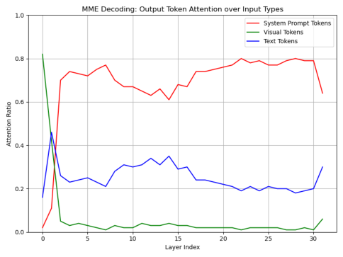

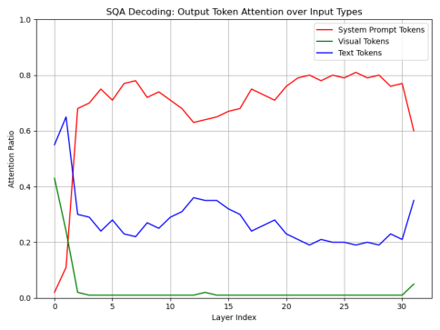

(a) MME Decoding (b) SQA Decoding

(c) GQA Decoding (d) POPE Decoding

Figure 1. Output token’s attention toward different input token types across LLM layers during decoding. Results are averaged over 100
samples per benchmark.

6

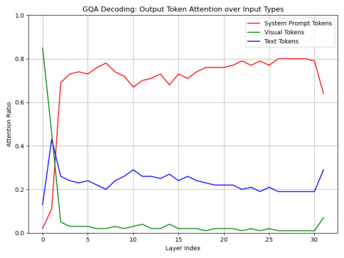

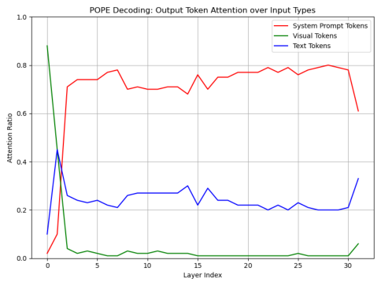
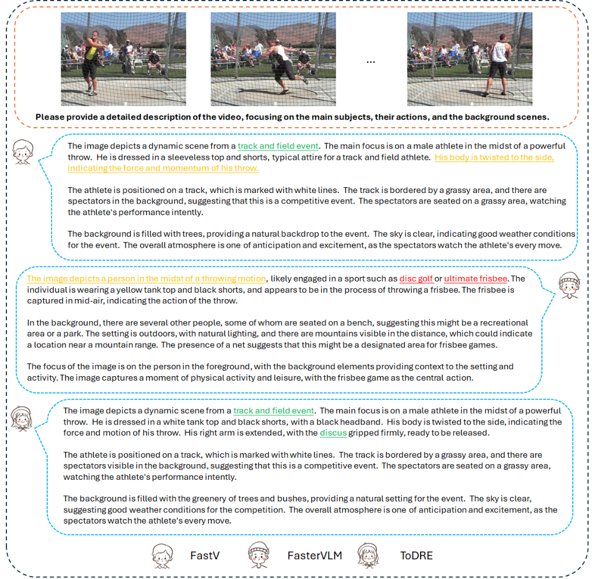

Figure 2. **Qualitative comparison of free-form video-grounded QA on the Video Detail Caption benchmark [9].** Green text highlights
correctly identified events and objects; red text indicates incorrect predictions; yellow text marks missing but essential information.

7

**MMBench**
**MME** **ScienceQA** **GQA** **POPE** **MMBench** **VQAv2**

**-CN**

**Original**

**Attention**

**Original**

**Attention**

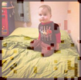

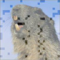

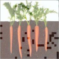

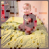

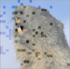

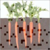

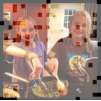

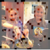

Figure 3. **Supplementary visualizations comparing attention-driven and ToDRE-based token compression.** The visualization is based
on seven benchmarks: MME [14], SQA [41], GQA [20], POPE [29], MMBench and MMBench-CN [40], VQAv2 [16]. Best viewed when
zoomed in.

8

