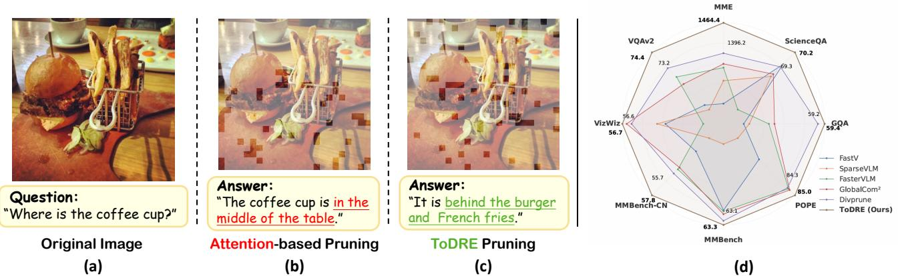
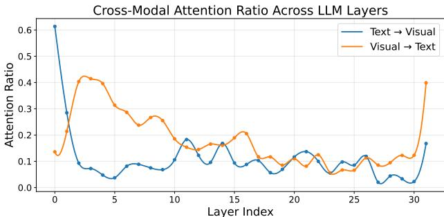

[← 返回 README](../README.md)

# 1. Introduction

## 📌 预览
Introduction 阐述 LVLM 推理效率问题、现有 token pruning 方法的局限（单一指标、positional bias、calibration 依赖）、"information migration" 现象的发现，以及 ToDRE 的两阶段设计动机和三大贡献。

---

Leveraging the superior reasoning capability of large language models (LLMs) [1, 3, 49, 52, 53], large visionlanguage models (LVLMs) [5, 21, 51, 57, 66] have achieved impressive performance in various multimodal understanding tasks such as visual question answering [16, 18, 20, 41, 48] and video understanding [15, 27, 42, 56, 65]. LVLMs convert visual inputs into visual tokens and align the converted visual tokens with text tokens for various multimodal understanding tasks. However, the inference of LVLMs often incurs prohibitive computational and memory costs due to the massive number of visual tokens involved, significantly restricting LVLM applicability in various downstream tasks.

> 💡 **问题引出**: LVLM 推理的核心瓶颈 = 大量 visual token 带来的计算和内存开销。

---

Two representative approaches have recently been explored for improving the LVLM inference efficiency. The first approach is model-centric. It speeds up the inference via knowledge distillation [8], parameter quantization [58], or transformer replacement [44]. However, this approach requires model retraining which incurs significant computational resources. The second approach is data-centric. It works by token pruning [10, 35, 38, 46, 62] or block skipping [47], and has attracted increasing attention due to its training-free and architecture-agnostic nature. Besides, the data-centric approach strikes a great balance between the inference efficiency and the model performance, offering a complementary solution to the model-centric approach.

> 💡 **两大路线对比**:
> - **Model-centric**: 蒸馏/量化/架构替换 → 需要重训练
> - **Data-centric**: Token pruning/block skipping → **training-free**，ToDRE 属于此类

---

Most existing token pruning techniques compress visual tokens by estimating "redundancy" from a single metric, such as cross-modal attention between visual and othermodality tokens [10, 46, 62, 63], visual token similarity [6, 23, 64], or the divergence of LLM's outputs before and after token pruning [35, 60]. However, attention scores exhibit clear positional bias [55] that tends to discard informative tokens erroneously (Figure 1 (b)). Similarity-based approach merges similar visual tokens whose performance is often clearly lower than direct token pruning [19]. Using output divergence requires a held-out calibration set and modelspecific distribution matching, hindering quick adaptation towards new LVLM backbones [35]. Beyond the above issues, we observe an "information migration" phenomenon (Figure 2): cross-modal attention (both visual-to-text and text-to-visual) is strong in early layers but fades in deeper layers, suggesting that visual information is progressively absorbed into text representations within the first half of the LLM decoder. Given that output tokens exhibit near-zero attention to visual tokens during decoding (see Appendix), most existing work [10, 46, 62, 63] passes all remaining visual tokens from the prefilling stage into decoding, thereby incurring unnecessary computations.

> 💡 **现有方法三大局限**:
> 1. **Attention-based** (FastV, FasterVLM): positional bias → 误删信息丰富的 token
> 2. **Similarity-based** (ToMe): merge 性能 < 直接 pruning
> 3. **Divergence-based** (VTW): 需 calibration set，难以快速迁移
>
> **关键发现 — "Information Migration"**:
> - 浅层 cross-modal attention 强（active information exchange）
> - 深层 cross-modal attention 弱（visual info 已被 text 吸收）
> - Decoding 阶段 output token 对 visual token attention ≈ 0

---

*Figure 1. (a–c): Different from the prevalent visual token pruning approach [10, 62] that overly relies on attention scores, the proposed ToDRE incorporates token diversity and task relevance, two largely neglected yet critical factors that help preserve indispensable and informative visual cues and improve pruning robustness and answer accuracy as illustrated in the coffee cup localization task. (d): Quantitative experiments over eight image-language comprehension benchmarks demonstrate the superior and consistent effectiveness of our proposed ToDRE.*

> 💡 **Figure 1 批读**:
> - **(a)** 原图 + 咖啡杯定位任务
> - **(b)** Attention-based pruning 保留的 token 集中在图像后部（positional bias），丢失了咖啡杯区域
> - **(c)** ToDRE 的 diversity-driven selection 覆盖更广，保留了咖啡杯区域
> - **(d)** 8 个 benchmark 上 ToDRE 一致领先
> - **核心对比**: attention 选 token 像"近视眼"，diversity 选 token 像"广角镜"

---

*Figure 2. Text-to-visual attention (blue) and visual-to-text attention (orange) in each LLM decoder layer. We observe a clear pattern of "information migration": cross-modal attention (both visual-to-text and text-to-visual) is high in early layers, reflecting active information exchange, but gradually diminishes in deeper layers as the model shifts toward unimodal text reasoning.*

> 💡 **Figure 2 批读**:
> - 蓝线 (text→visual) 和橙线 (visual→text) 在浅层都高
> - 约 Layer 10+ 后急剧下降 → information migration 完成
> - 深层主要做 unimodal text reasoning
> - 这为 Stage 2（在深层删除所有 visual token）提供了实证依据
> - **与 FastV 的联系**: FastV 也发现深层 attention 低，但只做了 partial pruning；ToDRE 更进一步，直接全删

---

We design TODRE, a simple yet effective token pruning technique that incorporates both visual token diversity and task-specific token relevance for effective token pruning and efficient LVLM inference. ToDRE performs token pruning in the embedding space prior to LLM input and during the LLM prefilling stage. First, we introduce a greedy max-sum diversification algorithm that iteratively identifies and preserves visual tokens that have minimal cumulative similarity to the selected tokens. Such token selection in LLM embedding space circumvents the positional bias introduced by attention-based metrics, thereby preserving a broad spectrum of visual information and enhancing the token representativeness at high pruning ratios. In addition, ToDRE leverages the "information migration" mechanism by adaptively selecting one layer in the latter half of the LLM decoder (where crossmodal attention has significantly diminished) and drops all visual tokens within that layer. This layer-level pruning removes visual tokens irrelevant to the given question and thus further eliminates redundant computation during inference. As a result, this relevance–guided pruning enables continuous inference-time efficiency gains as the decoding length increases. As shown in Figure 1 (c–d), ToDRE's two-stage design enables effective visual token compression while preserving unique visual information and maintaining strong accuracy.

> 💡 **ToDRE 两阶段设计**:
> - **Stage 1 (Diversity)**: 在 LLM embedding space 用 greedy max-sum diversification 选最多样化的 token 子集 → 避免 attention 的 positional bias
> - **Stage 2 (Relevance)**: 在 LLM decoder 后半段，自适应找到一层（cross-modal attention 已衰减），删除所有 visual token → 减少 prefilling 剩余层 + 整个 decoding 的 visual 计算
> - Stage 2 的增益随 decoding 长度增加而放大

---

In summary, our major contributions of this work are threefold:

• Revisit redundancy indicators. First, we re-examine the principles of existing indicators on token redundancy and identify their constraints via systematic and comprehensive analysis. On top of that, we prove that inter-token diversity and token-task relevance are two orthogonal factors, and treating them separately enables more effective token pruning.
• Propose a training-free and plug-and-play framework. Second, we design a two-stage plug-and-play token pruning technique that is fully compatible with efficient attention operators [13] without requiring any additional training.
• Conduct extensive empirical validation. Third, extensive experiments over four widely adopted LVLMs and twelve multimodal benchmarks show that ToDRE achieves superior token pruning consistently.

> 💡 **三大贡献**:
> 1. **重新审视冗余指标**: 证明 diversity 和 relevance 正交，分别处理更有效
> 2. **Training-free plug-and-play**: 兼容 FlashAttention 等高效算子
> 3. **全面实验**: 4 个 LVLM + 12 个 benchmark（含图像+视频）

---

## 🔖 Section 总结

### 关键概念
| 概念 | 说明 |
|------|------|
| Information Migration | 浅层 cross-modal attention 强，深层弱 → visual info 被 text 吸收 |
| Positional Bias | Attention-based pruning 偏向后部 token |
| Token Diversity | Intra-modal 冗余 → 保留最不相似的子集 |
| Task Relevance | Cross-modal 冗余 → 深层删除与 text 无关的 visual token |

### 核心洞察
1. 单一指标做 pruning 各有缺陷，需要组合 diversity + relevance
2. Information migration 是 Stage 2 的理论基础
3. 与 FastV 的本质区别：FastV 用 attention 选"重要" token，ToDRE 用 similarity 选"多样" token
