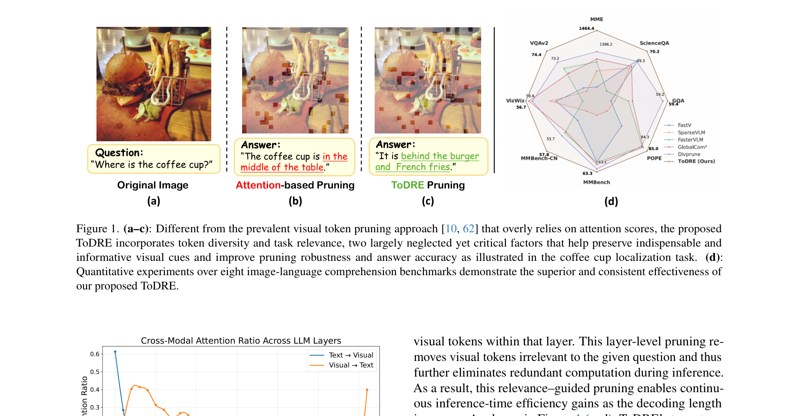
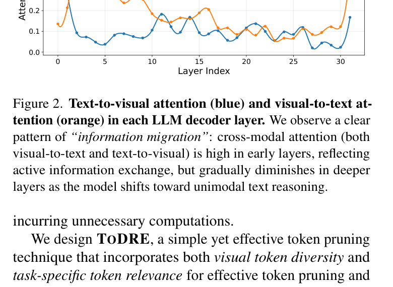

[← 返回 README](../README.md)

# 1. Introduction

## 📌 预览
Introduction 分析现有 token pruning 方法的局限（attention positional bias、similarity merging 性能差、output divergence 需要 calibration set），引出 information migration 现象，提出 ToDRE 的两阶段设计动机，最后总结三大贡献。

---

*Figure 1. **(a–c)**: Different from the prevalent visual token pruning approach [10, 62] that overly relies on attention scores, the proposed ToDRE incorporates token diversity and task relevance, two largely neglected yet critical factors that help preserve indispensable and informative visual cues and improve pruning robustness and answer accuracy as illustrated in the coffee cup localization task. **(d)**: Quantitative experiments over eight image-language comprehension benchmarks demonstrate the superior and consistent effectiveness of our proposed ToDRE.*

> 💡 **Figure 1 批读**:
> - (a) 原始图像：咖啡杯在汉堡后面
> - (b) Attention-based pruning 错误回答 "in the middle of the table"——因为 attention bias 丢弃了包含咖啡杯的 token
> - (c) ToDRE 正确回答 "behind the burger and French fries"
> - (d) 雷达图：ToDRE 在 8 个 benchmark 上全面超越 FastV、SparseVLM、FasterVLM、GlobalCom²、DivPrune

---

Leveraging the superior reasoning capability of large language models (LLMs) [1, 3, 49, 52, 53], large visionlanguage models (LVLMs) [5, 21, 51, 57, 66] have achieved
impressive performance in various multimodal understanding tasks such as visual question answering [16, 18, 20, 41,
48] and video understanding [15, 27, 42, 56, 65]. LVLMs
convert visual inputs into visual tokens and align the converted visual tokens with text tokens for various multimodal
understanding tasks. However, the inference of LVLMs often
incurs prohibitive computational and memory costs due to
the massive number of visual tokens involved, significantly
restricting LVLM applicability in various downstream tasks.

> 💡 **批注**: 标准开场——LVLM 很强但 visual token 数量巨大导致推理成本高。

---

Two representative approaches have recently been explored for improving the LVLM inference efficiency. The
first approach is _model-centric_ . It speeds up the inference
via knowledge distillation [8], parameter quantization [58],
or transformer replacement [44]. However, this approach
requires model retraining which incurs significant computational resources. The second approach is _data-centric_ . It
works by token pruning [10, 35, 38, 46, 62] or block skipping [47], and has attracted increasing attention due to its
training-free and architecture-agnostic nature. Besides, the
_data-centric_ approach strikes a great balance between the
inference efficiency and the model performance, offering a
complementary solution to the _model-centric_ approach.

> 💡 **批注**:
> - **Model-centric**: KD、量化、结构替换 → 需要重训练
> - **Data-centric**: Token pruning / block skipping → training-free，architecture-agnostic
> - ToDRE 属于 data-centric 阵营

---

Most existing token pruning techniques compress visual
tokens by estimating "redundancy" from a single metric,
such as cross-modal attention between visual and othermodality tokens [10, 46, 62, 63], visual token similarity
[6, 23, 64], or the divergence of LLM's outputs before and after token pruning [35, 60]. However, attention scores exhibit
clear positional bias [55] that tends to discard informative tokens erroneously (Figure 1 (b)). Similarity-based approach
merges similar visual tokens whose performance is often
clearly lower than direct token pruning [19]. Using output
divergence requires a held-out calibration set and modelspecific distribution matching, hindering quick adaptation
towards new LVLM backbones [35]. Beyond the above issues, we observe an " _information migration_ " phenomenon
(Figure 2): cross-modal attention (both visual-to-text and
text-to-visual) is strong in early layers but fades in deeper
layers, suggesting that visual information is progressively
absorbed into text representations within the first half of the
LLM decoder. Given that output tokens exhibit near-zero
attention to visual tokens during decoding (see Appendix),
most existing work [10, 46, 62, 63] passes all remaining
visual tokens from the prefilling stage into decoding, thereby
incurring unnecessary computations.

> 💡 **批注 — 现有方法三大局限**:
> 1. **Attention-based** [FastV, FasterVLM, SparseVLM]: positional bias → 误删重要 token
> 2. **Similarity-based** [ToMe]: merge 性能不如直接 pruning
> 3. **Output divergence** [VTW]: 需要 calibration set，模型迁移性差
> 
> **关键观察**: Information migration —— cross-modal attention 在前半段层很强，后半段几乎消失 → visual info 已经被吸收进 text representation。而且 decoding 阶段 output token 对 visual token 的 attention 接近零，说明 prefilling 之后 visual token 就不再需要了。

---

*Figure 2. **Text-to-visual attention (blue) and visual-to-text attention (orange) in each LLM decoder layer.** We observe a clear pattern of "information migration": cross-modal attention (both visual-to-text and text-to-visual) is high in early layers, reflecting active information exchange, but gradually diminishes in deeper layers as the model shifts toward unimodal text reasoning.*

> 💡 **Figure 2 批读**:
> - 蓝线（text→visual）和橙线（visual→text）在前 5-10 层都很高
> - 从第 ~15 层开始快速下降，到第 25-30 层几乎归零
> - 这就是 "information migration"：浅层做跨模态交互，深层做单模态文本推理
> - 这个观察直接激发了 Stage 2 的设计——在 attention 衰减后移除所有 visual token

---

We design **TODRE**, a simple yet effective token pruning
technique that incorporates both _visual token diversity_ and
_task-specific token relevance_ for effective token pruning and
efficient LVLM inference. ToDRE performs token pruning
in the embedding space prior to LLM input and during the
LLM prefilling stage. First, we introduce a greedy max-sum
diversification algorithm that iteratively identifies and preserves visual tokens that have minimal cumulative similarity
to the selected tokens. Such token selection in LLM embedding space circumvents the positional bias introduced by
attention-based metrics, thereby preserving a broad spectrum
of visual information and enhancing the token representativeness at high pruning ratios. In addition, ToDRE leverages the
" _information migration_ " mechanism by adaptively selecting
one layer in the latter half of the LLM decoder (where crossmodal attention has significantly diminished) and drops all
visual tokens within that layer. This layer-level pruning removes visual tokens irrelevant to the given question and thus
further eliminates redundant computation during inference.
As a result, this relevance–guided pruning enables continuous inference-time efficiency gains as the decoding length
increases. As shown in Figure 1 (c–d), ToDRE's two-stage
design enables effective visual token compression while preserving unique visual information and maintaining strong
accuracy.

> 💡 **ToDRE 方法概述**:
> - **Stage 1 — Diversity-driven Token Selection**: 在 embedding space（LLM 之前）用 greedy max-sum diversification 选择多样性最大的 token 子集 → 避免 attention positional bias
> - **Stage 2 — Relevance-driven Token Reduction**: 在 LLM decoder 后半段自适应选择一层，直接移除所有 visual token → 减少 decoding 阶段的冗余计算
> - 两阶段互补：Stage 1 处理 intra-modal redundancy，Stage 2 处理 cross-modal redundancy

---

In summary, our major contributions of this work are
threefold:

- **Revisit redundancy indicators.** First, we re-examine the
principles of existing indicators on token redundancy and
identify their constraints via systematic and comprehensive analysis. On top of that, we prove that inter-token
diversity and token-task relevance are two orthogonal factors, and treating them separately enables more effective
token pruning.

- **Propose a training-free and plug-and-play framework.**
Second, we design a two-stage plug-and-play token pruning technique that is fully compatible with efficient attention operators [13] without requiring any additional
training.

- **Conduct extensive empirical validation.** Third, extensive experiments over four widely adopted LVLMs and
twelve multimodal benchmarks show that ToDRE achieves
superior token pruning consistently.

> 💡 **三大贡献**:
> 1. 理论：证明 diversity 和 relevance 是正交的
> 2. 方法：两阶段 training-free plug-and-play，兼容 FlashAttention
> 3. 实验：4 个 LVLM × 12 个 benchmark

---

## 🔖 Section 总结

### 关键数字速查
| 指标 | 数值 |
|------|------|
| Visual token 数量（LLaVA-NeXT） | ~2880 |
| ToDRE pruning 比例 | 90% |
| 性能保持 | 95.0% |
| 推理加速 | 2.6× |
| 测试 LVLM 数量 | 4 |
| 测试 benchmark 数量 | 12 |

### 核心洞察
1. 现有单一指标（attention/similarity/divergence）各有缺陷
2. Information migration 现象：cross-modal attention 在深层消失
3. Diversity 和 relevance 是正交因素，应分别处理
