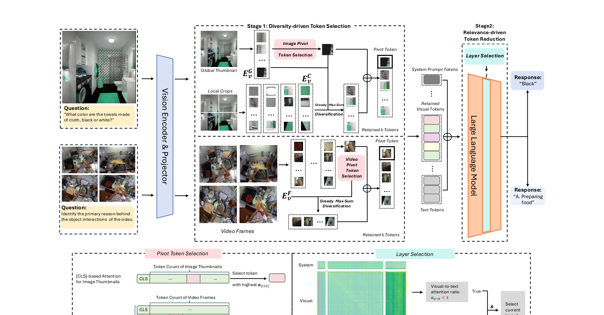

[← 返回 README](../README.md)

# 4. Visual Token Pruning with Token Diversity and Task Relevance

## 📌 预览
ToDRE 核心方法：**Stage 1** 在 embedding space 用 greedy max-sum diversification 选择多样性最大的 k 个 visual token（pivot 选择 + 贪心扩展）；**Stage 2** 在 LLM decoder 后半段自适应选层，当 cross-modal attention ratio 低于阈值 τ 时移除全部 visual token。两阶段分别处理 intra-modal 和 cross-modal redundancy。

---

*Figure 3. **Overall framework of ToDRE.** Given the visual and textual inputs, the proposed Diversity-driven Token Selection first selects a pivot token from global thumbnail or video frames with [CLS]-based attention and then performs max-sum diversification to retain a diverse set of k visual tokens. The proposed Relevance-driven Token Reduction then dynamically identifies a pivot decoder layer and prunes all its visual tokens—the layer is identified if its visual-to-text and text-to-visual attention ratios both fall below a predefined threshold τ. **Ev^G**, **Ev^C**, and **Ev^F** denote the embeddings of thumbnail, local crops, and video frames, respectively.*

> 💡 **Figure 3 批读**:
> - 左半部分（Stage 1）：Image 走 AnyRes（global thumbnail + local crops），Video 走多帧；[CLS] attention 选 pivot → greedy diversification 保留 k tokens
> - 右半部分（Stage 2）：在 LLM decoder 的某一层（7L/8 附近），检测 cross-modal attention ratio < τ 后移除全部 visual token
> - 注意：Stage 1 在 LLM 之前，Stage 2 在 LLM prefilling 中间

---

Building on the preliminary analysis, we introduce ToDRE,
a two-stage, training-free, and plug-and-play visual token
compression framework (see Figure 3). ToDRE utilizes
a similarity-guided greedy search in the LLM embedding
space to select a maximally diverse subset of visual tokens,
followed by an adaptive task-relevance-based pruning mechanism within the LLM decoder. Next, we elaborate on each
stage in detail.

> 💡 **批注**: 注意是在 **LLM embedding space**（projector 输出之后）做 diversification，而不是在 vision encoder 内部。这确保了 token 表示已经与 text space 对齐。

---

## 4.1. Diversity-Driven Token Selection

To obtain a maximally diverse subset of visual tokens, we
adopt a greedy max-sum diversification algorithm [22] consisting of two steps: (1) initializing a retention set by selecting the initial pivot token, and (2) iteratively adding the token
that minimizes its cumulative similarity to the current set.
Full pseudocode of our proposed token retention algorithm
is provided in Appendix.

> 💡 **批注**: Max-sum diversification [Gollapudi & Sharma, VLDB 2009] 是信息检索中的经典算法，目标是从集合中选出 k 个元素使得两两距离之和最大。贪心近似有 2-approximation 保证。

---

### Pivot Token Selection

**Pivot Token Selection.** To determine the initial pivot, we
leverage the [CLS] attention from the last layer of the vision
encoder [45] as an importance indicator. The attention from
the [CLS] token _**z**_ [CLS] _∈_ R _[d]_ to other visual tokens _**Z**_ _v_ _∈_
R _[n][×][d]_ is calculated as:

_**q**_ [CLS] = _**z**_ [CLS] _**W**_ _Q,_ _**K**_ _v_ = _**Z**_ _v_ _**W**_ _K,_

_**q**_ [CLS] ~~_√_~~ _**K**_ _[⊤]_ _v_

_**a**_ [CLS] = Softmax

_d_

(3)

where _n_ is the length of the visual token sequence; _d_ is
the hidden state size of vision encoder; _**W**_ _Q_ _∈_ R _[d][×][d]_ and
_**W**_ _K_ _∈_ R _[d][×][d]_ represent the weight matrices for queries and
keys, respectively.

> 💡 **批注**: Pivot 选择用的是 vision encoder 最后一层的 [CLS] attention，不是 LLM 的 attention。这里只用来选一个初始 token，后续的 diversification 不依赖 attention。

---

As shown in Figure 3-(a), pivot token selection proceeds
as follows: (1) _Image Inputs with AnyRes [36] Support_ : In
this case, LVLM yields one global thumbnail _G_ along with
several local crops _C_ . We compute the [CLS] attention
score for each token in the global thumbnail and choose the
token with the highest score as the pivot, since it captures the
most comprehensive global information. (2) _Image Inputs_
_without AnyRes Support_ : The pivot token is selected from all
visual tokens of the original image, using the same [CLS]-
based criterion. (3) _Video Inputs_ : We first identify, for each
frame, the visual token with the highest [CLS] attention.
The final pivot token is then selected as the one with the
highest score among these frame-wise candidates.

> 💡 **批注**: 三种场景的 pivot 选择：
> - AnyRes image → 从 global thumbnail 选（因为 global 有全局信息）
> - 普通 image → 从所有 token 选
> - Video → 先每帧选最佳，再跨帧选最佳
> 
> 附录中有实验表明 random pivot 性能也接近，说明 diversification 算法对初始点不太敏感。

---

For MLLMs without a [CLS] token in their encoders, a
random selection strategy is also acceptable, as it yields performance that is nearly comparable to the original approach.
We provide a detailed comparison of different pivot token
selection strategies in Appendix.

---

### Greedy Max-Sum Diversification

**Greedy Max-Sum Diversification.** The expansion starts
from the designated pivot. At iteration _t_, we pick a new
token index _c_ [(] _[t]_ [)] by minimizing its _cumulative_ similarity to
the already selected set:

_c_ [(] _[t]_ [)] = arg min
_v∈V \C_ [(] _[t][−]_ [1)]

 
_s_ ( **x** _v,_ **x** _c_ )

_c∈C_ [(] _[t][−]_ [1)]

, (4)

where **x** _v_ and **x** _c_ denote visual token features with indices
_v_ and _c_, and _C_ [(] _[t][−]_ [1)] is the selected set from the previous
iteration. The similarity between two tokens is measured
with cosine similarity

**x** _[⊤]_ _v_ **[x]** _[c]_
_s_ ( **x** _v,_ **x** _c_ ) = _∥_ **x** _v∥∥_ **x** _c∥_ _._ (5)

> 💡 **批注**: 算法核心：每次选与已选集合**累计相似度最小**的 token。等价于最大化 sum of distances (d=1−s)。
> - 时间复杂度：O(nk)，n=原始 token 数，k=保留数
> - 空间复杂度：O(n)（只需维护每个候选的累计相似度）

---

Equivalently, (4) maximizes the _sum of distances_ if _d_ ( _·, ·_ ) =
1 _−_ _s_ ( _·, ·_ ). After selecting _c_ [(] _[t]_ [)], we update the cumulative
similarities by adding its contribution:

_∀v_ _∈_ _V_ _\ C_ [(] _[t]_ [)] : _Sv_ [(] _[t]_ [)] = _Sv_ [(] _[t][−]_ [1)] + _s_ ( **x** _v,_ **x** _c_ ( _t_ )) _,_ (6)

and mask the chosen index. This greedy procedure repeats
until _k_ diverse tokens (e.g., _k_ =288, about 10% of visual
tokens) are retained, yielding

_C_ = _{c_ [(1)] _, c_ [(2)] _, . . ., c_ [(] _[k]_ [)] _}._ (7)

Finally, all remaining visual tokens are discarded; the retained visual tokens together with all text tokens are fed to
the LLM decoder for inference.

> 💡 **批注**: 
> - 默认 k=288（10% of 2880）或 k=720（25%）
> - 增量更新 Sv 是关键优化——不需要每轮重新计算所有 pair 的相似度
> - 与 DivPrune 的区别：DivPrune 也用 diversity，但没有 Stage 2

---

## 4.2. Relevance-Driven Token Compression

While strategies involving partial or multi-stage pruning
could be further applied, we argue that such strategies are
unnecessary, since the majority of visual tokens have already
been removed at Stage 1. In contrast to VTW [35], which
relies on post hoc KL-divergence comparisons to determine
the optimal pruning layer—a method that is indirect and
non-intuitive—we propose a forward-pass metric based on
cross-modal attention that directly identifies the most appropriate layer in LLM for token removal based on actual token
interaction. As shown in Figure 3-(b), all visual tokens are
removed after this selected layer.

> 💡 **批注**: Stage 2 的关键设计决策：
> 1. 不做逐 token 的 relevance pruning，而是**整层移除所有 visual token**
> 2. 不用 KL-divergence（VTW 方式），而是直接看 cross-modal attention ratio
> 3. 理由：Stage 1 已经去掉 90% token，剩下的 10% 再做细粒度选择收益小

---

Specifically, let _L_ be the number of decoder layers of
LLM. Based on our empirical observation (Figure 2) that
deeper layers exhibit limited cross-modal interaction, we
compute cross-modal attention ratios only at a few selected
layers in the later prefilling stages of the model. Since these
attention ratios tend to remain stable across consecutive
deeper layers, computing them at every layer would introduce unnecessary overhead. In our implementation, we select layers located at fractional depth 7 _L/_ 8. A more detailed
ablation of layer selection can be found in Appendix. At
each selected layer _ℓ_, we compute two cross-modal attention ratios based on average attention probabilities across all
attention heads and tokens:

_αt_ [(] _→_ _[ℓ]_ [)] _v_ [=]

_αv_ [(] _[ℓ]_ _→_ [)] _t_ [=]

 ​ 
_i∈T_ _j∈V_ _[A]_ _ij_ [(] _[ℓ]_ [)]

​ 

 ​ 
_i∈V_ _j∈T_ _[A]_ _ij_ [(] _[ℓ]_ [)]

​ 

 _i∈V_

 _i∈T_

,
_j∈S∪V ∪T_ _[A]_ _ij_ [(] _[ℓ]_ [)]

,
_j∈S∪V ∪T_ _[A]_ _ij_ [(] _[ℓ]_ [)]

(8)

> 💡 **批注 — 两个 attention ratio**:
> - **α_t→v**: text token 对 visual token 的平均 attention 占比（text 还在"看" visual 吗？）
> - **α_v→t**: visual token 对 text token 的平均 attention 占比（visual 还在"交流"吗？）
> - 分母是对所有 token (S∪V∪T) 的 attention 总和 → 得到的是一个比例

---

where _A_ _[ℓ]_ _ij_ denotes the softmax-normalized attention
weight from query token _i_ to key token _j_ at layer _ℓ_ ; _S_,
_V_, and _T_ represent the system prompt, visual, and textual
tokens, respectively. To further enhance efficiency, all visual
tokens are removed at a certain layer _ℓ_ if and only if both
_αt_ [(] _→_ _[ℓ]_ [)] _v_ and _αv_ [(] _[ℓ]_ _→_ [)] _t_ are lower than a threshold _τ_ . A more detailed ablation of the threshold can be found in Appendix.

> 💡 **批注**: 
> - 双条件判断：**两个 ratio 都低于 τ** 才移除 → 保守策略，避免过早删除
> - τ 的选择见附录 ablation（不同 τ 对性能的影响）
> - 只检查 7L/8 附近的几层 → 额外计算开销很小

---

By removing all visual tokens at this point, the model further avoids redundant visual computation in the remaining
prefilling and decoding stages, yielding slight improvements
in both efficiency and performance.

> 💡 **批注**: 有趣的是 Stage 2 不仅提升效率，还**略微提升性能**（Table 5 中 +0.1~0.2%）。作者的解释是移除了干扰 task-relevant reasoning 的冗余 visual token。

---

## 🔖 Section 总结

### 算法流程速查
| 步骤 | 操作 | 位置 | 输入→输出 |
|------|------|------|-----------|
| Stage 1a | Pivot token selection | Vision encoder 最后一层 | [CLS] attention → 1 个 pivot |
| Stage 1b | Greedy max-sum diversification | LLM embedding space | n tokens → k tokens (e.g., 288) |
| Stage 2 | Cross-modal attention ratio check | LLM decoder layer ≥ 7L/8 | α_t→v < τ && α_v→t < τ → 移除全部 visual token |

### 与竞品方法对比
| 方法 | Stage 1 策略 | Stage 2 策略 | 需要 calibration? |
|------|-------------|-------------|------------------|
| FastV | — | Attention-based pruning | No |
| FasterVLM | [CLS] attention pruning | — | No |
| VTW | — | KL-divergence 选层 | **Yes** |
| DivPrune | Diversity pruning | — | No |
| **ToDRE** | **Diversity (max-sum)** | **Attention ratio 选层 + 全删** | **No** |

### 核心洞察
1. Greedy max-sum diversification 复杂度 O(nk)，增量更新高效
2. Stage 2 是"粗暴但有效"的整层删除，而非逐 token 选择
3. 两阶段互补：diversity 处理 intra-modal，relevance 处理 cross-modal
