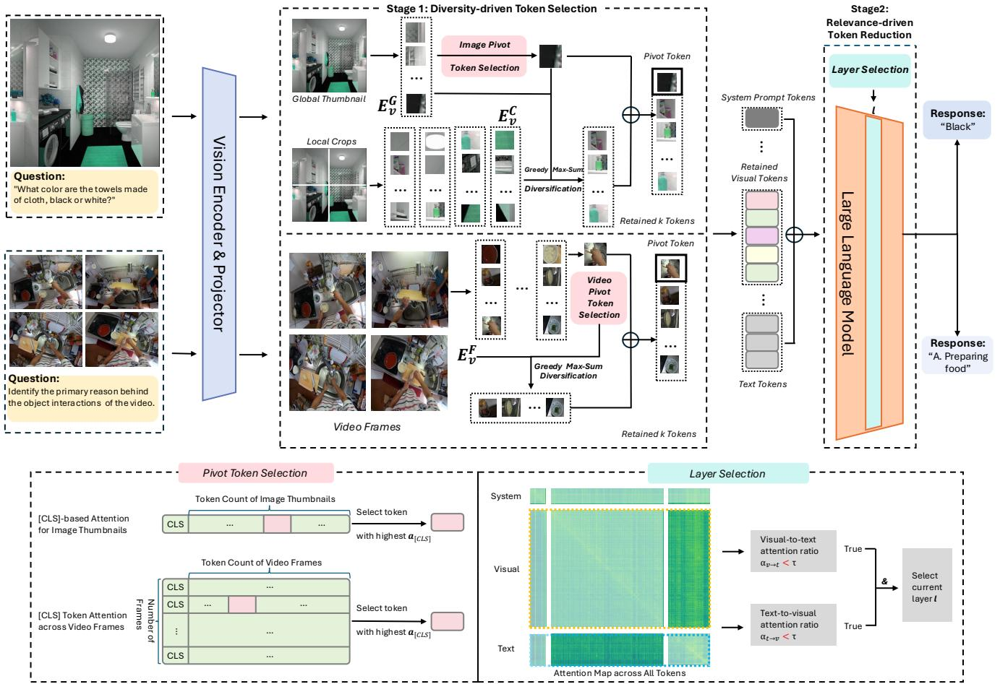

[← 返回 README](../README.md)

# 4. Visual Token Pruning with Token Diversity and Task Relevance

## 📌 预览
ToDRE 两阶段方法详解：Stage 1 (§4.1) 用 greedy max-sum diversification 在 embedding space 中选 k 个最多样 token；Stage 2 (§4.2) 在 LLM decoder 后半段自适应找到 cross-modal attention 衰减的层，删除全部 visual token。

---

Building on the preliminary analysis, we introduce ToDRE, a two-stage, training-free, and plug-and-play visual token compression framework (see Figure 3). ToDRE utilizes a similarity-guided greedy search in the LLM embedding space to select a maximally diverse subset of visual tokens, followed by an adaptive task-relevance-based pruning mechanism within the LLM decoder. Next, we elaborate on each stage in detail.

---


*Figure 3. Overall framework of ToDRE. Given the visual and textual inputs, the proposed Diversity-driven Token Selection first selects a pivot token from global thumbnail or video frames with [CLS]-based attention and then performs max-sum diversification to retain a diverse set of $k$ visual tokens. The proposed Relevance-driven Token Reduction then dynamically identifies a pivot decoder layer and prunes all its visual tokens—the layer is identified if its visual-to-text and text-to-visual attention ratios both fall below a predefined threshold $\tau$ . $E _ { v } ^ { G } , E _ { v } ^ { C }$ , and $E _ { v } ^ { F }$ denote the embeddings of thumbnail, local crops, and video frames, respectively.*

> 💡 **Figure 3 批读 — ToDRE 全流程**:
> - **左半 (Stage 1)**: Image → ViT → Projector → [CLS] attention 选 pivot → greedy diversification 选 k 个 token → 送入 LLM
> - **右半 (Stage 2)**: LLM prefilling 进行中 → 在深层检测 cross-modal attention ratio → 低于 τ 时删除所有 visual token
> - 支持三种输入：AnyRes thumbnail + crops ($E_v^G, E_v^C$)、普通图像、视频帧 ($E_v^F$)
> - 关键细节：Stage 1 在 LLM **之前**执行，Stage 2 在 LLM **之内**执行

---

# 4.1. Diversity-Driven Token Selection

To obtain a maximally diverse subset of visual tokens, we adopt a greedy max-sum diversification algorithm [22] consisting of two steps: (1) initializing a retention set by selecting the initial pivot token, and (2) iteratively adding the token that minimizes its cumulative similarity to the current set. Full pseudocode of our proposed token retention algorithm is provided in Appendix.

> 💡 **算法选择**: Greedy max-sum diversification [22] — 来自信息检索领域的经典算法，此处巧妙迁移到 token 选择问题。

---

**Pivot Token Selection.** To determine the initial pivot, we leverage the [CLS] attention from the last layer of the vision encoder [45] as an importance indicator. The attention from the [CLS] token $z _ { \mathrm { [ C L S ] } } \in \mathbb { R } ^ { d }$ to other visual tokens $Z _ { v } \in$ $\mathbb { R } ^ { n \times d }$ is calculated as:

$$
\begin{array} { r l } & { { \pmb q } _ { \mathrm { [ C L S ] } } = z _ { \mathrm { [ C L S ] } } { \cal W } _ { Q } , \quad { \pmb K } _ { v } = { \pmb Z } _ { v } { \pmb W } _ { K } , } \\ & { { \pmb a } _ { \mathrm { [ C L S ] } } = \mathrm { S o f t m a x } \bigg ( \frac { { \pmb q } _ { \mathrm { [ C L S ] } } { \pmb K } _ { v } ^ { \top } } { \sqrt { d } } \bigg ) , } \end{array}
$$

where $n$ is the length of the visual token sequence; $d$ is the hidden state size of vision encoder; $W _ { Q } \in \mathbb { R } ^ { d \times d }$ and $W _ { K } \in \mathbb { R } ^ { d \times d }$ represent the weight matrices for queries and keys, respectively.

As shown in Figure 3-(a), pivot token selection proceeds as follows: (1) Image Inputs with AnyRes [36] Support: In this case, LVLM yields one global thumbnail $G$ along with several local crops $C$ . We compute the [CLS] attention score for each token in the global thumbnail and choose the token with the highest score as the pivot, since it captures the most comprehensive global information. (2) Image Inputs without AnyRes Support: The pivot token is selected from all visual tokens of the original image, using the same [CLS]- based criterion. (3) Video Inputs: We first identify, for each frame, the visual token with the highest [CLS] attention. The final pivot token is then selected as the one with the highest score among these frame-wise candidates.

For MLLMs without a [CLS] token in their encoders, a random selection strategy is also acceptable, as it yields performance that is nearly comparable to the original approach. We provide a detailed comparison of different pivot token selection strategies in Appendix.

> 💡 **Pivot 选择策略**:
> - 利用 ViT 最后一层 [CLS] → visual token 的 attention 选最重要的 token 作为起点
> - AnyRes: 从 global thumbnail 选（最有全局信息）
> - Video: 逐帧选最佳，再跨帧选最佳
> - 无 [CLS] 时可随机选，性能几乎无损（Appendix Table 1 验证）
> - **设计哲学**: pivot 不需要很精确，因为后续 diversification 会自然覆盖全局

---

**Greedy Max-Sum Diversification.** The expansion starts from the designated pivot. At iteration $t$ , we pick a new token index $c ^ { ( \bar { t } ) }$ by minimizing its cumulative similarity to the already selected set:

$$
c ^ { ( t ) } = \underset { v \in V \backslash \mathcal { C } ^ { ( t - 1 ) } } { \arg \operatorname* { m i n } } \left[ \sum _ { c \in \mathcal { C } ^ { ( t - 1 ) } } s ( \mathbf { x } _ { v } , \mathbf { x } _ { c } ) \right] ,
$$

where $\mathbf { x } _ { v }$ and $\mathbf { x } _ { c }$ denote visual token features with indices $v$ and $c$ , and $\mathcal { C } ^ { ( t - 1 ) }$ is the selected set from the previous iteration. The similarity between two tokens is measured with cosine similarity

$$
s ( \mathbf { x } _ { v } , \mathbf { x } _ { c } ) = \frac { \mathbf { x } _ { v } ^ { \top } \mathbf { x } _ { c } } { \| \mathbf { x } _ { v } \| \left\| \mathbf { x } _ { c } \right\| } .
$$

Equivalently, (4) maximizes the sum of distances if $d ( \cdot , \cdot ) =$ $1 - s ( \cdot , \cdot )$ . After selecting $c ^ { ( t ) }$ , we update the cumulative similarities by adding its contribution:

$$
\forall v \in V \setminus \mathcal { C } ^ { ( t ) } : ~ S _ { v } ^ { ( t ) } = S _ { v } ^ { ( t - 1 ) } + s ( \mathbf { x } _ { v } , \mathbf { x } _ { c ^ { ( t ) } } ) ,
$$

and mask the chosen index. This greedy procedure repeats until $k$ diverse tokens (e.g., $k { = } 2 8 8$ , about $1 0 \%$ of visual tokens) are retained, yielding

$$
{ \mathcal C } = \{ c ^ { ( 1 ) } , c ^ { ( 2 ) } , \ldots , c ^ { ( k ) } \} .
$$

Finally, all remaining visual tokens are discarded; the retained visual tokens together with all text tokens are fed to the LLM decoder for inference.

> 💡 **Greedy Max-Sum Diversification 算法解析**:
> - **核心思想**: 每次选与已选集合**累积相似度最小**的 token → 最大化多样性
> - **复杂度**: O(k·n)，其中 k 是保留数量，n 是总 token 数
> - **增量更新**: 公式 (6) 只需加一次向量内积，无需重新计算所有 pair
> - **实现 trick**: ℓ₂ normalize 后 cosine similarity = 点积，可高效批量计算
> - **k=288**: 保留约 10% token（2880 → 288）
>
> **与 DivPrune [2] 的区别**: DivPrune 用 min-max diversity（最大化最小距离），ToDRE 用 max-sum diversity（最大化总距离）。Max-sum 更稳定，不会被 outlier 主导。

---

# 4.2. Relevance-Driven Token Compression

While strategies involving partial or multi-stage pruning could be further applied, we argue that such strategies are unnecessary, since the majority of visual tokens have already been removed at Stage 1. In contrast to VTW [35], which relies on post hoc KL-divergence comparisons to determine the optimal pruning layer—a method that is indirect and non-intuitive—we propose a forward-pass metric based on cross-modal attention that directly identifies the most appropriate layer in LLM for token removal based on actual token interaction. As shown in Figure 3-(b), all visual tokens are removed after this selected layer.

> 💡 **Stage 2 设计决策**:
> - Stage 1 已删 90% → Stage 2 不用再做 partial pruning，直接**全删**
> - VTW 用 KL divergence（需额外前向传播对比）→ 间接且低效
> - ToDRE 用 cross-modal attention ratio → 在正常前向传播中顺带计算，零额外开销

---

Specifically, let $L$ be the number of decoder layers of LLM. Based on our empirical observation (Figure 2) that deeper layers exhibit limited cross-modal interaction, we compute cross-modal attention ratios only at a few selected layers in the later prefilling stages of the model. Since these attention ratios tend to remain stable across consecutive deeper layers, computing them at every layer would introduce unnecessary overhead. In our implementation, we select layers located at fractional depth $7 L / 8$ . A more detailed ablation of layer selection can be found in Appendix. At each selected layer $\ell$ , we compute two cross-modal attention ratios based on average attention probabilities across all attention heads and tokens:

$$
\begin{array} { r l } & { \alpha _ { t  v } ^ { ( \ell ) } = \frac { \sum _ { i \in T } \sum _ { j \in V } A _ { i j } ^ { ( \ell ) } } { \sum _ { i \in T } \sum _ { j \in S \cup V \cup T } A _ { i j } ^ { ( \ell ) } } , } \\ & { \alpha _ { v  t } ^ { ( \ell ) } = \frac { \sum _ { i \in V } \sum _ { j \in T } A _ { i j } ^ { ( \ell ) } } { \sum _ { i \in V } \sum _ { j \in S \cup V \cup T } A _ { i j } ^ { ( \ell ) } } , } \end{array}
$$

where $A _ { i j } ^ { \ell }$ denotes the softmax-normalized attention weight from query token $i$ to key token $j$ at layer $\ell ; ~ S$ $V$ , and $T$ represent the system prompt, visual, and textual tokens, respectively. To further enhance efficiency, all visual tokens are removed at a certain layer $\ell$ if and only if both $\alpha _ { t  v } ^ { ( \ell ) }$ and $\alpha _ { v  t } ^ { ( \ell ) }$ are lower than a threshold $\tau$ . A more detailed ablation of the threshold can be found in Appendix.

By removing all visual tokens at this point, the model further avoids redundant visual computation in the remaining prefilling and decoding stages, yielding slight improvements in both efficiency and performance.

> 💡 **Stage 2 技术细节**:
> - **检测层**: 只在 7L/8 处检测（不需逐层）
> - **双向检测**: 同时要求 text→visual ($α_{t→v}$) 和 visual→text ($α_{v→t}$) 都低于阈值 τ
> - **阈值 τ = 0.10**: Appendix 消融显示这是效率/性能最佳平衡点
> - **一旦触发**: 删除该层之后所有 visual token 的 KV cache → 剩余 prefilling 层和整个 decoding 阶段都不再有 visual token
>
> **性能反而微提升的原因**: 删除 task-irrelevant visual token 减少了对 text reasoning 的干扰

---

## 🔖 Section 总结

### 算法伪代码要点
```
Stage 1: Diversity-Driven Selection
  1. 选 pivot（[CLS] attention 最高的 token）
  2. 循环 k-1 次：选与已选集累积 cosine similarity 最小的 token
  3. 输出 k 个 diverse token

Stage 2: Relevance-Driven Reduction
  1. LLM prefilling 正常进行到 7L/8 层
  2. 计算 α_t→v 和 α_v→t
  3. 若两者都 < τ=0.10，删除所有 visual token
  4. 剩余层和 decoding 无 visual token
```

### 关键超参数
| 超参数 | 默认值 | 说明 |
|--------|--------|------|
| k (保留 token 数) | 288 (10%) 或 720 (25%) | Stage 1 输出 |
| 检测层位置 | 7L/8 | Stage 2 触发位置 |
| τ (attention 阈值) | 0.10 | 双向 attention ratio 阈值 |

### 核心洞察
1. Max-sum diversification 比 attention-based selection 更鲁棒，避免 positional bias
2. Stage 2 零额外计算开销（利用正常 forward pass 的 attention）
3. 全删（而非 partial prune）简单高效，因 Stage 1 已充分压缩
