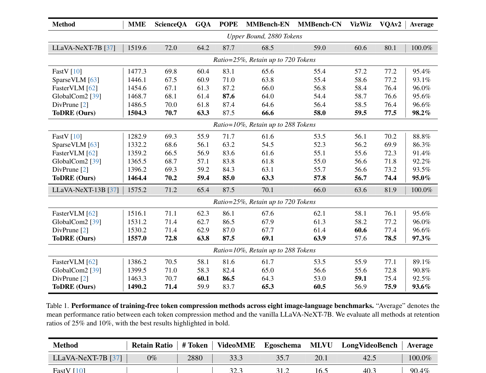
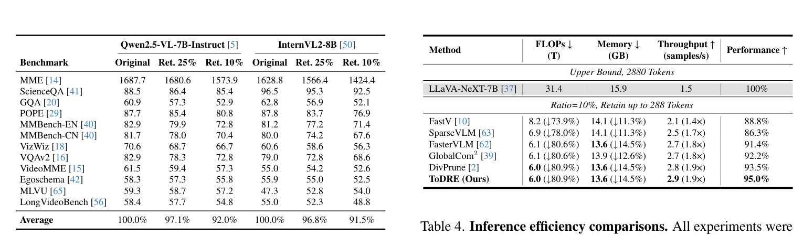
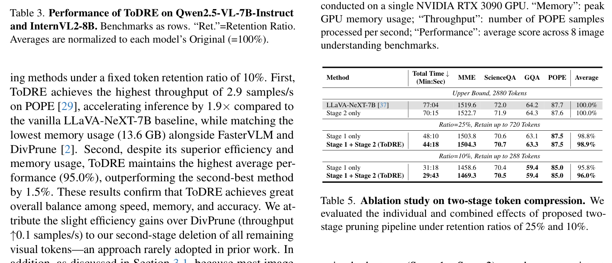
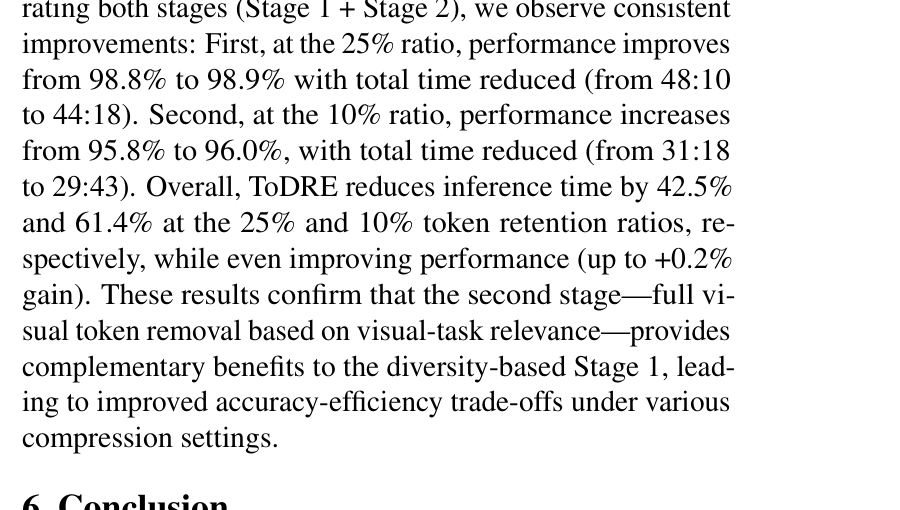
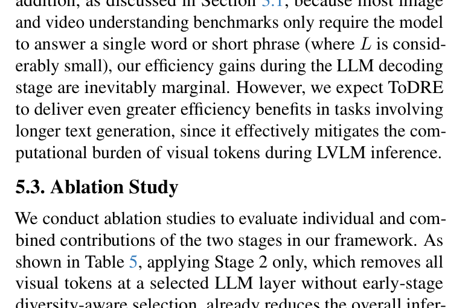

[← 返回 README](../README.md)

# 5. Experiments

## 📌 预览
在 4 个 LVLM（LLaVA-NeXT-7B/13B、Qwen2.5-VL-7B、InternVL2-8B）× 12 个 benchmark 上验证 ToDRE：image 任务 8 个 + video 任务 4 个。ToDRE 在 10% retention 下保持 95.0% 性能，throughput 2.9 samples/s（1.9×加速），memory 13.6GB（↓14.5%）。Ablation 证实两阶段互补。

---

**Experimental Setting.** We evaluate ToDRE over multiple
prevalent LVLMs (including LLaVA-NeXT-7B/13B [37],
Qwen2.5-VL-7B-Instruct [5], and InternVL2-8B [50]) and
twelve widely adopted benchmarks (including eight on image understanding tasks and four on video understanding
tasks). More details on the benchmarks, network backbones,
and comparison methods can be found in the Appendix.

> 💡 **批注**: 实验设置覆盖面广——4 个不同架构的 LVLM + 12 个 benchmark（image+video），且包含 7B 和 13B 模型规模对比。

---

## 5.1. Benchmarking

### Image Understanding Tasks

**Image Understanding Tasks.** In Table 1, we report ToDRE's performance on a range of image-understanding
benchmarks at different token-retention ratios. First, under the same setup where 75% of visual tokens are pruned in
Stage 1—matching competing methods—ToDRE further removes all remaining visual tokens in Stage 2 and achieves a
98.2% average score, outperforming the second-best method
by 1.6%. Second, under more extreme compression (only
10% of visual tokens are retained), ToDRE surpasses the
second-best approach by 1.5%. Third, ToDRE also achieves
top performance on larger models, reaching an average score
of 93.6% on the 13B variant—demonstrating strong adaptability across model scales. Note that FastV [10] and SparseVLM [63] are excluded from the 13B comparison, as
their pruning strategies, originally tailored for the 7B model,
lead to substantial performance degradation when directly
transferred to the 13B model. This further underscores the
robustness and transferability of ToDRE.

> 💡 **批注 — Table 1 要点**:
> - **25% retention**: ToDRE 98.2%（+1.6% vs DivPrune 96.6%）
> - **10% retention**: ToDRE 95.0%（+1.5% vs DivPrune 93.5%）
> - **13B 模型**: FastV 和 SparseVLM 无法迁移（性能崩塌），ToDRE 93.6% 依然最佳
> - ToDRE 在 POPE 上始终接近 baseline（87.5 vs 87.7），说明 diversity selection 不会丢失关键 object 信息

---

*Table 1. Performance of training-free token compression methods across eight image-language benchmarks.*

---

### Video Understanding Tasks

**Video Understanding Tasks.** To further assess ToDRE's
generalization ability, we evaluate it on both short- and longform video understanding benchmarks. As shown in Table 2,
ToDRE outperforms the baseline by 3.1% and 0.9% under the same token retention ratios used for images, and
surpasses the second-best method by 0.6% and 0.2%, respectively. Interestingly, ToDRE even surpasses the baseline
model in some cases. We attribute this to the reduced interference from redundant visual tokens, which may otherwise suppress task-relevant information during inference. Similarly,
SparseVLM is excluded due to transferability issues, and
GlobalCom2 [39] is omitted as it is specifically designed for
image-only inputs. In contrast, ToDRE demonstrates broad
generalization across both modalities and model scales.

> 💡 **批注**: 
> - ToDRE 在 video 上竟然**超越 baseline**（103.1% at 25% retention）！冗余 token 反而干扰了推理
> - 这与 FastV 论文中类似的观察一致——适当 pruning 可以是一种隐式的 denoising
> - GlobalCom² 不支持 video（架构限制），SparseVLM 迁移性差

---

*Table 2. Performance of training-free token compression methods across four video-language benchmarks.*

---

### Cross-Model Evaluation

**Cross-Model Evaluation.** As shown in Table 3, we further evaluate ToDRE on Qwen and InternVL backbones.
Specifically, ToDRE retains 97.1% and 96.8% of the original
performance on Qwen2.5-VL-7B-Instruct and InternVL2-
8B at a 25% retention ratio, respectively, and still maintains
more than 90% of the original performance even when only
10% of visual tokens are preserved, demonstrating strong
robustness across different model architectures.

> 💡 **批注**: Training-free + architecture-agnostic 的关键验证：
> - Qwen2.5-VL（非 CLIP encoder）：25% → 97.1%，10% → 92.0%
> - InternVL2（InternViT encoder）：25% → 96.8%，10% → 91.5%
> - 跨架构性能稳定，说明 diversity-based selection 不依赖特定 encoder

---

*Table 3. Performance of ToDRE on Qwen2.5-VL-7B-Instruct and InternVL2-8B.*

---

## 5.2. Efficiency

As shown in Table 4, we compare FLOPs, peak memory usage, throughput, and performance across various token pruning methods under a fixed token retention ratio of 10%. First,
ToDRE achieves the highest throughput of 2.9 samples/s
on POPE [29], accelerating inference by 1.9 _×_ compared to
the vanilla LLaVA-NeXT-7B baseline, while matching the
lowest memory usage (13.6 GB) alongside FasterVLM and
DivPrune [2]. Second, despite its superior efficiency and
memory usage, ToDRE maintains the highest average performance (95.0%), outperforming the second-best method
by 1.5%. These results confirm that ToDRE achieves great
overall balance among speed, memory, and accuracy. We attribute the slight efficiency gains over DivPrune (throughput
_↑_ 0.1 samples/s) to our second-stage deletion of all remaining
visual tokens—an approach rarely adopted in prior work. In
addition, as discussed in Section 3.1, because most image
and video understanding benchmarks only require the model
to answer a single word or short phrase (where _L_ is considerably small), our efficiency gains during the LLM decoding
stage are inevitably marginal. However, we expect ToDRE
to deliver even greater efficiency benefits in tasks involving
longer text generation, since it effectively mitigates the computational burden of visual tokens during LVLM inference.

> 💡 **批注 — Table 4 效率数据**:
> | 指标 | LLaVA-NeXT-7B (baseline) | ToDRE |
> |------|--------------------------|-------|
> | FLOPs | 31.4T | 6.0T (↓80.9%) |
> | Memory | 15.9GB | 13.6GB (↓14.5%) |
> | Throughput | 1.5 samples/s | 2.9 samples/s (1.9×) |
> | Performance | 100% | 95.0% |
> 
> - ToDRE vs DivPrune 差异很小（throughput +0.1），因为 Stage 2 的收益主要在长文本生成场景
> - 作者坦承 benchmark 多为短回答，Stage 2 的效率优势未充分体现

---

*Table 4. Inference efficiency comparisons.*

---

## 5.3. Ablation Study

We conduct ablation studies to evaluate individual and combined contributions of the two stages in our framework. As
shown in Table 5, applying Stage 2 only, which removes all
visual tokens at a selected LLM layer without early-stage
diversity-aware selection, already reduces the overall inference time by 8.8% compared to unpruned LLaVA-NeXT-7B
baseline (from 77:04 to 70:15), while maintaining a lossless average performance of 100.0%. The limited efficiency
gain is expected, as Stage 2 only accelerates the latter part
of inference, and most tasks involve generating very short
outputs.

> 💡 **批注**: Stage 2 alone = 100.0% 性能 + 8.8% 加速 → 完全无损！说明 information migration 确实存在，深层 visual token 真的不需要了。

---

In contrast, applying Stage 1 only, which retains 25% or
10% of tokens based on token diversity, yields substantial
time savings of 37.5% (48:10) and 59.4% (31:18), respectively, with minimal drops in performance. When incorporating both stages (Stage 1 + Stage 2), we observe consistent
improvements: First, at the 25% ratio, performance improves
from 98.8% to 98.9% with total time reduced (from 48:10
to 44:18). Second, at the 10% ratio, performance increases
from 95.8% to 96.0%, with total time reduced (from 31:18
to 29:43). Overall, ToDRE reduces inference time by 42.5%
and 61.4% at the 25% and 10% token retention ratios, respectively, while even improving performance (up to +0.2%
gain). These results confirm that the second stage—full visual token removal based on visual-task relevance—provides
complementary benefits to the diversity-based Stage 1, leading to improved accuracy-efficiency trade-offs under various
compression settings.

> 💡 **批注 — Ablation 关键结论**:
> | 配置 | 性能 | 总时间 | 加速 |
> |------|------|--------|------|
> | Baseline (no pruning) | 100% | 77:04 | — |
> | Stage 2 only | 100.0% | 70:15 | 8.8% |
> | Stage 1 only (25%) | 98.8% | 48:10 | 37.5% |
> | **Stage 1+2 (25%)** | **98.9%** | **44:18** | **42.5%** |
> | Stage 1 only (10%) | 95.8% | 31:18 | 59.4% |
> | **Stage 1+2 (10%)** | **96.0%** | **29:43** | **61.4%** |
> 
> - Stage 1 是主要加速来源（37~59%），Stage 2 锦上添花（+5~2%）
> - Stage 2 不仅加速还微幅提升性能（+0.1~0.2%）→ 移除冗余 token 有正则化效果

---

*Table 5. Ablation study on two-stage token compression.*

---

## 🔖 Section 总结

### 关键数字速查
| 指标 | 数值 |
|------|------|
| Image 25% retention 性能 | 98.2% (第二名 96.6%) |
| Image 10% retention 性能 | 95.0% (第二名 93.5%) |
| Video 25% retention 性能 | 103.1% (超越 baseline!) |
| 13B 模型 10% retention | 93.6% |
| FLOPs 降幅 | ↓80.9% |
| Memory 降幅 | ↓14.5% |
| Throughput | 2.9 samples/s (1.9×) |
| 总推理时间降幅 (10%) | 61.4% |

### 核心洞察
1. ToDRE 在所有 retention ratio 和模型规模上都是最佳
2. FastV/SparseVLM 无法从 7B 迁移到 13B，ToDRE 可以
3. Video 场景下 pruning 甚至超越 baseline → 冗余 token 有害
4. Stage 2 的效率优势在短回答 benchmark 中未充分体现，长文本生成场景应更显著
5. 两阶段组合 > 任何单阶段，且性能还微幅提升
