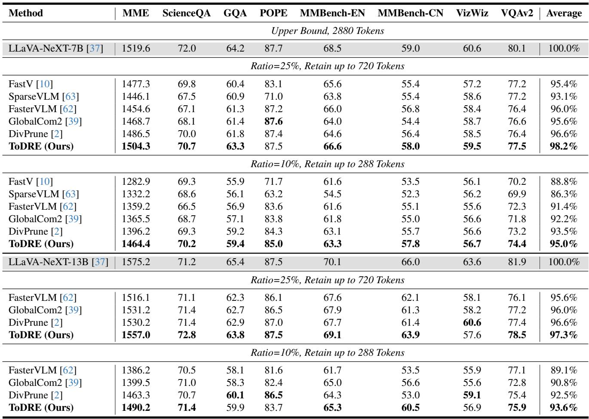
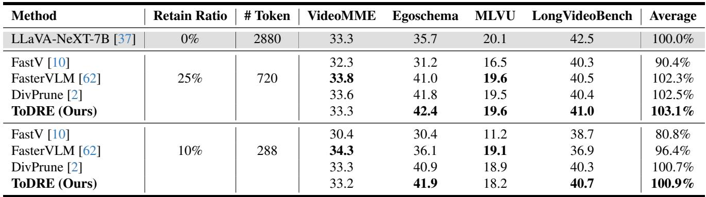
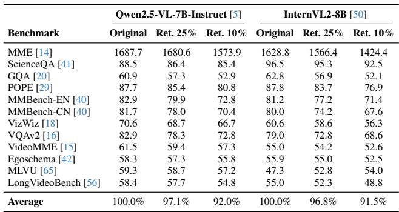
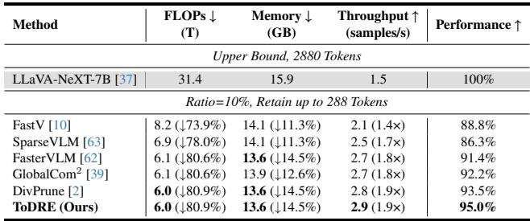
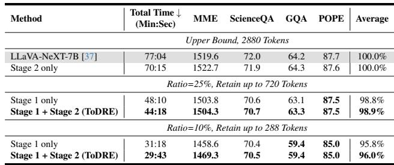

[← 返回 README](../README.md)

# 5. Experiments

## 📌 预览
在 4 个 LVLM（LLaVA-NeXT-7B/13B, Qwen2.5-VL-7B, InternVL2-8B）和 12 个 benchmark（8 图像 + 4 视频）上全面验证 ToDRE。核心结果：10% 保留率下 95.0% 性能、2.6× 加速、14.5% 显存节省。消融实验证实两阶段互补。

---

Experimental Setting. We evaluate ToDRE over multiple prevalent LVLMs (including LLaVA-NeXT-7B/13B [37], Qwen2.5-VL-7B-Instruct [5], and InternVL2-8B [50]) and twelve widely adopted benchmarks (including eight on image understanding tasks and four on video understanding tasks). More details on the benchmarks, network backbones, and comparison methods can be found in the Appendix.

---

# 5.1. Benchmarking

**Image Understanding Tasks.** In Table 1, we report ToDRE's performance on a range of image-understanding benchmarks at different token-retention ratios. First, under the same setup where $7 5 \%$ of visual tokens are pruned in Stage 1—matching competing methods—ToDRE further removes all remaining visual tokens in Stage 2 and achieves a $9 8 . 2 \%$ average score, outperforming the second-best method by $1 . 6 \%$ . Second, under more extreme compression (only $10 \%$ of visual tokens are retained), ToDRE surpasses the second-best approach by $1 . 5 \%$ . Third, ToDRE also achieves top performance on larger models, reaching an average score of $9 3 . 6 \%$ on the 13B variant—demonstrating strong adaptability across model scales. Note that FastV [10] and SparseVLM [63] are excluded from the 13B comparison, as their pruning strategies, originally tailored for the 7B model, lead to substantial performance degradation when directly transferred to the 13B model. This further underscores the robustness and transferability of ToDRE.

*Table 1: Performance of training-free token compression methods across eight image-language benchmarks.*

> 💡 **Table 1 批读 — Image Understanding**:
> - ToDRE 在所有保留率下一致最优
> - 10% 保留率下 ToDRE (95.0%) vs FastV (88.8%) 差距 **6.2%** → 极端压缩下 diversity 优势更大
> - FastV/SparseVLM 无法迁移到 13B → ToDRE 的 transferability 是显著优势
> - **关键 benchmark**: POPE 上 ToDRE 几乎无损（87.5 vs 87.7），说明 diversity selection 保留了物体信息

---

**Video Understanding Tasks.** To further assess ToDRE's generalization ability, we evaluate it on both short- and longform video understanding benchmarks. As shown in Table 2, ToDRE outperforms the baseline by $3 . 1 \%$ and $0 . 9 \%$ under the same token retention ratios used for images, and surpasses the second-best method by $0 . 6 \%$ and $0 . 2 \%$ , respectively. Interestingly, ToDRE even surpasses the baseline model in some cases. We attribute this to the reduced interference from redundant visual tokens, which may otherwise suppress task-relevant information during inference. Similarly, SparseVLM is excluded due to transferability issues, and GlobalCom2 [39] is omitted as it is specifically designed for image-only inputs. In contrast, ToDRE demonstrates broad generalization across both modalities and model scales.

*Table 2: Performance of training-free token compression methods across video understanding benchmarks.*

> 💡 **Table 2 批读 — Video Understanding**:
> - ToDRE 在视频任务上甚至**超越原始模型**（103.1% at 25%, 100.9% at 10%）
> - 原因：冗余 visual token 反而是噪声，删除后减少干扰
> - FastV 在视频上表现很差（80.8% at 10%）→ attention-based 方法对视频不友好
> - DivPrune 也不错（100.7% at 10%）但 ToDRE 的 Stage 2 带来额外增益

---

*Table 3: Cross-model evaluation on Qwen2.5-VL-7B-Instruct and InternVL2-8B.*

**Cross-Model Evaluation.** As shown in Table 3, we further evaluate ToDRE on Qwen and InternVL backbones. Specifically, ToDRE retains $9 7 . 1 \%$ and $9 6 . 8 \%$ of the original performance on Qwen2.5-VL-7B-Instruct and InternVL2- 8B at a $2 5 \%$ retention ratio, respectively, and still maintains more than $90 \%$ of the original performance even when only $10 \%$ of visual tokens are preserved, demonstrating strong robustness across different model architectures.

> 💡 **跨模型评估**:
> - Qwen2.5-VL: 25% → 97.1%, 10% → 92.0%
> - InternVL2: 25% → 96.8%, 10% → 91.5%
> - 两个模型架构差异大（Qwen 有 native dynamic resolution ViT），但 ToDRE 一致有效
> - 注意 InternVL2 在 MLVU 上 10% 保留反而比 25% 更好（54.0 vs 52.8）→ 进一步证实冗余 token 可能有害

---

# 5.2. Efficiency

As shown in Table 4, we compare FLOPs, peak memory usage, throughput, and performance across various token pruning methods under a fixed token retention ratio of $10 \%$ . First, ToDRE achieves the highest throughput of 2.9 samples/s on POPE [29], accelerating inference by $1 . 9 \times$ compared to the vanilla LLaVA-NeXT-7B baseline, while matching the lowest memory usage (13.6 GB) alongside FasterVLM and DivPrune [2]. Second, despite its superior efficiency and memory usage, ToDRE maintains the highest average performance $( 9 5 . 0 \% )$ , outperforming the second-best method by $1 . 5 \%$ . These results confirm that ToDRE achieves great overall balance among speed, memory, and accuracy. We attribute the slight efficiency gains over DivPrune (throughput $\uparrow 0 . 1$ samples/s) to our second-stage deletion of all remaining visual tokens—an approach rarely adopted in prior work. In addition, as discussed in Section 3.1, because most image and video understanding benchmarks only require the model to answer a single word or short phrase (where $L$ is considerably small), our efficiency gains during the LLM decoding stage are inevitably marginal. However, we expect ToDRE to deliver even greater efficiency benefits in tasks involving longer text generation, since it effectively mitigates the computational burden of visual tokens during LVLM inference.

*Table 4: Inference efficiency comparisons.*

> 💡 **Table 4 批读 — Efficiency**:
> - FLOPs 减少 80.9% 但性能只降 5% → 极高的压缩效率比
> - Memory 节省 14.5%（15.9 → 13.6 GB）
> - Throughput 1.9× 加速（POPE benchmark，短输出）
> - **长文本生成场景**: Stage 2 删除 visual KV cache 的收益会随 decoding 长度线性增长
> - ToDRE vs DivPrune: 性能 +1.5%，throughput +0.1 → Stage 2 的增量价值

---

# 5.3. Ablation Study

We conduct ablation studies to evaluate individual and combined contributions of the two stages in our framework. As shown in Table 5, applying Stage 2 only, which removes all visual tokens at a selected LLM layer without early-stage diversity-aware selection, already reduces the overall inference time by $8 . 8 \%$ compared to unpruned LLaVA-NeXT-7B baseline (from 77:04 to 70:15), while maintaining a lossless average performance of $1 0 0 . 0 \%$ . The limited efficiency gain is expected, as Stage 2 only accelerates the latter part of inference, and most tasks involve generating very short outputs.

In contrast, applying Stage 1 only, which retains $2 5 \%$ or $10 \%$ of tokens based on token diversity, yields substantial time savings of $3 7 . 5 \%$ (48:10) and $5 9 . 4 \%$ (31:18), respectively, with minimal drops in performance. When incorporating both stages (Stage $1 + { \mathrm { S t a g e } } 2$ ), we observe consistent improvements: First, at the $2 5 \%$ ratio, performance improves from $9 8 . 8 \%$ to $9 8 . 9 \%$ with total time reduced (from 48:10 to 44:18). Second, at the $10 \%$ ratio, performance increases from $9 5 . 8 \%$ to $9 6 . 0 \%$ , with total time reduced (from 31:18 to 29:43). Overall, ToDRE reduces inference time by $4 2 . 5 \%$ and $6 1 . 4 \%$ at the $2 5 \%$ and $10 \%$ token retention ratios, respectively, while even improving performance (up to $+ 0 . 2 \%$ gain). These results confirm that the second stage—full visual token removal based on visual-task relevance—provides complementary benefits to the diversity-based Stage 1, leading to improved accuracy-efficiency trade-offs under various compression settings.

*Table 5: Ablation study on two-stage token compression.*

> 💡 **Table 5 批读 — Ablation Study（最重要的表之一）**:
> **关键发现**:
> 1. **Stage 2 alone 完全无损** (100.0%) → information migration 假说得到验证
> 2. Stage 1 贡献了绝大部分加速（37.5-59.4%），Stage 2 贡献额外 5-2%
> 3. 两阶段结合后性能**反而提升** (+0.1-0.2%) → 不是简单叠加，而是互补
> 4. Stage 2 的价值在长文本生成中会更大（此处 benchmark 输出短）

---

## 🔖 Section 总结

### 关键数字速查
| 指标 | 数值 |
|------|------|
| 10% 保留率性能 (7B) | 95.0% |
| 25% 保留率性能 (7B) | 98.2% |
| 10% 保留率性能 (13B) | 93.6% |
| FLOPs 减少 | 80.9% |
| 内存节省 | 14.5% (15.9→13.6 GB) |
| Throughput 加速 | 1.9× (短输出) / 2.6× (总推理) |
| Stage 2 alone 性能 | 100.0% (无损) |
| 推理时间减少 (10%) | 61.4% |

### 核心洞察
1. ToDRE 在所有 benchmark、所有模型上一致最优
2. 极端压缩（10%）下优势最大：比 FastV 高 6.2%
3. 视频任务中 pruning 甚至提升性能 → 冗余 token 有害
4. Stage 2 无损 + Stage 1 主力加速 + 两者互补提升
5. 跨模型迁移性强（LLaVA/Qwen/InternVL 均有效）
