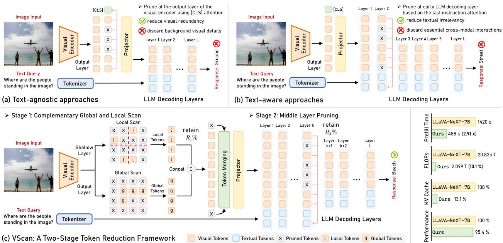

[← 返回 README](../README.md)

# 1 Introduction

## 📌 预览
Introduction 分三部分：(1) LVLM visual token 过长的问题，(2) 现有两类 token reduction 方法的局限，(3) VScan 的实证洞察和方法设计。

---

Large Vision-Language Models (LVLMs) have emerged as a transformative advancement in multi-modal learning, achieving remarkable proficiency across a broad range of vision-language tasks [38, 34, 33, 56]. Recent advances in LVLMs [40, 32, 28, 5, 36, 45, 44] further enhance their capacity to process high-resolution images and multi-image/video inputs, enabling fine-grained perception in tasks such as video question answering [19, 61, 54], multi-image understanding [21, 29], and referential grounding [30, 46]. However, processing such rich visual inputs necessitates a substantial increase in the number of visual tokens, which often far exceeds the number of text tokens [36, 32]. For instance, LLaVA-NeXT [40] encodes up to 2,880 visual tokens for high-resolution images, while Qwen-2.5-VL [5] can process up to 16,384 tokens for multi-image or video inputs— orders of magnitude higher than typical text-only sequences. This leads to significantly longer input sequences and, due to the quadratic complexity of self-attention [58], incurs substantial computational and memory overhead, thereby limiting the scalability and real-time deployment of LVLMs in practical applications [12, 64].

> 💡 **问题量化**：LLaVA-NeXT 最多 2,880 tokens，Qwen-2.5-VL 最多 16,384 tokens。由于 self-attention 的 $O(n^2)$ 复杂度，token 数量翻倍意味着计算量翻四倍。

---

Recognizing that not all visual tokens contribute meaningfully to the final LVLM response, recent works [12, 62, 70] have proposed visual token reduction techniques aimed at improving computational efficiency by pruning visually redundant or textually irrelevant tokens. These methods generally fall into two categories: (1) Textagnostic pruning approaches [64, 59, 60] (Figure 1(a)), which prune visually redundant tokens based on their significance and uniqueness during the visual encoding stage, typically leveraging self-attention or [CLS] attention from the output layer of the visual encoder; and (2) Text-aware pruning approaches [71, 62, 65] (Figure 1(b)), which selectively remove tokens with low relevance to the text query during the early layers of language decoding stage to preserve task-specific information while reducing computation. While these approaches have shown promising results, their performance is often constrained by their single-stage design and the lack of a systematic understanding of how visual tokens are processed and utilized throughout the entire LVLM pipeline.

> 💡 **两类方法总结**：
> - **Text-agnostic**（VisionZip, FOLDER 等）：在 visual encoder 输出层用 [CLS] attention 选重要 token。优点是不需要 text query，缺点是可能丢弃 text-relevant 但视觉不显著的 token
> - **Text-aware**（FastV, SparseVLM, PyramidDrop 等）：在 LLM 早期层用 text attention 剪枝。优点是考虑了任务需求，缺点是早期层有位置偏差
> - **核心局限**：都是单阶段设计，没有系统理解 visual token 在整个 pipeline 中的处理过程

---

*Figure 1: Comparison of our VScan with representative text-agnostic approaches (e.g., VisionZip) and text-aware approaches (e.g., FastV). VScan is a two-stage, training-free visual token reduction framework that can be seamlessly applied to various open-sourced LVLM architectures.*

> 💡 **Figure 1 批读**:
> - **(a) Text-agnostic**：在 visual encoder 输出层做，不看 text query
> - **(b) Text-aware**：在 LLM early layers 做，看 text query 但受位置偏差影响
> - **(c) VScan**：两阶段——先在 encoder 用 global+local scan 选 token 并 merge，再在 LLM middle layer 按 text relevance 剪枝
> - 关键区别：VScan 在 encoder 阶段不只用 output layer，还用 shallow layer 捕获局部信息；在 LLM 阶段不在 early layer 剪而在 middle layer 剪

---

In this work, we conduct an in-depth empirical analysis to reassess the effectiveness of these two prevailing pruning paradigms and distill insights that guide the design of more effective visual token reduction methods. Our study reveals two key observations: (1) In the visual encoding stage, the visual encoder attends to locally significant tokens in the shallow layers, focusing on fine-grained local details, while at deeper layers, it gradually shift its focus to a highly condensed set of tokens that encapsulate broader global context; (2) In the LLM decoding stage, early layers exhibit strong positional bias toward visual tokens appearing later in the sequence, neglecting their semantic relevance; as the layers deepen, cross-modal interactions begin to emerge, and output token probabilities typically converge in the mid-to-late layers where visual information is more effectively integrated into the language stream.

> 💡 **两个核心实证发现**：
> 1. **Visual Encoder 的 local→global 转变**：浅层关注局部细节，深层关注全局显著实体 → 启发 global+local scan 设计
> 2. **LLM 的位置偏差 + 中间层收敛**：早期层偏好序列末尾 token（位置偏差），中间层才开始真正的跨模态交互，预测在中间层收敛 → 启发 middle layer pruning

---

Building on these insights, we introduce VScan, a two-stage, training-free visual token reduction framework that enhances the efficiency of LVLMs by progressively pruning uninformative tokens during both visual encoding and language decoding stages, as shown in Figure 1(c). In the visual encoding stage, VScan employs a complementary global-local scan strategy to retain semantically important and spatially diverse tokens, followed by token merging to preserve comprehensive visual information. In the LLM decoding stage, VScan introduces middle layer pruning to further eliminate visual tokens with low relevance to the text query, while maintaining essential cross-modal interactions to minimize disruption to final task performance. Notably, VScan can be seamlessly integrated into diverse open-sourced LVLM architectures and is fully compatible with FlashAttention [18, 17], making it both practical and broadly applicable to real-world applications.

> 💡 **VScan 方法概览**：
> - **Stage 1** (Visual Encoding): Global scan（深层 [CLS] attention）+ Local scan（浅层窗口内 [CLS] attention）→ 并集 → Token merging（未选中的 merge 到最相似的已选中 token）
> - **Stage 2** (LLM Decoding): 在 middle layer 用 last instruction token 的 attention 做 text-aware pruning
> - **兼容性**：支持 FlashAttention，KV cache 友好

---

We comprehensively evaluate the effectiveness of VScan on LLaVA-1.5 [39], LLaVA-NeXT [40], Qwen2.5-VL [5], and Video-LLaVA [36] across sixteen image and video understanding benchmarks. Extensive experimental results demonstrate VScan's generalizable effectiveness across diverse LVLM architectures and LLM scales, highlighting its advantageous performance-efficiency trade-off. Specifically, VScan achieves a 1.77× speedup on LLaVA-1.5-7B and a 2.91× speedup on LLaVA-NeXT-7B during prefilling, while retaining 96.7% and 95.4% of the original performance, respectively.

> 💡 **加速效果**：token 越多的模型加速越明显——LLaVA-1.5（576 tokens）加速 1.77×，LLaVA-NeXT（2880 tokens）加速 2.91×。

---

The contributions of this work are summarized as follows:

- We conduct comprehensive analyses to reveal how visual knowledge evolves throughout the entire LVLM, offering insights to inform the design of more effective visual token reduction strategies.
- We introduce VScan, a two-stage training-free visual token reduction framework that progressively eliminates unimportant visual tokens to reduce both visual redundancy and textual irrelevance.
- Extensive evaluations across sixteen benchmarks demonstrate that VScan consistently outperforms state-of-the-art methods in maintaining robust performance under constrained token budgets.

---

## 🔖 Section 总结

### 核心洞察
1. Visual encoder 浅层→深层：local detail → global context
2. LLM 早期层有位置偏差，中间层才真正做跨模态融合
3. 这两个洞察分别启发了 Stage 1 global+local scan 和 Stage 2 middle layer pruning
