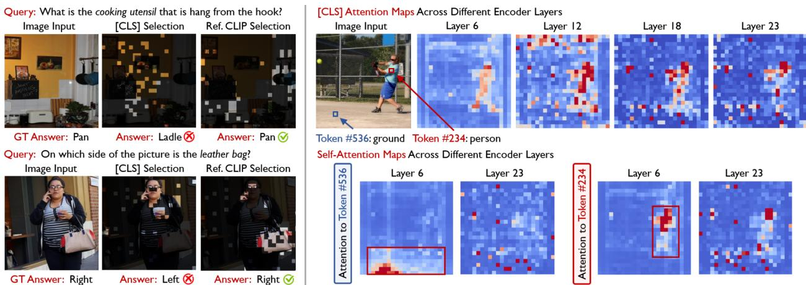
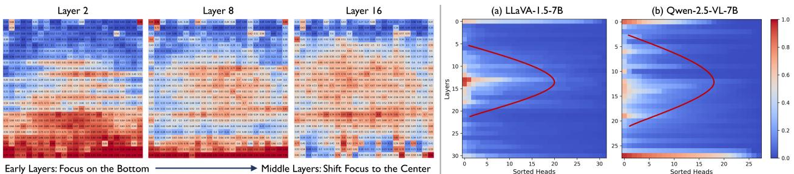
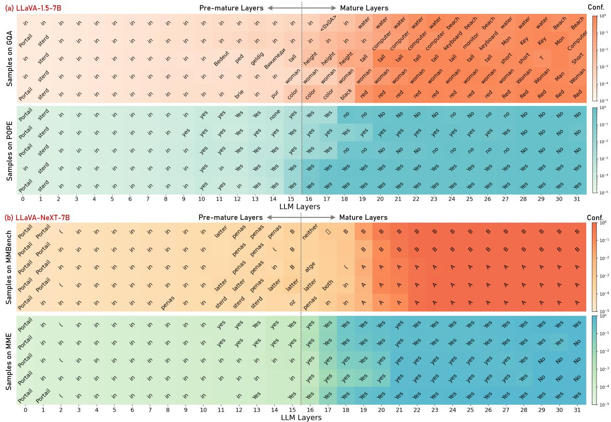

[← 返回 README](../README.md)

# 3 Empirical Analysis

## 📌 预览
这是全文最重要的 Section 之一。通过实证分析揭示两个关键发现：(1) Visual encoder 浅层→深层的 local→global 注意力转变，(2) LLM 早期层的位置偏差和中间层的预测收敛，直接启发了 VScan 的方法设计。

---

In this section, we provide a comprehensive analysis of how LVLMs process visual tokens during both the visual encoding and language decoding stages, offering empirical guidance for designing more effective visual token reduction strategies.

## Preliminary: Architecture of LVLMs

We consider an LVLM parameterized by $\theta$, which consists of three major components: a visual encoder, a feature projector, and an LLM decoder. Given an image input, the visual encoder processes the image patches, and the projector converts them into $n$ visual tokens $\mathbf{x}_V = \{x_V^i\}_{i=1}^n$. These visual tokens are then concatenated with the tokenized textual query $\mathbf{x}_T$ and fed into the LLM decoder for auto-regressive next-token generation, represented as $y_t \sim p_\theta(y_t | \mathbf{x}_V, \mathbf{x}_T, \mathbf{y}_{<t})$, where the next token $y_t$ is sampled from the output probability distribution $p_\theta(\cdot)$, and $\mathbf{y}_{<t}$ denotes the sequence of tokens generated prior to timestep $t$.

> 💡 **标准 LVLM 架构**：Visual Encoder → Projector → n 个 visual tokens → 与 text tokens 拼接 → LLM decoder 自回归生成。

---

## Rethinking Visual Redundancy Reduction

To address visual redundancy in token representations, recent studies [70, 64] have proposed text-agnostic approaches that retain visual tokens with high [CLS] attention at the output layer of the ViT-based visual encoder. While effective to some extent, this strategy raises an important question: Is relying solely on output [CLS] attention truly sufficient to capture all task-relevant visual information? Upon closer examination, we identify a clear yet often overlooked limitation of these approaches: they tend to favor tokens corresponding to visually salient objects, while aggressively discarding background visual details that may carry essential semantic information. As illustrated by the examples in Figure 2 (Left), output [CLS] attention is incorrectly directed to the wall and person, ignoring the actual targets—the pan and leather bag—leading to incorrect model responses.

> 💡 **关键问题**：只用 output layer [CLS] attention 够吗？答案是不够！
> - [CLS] attention 倾向于选视觉显著的 token（如人、墙壁），但可能忽略 text query 真正关心的目标（如平底锅、皮包）
> - 这正是 VisionZip 等方法的软肋

---

*Figure 2: Empirical study on visual redundancy reduction. (Left) Two failure cases where relying solely on output [CLS] attention leads to incorrect predictions. (Right) Visualization of [CLS] attention maps and self-attention maps across different encoding layers.*

> 💡 **Figure 2 批读**:
> - **左图（Failure Cases）**：用 output [CLS] attention 选的 token 关注了错误区域（墙壁和人），CLIP 参考选择则正确定位了 pan 和 leather bag
> - **右图（Layer-wise Evolution）**：
>   - **浅层**：[CLS] attention 分散在各处，捕获细粒度局部细节；self-attention 关注语义相似的邻近区域
>   - **深层**：[CLS] attention 高度集中于主体实体；self-attention 扩散到整个图像
>   - 这就是 **local→global 转变**的直观证据
> - **启发**：应该同时利用浅层（local）和深层（global）信息选 token

---

To better understand and overcome this limitation, we analyze how visual information is processed across the visual encoding layers in LVLMs. Specifically, we visualize both the [CLS] attention and self-attention of representative tokens across different visual encoding layers, as illustrated in Figure 2 (Right). Our observations are as follows: (1) In the shallow layers, the [CLS] attention maps capture fine-grained local details across the image. In contrast, in the deeper layers, the attention becomes increasingly concentrated on the main entities, reflecting their global semantic relevance; (2) The self-attention maps for representative visual tokens reveal a similar local-to-global trend: in the shallow layers, these tokens primarily attend to nearby regions with similar semantic meaning, while in the deeper layers, their attention becomes more dispersed, integrating context from the entire image. These findings highlight a gradual transition in the visual encoder from capturing low-level local details to modeling high-level, globally relevant semantics, suggesting that relying solely on the output layer may overlook the rich local information encoded in the shallow layers.

> 💡 **发现 1 总结**：Visual Encoder 存在 local→global 演变
> - 浅层 [CLS] attention → 捕获局部细节（背景、纹理、小物体）
> - 深层 [CLS] attention → 聚焦全局显著实体
> - **只用 output layer = 只看全局，丢局部** → 需要 global + local 互补

---

## Rethinking Textual Irrelevance Reduction

While prior studies [12, 71, 37] have proposed effective text-aware approaches for pruning visual tokens at early layers during LLM decoding, a critical question remains: Are early layers the optimal stage for pruning visual tokens to minimize their impact on the model's final response? To investigate this, we conduct three empirical studies on POPE [35] and GQA [25], analyzing how the model's knowledge and predictions evolve during the decoding process:

> 💡 **关键问题**：FastV 等在 LLM 第 2 层就剪枝，真的最优吗？作者通过三个实验说明不是。

---

### Study 1: How does position bias in token selection evolve across LLM layers?

Specifically, we visualize the distribution of the retained tokens selected by the attention score of the last instruction token [12] across LLM layers using LLaVA-1.5-7B. As shown in Figure 3 (Left), early layers (e.g., layers 2 and 8) tend to select tokens at the bottom of the image, reflecting an inherent LLM position bias, as the last instruction token primarily attends to nearby tokens and focuses on local context [58, 50], and flattened visual tokens from the bottom of the image are positioned closest to the instruction tokens in the sequence. As the LLM layers deepen, this undesirable position bias diminishes and the focus shifts toward the center of the image, which is more intuitive since the center of the image typically carries the most informative and task-relevant features [2, 8].

> 💡 **Study 1: 位置偏差**：
> - LLM 早期层的 attention 有严重的**位置偏差**：last instruction token 倾向于关注序列中距离它近的 token
> - 由于 visual tokens 是 raster scan 顺序（从左上到右下），图片底部的 token 在序列中最靠近 text tokens
> - 因此早期层选出的 token 集中在图片底部，而非语义相关区域
> - **深层**才逐渐关注图片中心（通常信息量最大的区域）

---

*Figure 3: (Left) Study 1: Distribution of retained tokens at 50% reduction rate in layers 2, 8, and 16 of LLaVA-1.5-7B on POPE. (Right) Study 2: Sum of visual attention across different attention heads and LLM layers.*

> 💡 **Figure 3 批读**:
> - **左图**：Layer 2 选的 token 明显偏向底部（深色区域），Layer 16 才趋于中心
> - **右图**：红色曲线（visual attention sum）在中间层达到峰值，说明中间层才是处理视觉信息的主力
> - 这两个发现共同说明：**在 early layer 剪枝是次优的**

---

### Study 2: From which layer does the LLM begin to gather and process visual information?

We visualize the sum of attention received by all visual tokens from the last instruction token across different LLM layers using LLaVA-1.5-7B and Qwen-2.5-VL-7B in Figure 3 (Right). The red curve in each plot highlights the layer-wise attention patterns directed towards visual information. We observe that the middle LLM layers are primarily responsible for interacting with the visual tokens, whereas the early and deep layers focus predominantly on processing textual information.

> 💡 **Study 2: 视觉信息处理集中在中间层**：
> - Early layers: 主要处理文本信息
> - Middle layers: 跨模态交互的主力（visual attention 峰值）
> - Deep layers: 回归文本处理
> - **在中间层之前剪枝 = 打断了跨模态交互**

---

### Study 3: At which LLM layer do next-token predictions begin to converge?

*Figure 4: Study 3: Visualization of next-token predictions derived from the output hidden states of each LLM layer using (a) LLaVA-1.5-7B; (b) LLaVA-NeXT-7B. Darker colors indicate higher prediction confidence.*

> 💡 **Figure 4 批读**:
> - 每行代表一个样本，每列代表一个 LLM layer
> - 颜色越深 = top-1 预测置信度越高
> - **GQA**（开放式 QA）：~Layer 20 收敛
> - **POPE**（yes/no）：~Layer 16 收敛
> - **关键洞察**：中间层之后，hidden state 已经基本决定了输出，后续层只做微调

In Figure 4, we provide an interpretation of the hidden states across different LLM layers using LLaVA-1.5-7B and LLaVA-NeXT-7B. Specifically, we feed the hidden states from each LLM decoding layer into the final linear projection layer to obtain vocabulary logits and intermediate next-token predictions. We observe that in more challenging open-ended tasks like GQA, the next-token predictions stabilize around LLM layer 20, whereas in simpler yes/no tasks such as POPE, the predictions converge earlier, around LLM layer 16. Our findings indicate that early layers are still forming core cross-modal semantics, and pruning them risks disrupting essential grounding. In contrast, by the middle layers, next-token predictions have largely stabilized, meaning that these layers contribute diminishing semantic change. This directly motivates pruning in the middle-to-late layers rather than the early layers.

> 💡 **Study 3: 预测收敛在中间层**：
> - 做法很巧妙：把每层的 hidden state 直接送给 final projection layer，看它预测什么
> - 收敛时间与任务难度相关：简单任务早收敛，难任务晚收敛
> - **结论**：中间层之后剪枝对最终预测影响最小

---

These findings collectively suggest that early layers are suboptimal for pruning due to position bias and limited engagement with visual content. In contrast, pruning at middle layers is more appropriate as it better preserves critical cross-modal interactions and minimizes disruption to model predictions.

> 💡 **三个 Study 的统一结论**：
> 1. Early layer 有位置偏差（Study 1）
> 2. Middle layer 是视觉信息处理主力（Study 2）
> 3. Middle layer 之后预测已收敛（Study 3）
> → **应该在 middle layer 做 text-aware pruning，而非 early layer**

---

## 🔖 Section 总结

### 关键数字速查
| 发现 | 详情 |
|------|------|
| Visual Encoder | 浅层→深层：local detail → global context |
| LLM 位置偏差 | Early layers 选 token 偏向图片底部 |
| 视觉交互峰值 | LLM middle layers |
| 预测收敛 | POPE ~Layer 16, GQA ~Layer 20 |

### 核心洞察
1. 这个 Section 是全文的理论基础，每个设计选择都有实证支撑
2. 对比 FastV 只做 Study 2 类似的分析，VScan 的分析更全面（3 个 Study + encoder 分析）
3. 位置偏差的发现特别重要——解释了为什么 FastV 在高压缩率下性能急剧下降
