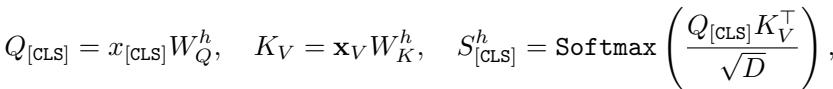
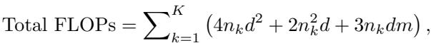
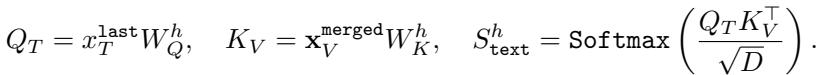
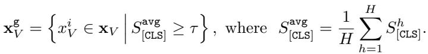
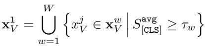
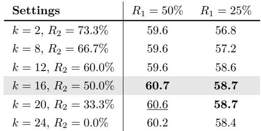

[← 返回 README](../README.md)

# 4 Method

## 📌 预览
VScan 的方法分两阶段：4.1 Visual Encoding 阶段的 Global+Local Scan + Token Merging，4.2 LLM Decoding 阶段的 Middle Layer Pruning。

---

We introduce VScan, a training-free approach that progressively prunes uninformative tokens in both visual encoding and LLM decoding stages to accelerate LVLM inference, as illustrated in Figure 1(c).

## 4.1 Reducing Visual Redundancy via Complementary Global and Local Scans

Motivated by the observations in Section 3, we design two complementary token selection schemes for the visual encoding stage, namely global and local scan, which select important tokens based on both local and global significance, enabling the capture of more comprehensive visual details.

> 💡 **4.1 要点预览**：三步走——Global Scan 选全局重要 token → Local Scan 选局部重要 token → Token Merging 保留被丢弃 token 的信息。

---

### Global Scan

Given that the final layers of visual encoders capture global information, we follow recent works [70, 64] to select global tokens that receive the most attention from the [CLS] token $x_{[CLS]}$ in the output layer (e.g., the penultimate layer in LLaVA-1.5 [39]). Specifically, the [CLS] attention computation for each attention head can be represented by



where $W_Q^h$ and $W_K^h$ represent the projections weights for head $h \in [1, H]$, $D$ denotes the hidden state size, and $S_{[CLS]}^h$ represents the [CLS] attention. The global tokens are then selected by



Here, $\tau$ is a soft threshold based on a top percentile of attention scores, set to retain a target number of tokens. Note that for LVLMs without a [CLS] token (e.g., Qwen-2.5-VL [5]), we can similarly select the tokens using self-attention, i.e., the average attention each visual token receives from others.

> 💡 **Global Scan**：
> - 和 VisionZip 思路一样：用 output layer 的 [CLS] attention 选 top tokens
> - 多头 attention 取平均，然后按阈值选择
> - 对没有 [CLS] token 的模型（如 Qwen-2.5-VL）：用 self-attention 替代
> - **局限**：只捕获全局显著实体，可能丢失局部细节 → 需要 Local Scan 互补

---

### Local Scan

To complement the global tokens and capture finer local details, we divide the image into non-overlapping windows and select the locally important tokens with the highest [CLS] attention from the shallow layer $l$ within each window. Specifically, we allocate token budgets uniformly across windows, and select local tokens from each window as:



where $w$ denotes the window index, $\mathbf{x}_V^w$ represents the set of all tokens within the window, and $\tau_w$ is the soft threshold for window $w$. The final set of selected tokens is the union of global and local tokens, $\mathbf{x}_V^{selected} = \mathbf{x}_V^g \cup \mathbf{x}_V^l$, resulting in a retention rate of $R_1\%$. By default, we balance the selection such that $|\mathbf{x}_V^g| = |\mathbf{x}_V^l|$, i.e., half of the retained tokens are global and half are local.

> 💡 **Local Scan**：
> - **关键区别**：用**浅层**（l=6）的 [CLS] attention，而非 output layer
> - 把图片划分为不重叠的窗口，每个窗口均匀分配 token 预算
> - 窗口内选 [CLS] attention 最高的 token
> - **设计动机**：浅层 attention 关注局部细节（Section 3 的发现），窗口划分保证空间多样性
> - 默认 global : local = 1:1，总共保留 $R_1\%$

---

### Token Merging

To alleviate information loss, we introduce a similarity-based token merging strategy that merges unselected visual tokens with their most similar selected counterparts. Specifically, for each unselected token $x_V^u$, we identify its most similar selected token $x_V^s \in \mathbf{x}_V^{selected}$ based on the highest cosine similarity. Once all unselected tokens are assigned to their closest selected tokens, we apply average merging [6] within each group to obtain the final merged representation $\mathbf{x}_V^{merged}$. Specifically, for each selected token $\mathbf{x}_V^s$, we compute the average token representation by



where $\mathcal{U}^s$ denotes the set of unselected tokens associated with the selected token $\mathbf{x}_V^s$, and $|\mathcal{U}^s|$ indicates the cardinality of this set.

> 💡 **Token Merging**：
> - 不是直接丢弃未选中 token，而是 merge 到最相似的已选中 token（cosine similarity）
> - 每组做 average pooling → 保留了被丢弃 token 的信息
> - 类似 VisionZip 的 merging 策略，但 VScan 是在 global+local 选择之后做
> - **关键意义**：merge 比纯 prune 信息损失更小，尤其在高压缩率下

---

## 4.2 Reducing Textual Irrelevance via Middle Layer Pruning

> 💡 **4.2 要点预览**：在 LLM 中间层（而非早期层）用 text attention 做第二轮剪枝。

After selecting visually significant tokens, we further refine the token set based on their relevance to the text query. Building on the empirical insights from Section 3, we design our approach to prune tokens at the mature middle layers of the LLM, aiming to avoid position bias, preserve cross-modal interactions, and minimize the impact on final predictions. Specifically, we compute the attention between all visual tokens and the last instruction token at middle layer $k$, denoted as



We similarly average the attention scores across different attention heads and select $R_2\%$ textually relevant tokens with the highest average text attention. This allows us to retain a set of visual tokens that are both visually significant and textually relevant, contributing the most to an accurate response.

> 💡 **Middle Layer Pruning**：
> - 在 LLM 第 $k$ 层（LLaVA: k=16, Qwen-7B: k=14）做 text-aware pruning
> - 用 last instruction token 对所有 visual token 的 attention 作为重要性分数
> - 多头取平均，保留 top $R_2\%$
> - **与 FastV 的区别**：FastV 在第 2 层，VScan 在中间层——避免了位置偏差
> - **与 PyramidDrop 的区别**：PyramidDrop 多层渐进，VScan 只在一层做

---

### Empirical Validation

We conduct a comparative analysis on the GQA benchmark using LLaVA-1.5-7B [39] to examine the effect of pruning tokens at different LLM layers, while keeping the average reduction rate consistent across settings.


*Table 1: Comparative study of pruning visual tokens at different LLM layers. R₁ denotes the retention rate in the visual encoding stage, while k and R₂ indicate the pruning layer and retention rate in the LLM decoding stage.*

> 💡 **Table 1 批读**:
> - 在 R₁=50% 时：k=16 (60.7) 和 k=20 (60.6) 最好，k=2 (59.6) 最差
> - 在 R₁=25% 时：k=16 和 k=20 (58.7) 最好，k=2 (56.8) 最差，差了 1.9%
> - **验证了 Section 3 的结论**：middle layer pruning > early layer pruning
> - k=24 (接近 output) 也略有下降，说明太晚也不好（可能打断了后续 refinement）

---

### Remarks on KV Cache and FlashAttention

Our proposed VScan is fully compatible with standard KV caching mechanisms, as pruning occurs before visual tokens are added to the cache. Consequently, the KV cache stores fewer entries while its structure and format remain unchanged. VScan is also compatible with FlashAttention [17, 18], as we recompute the attention scores for the last instruction token using vanilla attention calculation [58] outside the standard LLM layers.

> 💡 **工程兼容性**：
> - **KV Cache**：剪枝发生在 token 进入 cache 之前，所以 cache 自然变小
> - **FlashAttention**：中间层的 text-visual attention 是在 FlashAttention 之外单独计算的（vanilla attention），不影响 FA 的使用
> - 这是很重要的工程优势，因为很多方法不兼容 FlashAttention

---

## 🔖 Section 总结

### 方法流程图
```
输入图片
  ↓
Visual Encoder
  ├─ Output Layer → Global Scan (深层 [CLS] attn, 选 R₁/2 tokens)
  ├─ Shallow Layer l → Local Scan (浅层窗口内 [CLS] attn, 选 R₁/2 tokens)
  └─ Union → Token Merging (cosine similarity, average pooling)
  ↓
R₁% merged visual tokens + text tokens → LLM
  ↓
LLM Layer 1~k: 正常计算
  ↓
LLM Layer k: Middle Layer Pruning (last instr token attn, 保留 R₂%)
  ↓
LLM Layer k+1~K: 用剩余 R₁×R₂% tokens 继续
  ↓
输出
```

### 核心洞察
1. Global+Local 互补 = 捕获全局显著性 + 局部细节
2. Merging 而非纯 prune = 减少信息损失
3. Middle layer 而非 early layer = 避免位置偏差 + 保护跨模态交互
4. 整个方法 training-free，兼容 FlashAttention 和 KV cache
