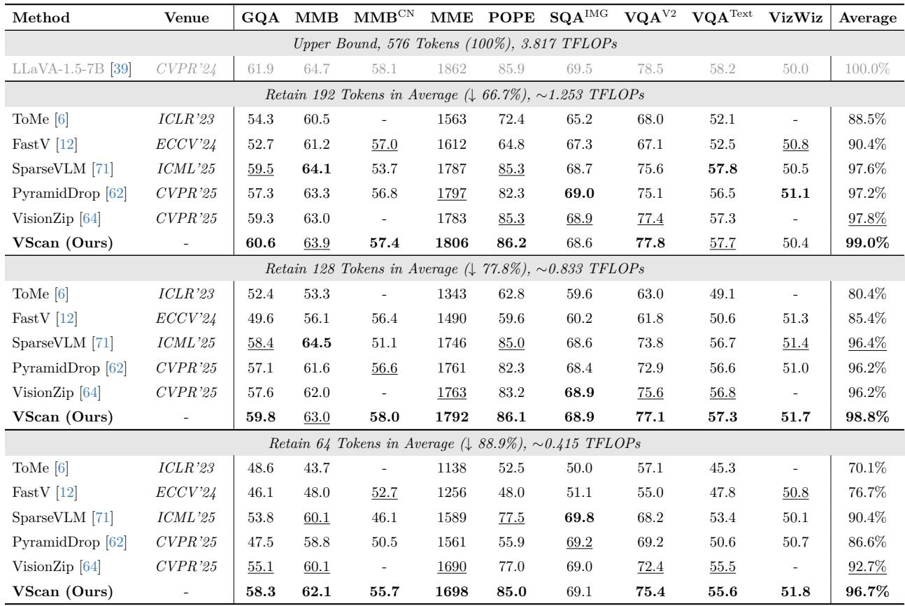
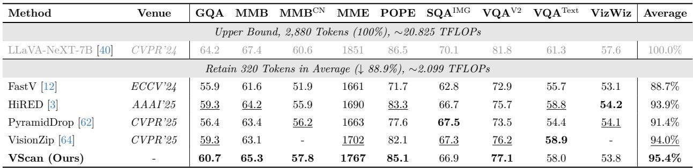
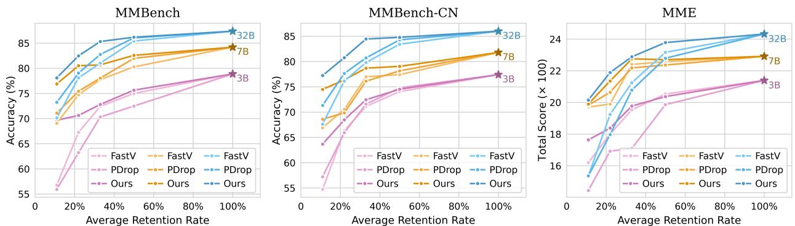
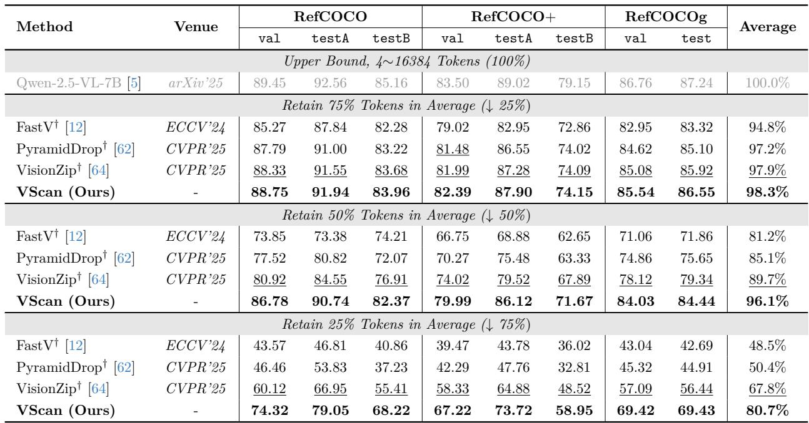
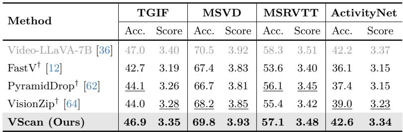
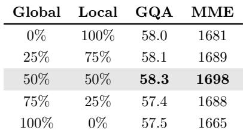
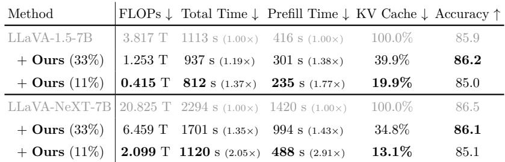

[← 返回 README](../README.md)

# 5 Experiments

## 📌 预览
在 4 个 LVLM（LLaVA-1.5, LLaVA-NeXT, Qwen-2.5-VL, Video-LLaVA）上验证，覆盖 16 个 benchmark（9 image QA + 3 grounding + 4 video QA），对比 6 个 SOTA baseline。

---

In this section, we validate the effectiveness of our VScan on four widely used LVLMs, evaluating its performance across various benchmarks and comparing it with other state-of-the-art approaches.

## 5.1 Experimental Settings

### Models

We evaluate the general effectiveness of VScan by applying it to four popular LVLMs with diverse architectures. Following prior work in this field, we first compare performance on LLaVA-1.5-7B [39], a widely adopted academic baseline that maps each image input to 576 tokens, and LLaVA-NeXT-7B [40], which improves high-resolution understanding by encoding an image into up to 2,880 visual tokens. We further assess Video-LLaVA-7B [36], which extends the LLaVA framework to videos, processing up to 8 frames with 2,048 visual tokens. Finally, we are among the first to report experimental results on the recent Qwen-2.5-VL [5], tested across different LLM sizes (3B, 7B, 32B). This model incorporates dynamic resolution processing to handle images of varying sizes, supporting visual token counts ranging from 4 to 16,384.

> 💡 **模型覆盖面广**：
> | 模型 | Visual Tokens | 特点 |
> |------|-------------|------|
> | LLaVA-1.5-7B | 576 | 学术基准 |
> | LLaVA-NeXT-7B | 最多 2,880 | 高分辨率 |
> | Video-LLaVA-7B | 2,048 | 视频理解 |
> | Qwen-2.5-VL-3B/7B/32B | 4~16,384 | 动态分辨率，多尺度 |

---

### Benchmarks and Metrics

We conduct extensive experiments on 9 standard image understanding benchmarks, including visual question answering benchmarks such as GQA [25], ScienceQA [43], VQAv2 [23], TextVQA [53] and VizWiz [24]; multi-modal reasoning benchmarks such as MMBench [42], MMBench-CN [42], MME [20], and POPE [35]. We also include evaluations on 3 more challenging referring grounding tasks using RefCOCO [30], RefCOCO+ [30], and RefCOCOg [46], and report the accuracy achieved by different approaches. Additionally, we evaluate our approach on 4 video question answering benchmarks: TGIF [27], MSVD [10], MSRVTT [63], and ActivityNet [66].

### Baselines

We compare the performance of our approach with 6 state-of-the-art visual token pruning methods: ToMe [6], FastV [12], SparseVLM [71], HiRED [3], PyramidDrop [62], and VisionZip [64].

> 💡 **公平比较说明**：VScan 按 average token retention across all LLM layers 对齐，而非 final token count。例如 11.1% 平均保留 = Stage 1 保留 96 tokens + Stage 2 在 layer 16 剪到 32 tokens → 平均 (96×16 + 32×16)/32 = 64 tokens/layer。

### Implementation Details

We adhere to the default inference settings for each evaluated LVLM. We perform local scan at a shallow layer, specifically at $l = 6$ for LLaVA-series models and $l = 8$ for Qwen-2.5-VL. For LLM-stage pruning, we select the middle layer as $k = 16$ for LLaVA-series models and $k = 14$ for Qwen-2.5-VL-7B. By default, we fix the retention rate at the LLM middle layer to $R_2 = 33.3\%$, and adjust $R_1$ accordingly to achieve the target average reduction rate.

> 💡 **默认超参数**：
> | 参数 | LLaVA | Qwen-2.5-VL |
> |------|-------|-------------|
> | Local scan layer $l$ | 6 | 8 |
> | LLM pruning layer $k$ | 16 | 14 (7B), exact middle (3B/32B) |
> | $R_2$ | 33.3% | 33.3% |

---

## 5.2 Results and Discussions

### Results on LLaVA-1.5

*Table 2: Performance comparisons on LLaVA-1.5-7B across 9 image understanding benchmarks.*

> 💡 **Table 2 批读**:
> - **192 tokens (66.7% 压缩)**：VScan 99.0%，VisionZip 97.8%，SparseVLM 97.6%
> - **128 tokens (77.8% 压缩)**：VScan 98.8%，远超 VisionZip 96.2%
> - **64 tokens (88.9% 压缩)**：VScan **96.7%**，VisionZip 92.7%，差距拉开到 4.0%
> - **关键发现**：压缩率越高，VScan 的优势越明显——64 token 时 VScan 几乎无损，而 FastV 只有 76.7%
> - POPE 上 VScan 始终 85+，而 FastV 在高压缩率下暴跌到 48.0

---

### Results on LLaVA-NeXT

*Table 3: Performance comparisons on LLaVA-NeXT-7B across 9 image understanding benchmarks with 88.9% reduction rate.*

> 💡 **Table 3 批读**:
> - 320 tokens / 88.9% 压缩率下：VScan **95.4%** >> VisionZip 94.0% > HiRED 93.9% > PyramidDrop 91.4% > FastV 88.7%
> - 6/9 benchmarks SOTA
> - LLaVA-NeXT 原始 2,880 tokens → 320 tokens，压缩近 9 倍

---

### Results on Qwen-2.5-VL

*Figure 5: Performance comparisons on Qwen-2.5-VL with different LLM sizes (3B/7B/32B) across 3 image understanding benchmarks.*

> 💡 **Figure 5 批读**:
> - VScan 在所有压缩率（11.1%~50%）和所有模型规模（3B/7B/32B）上一致领先
> - **有趣发现**：在 MME 上，FastV 和 PDrop 在从 7B scale 到 32B 时性能反而下降（低 token budget 下）
> - 作者推测：更大的 LLM 有更强的 language prior，会干扰 visual token 选择
> - VScan 的两阶段策略能缓解这种偏差，跨尺度表现稳定

---

### Results on Grounding Tasks (RefCOCO)

*Table 4: Performance comparisons on Qwen-2.5-VL-7B across 3 referring expression comprehension benchmarks.*

> 💡 **Table 4 批读**:
> - Grounding 任务对 token 压缩极为敏感（需要精确定位）
> - **75% 压缩**：FastV 只剩 48.5%，PyramidDrop 50.4%，VisionZip 67.8%，**VScan 80.7%**
> - **50% 压缩**：VScan **96.1%** vs VisionZip 89.7%，差距 6.4%
> - 这说明 VScan 的 global+local scan 能更好地保留定位所需的空间信息

---

### Results on Video-LLaVA

*Table 5: Performance comparisons on Video-LLaVA-7B across 4 video understanding tasks with 75% reduction rate.*

> 💡 **Table 5 批读**:
> - 25% token 预算下，VScan 几乎无损：TGIF 46.9 vs 47.0, ActivityNet 42.6 vs 42.2（甚至略超原模型）
> - 其他方法都有明显下降，尤其 FastV

---

## 5.3 Ablation Studies

### Varying Retention Rates R₁ and R₂

*Table 6: Ablation experiment using LLaVA-1.5-7B with average reduction rate of 11.1%.*

> 💡 **Ablation 批读**:
> - **(a) R₁ vs R₂ 权衡**：
>   - 只做 Stage 1 (R₁=11.1%, R₂=100%): GQA 56.7 → 不行
>   - 只做 Stage 2 (R₁=22.2%, R₂=0%): GQA 52.7 → 更不行
>   - 最佳：R₁=16.7%, R₂=33.3% → GQA **58.3**
>   - **两阶段缺一不可，且需要平衡**
> - **(b) Global vs Local 比例**：
>   - 50:50 最佳（GQA 58.3），纯 global 或纯 local 都降 0.3~0.8%
>   - 验证了互补性
> - **(c) Local Scan Layer**：
>   - l=6（浅层）最佳，l=2（太浅）和 l=23（output）都不好
>   - 与 Section 3 的 local→global 发现一致

---

## 5.4 Efficiency Analysis

*Table 7: Efficiency comparisons on the POPE benchmark.*

> 💡 **Table 7 批读**:
> - **LLaVA-1.5-7B**：
>   - 11% tokens: 3.817T → 0.415T FLOPs (9.2×), 总推理 1.37× 加速, prefill 1.77× 加速
>   - 精度仅降 0.9 (85.9 → 85.0)
> - **LLaVA-NeXT-7B**：
>   - 11% tokens: 20.825T → 2.099T FLOPs (9.9×), 总推理 2.05× 加速, prefill **2.91×** 加速
>   - token 越多加速越明显（2880 → 320）
> - 总推理加速小于 prefill 加速，因为 decoding 阶段不受影响（逐 token 生成）

Our approach achieves even more significant acceleration on LLaVA-NeXT-7B, where it delivers a 2.05× speedup in inference and a 2.91× speedup in the prefill stage. It is also important to note that VScan is compatible with FlashAttention [17], which can further enhance efficiency. For instance, the inference time of our approach with an 11% retention rate on LLaVA-NeXT-7B can be further reduced from 488 to 473 seconds.

---

## 🔖 Section 总结

### 关键数字速查
| 设置 | 性能保留 | 加速 |
|------|----------|------|
| LLaVA-1.5, 192 tokens | 99.0% | 1.19× |
| LLaVA-1.5, 64 tokens | 96.7% | 1.37× (1.77× prefill) |
| LLaVA-NeXT, 320 tokens | 95.4% | 2.05× (2.91× prefill) |
| Qwen-2.5-VL RefCOCO 50% | 96.1% | - |
| Video-LLaVA 25% budget | ~100% | - |

### 核心洞察
1. VScan 在高压缩率下优势最大（88.9% 压缩时比 VisionZip 高 4%）
2. Grounding 任务受益于 global+local scan 的空间信息保留
3. 视频任务几乎无损，说明跨帧冗余被有效利用
4. 模型越大（token 越多），加速效果越明显
