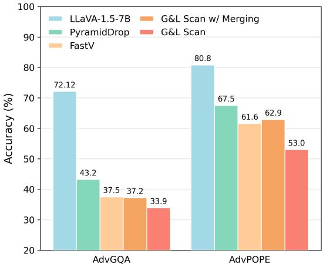
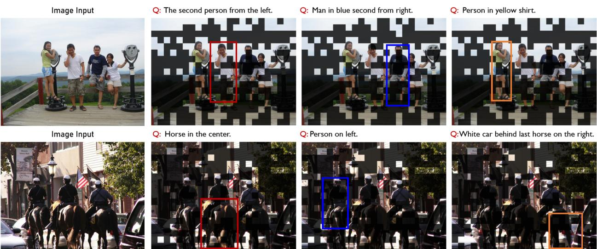
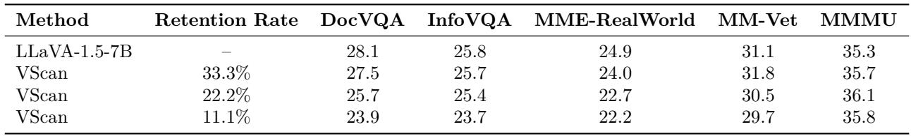
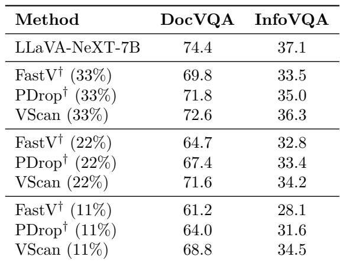
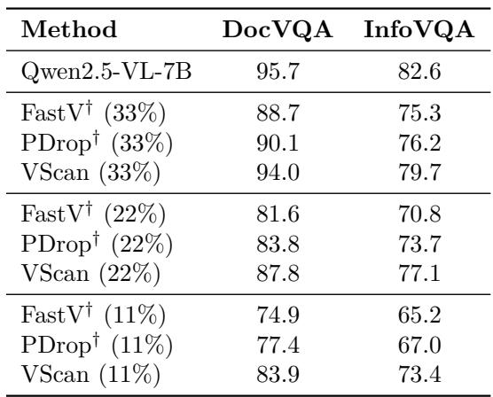
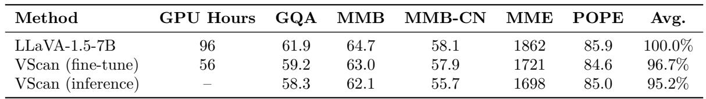
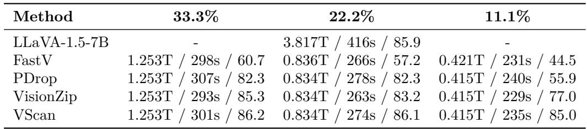
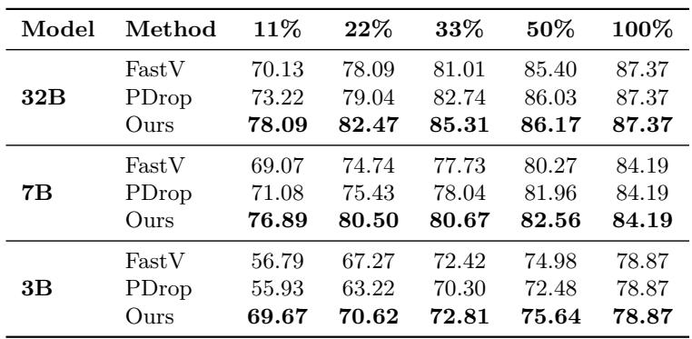
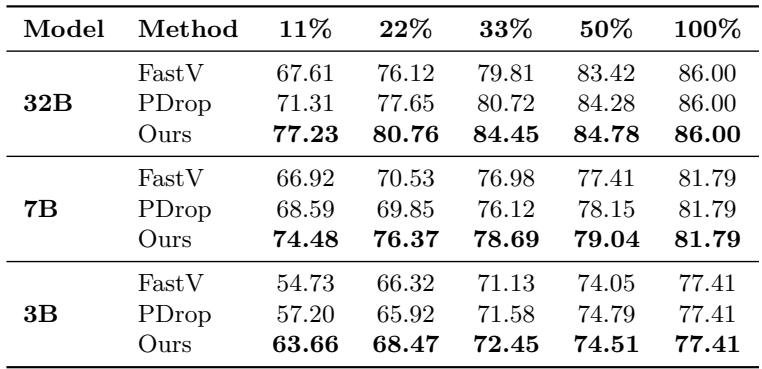
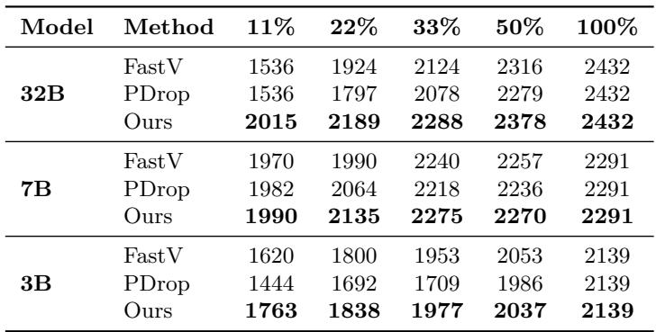

[← 返回 README](../README.md)

# Appendix

## 📌 预览
附录包含：对抗性验证（A.1）、定性结果（A.2）、更多 benchmark（A.3）、训练加速（A.4）、多轮对话（A.5）、效率对比（A.6）、Qwen 完整结果（A.7）、FLOPs 计算（B.2）、公平比较说明（B.1）。

---

## A.1 Empirical Validation of Global and Local Scan

To validate the effectiveness of our global and local scan schemes, we construct adversarial subsets for GQA and POPE, namely AdvGQA and AdvPOPE, which contains failure cases where relying solely on the global scan to select visual tokens leads to errors. We follow Gandelsman et al. [22] to decompose the image representations and pinpoint the tokens or regions most relevant to the query using CLIP-ViT-L-336px [51]. A sample is included in the adversarial set if the response is correct when using the 64 tokens selected by CLIP, but becomes incorrect when using the 64 tokens selected solely by the global scan. We collected 886 and 515 adversarial samples in AdvGQA and AdvPOPE, respectively.

*Figure A1: Performance comparisons on AdvGQA and AdvPOPE with 64 visual tokens retained using LLaVA-1.5-7B.*

> 💡 **Figure A1 批读**:
> - 在对抗样本上，global+local scan 性能接近 text-aware 方法（FastV, PyramidDrop），尽管它是 text-agnostic 的
> - 说明 local scan 有效弥补了 global scan 的盲区——那些全局不显著但 query-relevant 的 token

---

## A.2 Qualitative Results

*Figure A2: Qualitative results on RefCOCO benchmark using Qwen-2.5-VL. Predicted boxes for 6 different queries on 2 images, with visualizations of retained tokens.*

> 💡 **Figure A2 批读**:
> - 即使大量压缩 token，VScan 仍能准确定位目标
> - retained tokens 的分布覆盖了查询目标区域，不像纯 global scan 只聚焦显著物体

---

## A.3 Results on More Real-World Benchmarks

*Table A1: Performance of VScan across diverse real-world benchmarks (DocVQA, InfoVQA, MME-RealWorld, MM-Vet, MMMU).*

> 💡 **Table A1 批读**:
> - 33.3% token 下 DocVQA/InfoVQA 几乎无损，MM-Vet/MMMU 甚至略超原模型
> - 11.1% token 下仍保持合理性能

---

*Table A2: Comparison on DocVQA and InfoVQA under different retention rates.*

> 💡 **Table A2 批读**:
> - **Qwen-2.5-VL-7B 11% retention**: VScan 83.9/73.4 vs FastV 74.9/65.2 vs PDrop 77.4/67.0
> - VScan 在文档理解任务上优势很大，说明 global+local scan 对文本密集图像有效

---

## A.4 VScan for Accelerating Training

*Table A3: Training efficiency and performance of VScan.*

> 💡 **训练加速**:
> - 96 GPU hours → 56 GPU hours（41.7% 减少），性能 96.7%
> - 比纯 inference-time VScan (95.2%) 高 1.5%，说明训练时适应了压缩

---

## A.5 Remarks on Multi-Turn Conversations

Adapting the middle-layer pruning component of VScan to support multi-turn conversations is straightforward: When presented with new questions, VScan can reassess token importance and reselect textually relevant visual tokens from the existing token pool through global-local scans. Although this re-selection introduces additional computation compared to text-agnostic methods, the overhead is negligible relative to the overall prefill time.

> 💡 **多轮对话支持**：每轮新问题可以 re-select visual tokens，计算开销小。

---

## A.6 More Efficiency Comparisons

*Table A4: Efficiency and performance comparison under different token retention ratios.*

> 💡 **Table A4 批读**:
> - 在相同 FLOPs 下，VScan 精度始终最高
> - 11.1% retention: VScan 85.0 vs VisionZip 77.0 vs PDrop 55.9 vs FastV 44.5
> - **差距在高压缩率下巨大**

---

## A.7 Full Numerical Results on Qwen-2.5-VL

*Table A5: MMBench accuracy under different visual token retention ratios.*

*Table A6: MMBench-CN accuracy under different visual token retention ratios.*

*Table A7: MME total scores under different visual token retention ratios.*

> 💡 **Qwen-2.5-VL 完整结果**:
> - 3B/7B/32B 三个尺度，VScan 在所有压缩率下一致领先
> - 32B + 11% retention: MMBench 78.09 vs FastV 70.13, MME 2015 vs FastV 1536

---

## B.1 Remarks on Ensuring Fair Comparisons

We ensured fair comparisons by matching the **average token retention across all LLM layers**, which roughly correlates with inference complexity/speed. For example, at 11.1% retention rate, VScan retains 96 tokens before the LLM and prunes to 32 tokens at the middle LLM layer (layer 16 of 32). This yields an average of 64 tokens—matching the average retention of the text-agnostic methods.

> 💡 **公平比较**：这个细节很重要——不是比 final token count，而是比 average across all layers。这保证了推理速度的一致性。

---

## B.2 Computational Complexity

The total FLOPs can be computed as:

$$\text{Total FLOPs} = \sum_{k=1}^{K}(4n_k d^2 + 2n_k^2 d + 3n_k dm)$$

where $K$ is the number of transformer layers, $n_k$ is the number of visual tokens at LLM layer $k$, $d$ is the hidden state size, and $m$ is the intermediate size of the FFN.

> 💡 **FLOPs 计算**：减少 $n_k$ 同时降低 attention ($O(n^2d)$) 和 FFN ($O(ndm)$) 的计算量。

---

## 🔖 Section 总结

### 核心洞察
1. 对抗性实验验证了 global+local 互补的有效性
2. 文档理解（DocVQA/InfoVQA）受益于 local scan 保留细粒度文本信息
3. 训练时使用 VScan 可进一步提升性能（1.5%），同时减少 41.7% 训练时间
4. 公平比较用 average retention across layers，非 final token count
