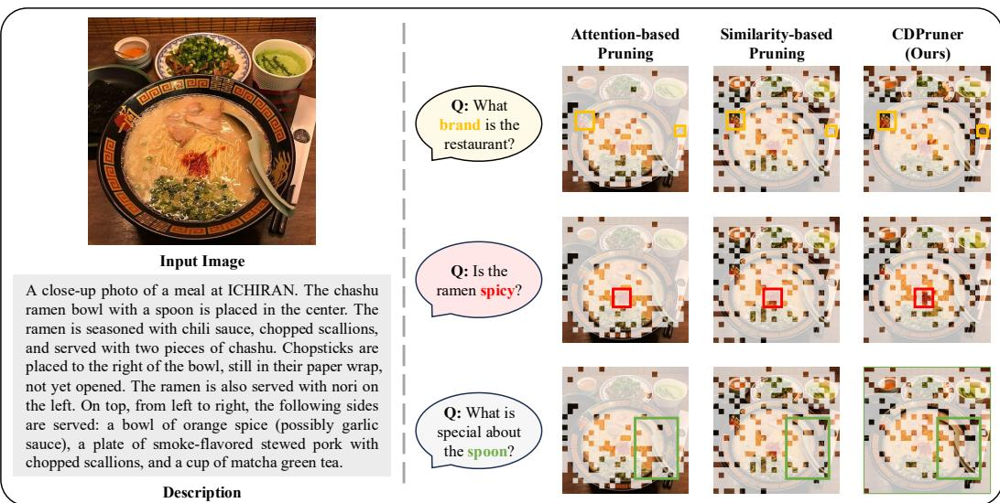

# 1 Introduction

> 来源: Beyond Attention or Similarity: Maximizing Conditional Diversity for Token Pruning in MLLMs

---

> 💡 **Section 概览**: 介绍 MLLM 中视觉 token 过多的问题，分析现有剪枝方法的不足，引出 CDPruner 的动机和贡献。

---

## 📄 原文

Benefiting from the remarkable success of large language models (LLMs), multimodal large language models (MLLMs) have extended their powerful reasoning capabilities to more modalities, such as images or videos. To fully leverage the strengths of LLMs, MLLMs typically encode visual inputs into a form that language models can understand, known as tokens. Within the input sequence, the length of visual tokens often numbers in the hundreds, exceeding their textual counterparts by tens of times. And in video streams or high-resolution scenarios, this number can grow even larger. Since attention-based models exhibit computational complexity that scales quadratically with token length, an excessive number of visual tokens makes the use of MLLMs costly and impractical for low-latency or resource-constrained applications.

> 💡 **批注**: 视觉 token 的规模问题：
> ```
> LLaVA-1.5:     336×336 图片 → 576 tokens
> LLaVA-NeXT:    672×672 图片 → 2,880 tokens
> LongVA:        2000 帧视频 → 200K+ tokens
> LongVILA:      6000 帧视频 → 1M+ tokens
> ```
> 而文本 token 通常只有几十个，视觉 token 是文本的几十甚至上百倍。

---


*Figure 1: 不同 token 剪枝方法的对比。Attention-based 保留大量重复 token；Similarity-based 忽略用户指令，总是剪掉相同的 token；CDPruner 根据指令动态调整，保留最大视觉信息。*

> 💡 **Figure 1 批读**:
> ```
> 场景：一碗拉面的图片
>
> Attention-based（如 FastV）：
> ├── 保留了很多"碗"的 token（因为注意力高）
> └── 但这些 token 长得差不多，信息冗余
>
> Similarity-based（如 DivPrune）：
> ├── 不管用户问什么，剪掉的 token 都一样
> └── 可能丢失跟问题相关的关键细节
>
> CDPruner：
> ├── 成功保留 "ICHIRAN" logo（碗上的字）
> ├── 保留辣椒（拉面上的配料）
> ├── 保留勺子把手的防滑设计
> └── 其他两种方法都丢失了这些细节
> ```
> **关键区别**：CDPruner 能根据用户问题**动态**选择保留哪些 token。

---

Abundant efforts have been made to reduce the inference cost of MLLMs by pruning visual tokens, and existing methods can be roughly divided into two categories. The first is to identify visual tokens with high attention scores as important and discard those deemed less critical. The second is to remove redundant parts based on feature similarity between visual tokens. As illustrated in Figure 1, both approaches suffer from inherent weaknesses, leading to suboptimal performance after pruning. Attention-based methods only consider the importance of visual tokens, resulting in a large number of duplicate tokens being retained, while similarity-based methods neglect user instructions, failing to achieve dynamic pruning in alignment with the current question.

> 💡 **批注**: 两类方法的核心缺陷总结：
> | 方法类型 | 代表 | 优点 | 缺点 |
> |---------|------|------|------|
> | Attention-based | FastV, PyramidDrop | 考虑指令相关性 | 保留重复 token |
> | Similarity-based | DivPrune, DART | 保证多样性 | 忽略指令 |
> | **CDPruner** | **本文** | **两者兼顾** | — |

---

To address these issues, we propose CDPruner, a plug-and-play method for MLLM inference acceleration by maximizing the conditional diversity of the selected subset. Conditional diversity simultaneously considers feature similarity and instruction relevance, maintaining considerable performance at high reduction ratios without the need for additional training. Specifically, we first calculate pairwise similarity between visual tokens conditioned on their relevance to the input instruction. To obtain the retained tokens, we reformulate the token pruning problem with determinantal point process (DPP), which is widely used for modeling list-wise diversity based on pairwise similarity.

> 💡 **DPP 是什么（大白话）**:
> DPP（行列式点过程）原本是量子物理中描述费米子排斥的数学工具。直觉上：
> - 费米子不能占据相同的量子态 → "反聚集"效应
> - 在这里：选出的 token 不能太相似 → 多样性
> - DPP 的优势：考虑**全局**多样性，而不是像 MMDP 那样只看极端情况

---

As a simple yet effective solution, CDPruner offers several practical advantages. First, in contrast to attention-based methods, CDPruner does not require access to attention scores, which ensures its complete compatibility with efficient attention acceleration implementations like FlashAttention. Second, CDPruner does not depend on a specific visual encoder or language model, and can be readily implemented across any token-based MLLM.

> 💡 **实用优势**:
> 1. ✅ 兼容 FlashAttention（不需要 attention score）
> 2. ✅ 不依赖特定 visual encoder（model-agnostic）
> 3. ✅ 不需要训练（training-free）
> 4. ✅ 额外延迟 < 10ms（可忽略）

---

Extensive experiments across various MLLMs demonstrate the effectiveness and efficiency of CDPruner. When applied to LLaVA-NeXT-7B, it reduces FLOPs by 95%, CUDA latency by 78%, and GPU memory by 17%, while maintaining 94% of the original performance in a training-free manner.

In summary, the contributions of our work are three-fold:

1. We introduce CDPruner, a plug-and-play and model-agnostic solution for visual token pruning that maximizes conditional diversity.
2. We reformulate the token pruning problem with determinantal point process, which facilitates dynamic pruning by jointly considering feature similarity and instruction relevance.
3. We conduct extensive experiments on various vision-language benchmarks, demonstrating that CDPruner consistently achieves state-of-the-art across different reduction ratios.

---

## 💡 Section 总结

### 核心洞察
1. 现有方法要么只看"重要性"（attention），要么只看"多样性"（similarity），都是片面的
2. CDPruner 提出 **conditional diversity** = diversity + relevance，用 DPP 统一建模
3. Training-free + model-agnostic，实用性极强
