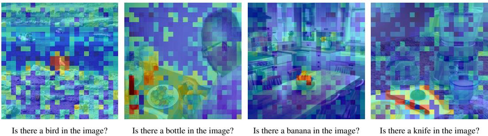

# 3 Method

> 来源: Beyond Attention or Similarity: Maximizing Conditional Diversity for Token Pruning in MLLMs

---

> 💡 **Section 概览**: CDPruner 的完整方法。四步走：(1) 定义 token pruning 问题，(2) 用 DPP 建模 token 多样性，(3) 引入指令相关性作为条件，(4) 合并为 CDPruner。

---


*Figure 2: CDPruner 整体流程。先计算视觉 token 间的条件相似度（conditioned on instruction relevance），然后用 DPP 选出最优子集。*

> 💡 **Figure 2 批读**:
> ```
> CDPruner 流程:
> 输入 → Visual Encoder → 视觉 tokens H_v
>                              ↓
> 用户指令 → Text Encoder → 文本嵌入 H_q
>                              ↓
>              计算 relevance score r_i = cos(H_v^i, H_q)
>                              ↓
>              构建条件核矩阵 L̃ = diag(r̃) · L · diag(r̃)
>                              ↓
>              DPP 贪心 MAP 推断 → 选出 m 个 token
>                              ↓
>              送入 LLM 生成回答
> ```

---

## 3.1 Visual Token Pruning

> 💡 **3.1 要点预览**: 形式化定义 token pruning 问题。

Existing MLLMs typically consist of three core components: a vision encoder $f_v$, a multimodal projector $g$, and an LLM $f_\phi$. The vision encoder encodes the input image $X_v$ into a sequence of visual tokens $H_v = g(f_v(X_v)) \in \mathbb{R}^{n \times d}$.

Visual token pruning aims to reduce the inference cost by selecting a subset:

$$\tilde{H_v}^* = \arg\min_{\tilde{H_v} \subseteq H_v, |\tilde{H_v}|=m} \mathcal{L}(f_\phi([\tilde{H_v}; H_q]), f_\phi([H_v; H_q]))$$

> 💡 **批注（大白话）**: 从 n 个视觉 token 中选 m 个（m < n），使得模型输出尽量不变。问题是：怎么选？

Previous methods mainly rely on attention scores for pruning, which often leads to significant redundancy. DivPrune formulates the problem as MMDP, but overly focuses on extreme cases while neglecting global diversity.

> 💡 **3.1 小结**: Token pruning 本质是子集选择问题。关键在于选择标准：attention（重要性）、similarity（多样性）、还是两者结合？

---

## 3.2 DPP with Token Similarity

> 💡 **3.2 要点预览**: 用 DPP 建模 token 间的多样性——核心数学工具。

A DPP $\mathcal{P}$ on a discrete set $Z = \{1, 2, \dots, n\}$ is a probability measure on $2^Z$. When $\mathcal{P}$ gives nonzero probability to the empty set, there exists a PSD kernel matrix $L \in \mathbb{R}^{n \times n}$ such that:

$$\mathcal{P}(S) = \frac{\det(L_S)}{\det(L + I)} \propto \det(L_S)$$

> 💡 **DPP 直觉（大白话）**:
> ```
> det(L_S) 的几何含义：
> - L_S 是选中 token 的相似度子矩阵
> - det(L_S) = 这些 token 张成的"体积"
> - token 越不同 → 体积越大 → 概率越高
> - token 越相似 → 体积越小（趋向退化）→ 概率越低
>
> 所以 DPP 天然偏好多样性高的子集！
> ```

In the context of token pruning, the kernel matrix $L$ is defined by pairwise cosine similarity:

$$L_{ij} = \frac{H_v^i \cdot H_v^j}{\|H_v^i\| \cdot \|H_v^j\|}$$

The optimal subset is obtained by MAP inference:

$$S^* = \arg\max_{S \subseteq Z, |S|=m} \det(L_S)$$

> 💡 **3.2 小结**: 纯 DPP 只看 token 间的特征相似度，选出最"不重复"的子集。但问题是：没有考虑用户问了什么。

---

## 3.3 Instruction Relevance

> 💡 **3.3 要点预览**: 引入指令相关性，让剪枝变成"有条件的"。


*Figure 3: Relevance score 可视化。红色表示高相关性，蓝色表示低相关性。用 LLaVA-1.5-7B 在 POPE 基准上计算，指令为 "Is there a {object} in the image?"*

> 💡 **Figure 3 批读**:
> ```
> 可以看到：
> - 问"Is there a car?" → 停车场区域高亮（红色）
> - 问"Is there a person?" → 人物区域高亮
> - CLIP 的 vision-text 对齐确实能捕捉指令与图像区域的对应关系
> ```

Given visual embeddings $H_v \in \mathbb{R}^{n \times d}$ and text embedding $\bar{H}_q \in \mathbb{R}^d$, the relevance is:

$$r_i = \frac{H_v^i \cdot \bar{H}_q}{\|H_v^i\| \cdot \|\bar{H}_q\|}$$

> 💡 **批注**: 文本嵌入的获取方式因模型而异：
> - **有 text encoder 的模型**（LLaVA 系列，用 CLIP/SigLIP）：直接用 text encoder 编码指令
> - **只有 visual encoder 的模型**（Qwen2.5-VL, InternVL3）：用 LLM 中指令 token 嵌入的平均值

然后做 min-max 归一化，确保 $\tilde{r} \in [0, 1]$：

$$\tilde{r} = \frac{r - \min(r)}{\max(r) - \min(r)}$$

> 💡 **3.3 小结**: Relevance score 衡量每个视觉 token 跟用户指令的相关程度。归一化后作为 DPP 的条件权重。

---

## 3.4 CDPruner

> 💡 **3.4 要点预览**: 最终方案——将相似度和相关性统一到条件核矩阵中。

We modulate the original kernel matrix with the relevance scores to obtain a conditional kernel matrix:

$$\tilde{L} = \text{diag}(\tilde{r}) \cdot L \cdot \text{diag}(\tilde{r})$$

The updated log-probability:

$$\log\det(\tilde{L}_S) = \sum_{i \in S} \log(\tilde{r}_i^2) + \log\det(L_S)$$

> 💡 **条件核矩阵（大白话）**:
> ```
> 原始核矩阵 L：只编码 token 间的相似度
> 条件核矩阵 L̃：同时编码相似度 + 指令相关性
>
> 具体做法：用 relevance score 对 L 做"加权"
> L̃_ij = r̃_i · L_ij · r̃_j
>
> 效果：
> - 与指令相关的 token → r̃ 大 → L̃ 中的值大 → 更容易被选中
> - 与指令无关的 token → r̃ 小 → L̃ 中的值小 → 不容易被选中
> - 同时，DPP 仍然保证选出的 token 之间尽量不同
>
> log P(S) = Σ log(r̃_i²) + log det(L_S)
>            ↑ 相关性项      ↑ 多样性项
> ```

We then obtain the optimal subset via MAP inference. Although MAP inference for DPP is NP-hard, there exists a greedy algorithm with polynomial-time complexity that guarantees a $(1 - 1/e)$ approximation. By using Cholesky decomposition, the overall time complexity can be reduced to $\mathcal{O}(nm^2)$. The additional latency is negligible when $m \ll n$, with less than 10ms per sample.

> 💡 **复杂度分析**:
> | 项目 | 值 |
> |------|-----|
> | 理论复杂度 | O(nm²) |
> | 近似保证 | (1 - 1/e) ≈ 63.2% |
> | 实际延迟 | < 10ms/sample（CUDA 并行化后） |
> | n=576, m=64 时 | 576 × 64² ≈ 2.4M 次运算，很快 |

---

## 💡 Section 总结

### CDPruner 算法流程
```
1. 编码图片 → 得到视觉 token H_v (n个)
2. 编码指令 → 得到文本嵌入 H̄_q
3. 计算 relevance: r_i = cos(H_v^i, H̄_q)
4. 归一化: r̃ = min-max normalize(r)
5. 构建核矩阵: L_ij = cos(H_v^i, H_v^j)
6. 条件核矩阵: L̃ = diag(r̃) · L · diag(r̃)
7. DPP 贪心 MAP 推断: 选出 m 个 token
8. 用选出的 token 替换原始 token，送入 LLM
```

### 关键公式速查
| 公式 | 含义 |
|------|------|
| $L_{ij} = \cos(H_v^i, H_v^j)$ | Token 间相似度 |
| $r_i = \cos(H_v^i, \bar{H}_q)$ | Token-指令相关性 |
| $\tilde{L} = \text{diag}(\tilde{r}) \cdot L \cdot \text{diag}(\tilde{r})$ | 条件核矩阵 |
| $\log\det(\tilde{L}_S) = \sum\log(\tilde{r}_i^2) + \log\det(L_S)$ | 优化目标 = 相关性 + 多样性 |
