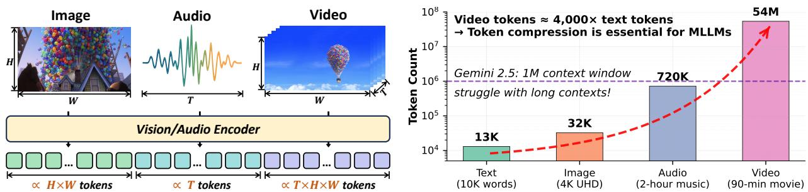

[← 返回 README](../README.md)

# 1 Introduction

## 📌 预览
Introduction 阐述了 MLLM 面临的 token 爆炸问题、token 压缩的必要性、现有研究的碎片化现状，以及本综述的分类框架和贡献。

---

Multimodal large language models (MLLMs) (Liu et al., 2023; Li et al., 2025a; Xu et al., 2024a; Bai et al., 2023; Xu et al., 2025b; Lin et al., 2024a; Zhang et al., 2023a; Li et al., 2024a; 2023d; Cheng et al., 2024c; Zhang et al., 2025a; Song et al., 2024b) have demonstrated exceptional performance on complex tasks, including visual question answering (VQA), automatic speech recognition (ASR) and multimodal content generation, by extending the architectural of large language models (LLMs) (Chiang et al., 2023; Team, 2024; AI@Meta, 2024; Abdin et al., 2024). These powerful models derive their strength from processing long and diverse contexts, such as high-resolution images, extended video sequences, and long audio input, using transformer architectures.

> 💡 **背景**: MLLM 通过扩展 LLM 来处理多模态数据，在 VQA、ASR、多模态生成等任务上表现出色。核心能力来自处理长而多样的上下文。

Achieving this capability, however, faces a significant challenge: the quadratic complexity of the self-attention mechanism. As the number of tokens increases, this complexity leads to substantial computational and memory demands. This problem is particularly pronounced in MLLMs, where the tokenization of visual and audio data can generate sequences of orders of magnitude longer than text (Shao et al., 2025; Tao et al., 2025a; Yang et al., 2025c; Song et al., 2025c).

> 💡 **核心问题**: Self-attention 的 O(N²) 复杂度。多模态数据 tokenize 后的序列比纯文本长好几个数量级。

For instance, as illustrated in Figure 1, the number of image tokens is directly proportional to resolution, while the number of audio tokens is proportional to duration, and video tokens scale with both resolution and duration. A single content-rich video can produce tens of millions of tokens, dramatically exacerbating computational inefficiencies and leading to severe inference latency (90 minutes video will be converted into 54M tokens)1. Consequently, addressing this computational bottleneck is critical for unlocking the full potential of MLLMs in real-world applications.

> 💡 **关键数字**: 90 分钟视频 → 5400 万 tokens！这个数字非常震撼，说明视频 MLLM 的 token 压缩是刚需。

*Figure 1: Left: Image, video, and audio data types can scale in their representation dimensions, leading to a corresponding increase in the number of tokens. Right: Top-performing MLLMs cannot address real-world demands, as the number of tokens for multimodal input, especially video, vastly exceeds that of text, and most visual tokens are redundant. Therefore, token compression is crucial to address this limitation.*

> 💡 **Figure 1 批读**:
> - 左图展示了三种模态的 token 增长维度：图像随分辨率增长、音频随时长增长、视频同时随分辨率和时长增长
> - 右图对比了当前顶级 MLLM 的 context window 与实际需求的差距——视频 token 远超文本 token，且大部分视觉 token 是冗余的

To address the challenges posed by the long context, token compression has emerged as a critical research focus for enhancing the inference efficiency and practical deployment of MLLMs. This approach is highly effective because multimodal inputs, like those processed by vision transformers (ViT), contain significant redundancy (Rao et al., 2021; Liang et al., 2022; Bolya et al., 2022; Ryoo et al., 2021; Touvron et al., 2021; Vaswani et al., 2017; Yang et al., 2025d). Extensive research, for example, demonstrates that more than 50% of tokens in a typical MLLM sequence receive minimal attention during inference (Chen et al., 2024a; Huang et al., 2025c; Tao et al., 2025a; Shao et al., 2025; Alvar et al., 2025; Shang et al., 2025). While some advanced techniques integrate compression directly into a model's architecture or training framework (Chen et al., 2024c; Dai et al., 2024; Wang et al., 2024c; Bai et al., 2025; Li et al., 2025a; Zhang et al., 2024d; Cai et al., 2024a; Yao et al., 2024; Cha et al., 2024; Chu et al., 2023; 2024a; Li et al., 2024d), a major advantage of token compression is its ability to be applied as a post-optimization technique without requiring expensive retraining. These methods typically operate by first establishing a specialized metric to evaluate token importance, then performing a corresponding pruning or compression. By significantly accelerating inference and reducing memory consumption, these techniques enable the practical deployment of MLLMs in real-world applications (Lin et al., 2025a; Chu et al., 2023; 2024a; Wei et al., 2025; Ma et al., 2024b).

> 💡 **Token 压缩的合理性**:
> - **冗余性**: 超过 50% 的 token 在推理时几乎不受关注
> - **灵活性**: 既可以集成到模型训练中，也可以作为 post-optimization（无需重训练）
> - **通用流程**: 评估 token 重要性 → 剪枝/压缩

Recent extensive research demonstrates that token compression substantially enhances inference efficiency, driving the continuous development of diverse compression strategies and sophisticated methodologies (Shen et al., 2025a; Chai et al., 2025; Alvar et al., 2025; Huang et al., 2025c; Yang et al., 2025c; Shang et al., 2025; Zhang et al., 2025b; Cao et al., 2023; Yang et al., 2025a; Chen et al., 2024a; Tao et al., 2025c; Zhang et al., 2024c; Liu et al., 2024c; Yang et al., 2025d; Ma et al., 2025b). However, the inherent heterogeneity of multimodal data means that redundancy differs across modalities. Unlike textual prompts, where redundancy is primarily in syntactic or semantic, visual and auditory data exhibit unique structural properties. For instance, high-resolution images contain strong local correlations, while video streams feature extensive spatiotemporal redundancy across frames, and audio signals often contain extended segments of silence or stationary noise. Consequently, most existing methods focus on compressing one or two specific modalities.

> 💡 **模态异构性**: 不同模态的冗余模式完全不同——图像是局部空间相关、视频是帧间时空冗余、音频是静音/噪声冗余。这解释了为什么需要按模态分类研究。

Significant strides have been made in compressing tokens in text LLMs. For instance, (Li et al., 2025d) has thoroughly explored prompt compression for text LLMs, highlighting advancements in this domain. In MLLMs, position paper (Kong et al., 2025) has begun to broaden our understanding, emphasizing that token compression offers benefits beyond mere efficiency. Furthermore, some researchers argue that the focus of research for efficient AI is shifting from model-centric compression to data-centric compression (Liu et al., 2025d). However, there has not yet been a systematic classification of token compression methods specifically for MLLMs, leaving an opportunity for a comprehensive survey in this area.

> 💡 **研究空白**: 文本 LLM 的 prompt 压缩已有 survey，但 MLLM 的 token 压缩尚无系统分类 → 本文的切入点。另外注意一个有意思的趋势：从 model-centric 压缩（量化/剪枝）转向 data-centric 压缩（token 压缩）。

Motivated by the critical need for efficiency in MLLMs and a desire to address this current research fragmentation, this work presents the first comprehensive, structured survey of long-context token compression techniques. We systematically categorize existing approaches according to their primary modality focus:

• Image-centric token compression addresses inherent spatial redundancy, leveraging the fact that neighboring patches usually represent similar textures or colors;   
• Video-centric token compression targets spatiotemporal redundancy, mitigating the significant inter-frame correlation where consecutive frames typically share extensive background elements and limited motion;   
• Audio-centric token compression mitigates temporal and spectral redundancy, as salient information often concentrates within sparse, brief segments and specific frequency bands amidst silent pauses or background noise.

> 💡 **三大分类**:
> - **图像**: 空间冗余（相邻 patch 纹理/颜色相似）
> - **视频**: 时空冗余（连续帧背景高度重复）
> - **音频**: 时间+频谱冗余（有效信息集中在稀疏的短片段和特定频段）

Importantly, while acknowledging modality-specific influences on redundancy patterns and optimal compression strategies, we observe that fundamental algorithmic principles frequently transcend individual modalities. Effective compression fundamentally centers on three core computational objectives: importance identification, redundancy quantification, and token merging or pruning. These objectives manifest similarly across visual, temporal, and auditory domains despite distinct structural constraints. Consequently, we further categorize methodologies according to their underlying mechanisms: transform-based, similarity-based, attention-based, and query-based approaches.

> 💡 **跨模态共性**: 虽然冗余模式不同，但压缩的核心算法原理是共通的——重要性识别、冗余量化、token 合并/剪枝。因此第二个分类维度是按机制（transformation/similarity/attention/query）。

This work presents the first structured survey of token compression techniques for MLLMs, a critical step in navigating their inherent computational complexities. By consolidating current progress, this survey identifies key challenges and illuminates promising future research directions, providing a foundational resource for both researchers and developers.

The remaining sections of the article are organized as follows: we will first discuss the architecture of MLLMs in the background section (Section 2.1), followed by an examination of how token compression has been utilized in prior methods for large language models (LLMs, Section 2.2) and vision transformers (ViTs, Section 2.3). Subsequent sections will be dedicated to token compression methods for specific modalities: Section 3 for image LLMs, Section 4 for video LLMs, and Section 5 for audio LLMs. Following this, Section 6 will provide insights into token compression research. Finally, Section 7 will introduce the broad application space of token compression, followed by the concluding Section 8.

> 💡 **全文结构路线图**:
> - §2 Background: MLLM 架构 + LLM/ViT 中的 token 压缩前置知识
> - §3/4/5: 按模态的压缩方法（图像/视频/音频）
> - §6: 讨论（与其他压缩方法的关系、挑战、未来方向）
> - §7: 应用场景
> - §8: 结论

---

## 🔖 Section 总结

### 关键数字速查
| 指标 | 数值 |
|------|------|
| 90 分钟视频 token 数 | 54M (5400 万) |
| 典型 MLLM 中低注意力 token 比例 | >50% |

### 核心洞察
1. MLLM 的 token 瓶颈主要来自多模态数据（尤其视频），远超文本 token
2. Token 压缩可以作为 post-optimization，无需重训练，这是其最大优势之一
3. 综述采用「模态 × 机制」双维度分类，既考虑数据特性又考虑算法原理
