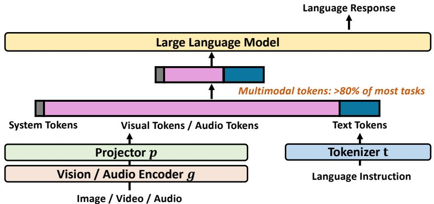
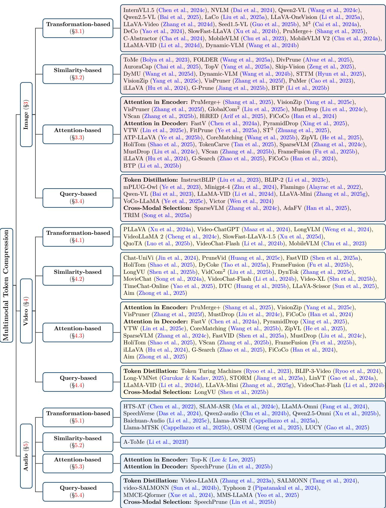

[← 返回 README](../README.md)

# 2 Background

## 📌 预览
Background 介绍了 MLLM 的通用架构（编码器-投影器-LLM）、文本 LLM 中的 token 压缩（prompt compression）、ViT 中的视觉 token 压缩，以及本综述的 token 压缩定义和分类边界。

---

## 2.1 Multimodal Architecture

The general multimodal large language model (MLLM) framework (see Figure 2), consists of three core components: (1) a modality-specific encoder (g), (2) a projector module (P), and (3) a pre-trained large language model (LLM).

> 💡 **MLLM 三件套**: Encoder（编码器）→ Projector（投影器）→ LLM。这是当前 MLLM 的标准架构。

The process begins with the modality encoder, g, which is responsible for processing a given input, such as a visual or audio signal. This encoder compresses the high-dimensional raw data into a sequence of compact and semantically meaningful patch embeddings. For an input image X_v and an audio X_a, this can be expressed as:

$$Z_v = g(X_v), \quad Z_a = g(X_a).$$

The encoding function g is a flexible component that can be specialized for various modalities, including vision, audio, sensor data, etc. Widely adopted encoders implementing this function include:

• Vision encoders: CLIP (Radford et al., 2021), SigLIP (Zhai et al., 2023), DINO (Caron et al., 2021; Oquab et al., 2023), and ViT (Bai et al., 2025); • Audio encoders: Whisper (Radford et al., 2023) and Audio-CLIP (Guzhov et al., 2022).

> 💡 **编码器选型**:
> - 视觉: CLIP、SigLIP、DINOv2、ViT
> - 音频: Whisper、Audio-CLIP
> 这些都是各自领域的预训练 backbone。

Subsequently, the encoded embeddings (Z_v or Z_a) are transformed by the projector module, P. The primary role of this module is to bridge the modality gap by mapping the embeddings into the same latent space as the text embeddings of LLM.

$$H_v = P(Z_v), \quad H_a = P(Z_a).$$

The output of the projector, a sequence of projected embeddings, can then be seamlessly concatenated with the text prompts and fed into the LLM.

> 💡 **Projector 的角色**: 把视觉/音频 embedding 映射到和文本 embedding 相同的空间。这一步是 token 压缩的关键位置之一——很多方法在 projector 里做压缩。

The pre-trained LLM (Chiang et al., 2023; Team, 2024; AI@Meta, 2024) forms the core of the framework, with its large-scale parameters providing emergent capabilities such as zero-shot generalization and in-context learning. The LLM receives a composite input sequence formed by concatenating the projected multimodal embeddings H_v and H_a, as well as the textual prompt embeddings H_q. The textual prompt X_q is first converted into embeddings H_q by an integrated tokenizer.

The LLM then generates a response sequence Y_a through autoregressive decoding:

$$p(Y_a | H_v, H_a, H_q) = \prod_{i=1}^{L} p(y_i | H_v, H_a, H_q, y_{<i}),$$

*Figure 2: Representative Architecture of MLLMs. Within MLLM reasoning processes, token sequences comprise concatenated system tokens, multimodal tokens, and text tokens. Multimodal tokens usually constitute the majority of the sequence tokens.*

> 💡 **Figure 2 批读**:
> - MLLM 的输入序列 = system tokens + 多模态 tokens + text tokens
> - 多模态 tokens 通常占序列的绝大部分（>80%），因此是压缩的主要目标
> - 自回归解码过程中，每一步都要 attend to 所有输入 token，所以 token 数量直接影响推理延迟

where L signifies the output sequence length.

The high dimensionality of multimodal data poses a computational challenge. As shown in Figure 2, the token sequence processed comprises a mix of system prompt, multimodal context, and textual instruction. In most reasoning tasks, multimodal tokens constitute over 80% of the total sequence length (Chen et al., 2024a), thereby forming the primary computational bottleneck. This bottleneck obstacle to scaling MLLMs and achieving efficient inference. Consequently, a key strategy to optimize computational efficiency involves employing specialized projector architectures. These projectors are designed to reduce the number of multimodal tokens while preserving their semantic fidelity, thus mitigating the computational burden.

> 💡 **关键数字**: 多模态 token 占总序列长度的 **>80%**。这解释了为什么 token 压缩主要针对多模态 token 而非文本 token。

While MLLM architecture presents unique challenges, token compression has been explored for both encoders and LLMs independently. Therefore, the subsequent sections will first dive into techniques relevant to these individual components, paving the way for more efficient multimodal models. Specifically, Section 2.2 will focus on token compression methods for large language models (LLMs), and Section 2.3 will explore techniques for vision transformers (ViTs).

---

## 2.2 Large Language Model Token Compression

The backbone of modern MLLMs is often built upon and fine-tuned from powerful text-based LLMs. As a foundational component, a solid understanding of token compression techniques developed for text LLMs is crucial, as they offer an accurate and lightweight solution for handling real-world long-context scenarios, such as understanding an entire book or a code repository. Within the domain of large language models, these methods are frequently termed prompt compression (Li et al., 2025d).

> 💡 **前置知识**: 在 LLM 领域，token 压缩通常叫 **prompt compression**。主要目的是让模型能处理超长上下文（整本书、代码仓库等）。

AutoCompressor (Chevalier et al., 2023) condenses context into summary vectors as soft prompts. Extensible Tokenization (Shao et al., 2024) employs intermediate modules to compress embeddings, while SentenceVAE (An et al., 2024) represents sentences with single tokens. Selective Context (Li et al., 2023g) employs self-information metrics to eliminate low-information tokens. LLMLingua (Jiang et al., 2023a;b; Pan et al., 2024) series utilizes hierarchical token pruning with instruction tuning and further introduces LongLLMLingua (Jiang et al., 2023b) to mitigate position decay through semantic density ranking.

> 💡 **LLM Token 压缩方法一览**:
> - **AutoCompressor**: 上下文 → summary 向量（soft prompt）
> - **SentenceVAE**: 一个句子 → 一个 token
> - **Selective Context**: 用 self-information 指标过滤低信息 token
> - **LLMLingua 系列**: 层次化 token 剪枝 + 指令微调，最经典的 prompt 压缩方法

In parallel, query-guided methods like QUITO (Wang et al., 2024e) and QUITO-X (Wang et al., 2024f) leverage attention scores or information bottleneck theory for relevance-based filtering. AdaComp (Zhang et al., 2024a) implements adaptive extraction governed by query complexity predictors. Concept Distillation (Shi et al., 2024) employs Abstract Meaning Representation (AMR) graphs to distill key concepts, whereas xRAG (Cheng et al., 2024b) collapses documents into single-token representations. ICAE (Ge et al., 2023) encodes context into discrete memory slots. Recursive frameworks including RCC (Huang et al., 2024) and XL3M (Wang et al., 2024d) generate piecewise summaries through relevant fusion. SoftPromptComp (Wang et al., 2024a) fuses natural language prompts with dynamic embeddings, while PromptIntern (Zou et al., 2024) internalizes task instructions into model parameters via phased training.

> 💡 **更多方法**: Query-guided 方法（QUITO, AdaComp）根据查询来筛选 token；xRAG 把整个文档压成一个 token；ICAE 编码到离散 memory slots。这些思路后来都影响了 MLLM 的 token 压缩方法设计。

Targeting inference efficiency, KV cache compression techniques prune redundant memory states to accelerate generation. H2O (Zhang et al., 2023b) and StreamingLLM (Xiao et al., 2024) utilize heavy-hitter policies and attention sinks to maintain generation quality under limited budgets. Furthermore, SnapKV (Li et al., 2024e) and PyramidKV (Cai et al., 2024b) enhance long-context performance by pinpointing key attention clusters or dynamically adjusting cache allocations across layers.

> 💡 **KV Cache 压缩**: H2O（保留 heavy-hitter token）、StreamingLLM（attention sink）、SnapKV、PyramidKV。这些方法和 token 压缩有关联但不完全相同——KV cache 压缩减少的是推理时的内存占用。

While these text-centric token compression techniques have demonstrated notable efficacy, their direct application to MLLMs faces fundamental challenges. The inherent heterogeneity of multimodal data introduces distinct redundancy patterns absent in unimodal text. These include, but are not limited to, spatial correlations in high-resolution images, spatiotemporal continuity in video sequences, and spectral-temporal locality in audio streams. Such specialized redundancies necessitate the development of dedicated compression strategies. Consequently, this survey systematically reviews emerging token compression methodologies for MLLMs that effectively reduce token redundancy while preserving task performance.

> 💡 **为什么不能直接用文本压缩方法**: 多模态数据有独特的冗余模式（空间/时空/频谱-时间），文本方法无法处理。所以需要专门为 MLLM 设计的方法。

---

## 2.3 Vision Transformer Token Compression

Visual token compression, originally pioneered in vision transformers (ViTs) (Vaswani et al., 2017; Dosovitskiy et al., 2020; Dong et al., 2022; Liu et al., 2021; Fan et al., 2021; Li et al., 2022; Graham et al., 2021; Huang et al., 2025a; Feng & Zhang, 2023), offers insights for addressing analogous challenges in MLLMs.

Spatial redundancy manifests in ViTs through adjacent image patches, where not all tokens contribute equally to classification outcomes, compounded by semantic imbalance: foreground objects demand disproportionate computational resources compared to homogeneous backgrounds. To mitigate these issues, visual token compression techniques are employed to reduce computational overhead while maintaining model accuracy.

> 💡 **ViT 中的冗余**: 相邻 patch 相似、前景 vs 背景语义不平衡。不是所有 token 都对分类结果贡献相同。

Foundational approaches, including DynamicViT (Rao et al., 2021) and EViT (Liang et al., 2022), quantify token relevance through attention scores, dynamically pruning low-saliency tokens. Complementary techniques like ToMe (Bolya et al., 2022) and TokenLearner (Ryoo et al., 2021) either merge semantically similar tokens using similarity metrics or generate compact token sets via learned spatial attention mechanisms. DeiT (Touvron et al., 2021) employs lightweight 'student' heads to predict categorical labels from compressed token subsets. Furthermore, methods such as MADTP (Cao et al., 2024) leverage cross-modal alignment to filter tokens.

> 💡 **ViT Token 压缩经典方法**:
> - **DynamicViT / EViT**: 基于 attention score 剪枝低显著性 token
> - **ToMe**: 合并相似 token（bipartite soft matching）— 后来在 MLLM 中广泛应用
> - **TokenLearner**: 学习空间注意力生成紧凑 token 集
> - **DeiT**: 蒸馏头从压缩 token 子集预测
> 这些方法构成了 MLLM token 压缩的方法论基础。

The preceding analysis demonstrates that ViT token compression methodologies offer substantive inspiration for token reduction in MLLMs. However, MLLMs possess not only multimodal tokens encoding low-level features but also text tokens conveying high-level abstractions, coupled with significantly longer token sequences. Consequently, token compression in MLLMs presents greater challenges than in ViT while being increasingly critical for computational efficiency. Therefore, this survey analyzes the evolution and future directions of token compression techniques for MLLMs operating in long-context multimodal environments.

> 💡 **ViT → MLLM 的挑战升级**: MLLM 比 ViT 多了 text token（高层语义），序列更长，压缩更难但也更关键。

---

## 2.4 Problem Definition and Taxonomy Scope

To clarify the scope of this survey and distinguish token compression from related efficient computing techniques, we establish a strict criterion based on the physical reduction of information flow. We define a method as token compression if and only if it explicitly reduces the number of tokens passed to subsequent layers or modules.

Formally, given an input sequence **X** ∈ R^(N×D), a token compression operator τ produces an output **X'** ∈ R^(M×D) where M < N, while aiming to retain the essential semantic information of **X**. Based on this definition, we delineate the boundaries with related concepts as follows:

> 💡 **严格定义**: Token 压缩 = 物理减少传递给下游层/模块的 token 数量。即 N → M (M < N)。

• Input-level Compression: We classify techniques such as frame sampling and key-frame extraction as a generalized form of token compression operating at the Input Level. By selecting a subset of frames (e.g., extracting key-frames from a video), the initial token count N is reduced prior to the encoding stage. We distinguish this from Feature-level Compression (e.g., token pruning or merging), which dynamically operates on intermediate embeddings within the network layers. Exclusion of Attention Sparsity: We exclude attention sparsity mechanisms (and related efficient attention variants) from the scope of token compression. While these methods reduce computational complexity (e.g., from O(N²) to linear) by masking interactions, they typically output a sequence of the same length (N→N) to the next layer. They sparsify the computation graph, whereas token compression sparsifies the representation.

> 💡 **分类边界**:
> - ✅ **Input-level**: 帧采样/关键帧提取 → 广义 token 压缩（编码前减少 N）
> - ✅ **Feature-level**: token 剪枝/合并 → 狭义 token 压缩（网络层间动态操作）
> - ❌ **Attention Sparsity**: FlashAttention 等稀疏注意力 → **不算** token 压缩（N→N，只是计算图稀疏化）
> 
> 这个区分很重要：attention sparsity 减少计算量但不减少 token 数；token 压缩减少表示本身。

*Figure 3: Taxonomy of Multimodal Token Compression. Our classification organizes existing methods by their dominant data modality, accounting for inherent differences in redundancy across modalities. This is further refined by a dissection of their underlying mechanisms, enabling researchers to quickly pinpoint methods tailored to specific research domains.*

> 💡 **Figure 3 批读** — 本综述的核心 Taxonomy:
> - **第一层（模态）**: Image-centric / Video-centric / Audio-centric
> - **第二层（机制）**: Transformation-based / Similarity-based / Attention-based / Query-based
> - 每种组合下列出了具体方法名称，这张图是全文的 roadmap

---

## 🔖 Section 总结

### 关键数字速查
| 指标 | 数值 |
|------|------|
| 多模态 token 占总序列比例 | >80% |
| MLLM 架构三件套 | Encoder → Projector → LLM |

### 核心洞察
1. MLLM 的标准架构是 Encoder + Projector + LLM，token 压缩可以在任一环节实施
2. LLM 领域的 prompt compression 和 ViT 的 token pruning 为 MLLM token 压缩提供了方法论基础
3. Token 压缩的严格定义是物理减少 token 数量（N→M, M<N），与 attention sparsity 区分开
4. Taxonomy 采用「模态 × 机制」双维度，共 3×4=12 个组合格
