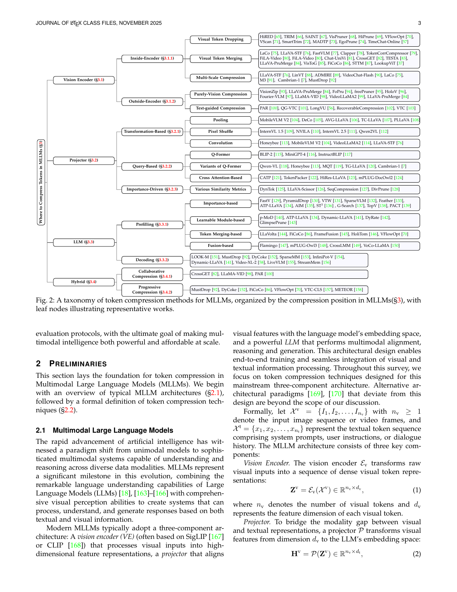
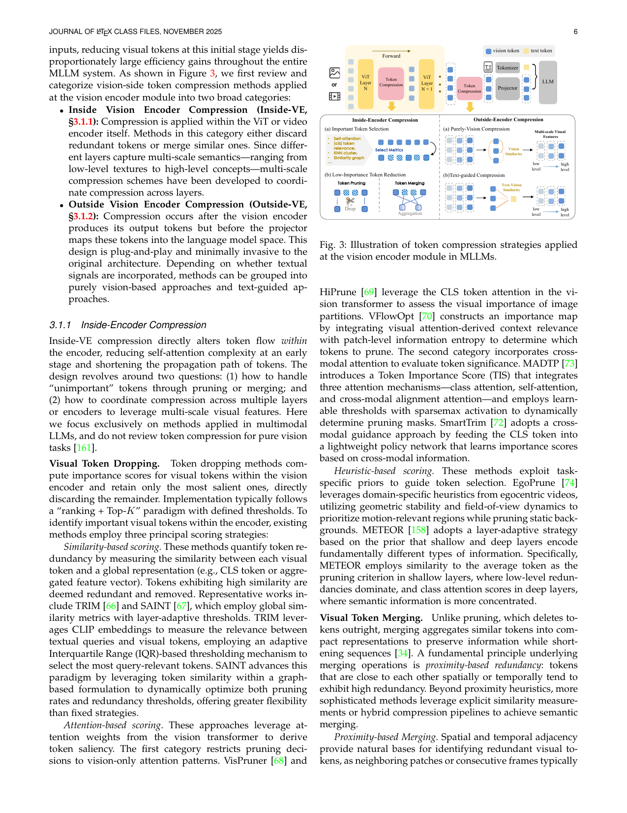
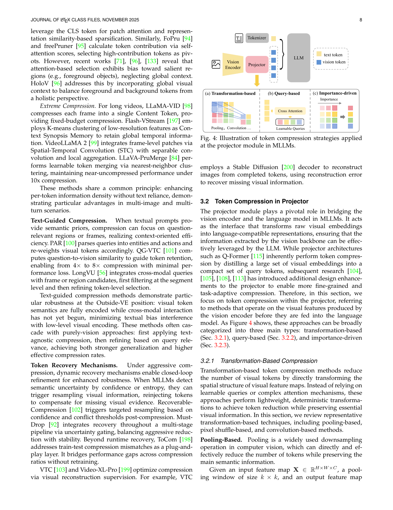
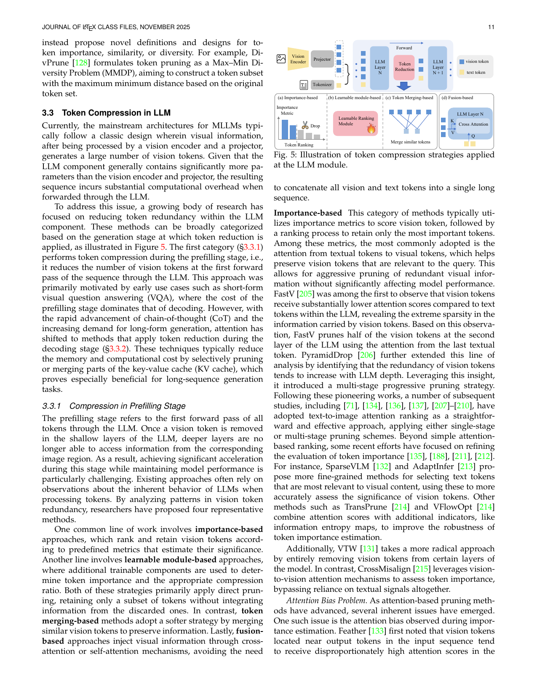
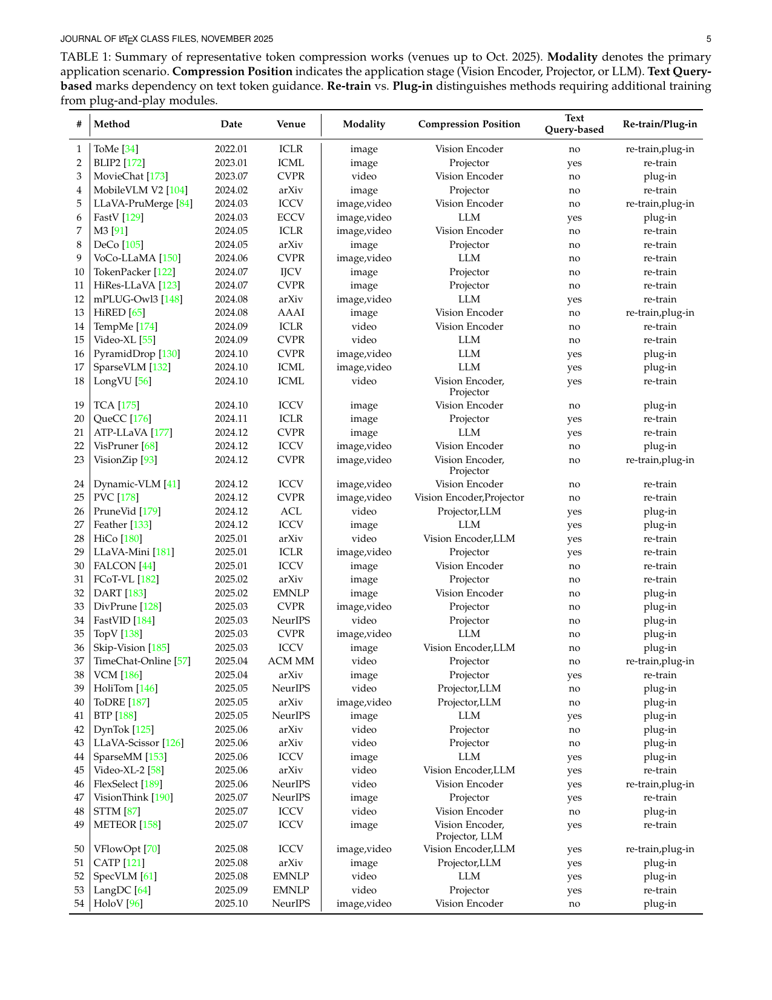

[← 返回 README](../README.md)

# 3. Where to Compress Tokens in MLLMs

## 📌 预览
本文最核心的 Section，按 MLLM 架构位置分类 token compression 方法：Vision Encoder (§3.1)、Projector (§3.2)、LLM (§3.3)、Multi-Module Hybrid (§3.4)。每个位置下又细分具体策略。

---

Based on the taxonomy illustrated in Figure 2, we systematically categorize existing token compression methods according to where compression is applied within the MLLM architecture. Throughout the processing procedure from visual input to textual output, token compression strategies can be progressively deployed at three architectural modules: (1) the Vision Encoder (§3.1), where compression reduces computational overhead at the visual perception stage; (2) the Projector (§3.2), which integrates token reduction during the transformation from visual to linguistic representation space; and (3) the Large Language Model (§3.3), where compression achieves holistic cross-modal efficiency optimization.

*Figure 2: A taxonomy of token compression methods for MLLMs, organized by the compression position, with leaf nodes illustrating representative works.*

> 💡 **Figure 2 批读**: 这是全文的核心分类图。按压缩位置分为四大类：
> - **Vision Encoder**: Inside-Encoder（Dropping/Merging/Multi-Scale）+ Outside-Encoder（Purely-Vision/Text-guided）
> - **Projector**: Transformation-based（Pooling/Pixel Shuffle/Convolution）+ Query-based（Q-Former 及变体）+ Importance-driven
> - **LLM**: Prefilling（Importance/Learnable/Merging/Fusion）+ Decoding（KV-cache 压缩）
> - **Hybrid**: Collaborative + Progressive

---

## 3.1 Token Compression in Vision Encoder

In MLLMs, visual data are inherently more redundant than text [191]–[193], leading to a substantially larger number of tokens on the vision side than on the language side. For instance, a single high-resolution image can be divided into thousands of patch tokens [10], [112]. If these tokens are simply concatenated with text tokens and processed as an "interleaved long sequence", the subsequent pre-filling and decoding stages of the LLM incur quadratic computational complexity with respect to the sequence length. Since the vision encoder (VE) is the first module to encode visual inputs, reducing visual tokens at this initial stage yields disproportionately large efficiency gains throughout the entire MLLM system.

> 💡 **为什么在 VE 压缩？** 因为 VE 是最上游的模块，在此处减少 tokens，下游所有模块都受益（Projector 和 LLM 的计算量都降低）。一张高分辨率图可产生数千 patch tokens。

As shown in Figure 3, we first review and categorize vision-side token compression methods applied at the vision encoder module into two broad categories:

- **Inside Vision Encoder Compression (Inside-VE, §3.1.1)**: Compression is applied within the ViT or video encoder itself. Methods in this category either discard redundant tokens or merge similar ones. Since different layers capture multi-scale semantics—ranging from low-level textures to high-level concepts—multi-scale compression schemes have been developed to coordinate compression across layers.

- **Outside Vision Encoder Compression (Outside-VE, §3.1.2)**: Compression occurs after the vision encoder produces its output tokens but before the projector maps these tokens into the language model space. This design is plug-and-play and minimally invasive to the original architecture.

*Figure 3: Illustration of token compression strategies applied at the vision encoder module in MLLMs.*

> 💡 **Figure 3 批读**: Inside-Encoder 在 ViT 层间做压缩（Token Selection → Token Reduction），Outside-Encoder 在 ViT 输出后做压缩（基于 Vision Similarity 或 Text-Vision Similarity 选择）。

### 3.1.1 Inside-Encoder Compression

Inside-VE compression directly alters token flow within the encoder, reducing self-attention complexity at an early stage and shortening the propagation path of tokens. The design revolves around two questions: (1) how to handle "unimportant" tokens through pruning or merging; and (2) how to coordinate compression across multiple layers or encoders to leverage multi-scale visual features.

#### Visual Token Dropping

Token dropping methods compute importance scores for visual tokens within the vision encoder and retain only the most salient ones, directly discarding the remainder. Implementation typically follows a "ranking + Top-K" paradigm with defined thresholds. To identify important visual tokens within the encoder, existing methods employ three principal scoring strategies:

**Similarity-based scoring.** These methods quantify token redundancy by measuring the similarity between each visual token and a global representation (e.g., CLS token or aggregated feature vector). Tokens exhibiting high similarity are deemed redundant and removed. Representative works include TRIM [66] and SAINT [67], which employ global similarity metrics with layer-adaptive thresholds. TRIM leverages CLIP embeddings to measure the relevance between textual queries and visual tokens, employing an adaptive Interquartile Range (IQR)-based thresholding mechanism to select the most query-relevant tokens. SAINT advances this paradigm by leveraging token similarity within a graph-based formulation to dynamically optimize both pruning rates and redundancy thresholds.

> 💡 **Similarity-based**: 核心思路 — 与全局表征（CLS token）太相似 = 冗余 → 删除。TRIM 用 IQR 自适应阈值，SAINT 用图结构动态优化。

**Attention-based scoring.** These approaches leverage attention weights from the vision transformer to derive token saliency. The first category restricts pruning decisions to vision-only attention patterns. VisPruner [68] and HiPrune [69] leverage the CLS token attention in the vision transformer to assess the visual importance of image partitions. VFlowOpt [70] constructs an importance map by integrating visual attention-derived context relevance with patch-level information entropy to determine which tokens to prune. The second category incorporates cross-modal attention to evaluate token significance. MADTP [73] introduces a Token Importance Score (TIS) that integrates three attention mechanisms—class attention, self-attention, and cross-modal alignment attention—and employs learnable thresholds with sparsemax activation to dynamically determine pruning masks. SmartTrim [72] adopts a cross-modal guidance approach by feeding the CLS token into a lightweight policy network that learns importance scores based on cross-modal information.

> 💡 **Attention-based**: 两个子类：(1) 纯视觉注意力 — VisPruner/HiPrune 用 CLS attention；(2) 跨模态注意力 — MADTP 整合 class/self/cross-modal 三种 attention。

**Heuristic-based scoring.** These methods exploit task-specific priors to guide token selection. EgoPrune [74] leverages domain-specific heuristics from egocentric videos, utilizing geometric stability and field-of-view dynamics to prioritize motion-relevant regions while pruning static backgrounds. METEOR [158] adopts a layer-adaptive strategy based on the prior that shallow and deep layers encode fundamentally different types of information. Specifically, METEOR employs similarity to the average token as the pruning criterion in shallow layers, where low-level redundancies dominate, and class attention scores in deep layers, where semantic information is more concentrated.

> 💡 **Heuristic-based**: 利用领域先验。EgoPrune 针对第一人称视频（运动区域 > 静态背景），METEOR 利用"浅层低级冗余、深层高级语义"这一先验做分层策略。

#### Visual Token Merging

Unlike pruning, which deletes tokens outright, merging aggregates similar tokens into compact representations to preserve information while shortening sequences [34]. A fundamental principle underlying merging operations is proximity-based redundancy: tokens that are close to each other spatially or temporally tend to exhibit high redundancy.

**Proximity-based Merging.** Spatial and temporal adjacency provide natural bases for identifying redundant visual tokens, as neighboring patches or consecutive frames typically share similar features. For spatial merging, structured approaches perform deterministic aggregation through downsampling operations [77] or pixel-shuffle with channel merging [75], while learnable methods adopt adaptive convolution kernels [76] or density-based clustering [81] to capture task-specific patterns beyond uniform averaging. In video understanding, temporal proximity enables cross-frame consolidation through two complementary strategies: joint temporal-spatial aggregation [71], [83], and frame-level fusion with learnable importance weighting [80], [87].

> 💡 **Proximity-based Merging**: 相邻 = 冗余。空间上相邻 patch 合并（downsampling/pixel shuffle）；时间上相邻帧合并（cross-frame consolidation）。

**Similarity-based Merging.** While proximity heuristics provide strong inductive bias, semantic redundancy often transcends geometric or temporal adjacency. Global similarity methods compute token importance via patch-to-class correlation [79] or cluster semantically similar patches [85]. Cross-modal merging methods leverage textual context to refine token merging decisions through bidirectional tokens [82] or pipelines combining semantic and spatial similarity [84].

> 💡 **Similarity-based Merging**: 超越空间邻近，在特征空间中找语义相似的 tokens 合并。可以是纯视觉相似度，也可以引入文本引导。

**Hybrid Strategies.** Combining multiple compression techniques can achieve better efficiency-quality trade-offs. Sequential approaches [86] first apply attention-based pruning to remove coarse-grained redundancy, then use weighted merging to recover information from discarded tokens. Learnable abstraction methods [37] employ a small set of trainable compressed tokens while maintaining cross-attention with high-resolution lookup tokens for fine-grained details.

> 💡 **混合策略**: 先 pruning 粗筛 → 再 merging 精炼。FiCoCo 是典型代表（Filter → Correlate → Compress）。

#### Multi-Scale Visual Compression

Single-scale compression methods operate at fixed granularity, struggling to obtain comprehensive visual details. Multi-scale approaches address this limitation by coordinating compression across layers, encoders, or resolutions.

**Multi-Layer Compression.** Aggregating multi-layer features complements high-level visual semantics with low-level visual details. LLaVA-STF [76] extracts tokens from multiple ViT blocks. METEOR [158] applies hierarchical pruning with layer-adaptive criteria. Chat-UniVi [81] employs three-level cascade aggregation. LaCo [75] performs aggressive early-layer compression followed by pixel shuffle and MLP-based detail recovery.

**Multi-Encoder Compression.** Combining vision encoders with different architectures yields complementary representations. Cambrian-1 [7] demonstrates that integrating DINOv2 with CLIP consistently improves performance. METEOR [158] proposes a multi-encoder framework that eliminates cross-encoder redundancy.

**Multi-Resolution Compression.** Processing inputs at multiple resolutions balances efficiency with visual detail preservation. FastVLM [77] achieves optimal token-resolution balance through FastViTHD. ADMIRE [89] employs dual-path Multi-Resolution Adaptation. For video, LinVT [88] and M3 [91] apply multi-scale temporal pooling. VideoChat-Flash [180] introduces Hierarchical Condensation (HiCo).

> 💡 **Multi-Scale 三个维度**: (1) 多层（提取不同 ViT 层特征）；(2) 多编码器（CLIP + DINOv2 互补）；(3) 多分辨率（高分辨率精细 + 低分辨率全局）。

---

### 3.1.2 Outside-Encoder Compression

Outside-encoder compression occurs after vision encoder output but before the projector. At this stage, visual tokens are encoded but not yet aligned with the language modality. This position offers stronger plug-and-play capability than inside-encoder approaches, requiring no modification to encoder layers.

#### Purely-Vision Compression

Purely-vision methods downsample or aggregate encoder outputs based solely on vision-vision semantic relevance, independent of user queries or prompts. A widely adopted paradigm is "selection-then-merge". VisionZip [93] identifies reusable tokens through importance estimation and representativeness constraints. Fourier-VLM [97] suppresses high-frequency redundancy via low-pass filtering in the frequency domain. LLaVA-STF [76] generates compact visual summaries through cross-layer concatenation and Multi-Block Token Fusion (MBTF).

**Visual Attention Bias Problem.** Early works such as LLaVA-PruMerge [84], VTC-CLS [157], and FasterVLM [196] leverage the CLS token for patch attention and representation similarity-based sparsification. However, recent works [71], [96], [133] reveal that attention-based selection exhibits bias toward salient regions (e.g., foreground objects), neglecting global context. HoloV [96] addresses this by incorporating global visual context to balance foreground and background tokens.

> 💡 **Attention Bias 问题**: 基于注意力的 token 选择会偏向前景显著区域，忽略全局上下文。HoloV 通过引入全局视觉上下文来平衡前景和背景。

**Extreme Compression.** For long videos, LLaMA-VID [98] compresses each frame into a single Content Token. Flash-VStream [197] employs K-means clustering. VideoLLaMA 2 [99] integrates frame-level patches via Spatial-Temporal Convolution (STC). LLaVA-PruMerge [84] performs learnable token merging, maintaining near-uncompressed performance under 10x compression.

#### Text-Guided Compression

When textual prompts provide semantic priors, compression can focus on question-relevant regions or frames. PAR [100] parses queries into entities and actions and re-weights visual tokens accordingly. QG-VTC [101] computes question-to-vision similarity to guide token retention, enabling 4× to 8× compression with minimal performance loss. LongVU [56] integrates cross-modal queries with frame or region candidates, first filtering at the segment level and then refining token-level selection.

> 💡 **Text-Guided vs. Purely-Vision**: Text-guided 利用文本先验聚焦相关区域，可实现更高压缩率；但在多轮对话中需重新编码，效率较低。Purely-vision 适合多轮/流式场景。

**Token Recovery Mechanisms.** Under aggressive compression, dynamic recovery mechanisms enable closed-loop refinement. Recoverable-Compression [102] triggers targeted resampling based on confidence thresholds. MustDrop [92] integrates recovery via uncertainty gating. VTC [103] and Video-XL-Pro [199] optimize compression via visual reconstruction supervision.

---

## 3.2 Token Compression in Projector

The projector module plays a pivotal role in bridging the vision encoder and the language model in MLLMs. It acts as the interface that transforms raw visual embeddings into language-compatible representations.

*Figure 4: Illustration of token compression strategies applied at the projector module in MLLMs.*

> 💡 **Figure 4 批读**: Projector 压缩三大类：(a) Transformation-based（Pooling/Convolution 等结构变换）；(b) Query-based（用 learnable queries 通过 cross-attention 提取信息）；(c) Importance-driven（基于重要性评估选择性保留）。

### 3.2.1 Transformation-Based Compression

Transformation-based methods reduce visual tokens by directly transforming the spatial structure of visual feature maps through lightweight, deterministic transformations.

**Pooling-Based.** Given input feature map $X \in \mathbb{R}^{H \times W \times C}$, pooling window $k \times k$, pooling computes average features over local neighborhoods (Eq. 8). MobileVLM V2 [104] performs 2×2 average pooling. DeCo [105] validates effectiveness of adaptive average pooling. AVG-LLaVA [106] proposes Visual Granularity Scaler with stacked average pooling layers and Visual Granularity Router. For video, TC-LLaVA [107] uses global average pooling, PLLaVA [108] applies adaptive average pooling across spatial and temporal dimensions.

> 💡 **Pooling**: 最简单直接 — 平均池化降低分辨率。参数 free，计算高效，是很多 baseline 的选择。MobileVLM V2 用 2×2 pooling 就能有效减少 tokens。

**Pixel Shuffle-Based.** Pixel shuffle trades token count for channel dimensionality (Eq. 9), rearranging high-resolution spatial tokens into fewer tokens with increased channel depth. Reduces spatial token count by $r^2$ while increasing channel dimension accordingly. Adopted by InternVL 1.5 [109] and NVLM [201].

> 💡 **Pixel Shuffle**: 空间分辨率 ↓ $r^2$ 倍，通道维度 ↑ $r^2$ 倍。InternVL 系列的标配方案。保留了所有信息（只是重排），需要后续 MLP 对齐维度。

**Convolution-Based.** Convolutions selectively integrate local information through learnable weights, preserving more task-relevant details than pooling. Honeybee [113] integrates convolution with average pooling via C-Abstractor. MobileVLM V2 [104] combines pointwise and depthwise convolutions with average pooling.

### 3.2.2 Query-Based Compression

Query-based compression leverages a limited number of learnable query embeddings to attend to dense visual features and distill them into a compact representation.

**Q-Former.** Introduced in BLIP-2 [115], Q-Former employs a small set of learnable query vectors that interact with frozen visual features via stacked self-attention and cross-attention layers. The queries selectively aggregate task-relevant visual information into a compact set of embeddings, efficiently compressing hundreds of visual tokens into only a few while preserving essential semantics. Adopted and extended by MiniGPT-4 [116] and InstructBLIP [117].

> 💡 **Q-Former 核心思想**: 用少量可学习 query tokens（如 32 个）通过 cross-attention 从大量 visual tokens 中提取关键信息。开创性工作，后续大量变体。

**Variants of Q-Former.** Qwen-VL [118] adopts single-layer cross-attention, reducing complexity. Honeybee [113] introduces C-Abstractor and D-Abstractor for better locality. MQT [119] allows variable number of query tokens. TG-LLaVA [120] introduces text-guided key visual feature extraction. LLaVA-Mini [181] adds Modality-Pre Fusion module to mitigate information loss.

**Cross-Attention-Based.** CATP [203] performs voting based on cross-attention probabilities. TokenPacker [122] employs coarse-to-fine visual information extraction through Point-to-Region cross-attention. HiRes-LLaVA [123] uses downsampled features as queries. mPLUG-DocOwl2 [124] uses global visual features as queries. QueCC [176] injects textual features into visual representations. AdaFV [204] proposes self-adaptive cross-modality attention mixture. VCM [186] introduces Vision Concept Modeling.

> 💡 **Cross-Attention 方向**: 与 Q-Former 不同，不再依赖固定 learnable queries，而是用 downsampled features 或文本特征作为 queries 与原始视觉特征交互。TokenPacker 的 Point-to-Region 策略是典型代表。

### 3.2.3 Importance-Driven Compression

Importance-driven methods reduce redundancy by estimating each token's importance and selectively retaining the most valuable ones.

**Various Similarity Metrics.** DynTok [125] introduces dynamic compression based on local token similarity, adaptively grouping and merging tokens. LLaVA-Scissor [126] proposes Semantic Connected Components (SCC), reframing token compression as a graph connected components partitioning task.

**Saliency-Based.** SeqCompression [127] demonstrates that saliency-based "Cluster and Aggregate" offers clear performance gains over importance-agnostic strategies.

**Innovative Metrics-Based.** DivPrune [128] formulates token pruning as a Max-Min Diversity Problem (MMDP), constructing a token subset with maximum minimum distance.

> 💡 **Importance-Driven 对比**: Similarity（DynTok, LLaVA-Scissor 看 token 间相似度）vs. Saliency（SeqCompression 看 token 显著性）vs. Diversity（DivPrune 最大化 token 集的多样性）。

---

## 3.3 Token Compression in LLM

Currently, the mainstream architectures for MLLMs typically follow a classic design wherein visual information, after being processed by a vision encoder and a projector, generates a large number of vision tokens. Given that the LLM component generally contains significantly more parameters than the vision encoder and projector, the resulting sequence incurs substantial computational overhead when forwarded through the LLM.

*Figure 5: Illustration of token compression strategies applied at the LLM module.*

> 💡 **Figure 5 批读**: LLM 内压缩四大类：(a) Importance-based（排序剪枝）；(b) Learnable module-based（可训练模块预测重要性）；(c) Token Merging-based（合并相似 tokens）；(d) Fusion-based（cross-attention 注入，不直接删除）。

### 3.3.1 Compression in Prefilling Stage

The prefilling stage refers to the first forward pass of all tokens through the LLM. Once a vision token is removed in the shallow layers, deeper layers can no longer access information from the corresponding image region.

**Importance-based.** FastV [205] was among the first to observe that vision tokens receive substantially lower attention scores compared to text tokens within the LLM, revealing extreme sparsity in visual token information. Based on this, FastV prunes half of the vision tokens at the second layer using attention from the last textual token. PyramidDrop [206] extended this by identifying that redundancy increases with LLM depth, introducing multi-stage progressive pruning. Subsequent works [71], [134], [136], [137], [207]–[210] adopted text-to-image attention ranking. Beyond simple ranking, SparseVLM [132] and AdaptInfer [213] propose more fine-grained text token selection. TransPrune [214] and VFlowOpt [214] combine attention with information entropy.

> 💡 **FastV 的关键发现**: LLM 内部，vision tokens 的注意力分数远低于 text tokens → 说明大量 vision tokens 是冗余的。FastV 在第 2 层就剪掉一半 vision tokens，性能几乎不变！PyramidDrop 进一步发现越深层冗余越多 → 金字塔式渐进剪枝。

**Attention Bias Problem.** Feather [133] first noted that vision tokens near output tokens receive disproportionately high attention scores due to RoPE's long-term decay property. Solutions: Feather computes importance without RoPE; AdaTP [216] uses separate text encoder for cosine similarity; VScan [71] starts pruning from intermediate layers rather than shallow ones.

> 💡 **Attention Bias**: RoPE 导致序列末尾的 tokens 获得不成比例的高注意力（位置偏差，而非语义重要性）。这是 attention-based pruning 的系统性问题。

**Flash Attention Compatibility Problem.** Flash Attention doesn't directly expose attention scores. Common solution: use Flash Attention at all layers but selectively recompute attention maps at pruning layers. Alternative approaches bypass attention scores entirely: TopV [138] uses feature similarity + spatial distance; PACT [139] uses hidden state norms; GreedyPrune [219] uses cosine similarity.

> 💡 **Flash Attention 兼容性**: 这是一个实际工程问题。Flash Attention 为了效率不输出 attention scores，而 attention-based pruning 恰恰需要它。解决方案：(1) 只在 pruning 层重算 attention；(2) 用不需要 attention 的替代指标。

**Learnable Module-based.** p-MoD [140] uses a weight predictor to assign importance scores. GlimpsePrune [143] utilizes a visual token importance predictor. DyRate [142] incorporates a lightweight classifier to predict optimal pruning ratio. ATP-LLaVA [177] employs MLP with dual prediction heads for instance-specific thresholds.

**Token Merging-based.** LLaVolta [144] applies average pooling for aggressive compression with progressive training stages. FiCoCo [86] selects important tokens then computes correlation matrix for information-loss-minimizing merging. FrameFusion [145] computes cosine similarity between spatially corresponding tokens across consecutive frames. HoliTom [146] directly merges tokens with lower attention scores.

**Fusion-based.** Flamingo [147] introduced GATED XATTN-DENSE cross-attention layers between LLM layers. mPLUG-Owl3 [148] combines intra-text self-attention with cross-modal attention. CrossLMM [149] uses compressed visual + text tokens as queries with original visual representations as keys/values. VoCo-LLaMA [150] introduces a single Vision Compression token. Victor [222] appends learned visual register tokens.

> 💡 **Fusion-based 的独特之处**: 不直接删除 tokens，而是通过 cross-attention 把视觉信息"融合"进其他 tokens。避免了信息丢失，但增加了每层的计算量。Flamingo 是开创者。

### 3.3.2 Compression in Decoding Stage

Compression in decoding typically refers to KV-cache compression, reducing memory and computational overhead of cached key and value tensors during autoregressive decoding. This has become increasingly significant with multimodal chain-of-thought (CoT) reasoning, where output lengths expand to hundreds or thousands of tokens.

LOOK-M [151] uses cumulative attention scores for token importance, preserving recent window KV pairs plus ranked visual KV pairs. MustDrop [92] stores only retained visual tokens' KV pairs from the final prefilling layer. SparseMM [153] identifies visual heads using OCR-based task, allocating more KV budget to these heads. DyCoke [152] proposes dynamic compression based on text-vision attention per decoding step. Video-XL-2 [58] introduces Bi-level KVs decoding. LiveVLM [155] discards then merges KV pairs per frame. InfiniPot-V [154] integrates Temporal-axis Redundancy and Value Norm. StreamMem [156] implements fixed-size KV memory.

> 💡 **KV-cache 压缩**: 随着 CoT 推理普及，输出越来越长，KV-cache 成为内存瓶颈。核心思路：基于 attention/重要性保留关键 KV pairs，丢弃或合并冗余的。SparseMM 的"视觉头"识别思路很独特。

---

## 3.4 Token Compression in Multi-Module

Beyond individual components, an increasing number of approaches explore compression strategies across multiple modules for higher efficiency.

### 3.4.1 Collaborative Compression

CrossGET [82] inserts compression modules between self-attention and FFN layers of both visual and language branches. LLaMA-VID [98] leverages cross-modal interaction to generate context and content tokens, representing each video frame by only two tokens. PAR [100] categorizes redundancy into external (task-irrelevant) and internal (within-task redundant), addressing each with different strategies.

### 3.4.2 Progressive Compression

MustDrop [92] adopts multi-stage compression across vision encoding, prefilling, and decoding stages. DyCoke [152] employs two-stage: inter-frame merging → dynamic KV-cache pruning. FiCoCo [86] formulates three-stage "filter, correlate, and compress" process.

> 💡 **Multi-Module 趋势**: 从单一模块压缩 → 系统级端到端压缩。MustDrop 是典型（vision → prefilling → decoding 三阶段），代表了从"局部优化"到"全局协调"的演进方向。

---

*Table 1: Summary of representative token compression works (venues up to Oct. 2025). Includes modality, compression position, text query-based indicator, and re-train/plug-in distinction.*

> 💡 **Table 1 批读**: 这张表汇总了 54 个代表性方法，关键维度：
> - **Compression Position**: 多数集中在 Vision Encoder 和 LLM
> - **Text Query-based**: 约一半方法依赖文本引导
> - **Re-train vs. Plug-in**: 近期趋势偏向 plug-in（无需重训练）
> - **时间线**: 2024 年后方法数量显著增加，2025 年涌现大量 CVPR/ICCV/NeurIPS 工作

---

## 🔖 Section 总结

### 按位置的压缩方法对比
| 压缩位置 | 优势 | 劣势 | 代表方法 |
|----------|------|------|----------|
| **Vision Encoder** | 上游压缩，下游全受益 | 可能丢失低级视觉信息 | VisionZip, TRIM, ToMe |
| **Projector** | 自然的压缩点，兼容性好 | 压缩率受限于设计 | Q-Former, TokenPacker, Pixel Shuffle |
| **LLM** | 利用跨模态信息 | 浅层仍需处理全部 tokens | FastV, PyramidDrop, SparseVLM |
| **Hybrid** | 最高压缩率+最佳质量 | 复杂度高，调参困难 | MustDrop, DyCoke, FiCoCo |

### 核心洞察
1. **VE 压缩效益最大**: 在最上游减少 tokens，整个 pipeline 都加速
2. **Attention Bias 是系统性问题**: 无论在 VE 还是 LLM，基于 attention 的方法都有偏差
3. **Plug-in 趋势明显**: 越来越多 training-free 方法，降低部署门槛
4. **多模块协同是未来**: 从单点优化走向端到端系统优化
