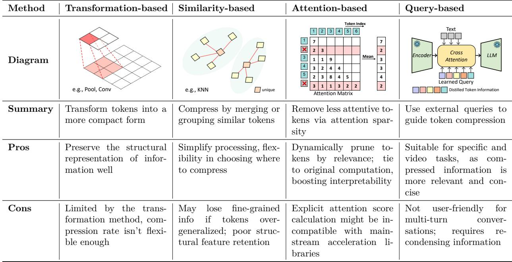
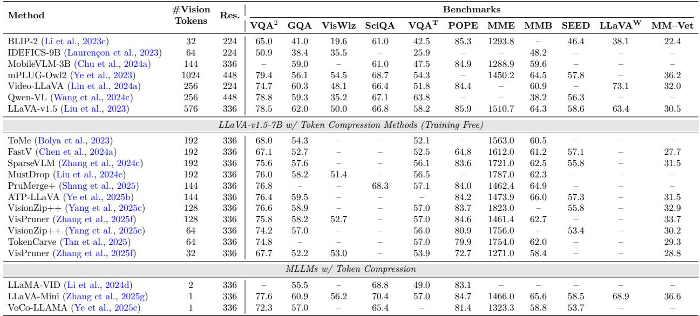

[← 返回 README](../README.md)

# 3 Image-centric Token Compression

## 📌 预览
本章是全文最核心的方法论章节。按四种机制分类介绍图像 token 压缩：Transformation-based（像素重排/池化/卷积）、Similarity-based（ToMe 等合并方法）、Attention-based（Encoder/Decoder 内的注意力剪枝）、Query-based（Token 蒸馏/跨模态选择）。

---

Multimodal long context token compression methods generally fall into four categories based on their underlying mechanisms: transformation-based approaches directly transform the cross-modality information to compress tokens by altering their scale or representation; similarity-based techniques reduce tokens by leveraging the inherent resemblances between them; attention-based strategies exploit the sparsity of attention within the multimodal data to guide compression; and query-based methods selectively refine multimodal information, guided by prompts, to distill the most relevant tokens. Each of these methods has its own set of advantages and disadvantages, which are summarized in Table 1. Representative image-centric token compression methods are further compared in Table 2.

> 💡 **四大类方法速览**:
> - **Transformation**: 直接变换表示（池化/卷积/像素重排）→ 保结构但压缩率不灵活
> - **Similarity**: 合并相似 token → 灵活但可能丢失空间信息
> - **Attention**: 利用注意力稀疏性剪枝 → 动态但与 FlashAttention 不兼容
> - **Query**: 用查询引导压缩 → 精准但不适合多轮对话

*Table 1: Four Categories of Methods Based on Intrinsic Mechanisms: Diagram, Summary, and Pros & Cons.*

> 💡 **Table 1 批读**:
> - **Transformation**: 保留信息结构好，但压缩率受限于变换方法（通常固定 25%）
> - **Similarity**: 灵活选择压缩位置，但可能过度泛化丢失细粒度信息、空间结构保留差
> - **Attention**: 动态剪枝、可解释性强，但显式注意力计算与 FlashAttention 等加速库不兼容
> - **Query**: 压缩信息更相关精炼，适合特定任务和视频，但不友好于多轮对话（需重新压缩）

---

## 3.1 Transformation-based Image-centric Compression

Transformation-based image-centric compression methods leverage the spatial redundancy inherent in 2D image representations. Some image token compression techniques are derived from image downsampling operations (e.g., pooling, bilinear interpolation). Based on the specific transformation method, these can be broadly categorized as follows:

> 💡 **Transformation 方法本质**: 利用图像的 2D 空间冗余，通过下采样操作压缩 token 数。

### 3.1.1 Pixel Unshuffle

Pixel unshuffle is the inverse operation of pixel shuffle. It transforms a feature map from a high spatial resolution with a small number of channels into a lower-resolution feature map with a larger number of channels. This reduces the number of tokens. The transformation can be mathematically expressed as:

$$\text{Pixel Unshuffle: } H \times W \times D \to \frac{H}{r} \times \frac{W}{r} \times (D \cdot r^2),$$

where H, W denote the height and width of the token grid, D is the hidden dimension of each token, and r is the downsampling ratio. Here r is a positive integer, typically 2. Therefore, as summarized in Table 1, the token compression ratio for transformation-based methods is usually limited to a few specific values, generally compressing the number of tokens to 25%.

> 💡 **Pixel Unshuffle 原理**: 把空间分辨率降低 r 倍，通道数增加 r² 倍。r=2 时，token 数变为原来的 1/4（25%）。这是 Pixel Shuffle（超分辨率中的上采样操作）的逆操作。

Recent works like InternVL series (Chen et al., 2024c;b; Gao et al., 2024b; Zhu et al., 2025a), Qwen2 series (Wang et al., 2024c; Bai et al., 2025), and NVLM (Dai et al., 2024) utilize pixel unshuffle to reduce the tokens generated by the vision tower by a factor of one-quarter. Subsequently, an MLP is employed to align the visual dimension with the text dimension, addressing the mismatch in the hidden dimension.

> 💡 **谁在用 Pixel Unshuffle**: InternVL 系列、Qwen2 系列、NVLM — 都是顶级 MLLM。先 pixel unshuffle 降 4 倍 token，再用 MLP 对齐隐藏维度。这已经是 MLLM 的标配操作。

### 3.1.2 Spatial Pooling / Interpolation

Unlike pixel unshuffle, pooling and interpolation directly perform 2D downsampling on tokens, without altering the hidden dimension. This process can be defined as:

$$\text{Pooling / Interpolation: } H \times W \times D \to \frac{H}{S} \times \frac{W}{S} \times D,$$

where S is the downsampling factor.

> 💡 **与 Pixel Unshuffle 的区别**: 池化/插值不改变隐藏维度 D，直接降低空间分辨率。更简洁。

LLaVA-OneVision (Li et al., 2025a) employs bilinear interpolation for 2D downsampling of aligned tokens, while LLaVA-Video (Zhang et al., 2024d) uses average pooling for downsampling. M³ (Cai et al., 2024a) utilizes a simple pooling operation to learn an inherently multi-granular representation during training. This allows the model to achieve comparable performance with fewer tokens during inference, effectively addressing efficiency concerns. DeCo (Yao et al., 2024) argues that the Q-former (Liu et al., 2023; Li et al., 2023c) is an inefficient visual compressor and similarly achieves token compression through a straightforward average pooling approach, leading to improved convergence efficiency and performance.

> 💡 **代表方法**:
> - **LLaVA-OneVision**: 双线性插值下采样
> - **LLaVA-Video**: 平均池化下采样
> - **M³ (Matryoshka)**: 训练时学习多粒度表示，推理时可用更少 token
> - **DeCo**: 认为 Q-Former 是低效的视觉压缩器，简单平均池化反而更好

### 3.1.3 Spatial Convolution

Convolutional operations offer a more sophisticated approach to token compression compared to simple pooling or interpolation, by learning to abstract local information while reducing spatial dimensions. The transformation can be expressed as:

$$\text{Convolution: } H \times W \times D_{in} \to \frac{H}{S} \times \frac{W}{S} \times D_{out},$$

where S is the stride, which determines the downsampling factor, and D_in, D_out represent the input and output channel dimensions, respectively.

Honeybee (Cha et al., 2024) proposes the C-Abstractor, which uses convolution to extract and compress token information while preserving locality. MobileVLM (Chu et al., 2023), on the other hand, employs an LDP module that utilizes depth-wise convolution to reduce the number of tokens by 75%.

> 💡 **卷积的优势**: 相比池化，卷积是参数化的，能学习更精细的局部信息抽象。
> - **Honeybee (C-Abstractor)**: 卷积提取 + 压缩，保留局部性
> - **MobileVLM (LDP)**: 深度可分离卷积，token 数减少 75%

### 3.1.4 Comparative Analysis of Transformation Methods

These transformation-based image-centric compression methods effectively utilize all image tokens while consciously preserving the spatial local information of 2D features. Pixel unshuffle, pooling, and interpolation are inherently parameter-free, thus introducing no additional weight overhead, a key advantage. In contrast, convolution learn a more sophisticated local abstraction by introducing trainable weights.

Another notable difference lies in how these methods handle feature dimensions: pixel unshuffle typically alters the hidden dimension, necessitating a subsequent trained MLP to align with the text dimension. Conversely, pooling and interpolation can be implemented in a training-free manner as they operate directly on the aligned token dimension.

By extracting more condensed information, they achieve a superior balance between performance and efficiency. However, due to the inherent characteristics of 2D downsampling, their token compression ratios are typically limited to a few specific magnitudes, with a 25% compression rate being the most common.

> 💡 **Transformation 方法对比总结**:
> | 方法 | 参数 | 维度变化 | 是否需训练 |
> |------|------|---------|-----------|
> | Pixel Unshuffle | 无 | D → D·r² | 需 MLP 对齐 |
> | 池化/插值 | 无 | D 不变 | 可 training-free |
> | 卷积 | 有 | 可变 | 需要训练 |
> 
> 共同局限：压缩率通常固定在 25%（4 倍），不够灵活。

---

## 3.2 Similarity-based Image-centric Compression

Similarity-based image-centric compression methods reduce the number of visual tokens by identifying and merging similar tokens based on their distance or similarity in an implicit space. This typically involves selecting representative cluster-center tokens to encapsulate visual information.

> 💡 **核心思路**: 找相似的 token → 合并/聚类 → 用代表性 token 概括视觉信息。

Early works in this area include ToMe (Bolya et al., 2023), an acceleration method for ViTs. ToMe introduces a token merge module between the attention and MLP blocks, calculating token similarity and merging similar tokens via bipartite soft matching. This process creates a new set of tokens, τ, by replacing the most similar tokens with their merged representations.

$$\mathcal{T} = (\mathcal{T}_{original} \setminus \bigcup_{i=1}^{k} C_i) \cup \{ \text{Merge}(C_i) \}_{i=1}^{k},$$

where each C_i is a set of tokens identified as highly similar by ToMe's matching algorithm.

> 💡 **ToMe (Token Merging)**: 最经典的 similarity-based 方法。在 attention 和 MLP block 之间插入 merge 模块，用 bipartite soft matching 找到最相似的 token 对并合并。公式含义：从原始 token 集中移除被合并的 token，加入合并后的新 token。

In the context of MLLMs, FOLDER (Wang et al., 2025a) employs a similar approach, inserting a token merge module within the last attention block of the vision encoder. This reduces the number of tokens that were subsequently passed to the LLM decoder. DivPrune (Alvar et al., 2025) reframes the token compression problem as a Max-Min diversity problem (Porumbel et al., 2011), aiming to select a subset of tokens with maximal internal differences. AuroraCap (Chai et al., 2025) adopts a strategy consistent with ToMe, performing token merging within each attention and MLP block of the vision tower. This progressively reduces the number of tokens throughout the ViT model. While the aforementioned methods primarily leverage similarity-based clustering of tokens within the ViT, TopV (Yang et al., 2025a) extends this principle to compress tokens within the LLM layers. TopV comprehensively considers both the similarity and distance functions between features to guide the token compression process, operating directly within the multimodal representation space of the LLM.

> 💡 **MLLM 中的 Similarity 方法**:
> - **FOLDER**: 在 vision encoder 最后一个 attention block 中合并
> - **DivPrune**: 换个视角——选择「差异最大化」的 token 子集（Max-Min diversity）
> - **AuroraCap**: 在 ViT 每一层都做 ToMe，渐进式减少 token
> - **TopV**: 首个在 LLM 层内部做 similarity-based 压缩的方法（不限于 ViT）

### 3.2.1 Analysis of Similarity Methods

While similarity-based methods effectively reduce tokens, this merging often overlooks the original spatial information of the tokens, leading to spatial misunderstanding (in Tab. 1). Subsequent work frequently employs methods like DPC-KNN (Du et al., 2016; Rodriguez & Laio, 2014) or techniques focused on local spatial similarity merging to prevent excessive spatial information degradation. Furthermore, when tokens are overgeneralized, similarity-based methods struggle to distinguish between them, easily leading to misjudgment.

> 💡 **Similarity 方法的局限**:
> 1. **空间信息丢失**: 合并打乱了 token 的原始空间位置，导致空间理解错误
> 2. **过度泛化**: 当 token 被过度合并后难以区分，容易误判
> 3. **缓解方法**: DPC-KNN（密度峰值聚类）、局部空间相似性合并

---

## 3.3 Attention-based Image-centric Compression

Attention-based token compression methods leverage the inherent sparsity of visual feature attention to guide token pruning. Tokens with low attention scores can often be considered removable without significantly impacting the original computation. Specifically, these methods utilize the attention mechanism to identify and preserve pivotal tokens. It is worth noting that this shares the same underlying philosophy as sparse attention methods (Yuan et al., 2025; Zhang et al., 2025d; Lu et al., 2025; Yin et al., 2025), which focus on executing the critical attention computations, yet manifest at a different scale: the former operates on token quantity while the latter operates on computational pathways. In vision language models, both the vision encoder and the LLM decoder incorporate transformers. Consequently, attention-based compression strategies can be broadly categorized into those applied within the encoder and those within the decoder.

> 💡 **Attention-based 的核心思想**: 注意力分数低的 token 可以安全移除。与 sparse attention 的区别是：token 压缩减少 token 数量，sparse attention 减少计算路径。
> 
> **两个方向**: Encoder 内（ViT）和 Decoder 内（LLM）。

### 3.3.1 Attention in Encoder

Methods focusing on the vision encoder primarily select visual tokens based on attention scores within a single image or crops, relying on the capabilities of the vision transformer (ViT). This reduces the number of visual tokens before they're passed to the LLM. To achieve this, the set of retained tokens, τ_encoder, is determined by selecting the top k tokens based on their attention scores relative to the [CLS] token:

$$\mathcal{T}_{encoder} = \text{TopK}_k(\{ \text{Attention}(\mathbf{v}_i, \mathbf{v}_{cls}) | \mathbf{v}_i \in \mathcal{V} \}),$$

where V is the original set of visual tokens, v_i is the i-th visual token, and v_cls is the [CLS] token. This strategy ensures that only the most salient visual information, as highlighted by the [CLS] attention, is carried forward for further processing.

> 💡 **Encoder 内压缩原理**: 用 [CLS] token 对每个视觉 token 的注意力分数排序，保留 Top-K。[CLS] token 聚合了全局信息，attention score 高的 token 含更重要的视觉信息。

Prumerge (Shang et al., 2025) selects cluster centers for visual tokens based on [CLS] attention in the encoder. It then merges the remaining less attentive tokens using K-nearest neighbors (KNN) clustering and a weighted cluster center update mechanism. VisionZip (Yang et al., 2025c) retains visual tokens with high attention scores and subsequently merges the remaining tokens through clustering. VisPruner (Zhang et al., 2025f) similarly preserves a subset of high-attention visual tokens. Then it progressively removes duplicates based on similarity in multiple rounds, ultimately retaining an additional set of diverse tokens. GlobalCom² (Liu et al., 2025c) employs a hierarchical strategy. It coordinates the attention scores of thumbnail tokens to guide the pruning of high-resolution crops, thereby achieving effective global context reduction.

> 💡 **Encoder Attention 方法**:
> - **PruMerge**: [CLS] attention 选中心 → KNN 合并剩余 → 加权更新聚类中心。融合了 attention 和 similarity 两种思路
> - **VisionZip**: 保留高 attention token + 聚类合并低 attention token
> - **VisPruner**: 保留高 attention + 多轮去重（渐进式）
> - **GlobalCom²**: 层次化策略——用缩略图 attention 指导高分辨率裁切的剪枝

*Table 2: Comparison of Training-Free Token Compression Methods for Image LLMs in Understanding Tasks*

> 💡 **Table 2 批读** — Training-Free 图像压缩方法对比:
> - **基线 LLaVA-v1.5-7B**: 576 视觉 token，VQA² 78.5，MME 1510.7
> - **最激进压缩 (32 token)**: VisPruner 32 token，VQA² 仍有 52.2（降幅明显）
> - **性能-效率甜蜜点**: 128-144 token 区间（VisionZip++ 128 token VQA² 76.6，接近原始 78.5）
> - **训练方法的极限**: LLaVA-Mini 仅 1 个视觉 token VQA² 77.6！说明训练时压缩可以做得非常极端
> - **关键发现**: Training-free 方法在 ~22% token 保留率时接近无损性能

### 3.3.2 Attention in Decoder

Unlike attention-based compression within the encoder, methods focusing on attention in the decoder leverage the capabilities of the LLMs to guide token compression. Here, attention is computed across all tokens within the LLM's attention window, which includes not only visual tokens but also textual tokens. This allows the LLM to determine the importance of visual and textual information in a joint space, leading to more contextaware token pruning.

A common approach for compression in the decoder involves selecting the most salient visual tokens. The set of retained tokens, τ_decoder, is typically determined by choosing the top k visual tokens based on the average attention they receive from all other tokens in that layer's attention window:

$$\bar{\mathcal{A}}(\mathbf{v}_i) = \frac{1}{|\mathcal{S}|} \sum_{\mathbf{s}_j \in \mathcal{S}} \text{Attention}(\mathbf{v}_i, \mathbf{s}_j),$$

$$\mathcal{T}_{decoder} = \text{TopK}_k(\{ \bar{\mathcal{A}}(\mathbf{v}_i) | \mathbf{v}_i \in \mathcal{V} \}),$$

where V denotes the set of visual tokens, and S represents the entire set of tokens present in the current layer's attention window (which may include visual, textual, or special tokens). This method allows the model to prioritize the visual information that is most relevant in the ongoing context.

> 💡 **Decoder 内压缩 vs Encoder 内压缩**:
> - Encoder: 只看视觉 token 内部的 attention（[CLS] → visual tokens）
> - Decoder: 综合所有 token（视觉+文本+系统）的 attention 来评估视觉 token 重要性
> - Decoder 方法能利用文本上下文信息，因此更「task-aware」

FastV (Chen et al., 2024a) is among the first to identify a significant inefficiency in large vision language models (LVLMs), namely the extremely low attention efficiency of visual tokens. For instance, in LLaVA-v1.5, visual tokens received only 0.21% of the attention obtained by system prompts after the second layer. FastV posits that this is due to an overabundance of visual signals, leading to specific features aggregating onto "anchor" tokens via shallow self-attention mechanisms. Consequently, pruning 50% of visual tokens based on attention scores after the second layer maintains maximal performance. PyramidDrop (Xing et al., 2025) structures the token compression process within the LLM into multiple stages. It employs progressive token compression to avoid excessive loss of visual information in shallower layers. VTW (Lin et al., 2025c) takes a more aggressive pruning approach, arguing that visual tokens can be entirely removed after a certain layer within the LLM. The specific layer for visual token removal is determined using a calibration dataset. FitPrune (Ye et al., 2025a) focuses on reducing the length of visual tokens per layer. It considers both the self-attention of visual tokens and their cross-attention with text tokens to guide compression. The goal is to find an optimal pruning "recipe" that minimizes the distributional gap before and after pruning. ST³ (Zhuang et al., 2025) dynamically reduces tokens during the generation process. It also progressively prunes inattentive visual tokens as the layer goes deeper. ATP-LLaVA (Ye et al., 2025b) introduces an adaptive token pruning (ATP) module within the decoder layers. This module trains threshold heads to adaptively predict pruning thresholds for the current layer and instance, thereby removing redundant or text-irrelevant visual tokens. ZipVL (He et al., 2025) achieves progressive compression by determining the compression ratio for each layer based on its attention score distribution. This allows for a granular and adaptive reduction of visual tokens throughout the model.

> 💡 **Decoder Attention 方法详解**:
> - **FastV** (开创性工作): 发现 LLaVA-v1.5 中视觉 token 在第 2 层后只获得 0.21% 的注意力！剪掉 50% 视觉 token 性能不降
> - **PyramidDrop**: 多阶段渐进压缩，避免浅层过度压缩
> - **VTW**: 更激进——某层之后完全移除所有视觉 token
> - **FitPrune**: 同时考虑视觉 self-attention 和视觉-文本 cross-attention，最小化剪枝前后的分布差距
> - **ST³**: 解码生成过程中动态减少 token
> - **ATP-LLaVA**: 训练 threshold heads 自适应预测每层每实例的剪枝阈值
> - **ZipVL**: 根据每层 attention 分布自适应确定压缩率

### 3.3.3 Critical Challenge for Pruning in Decoder

While these methods leverage attention scores within the LLM decoder to offer sophisticated ways to compress visual tokens, they face a significant practical challenge: the explicit need to access attention scores. This direct access is often incompatible with highly optimized acceleration libraries like FlashAttention (Dao et al., 2022; Dao, 2024), which compute attention implicitly or in a fused manner for speed. This incompatibility can be mitigated by performing an additional, separate attention calculation solely for pruning purposes. However, for progressive pruning strategies such as FitPrune, ST3, and ZipVL, this additional computational overhead becomes significantly more pronounced, potentially negating the efficiency gains.

> 💡 **Decoder 剪枝的致命问题 — FlashAttention 不兼容**:
> - FlashAttention 把矩阵乘法和 softmax 融合加速，不暴露中间 attention scores
> - 但 attention-based 剪枝方法需要显式访问 attention scores
> - 渐进式剪枝（FitPrune, ST³, ZipVL）尤其受影响，因为每层都需要额外的注意力计算
> - **这是一个工程 vs 算法的 gap**，限制了这些方法的实际部署

---

## 3.4 Query-based Image-centric Compression

Visual information often contains a substantial amount of features irrelevant to the given query. Querybased image-centric compression leverages the query prompt to guide the compression of visual tokens. These methods can be broadly categorized into two types: (1) Token Distillation: These methods compress visual tokens by distilling visual tokens into a specific, reduced number of tokens. (2) Cross-Modal Selection: These approaches compress tokens by matching between modality-aligned visual and text tokens.

> 💡 **Query-based 两个子类**:
> 1. **Token Distillation**: 用可学习 query 蒸馏视觉 token → 固定数量的紧凑 token
> 2. **Cross-Modal Selection**: 利用文本-视觉对齐做跨模态筛选

### 3.4.1 Token Distillation

Token distillation originates from the early projector designs of MLLM. The goal is to distill visual tokens to learn the most text-relevant visual representations, reduce visual tokens while also aligning modalities.

The Q-Former series (Liu et al., 2023; Li et al., 2023c), a pioneering approach, uses learnable queries and cross-attention to extract pertinent visual cues from visual features. Similarly, mPLUG-Owl (Ye et al., 2023), MiniGPT-4 (Zhu et al., 2024), Flamingo (Alayrac et al., 2022), and Qwen-VL (Bai et al., 2023) all employ variations of learnable query-based architectures to condense visual information into a smaller fixed set of tokens that are then aligned with the language model. LLaMA-VID (Li et al., 2024d) employs a highly aggressive approach to visual token compression. For a single image or video frame, it utilizes context attention where the text query aggregates text-related visual cues from the visual embedding. Ultimately, it represents an entire image's information using only two tokens. LLaVA-Mini (Zhang et al., 2025g) achieves comparable performance by pre-fusing visual information directly into text tokens, requiring just one visual token. While previous methods relied on external modules for visual token compression, VoCo-LLaMA (Ye et al., 2025c) is notable as the first approach to use LLMs themselves for visual token compression. It distills the LLM's understanding of visual tokens into the processing of VoCo tokens via attention distillation. Victor (Wen et al., 2024) introduces a small number of learnable "register tokens" after the visual tokens. It then uses the shallow layers of a large model to distill visual information into these registers, discarding all original visual tokens to significantly improve inference and training efficiency.

> 💡 **Token Distillation 方法演进**:
> - **Q-Former** (BLIP-2): 开山之作，learnable queries + cross-attention 蒸馏视觉 token
> - **Flamingo / mPLUG-Owl / MiniGPT-4 / Qwen-VL**: 各种 learnable query 变体
> - **LLaMA-VID**: 极限压缩——整张图片 → 2 个 token！
> - **LLaVA-Mini**: 更极限——1 个视觉 token，通过预融合视觉信息到文本 token
> - **VoCo-LLaMA**: 首次用 LLM 自身做视觉 token 压缩（attention distillation）
> - **Victor**: learnable register tokens 在浅层吸收视觉信息，然后丢弃原始视觉 token

### 3.4.2 Cross-Modal Selection

Cross-modal selection aims to reduce the number of tokens in one modality by leveraging aligned tokens from another. This compression is achieved by identifying and retaining only the most relevant information across modalities, leading to more efficient and effective processing. Several notable approaches have been proposed to address this challenge:

SparseVLM (Zhang et al., 2024c) employs visual tokens to pre-select relevant text tokens. By leveraging the visual modality as an initial filter, SparseVLM efficiently narrows down the textual search space, focusing on information pertinent to the visual content. AdaFV (Han et al., 2025) employs a dual-metric approach for selecting the most informative visual tokens. It calculates both text-to-image similarity and visual saliency extracted from the vision encoder. By combining these two indicators, AdaFV identifies visual tokens that are not only semantically aligned with the text but also visually prominent or significant. TRIM (Song et al., 2025a) introduces a unique method that begins by identifying outlier tokens based on the similarity between text and visual tokens; these outliers are deemed important. Subsequently, a clustering algorithm is utilized to merge the remaining, less critical tokens. This approach prioritizes distinct, highly relevant tokens before consolidating the rest.

> 💡 **Cross-Modal Selection 方法**:
> - **SparseVLM**: 反向操作——用视觉 token 筛选文本 token（大多数方法是用文本筛选视觉）
> - **AdaFV**: 双指标——text-image 相似度 + 视觉显著性，两者结合选 token
> - **TRIM**: 先找异常值 token（text-visual 相似度高的） → 聚类合并剩余 token

### 3.4.3 Analysis of Similarity Methods

While query-based methods can precisely retain query-relevant tokens compared to the three prior approaches, they are unsuitable for multi-turn QA scenarios. This is because the initial query's token retention is based on its specific question. A subsequent query may target different tokens, necessitating a re-execution of the token compression process. This makes the approach highly inefficient for multi-turn conversations.

> 💡 **Query-based 的致命弱点**: 不适合多轮对话！因为每个 query 保留的 token 不同，新问题可能需要之前被丢弃的 token，必须重新执行压缩。这在实际聊天场景中非常低效。

---

## 🔖 Section 总结

### 关键数字速查
| 指标 | 数值 |
|------|------|
| Transformation 典型压缩率 | 25%（4 倍） |
| FastV 发现的视觉 attention 比例 | 0.21%（第 2 层后） |
| FastV 安全剪枝比例 | 50% |
| LLaMA-VID 每张图 token 数 | 2 |
| LLaVA-Mini 每张图 token 数 | 1 |
| Training-free 甜蜜点 | ~128 token（从 576 压到 22%） |

### 四类方法对比速查
| 方法类型 | 优势 | 劣势 | 代表作 |
|---------|------|------|--------|
| Transformation | 保结构、无参数 | 压缩率固定 | InternVL, Qwen2 |
| Similarity | 灵活 | 丢空间信息 | ToMe, DivPrune |
| Attention | 动态、可解释 | FlashAttention 不兼容 | FastV, PyramidDrop |
| Query | 精准 task-aware | 不适合多轮对话 | Q-Former, LLaMA-VID |
