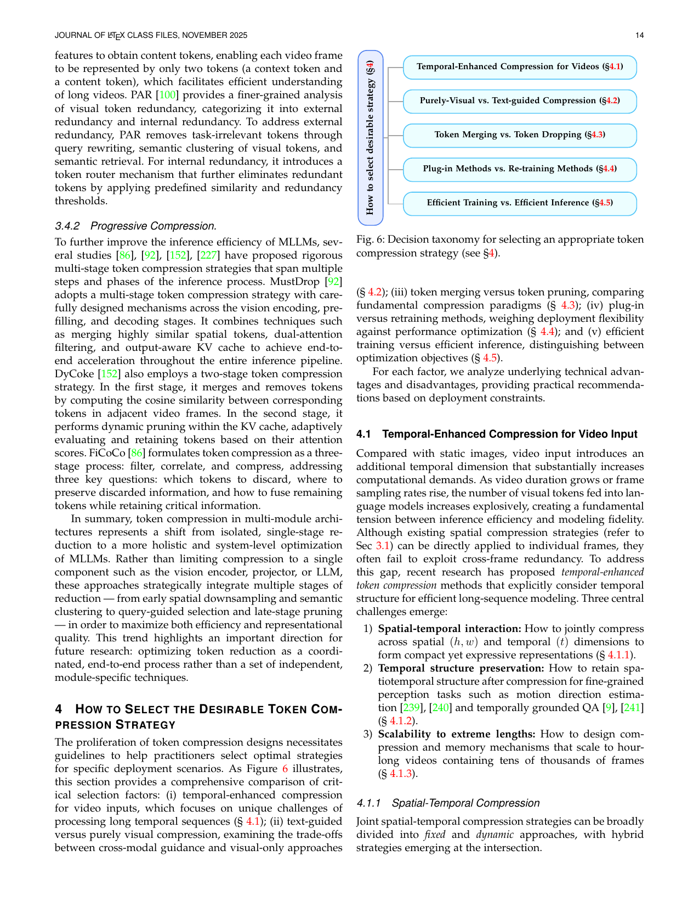
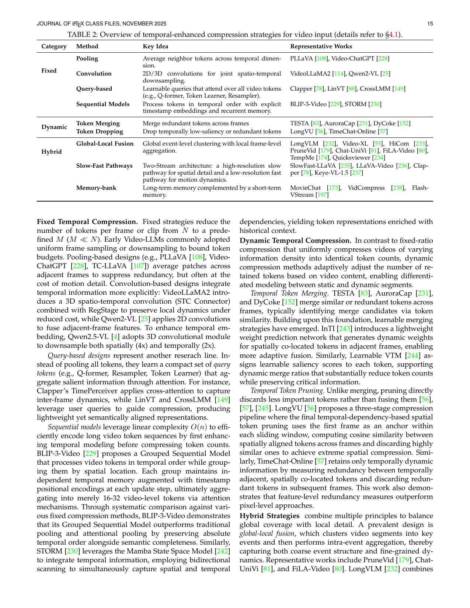
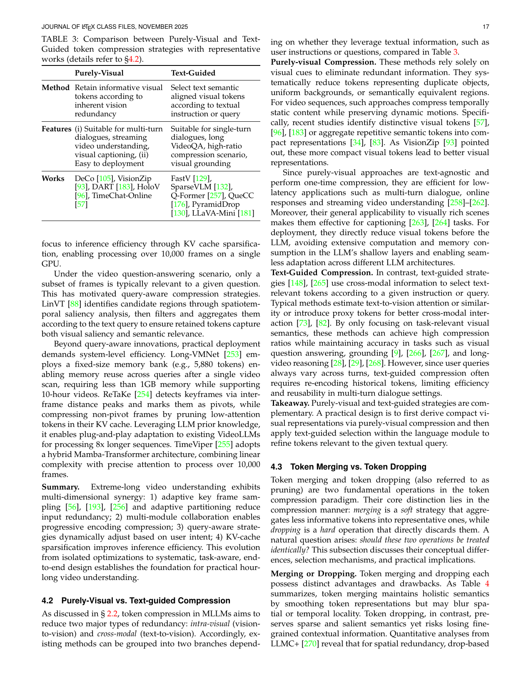
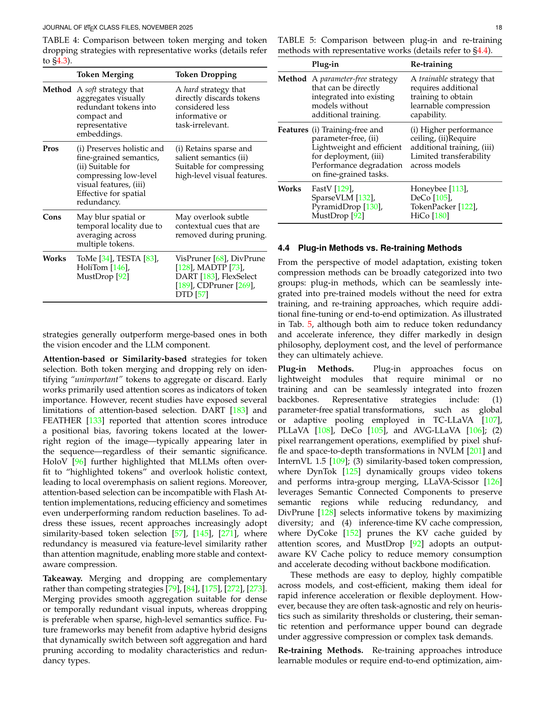
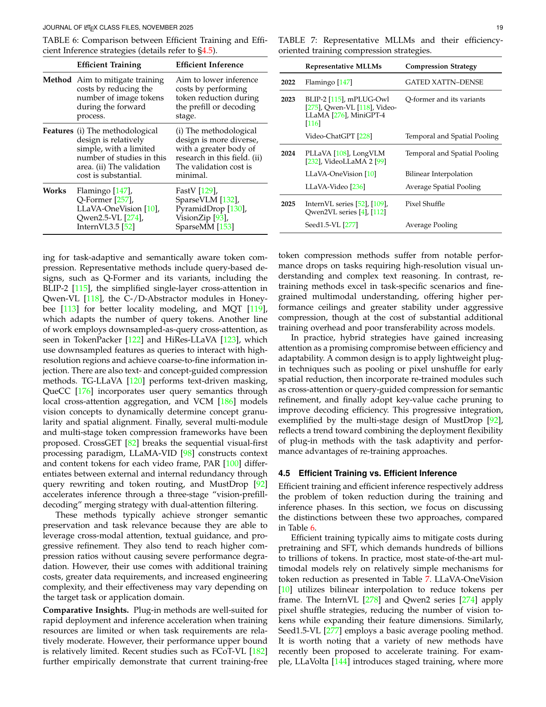

[← 返回 README](../README.md)

# 4. How to Select the Desirable Token Compression Strategy

## 📌 预览
本 Section 从 5 个决策维度分析如何选择合适的 token compression 策略：(1) 视频时序压缩；(2) 纯视觉 vs. 文本引导；(3) Token Merging vs. Dropping；(4) Plug-in vs. Re-training；(5) 高效训练 vs. 高效推理。

---

The proliferation of token compression designs necessitates guidelines to help practitioners select optimal strategies for specific deployment scenarios. As Figure 6 illustrates, this section provides a comprehensive comparison of critical selection factors.

*Figure 6: Decision taxonomy for selecting an appropriate token compression strategy.*

> 💡 **Figure 6 批读**: 五个决策维度构成选择路线图：Temporal Enhancement → Purely-Visual vs. Text-guided → Merging vs. Dropping → Plug-in vs. Re-training → Training vs. Inference。

---

## 4.1 Temporal-Enhanced Compression for Video Input

Compared with static images, video input introduces an additional temporal dimension that substantially increases computational demands. Three central challenges emerge:

1. **Spatial-temporal interaction**: How to jointly compress across spatial and temporal dimensions (§4.1.1)
2. **Temporal structure preservation**: How to retain spatiotemporal structure for fine-grained perception tasks (§4.1.2)
3. **Scalability to extreme lengths**: How to scale to hour-long videos with tens of thousands of frames (§4.1.3)

### 4.1.1 Spatial-Temporal Compression

*Table 2: Overview of temporal-enhanced compression strategies for video input.*

> 💡 **Table 2 批读**: 视频压缩策略分三大类：
> - **Fixed**: Pooling / Convolution / Query-based / Sequential Models — 固定压缩率
> - **Dynamic**: Token Merging / Token Dropping — 根据内容自适应
> - **Hybrid**: Global-Local Fusion / Slow-Fast / Memory-bank — 组合策略
> 
> **关键对比**: Fixed 简单高效但忽略内容差异；Dynamic 自适应但计算开销大；Hybrid 是当前最优实践。

**Fixed Temporal Compression.** Early Video-LLMs adopted uniform frame sampling or downsampling. Pooling-based designs (PLLaVA, Video-ChatGPT) average patches across adjacent frames. Convolution-based designs (VideoLLaMA2, Qwen2-VL) integrate temporal information more explicitly via 3D spatio-temporal convolution. Query-based designs (Clapper, LinVT) learn compact query tokens through attention. Sequential models (BLIP-3-Video, STORM) leverage O(n) complexity to efficiently encode long video sequences.

**Dynamic Temporal Compression.** Dynamic methods adaptively adjust retained tokens based on video content. *Temporal Token Merging*: TESTA, AuroraCap, DyCoke merge redundant tokens across frames. InTI introduces dynamic weights for spatially co-located tokens. *Temporal Token Pruning*: LongVU proposes three-stage compression with temporal-dependency-based spatial pruning. TimeChat-Online retains only temporally dynamic information.

**Hybrid Strategies.** Global-local fusion clusters video segments into key events then performs intra-event aggregation (PruneVid, Chat-UniVi, FiLA-Video). Slow-fast dual streams (SlowFast-LLaVA, LLaVA-Video) process through slow pathway (low frame rate, high spatial detail) and fast pathway (high frame rate, compact tokens). Memory-bank mechanisms (Flash-VStream, MovieChat) combine sliding windows with long-term and short-term memory.

> 💡 **视频压缩的演进**: Pooling（最简单）→ 3D Conv（保留时序）→ Query-based（语义压缩）→ Dynamic（自适应）→ Slow-Fast/Memory（系统级设计）。越来越复杂但越来越有效。

### 4.1.2 Temporal Structure Preservation

During video compression, merging and pruning can blur or discard spatiotemporal positional information. Three approaches to preserve temporal structure:

**Temporal Positional Embeddings.** BLIP-3-Video processes frames with timestamp positional encodings. TimeChat-Online retains original Video-RoPE for important tokens. PVC uses relative timestamps via MLP.

**Temporal Encoding Modules.** STORM leverages Mamba-based state-space layers with bidirectional scanning. PVC adopts progressive encoding where each frame supplements previous frames.

**Special Timestamp Tokens.** Video-XL-2 interleaves timestamp tokens within visual token sequences. Qwen3-VL adopts textual token-based time encoding (e.g., `<3.0 seconds>`).

> 💡 **时序保持**: 压缩不能丢失"什么时候发生了什么"的信息。三种方案：位置编码（隐式）、时序编码模块（Mamba）、时间戳 token（显式）。Qwen3-VL 用文本时间戳是很巧妙的方案。

### 4.1.3 Extreme-Long Video Compression

In hour-long video scenarios, MLLMs must process thousands of frames.

MovieChat pioneered dual-memory mechanisms enabling 10,000+ frames on 24GB GPU. Video-XL series evolution: Video-XL (dynamic partitioning, 2048 frames, 16x compression) → Video-XL-Pro (ReCoT framework, 8000+ frames) → Video-XL-2 (KV cache sparsification, 10,000+ frames on single GPU). Query-aware strategies: LinVT, ReTaKe. System-level: Long-VMNet (fixed-size memory bank, <1GB for 10-hour videos). TimeViper uses hybrid Mamba-Transformer for 10,000+ frames.

> 💡 **极长视频**: 关键是多维协同 — (1) 自适应关键帧采样减少输入；(2) 多模块协作渐进压缩；(3) Query-aware 动态调整；(4) KV-cache 稀疏化加速推理。Video-XL 系列展示了清晰的演进路线。

---

## 4.2 Purely-Visual vs. Text-guided Compression

*Table 3: Comparison between Purely-Visual and Text-Guided token compression strategies.*

> 💡 **Table 3 批读**:
> - **Purely-Visual**: 适合多轮对话、流式视频、视觉描述。部署简单（one-time compression）
> - **Text-Guided**: 适合单轮对话、长视频 QA、高压缩率场景、视觉定位
> - **实践建议**: 先 purely-visual 粗压缩 → 再 text-guided 精筛选

**Purely-visual Compression.** Rely solely on visual cues. Reduce tokens for duplicate objects, uniform backgrounds, or semantically equivalent regions. Text-agnostic and one-time compression → efficient for multi-turn dialogue, streaming video. Easy deployment.

**Text-Guided Compression.** Use cross-modal information to select text-relevant tokens. Achieve high compression ratios while maintaining accuracy in VQA, grounding, and long-video reasoning. However, re-encoding needed for each new query → limited efficiency in multi-turn settings.

**Takeaway.** Purely-visual and text-guided are complementary. A practical design: first derive compact visual representations via purely-visual compression, then apply text-guided selection within the language module.

---

## 4.3 Token Merging vs. Token Dropping

*Table 4: Comparison between token merging and token dropping strategies.*

> 💡 **Table 4 批读**:
> - **Merging**: 保留整体和细粒度语义，适合压缩低级视觉特征和空间冗余。但可能模糊空间/时间局部性
> - **Dropping**: 保留稀疏/显著语义，适合压缩高级视觉特征。但可能丢失细微上下文线索
> - **LLMC+ 发现**: 对空间冗余，dropping 通常优于 merging（在 VE 和 LLM 中都是）

**Attention-based or Similarity-based strategies.** Early works used attention scores, but recent studies exposed limitations: DART and FEATHER reported positional bias (favoring lower-right region tokens); HoloV highlighted over-fitting to "highlighted tokens". Recent approaches increasingly adopt similarity-based token selection for more stable compression.

**Takeaway.** Merging and dropping are complementary. Merging suits dense/temporally redundant inputs; dropping suits sparse, high-level semantics. Future: adaptive hybrid designs that dynamically switch.

---

## 4.4 Plug-in Methods vs. Re-training Methods

*Table 5: Comparison between plug-in and re-training methods.*

> 💡 **Plug-in vs. Re-training**:
> - **Plug-in**: Training-free，轻量高效，易部署。但在细粒度任务上性能下降
> - **Re-training**: 性能上限更高，但需额外训练，跨模型迁移性差
> - **趋势**: Hybrid — 用 plug-in 做早期空间压缩 + re-trained 模块做语义精炼 + KV-cache 剪枝加速解码

---

## 4.5 Efficient Training vs. Efficient Inference

*Table 6: Comparison between Efficient Training and Efficient Inference strategies. Table 7: Representative MLLMs and their training compression strategies.*

> 💡 **Table 6-7 批读**: 
> - **高效训练**: 方法设计相对简单，但验证成本高。主流 MLLM（InternVL 用 Pixel Shuffle，Qwen2VL 用 Conv，Seed1.5-VL 用 Average Pooling）采用简单压缩
> - **高效推理**: 方法更多样化，验证成本低，是当前研究热点
> - **为什么训练侧创新少？** (1) Flash Attention 兼容性；(2) 训练验证成本高；(3) 压缩策略的归纳偏置可能损害通用能力

---

## 🔖 Section 总结

### 决策路线图速查
| 决策维度 | 推荐选择 |
|----------|----------|
| 视频 vs. 图像 | 视频需要时序增强压缩（Slow-Fast, Memory-bank） |
| Purely-Visual vs. Text-guided | 先 purely-visual 粗压缩 → 再 text-guided 精筛 |
| Merging vs. Dropping | 互补使用；空间冗余用 dropping，时间冗余用 merging |
| Plug-in vs. Re-training | Hybrid：plug-in 做早期压缩 + re-train 做语义精炼 |
| Training vs. Inference | 训练侧用简单方法（pooling/pixel shuffle），推理侧空间大 |

### 核心洞察
1. **没有银弹**: 每种方法都有适用场景，关键是匹配需求
2. **互补组合是趋势**: Merging + Dropping，Purely-Visual + Text-guided，Plug-in + Re-training
3. **训练侧保守**: 主流 MLLM 训练时仅用最简单的压缩（pooling/pixel shuffle）
4. **推理侧活跃**: 大量创新集中在推理加速，验证成本低是主因
